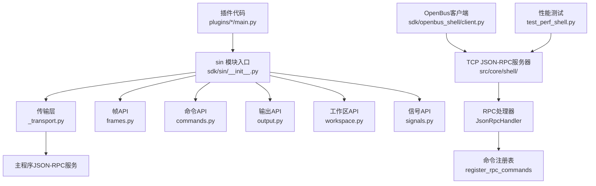
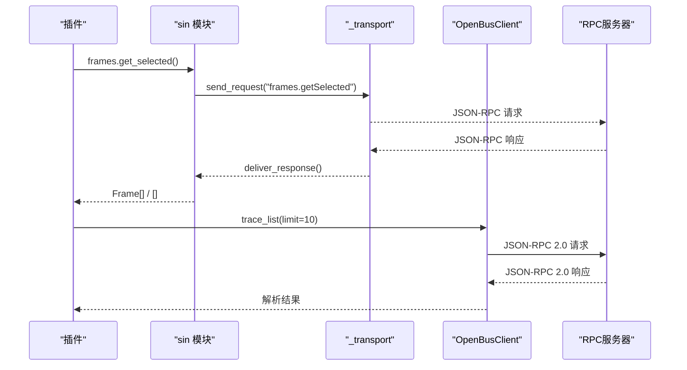
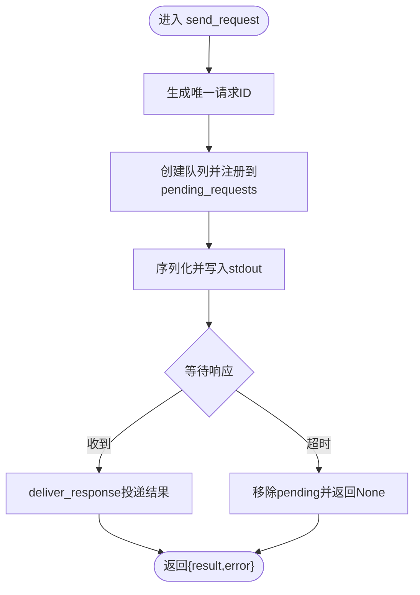
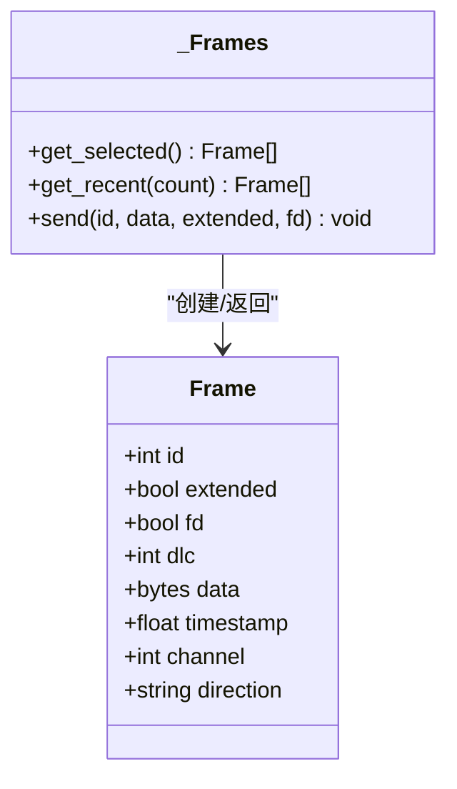
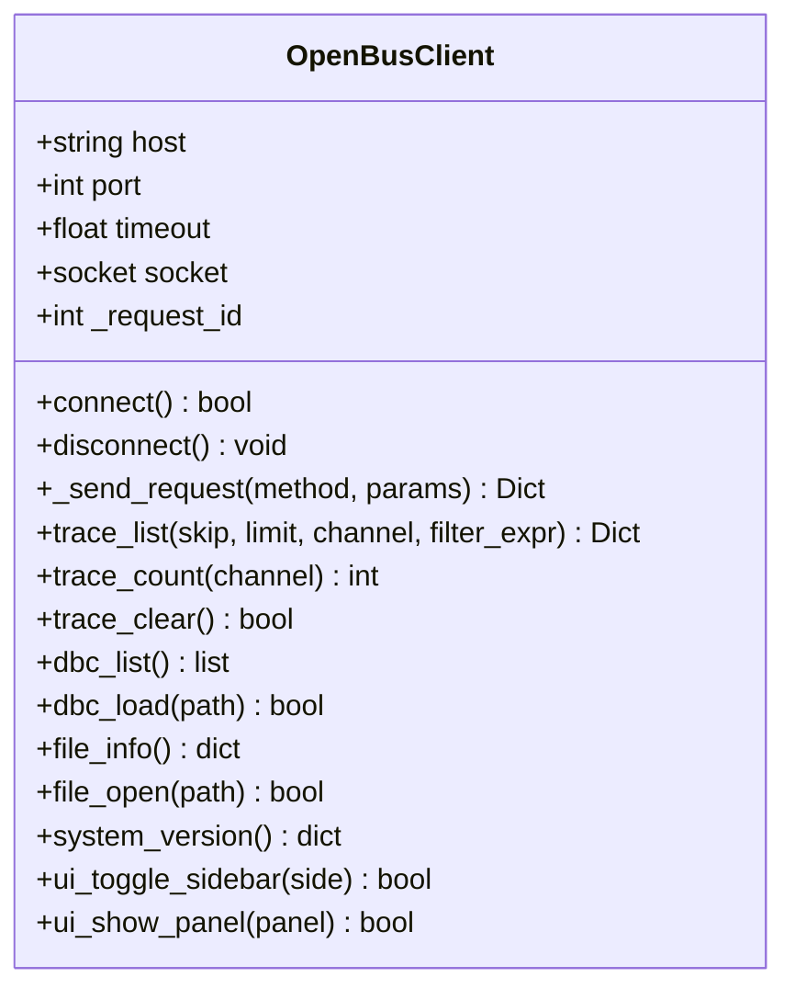
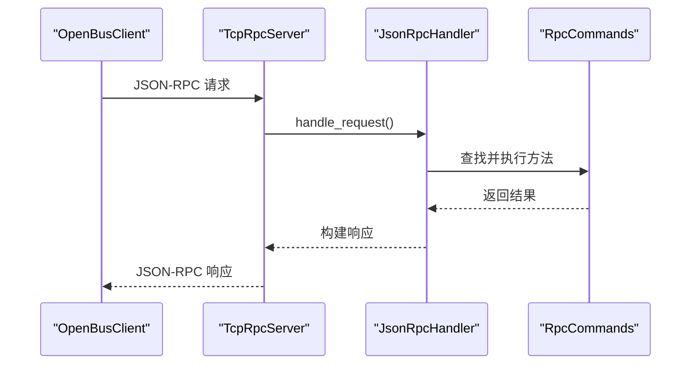
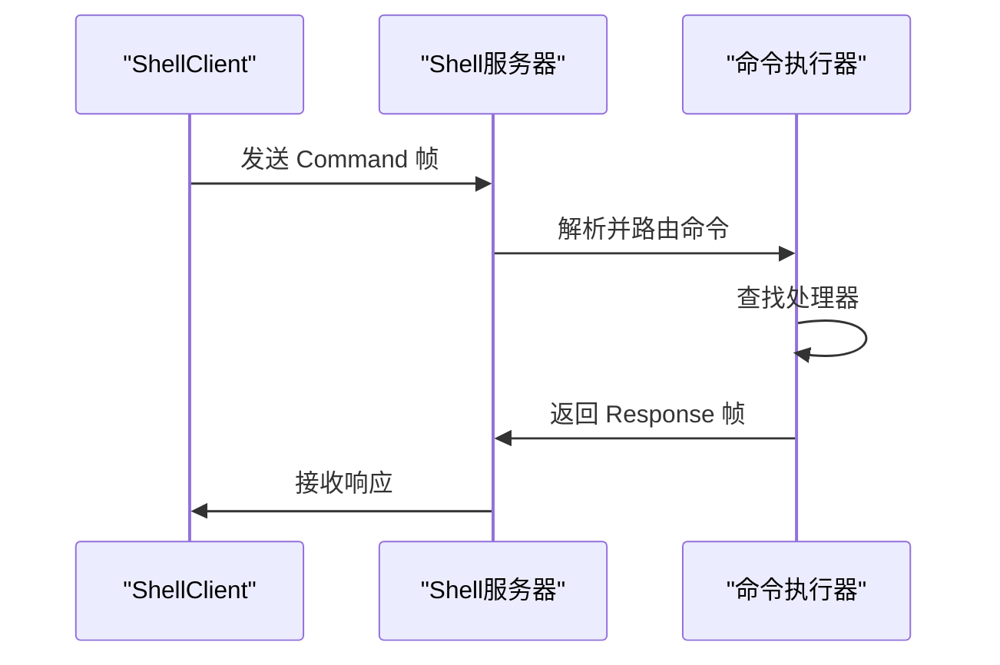
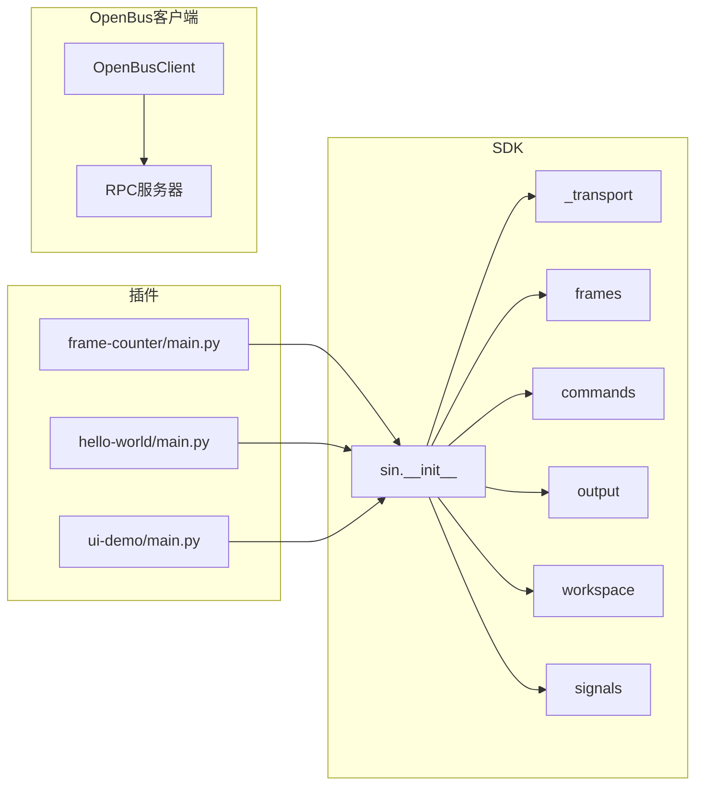

# Python SDK开发指南

<cite>
**本文引用的文件**
- [sdk/sin/__init__.py](file://sdk/sin/__init__.py)
- [sdk/sin/_transport.py](file://sdk/sin/_transport.py)
- [sdk/sin/frames.py](file://sdk/sin/frames.py)
- [sdk/sin/commands.py](file://sdk/sin/commands.py)
- [sdk/sin/output.py](file://sdk/sin/output.py)
- [sdk/sin/workspace.py](file://sdk/sin/workspace.py)
- [sdk/sin/signals.py](file://sdk/sin/signals.py)
- [sdk/openbus_shell/client.py](file://sdk/openbus_shell/client.py)
- [src/core/shell/http_rpc_server.h](file://src/core/shell/http_rpc_server.h)
- [src/core/shell/http_rpc_server.cpp](file://src/core/shell/http_rpc_server.cpp)
- [src/core/shell/rpc_commands.cpp](file://src/core/shell/rpc_commands.cpp)
- [tests/test_perf_shell.py](file://tests/test_perf_shell.py)
- [plugins/oai/README.md](file://plugins/oai/README.md)
</cite>

## 更新摘要
**所做更改**
- 新增 OpenBUS Shell Python 客户端库章节，介绍新的 HTTP-based RPC 服务器客户端
- 扩展架构总览，包含新的 TCP JSON-RPC 通信模式
- 新增 HTTP RPC 服务器详解章节，涵盖 JSON-RPC 2.0 协议实现
- 更新依赖关系分析，包含新的 OpenBusClient 模块
- 增强故障排查部分，添加新的 RPC 连接相关问题
- 新增性能基准测试章节，包含 OAI-02 二进制协议测试

## 目录
1. [简介](#简介)
2. [项目结构](#项目结构)
3. [核心组件](#核心组件)
4. [架构总览](#架构总览)
5. [详细组件分析](#详细组件分析)
6. [OpenBUS Shell Python 客户端库](#openbus-shell-python-客户端库)
7. [HTTP RPC 服务器详解](#http-rpc-服务器详解)
8. [OAI-02 协议详解](#oai-02-协议详解)
9. [依赖关系分析](#依赖关系分析)
10. [性能与可靠性](#性能与可靠性)
11. [故障排查](#故障排查)
12. [结论](#结论)
13. [附录：插件示例与最佳实践](#附录插件示例与最佳实践)

## 简介
本指南面向希望基于 sin 主程序扩展功能的开发者，系统讲解 Python SDK 的接口设计、通信机制、数据模型以及插件开发流程。通过该 SDK，插件可以：
- 接收总线帧事件并统计、处理
- 发送 CAN/CAN FD 报文
- 调用主程序命令
- 读取工程上下文（工程目录、DBC 列表、设置）
- 使用 DBC 进行信号解码/编码
- 可选地创建独立 PyQt6 窗口进行交互
- **新增**：通过 TCP JSON-RPC 2.0 协议与 OpenBUS Shell 服务器进行异步通信
- **新增**：使用 OpenBusClient 提供的高级 API 进行自动化测试和 AI Agent 集成

SDK 采用 JSON-RPC 通过标准输入输出与主进程通信，同时支持 TCP JSON-RPC 2.0 协议与 OpenBUS Shell 服务器通信，保证插件与宿主解耦且易于调试。

## 项目结构
Python SDK 位于 sdk/sin 目录，提供统一的 API 入口；插件位于 plugins 目录，每个插件包含 main.py 和 plugin.json。**新增**的 OpenBUS Shell Python 客户端库位于 sdk/openbus_shell 目录，提供高级 API 访问 HTTP-based RPC 服务器。



**图表来源**
- [sdk/sin/__init__.py:1-31](file://sdk/sin/__init__.py#L1-L31)
- [sdk/openbus_shell/client.py:10-133](file://sdk/openbus_shell/client.py#L10-L133)
- [src/core/shell/http_rpc_server.h:20-74](file://src/core/shell/http_rpc_server.h#L20-L74)

**章节来源**
- [sdk/sin/__init__.py:1-31](file://sdk/sin/__init__.py#L1-L31)
- [sdk/openbus_shell/client.py:1-180](file://sdk/openbus_shell/client.py#L1-L180)

## 核心组件
- 传输层 _transport：封装 JSON-RPC 通知与请求，维护请求队列与超时，线程安全写入 stdout。
- frames：CAN/CAN FD 帧对象与操作（获取选中帧、最近帧、发送帧）。
- commands：执行主程序注册的命令。
- output：向主程序输出面板追加或清空文本。
- workspace：获取工程目录、已加载 DBC 列表与应用设置。
- signals：基于 DBC 对 CAN 帧进行信号级解码与编码。
- ui（可选）：当存在 PyQt6 时暴露 UI 能力，用于创建独立窗口。
- **新增** OpenBusClient：TCP JSON-RPC 2.0 客户端，提供高级 API 访问 OpenBUS Shell 服务器功能。

**章节来源**
- [sdk/sin/_transport.py:1-72](file://sdk/sin/_transport.py#L1-L72)
- [sdk/sin/frames.py:1-92](file://sdk/sin/frames.py#L1-L92)
- [sdk/sin/commands.py:1-23](file://sdk/sin/commands.py#L1-L23)
- [sdk/sin/output.py:1-26](file://sdk/sin/output.py#L1-L26)
- [sdk/sin/workspace.py:1-51](file://sdk/sin/workspace.py#L1-L51)
- [sdk/sin/signals.py:1-56](file://sdk/sin/signals.py#L1-L56)
- [sdk/sin/__init__.py:1-31](file://sdk/sin/__init__.py#L1-L31)
- [sdk/openbus_shell/client.py:10-133](file://sdk/openbus_shell/client.py#L10-L133)

## 架构总览
插件通过 sin 模块提供的 API 与主程序通信。所有跨进程调用均经由 _transport 层以 JSON-RPC 形式完成，支持同步请求（带超时）与异步通知。**新增**的 OpenBusClient 提供独立的 TCP JSON-RPC 2.0 连接通道，使用标准化的 JSON-RPC 协议与 OpenBUS Shell 服务器通信。



**图表来源**
- [sdk/sin/frames.py:42-88](file://sdk/sin/frames.py#L42-L88)
- [sdk/sin/_transport.py:39-72](file://sdk/sin/_transport.py#L39-L72)
- [sdk/openbus_shell/client.py:37-68](file://sdk/openbus_shell/client.py#L37-L68)

## 详细组件分析

### 传输层 _transport
- 职责：统一发送通知与请求，管理请求 ID、等待队列与超时，线程安全写 stdout。
- 关键方法：
  - send_notification(method, params=None)：无返回的通知。
  - send_request(method, params=None, timeout=5.0)：阻塞等待响应，超时返回 None。
  - deliver_response(msg_id, result, error=None)：由宿主在主循环中调用，将响应投递给对应请求。
- 并发与健壮性：
  - 使用锁保护 pending_requests 与 stdout 写入。
  - 请求超时后清理队列，避免内存泄漏。



**图表来源**
- [sdk/sin/_transport.py:23-72](file://sdk/sin/_transport.py#L23-L72)

**章节来源**
- [sdk/sin/_transport.py:1-72](file://sdk/sin/_transport.py#L1-L72)

### 帧操作 frames
- Frame 数据模型：id、extended、fd、dlc、data、timestamp、channel、direction。
- 主要能力：
  - get_selected()：获取 Trace 中选中的帧列表。
  - get_recent(count=100)：获取最近 N 帧。
  - send(id, data, extended=False, fd=False)：发送一帧（支持 bytes 或 hex 字符串）。
- 复杂度与注意事项：
  - 获取帧为 O(N) 构造 Frame 对象，N 为返回帧数。
  - 发送帧为异步通知，不阻塞。



**图表来源**
- [sdk/sin/frames.py:9-92](file://sdk/sin/frames.py#L9-L92)

**章节来源**
- [sdk/sin/frames.py:1-92](file://sdk/sin/frames.py#L1-L92)

### 命令操作 commands
- 能力：execute(command_id, *args) 触发主程序已注册的命令。
- 特点：仅发送通知，不等待结果。

**章节来源**
- [sdk/sin/commands.py:1-23](file://sdk/sin/commands.py#L1-L23)

### 输出面板 output
- 能力：append(text)、clear()。
- 用途：在底部"插件输出"标签页显示日志或状态信息。

**章节来源**
- [sdk/sin/output.py:1-26](file://sdk/sin/output.py#L1-L26)

### 工作区 workspace
- 能力：
  - get_project_dir()：当前工程目录路径。
  - get_dbc_files()：已加载 DBC 文件列表。
  - get_setting(key, default=None)：读取应用设置。
- 返回值：均为空值或默认值时的安全降级。

**章节来源**
- [sdk/sin/workspace.py:1-51](file://sdk/sin/workspace.py#L1-L51)

### 信号解码/编码 signals
- 能力：
  - decode(can_id, data)：根据 DBC 将原始数据解码为信号名→值的映射。
  - encode(can_id, signal_values)：将信号值编码为 bytes。
- 注意：若无匹配 DBC 或编码失败，返回空字典或 None。

**章节来源**
- [sdk/sin/signals.py:1-56](file://sdk/sin/signals.py#L1-L56)

### UI 能力（可选）
- 当安装 PyQt6 时，sin.ui 可用，可创建独立窗口、控件与事件绑定。
- 未安装时自动跳过，不影响基础功能。

**章节来源**
- [sdk/sin/__init__.py:20-31](file://sdk/sin/__init__.py#L20-L31)

## OpenBUS Shell Python 客户端库

**新增** OpenBUS Shell Python 客户端库提供了与 OpenBUS Shell 服务器的 TCP JSON-RPC 2.0 通信能力，支持自动化测试、AI Agent 集成和脚本化工作流程。

### OpenBusClient 类
- **连接管理**：
  - connect()：建立 TCP 连接到默认端口 5555
  - disconnect()：关闭连接
  - 支持自定义主机、端口和超时配置

- **Trace API**：
  - trace_list(skip=0, limit=100, channel=None, filter_expr=None)：列出跟踪帧
  - trace_count(channel=None)：获取总帧数
  - trace_clear()：清空缓冲区

- **DBC API**：
  - dbc_list()：列出已加载的 DBC 文件
  - dbc_load(path)：加载 DBC 文件

- **File API**：
  - file_info()：获取当前工程信息
  - file_open(path)：打开工程文件

- **System API**：
  - system_version()：获取版本信息

- **UI API**：
  - ui_toggle_sidebar(side="right")：切换侧边栏可见性
  - ui_show_panel(panel="output")：显示指定面板



**图表来源**
- [sdk/openbus_shell/client.py:10-133](file://sdk/openbus_shell/client.py#L10-L133)

**章节来源**
- [sdk/openbus_shell/client.py:1-180](file://sdk/openbus_shell/client.py#L1-L180)

## HTTP RPC 服务器详解

**新增** HTTP RPC 服务器基于 Qt TCP Server 实现，提供标准的 JSON-RPC 2.0 协议支持，为 Python 客户端和其他语言客户端提供统一的远程调用接口。

### JsonRpcHandler 类
- **方法注册**：
  - register_method(method, func)：注册 JSON-RPC 方法处理器
  - handle_request(request)：处理单个 JSON-RPC 请求

- **协议支持**：
  - JSON-RPC 2.0 规范兼容
  - 支持 method、params、id 字段
  - 自动构建成功响应格式

### TcpRpcServer 类
- **服务器管理**：
  - start(port)：启动 TCP 监听器
  - stop()：停止服务器
  - on_new_connection()：处理新连接
  - on_socket_ready_read(socket)：处理数据读取

- **错误处理**：
  - JSON 解析错误处理
  - 内部异常捕获
  - 错误响应格式化



**图表来源**
- [src/core/shell/http_rpc_server.h:20-74](file://src/core/shell/http_rpc_server.h#L20-L74)
- [src/core/shell/http_rpc_server.cpp:25-62](file://src/core/shell/http_rpc_server.cpp#L25-L62)
- [src/core/shell/rpc_commands.cpp:141-176](file://src/core/shell/rpc_commands.cpp#L141-L176)

**章节来源**
- [src/core/shell/http_rpc_server.h:1-86](file://src/core/shell/http_rpc_server.h#L1-L86)
- [src/core/shell/http_rpc_server.cpp:1-178](file://src/core/shell/http_rpc_server.cpp#L1-L178)
- [src/core/shell/rpc_commands.cpp:1-179](file://src/core/shell/rpc_commands.cpp#L1-L179)

## OAI-02 协议详解

OAI-02 是 OpenBUS 命令行 Shell 交互协议的规范定义，采用二进制帧格式传输 JSON 负载，提供高性能的通信能力。

### 协议帧格式
```
┌─────────┬──────┬──────┬────────┬──────────┬──────┬─────────┬──────┐
│ Magic   │Ver   │Type  │SeqID   │PayloadLen│Flags │Payload  │CRC16 │
│ 2 bytes │1 byte│1 byte│4 bytes │4 bytes   │2 bytes│N bytes  │2 bytes│
└─────────┴──────┴──────┴────────┴──────────┴──────┴─────────┴──────┘
```

### 消息类型
- **Command (0)**：客户端 → 服务器：命令请求
- **Response (1)**：服务器 → 客户端：响应（成功/错误）
- **Event (2)**：服务器 → 客户端：推送事件（流式数据）

### 支持的命令模块
- **trace.***：跟踪帧操作（list、filter、export等）
- **graphic.***：图形界面控制（signal-add、zoom等）
- **dbc.***：DBC数据库操作（load、decode等）
- **file.***：文件操作（open、save-as等）
- **record.***：录制控制（start、pause、stop等）
- **system.***：系统管理（version、memory等）



**图表来源**
- [src/core/shell/shell_protocol.h:21-25](file://src/core/shell/shell_protocol.h#L21-L25)
- [src/core/shell/shell_command.h:99-111](file://src/core/shell/shell_command.h#L99-L111)

**章节来源**
- [doc/OAI-02-OpenBUS-CLI-Shell-Protocol.md:144-228](file://doc/OAI-02-OpenBUS-CLI-Shell-Protocol.md#L144-L228)
- [src/core/shell/shell_protocol.h:1-78](file://src/core/shell/shell_protocol.h#L1-L78)

## 依赖关系分析
- 模块耦合：
  - frames、commands、output、workspace、signals 均依赖 _transport。
  - __init__ 聚合导出各模块，供插件 import sin 直接访问。
  - **新增** OpenBusClient 独立于 sin 模块，可直接导入使用。
- 外部依赖：
  - PyQt6 为可选依赖，仅在 UI 相关场景需要。
  - **新增** socket 标准库用于 TCP 通信。
- 插件与 SDK：
  - 插件通过 context.on_frame 与 context.register_command 与宿主交互（见插件示例）。
  - 插件通过 sin.output、sin.frames、sin.commands、sin.workspace、sin.signals 调用 SDK。
  - **新增** 可通过 OpenBusClient 直接与 RPC 服务器通信。



**图表来源**
- [sdk/sin/__init__.py:14-31](file://sdk/sin/__init__.py#L14-L31)
- [sdk/openbus_shell/client.py:10-133](file://sdk/openbus_shell/client.py#L10-L133)

**章节来源**
- [sdk/sin/__init__.py:14-31](file://sdk/sin/__init__.py#L14-L31)
- [plugins/frame-counter/main.py:16-21](file://plugins/frame-counter/main.py#L16-L21)
- [plugins/hello-world/main.py:11-15](file://plugins/hello-world/main.py#L11-L15)
- [plugins/ui-demo/main.py:15-23](file://plugins/ui-demo/main.py#L15-L23)
- [sdk/openbus_shell/client.py:10-133](file://sdk/openbus_shell/client.py#L10-L133)

## 性能与可靠性
- 传输层性能：
  - 请求-响应为同步阻塞，建议合理设置 timeout，避免长时间占用线程。
  - stdout 写入加锁，确保多并发下消息顺序正确。
- 帧处理：
  - get_recent/get_selected 会构造多个 Frame 对象，批量处理时注意内存与 CPU 开销。
  - send 为异步通知，适合高频发送场景。
- **新增** OpenBusClient 性能：
  - TCP JSON-RPC 2.0 协议具有更高的吞吐量和更低的延迟。
  - 支持高并发连接，适合自动化测试场景。
  - 内置错误处理和重试机制。
- **新增** OAI-02 二进制协议性能：
  - 相比 JSON-RPC 具有更高的吞吐量和更低的延迟。
  - CRC16 校验确保数据传输完整性。
  - 支持高并发 TCP 连接（≥5个会话）。
- 错误恢复：
  - 请求超时返回 None，调用方需判空处理。
  - 解码/编码失败返回空字典/None，应做防御式编程。
  - **新增** RPC 连接异常处理，包括连接超时和数据损坏检测。

**章节来源**
- [sdk/sin/_transport.py:44-72](file://sdk/sin/_transport.py#L44-L72)
- [sdk/openbus_shell/client.py:20-68](file://sdk/openbus_shell/client.py#L20-L68)
- [tests/test_perf_shell.py:75-118](file://tests/test_perf_shell.py#L75-L118)

## 故障排查
- 无法收到响应：
  - 检查主程序是否正常运行并已实现对应 JSON-RPC 方法。
  - 确认 _transport.deliver_response 被宿主正确调用。
- 输出面板无内容：
  - 确认 output.append 的参数为字符串类型（内部会自动转换）。
- 帧发送无效：
  - 检查 CAN ID、数据格式（bytes 或 hex）、extended/fd 标志是否符合设备能力。
- DBC 解码为空：
  - 确认已加载匹配的 DBC 文件，且 can_id 与信号定义一致。
- UI 不可用：
  - 未安装 PyQt6 时，UI 模块将被跳过，需 pip install PyQt6。
- **新增** OpenBusClient 连接问题：
  - 确认 RPC 服务器已在指定端口启动（默认 5555）。
  - 检查防火墙设置是否允许 TCP 连接。
  - 验证 JSON-RPC 2.0 协议兼容性。
  - 查看连接超时和网络错误。
- **新增** OAI-02 协议问题：
  - 确认二进制协议版本兼容性。
  - 检查 CRC16 校验错误。
  - 验证序列号管理和消息完整性。

**章节来源**
- [sdk/sin/_transport.py:44-72](file://sdk/sin/_transport.py#L44-L72)
- [sdk/sin/output.py:12-22](file://sdk/sin/output.py#L12-L22)
- [sdk/sin/frames.py:69-88](file://sdk/sin/frames.py#L69-L88)
- [sdk/sin/signals.py:12-52](file://sdk/sin/signals.py#L12-L52)
- [sdk/sin/__init__.py:20-31](file://sdk/sin/__init__.py#L20-L31)
- [sdk/openbus_shell/client.py:20-68](file://sdk/openbus_shell/client.py#L20-L68)

## 结论
sin Python SDK 提供了简洁稳定的插件扩展能力，通过 JSON-RPC 与主程序解耦通信。**新增**的 OpenBusClient 进一步增强了系统的可编程性，通过 TCP JSON-RPC 2.0 协议提供高性能的远程调用能力。**新增**的 OAI-02 二进制协议客户端提供了更低延迟的二进制通信选项。开发者可快速实现帧监听、报文发送、工程上下文读取、DBC 信号级处理、独立 UI 以及远程 Shell 控制。结合示例插件和新的客户端库，可在短时间内构建实用的分析工具、自动化脚本和 AI Agent 集成方案。

## 附录：插件示例与最佳实践

### 插件生命周期与事件
- activate(context)：插件激活时初始化，注册命令与事件回调。
- deactivate()：插件卸载时清理资源。
- on_frame(frame)：每收到一帧触发，适合统计、过滤、转发等逻辑。
- register_command(id, handler, title)：注册命令，便于从 UI 或脚本触发。

**章节来源**
- [plugins/frame-counter/main.py:16-21](file://plugins/frame-counter/main.py#L16-L21)
- [plugins/hello-world/main.py:11-15](file://plugins/hello-world/main.py#L11-L15)

### 插件配置 plugin.json
- name/version/author/description：插件元信息。
- main：入口脚本。
- activationEvents：激活事件，如 onStartup、onFrame、onCommand:...。
- contributes.commands：声明命令以便 UI 展示。

**章节来源**
- [plugins/frame-counter/plugin.json:1-18](file://plugins/frame-counter/plugin.json#L1-L18)
- [plugins/hello-world/plugin.json:1-17](file://plugins/hello-world/plugin.json#L1-L17)

### 常用模式与示例路径
- 帧统计：参考 frame-counter 插件，按 ID 分类计数并输出报告。
- 简单问候：参考 hello-world 插件，演示命令注册与输出。
- 独立 UI：参考 ui-demo 插件，展示 PyQt6 窗口、按钮点击发送帧、实时显示接收帧。
- **新增** OpenBusClient 使用：使用 OpenBusClient 直接连接 RPC 服务器执行高级命令。
- **新增** OAI-02 协议使用：使用二进制协议进行高性能通信。

**章节来源**
- [plugins/frame-counter/main.py:23-46](file://plugins/frame-counter/main.py#L23-L46)
- [plugins/hello-world/main.py:17-24](file://plugins/hello-world/main.py#L17-L24)
- [plugins/ui-demo/main.py:15-106](file://plugins/ui-demo/main.py#L15-L106)
- [sdk/openbus_shell/client.py:139-180](file://sdk/openbus_shell/client.py#L139-L180)

### 最佳实践
- 使用 frames.get_recent 控制批量大小，避免一次性拉取过多帧导致卡顿。
- 发送帧时使用 bytes 或规范化的 hex 字符串，减少解析错误。
- 对 signals.decode/encode 的结果做空值判断，增强鲁棒性。
- 在 activate 中注册必要命令与回调，在 deactivate 中释放资源。
- 如需 UI，确保 PyQt6 已安装，并在导入失败时给出友好提示。
- **新增** OpenBusClient 使用：
  - 合理设置连接超时时间，避免长时间阻塞。
  - 实现重试机制处理网络波动。
  - 使用错误处理捕获连接异常。
  - 监控连接状态，及时重连断开连接。
- **新增** OAI-02 协议使用：
  - 实现 CRC16 校验确保数据完整性。
  - 处理二进制帧的序列号管理。
  - 实现超时和重试机制。
  - 监控连接质量和性能指标。

**章节来源**
- [sdk/openbus_shell/client.py:20-68](file://sdk/openbus_shell/client.py#L20-L68)
- [tests/test_perf_shell.py:75-118](file://tests/test_perf_shell.py#L75-L118)