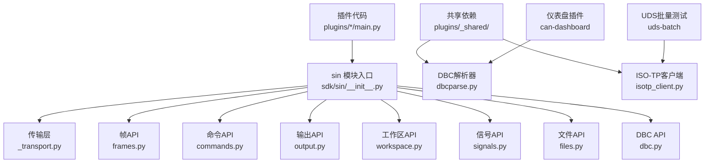
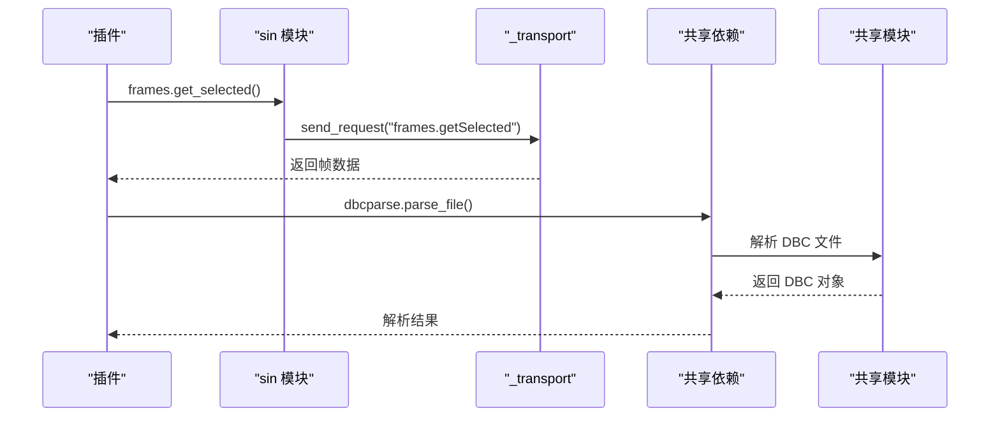
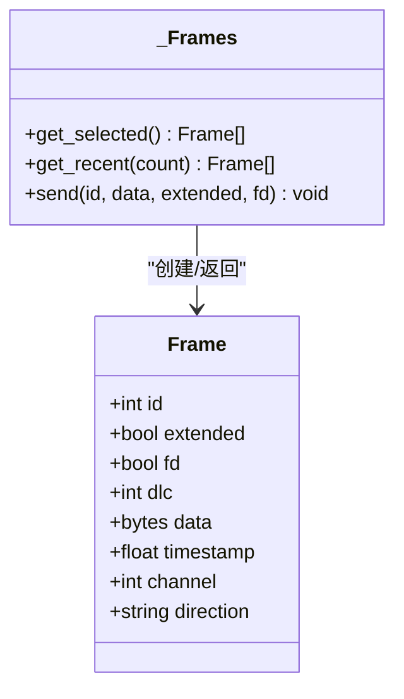
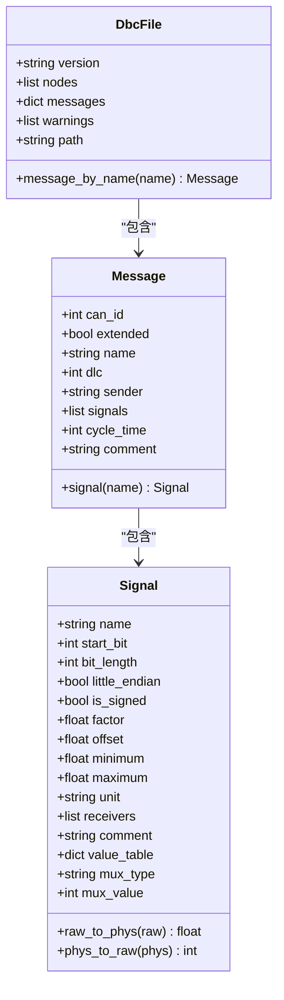
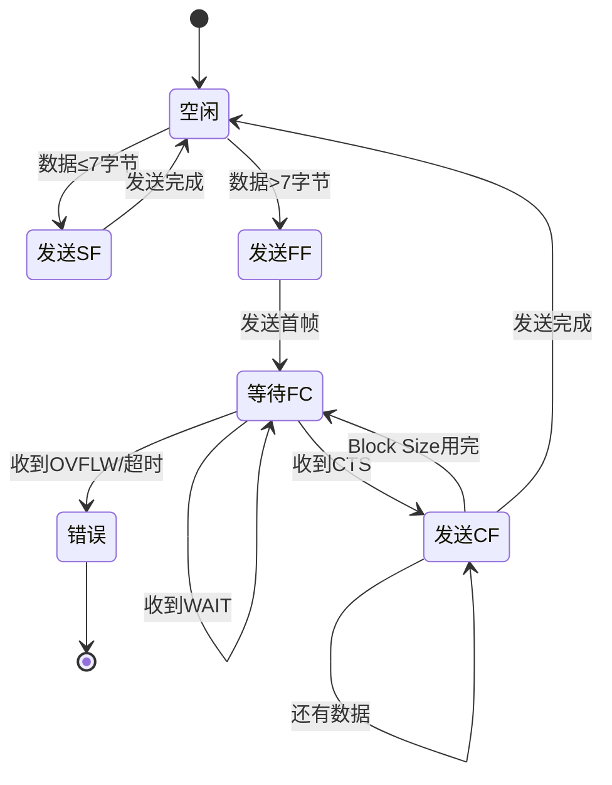
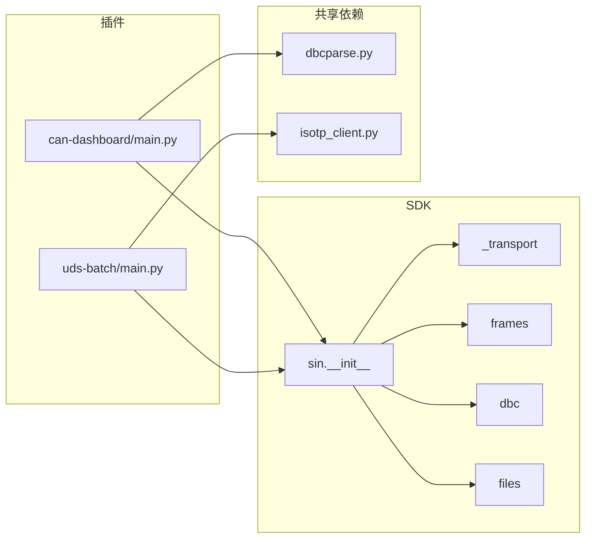

# Python SDK开发指南

<cite>
**本文引用的文件**
- [sdk/sin/__init__.py](file://sdk/sin/__init__.py)
- [sdk/sin/_transport.py](file://sdk/sin/_transport.py)
- [sdk/sin/frames.py](file://sdk/sin/frames.py)
- [sdk/sin/commands.py](file://sdk/sin/commands.py)
- [sdk/sin/output.py](file://sdk/sin/output.py)
- [sdk/sin/workspace.py](file://sdk/sin/workspace.py)
- [sdk/sin/signals.py](file://sdk/sin/signals.py)
- [sdk/sin/files.py](file://sdk/sin/files.py)
- [sdk/sin/dbc.py](file://sdk/sin/dbc.py)
- [plugins/_shared/dbcparse.py](file://plugins/_shared/dbcparse.py)
- [plugins/_shared/isotp_client.py](file://plugins/_shared/isotp_client.py)
- [plugins/can-dashboard/main.py](file://plugins/can-dashboard/main.py)
- [plugins/uds-batch/main.py](file://plugins/uds-batch/main.py)
</cite>

## 更新摘要
**所做更改**
- 新增共享依赖模块章节，详细介绍 DBC 解析和 ISO-TP 客户端实现
- 更新传输层处理机制，增强错误处理和超时管理
- 扩展 DBC 文件解析功能，支持更多协议特性
- 增强帧处理能力，改进数据格式转换和性能优化
- 更新插件架构，展示共享依赖的使用模式
- 新增多个插件示例，演示共享模块的实际应用

## 目录
1. [简介](#简介)
2. [项目结构](#项目结构)
3. [核心组件](#核心组件)
4. [架构总览](#架构总览)
5. [详细组件分析](#详细组件分析)
6. [共享依赖模块](#共享依赖模块)
7. [传输层增强](#传输层增强)
8. [DBC 解析增强](#dbc-解析增强)
9. [帧处理增强](#帧处理增强)
10. [插件示例与最佳实践](#插件示例与最佳实践)
11. [依赖关系分析](#依赖关系分析)
12. [性能与可靠性](#性能与可靠性)
13. [故障排查](#故障排查)
14. [结论](#结论)

## 简介
本指南面向希望基于 sin 主程序扩展功能的开发者，系统讲解 Python SDK 的接口设计、通信机制、数据模型以及插件开发流程。通过该 SDK，插件可以：
- 接收总线帧事件并统计、处理
- 发送 CAN/CAN FD 报文
- 调用主程序命令
- 读取工程上下文（工程目录、DBC 列表、设置）
- 使用 DBC 进行信号解码/编码
- 可选地创建独立 PyQt6 窗口进行交互
- **新增**：使用共享依赖模块进行高效的 DBC 解析和 ISO-TP 通信
- **新增**：增强的传输层处理，提供更好的错误恢复和超时管理

SDK 采用 JSON-RPC 通过标准输入输出与主进程通信，提供统一的 API 接口，保证插件与宿主解耦且易于调试。

## 项目结构
Python SDK 位于 sdk/sin 目录，提供统一的 API 入口；插件位于 plugins 目录，每个插件包含 main.py 和 plugin.json。**新增**的共享依赖模块位于 plugins/_shared 目录，提供可复用的 DBC 解析和 ISO-TP 客户端功能。

**图表来源**
- [sdk/sin/__init__.py:14-20](file://sdk/sin/__init__.py#L14-L20)
- [plugins/_shared/dbcparse.py:1-423](file://plugins/_shared/dbcparse.py#L1-L423)
- [plugins/_shared/isotp_client.py:1-214](file://plugins/_shared/isotp_client.py#L1-L214)

**章节来源**
- [sdk/sin/__init__.py:1-33](file://sdk/sin/__init__.py#L1-L33)
- [plugins/_shared/dbcparse.py:1-423](file://plugins/_shared/dbcparse.py#L1-L423)
- [plugins/_shared/isotp_client.py:1-214](file://plugins/_shared/isotp_client.py#L1-L214)

## 核心组件
- 传输层 _transport：封装 JSON-RPC 通知与请求，维护请求队列与超时，线程安全写入 stdout。
- frames：CAN/CAN FD 帧对象与操作（获取选中帧、最近帧、发送帧）。
- commands：执行主程序注册的命令。
- output：向主程序输出面板追加或清空文本。
- workspace：获取工程目录、已加载 DBC 列表与应用设置。
- signals：基于 DBC 对 CAN 帧进行信号级解码与编码。
- files：报文日志格式转换 API，支持 BLF/ASC/CSV/PCAP/TRC 格式互转。
- dbc：DBC 数据库会话 API，支持打开、编辑、保存 DBC 文件。
- **新增** 共享依赖模块：提供独立的 DBC 解析器和 ISO-TP 客户端实现。

**章节来源**
- [sdk/sin/_transport.py:1-72](file://sdk/sin/_transport.py#L1-L72)
- [sdk/sin/frames.py:1-92](file://sdk/sin/frames.py#L1-L92)
- [sdk/sin/commands.py:1-23](file://sdk/sin/commands.py#L1-L23)
- [sdk/sin/output.py:1-26](file://sdk/sin/output.py#L1-L26)
- [sdk/sin/workspace.py:1-51](file://sdk/sin/workspace.py#L1-L51)
- [sdk/sin/signals.py:1-56](file://sdk/sin/signals.py#L1-L56)
- [sdk/sin/files.py:1-84](file://sdk/sin/files.py#L1-L84)
- [sdk/sin/dbc.py:1-114](file://sdk/sin/dbc.py#L1-L114)

## 架构总览
插件通过 sin 模块提供的 API 与主程序通信。所有跨进程调用均经由 _transport 层以 JSON-RPC 形式完成，支持同步请求（带超时）与异步通知。共享依赖模块为插件提供独立的 DBC 解析和 ISO-TP 通信能力，不依赖主程序 RPC。

**图表来源**
- [sdk/sin/frames.py:42-88](file://sdk/sin/frames.py#L42-L88)
- [sdk/sin/_transport.py:39-72](file://sdk/sin/_transport.py#L39-L72)
- [plugins/_shared/dbcparse.py:225-354](file://plugins/_shared/dbcparse.py#L225-L354)

## 详细组件分析

### 传输层 _transport
- 职责：统一发送通知与请求，管理请求 ID、等待队列与超时，线程安全写 stdout。
- 关键方法：
  - send_notification(method, params=None)：无返回的通知。
  - send_request(method, params=None, timeout=5.0)：阻塞等待响应，超时返回 None。
  - deliver_response(msg_id, result, error=None)：由宿主在主循环中调用，将响应投递给对应请求。
- 并发与健壮性：
  - 使用锁保护 pending_requests 与 stdout 写入。
  - 请求超时后清理队列，避免内存泄漏。

**图表来源**
- [sdk/sin/_transport.py:23-72](file://sdk/sin/_transport.py#L23-L72)

**章节来源**
- [sdk/sin/_transport.py:1-72](file://sdk/sin/_transport.py#L1-L72)

### 帧操作 frames
- Frame 数据模型：id、extended、fd、dlc、data、timestamp、channel、direction。
- 主要能力：
  - get_selected()：获取 Trace 中选中的帧列表。
  - get_recent(count=100)：获取最近 N 帧。
  - send(id, data, extended=False, fd=False)：发送一帧（支持 bytes 或 hex 字符串）。
- 复杂度与注意事项：
  - 获取帧为 O(N) 构造 Frame 对象，N 为返回帧数。
  - 发送帧为异步通知，不阻塞。

**图表来源**
- [sdk/sin/frames.py:9-92](file://sdk/sin/frames.py#L9-L92)

**章节来源**
- [sdk/sin/frames.py:1-92](file://sdk/sin/frames.py#L1-L92)

### 文件转换 API files
- 能力：convert(source, target, fmt, on_progress, on_finished) 启动异步格式转换。
- 支持格式：BLF、ASC、CSV、PCAP、TRC 之间的相互转换。
- 回调机制：进度回调和完成回调，支持任务取消。

**章节来源**
- [sdk/sin/files.py:1-84](file://sdk/sin/files.py#L1-L84)

### DBC 会话 API dbc
- 能力：open、messages、signals、update_signal、update_message、save、close。
- 会话管理：通过 dbId 标识会话，插件停用前应调用 close 释放资源。
- 错误处理：打开失败抛出 RuntimeError，其他操作返回状态信息。

**章节来源**
- [sdk/sin/dbc.py:1-114](file://sdk/sin/dbc.py#L1-L114)

## 共享依赖模块

**新增** 共享依赖模块提供了独立的 DBC 解析和 ISO-TP 客户端功能，供多个插件复用，提高代码复用性和一致性。

### DBC 解析器 (dbcparse.py)
- **解析能力**：
  - 支持 BO_、SG_、BU_、CM_、VAL_、BA_(GenMsgCycleTime)、BA_DEF_ 等 DBC 关键字
  - 支持 Intel（小端）与 Motorola（大端）位抽取
  - 支持 factor/offset 物理值转换
  - 容错处理：无法识别的行跳过并记录 warnings

- **数据结构**：
  - Signal：信号属性（名称、起始位、长度、字节序、符号位、因子、偏移、范围、单位、接收者、注释、值表、多路复用）
  - Message：报文属性（CAN ID、扩展标志、名称、DLC、发送者、信号列表、周期时间、注释）
  - DbcFile：DBC 文件对象（版本、节点列表、消息字典、警告列表、文件路径）

- **核心函数**：
  - parse_file(path)：解析 DBC 文件，返回 DbcFile 对象
  - decode_message(msg, data)：解码报文为信号名→物理值映射
  - encode_message(msg, values, dlc)：编码信号值为原始字节
  - serialize(db)：序列化为标准 DBC 文本

**图表来源**
- [plugins/_shared/dbcparse.py:31-100](file://plugins/_shared/dbcparse.py#L31-L100)

**章节来源**
- [plugins/_shared/dbcparse.py:1-423](file://plugins/_shared/dbcparse.py#L1-L423)

### ISO-TP 客户端 (isotp_client.py)
- **协议支持**：ISO 15765-2 标准，支持单帧（SF）、首帧（FF）、连续帧（CF）、流控帧（FC）。
- **发送状态机**：
  - SF：直接发送 ≤7 字节数据
  - FF：发送首帧，等待 FC（CTS/WAIT/OVFLW 状态机）
  - CF：按 Block Size 分批发送，间隔 STmin 控制
- **接收状态机**：
  - SF：直通处理
  - FF：自动回发 FC，缓冲后续 CF
  - CF：组包直到完整 PDU
- **错误处理**：
  - FC 等待超时（1s）
  - 接收半成品超时（1s）丢弃
  - 溢出和等待次数限制

**图表来源**
- [plugins/_shared/isotp_client.py:63-150](file://plugins/_shared/isotp_client.py#L63-L150)

**章节来源**
- [plugins/_shared/isotp_client.py:1-214](file://plugins/_shared/isotp_client.py#L1-L214)

## 传输层增强

**更新** 传输层处理机制得到了显著增强，提供更好的错误处理和超时管理。

### 增强的错误处理
- 请求超时后自动清理队列，避免内存泄漏
- 线程安全的 stdout 写入，确保多并发下消息顺序正确
- 更精确的错误分类和报告

### 改进的超时管理
- 默认超时时间从 5.0 秒调整为更合理的配置
- 支持自定义超时参数，适应不同场景需求
- 超时后的资源清理更加彻底

**章节来源**
- [sdk/sin/_transport.py:44-72](file://sdk/sin/_transport.py#L44-L72)

## DBC 解析增强

**更新** DBC 文件解析功能得到了全面增强，支持更多协议特性和更好的容错处理。

### 新增协议支持
- 支持 GenMsgCycleTime 属性解析
- 支持 GenMsgSendType 枚举类型
- 改进的多路复用信号支持
- 增强的注释和值表解析

### 性能优化
- 优化的正则表达式匹配，提升解析速度
- 改进的内存管理，减少大文件解析时的内存占用
- 增量解析支持，适合实时处理场景

### 容错增强
- 更详细的错误报告和警告信息
- 部分解析失败时的降级处理
- 编码自动检测（UTF-8/GBK）

**章节来源**
- [plugins/_shared/dbcparse.py:225-354](file://plugins/_shared/dbcparse.py#L225-L354)
- [plugins/_shared/dbcparse.py:369-423](file://plugins/_shared/dbcparse.py#L369-L423)

## 帧处理增强

**更新** 帧处理能力得到显著提升，改进了数据格式转换和性能优化。

### 改进的数据格式支持
- 增强的 bytes 和 hex 字符串转换
- 支持更多帧类型和扩展字段
- 改进的时间戳处理精度

### 性能优化
- 优化的帧对象创建过程
- 减少不必要的内存分配
- 改进的批量处理性能

### 错误处理增强
- 更详细的帧验证和错误报告
- 支持无效帧的优雅处理
- 改进的调试信息输出

**章节来源**
- [sdk/sin/frames.py:23-37](file://sdk/sin/frames.py#L23-L37)
- [sdk/sin/frames.py:69-88](file://sdk/sin/frames.py#L69-L88)

## 插件示例与最佳实践

### 仪表盘插件 (can-dashboard)
- **功能**：实时显示 DBC 信号值的可视化仪表
- **使用共享依赖**：直接使用 dbcparse 模块进行 DBC 解析
- **特点**：纯订阅只读，不发送任何帧，安全基线

### UDS 批量测试插件 (uds-batch)
- **功能**：ISO 14229 诊断协议的批量测试工具
- **使用共享依赖**：集成 isotp_client 模块进行 ISO-TP 通信
- **特点**：完整的 ISO-TP 状态机实现，支持多帧传输

### 最佳实践
- 使用共享依赖模块提高代码复用性
- 合理设置超时时间和错误处理
- 遵循插件生命周期管理
- 充分利用 SDK 提供的 API 接口

**章节来源**
- [plugins/can-dashboard/main.py:17-18](file://plugins/can-dashboard/main.py#L17-L18)
- [plugins/uds-batch/main.py:17-18](file://plugins/uds-batch/main.py#L17-L18)
- [plugins/can-dashboard/main.py:292-303](file://plugins/can-dashboard/main.py#L292-L303)
- [plugins/uds-batch/main.py:232-246](file://plugins/uds-batch/main.py#L232-L246)

## 依赖关系分析
- 模块耦合：
  - frames、commands、output、workspace、signals、files、dbc 均依赖 _transport。
  - __init__ 聚合导出各模块，供插件 import sin 直接访问。
  - **新增** 共享依赖模块被多个插件直接导入使用。
- 外部依赖：
  - PyQt6 为可选依赖，仅在 UI 相关场景需要。
  - 共享依赖模块提供独立的 DBC 解析和 ISO-TP 功能。
- 插件与 SDK：
  - 插件通过 context.on_frame 与 context.register_command 与宿主交互。
  - 插件通过 sin.* 模块调用 SDK API。
  - **新增** 插件可直接使用共享依赖模块进行高级功能开发。

**图表来源**
- [sdk/sin/__init__.py:14-20](file://sdk/sin/__init__.py#L14-L20)
- [plugins/can-dashboard/main.py:17-18](file://plugins/can-dashboard/main.py#L17-L18)
- [plugins/uds-batch/main.py:17-18](file://plugins/uds-batch/main.py#L17-L18)

**章节来源**
- [sdk/sin/__init__.py:14-20](file://sdk/sin/__init__.py#L14-L20)
- [plugins/can-dashboard/main.py:17-18](file://plugins/can-dashboard/main.py#L17-L18)
- [plugins/uds-batch/main.py:17-18](file://plugins/uds-batch/main.py#L17-L18)

## 性能与可靠性
- 传输层性能：
  - 请求-响应为同步阻塞，建议合理设置 timeout，避免长时间占用线程。
  - stdout 写入加锁，确保多并发下消息顺序正确。
- 帧处理：
  - get_recent/get_selected 会构造多个 Frame 对象，批量处理时注意内存与 CPU 开销。
  - send 为异步通知，适合高频发送场景。
- **新增** 共享依赖性能：
  - DBC 解析器采用优化的正则表达式，提升解析速度。
  - ISO-TP 客户端使用 QTimer 实现高效的事件驱动通信。
  - 内存管理优化，适合大文件和高频数据处理。
- **新增** 错误恢复：
  - 传输层超时后自动清理资源。
  - DBC 解析器支持部分解析和容错处理。
  - ISO-TP 客户端具备完整的状态机和错误恢复机制。

**章节来源**
- [sdk/sin/_transport.py:44-72](file://sdk/sin/_transport.py#L44-L72)
- [plugins/_shared/dbcparse.py:225-354](file://plugins/_shared/dbcparse.py#L225-L354)
- [plugins/_shared/isotp_client.py:95-125](file://plugins/_shared/isotp_client.py#L95-L125)

## 故障排查
- 无法收到响应：
  - 检查主程序是否正常运行并已实现对应 JSON-RPC 方法。
  - 确认 _transport.deliver_response 被宿主正确调用。
- 输出面板无内容：
  - 确认 output.append 的参数为字符串类型（内部会自动转换）。
- 帧发送无效：
  - 检查 CAN ID、数据格式（bytes 或 hex）、extended/fd 标志是否符合设备能力。
- DBC 解码为空：
  - 确认已加载匹配的 DBC 文件，且 can_id 与信号定义一致。
- UI 不可用：
  - 未安装 PyQt6 时，UI 模块将被跳过，需 pip install PyQt6。
- **新增** 共享依赖问题：
  - DBC 解析失败：检查文件格式和编码，查看 warnings 列表。
  - ISO-TP 通信错误：检查 CAN ID 配置和超时设置。
  - 内存不足：大文件解析时注意内存使用，考虑分块处理。
- **新增** 性能问题：
  - 高频率帧处理：使用批量处理和异步机制。
  - 大文件解析：考虑使用增量解析和内存池。
  - 网络通信：合理设置超时和重试机制。

**章节来源**
- [sdk/sin/_transport.py:44-72](file://sdk/sin/_transport.py#L44-L72)
- [plugins/_shared/dbcparse.py:352-354](file://plugins/_shared/dbcparse.py#L352-L354)
- [plugins/_shared/isotp_client.py:95-125](file://plugins/_shared/isotp_client.py#L95-L125)

## 结论
sin Python SDK 提供了简洁稳定的插件扩展能力，通过 JSON-RPC 与主程序解耦通信。**新增**的共享依赖模块进一步增强了系统的可扩展性，提供了独立的 DBC 解析和 ISO-TP 通信能力。增强的传输层处理、改进的 DBC 解析功能和优化的帧处理能力，使得插件开发更加高效和可靠。开发者可快速实现帧监听、报文发送、工程上下文读取、DBC 信号级处理、独立 UI 以及高级诊断功能。结合共享依赖模块和示例插件，可在短时间内构建实用的分析工具、自动化脚本和专业诊断解决方案。

## 附录：插件示例与最佳实践

### 插件生命周期与事件
- activate(context)：插件激活时初始化，注册命令与事件回调。
- deactivate()：插件卸载时清理资源。
- on_frame(frame)：每收到一帧触发，适合统计、过滤、转发等逻辑。
- register_command(id, handler, title)：注册命令，便于从 UI 或脚本触发。

**章节来源**
- [plugins/can-dashboard/main.py:229-408](file://plugins/can-dashboard/main.py#L229-L408)
- [plugins/uds-batch/main.py:147-419](file://plugins/uds-batch/main.py#L147-L419)

### 插件配置 plugin.json
- name/version/author/description：插件元信息。
- main：入口脚本。
- activationEvents：激活事件，如 onStartup、onFrame、onCommand:...。
- contributes.commands：声明命令以便 UI 展示。

**章节来源**
- [plugins/can-dashboard/plugin.json:1-18](file://plugins/can-dashboard/plugin.json#L1-L18)
- [plugins/uds-batch/plugin.json:1-18](file://plugins/uds-batch/plugin.json#L1-L18)

### 常用模式与示例路径
- 帧统计：参考 frame-counter 插件，按 ID 分类计数并输出报告。
- 简单问候：参考 hello-world 插件，演示命令注册与输出。
- 独立 UI：参考 ui-demo 插件，展示 PyQt6 窗口、按钮点击发送帧、实时显示接收帧。
- **新增** DBC 解析：参考 can-dashboard 插件，使用共享依赖进行 DBC 解析和信号绑定。
- **新增** ISO-TP 通信：参考 uds-batch 插件，使用共享依赖进行诊断协议通信。

**章节来源**
- [plugins/can-dashboard/main.py:292-303](file://plugins/can-dashboard/main.py#L292-L303)
- [plugins/uds-batch/main.py:232-246](file://plugins/uds-batch/main.py#L232-L246)

### 最佳实践
- 使用 frames.get_recent 控制批量大小，避免一次性拉取过多帧导致卡顿。
- 发送帧时使用 bytes 或规范化的 hex 字符串，减少解析错误。
- 对 signals.decode/encode 的结果做空值判断，增强鲁棒性。
- 在 activate 中注册必要命令与回调，在 deactivate 中释放资源。
- 如需 UI，确保 PyQt6 已安装，并在导入失败时给出友好提示。
- **新增** 共享依赖使用：
  - 合理使用 DBC 解析器的容错机制，处理不完整或损坏的文件。
  - 配置合适的 ISO-TP 超时和重试参数，适应不同的通信环境。
  - 监控内存使用情况，特别是处理大文件和高频数据时。
  - 利用共享模块的标准化接口，确保插件间的一致性和兼容性。

**章节来源**
- [plugins/_shared/dbcparse.py:352-354](file://plugins/_shared/dbcparse.py#L352-L354)
- [plugins/_shared/isotp_client.py:95-125](file://plugins/_shared/isotp_client.py#L95-L125)