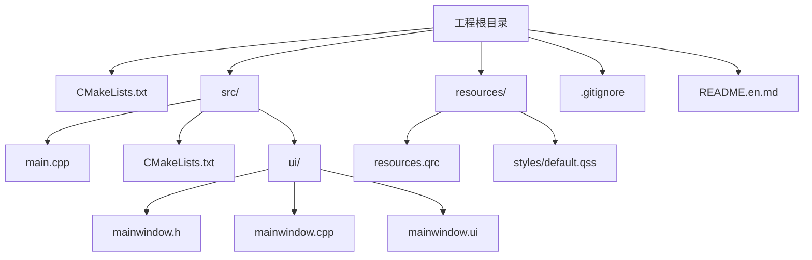
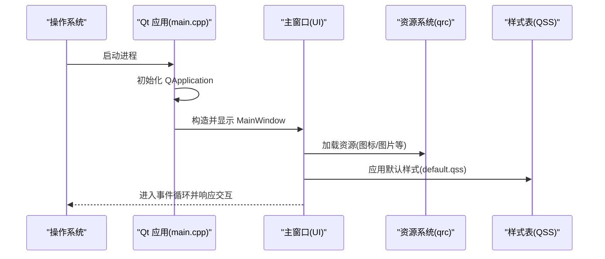
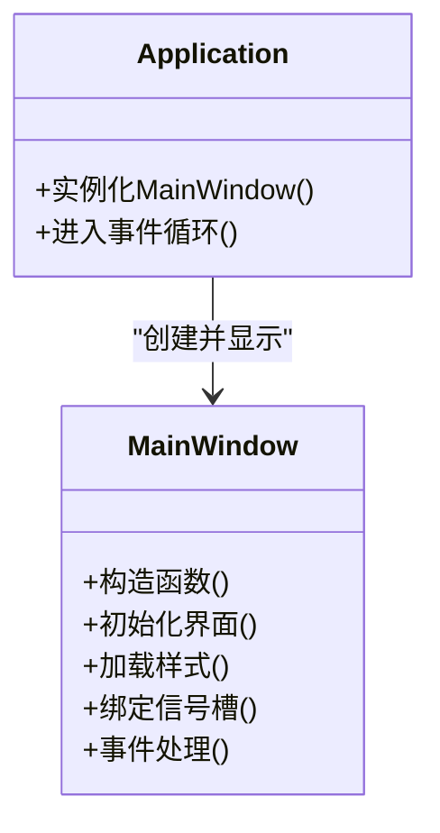
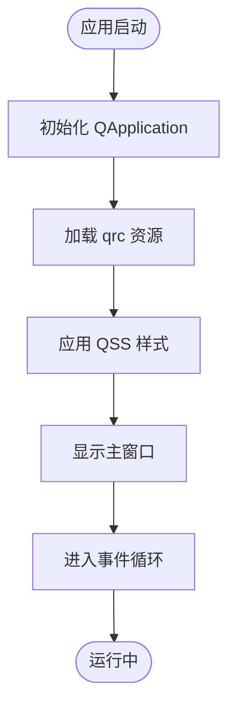
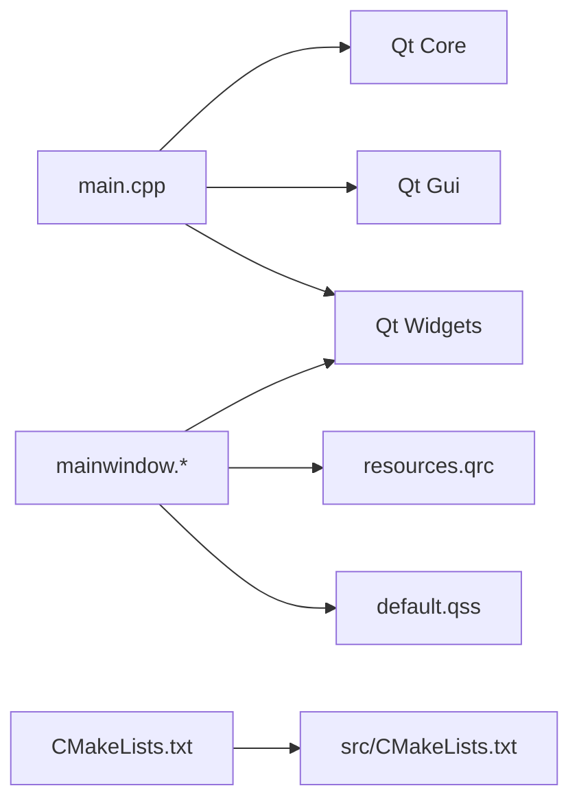

# 开发工作流

<cite>
**本文引用的文件**   
- [CMakeLists.txt](file://CMakeLists.txt)
- [src/CMakeLists.txt](file://src/CMakeLists.txt)
- [src/main.cpp](file://src/main.cpp)
- [src/ui/mainwindow.h](file://src/ui/mainwindow.h)
- [src/ui/mainwindow.cpp](file://src/ui/mainwindow.cpp)
- [src/ui/mainwindow.ui](file://src/ui/mainwindow.ui)
- [resources/resources.qrc](file://resources/resources.qrc)
- [resources/styles/default.qss](file://resources/styles/default.qss)
- [.gitignore](file://.gitignore)
- [README.en.md](file://README.en.md)
</cite>

## 更新摘要
**所做更改**
- 更新了 Qt Designer UI 原型设计工作流程说明
- 完善了 CMake 构建系统配置指南
- 增强了 .gitignore 配置最佳实践
- 优化了开发环境搭建与 IDE 配置建议
- 强化了代码质量检查与自动化测试集成方法

## 目录
1. [简介](#简介)
2. [项目结构](#项目结构)
3. [核心组件](#核心组件)
4. [架构总览](#架构总览)
5. [详细组件分析](#详细组件分析)
6. [依赖关系分析](#依赖关系分析)
7. [性能考虑](#性能考虑)
8. [故障排查指南](#故障排查指南)
9. [结论](#结论)
10. [附录](#附录)

## 简介
本文件面向开发者，提供基于该 Qt 项目的完整开发工作流说明。内容涵盖：
- Git 版本控制工作流程（分支策略、提交规范、代码审查流程）
- 构建系统使用与 CMake 配置、编译选项
- 开发环境搭建与 IDE 配置建议
- 代码质量检查与自动化测试集成方法

目标是让新成员快速上手，同时为有经验的开发者提供可复用的最佳实践。

## 项目结构
该项目采用分层组织方式：
- 顶层 CMakeLists.txt 定义工程级设置与子模块包含
- src 目录包含应用入口与 UI 实现
- resources 目录存放资源与样式表
- .gitignore 用于忽略生成产物与敏感文件
- README.en.md 提供英文说明

图表来源
- [CMakeLists.txt:1-200](file://CMakeLists.txt#L1-L200)
- [src/CMakeLists.txt:1-200](file://src/CMakeLists.txt#L1-L200)
- [src/main.cpp:1-200](file://src/main.cpp#L1-L200)
- [src/ui/mainwindow.h:1-200](file://src/ui/mainwindow.h#L1-L200)
- [src/ui/mainwindow.cpp:1-200](file://src/ui/mainwindow.cpp#L1-L200)
- [src/ui/mainwindow.ui:1-200](file://src/ui/mainwindow.ui#L1-L200)
- [resources/resources.qrc:1-200](file://resources/resources.qrc#L1-L200)
- [resources/styles/default.qss:1-200](file://resources/styles/default.qss#L1-L200)

章节来源
- [CMakeLists.txt:1-200](file://CMakeLists.txt#L1-L200)
- [src/CMakeLists.txt:1-200](file://src/CMakeLists.txt#L1-L200)
- [src/main.cpp:1-200](file://src/main.cpp#L1-L200)
- [README.en.md:1-200](file://README.en.md#L1-L200)

## 核心组件
- 应用入口 main.cpp：负责初始化 Qt 应用、加载主窗口并进入事件循环
- 主窗口 UI：通过 Qt Designer 的 .ui 文件描述界面布局，由生成的头文件在 C++ 中引用
- 样式与资源：通过 qrc 资源文件打包样式表与静态资源，运行时统一加载
- 构建配置：顶层与 src 下的 CMakeLists.txt 共同完成目标、依赖与安装规则

章节来源
- [src/main.cpp:1-200](file://src/main.cpp#L1-L200)
- [src/ui/mainwindow.h:1-200](file://src/ui/mainwindow.h#L1-L200)
- [src/ui/mainwindow.cpp:1-200](file://src/ui/mainwindow.cpp#L1-L200)
- [src/ui/mainwindow.ui:1-200](file://src/ui/mainwindow.ui#L1-L200)
- [resources/resources.qrc:1-200](file://resources/resources.qrc#L1-L200)
- [resources/styles/default.qss:1-200](file://resources/styles/default.qss#L1-L200)
- [src/CMakeLists.txt:1-200](file://src/CMakeLists.txt#L1-L200)
- [CMakeLists.txt:1-200](file://CMakeLists.txt#L1-L200)

## 架构总览
下图展示从启动到渲染的主流程，以及资源与样式的加载路径。

图表来源
- [src/main.cpp:1-200](file://src/main.cpp#L1-L200)
- [src/ui/mainwindow.cpp:1-200](file://src/ui/mainwindow.cpp#L1-L200)
- [resources/resources.qrc:1-200](file://resources/resources.qrc#L1-L200)
- [resources/styles/default.qss:1-200](file://resources/styles/default.qss#L1-L200)

## 详细组件分析

### Git 版本控制工作流
- 分支策略
  - main/master：稳定发布基线，仅接受经过评审的合并
  - develop：日常集成分支，功能特性在此聚合
  - feature/*：按功能划分的特性分支，完成后发起 MR/MR 合并回 develop
  - release/*：预发布分支，修复与打标签
  - hotfix/*：紧急修复，直接合并至 main/master 与 develop
- 提交规范
  - 类型前缀：feat、fix、docs、style、refactor、test、chore、ci、build
  - 主题行不超过 72 字符，简要说明变更目的
  - 正文说明动机、影响范围与注意事项
  - 关联任务编号或问题单号
- 代码审查流程
  - 所有变更需通过 Merge Request/Pull Request 进行评审
  - 至少一名维护者批准后方可合并
  - CI 必须全部通过（构建、静态检查、单元测试）
  - 禁止强制推送至受保护分支
- .gitignore 配置最佳实践
  - 忽略构建目录：build/, cmake-build-debug/, cmake-build-release/
  - 忽略 IDE 配置文件：.vscode/, .idea/, *.suo, *.user
  - 忽略 Qt 生成文件：*.moc, *.rcc, ui_*.h
  - 忽略编译器输出：*.o, *.obj, *.exe, *.dll, *.so
  - 忽略临时文件：*.tmp, *.log, *~

章节来源
- [.gitignore:1-200](file://.gitignore#L1-L200)

### 构建系统与 CMake 配置
- 顶层 CMakeLists.txt
  - 指定最低 CMake 版本、项目名称、全局编译选项
  - 启用 Qt 自动 MOC/UIC/RCC
  - 添加子目录 src
- src/CMakeLists.txt
  - 定义可执行目标与源文件集合
  - 链接 Qt 模块（如 Core、Gui、Widgets）
  - 处理资源文件与样式表
- 常用编译选项
  - 调试/发布模式：-DCMAKE_BUILD_TYPE=Debug|Release
  - 编译器优化：-DCMAKE_CXX_FLAGS_RELEASE="-O2"
  - 并行构建：--parallel N
  - 工具链/交叉编译：-DCMAKE_TOOLCHAIN_FILE=...
- 典型命令
  - 生成构建系统：cmake -B build -S . -DCMAKE_BUILD_TYPE=Release
  - 编译：cmake --build build --config Release
  - 运行：./build/src/your_app_name

**更新** 新增了 CMake 构建系统的详细配置说明和常用命令示例

章节来源
- [CMakeLists.txt:1-200](file://CMakeLists.txt#L1-L200)
- [src/CMakeLists.txt:1-200](file://src/CMakeLists.txt#L1-L200)

### 开发环境搭建与 IDE 配置
- 必备工具
  - CMake 3.16+
  - Qt 5.15+ 或 Qt 6.x（根据项目需求）
  - C++ 编译器（MSVC/Clang/GCC）
  - Git
- IDE 推荐
  - Qt Creator：内置 CMake、MOC/UIC/RCC、调试器、UI 设计器
  - Visual Studio + CMake 支持：适合 Windows 生态
  - CLion：跨平台 CMake 项目管理与重构
- 关键配置要点
  - 正确设置 Qt 路径与 Kit
  - 启用自动 MOC/UIC/RCC
  - 配置调试器与断点
  - 导入 .qrc 资源与 QSS 样式
- Qt Designer 工作流程
  - 使用 .ui 文件进行可视化界面设计
  - 支持拖拽控件和属性编辑
  - 自动生成对应的 C++ 头文件和实现
  - 与 CMake 集成，自动处理 UIC 生成过程

**更新** 新增了 Qt Designer 工作流程的详细说明，包括 UI 原型设计和与 CMake 的集成

章节来源
- [src/main.cpp:1-200](file://src/main.cpp#L1-L200)
- [src/ui/mainwindow.ui:1-200](file://src/ui/mainwindow.ui#L1-L200)
- [resources/resources.qrc:1-200](file://resources/resources.qrc#L1-L200)
- [resources/styles/default.qss:1-200](file://resources/styles/default.qss#L1-L200)

### 代码质量检查与自动化测试集成
- 静态检查
  - Clang-Tidy / Cppcheck：在 CMake 中作为外部检查步骤集成
  - 编码风格：clang-format 或 cpplint，配合 pre-commit 钩子
- 单元测试
  - Google Test / Qt Test：新增 test 目录，编写用例并通过 CTest 运行
  - 在 CMake 中启用 enable_testing() 与 add_test()
- CI/CD
  - GitHub Actions / GitLab CI：多平台构建、静态检查、单元测试、覆盖率统计
  - 缓存依赖与增量构建以加速流水线

**更新** 增强了代码质量检查和自动化测试的集成方法说明

章节来源
- [src/CMakeLists.txt:1-200](file://src/CMakeLists.txt#L1-L200)
- [CMakeLists.txt:1-200](file://CMakeLists.txt#L1-L200)

### 主窗口与 UI 组件分析
- 主窗口类职责
  - 管理界面布局与控件生命周期
  - 绑定信号槽与业务逻辑
  - 加载样式与资源
- 数据流与交互
  - 用户输入触发信号
  - 槽函数执行业务处理
  - 更新界面状态与视图

图表来源
- [src/ui/mainwindow.h:1-200](file://src/ui/mainwindow.h#L1-L200)
- [src/ui/mainwindow.cpp:1-200](file://src/ui/mainwindow.cpp#L1-L200)
- [src/main.cpp:1-200](file://src/main.cpp#L1-L200)

章节来源
- [src/ui/mainwindow.h:1-200](file://src/ui/mainwindow.h#L1-L200)
- [src/ui/mainwindow.cpp:1-200](file://src/ui/mainwindow.cpp#L1-L200)
- [src/ui/mainwindow.ui:1-200](file://src/ui/mainwindow.ui#L1-L200)
- [src/main.cpp:1-200](file://src/main.cpp#L1-L200)

### 资源与样式加载流程

图表来源
- [src/main.cpp:1-200](file://src/main.cpp#L1-L200)
- [resources/resources.qrc:1-200](file://resources/resources.qrc#L1-L200)
- [resources/styles/default.qss:1-200](file://resources/styles/default.qss#L1-L200)

章节来源
- [resources/resources.qrc:1-200](file://resources/resources.qrc#L1-L200)
- [resources/styles/default.qss:1-200](file://resources/styles/default.qss#L1-L200)

## 依赖关系分析
- 模块耦合
  - main.cpp 依赖 Qt 核心库与 GUI 模块
  - 主窗口依赖 UI 描述文件与资源系统
  - 构建系统通过 CMake 管理依赖与目标
- 外部依赖
  - Qt 框架（Core/Gui/Widgets）
  - 可选：网络、数据库、多媒体等模块按需启用

图表来源
- [src/main.cpp:1-200](file://src/main.cpp#L1-L200)
- [src/ui/mainwindow.h:1-200](file://src/ui/mainwindow.h#L1-L200)
- [src/ui/mainwindow.cpp:1-200](file://src/ui/mainwindow.cpp#L1-L200)
- [resources/resources.qrc:1-200](file://resources/resources.qrc#L1-L200)
- [resources/styles/default.qss:1-200](file://resources/styles/default.qss#L1-L200)
- [CMakeLists.txt:1-200](file://CMakeLists.txt#L1-L200)
- [src/CMakeLists.txt:1-200](file://src/CMakeLists.txt#L1-L200)

章节来源
- [CMakeLists.txt:1-200](file://CMakeLists.txt#L1-L200)
- [src/CMakeLists.txt:1-200](file://src/CMakeLists.txt#L1-L200)

## 性能考虑
- 构建性能
  - 使用 Ninja 生成器提升构建速度
  - 启用增量构建与并行编译
  - 合理划分源文件与头文件，减少重编译范围
- 运行时性能
  - 避免在主线程执行耗时操作
  - 合理使用资源加载与缓存
  - 减少不必要的样式重绘与布局计算

[本节为通用指导，不直接分析具体文件]

## 故障排查指南
- 常见构建问题
  - Qt 路径未正确配置：检查 Kit 与 qmake/Qt 路径
  - 缺少依赖模块：确认 CMake 中已启用相应模块
  - 资源未生效：检查 qrc 注册与路径映射
- 常见问题定位
  - 查看 CMake 输出日志与错误信息
  - 使用调试器附加进程，设置断点与变量监视
  - 验证样式表语法与资源路径
- 建议工具
  - CMake 诊断：--trace、--debug-output
  - 静态检查：Clang-Tidy、Cppcheck
  - 日志输出：QLoggingCategory

**更新** 新增了针对 Qt Designer 和 CMake 构建系统的故障排查建议

章节来源
- [src/CMakeLists.txt:1-200](file://src/CMakeLists.txt#L1-L200)
- [CMakeLists.txt:1-200](file://CMakeLists.txt#L1-L200)
- [resources/resources.qrc:1-200](file://resources/resources.qrc#L1-L200)
- [resources/styles/default.qss:1-200](file://resources/styles/default.qss#L1-L200)

## 结论
通过规范的 Git 分支策略、清晰的提交规范与严格的代码审查流程，结合 CMake 构建系统与完善的开发环境配置，团队可以高效协作并保持代码质量。引入静态检查与自动化测试，并在 CI 中固化流程，将显著提升交付稳定性与可维护性。

**更新** 强调了 Qt Designer 工作流程和 CMake 构建系统在现代 Qt 开发中的重要性

[本节为总结性内容，不直接分析具体文件]

## 附录
- 参考文档
  - CMake 官方文档
  - Qt 官方文档与示例
  - Git 工作流最佳实践
- 常用命令速查
  - 清理构建：rm -rf build && cmake -B build -S .
  - 全量构建：cmake --build build --config Release --parallel
  - 运行程序：./build/src/your_app_name
- Qt Designer 快捷键
  - Ctrl+R：预览界面
  - Ctrl+Shift+B：构建 UI
  - Alt+Enter：打开属性编辑器
  - Ctrl+G：网格对齐

**更新** 新增了 Qt Designer 常用快捷键和更多实用命令

[本节为补充信息，不直接分析具体文件]