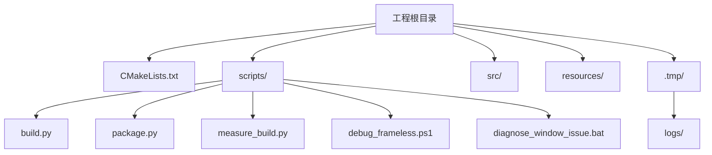
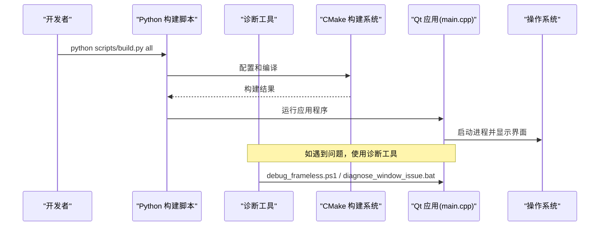
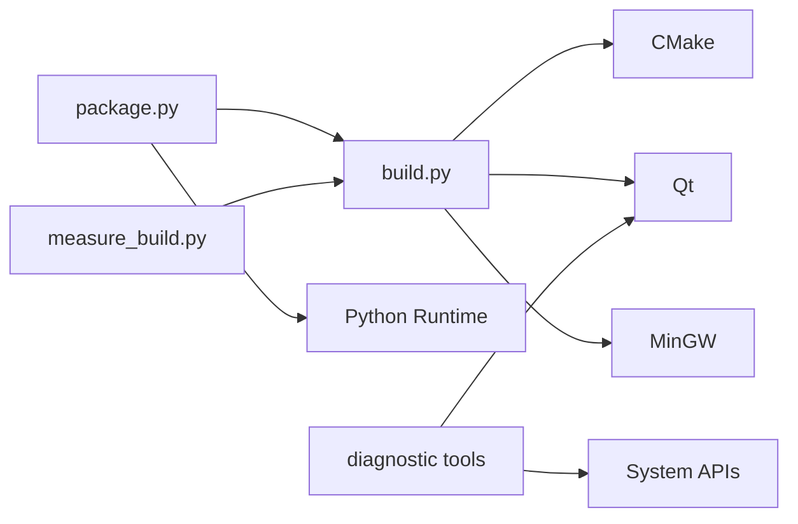

# 开发工作流

<cite>
**本文引用的文件**
- [scripts/build.py](file://scripts/build.py)
- [scripts/package.py](file://scripts/package.py)
- [scripts/measure_build.py](file://scripts/measure_build.py)
- [scripts/debug_frameless.ps1](file://scripts/debug_frameless.ps1)
- [scripts/diagnose_window_issue.bat](file://scripts/diagnose_window_issue.bat)
- [scripts/run-tests.ps1](file://scripts/run-tests.ps1)
- [doc/BUILD-PYTHON-SCRIPT-CHANGELOG.md](file://doc/BUILD-PYTHON-SCRIPT-CHANGELOG.md)
- [ChineseCharacterRemoval_ActionPlan.md](file://ChineseCharacterRemoval_ActionPlan.md)
- [scan_chinese_chars.py](file://scan_chinese_chars.py)
- [CMakeLists.txt](file://CMakeLists.txt)
- [src/CMakeLists.txt](file://src/CMakeLists.txt)
- [src/main.cpp](file://src/main.cpp)
- [.gitignore](file://.gitignore)
</cite>

## 更新摘要
**所做更改**
- 新增国际化清理工具链，包含中文字符扫描和批量清理脚本
- 增强 Python 构建脚本的临时文件管理和日志系统
- 添加窗口问题诊断工具集（debug_frameless.ps1 和 diagnose_window_issue.bat）
- 完善自动化测试执行流程和报告生成
- 优化构建性能度量和分析工具

## 目录
1. [简介](#简介)
2. [项目结构](#项目结构)
3. [核心组件](#核心组件)
4. [架构总览](#架构总览)
5. [详细组件分析](#详细组件分析)
6. [依赖关系分析](#依赖关系分析)
7. [性能考虑](#性能考虑)
8. [故障排查指南](#故障排查指南)
9. [结论](#结论)
10. [附录](#附录)

## 简介
本文件面向开发者，提供基于该 Qt 项目的完整开发工作流说明。内容涵盖：
- Git 版本控制工作流程（分支策略、提交规范、代码审查流程）
- **Python 构建系统**使用与 CMake 配置、编译选项
- **国际化清理工具链** - 中文字符检测和批量清理
- **窗口问题诊断工具** - 无边框窗口调试和问题排查
- 开发环境搭建与 IDE 配置建议
- 代码质量检查与自动化测试集成方法

目标是让新成员快速上手，同时为有经验的开发者提供可复用的最佳实践。

## 项目结构
该项目采用分层组织方式：
- 顶层 CMakeLists.txt 定义工程级设置与子模块包含
- scripts 目录包含 Python 构建脚本、诊断工具和测试脚本
- src 目录包含应用入口与 UI 实现
- resources 目录存放资源与样式表
- .tmp 目录统一管理临时文件和构建日志



**章节来源**
- [CMakeLists.txt:1-200](file://CMakeLists.txt#L1-L200)
- [src/CMakeLists.txt:1-200](file://src/CMakeLists.txt#L1-L200)
- [src/main.cpp:1-200](file://src/main.cpp#L1-L200)

## 核心组件
- **Python 构建脚本 build.py**：智能工具链检测、自动配置、增量编译、部署运行
- **打包脚本 package.py**：完整的发布流水线，包含 Python 运行时捆绑
- **构建度量工具 measure_build.py**：性能分析和基线记录
- **国际化清理工具**：中文字符扫描和批量清理脚本
- **窗口诊断工具**：debug_frameless.ps1 和 diagnose_window_issue.bat
- **自动化测试执行器**：run-tests.ps1 支持多套件测试和报告生成
- 应用入口 main.cpp：负责初始化 Qt 应用、加载主窗口并进入事件循环

**章节来源**
- [scripts/build.py:1-815](file://scripts/build.py#L1-L815)
- [scripts/package.py:1-710](file://scripts/package.py#L1-L710)
- [scripts/measure_build.py:1-267](file://scripts/measure_build.py#L1-L267)
- [scripts/debug_frameless.ps1:1-43](file://scripts/debug_frameless.ps1#L1-L43)
- [scripts/diagnose_window_issue.bat:1-76](file://scripts/diagnose_window_issue.bat#L1-L76)
- [scripts/run-tests.ps1:1-252](file://scripts/run-tests.ps1#L1-L252)

## 架构总览
下图展示从启动到渲染的主流程，以及 Python 构建系统和诊断工具的协调作用。



**图表来源**
- [scripts/build.py:560-574](file://scripts/build.py#L560-L574)
- [scripts/debug_frameless.ps1:1-43](file://scripts/debug_frameless.ps1#L1-L43)
- [scripts/diagnose_window_issue.bat:1-76](file://scripts/diagnose_window_issue.bat#L1-L76)
- [src/main.cpp:1-200](file://src/main.cpp#L1-L200)

## 详细组件分析

### Git 版本控制工作流
- 分支策略
  - main/master：稳定发布基线，仅接受经过评审的合并
  - develop：日常集成分支，功能特性在此聚合
  - feature/*：按功能划分的特性分支，完成后发起 MR/MR 合并回 develop
  - release/*：预发布分支，修复与打标签
  - hotfix/*：紧急修复，直接合并至 main/master 与 develop
- 提交规范
  - 类型前缀：feat、fix、docs、style、refactor、test、chore、ci、build
  - 主题行不超过 72 字符，简要说明变更目的
  - 正文说明动机、影响范围与注意事项
  - 关联任务编号或问题单号
- 代码审查流程
  - 所有变更需通过 Merge Request/Pull Request 进行评审
  - 至少一名维护者批准后方可合并
  - CI 必须全部通过（构建、静态检查、单元测试）
  - 禁止强制推送至受保护分支

### Python 构建系统与 CMake 配置
- **Python 构建脚本 build.py**
  - 智能工具链检测：自动发现 Qt、MinGW、CMake 安装位置
  - 支持 Ninja/MinGW Makefiles 双生成器
  - 一键完整构建流程 (configure → build → deploy → run)
  - Dev 快速开发档 (独立目录 build-dev/) 与全量 Debug 并存
  - **新增**：统一临时文件管理，所有日志输出到 `.tmp/logs/`
- **常用命令**
  ```bash
  python scripts/build.py all                    # 完整构建 + 运行
  python scripts/build.py configure              # CMake 配置 (Debug)
  python scripts/build.py build                  # 增量编译
  python scripts/build.py deploy                 # 部署 Qt 依赖
  python scripts/build.py test                   # 运行测试套件
  python scripts/build.py status                 # 环境状态检查
  python scripts/build.py clean                  # 清理构建
  ```
- **高级用法**
  ```bash
  # 指定构建类型和目录
  python scripts/build.py configure --build-type Release --build-dir build-rel
  python scripts/build.py configure --build-type Dev --build-dir build-dev
  
  # 覆盖工具路径
  python scripts/build.py configure --qt-dir D:\Qt\6.8.3\mingw_64 --mingw-dir D:\Qt\Tools\mingw1310_64
  
  # 并行编译
  python scripts/build.py build -j16  # 16 线程编译
  ```
- **环境变量配置**
  - SIN_QT_DIR = Qt 安装目录
  - SIN_MINGW_DIR = MinGW 安装目录  
  - SIN_CMAKE_DIR = CMake 安装目录

**更新** 新增了临时文件管理和日志系统的详细说明

**章节来源**
- [scripts/build.py:1-815](file://scripts/build.py#L1-L815)
- [doc/BUILD-PYTHON-SCRIPT-CHANGELOG.md:1-200](file://doc/BUILD-PYTHON-SCRIPT-CHANGELOG.md#L1-L200)

### 国际化清理工具链
- **中文字符扫描工具 scan_chinese_chars.py**
  - 递归扫描源代码文件中的中文字符
  - 支持多种文件格式（C++、Python、CMake、批处理等）
  - 排除文档、JSON、HTML、CSS 等非代码文件
  - 生成详细的扫描报告和问题定位
- **批量清理脚本**
  - batch_clean_chinese.py：批量替换常见中文术语
  - targeted_clean.py：针对特定文件的精确清理
  - verify_clean.py：验证清理效果
- **清理策略**
  | 文件类型 | 处理方式 | 示例转换 |
  |---------|---------|---------|
  | C++ 注释 | 翻译为英文 | "录制" → "Record" |
  | Python 字符串 | 国际化处理 | "开始" → "Start" |
  | CMake 配置 | 注释翻译 | "构建目标" → "Build Target" |
  | 批处理脚本 | 消息翻译 | "正在启动..." → "Starting..." |

**更新** 新增了完整的国际化清理工具链说明

**章节来源**
- [scan_chinese_chars.py:1-172](file://scan_chinese_chars.py#L1-L172)
- [ChineseCharacterRemoval_ActionPlan.md:1-182](file://ChineseCharacterRemoval_ActionPlan.md#L1-L182)

### 窗口问题诊断工具
- **debug_frameless.ps1** - PowerShell 无边框窗口调试
  - 自动设置 Qt 调试环境变量
  - 启动应用程序并监控进程状态
  - 检查窗口句柄和显示状态
  - 提供详细的调试信息输出
- **diagnose_window_issue.bat** - Windows 批处理深度诊断
  - 七步诊断流程：进程检查 → 启动等待 → 窗口检测 → 插件验证
  - 自动清理残留进程
  - 提供具体的解决方案建议
  - 支持多显示器场景检测
- **诊断流程**
  ```
  1. 检查 openbus.exe 进程状态
  2. 启动应用程序并等待渲染
  3. 验证进程是否正常运行
  4. 检查 Qt 插件加载情况
  5. 分析可能的窗口显示问题
  6. 提供针对性的解决方案
  7. 生成诊断报告
  ```

**更新** 新增了完整的窗口问题诊断工具使用说明

**章节来源**
- [scripts/debug_frameless.ps1:1-43](file://scripts/debug_frameless.ps1#L1-L43)
- [scripts/diagnose_window_issue.bat:1-76](file://scripts/diagnose_window_issue.bat#L1-L76)

### 开发环境搭建与 IDE 配置
- **必备工具**
  - Python 3.6+
  - CMake 3.16+
  - Qt 5.15+ 或 Qt 6.x（根据项目需求）
  - C++ 编译器（MSVC/Clang/GCC）
  - Git
- **IDE 推荐**
  - Qt Creator：内置 CMake、MOC/UIC/RCC、调试器、UI 设计器
  - Visual Studio + CMake 支持：适合 Windows 生态
  - CLion：跨平台 CMake 项目管理与重构
- **关键配置要点**
  - 正确设置 Qt 路径与 Kit
  - 启用自动 MOC/UIC/RCC
  - 配置调试器与断点
  - 导入 .qrc 资源与 QSS 样式

### 代码质量检查与自动化测试集成
- **静态检查**
  - Clang-Tidy / Cppcheck：在 CMake 中作为外部检查步骤集成
  - 编码风格：clang-format 或 cpplint，配合 pre-commit 钩子
  - **新增**：中文字符扫描集成到代码质量检查流程
- **单元测试**
  - Google Test / Qt Test：新增 test 目录，编写用例并通过 CTest 运行
  - 在 CMake 中启用 enable_testing() 与 add_test()
  - **Python 构建脚本集成测试**：`python scripts/build.py test`
  - **新增**：PowerShell 自动化测试执行器 `scripts/run-tests.ps1`
- **CI/CD**
  - GitHub Actions / GitLab CI：多平台构建、静态检查、单元测试、覆盖率统计
  - 缓存依赖与增量构建以加速流水线

**更新** 增强了代码质量检查和自动化测试的集成方法说明

**章节来源**
- [scripts/build.py:628-679](file://scripts/build.py#L628-L679)
- [scripts/run-tests.ps1:1-252](file://scripts/run-tests.ps1#L1-L252)
- [CMakeLists.txt:1-200](file://CMakeLists.txt#L1-L200)

### 打包与发布流水线
- **Python 打包脚本 package.py**
  - 完整发布流水线：配置构建 → 部署依赖 → 组装 staging → 捆绑 Python 运行时 → 依赖校验 → 生成安装包
  - 支持便携版 zip 和 Inno Setup 安装器
  - 自动依赖完整性校验，防止遗漏动态库
- **常用命令**
  ```bash
  python scripts/package.py [--skip-build] [--skip-python] [--skip-installer]
                            [--version X.Y.Z] [--jobs N]
  ```
- **构建性能度量**
  - `scripts/measure_build.py`：场景化增量构建分析
  - 自动生成构建基线报告，跟踪性能变化

**更新** 新增了完整的打包流水线说明和性能度量工具使用

**章节来源**
- [scripts/package.py:1-710](file://scripts/package.py#L1-L710)
- [scripts/measure_build.py:1-267](file://scripts/measure_build.py#L1-L267)

### 临时文件管理策略
- **统一临时文件目录**
  - 所有构建过程产生的日志、中间文件统一输出到 `.tmp/` 目录
  - 日志文件按时间戳命名：`.tmp/logs/YYYYMMDD_HHMMSS.log`
- **日志智能管理策略**
  | 日志类型 | 输出位置 | 保留策略 | 用途 |
  |---------|---------|---------|------|
  | 构建日志 | `.tmp/logs/YYYYMMDD_HHMMSS.log` | 自动清理（7 天后） | 详细排查错误 |
  | 实时输出 | 终端控制台 | 仅显示前 10 行和后 20 行 | 快速查看关键信息 |
  | 环境检测 | 终端控制台 | 永久内存 | 诊断工具链问题 |
- **.gitignore 增强**
  - 新增规则自动忽略：`*.log`、`.tmp/`

**更新** 新增了临时文件管理的详细说明

**章节来源**
- [doc/BUILD-PYTHON-SCRIPT-CHANGELOG.md:19-57](file://doc/BUILD-PYTHON-SCRIPT-CHANGELOG.md#L19-L57)
- [scripts/build.py:77-86](file://scripts/build.py#L77-L86)

## 依赖关系分析
- **模块耦合**
  - Python 构建脚本依赖 CMake、Qt、MinGW 工具链
  - 打包脚本依赖构建产物和 Python 运行时
  - 构建系统通过 CMake 管理依赖与目标
  - **新增**：诊断工具依赖 Qt 调试环境和系统 API
- **外部依赖**
  - Qt 框架（Core/Gui/Widgets）
  - Python 运行时（可选，用于插件系统）
  - 可选：网络、数据库、多媒体等模块按需启用



**图表来源**
- [scripts/build.py:1-815](file://scripts/build.py#L1-L815)
- [scripts/package.py:1-710](file://scripts/package.py#L1-L710)
- [scripts/measure_build.py:1-267](file://scripts/measure_build.py#L1-L267)
- [scripts/diagnose_window_issue.bat:1-76](file://scripts/diagnose_window_issue.bat#L1-L76)

**章节来源**
- [CMakeLists.txt:1-200](file://CMakeLists.txt#L1-L200)
- [src/CMakeLists.txt:1-200](file://src/CMakeLists.txt#L1-L200)

## 性能考虑
- **构建性能**
  - 使用 Ninja 生成器提升构建速度（自动检测 tools/ninja/ninja.exe）
  - 启用增量构建与并行编译
  - Dev 构建档 (-O1 -g1) 优化迭代速度
  - 合理划分源文件与头文件，减少重编译范围
- **运行时性能**
  - 避免在主线程执行耗时操作
  - 合理使用资源加载与缓存
  - 减少不必要的样式重绘与布局计算
- **构建性能度量**
  - 使用 `scripts/measure_build.py` 进行场景化性能分析
  - 自动生成构建基线报告，跟踪优化效果
- **国际化性能**
  - 使用 UTF-8 编码确保跨平台兼容性
  - 避免在热路径中进行字符编码转换
  - 预编译国际化资源以提高加载速度

## 故障排查指南
- **常见构建问题**
  - Qt 路径未正确配置：检查 Kit 与 qmake/Qt 路径
  - 缺少依赖模块：确认 CMake 中已启用相应模块
  - 资源未生效：检查 qrc 注册与路径映射
- **Python 构建脚本问题**
  - 工具链检测失败：设置 SIN_QT_DIR、SIN_MINGW_DIR、SIN_CMAKE_DIR 环境变量
  - 权限问题：确保对构建目录有写入权限
  - 端口占用：脚本会自动终止正在运行的 openbus.exe
- **窗口问题诊断**
  - 使用 `scripts/diagnose_window_issue.bat` 进行深度诊断
  - 检查 Qt 插件加载状态和 DLL 依赖
  - 验证多显示器环境下的窗口显示
  - 分析无边框窗口的句柄和显示状态
- **国际化问题**
  - 使用 `scan_chinese_chars.py` 检测剩余的中文字符
  - 检查编码设置和字体支持
  - 验证跨平台文本显示效果
- **常见问题定位**
  - 查看 CMake 输出日志与错误信息
  - 使用调试器附加进程，设置断点与变量监视
  - 验证样式表语法与资源路径
  - 检查 `.tmp/logs/` 中的详细构建日志
- **建议工具**
  - CMake 诊断：--trace、--debug-output
  - 静态检查：Clang-Tidy、Cppcheck
  - 日志输出：QLoggingCategory

**更新** 新增了窗口问题和国际化问题的专门排查指南

**章节来源**
- [scripts/build.py:416-441](file://scripts/build.py#L416-L441)
- [scripts/diagnose_window_issue.bat:1-76](file://scripts/diagnose_window_issue.bat#L1-L76)
- [scan_chinese_chars.py:1-172](file://scan_chinese_chars.py#L1-L172)

## 结论
通过规范的 Git 分支策略、清晰的提交规范与严格的代码审查流程，结合 **Python 构建系统** 和完善的开发环境配置，团队可以高效协作并保持代码质量。引入静态检查、自动化测试和国际化清理工具，并在 CI 中固化流程，将显著提升交付稳定性与可维护性。新增的窗口诊断工具进一步提升了问题排查效率。

**更新** 强调了国际化清理和窗口诊断工具在现代化开发工作流中的重要性

## 附录
- **参考文档**
  - CMake 官方文档
  - Qt 官方文档与示例
  - Git 工作流最佳实践
  - Python 构建脚本文档
  - 国际化清理指南
- **常用命令速查**
  ```bash
  # 构建相关
  python scripts/build.py all                    # 完整构建流程
  python scripts/build.py build -j8              # 增量编译
  python scripts/build.py deploy                 # 部署 Qt 依赖
  python scripts/build.py test                   # 运行测试
  python scripts/build.py clean                  # 清理构建
  
  # 打包相关
  python scripts/package.py                      # 完整打包流水线
  python scripts/package.py --skip-build         # 跳过构建直接打包
  
  # 性能分析
  python scripts/measure_build.py --scenario all # 构建性能分析
  
  # 国际化清理
  python scan_chinese_chars.py                   # 扫描中文字符
  python batch_clean_chinese.py                  # 批量清理
  
  # 窗口诊断
  .\scripts\diagnose_window_issue.bat            # 深度诊断
  .\scripts\debug_frameless.ps1                  # 无边框窗口调试
  
  # 自动化测试
  .\scripts\run-tests.ps1                        # 执行测试套件
  ```
- **环境变量配置**
  ```bash
  export SIN_QT_DIR=/path/to/qt
  export SIN_MINGW_DIR=/path/to/mingw
  export SIN_CMAKE_DIR=/path/to/cmake
  ```

**更新** 新增了国际化清理和窗口诊断的常用命令