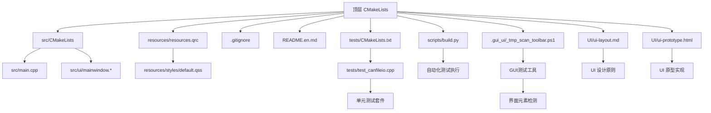
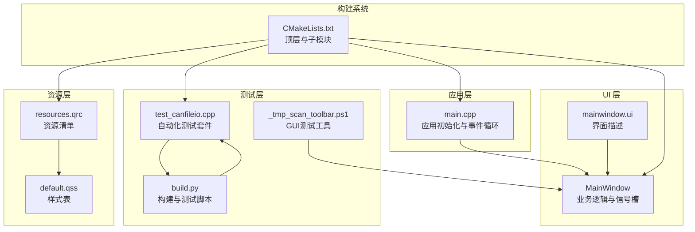
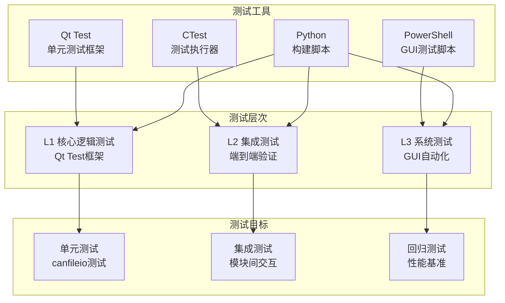
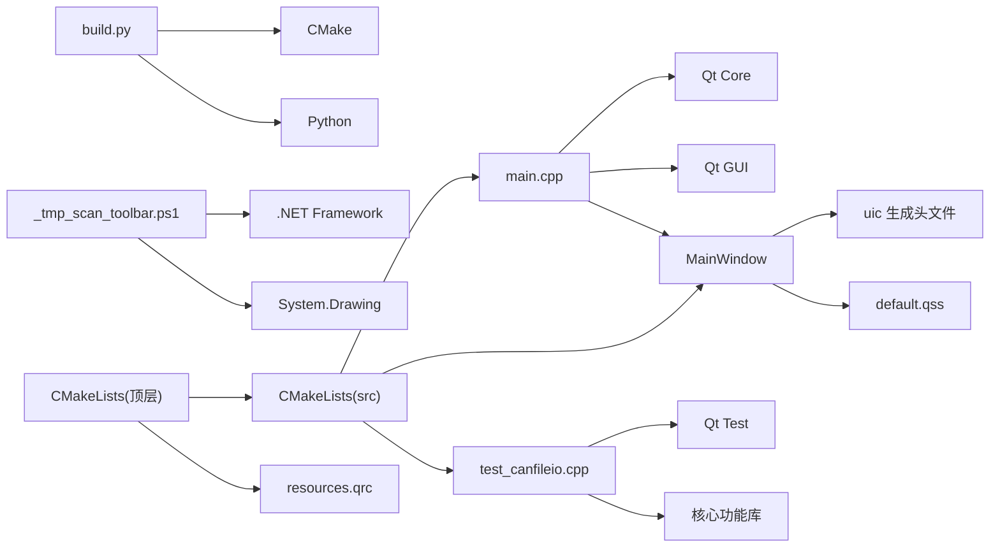

# 开发指南

<cite>
**本文档引用的文件**   
- [CMakeLists.txt](file://CMakeLists.txt)
- [src/CMakeLists.txt](file://src/CMakeLists.txt)
- [src/main.cpp](file://src/main.cpp)
- [src/ui/mainwindow.h](file://src/ui/mainwindow.h)
- [src/ui/mainwindow.cpp](file://src/ui/mainwindow.cpp)
- [resources/resources.qrc](file://resources/resources.qrc)
- [resources/styles/default.qss](file://resources/styles/default.qss)
- [.gitignore](file://.gitignore)
- [README.en.md](file://README.en.md)
- [UI/ui-layout.md](file://UI/ui-layout.md)
- [UI/ui-prototype.html](file://UI/ui-prototype.html)
- [scripts/build.py](file://scripts/build.py)
- [tests/CMakeLists.txt](file://tests/CMakeLists.txt)
- [tests/test_canfileio.cpp](file://tests/test_canfileio.cpp)
- [.gui_ui/_tmp_scan_toolbar.ps1](file://.gui_ui/_tmp_scan_toolbar.ps1)
- [doc/测试验收方案.md](file://doc/测试验收方案.md)
</cite>

## 更新摘要
**所做更改**   
- 新增自动化测试基础设施章节，包含PowerShell脚本和Qt测试框架集成
- 更新了构建系统部分，添加测试执行命令和CI/CD集成说明
- 扩展了调试技巧章节，包含UI自动化测试和截图验证方法
- 新增了GUI测试工具链文档，涵盖坐标定位和界面元素检测
- 更新了Git工作流部分，添加测试驱动的持续集成流程

## 目录
1. [简介](#简介)
2. [项目结构](#项目结构)
3. [核心组件](#核心组件)
4. [架构总览](#架构总览)
5. [详细组件分析](#详细组件分析)
6. [UI 布局设计原则](#ui-布局设计原则)
7. [UI 原型开发](#ui-原型开发)
8. [自动化测试基础设施](#自动化测试基础设施)
9. [依赖关系分析](#依赖关系分析)
10. [性能考虑](#性能考虑)
11. [故障排查指南](#故障排查指南)
12. [结论](#结论)
13. [附录](#附录)

## 简介
本指南面向使用 C++ 与 Qt 进行桌面应用开发的团队，提供从编码规范、命名约定到调试与性能分析、错误处理与日志策略、Git 工作流与代码审查、以及开发环境与 IDE 配置的全流程建议。本项目基于 CMake + Qt（含 QSS 样式资源），采用模块化 UI 组织方式，适合快速迭代与团队协作。新增的测试基础设施包括PowerShell脚本用于自动化UI测试，以及完整的Qt测试框架集成，为项目提供了全面的质量保证体系。

## 项目结构
项目采用分层与按功能组织相结合的结构：
- 顶层 CMakeLists 管理构建系统与资源集成
- src 目录包含可执行入口与 UI 模块
- resources 目录集中管理样式与资源清单
- UI 目录包含 UI 设计文档和原型文件
- tests 目录包含自动化测试套件
- scripts 目录包含构建和测试脚本
- .gui_ui 目录包含GUI测试工具和脚本
- .gitignore 与 README 提供协作与说明信息

图表来源
- [CMakeLists.txt:76-79](file://CMakeLists.txt#L76-L79)
- [tests/CMakeLists.txt:1-37](file://tests/CMakeLists.txt#L1-L37)
- [scripts/build.py:448-495](file://scripts/build.py#L448-L495)
- [.gui_ui/_tmp_scan_toolbar.ps1:1-29](file://.gui_ui/_tmp_scan_toolbar.ps1#L1-L29)

章节来源
- [CMakeLists.txt:76-79](file://CMakeLists.txt#L76-L79)
- [tests/CMakeLists.txt:1-37](file://tests/CMakeLists.txt#L1-L37)
- [scripts/build.py:448-495](file://scripts/build.py#L448-L495)
- [.gui_ui/_tmp_scan_toolbar.ps1:1-29](file://.gui_ui/_tmp_scan_toolbar.ps1#L1-L29)

## 核心组件
- 应用入口 main.cpp：负责 Qt 应用初始化、事件循环启动与主窗口生命周期管理。
- 主窗口 MainWindow：封装界面逻辑、信号槽连接与用户交互处理。
- UI 描述文件 mainwindow.ui：声明界面布局与控件树，由 uic 生成对应头文件供 C++ 使用。
- 资源系统 resources.qrc：集中注册样式与媒体资源，便于跨平台打包与加载。
- 样式 default.qss：统一外观主题，支持运行时切换与动态更新。
- 测试框架：基于Qt Test的自动化测试套件，覆盖核心功能验证。
- 构建脚本：Python构建脚本提供统一的构建、测试和部署接口。
- GUI测试工具：PowerShell脚本用于界面元素检测和自动化测试。

章节来源
- [src/main.cpp](file://src/main.cpp)
- [src/ui/mainwindow.h](file://src/ui/mainwindow.h)
- [src/ui/mainwindow.cpp](file://src/ui/mainwindow.cpp)
- [tests/test_canfileio.cpp:85-287](file://tests/test_canfileio.cpp#L85-L287)
- [scripts/build.py:448-495](file://scripts/build.py#L448-L495)
- [.gui_ui/_tmp_scan_toolbar.ps1:1-29](file://.gui_ui/_tmp_scan_toolbar.ps1#L1-L29)

## 架构总览
整体采用"入口层 + UI 层 + 资源层 + 测试层 + 构建层"的清晰分层，配合 CMake 构建系统完成编译与链接。Qt 的信号/槽机制驱动 UI 交互，QSS 提供主题化能力，uic 将 .ui 转换为 C++ 接口。测试框架提供自动化验证，构建脚本简化开发流程。

图表来源
- [src/main.cpp](file://src/main.cpp)
- [src/ui/mainwindow.h](file://src/ui/mainwindow.h)
- [src/ui/mainwindow.cpp](file://src/ui/mainwindow.cpp)
- [tests/test_canfileio.cpp:85-287](file://tests/test_canfileio.cpp#L85-L287)
- [scripts/build.py:448-495](file://scripts/build.py#L448-L495)
- [.gui_ui/_tmp_scan_toolbar.ps1:1-29](file://.gui_ui/_tmp_scan_toolbar.ps1#L1-L29)
- [CMakeLists.txt:76-79](file://CMakeLists.txt#L76-L79)

## 详细组件分析

### 应用入口 main.cpp
职责：
- 创建 QApplication 实例并设置全局属性（如高 DPI、字体等）
- 构造并显示主窗口
- 进入事件循环

最佳实践：
- 避免在入口中放置业务逻辑，保持轻量
- 合理设置异常安全与退出码
- 通过命令行参数或配置文件注入初始状态

章节来源
- [src/main.cpp](file://src/main.cpp)

### 主窗口 MainWindow
职责：
- 绑定 UI 控件与业务逻辑
- 管理信号与槽的连接与断开
- 协调数据加载、展示与用户操作反馈

设计要点：
- 单一职责：仅处理 UI 相关逻辑，复杂计算下沉至服务层
- 信号/槽解耦：通过槽函数隔离 UI 与后台任务
- 资源释放：确保析构时清理定时器、线程与临时对象

章节来源
- [src/ui/mainwindow.h](file://src/ui/mainwindow.h)
- [src/ui/mainwindow.cpp](file://src/ui/mainwindow.cpp)

### 自动化测试套件 test_canfileio.cpp
职责：
- 验证CAN文件IO功能的正确性和鲁棒性
- 覆盖读取、写入、格式转换等核心场景
- 提供性能基准测试和回归测试保障

测试覆盖：
- 格式推断和工厂模式支持
- 小文件和大型BLF文件读取
- ASC、CSV、BLF格式的读写闭环验证
- 异常处理和容错机制测试

章节来源
- [tests/test_canfileio.cpp:85-287](file://tests/test_canfileio.cpp#L85-L287)
- [tests/CMakeLists.txt:28-36](file://tests/CMakeLists.txt#L28-L36)

### 构建脚本 build.py
职责：
- 提供统一的构建、测试和部署接口
- 自动环境检查和工具链配置
- 支持增量构建和并行编译优化

测试执行：
- 集成ctest执行器运行测试套件
- 自动构建测试目标并收集测试结果
- 提供详细的失败输出和诊断信息

章节来源
- [scripts/build.py:448-495](file://scripts/build.py#L448-L495)
- [scripts/build.py:503-630](file://scripts/build.py#L503-L630)

### GUI测试工具 _tmp_scan_toolbar.ps1
职责：
- 使用PowerShell进行界面元素检测和坐标分析
- 通过图像像素分析识别工具栏图标位置
- 为自动化UI测试提供底层技术支持

技术实现：
- 使用System.Drawing库处理图像文件
- 通过像素亮度分析识别深色图标区域
- 算法分组相邻像素点确定图标边界

章节来源
- [.gui_ui/_tmp_scan_toolbar.ps1:1-29](file://.gui_ui/_tmp_scan_toolbar.ps1#L1-L29)

## UI 布局设计原则

### 设计原则概述
UI 布局设计是用户体验的核心，需要遵循一致性、可用性和美观性的基本原则。良好的布局设计能够提升用户的操作效率和满意度。

### 布局策略
- **网格系统**：使用统一的网格系统进行元素对齐和间距控制
- **响应式设计**：适配不同屏幕尺寸和设备类型
- **层次结构**：清晰的视觉层次和信息优先级
- **留白原则**：合理使用空白区域，避免界面拥挤

### 控件布局规范
- **间距标准**：统一的内边距和外边距设置
- **对齐方式**：水平居中对齐、左对齐、右对齐的使用场景
- **分组原则**：相关功能的控件应该分组显示
- **导航结构**：清晰的导航层次和用户流程

### 颜色与字体规范
- **色彩体系**：主色调、辅助色、警示色的使用规范
- **字体选择**：易读性优先，支持多语言字符集
- **字号层级**：标题、正文、辅助信息的字号差异
- **对比度要求**：确保文本与背景的足够对比度

章节来源
- [UI/ui-layout.md](file://UI/ui-layout.md)

## UI 原型开发

### 原型设计工具
HTML 原型作为 UI 设计的快速验证工具，具有以下优势：
- **快速迭代**：修改成本低，便于快速调整设计方案
- **交互演示**：支持基本的用户交互模拟
- **跨平台预览**：在任何设备上都能查看效果
- **团队协作**：便于设计师和开发者沟通确认

### 原型文件结构
HTML 原型文件通常包含以下组成部分：
- **HTML 结构**：页面骨架和基本布局
- **CSS 样式**：视觉效果和动画过渡
- **JavaScript 交互**：用户操作响应和状态管理
- **资源引用**：图片、图标和其他媒体文件

### 原型开发最佳实践
- **语义化标签**：使用合适的 HTML5 语义标签
- **模块化样式**：CSS 按功能模块组织
- **渐进增强**：基础功能兼容，高级特性增强
- **无障碍支持**：考虑特殊用户的需求

### 从原型到实现的转换
- **设计稿标注**：精确的尺寸、颜色和间距标注
- **组件映射**：原型元素到 Qt 控件的对应关系
- **交互逻辑**：用户操作流程的代码实现
- **样式迁移**：CSS 样式到 QSS 样式的转换

章节来源
- [UI/ui-prototype.html](file://UI/ui-prototype.html)

## 自动化测试基础设施

### 测试框架架构
项目采用分层测试策略，基于Qt Test框架构建完整的自动化测试体系：

图表来源
- [tests/CMakeLists.txt:1-37](file://tests/CMakeLists.txt#L1-L37)
- [tests/test_canfileio.cpp:85-287](file://tests/test_canfileio.cpp#L85-L287)
- [scripts/build.py:448-495](file://scripts/build.py#L448-L495)
- [.gui_ui/_tmp_scan_toolbar.ps1:1-29](file://.gui_ui/_tmp_scan_toolbar.ps1#L1-L29)

### PowerShell GUI测试工具
PowerShell脚本提供界面元素检测和自动化测试能力：

**主要功能**：
- 图像像素分析和坐标定位
- 工具栏图标检测和边界识别
- 界面元素状态验证
- 自动化截图和对比测试

**技术实现**：
- 使用.NET System.Drawing库处理图像
- 像素亮度分析识别深色区域
- 算法分组确定图标位置和大小
- 支持批量处理和结果输出

章节来源
- [.gui_ui/_tmp_scan_toolbar.ps1:1-29](file://.gui_ui/_tmp_scan_toolbar.ps1#L1-L29)

### 构建系统集成
构建脚本集成了完整的测试执行流程：

**测试命令**：
- `python scripts/build.py test` - 运行所有测试套件
- `python scripts/build.py test -j8` - 并行执行测试
- `python scripts/build.py configure --build-type Dev` - 配置开发环境

**自动化流程**：
- 自动环境检查和工具链验证
- 增量构建和并行编译优化
- 测试执行和结果收集
- 失败用例的详细输出

章节来源
- [scripts/build.py:448-495](file://scripts/build.py#L448-L495)
- [scripts/build.py:503-630](file://scripts/build.py#L503-L630)

### 测试用例设计
测试用例遵循验收需求驱动的设计原则：

**核心测试场景**：
- 文件格式推断和工厂模式支持
- 小文件和大型文件读取性能
- 多种格式读写闭环验证
- 异常处理和容错机制

**断言策略**：
- 真实样本文件的自洽性不变量验证
- 自构造数据的精确字段比对
- 性能基准和时间上限检查
- 异常情况的确定性行为验证

章节来源
- [tests/test_canfileio.cpp:4-16](file://tests/test_canfileio.cpp#L4-L16)
- [tests/test_canfileio.cpp:52-83](file://tests/test_canfileio.cpp#L52-L83)

## 依赖关系分析
- main.cpp 依赖 Qt 核心与 GUI 模块，并实例化 MainWindow
- MainWindow 依赖 uic 生成的 UI 头文件与 QSS 样式资源
- 测试套件依赖 Qt Test框架和核心功能模块
- 构建脚本依赖Python环境和CMake工具链
- GUI测试工具依赖.NET Framework和图像处理方法

图表来源
- [src/main.cpp](file://src/main.cpp)
- [src/ui/mainwindow.h](file://src/ui/mainwindow.h)
- [src/ui/mainwindow.cpp](file://src/ui/mainwindow.cpp)
- [tests/test_canfileio.cpp:17-24](file://tests/test_canfileio.cpp#L17-L24)
- [scripts/build.py:132-167](file://scripts/build.py#L132-L167)
- [.gui_ui/_tmp_scan_toolbar.ps1:1-2](file://.gui_ui/_tmp_scan_toolbar.ps1#L1-L2)
- [CMakeLists.txt:58-79](file://CMakeLists.txt#L58-L79)

章节来源
- [src/main.cpp](file://src/main.cpp)
- [src/ui/mainwindow.h](file://src/ui/mainwindow.h)
- [src/ui/mainwindow.cpp](file://src/ui/mainwindow.cpp)
- [tests/test_canfileio.cpp:17-24](file://tests/test_canfileio.cpp#L17-L24)
- [scripts/build.py:132-167](file://scripts/build.py#L132-L167)
- [.gui_ui/_tmp_scan_toolbar.ps1:1-2](file://.gui_ui/_tmp_scan_toolbar.ps1#L1-L2)
- [CMakeLists.txt:58-79](file://CMakeLists.txt#L58-L79)

## 性能考虑
- 渲染性能
  - 避免在 UI 线程执行耗时操作，使用异步任务与进度反馈
  - 合理使用模型/视图，大数据量场景优先使用自定义模型
  - 减少重绘与布局计算，批量更新控件状态
- 内存管理
  - 遵循 RAII，避免裸指针；必要时使用智能指针
  - 及时断开不再使用的信号/槽，防止悬挂引用
  - 大对象池化复用，降低频繁分配开销
- 构建与运行
  - 启用链接时优化（LTO）与符号剥离（Release）
  - 使用缓存与增量构建，缩短编译时间
  - 监控启动时间，延迟加载非必要模块
- UI 性能优化
  - 合理使用 Qt 的渲染优化特性
  - 避免频繁的样式切换和布局重建
  - 使用懒加载技术加载大型资源
- 测试性能
  - 并行执行测试套件，提高测试效率
  - 使用增量构建避免重复编译
  - 优化测试数据加载和文件I/O操作

[本节为通用指导，不直接分析具体文件]

## 故障排查指南
常见问题与对策：
- 构建失败
  - 检查 Qt 版本与 CMake 配置是否匹配
  - 确认资源路径与 qrc 注册正确
  - 查看编译器输出中的缺失头文件或库链接错误
- 运行时崩溃
  - 使用断点与调用栈定位崩溃位置
  - 检查空指针、越界访问与未初始化变量
  - 验证信号/槽参数类型与数量一致性
- UI 异常
  - 使用 Qt Creator 的 UI 预览与 Inspector 工具
  - 检查 QSS 语法与选择器优先级
  - 通过日志打印关键状态与事件触发顺序
- 测试失败
  - 使用ctest查看详细测试输出和失败原因
  - 检查测试数据和依赖文件是否正确
  - 验证测试环境的完整性和工具链配置
- GUI测试问题
  - 确认PowerShell脚本的执行权限和环境
  - 检查图像文件和坐标定位的准确性
  - 验证界面元素的可访问性和状态

调试技巧：
- 使用断点、条件断点与日志输出组合定位问题
- 利用 Valgrind/AddressSanitizer 检测内存问题
- 使用性能分析器（如 perf、VTune、Instruments）识别瓶颈
- 使用 UI 调试工具检查布局和样式问题
- 使用测试框架的输出和断言信息进行问题定位

章节来源
- [scripts/build.py:448-495](file://scripts/build.py#L448-L495)
- [tests/CMakeLists.txt:1-37](file://tests/CMakeLists.txt#L1-L37)
- [.gui_ui/_tmp_scan_toolbar.ps1:1-29](file://.gui_ui/_tmp_scan_toolbar.ps1#L1-L29)

## 结论
本项目采用清晰的层次结构与成熟的 Qt 生态，结合 CMake 构建系统和完善的测试基础设施，具备良好的可维护性与扩展性。新增的自动化测试框架、PowerShell GUI测试工具和构建脚本为项目提供了全面的质量保证体系。遵循本指南的编码规范、调试方法与性能优化建议，配合测试驱动的持续集成流程，可显著提升开发效率与产品质量。建议在团队内推广统一的命名、日志与错误处理模式，并通过Git工作流与代码审查保障协作质量。

[本节为总结性内容，不直接分析具体文件]

## 附录

### C++ 编码规范
- 语言特性
  - 优先使用现代 C++（C++17/20）特性，如 auto、智能指针、移动语义
  - 避免裸指针与手动内存管理，使用 std::unique_ptr/std::shared_ptr
  - 常量正确性：尽量使用 const 与 constexpr
- 代码风格
  - 缩进与括号风格统一（推荐 Allman 或 K&R，团队一致即可）
  - 函数与变量命名遵循小驼峰或下划线风格（见命名标准）
  - 单文件职责单一，避免过长函数与过深嵌套
- 头文件与实现
  - 头文件自包含，使用 include guards 或 #pragma once
  - 最小化头文件依赖，前向声明优先
  - 实现文件按功能划分，避免巨型源文件

### Qt 开发约定
- 对象模型
  - 使用 QObject 父子关系管理生命周期
  - 信号/槽连接使用新语法，明确连接类型（Qt::UniqueConnection 等）
  - 避免在构造函数中发起耗时操作
- UI 与资源
  - .ui 仅描述界面，逻辑放入 C++ 类
  - 资源路径统一通过 qrc 管理，避免硬编码
  - 样式表按模块拆分，支持运行时切换
- 线程与并发
  - UI 线程只处理界面更新，后台任务使用 QThread/QRunnable
  - 跨线程通信使用信号/槽或队列机制

### 命名标准
- 类名：大驼峰（例如 MainWindow、DataModel）
- 函数与方法：小驼峰（例如 loadSettings、updateView）
- 成员变量：前缀 m_ 或小写加下划线（例如 m_count、data_list）
- 常量：全大写加下划线（例如 MAX_RETRY_COUNT）
- 枚举与命名空间：大驼峰或全大写（例如 Status、NamespaceName）
- 文件与目录：小写加下划线（例如 main_window.cpp、ui_components）

### 错误处理模式
- 异常与返回值
  - 对外 API 返回结果对象或错误码，内部异常捕获后转为可恢复状态
  - 关键路径使用强异常安全保证，非关键路径允许降级
- 日志与诊断
  - 统一日志级别（DEBUG/INFO/WARN/ERROR/FATAL）
  - 记录上下文信息（函数名、行号、请求 ID）
  - 敏感信息脱敏，避免泄露密钥与用户隐私
- 用户提示
  - 错误消息友好且可操作，提供重试或反馈入口
  - 区分可恢复与不可恢复错误，给出不同引导

### 日志记录策略
- 分级输出
  - DEBUG：详细过程信息，仅在开发环境启用
  - INFO：关键业务流程与状态变更
  - WARN：潜在问题与边界情况
  - ERROR：异常与失败路径
  - FATAL：致命错误与应用终止
- 输出目标
  - 控制台（开发）、文件（生产）、远程收集（聚合分析）
- 性能影响
  - 异步写入，避免阻塞 UI 线程
  - 条件编译开关控制日志级别

### Git 工作流与代码审查
- 分支策略
  - main/master：稳定发布分支
  - develop：集成开发分支
  - feature/*：功能分支
  - hotfix/*：紧急修复分支
- 提交规范
  - 使用语义化提交信息（feat/fix/docs/chore 等）
  - 每次提交聚焦单一变更，避免混合修改
- 代码审查
  - 强制 Pull Request 与至少一名审查者批准
  - 自动化检查：CI 构建、单元测试、静态分析
  - 关注可读性、安全性与性能影响

### 贡献指南
- 环境准备
  - 安装 Qt、CMake、编译器与 IDE（推荐 Qt Creator/VS Code）
  - 配置环境变量与工具链，确保构建脚本可执行
- 开发流程
  - 拉取最新代码，创建功能分支
  - 编写代码与测试，本地验证通过
  - 推送分支并提交 PR，等待审查与 CI 结果
- 文档与示例
  - 更新相关文档与示例代码
  - 保持 README 与变更记录同步

### 开发环境与 IDE 设置建议
- Qt Creator
  - 配置 Kit（编译器、Qt 版本、调试器）
  - 启用代码格式化、静态分析与自动补全
  - 使用内置构建系统与调试器
- VS Code
  - 安装 C/C++、CMake、Qt 插件
  - 配置 tasks.json 与 launch.json
  - 使用 CMake Tools 管理构建与调试
- 通用建议
  - 启用编译器警告（-Wall/-Wextra）与静态分析
  - 使用预编译头与增量构建加速编译
  - 统一换行符与编码（UTF-8）

### UI 设计开发规范
- 设计文档维护
  - 保持 UI/ui-layout.md 与实际实现同步更新
  - 定期审查设计规范的适用性和完整性
  - 建立设计决策记录和变更历史
- 原型开发流程
  - 使用 HTML 原型快速验证设计方案
  - 原型文件应包含完整的交互逻辑
  - 原型与最终实现保持一致的用户体验
- 设计到实现的转换
  - 建立设计组件到 Qt 控件的映射关系
  - 确保样式和布局的一致性
  - 进行跨设备和分辨率的兼容性测试

### 测试驱动开发实践
- 测试策略
  - 采用测试金字塔：大量单元测试、适量集成测试、少量端到端测试
  - 测试数据管理：使用固定数据集和随机数据生成
  - 持续集成：每次提交自动运行测试套件
- 自动化测试
  - 使用Qt Test框架编写单元测试
  - 集成PowerShell脚本进行GUI自动化测试
  - 构建脚本统一管理测试执行流程
- 性能基准
  - 建立性能测试基线，监控回归变化
  - 使用计时器和性能分析工具
  - 大文件处理和内存使用优化

章节来源
- [scripts/build.py:448-495](file://scripts/build.py#L448-L495)
- [tests/CMakeLists.txt:1-37](file://tests/CMakeLists.txt#L1-L37)
- [tests/test_canfileio.cpp:85-287](file://tests/test_canfileio.cpp#L85-L287)
- [.gui_ui/_tmp_scan_toolbar.ps1:1-29](file://.gui_ui/_tmp_scan_toolbar.ps1#L1-L29)
- [doc/测试验收方案.md](file://doc/测试验收方案.md)