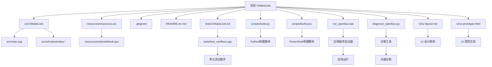
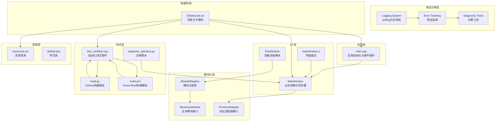
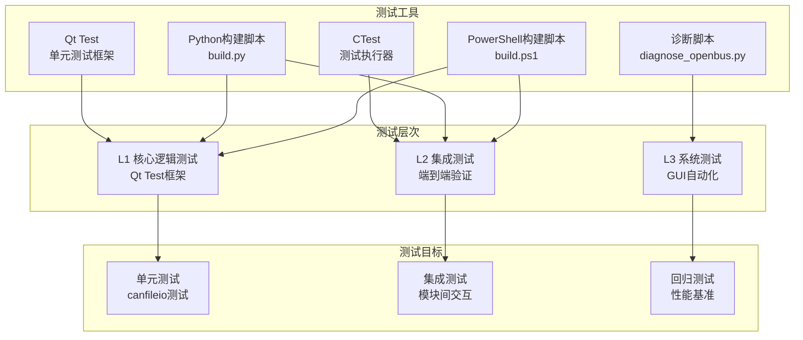
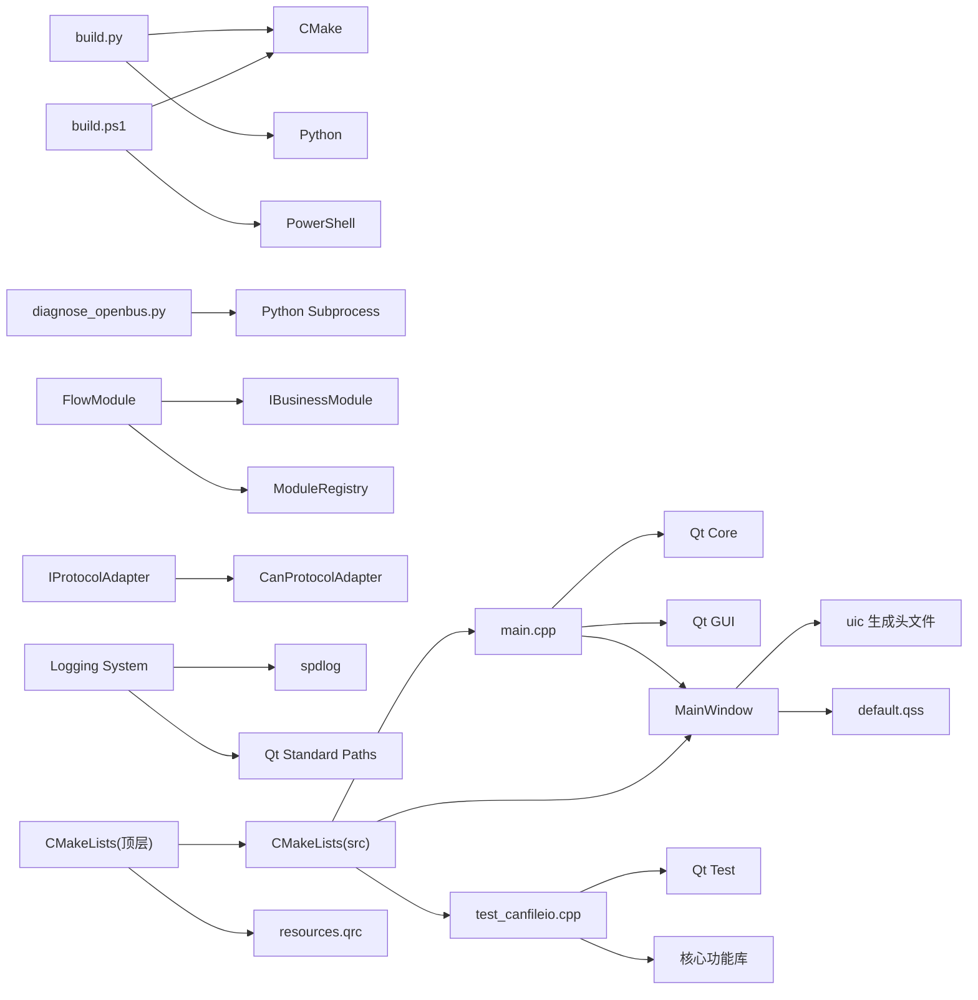

# 开发指南

<cite>
**本文引用的文件**   
- [CMakeLists.txt](file://CMakeLists.txt)
- [src/CMakeLists.txt](file://src/CMakeLists.txt)
- [src/main.cpp](file://src/main.cpp)
- [src/ui/mainwindow.h](file://src/ui/mainwindow.h)
- [src/ui/mainwindow.cpp](file://src/ui/mainwindow.cpp)
- [resources/resources.qrc](file://resources/resources.qrc)
- [resources/styles/default.qss](file://resources/styles/default.qss)
- [.gitignore](file://.gitignore)
- [README.en.md](file://README.en.md)
- [UI/ui-layout.md](file://UI/ui-layout.md)
- [UI/ui-prototype.html](file://UI/ui-prototype.html)
- [scripts/build.py](file://scripts/build.py)
- [scripts/build.ps1](file://scripts/build.ps1)
- [tests/CMakeLists.txt](file://tests/CMakeLists.txt)
- [tests/test_canfileio.cpp](file://tests/test_canfileio.cpp)
- [run_openbus.bat](file://run_openbus.bat)
- [test_openbus.ps1](file://test_openbus.ps1)
- [bring_openbus_to_front.py](file://bring_openbus_to_front.py)
- [diagnose_openbus.py](file://diagnose_openbus.py)
- [complete_build_workflow.py](file://complete_build_workflow.py)
- [doc/测试验收方案.md](file://doc/测试验收方案.md)
- [src/core/module/imodule.h](file://src/core/module/imodule.h)
- [src/core/module/moduleregistry.h](file://src/core/module/moduleregistry.h)
- [src/core/module/moduleregistry.cpp](file://src/core/module/moduleregistry.cpp)
- [src/core/protocol/iprotocoladapter.h](file://src/core/protocol/iprotocoladapter.h)
- [src/core/protocol/canprotocoladapter.h](file://src/core/protocol/canprotocoladapter.h)
- [src/ui/flowmodule.h](file://src/ui/flowmodule.h)
- [src/ui/flowmodule.cpp](file://src/ui/flowmodule.cpp)
- [src/core/logging.h](file://src/core/logging.h)
- [src/core/logging.cpp](file://src/core/logging.cpp)
- [src/utils/logging.h](file://src/utils/logging.h)
- [src/core/candevice.cpp](file://src/core/candevice.cpp)
- [src/core/filter_engine.cpp](file://src/core/filter_engine.cpp)
</cite>

## 更新摘要
**所做更改**   
- 更新了开发工具章节，移除了已删除的 driver_tool.py、plugin_tool.py、sin_host.py 等开发辅助工具
- 简化了构建系统描述，聚焦于现有的 build.py 和 build.ps1 脚本
- 更新了开发工作流，反映当前可用的调试和诊断工具
- 增强了故障排查指南，包含新的诊断脚本使用方法
- 优化了性能考虑部分，移除对已删除工具的依赖说明

## 目录
1. [简介](#简介)
2. [项目结构](#项目结构)
3. [核心组件](#核心组件)
4. [架构总览](#架构总览)
5. [详细组件分析](#详细组件分析)
6. [模块化架构模式](#模块化架构模式)
7. [协议适配器开发指南](#协议适配器开发指南)
8. [Flow系统模块开发](#flow系统模块开发)
9. [调试和诊断系统](#调试和诊断系统)
10. [UI 布局设计原则](#ui-布局设计原则)
11. [UI 原型开发](#ui-原型开发)
12. [自动化测试基础设施](#自动化测试基础设施)
13. [依赖关系分析](#依赖关系分析)
14. [性能考虑](#性能考虑)
15. [故障排查指南](#故障排查指南)
16. [结论](#结论)
17. [附录](#附录)

## 简介
本指南面向使用 C++ 与 Qt 进行桌面应用开发的团队，提供从编码规范、命名约定到调试与性能分析、错误处理与日志策略、Git 工作流与代码审查、以及开发环境与 IDE 配置的全流程建议。本项目基于 CMake + Qt（含 QSS 样式资源），采用模块化 UI 组织方式，适合快速迭代与团队协作。

**最新更新**：项目已引入全新的模块化架构模式，支持动态加载的业务模块、协议适配器机制和Flow系统。开发工具集已简化，专注于核心的构建、调试和诊断功能，移除了复杂的驱动和插件开发辅助工具，提供更简洁高效的开发体验。

## 项目结构
项目采用分层与按功能组织相结合的结构：
- 顶层 CMakeLists 管理构建系统与资源集成
- src 目录包含可执行入口与 UI 模块
- resources 目录集中管理样式与资源清单
- UI 目录包含 UI 设计文档和原型文件
- tests 目录包含自动化测试套件
- scripts 目录包含构建和测试脚本
- .tmp 目录包含临时文件和日志
- .gitignore 与 README 提供协作与说明信息

**图表来源**
- [CMakeLists.txt:76-79](file://CMakeLists.txt#L76-L79)
- [tests/CMakeLists.txt:1-37](file://tests/CMakeLists.txt#L1-L37)
- [scripts/build.py:448-495](file://scripts/build.py#L448-L495)
- [scripts/build.ps1:1-201](file://scripts/build.ps1#L1-L201)
- [run_openbus.bat:1-17](file://run_openbus.bat#L1-L17)
- [diagnose_openbus.py:1-97](file://diagnose_openbus.py#L1-L97)

**章节来源**
- [CMakeLists.txt:76-79](file://CMakeLists.txt#L76-L79)
- [tests/CMakeLists.txt:1-37](file://tests/CMakeLists.txt#L1-L37)
- [scripts/build.py:448-495](file://scripts/build.py#L448-L495)
- [scripts/build.ps1:1-201](file://scripts/build.ps1#L1-L201)
- [run_openbus.bat:1-17](file://run_openbus.bat#L1-L17)
- [diagnose_openbus.py:1-97](file://diagnose_openbus.py#L1-L97)

## 核心组件
- 应用入口 main.cpp：负责 Qt 应用初始化、事件循环启动与主窗口生命周期管理。
- 主窗口 MainWindow：封装界面逻辑、信号槽连接与用户交互处理。
- 资源系统 resources.qrc：集中注册样式与媒体资源，便于跨平台打包与加载。
- 样式 default.qss：统一外观主题，支持运行时切换与动态更新。
- 测试框架：基于Qt Test的自动化测试套件，覆盖核心功能验证。
- 构建脚本：Python和PowerShell双构建脚本提供统一的构建、测试和部署接口。
- 诊断工具：专门的诊断脚本用于GUI窗口问题和依赖检查。
- **新增**：模块化架构支持动态加载的业务模块和协议适配器。
- **新增**：调试和诊断系统，提供详细的日志记录和错误追踪能力。

**章节来源**
- [src/main.cpp](file://src/main.cpp)
- [src/ui/mainwindow.h](file://src/ui/mainwindow.h)
- [src/ui/mainwindow.cpp](file://src/ui/mainwindow.cpp)
- [tests/test_canfileio.cpp:85-287](file://tests/test_canfileio.cpp#L85-L287)
- [scripts/build.py:448-495](file://scripts/build.py#L448-L495)
- [scripts/build.ps1:1-201](file://scripts/build.ps1#L1-L201)
- [diagnose_openbus.py:1-97](file://diagnose_openbus.py#L1-L97)

## 架构总览
整体采用"入口层 + UI 层 + 资源层 + 测试层 + 构建层"的清晰分层，配合 CMake 构建系统完成编译与链接。Qt 的信号/槽机制驱动 UI 交互，QSS 提供主题化能力，uic 将 .ui 转换为 C++ 接口。测试框架提供自动化验证，构建脚本简化开发流程。

**最新更新**：架构现已支持模块化设计，通过ModuleRegistry实现业务模块的动态加载，IProtocolAdapter提供协议适配层抽象，FlowModule作为测量流程的核心业务模块。开发工具集已简化，专注于核心功能，移除了复杂的驱动和插件开发辅助工具。

**图表来源**
- [src/main.cpp](file://src/main.cpp)
- [src/ui/mainwindow.h](file://src/ui/mainwindow.h)
- [src/ui/mainwindow.cpp](file://src/ui/mainwindow.cpp)
- [src/core/module/imodule.h](file://src/core/module/imodule.h)
- [src/core/module/moduleregistry.h](file://src/core/module/moduleregistry.h)
- [src/core/protocol/iprotocoladapter.h](file://src/core/protocol/iprotocoladapter.h)
- [src/ui/flowmodule.h](file://src/ui/flowmodule.h)
- [src/core/logging.h](file://src/core/logging.h)
- [src/core/logging.cpp](file://src/core/logging.cpp)
- [tests/test_canfileio.cpp:85-287](file://tests/test_canfileio.cpp#L85-L287)
- [scripts/build.py:448-495](file://scripts/build.py#L448-L495)
- [scripts/build.ps1:1-201](file://scripts/build.ps1#L1-L201)
- [diagnose_openbus.py:1-97](file://diagnose_openbus.py#L1-L97)
- [CMakeLists.txt:76-79](file://CMakeLists.txt#L76-L79)

## 详细组件分析

### 应用入口 main.cpp
职责：
- 创建 QApplication 实例并设置全局属性（如高 DPI、字体等）
- 构造并显示主窗口
- 进入事件循环

最佳实践：
- 避免在入口中放置业务逻辑，保持轻量
- 合理设置异常安全与退出码
- 通过命令行参数或配置文件注入初始状态

**章节来源**
- [src/main.cpp](file://src/main.cpp)

### 主窗口 MainWindow
职责：
- 绑定 UI 控件与业务逻辑
- 管理信号与槽的连接与断开
- 协调数据加载、展示与用户操作反馈

设计要点：
- 单一职责：仅处理 UI 相关逻辑，复杂计算下沉至服务层
- 信号/槽解耦：通过槽函数隔离 UI 与后台任务
- 资源释放：确保析构时清理定时器、线程与临时对象

**章节来源**
- [src/ui/mainwindow.h](file://src/ui/mainwindow.h)
- [src/ui/mainwindow.cpp](file://src/ui/mainwindow.cpp)

### 自动化测试套件 test_canfileio.cpp
职责：
- 验证CAN文件IO功能的正确性和鲁棒性
- 覆盖读取、写入、格式转换等核心场景
- 提供性能基准测试和回归测试保障

测试覆盖：
- 格式推断和工厂模式支持
- 小文件和大型BLF文件读取
- ASC、CSV、BLF格式的读写闭环验证
- 异常处理和容错机制测试

**章节来源**
- [tests/test_canfileio.cpp:85-287](file://tests/test_canfileio.cpp#L85-L287)
- [tests/CMakeLists.txt:28-36](file://tests/CMakeLists.txt#L28-L36)

### 构建脚本 build.py
职责：
- 提供统一的构建、测试和部署接口
- 自动环境检查和工具链配置
- 支持增量构建和并行编译优化

测试执行：
- 集成ctest执行器运行测试套件
- 自动构建测试目标并收集测试结果
- 提供详细的失败输出和诊断信息

**章节来源**
- [scripts/build.py:448-495](file://scripts/build.py#L448-L495)
- [scripts/build.py:503-630](file://scripts/build.py#L503-L630)

### PowerShell构建脚本 build.ps1
职责：
- 提供Windows平台的原生构建体验
- 简化的命令接口和友好的错误提示
- 自动环境检测和工具链配置

功能特性：
- 支持所有标准构建命令（configure、build、run、debug等）
- 彩色输出和进度指示
- 自动依赖检查和路径配置

**章节来源**
- [scripts/build.ps1:1-201](file://scripts/build.ps1#L1-L201)

### 诊断工具 diagnose_openbus.py
职责：
- 自动检测GUI窗口不显示问题
- 检查Qt运行时依赖完整性
- 提供详细的诊断信息和解决方案

技术实现：
- 文件系统检查：验证可执行文件和依赖DLL
- 平台插件检测：确认qwindows.dll存在性
- 启动测试：在offscreen模式下测试程序启动
- 日志分析：定位和报告错误信息

**章节来源**
- [diagnose_openbus.py:1-97](file://diagnose_openbus.py#L1-L97)

## 模块化架构模式

### 业务模块接口设计
项目采用基于接口的模块化架构，通过IBusinessModule定义业务模块的统一契约：

**核心特性**：
- 模块标识：每个模块拥有唯一的id()标识符
- 界面创建：通过createWidget()创建主界面widget
- 多页面支持：支持createPage()创建多个子页面
- 动作调用：通过invoke()接收来自壳层的动作指令
- 状态查询：通过query()提供模块状态查询能力

**章节来源**
- [src/core/module/imodule.h:93-200](file://src/core/module/imodule.h#L93-L200)

### 模块注册机制
ModuleRegistry提供模块的动态注册和发现机制：

**主要功能**：
- 模块工厂注册：registerModule()注册模块创建工厂
- 惰性实例化：module()首次访问时创建并缓存模块实例
- 模块枚举：ids()获取所有已注册模块的标识符

**设计原则**：
- 单例模式：instance()提供全局唯一实例
- 线程安全：仅主线程使用，避免并发访问问题
- 内存管理：自动管理模块实例的生命周期

**章节来源**
- [src/core/module/moduleregistry.h:27-50](file://src/core/module/moduleregistry.h#L27-L50)
- [src/core/module/moduleregistry.cpp:3-31](file://src/core/module/moduleregistry.cpp#L3-L31)

### ShellContext上下文传递
ShellContext作为壳层向业务模块提供的服务入口：

**数据层服务**：
- Player* player：回放器实例
- Recorder* recorder：录制器实例  
- CanDeviceManager* deviceManager：设备管理器
- CanSimulator* simulator：模拟器
- DbcManager* dbcManager：DBC管理器

**壳层回调**：
- appendOutput：输出消息到底部面板
- addProblem：添加到问题面板
- shellInvoke：反向调用壳层功能

**章节来源**
- [src/core/module/imodule.h:38-88](file://src/core/module/imodule.h#L38-L88)

## 协议适配器开发指南

### IProtocolAdapter接口规范
IProtocolAdapter定义了协议适配器的标准接口：

**身份标识**：
- protocolId()：协议唯一标识（如"can"、"ethercat"）
- displayName()：显示名称（如"CAN Flow"、"EtherCAT Flow"）
- iconPath()：图标资源路径

**能力声明**：
- supportedSources()：支持的源类型（hardware、file、simulator）
- maxChannels()：最大通道数
- acceptedParsers()：接受的解析器类型（dbc、arxml、j1939dbc）

**数据处理**：
- decode()：总线消息解码为信号值
- traceColumns()：Trace视图的协议专属列定义
- formatField()：字段格式化显示
- fileFilters()：文件导入过滤器

**章节来源**
- [src/core/protocol/iprotocoladapter.h:24-65](file://src/core/protocol/iprotocoladapter.h#L24-L65)

### CAN协议适配器实现
CanProtocolAdapter是内置CAN协议的适配器实现：

**零重构包装**：
- 复用现有的CanDeviceManager、Player、CanSimulator
- 通过DbcManager实现DBC解析和解码
- 直接映射到CanTraceModel的12列定义

**会话接线**：
- setDbcManager()：设置DBC管理器引用
- 冷路径处理：详情、Graphic、导出功能
- 热路径优化：不经过适配器以保证性能

**章节来源**
- [src/core/protocol/canprotocoladapter.h:17-44](file://src/core/protocol/canprotocoladapter.h#L17-44)

### 协议适配器开发最佳实践
1. **接口继承**：继承IProtocolAdapter并实现所有纯虚函数
2. **资源管理**：合理使用Qt资源系统和内存管理
3. **错误处理**：提供清晰的错误信息和降级策略
4. **性能优化**：区分冷热路径，避免阻塞UI线程
5. **扩展性**：遵循只增不改原则，向后兼容

## Flow系统模块开发

### FlowModule架构设计
FlowModule作为测量流程的核心业务模块，实现了IBusinessModule接口：

**多页面支持**：
- setup页面：测量配置页（MeasurementSetupView）
- device页面：设备连接页（DeviceConnectionTab）
- 页面缓存：单实例缓存机制，避免重复创建

**ShellContext使用**：
- 数据层操作：直接操作player、deviceManager、simulator
- 跨模块编排：通过shellInvoke回调壳层功能
- 状态同步：实时同步DBC列表和设备状态

**章节来源**
- [src/ui/flowmodule.h:24-48](file://src/ui/flowmodule.h#L24-48)
- [src/ui/flowmodule.cpp:24-68](file://src/ui/flowmodule.cpp#L24-68)

### 模块生命周期管理
FlowModule实现了完整的模块生命周期管理：

**页面创建**：
- createWidget()：返回默认setup页面
- createPage()：根据pageId创建指定页面
- 页面缓存：m_pages存储已创建的页面实例

**状态管理**：
- invoke()：处理来自壳层的动作指令
- query()：响应壳层的状态查询请求
- 信号连接：与数据层组件建立信号槽连接

**章节来源**
- [src/ui/flowmodule.cpp:79-225](file://src/ui/flowmodule.cpp#L79-L225)
- [src/ui/flowmodule.cpp:284-394](file://src/ui/flowmodule.cpp#L284-L394)

### 协议解析器集成
FlowModule集成了协议解析器注册表机制：

**解析器选择**：
- 通过ProtocolRegistry查找协议适配器
- 根据acceptedParsers()生成文件过滤器
- 使用ParserRegistry解析具体文件格式

**数据流处理**：
- BusDefinitionStore统一管理协议定义
- DbcManager保持原有加载逻辑
- 双入口并存，向后兼容

**章节来源**
- [src/ui/flowmodule.cpp:164-214](file://src/ui/flowmodule.cpp#L164-L214)

## 调试和诊断系统

### 日志系统架构
项目采用基于spdlog的高性能日志系统，提供控制台和滚动文件双sink输出：

**核心特性**：
- 多级日志：DEBUG、INFO、WARN、ERROR、FATAL级别
- 异步写入：多线程安全的异步日志记录
- 滚动文件：自动轮转的文件管理（5MB × 3个文件）
- 彩色输出：控制台彩色日志便于调试
- 格式化输出：支持fmt库的字符串格式化

**初始化流程**：
- 自动创建日志目录（AppDataLocation/logs）
- 配置控制台和文件输出目标
- 设置日志格式和时间戳
- 提供统一的OPENBUS_LOG_*宏接口

**章节来源**
- [src/core/logging.h:8-47](file://src/core/logging.h#L8-L47)
- [src/core/logging.cpp:13-72](file://src/core/logging.cpp#L13-L72)

### 帧处理日志记录
针对CAN帧处理的详细日志记录，涵盖设备通信和数据流转：

**设备层日志**：
- 设备发现和枚举过程
- 设备打开和配置状态
- 发送和接收操作的详细信息
- 错误和异常情况报告

**过滤引擎日志**：
- 过滤器编译和解析过程
- 表达式语法检查
- 评估结果和匹配统计
- 性能监控和优化建议

**章节来源**
- [src/core/candevice.cpp:32-42](file://src/core/candevice.cpp#L32-L42)
- [src/core/filter_engine.cpp:770-784](file://src/core/filter_engine.cpp#L770-L784)

### 错误追踪机制
提供全面的错误追踪和诊断能力：

**错误分类**：
- 硬件错误：设备连接、驱动加载失败
- 通信错误：数据发送接收异常
- 解析错误：文件格式、协议解析失败
- 运行时错误：内存不足、权限问题

**追踪策略**：
- 堆栈跟踪：关键错误的调用栈信息
- 上下文信息：错误发生时的系统状态
- 时间戳记录：精确的错误发生时间
- 关联分析：相关错误事件的关联分析

**章节来源**
- [src/core/candle_device.cpp:135-434](file://src/core/candle_device.cpp#L135-L434)

### 诊断工具集成
集成多种诊断工具和分析方法：

**性能分析**：
- 内存使用监控
- CPU占用率分析
- I/O操作性能统计
- 网络通信延迟测量

**调试辅助**：
- 断点调试支持
- 变量监视和修改
- 条件断点和日志断点
- 远程调试和在线诊断

**章节来源**
- [third_party/spdlog/example/example.cpp:51-68](file://third_party/spdlog/example/example.cpp#L51-L68)

## UI 布局设计原则

### 设计原则概述
UI 布局设计是用户体验的核心，需要遵循一致性、可用性和美观性的基本原则。良好的布局设计能够提升用户的操作效率和满意度。

### 布局策略
- **网格系统**：使用统一的网格系统进行元素对齐和间距控制
- **响应式设计**：适配不同屏幕尺寸和设备类型
- **层次结构**：清晰的视觉层次和信息优先级
- **留白原则**：合理使用空白区域，避免界面拥挤

### 控件布局规范
- **间距标准**：统一的内边距和外边距设置
- **对齐方式**：水平居中对齐、左对齐、右对齐的使用场景
- **分组原则**：相关功能的控件应该分组显示
- **导航结构**：清晰的导航层次和用户流程

### 颜色与字体规范
- **色彩体系**：主色调、辅助色、警示色的使用规范
- **字体选择**：易读性优先，支持多语言字符集
- **字号层级**：标题、正文、辅助信息的字号差异
- **对比度要求**：确保文本与背景的足够对比度

**章节来源**
- [UI/ui-layout.md](file://UI/ui-layout.md)

## UI 原型开发

### 原型设计工具
HTML 原型作为 UI 设计的快速验证工具，具有以下优势：
- **快速迭代**：修改成本低，便于快速调整设计方案
- **交互演示**：支持基本的用户交互模拟
- **跨平台预览**：在任何设备上都能查看效果
- **团队协作**：便于设计师和开发者沟通确认

### 原型文件结构
HTML 原型文件通常包含以下组成部分：
- **HTML 结构**：页面骨架和基本布局
- **CSS 样式**：视觉效果和动画过渡
- **JavaScript 交互**：用户操作响应和状态管理
- **资源引用**：图片、图标和其他媒体文件

### 原型开发最佳实践
- **语义化标签**：使用合适的 HTML5 语义标签
- **模块化样式**：CSS 按功能模块组织
- **渐进增强**：基础功能兼容，高级特性增强
- **无障碍支持**：考虑特殊用户的需求

### 从原型到实现的转换
- **设计稿标注**：精确的尺寸、颜色和间距标注
- **组件映射**：原型元素到 Qt 控件的对应关系
- **交互逻辑**：用户操作流程的代码实现
- **样式迁移**：CSS 样式到 QSS 样式的转换

**章节来源**
- [UI/ui-prototype.html](file://UI/ui-prototype.html)

## 自动化测试基础设施

### 测试框架架构
项目采用分层测试策略，基于Qt Test框架构建完整的自动化测试体系：

**图表来源**
- [tests/CMakeLists.txt:1-37](file://tests/CMakeLists.txt#L1-L37)
- [tests/test_canfileio.cpp:85-287](file://tests/test_canfileio.cpp#L85-L287)
- [scripts/build.py:448-495](file://scripts/build.py#L448-L495)
- [scripts/build.ps1:1-201](file://scripts/build.ps1#L1-L201)
- [diagnose_openbus.py:1-97](file://diagnose_openbus.py#L1-L97)

### 构建系统集成
构建脚本集成了完整的测试执行流程：

**Python构建脚本**：
- `python scripts/build.py test` - 运行所有测试套件
- `python scripts/build.py configure --build-type Dev` - 配置开发环境
- 自动环境检查和工具链验证
- 增量构建和并行编译优化

**PowerShell构建脚本**：
- 简化的Windows平台构建体验
- 彩色输出和友好的错误提示
- 自动依赖检查和路径配置

**章节来源**
- [scripts/build.py:448-495](file://scripts/build.py#L448-L495)
- [scripts/build.py:503-630](file://scripts/build.py#L503-L630)
- [scripts/build.ps1:1-201](file://scripts/build.ps1#L1-L201)

### 测试用例设计
测试用例遵循验收需求驱动的设计原则：

**核心测试场景**：
- 文件格式推断和工厂模式支持
- 小文件和大型文件读取性能
- 多种格式读写闭环验证
- 异常处理和容错机制

**断言策略**：
- 真实样本文件的自洽性不变量验证
- 自构造数据的精确字段比对
- 性能基准和时间上限检查
- 异常情况的确定性行为验证

**章节来源**
- [tests/test_canfileio.cpp:4-16](file://tests/test_canfileio.cpp#L4-L16)
- [tests/test_canfileio.cpp:52-83](file://tests/test_canfileio.cpp#L52-L83)

## 依赖关系分析
- main.cpp 依赖 Qt 核心与 GUI 模块，并实例化 MainWindow
- MainWindow 依赖 uic 生成的 UI 头文件与 QSS 样式资源
- 测试套件依赖 Qt Test框架和核心功能模块
- 构建脚本依赖Python环境和CMake工具链
- **新增**：模块化架构依赖ModuleRegistry和IBusinessModule接口
- **新增**：调试系统依赖spdlog日志库和Qt标准路径

**图表来源**
- [src/main.cpp](file://src/main.cpp)
- [src/ui/mainwindow.h](file://src/ui/mainwindow.h)
- [src/ui/mainwindow.cpp](file://src/ui/mainwindow.cpp)
- [tests/test_canfileio.cpp:17-24](file://tests/test_canfileio.cpp#L17-L24)
- [scripts/build.py:132-167](file://scripts/build.py#L132-L167)
- [scripts/build.ps1:1-201](file://scripts/build.ps1#L1-L201)
- [diagnose_openbus.py:1-97](file://diagnose_openbus.py#L1-L97)
- [CMakeLists.txt:58-79](file://CMakeLists.txt#L58-L79)
- [src/core/module/imodule.h](file://src/core/module/imodule.h)
- [src/core/module/moduleregistry.h](file://src/core/module/moduleregistry.h)
- [src/core/protocol/iprotocoladapter.h](file://src/core/protocol/iprotocoladapter.h)
- [src/core/protocol/canprotocoladapter.h](file://src/core/protocol/canprotocoladapter.h)
- [src/core/logging.h](file://src/core/logging.h)
- [src/core/logging.cpp](file://src/core/logging.cpp)

**章节来源**
- [src/main.cpp](file://src/main.cpp)
- [src/ui/mainwindow.h](file://src/ui/mainwindow.h)
- [src/ui/mainwindow.cpp](file://src/ui/mainwindow.cpp)
- [tests/test_canfileio.cpp:17-24](file://tests/test_canfileio.cpp#L17-L24)
- [scripts/build.py:132-167](file://scripts/build.py#L132-L167)
- [scripts/build.ps1:1-201](file://scripts/build.ps1#L1-L201)
- [diagnose_openbus.py:1-97](file://diagnose_openbus.py#L1-L97)
- [CMakeLists.txt:58-79](file://CMakeLists.txt#L58-L79)

## 性能考虑
- 渲染性能
  - 避免在 UI 线程执行耗时操作，使用异步任务与进度反馈
  - 合理使用模型/视图，大数据量场景优先使用自定义模型
  - 减少重绘与布局计算，批量更新控件状态
- 内存管理
  - 遵循 RAII，避免裸指针；必要时使用智能指针
  - 及时断开不再使用的信号/槽，防止悬挂引用
  - 大对象池化复用，降低频繁分配开销
- 构建与运行
  - 启用链接时优化（LTO）与符号剥离（Release）
  - 使用缓存与增量构建，缩短编译时间
  - 监控启动时间，延迟加载非必要模块
- UI 性能优化
  - 合理使用 Qt 的渲染优化特性
  - 避免频繁的样式切换和布局重建
  - 使用懒加载技术加载大型资源
- 测试性能
  - 并行执行测试套件，提高测试效率
  - 使用增量构建避免重复编译
  - 优化测试数据加载和文件I/O操作
- **新增**：模块化性能考虑
  - 模块惰性加载，按需实例化
  - 协议适配器冷路径优化
  - 跨进程通信最小化
- **新增**：日志系统性能优化
  - 异步日志写入，避免阻塞UI线程
  - 条件编译开关控制日志级别
  - 滚动文件管理，防止磁盘空间耗尽
  - 性能监控和日志量控制

## 故障排查指南
常见问题与对策：
- 构建失败
  - 检查 Qt 版本与 CMake 配置是否匹配
  - 确认资源路径与 qrc 注册正确
  - 查看编译器输出中的缺失头文件或库链接错误
- 运行时崩溃
  - 使用断点与调用栈定位崩溃位置
  - 检查空指针、越界访问与未初始化变量
  - 验证信号/槽参数类型与数量一致性
- UI 异常
  - 使用 Qt Creator 的 UI 预览与 Inspector 工具
  - 检查 QSS 语法与选择器优先级
  - 通过日志打印关键状态与事件触发顺序
- 测试失败
  - 使用ctest查看详细测试输出和失败原因
  - 检查测试数据和依赖文件是否正确
  - 验证测试环境的完整性和工具链配置
- **新增**：GUI窗口问题排查
  - 使用 `python diagnose_openbus.py` 进行自动诊断
  - 检查Qt运行时依赖完整性
  - 验证平台插件qwindows.dll存在性
  - 尝试offscreen模式测试程序启动
- **新增**：应用程序启动问题
  - 使用 `run_openbus.bat` 启动应用程序
  - 检查环境变量QT_DEBUG和QT_QPA_PLATFORM设置
  - 查看任务管理器中是否有残留进程
  - 使用 `bring_openbus_to_front.py` 找回隐藏窗口
- **新增**：模块化问题排查
  - 模块注册失败：检查ModuleRegistry配置
  - 协议适配器加载错误：验证IProtocolAdapter实现
  - Flow模块页面无法打开：确认createPage实现完整性
- **新增**：调试和诊断问题排查
  - 日志系统初始化失败：检查日志目录权限和磁盘空间
  - 帧处理性能问题：分析FilterEngine编译和执行日志
  - 设备通信异常：查看Candle设备详细错误信息
  - 内存泄漏检测：使用Valgrind或AddressSanitizer工具

调试技巧：
- 使用断点、条件断点与日志输出组合定位问题
- 利用 Valgrind/AddressSanitizer 检测内存问题
- 使用性能分析器（如 perf、VTune、Instruments）识别瓶颈
- 使用 UI 调试工具检查布局和样式问题
- 使用测试框架的输出和断言信息进行问题定位
- **新增**：模块生命周期调试：监控模块创建、销毁过程
- **新增**：日志分析技巧：使用grep和awk分析日志文件
- **新增**：性能分析方法：结合系统监控和应用程序指标
- **新增**：诊断工具使用：充分利用diagnose_openbus.py等专用工具

**章节来源**
- [scripts/build.py:448-495](file://scripts/build.py#L448-L495)
- [scripts/build.ps1:1-201](file://scripts/build.ps1#L1-L201)
- [diagnose_openbus.py:1-97](file://diagnose_openbus.py#L1-L97)
- [run_openbus.bat:1-17](file://run_openbus.bat#L1-L17)
- [test_openbus.ps1:1-24](file://test_openbus.ps1#L1-L24)
- [bring_openbus_to_front.py:1-64](file://bring_openbus_to_front.py#L1-L64)
- [tests/CMakeLists.txt:1-37](file://tests/CMakeLists.txt#L1-L37)
- [src/core/logging.cpp:13-72](file://src/core/logging.cpp#L13-L72)
- [src/core/filter_engine.cpp:770-784](file://src/core/filter_engine.cpp#L770-L784)
- [src/core/candle_device.cpp:135-434](file://src/core/candle_device.cpp#L135-L434)

## 结论
本项目采用清晰的层次结构与成熟的 Qt 生态，结合 CMake 构建系统和完善的测试基础设施，具备良好的可维护性与扩展性。**最新更新**：项目已成功引入模块化架构模式，通过IBusinessModule接口、ModuleRegistry注册机制和IProtocolAdapter协议适配层，实现了高度解耦的动态加载系统。FlowModule作为测量流程的核心模块，展示了多页面模块的最佳实践。

开发工具集已简化为更实用的核心功能，移除了复杂的驱动和插件开发辅助工具，专注于构建、调试和诊断功能。新增的调试和诊断系统基于spdlog提供了高性能的日志记录和错误追踪能力，配合专用的诊断脚本为开发者提供了强大的问题定位和性能分析工具。自动化测试框架、构建脚本和诊断工具为项目提供了全面的质量保证体系。遵循本指南的编码规范、调试方法与性能优化建议，配合测试驱动的持续集成流程和模块化开发模式，可显著提升开发效率与产品质量。建议在团队内推广统一的命名、日志与错误处理模式，并通过Git工作流与代码审查保障协作质量。

## 附录

### C++ 编码规范
- 语言特性
  - 优先使用现代 C++（C++17/20）特性，如 auto、智能指针、移动语义
  - 避免裸指针与手动内存管理，使用 std::unique_ptr/std::shared_ptr
  - 常量正确性：尽量使用 const 与 constexpr
- 代码风格
  - 缩进与括号风格统一（推荐 Allman 或 K&R，团队一致即可）
  - 函数与变量命名遵循小驼峰或下划线风格（见命名标准）
  - 单文件职责单一，避免过长函数与过深嵌套
- 头文件与实现
  - 头文件自包含，使用 include guards 或 #pragma once
  - 最小化头文件依赖，前向声明优先
  - 实现文件按功能划分，避免巨型源文件

### Qt 开发约定
- 对象模型
  - 使用 QObject 父子关系管理生命周期
  - 信号/槽连接使用新语法，明确连接类型（Qt::UniqueConnection 等）
  - 避免在构造函数中发起耗时操作
- UI 与资源
  - .ui 仅描述界面，逻辑放入 C++ 类
  - 资源路径统一通过 qrc 管理，避免硬编码
  - 样式表按模块拆分，支持运行时切换
- 线程与并发
  - UI 线程只处理界面更新，后台任务使用 QThread/QRunnable
  - 跨线程通信使用信号/槽或队列机制

### 命名标准
- 类名：大驼峰（例如 MainWindow、DataModel）
- 函数与方法：小驼峰（例如 loadSettings、updateView）
- 成员变量：前缀 m_ 或小写加下划线（例如 m_count、data_list）
- 常量：全大写加下划线（例如 MAX_RETRY_COUNT）
- 枚举与命名空间：大驼峰或全大写（例如 Status、NamespaceName）
- 文件与目录：小写加下划线（例如 main_window.cpp、ui_components）

### 错误处理模式
- 异常与返回值
  - 对外 API 返回结果对象或错误码，内部异常捕获后转为可恢复状态
  - 关键路径使用强异常安全保证，非关键路径允许降级
- 日志与诊断
  - 统一日志级别（DEBUG/INFO/WARN/ERROR/FATAL）
  - 记录上下文信息（函数名、行号、请求 ID）
  - 敏感信息脱敏，避免泄露密钥与用户隐私
- 用户提示
  - 错误消息友好且可操作，提供重试或反馈入口
  - 区分可恢复与不可恢复错误，给出不同引导

### 日志记录策略
- 分级输出
  - DEBUG：详细过程信息，仅在开发环境启用
  - INFO：关键业务流程与状态变更
  - WARN：潜在问题与边界情况
  - ERROR：异常与失败路径
  - FATAL：致命错误与应用终止
- 输出目标
  - 控制台（开发）、文件（生产）、远程收集（聚合分析）
- 性能影响
  - 异步写入，避免阻塞 UI 线程
  - 条件编译开关控制日志级别
- **新增**：spdlog集成
  - 基于spdlog的高性能日志库
  - 支持彩色控制台输出和滚动文件
  - 提供统一的OPENBUS_LOG_*宏接口

### Git 工作流与代码审查
- 分支策略
  - main/master：稳定发布分支
  - develop：集成开发分支
  - feature/*：功能分支
  - hotfix/*：紧急修复分支
- 提交规范
  - 使用语义化提交信息（feat/fix/docs/chore 等）
  - 每次提交聚焦单一变更，避免混合修改
- 代码审查
  - 强制 Pull Request 与至少一名审查者批准
  - 自动化检查：CI 构建、单元测试、静态分析
  - 关注可读性、安全性与性能影响

### 贡献指南
- 环境准备
  - 安装 Qt、CMake、编译器与 IDE（推荐 Qt Creator/VS Code）
  - 配置环境变量与工具链，确保构建脚本可执行
- 开发流程
  - 拉取最新代码，创建功能分支
  - 编写代码与测试，本地验证通过
  - 推送分支并提交 PR，等待审查与 CI 结果
- 文档与示例
  - 更新相关文档与示例代码
  - 保持 README 与变更记录同步

### 开发环境与 IDE 设置建议
- Qt Creator
  - 配置 Kit（编译器、Qt 版本、调试器）
  - 启用代码格式化、静态分析与自动补全
  - 使用内置构建系统与调试器
- VS Code
  - 安装 C/C++、CMake、Qt 插件
  - 配置 tasks.json 与 launch.json
  - 使用 CMake Tools 管理构建与调试
- 通用建议
  - 启用编译器警告（-Wall/-Wextra）与静态分析
  - 使用预编译头与增量构建加速编译
  - 统一换行符与编码（UTF-8）

### UI 设计开发规范
- 设计文档维护
  - 保持 UI/ui-layout.md 与实际实现同步更新
  - 定期审查设计规范的适用性和完整性
  - 建立设计决策记录和变更历史
- 原型开发流程
  - 使用 HTML 原型快速验证设计方案
  - 原型文件应包含完整的交互逻辑
  - 原型与最终实现保持一致的用户体验
- 设计到实现的转换
  - 建立设计组件到 Qt 控件的映射关系
  - 确保样式和布局的一致性
  - 进行跨设备和分辨率的兼容性测试

### 测试驱动开发实践
- 测试策略
  - 采用测试金字塔：大量单元测试、适量集成测试、少量端到端测试
  - 测试数据管理：使用固定数据集和随机数据生成
  - 持续集成：每次提交自动运行测试套件
- 自动化测试
  - 使用Qt Test框架编写单元测试
  - 集成Python和PowerShell构建脚本进行自动化测试
  - 使用诊断脚本进行GUI问题排查
- 性能基准
  - 建立性能测试基线，监控回归变化
  - 使用计时器和性能分析工具
  - 大文件处理和内存使用优化

### 模块化开发最佳实践
- 接口设计
  - 遵循IBusinessModule和IProtocolAdapter接口规范
  - 保持接口向后兼容，只增不改原则
  - 使用ShellContext进行服务传递
- 模块注册
  - 通过ModuleRegistry进行模块动态加载
  - 实现openbus_createXxxModule工厂函数
  - 处理模块生命周期和资源管理
- 协议适配
  - 实现IProtocolAdapter接口提供协议抽象
  - 复用现有组件，避免重复实现
  - 区分冷热路径，优化性能

### 调试和诊断最佳实践
- 日志策略
  - 使用OPENBUS_LOG_*宏进行结构化日志记录
  - 合理设置日志级别，避免过度输出
  - 记录关键业务状态和错误上下文
- 性能分析
  - 使用性能分析工具识别瓶颈
  - 监控内存使用和CPU占用
  - 分析I/O操作和网络通信性能
- 问题定位
  - 结合断点调试和日志分析
  - 使用堆栈跟踪定位崩溃原因
  - 通过系统监控工具分析资源使用情况
- **新增**：诊断工具使用
  - 使用diagnose_openbus.py进行自动问题诊断
  - 利用run_openbus.bat和test_openbus.ps1进行应用测试
  - 通过bring_openbus_to_front.py解决窗口显示问题
  - 结合构建脚本进行环境验证和问题复现

**章节来源**
- [scripts/build.py:448-495](file://scripts/build.py#L448-L495)
- [scripts/build.ps1:1-201](file://scripts/build.ps1#L1-L201)
- [diagnose_openbus.py:1-97](file://diagnose_openbus.py#L1-L97)
- [run_openbus.bat:1-17](file://run_openbus.bat#L1-L17)
- [test_openbus.ps1:1-24](file://test_openbus.ps1#L1-L24)
- [bring_openbus_to_front.py:1-64](file://bring_openbus_to_front.py#L1-L64)
- [tests/CMakeLists.txt:1-37](file://tests/CMakeLists.txt#L1-L37)
- [tests/test_canfileio.cpp:85-287](file://tests/test_canfileio.cpp#L85-L287)
- [doc/测试验收方案.md](file://doc/测试验收方案.md)
- [src/core/module/imodule.h](file://src/core/module/imodule.h)
- [src/core/module/moduleregistry.h](file://src/core/module/moduleregistry.h)
- [src/core/protocol/iprotocoladapter.h](file://src/core/protocol/iprotocoladapter.h)
- [src/ui/flowmodule.h](file://src/ui/flowmodule.h)
- [src/core/logging.h](file://src/core/logging.h)
- [src/core/logging.cpp](file://src/core/logging.cpp)