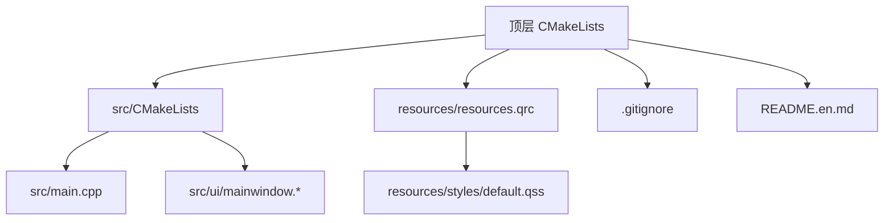
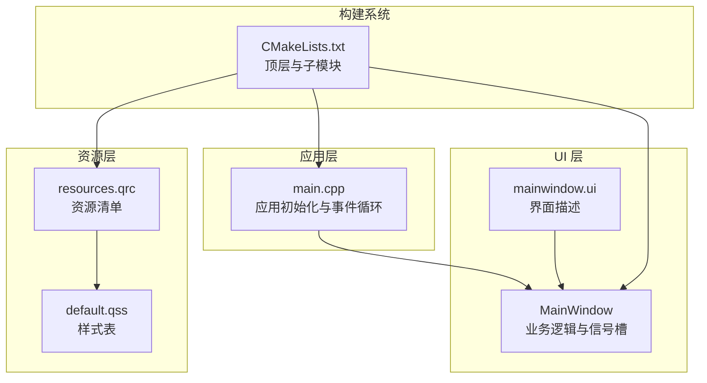
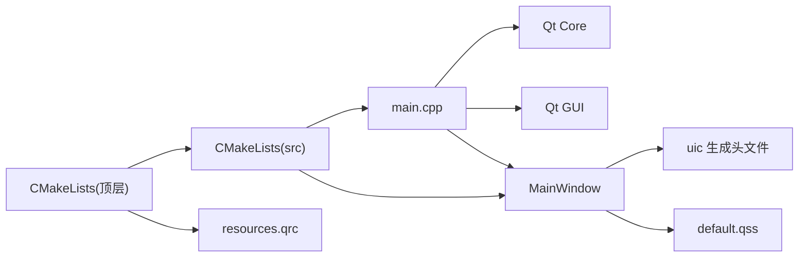

# 开发指南

<cite>
**本文档引用的文件**   
- [CMakeLists.txt](file://CMakeLists.txt)
- [src/CMakeLists.txt](file://src/CMakeLists.txt)
- [src/main.cpp](file://src/main.cpp)
- [src/ui/mainwindow.h](file://src/ui/mainwindow.h)
- [src/ui/mainwindow.cpp](file://src/ui/mainwindow.cpp)
- [src/ui/mainwindow.ui](file://src/ui/mainwindow.ui)
- [resources/resources.qrc](file://resources/resources.qrc)
- [resources/styles/default.qss](file://resources/styles/default.qss)
- [.gitignore](file://.gitignore)
- [README.en.md](file://README.en.md)
</cite>

## 目录
1. [简介](#简介)
2. [项目结构](#项目结构)
3. [核心组件](#核心组件)
4. [架构总览](#架构总览)
5. [详细组件分析](#详细组件分析)
6. [依赖关系分析](#依赖关系分析)
7. [性能考虑](#性能考虑)
8. [故障排查指南](#故障排查指南)
9. [结论](#结论)
10. [附录](#附录)

## 简介
本指南面向使用 C++ 与 Qt 进行桌面应用开发的团队，提供从编码规范、命名约定到调试与性能分析、错误处理与日志策略、Git 工作流与代码审查、以及开发环境与 IDE 配置的全流程建议。本项目基于 CMake + Qt（含 QSS 样式资源），采用模块化 UI 组织方式，适合快速迭代与团队协作。

## 项目结构
项目采用分层与按功能组织相结合的结构：
- 顶层 CMakeLists 管理构建系统与资源集成
- src 目录包含可执行入口与 UI 模块
- resources 目录集中管理样式与资源清单
- .gitignore 与 README 提供协作与说明信息

图表来源
- [CMakeLists.txt](file://CMakeLists.txt)
- [src/CMakeLists.txt](file://src/CMakeLists.txt)
- [src/main.cpp](file://src/main.cpp)
- [src/ui/mainwindow.h](file://src/ui/mainwindow.h)
- [src/ui/mainwindow.cpp](file://src/ui/mainwindow.cpp)
- [src/ui/mainwindow.ui](file://src/ui/mainwindow.ui)
- [resources/resources.qrc](file://resources/resources.qrc)
- [resources/styles/default.qss](file://resources/styles/default.qss)
- [.gitignore](file://.gitignore)
- [README.en.md](file://README.en.md)

章节来源
- [CMakeLists.txt](file://CMakeLists.txt)
- [src/CMakeLists.txt](file://src/CMakeLists.txt)
- [src/main.cpp](file://src/main.cpp)
- [src/ui/mainwindow.h](file://src/ui/mainwindow.h)
- [src/ui/mainwindow.cpp](file://src/ui/mainwindow.cpp)
- [src/ui/mainwindow.ui](file://src/ui/mainwindow.ui)
- [resources/resources.qrc](file://resources/resources.qrc)
- [resources/styles/default.qss](file://resources/styles/default.qss)
- [.gitignore](file://.gitignore)
- [README.en.md](file://README.en.md)

## 核心组件
- 应用入口 main.cpp：负责 Qt 应用初始化、事件循环启动与主窗口生命周期管理。
- 主窗口 MainWindow：封装界面逻辑、信号槽连接与用户交互处理。
- UI 描述文件 mainwindow.ui：声明界面布局与控件树，由 uic 生成对应头文件供 C++ 使用。
- 资源系统 resources.qrc：集中注册样式与媒体资源，便于跨平台打包与加载。
- 样式 default.qss：统一外观主题，支持运行时切换与动态更新。

章节来源
- [src/main.cpp](file://src/main.cpp)
- [src/ui/mainwindow.h](file://src/ui/mainwindow.h)
- [src/ui/mainwindow.cpp](file://src/ui/mainwindow.cpp)
- [src/ui/mainwindow.ui](file://src/ui/mainwindow.ui)
- [resources/resources.qrc](file://resources/resources.qrc)
- [resources/styles/default.qss](file://resources/styles/default.qss)

## 架构总览
整体采用“入口层 + UI 层 + 资源层”的清晰分层，配合 CMake 构建系统完成编译与链接。Qt 的信号/槽机制驱动 UI 交互，QSS 提供主题化能力，uic 将 .ui 转换为 C++ 接口。

图表来源
- [src/main.cpp](file://src/main.cpp)
- [src/ui/mainwindow.h](file://src/ui/mainwindow.h)
- [src/ui/mainwindow.cpp](file://src/ui/mainwindow.cpp)
- [src/ui/mainwindow.ui](file://src/ui/mainwindow.ui)
- [resources/resources.qrc](file://resources/resources.qrc)
- [resources/styles/default.qss](file://resources/styles/default.qss)
- [CMakeLists.txt](file://CMakeLists.txt)
- [src/CMakeLists.txt](file://src/CMakeLists.txt)

## 详细组件分析

### 应用入口 main.cpp
职责：
- 创建 QApplication 实例并设置全局属性（如高 DPI、字体等）
- 构造并显示主窗口
- 进入事件循环

最佳实践：
- 避免在入口中放置业务逻辑，保持轻量
- 合理设置异常安全与退出码
- 通过命令行参数或配置文件注入初始状态

章节来源
- [src/main.cpp](file://src/main.cpp)

### 主窗口 MainWindow
职责：
- 绑定 UI 控件与业务逻辑
- 管理信号与槽的连接与断开
- 协调数据加载、展示与用户操作反馈

设计要点：
- 单一职责：仅处理 UI 相关逻辑，复杂计算下沉至服务层
- 信号/槽解耦：通过槽函数隔离 UI 与后台任务
- 资源释放：确保析构时清理定时器、线程与临时对象

章节来源
- [src/ui/mainwindow.h](file://src/ui/mainwindow.h)
- [src/ui/mainwindow.cpp](file://src/ui/mainwindow.cpp)
- [src/ui/mainwindow.ui](file://src/ui/mainwindow.ui)

### UI 描述文件 mainwindow.ui
作用：
- 可视化定义控件布局、层级与默认属性
- 与 C++ 类协同，通过 uic 生成访问接口

维护建议：
- 控件命名遵循小驼峰或下划线风格（见命名标准）
- 避免在 .ui 中嵌入复杂逻辑，保持纯视图描述
- 使用分组与注释提升可读性

章节来源
- [src/ui/mainwindow.ui](file://src/ui/mainwindow.ui)

### 资源系统 resources.qrc 与样式 default.qss
作用：
- qrc 集中管理样式、图标等资源路径，便于打包与跨平台访问
- qss 统一外观主题，支持运行时切换与条件样式

使用建议：
- 资源路径以相对路径组织，避免硬编码绝对路径
- 样式按模块拆分，按需加载，减少内存占用
- 对关键样式变更进行回归测试

章节来源
- [resources/resources.qrc](file://resources/resources.qrc)
- [resources/styles/default.qss](file://resources/styles/default.qss)

### 构建系统 CMakeLists
作用：
- 顶层 CMakeLists 管理 Qt 版本、编译器选项与资源集成
- 子模块 CMakeLists 定义可执行目标、源文件与依赖库

优化建议：
- 启用增量编译与并行构建
- 分离 Debug/Release 配置，开启必要警告与静态分析
- 使用 find_package 定位 Qt，避免路径硬编码

章节来源
- [CMakeLists.txt](file://CMakeLists.txt)
- [src/CMakeLists.txt](file://src/CMakeLists.txt)

## 依赖关系分析
- main.cpp 依赖 Qt 核心与 GUI 模块，并实例化 MainWindow
- MainWindow 依赖 uic 生成的 UI 头文件与 QSS 样式资源
- 构建阶段 CMake 负责解析 Qt 包、生成中间文件与链接

图表来源
- [src/main.cpp](file://src/main.cpp)
- [src/ui/mainwindow.h](file://src/ui/mainwindow.h)
- [src/ui/mainwindow.cpp](file://src/ui/mainwindow.cpp)
- [src/ui/mainwindow.ui](file://src/ui/mainwindow.ui)
- [resources/resources.qrc](file://resources/resources.qrc)
- [resources/styles/default.qss](file://resources/styles/default.qss)
- [CMakeLists.txt](file://CMakeLists.txt)
- [src/CMakeLists.txt](file://src/CMakeLists.txt)

章节来源
- [src/main.cpp](file://src/main.cpp)
- [src/ui/mainwindow.h](file://src/ui/mainwindow.h)
- [src/ui/mainwindow.cpp](file://src/ui/mainwindow.cpp)
- [src/ui/mainwindow.ui](file://src/ui/mainwindow.ui)
- [resources/resources.qrc](file://resources/resources.qrc)
- [resources/styles/default.qss](file://resources/styles/default.qss)
- [CMakeLists.txt](file://CMakeLists.txt)
- [src/CMakeLists.txt](file://src/CMakeLists.txt)

## 性能考虑
- 渲染性能
  - 避免在 UI 线程执行耗时操作，使用异步任务与进度反馈
  - 合理使用模型/视图，大数据量场景优先使用自定义模型
  - 减少重绘与布局计算，批量更新控件状态
- 内存管理
  - 遵循 RAII，避免裸指针；必要时使用智能指针
  - 及时断开不再使用的信号/槽，防止悬挂引用
  - 大对象池化复用，降低频繁分配开销
- 构建与运行
  - 启用链接时优化（LTO）与符号剥离（Release）
  - 使用缓存与增量构建，缩短编译时间
  - 监控启动时间，延迟加载非必要模块

[本节为通用指导，不直接分析具体文件]

## 故障排查指南
常见问题与对策：
- 构建失败
  - 检查 Qt 版本与 CMake 配置是否匹配
  - 确认资源路径与 qrc 注册正确
  - 查看编译器输出中的缺失头文件或库链接错误
- 运行时崩溃
  - 使用断点与调用栈定位崩溃位置
  - 检查空指针、越界访问与未初始化变量
  - 验证信号/槽参数类型与数量一致性
- UI 异常
  - 使用 Qt Creator 的 UI 预览与 Inspector 工具
  - 检查 QSS 语法与选择器优先级
  - 通过日志打印关键状态与事件触发顺序

调试技巧：
- 使用断点、条件断点与日志输出组合定位问题
- 利用 Valgrind/AddressSanitizer 检测内存问题
- 使用性能分析器（如 perf、VTune、Instruments）识别瓶颈

章节来源
- [CMakeLists.txt](file://CMakeLists.txt)
- [src/CMakeLists.txt](file://src/CMakeLists.txt)
- [resources/resources.qrc](file://resources/resources.qrc)
- [resources/styles/default.qss](file://resources/styles/default.qss)

## 结论
本项目采用清晰的层次结构与成熟的 Qt 生态，结合 CMake 构建系统，具备良好的可维护性与扩展性。遵循本指南的编码规范、调试方法与性能优化建议，可显著提升开发效率与产品质量。建议在团队内推广统一的命名、日志与错误处理模式，并通过 Git 工作流与代码审查保障协作质量。

[本节为总结性内容，不直接分析具体文件]

## 附录

### C++ 编码规范
- 语言特性
  - 优先使用现代 C++（C++17/20）特性，如 auto、智能指针、移动语义
  - 避免裸指针与手动内存管理，使用 std::unique_ptr/std::shared_ptr
  - 常量正确性：尽量使用 const 与 constexpr
- 代码风格
  - 缩进与括号风格统一（推荐 Allman 或 K&R，团队一致即可）
  - 函数与变量命名遵循小驼峰或下划线风格（见命名标准）
  - 单文件职责单一，避免过长函数与过深嵌套
- 头文件与实现
  - 头文件自包含，使用 include guards 或 #pragma once
  - 最小化头文件依赖，前向声明优先
  - 实现文件按功能划分，避免巨型源文件

### Qt 开发约定
- 对象模型
  - 使用 QObject 父子关系管理生命周期
  - 信号/槽连接使用新语法，明确连接类型（Qt::UniqueConnection 等）
  - 避免在构造函数中发起耗时操作
- UI 与资源
  - .ui 仅描述界面，逻辑放入 C++ 类
  - 资源路径统一通过 qrc 管理，避免硬编码
  - 样式表按模块拆分，支持运行时切换
- 线程与并发
  - UI 线程只处理界面更新，后台任务使用 QThread/QRunnable
  - 跨线程通信使用信号/槽或队列机制

### 命名标准
- 类名：大驼峰（例如 MainWindow、DataModel）
- 函数与方法：小驼峰（例如 loadSettings、updateView）
- 成员变量：前缀 m_ 或小写加下划线（例如 m_count、data_list）
- 常量：全大写加下划线（例如 MAX_RETRY_COUNT）
- 枚举与命名空间：大驼峰或全大写（例如 Status、NamespaceName）
- 文件与目录：小写加下划线（例如 main_window.cpp、ui_components）

### 错误处理模式
- 异常与返回值
  - 对外 API 返回结果对象或错误码，内部异常捕获后转为可恢复状态
  - 关键路径使用强异常安全保证，非关键路径允许降级
- 日志与诊断
  - 统一日志级别（DEBUG/INFO/WARN/ERROR/FATAL）
  - 记录上下文信息（函数名、行号、请求 ID）
  - 敏感信息脱敏，避免泄露密钥与用户隐私
- 用户提示
  - 错误消息友好且可操作，提供重试或反馈入口
  - 区分可恢复与不可恢复错误，给出不同引导

### 日志记录策略
- 分级输出
  - DEBUG：详细过程信息，仅在开发环境启用
  - INFO：关键业务流程与状态变更
  - WARN：潜在问题与边界情况
  - ERROR：异常与失败路径
  - FATAL：致命错误与应用终止
- 输出目标
  - 控制台（开发）、文件（生产）、远程收集（聚合分析）
- 性能影响
  - 异步写入，避免阻塞 UI 线程
  - 条件编译开关控制日志级别

### Git 工作流与代码审查
- 分支策略
  - main/master：稳定发布分支
  - develop：集成开发分支
  - feature/*：功能分支
  - hotfix/*：紧急修复分支
- 提交规范
  - 使用语义化提交信息（feat/fix/docs/chore 等）
  - 每次提交聚焦单一变更，避免混合修改
- 代码审查
  - 强制 Pull Request 与至少一名审查者批准
  - 自动化检查：CI 构建、单元测试、静态分析
  - 关注可读性、安全性与性能影响

### 贡献指南
- 环境准备
  - 安装 Qt、CMake、编译器与 IDE（推荐 Qt Creator/VS Code）
  - 配置环境变量与工具链，确保构建脚本可执行
- 开发流程
  - 拉取最新代码，创建功能分支
  - 编写代码与测试，本地验证通过
  - 推送分支并提交 PR，等待审查与 CI 结果
- 文档与示例
  - 更新相关文档与示例代码
  - 保持 README 与变更记录同步

### 开发环境与 IDE 设置建议
- Qt Creator
  - 配置 Kit（编译器、Qt 版本、调试器）
  - 启用代码格式化、静态分析与自动补全
  - 使用内置构建系统与调试器
- VS Code
  - 安装 C/C++、CMake、Qt 插件
  - 配置 tasks.json 与 launch.json
  - 使用 CMake Tools 管理构建与调试
- 通用建议
  - 启用编译器警告（-Wall/-Wextra）与静态分析
  - 使用预编译头与增量构建加速编译
  - 统一换行符与编码（UTF-8）

章节来源
- [CMakeLists.txt](file://CMakeLists.txt)
- [src/CMakeLists.txt](file://src/CMakeLists.txt)
- [src/main.cpp](file://src/main.cpp)
- [src/ui/mainwindow.h](file://src/ui/mainwindow.h)
- [src/ui/mainwindow.cpp](file://src/ui/mainwindow.cpp)
- [src/ui/mainwindow.ui](file://src/ui/mainwindow.ui)
- [resources/resources.qrc](file://resources/resources.qrc)
- [resources/styles/default.qss](file://resources/styles/default.qss)
- [.gitignore](file://.gitignore)
- [README.en.md](file://README.en.md)