# 性能优化

<cite>
**本文引用的文件**   
- [CMakeLists.txt](file://CMakeLists.txt)
- [src/CMakeLists.txt](file://src/CMakeLists.txt)
- [src/main.cpp](file://src/main.cpp)
- [src/ui/mainwindow.h](file://src/ui/mainwindow.h)
- [src/ui/mainwindow.cpp](file://src/ui/mainwindow.cpp)
- [src/ui/mainwindow.ui](file://src/ui/mainwindow.ui)
- [resources/styles/default.qss](file://resources/styles/default.qss)
- [resources/resources.qrc](file://resources/resources.qrc)
- [src/utils/ringbuffer.h](file://src/utils/ringbuffer.h)
- [src/models/cantracemodel.h](file://src/models/cantracemodel.h)
- [src/models/cantracemodel.cpp](file://src/models/cantracemodel.cpp)
- [src/core/canframe.h](file://src/core/canframe.h)
- [src/ui/traceview.cpp](file://src/ui/traceview.cpp)
- [src/ui/graphicview.h](file://src/ui/graphicview.h)
- [src/ui/graphicview.cpp](file://src/ui/graphicview.cpp)
- [src/ui/graphic/downsample.cpp](file://src/ui/graphic/downsample.cpp)
</cite>

## 更新摘要
**所做更改**   
- 新增图形视图性能优化章节，详细说明O(视口宽)恒定渲染成本的降采样算法实现
- 添加多种抽稀策略的技术细节：MinMax、Avg、First、Decimate四种策略
- 增强环形缓冲区与降采样算法的集成说明
- 更新UI渲染优化部分，包含视口缓存和批量重绘机制
- 新增图形视图组件的性能基准和优化建议

## 目录
1. [简介](#简介)
2. [项目结构](#项目结构)
3. [核心组件](#核心组件)
4. [架构总览](#架构总览)
5. [详细组件分析](#详细组件分析)
6. [依赖关系分析](#依赖关系分析)
7. [性能考虑](#性能考虑)
8. [故障排查指南](#故障排查指南)
9. [结论](#结论)
10. [附录](#附录)

## 简介
本指南面向Qt应用程序的性能优化，聚焦以下目标：
- 内存管理优化：对象生命周期管理与内存泄漏检测
- UI渲染优化：事件循环优化、重绘区域控制与异步加载策略
- 样式与资源：QSS样式优化与资源文件打包策略
- 性能分析与问题定位：工具使用与常见问题排查

本指南结合仓库中的Qt工程结构（CMake构建、主窗口UI、QSS样式与资源qrc）给出可操作的实践建议。

## 项目结构
该Qt应用采用CMake组织，主要包含：
- 顶层CMake配置与子模块CMake
- 应用入口main.cpp
- 主窗口UI与逻辑（mainwindow.* 与 mainwindow.ui）
- 样式与资源（default.qss 与 resources.qrc）
- 高性能CAN跟踪系统与环形缓冲区实现
- **新增**：图形视图性能优化系统，包含降采样算法和视口缓存机制

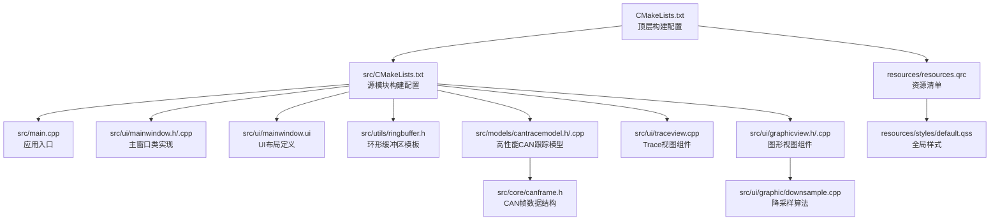

图表来源
- [CMakeLists.txt](file://CMakeLists.txt)
- [src/CMakeLists.txt](file://src/CMakeLists.txt)
- [src/main.cpp](file://src/main.cpp)
- [src/ui/mainwindow.h](file://src/ui/mainwindow.h)
- [src/ui/mainwindow.cpp](file://src/ui/mainwindow.cpp)
- [src/ui/mainwindow.ui](file://src/ui/mainwindow.ui)
- [resources/resources.qrc](file://resources/resources.qrc)
- [resources/styles/default.qss](file://resources/styles/default.qss)
- [src/utils/ringbuffer.h](file://src/utils/ringbuffer.h)
- [src/models/cantracemodel.h](file://src/models/cantracemodel.h)
- [src/core/canframe.h](file://src/core/canframe.h)
- [src/ui/traceview.cpp](file://src/ui/traceview.cpp)
- [src/ui/graphicview.h](file://src/ui/graphicview.h)
- [src/ui/graphicview.cpp](file://src/ui/graphicview.cpp)
- [src/ui/graphic/downsample.cpp](file://src/ui/graphic/downsample.cpp)

章节来源
- [CMakeLists.txt](file://CMakeLists.txt)
- [src/CMakeLists.txt](file://src/CMakeLists.txt)
- [src/main.cpp](file://src/main.cpp)
- [src/ui/mainwindow.h](file://src/ui/mainwindow.h)
- [src/ui/mainwindow.cpp](file://src/ui/mainwindow.cpp)
- [src/ui/mainwindow.ui](file://src/ui/mainwindow.ui)
- [resources/resources.qrc](file://resources/resources.qrc)
- [resources/styles/default.qss](file://resources/styles/default.qss)
- [src/utils/ringbuffer.h](file://src/utils/ringbuffer.h)
- [src/models/cantracemodel.h](file://src/models/cantracemodel.h)
- [src/core/canframe.h](file://src/core/canframe.h)
- [src/ui/traceview.cpp](file://src/ui/traceview.cpp)
- [src/ui/graphicview.h](file://src/ui/graphicview.h)
- [src/ui/graphicview.cpp](file://src/ui/graphicview.cpp)
- [src/ui/graphic/downsample.cpp](file://src/ui/graphic/downsample.cpp)

## 核心组件
- 应用入口：负责初始化Qt应用、设置样式与资源、创建并显示主窗口
- 主窗口：承载UI与业务交互，通常涉及事件处理、数据绑定与视图更新
- 样式系统：通过QSS统一外观，影响渲染路径与绘制开销
- 资源系统：通过qrc集中管理图片、字体等静态资源，影响加载与缓存
- 环形缓冲区存储系统：提供固定容量的O(1)追加操作，替代传统QVector
- 高性能CAN跟踪模型：集成四阶段优化架构，支持百万级帧数据处理
- TraceView组件：集成可见行范围管理和智能缓存机制
- **新增**：图形视图组件：基于QCustomPlot的高性能波形显示，支持多种降采样策略

章节来源
- [src/main.cpp](file://src/main.cpp)
- [src/ui/mainwindow.h](file://src/ui/mainwindow.h)
- [src/ui/mainwindow.cpp](file://src/ui/mainwindow.cpp)
- [resources/styles/default.qss](file://resources/styles/default.qss)
- [resources/resources.qrc](file://resources/resources.qrc)
- [src/utils/ringbuffer.h](file://src/utils/ringbuffer.h)
- [src/models/cantracemodel.h](file://src/models/cantracemodel.h)
- [src/ui/traceview.cpp](file://src/ui/traceview.cpp)
- [src/ui/graphicview.h](file://src/ui/graphicview.h)
- [src/ui/graphicview.cpp](file://src/ui/graphicview.cpp)
- [src/ui/graphic/downsample.cpp](file://src/ui/graphic/downsample.cpp)

## 架构总览
下图展示从应用启动到UI渲染的关键流程，以及样式与资源的加载点。

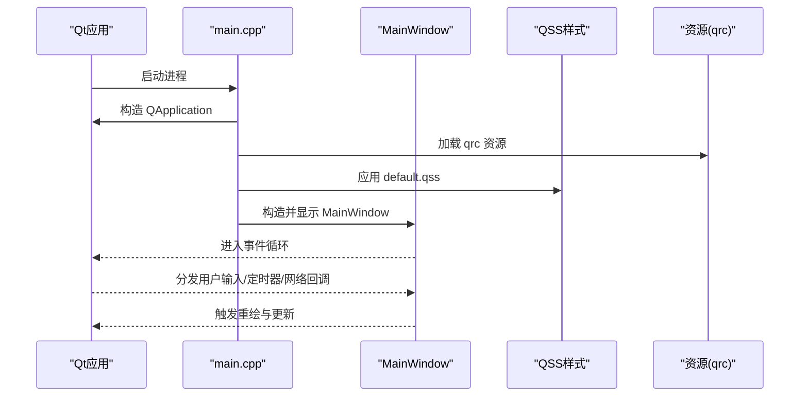

图表来源
- [src/main.cpp](file://src/main.cpp)
- [src/ui/mainwindow.cpp](file://src/ui/mainwindow.cpp)
- [resources/resources.qrc](file://resources/resources.qrc)
- [resources/styles/default.qss](file://resources/styles/default.qss)

## 详细组件分析

### 应用入口（main.cpp）
职责与优化要点：
- 尽早完成必要的资源与样式初始化，避免在事件循环中阻塞
- 合理设置Qt运行期选项（如高DPI、线程模型），减少运行时开销
- 将耗时初始化延迟到后台线程或按需加载

图表来源
- [src/main.cpp](file://src/main.cpp)

章节来源
- [src/main.cpp](file://src/main.cpp)

### 主窗口（mainwindow.h/.cpp/.ui）
职责与优化要点：
- 事件处理：避免在槽函数中执行长耗时任务；使用信号/槽解耦与队列连接
- 视图更新：合并频繁更新，使用update()而非repaint()，必要时指定更新区域
- 数据绑定：大列表使用模型/视图（QAbstractItemModel），启用分页与懒加载
- 动画与过渡：优先使用Qt动画框架，避免手动高频刷新

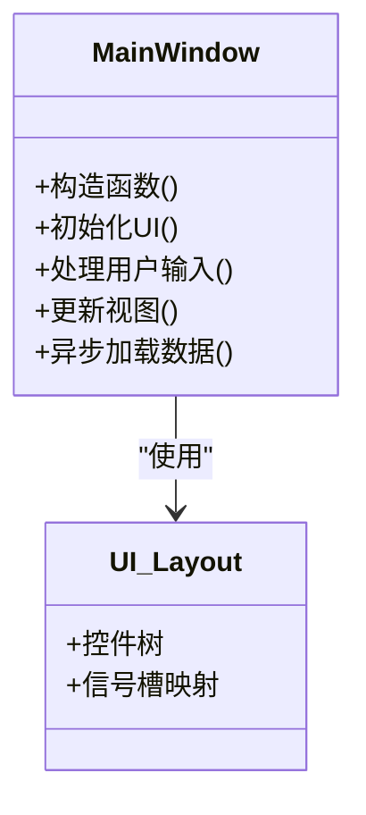

图表来源
- [src/ui/mainwindow.h](file://src/ui/mainwindow.h)
- [src/ui/mainwindow.cpp](file://src/ui/mainwindow.cpp)
- [src/ui/mainwindow.ui](file://src/ui/mainwindow.ui)

章节来源
- [src/ui/mainwindow.h](file://src/ui/mainwindow.h)
- [src/ui/mainwindow.cpp](file://src/ui/mainwindow.cpp)
- [src/ui/mainwindow.ui](file://src/ui/mainwindow.ui)

### 环形缓冲区存储系统（ringbuffer.h）
高性能环形缓冲区模板类，提供固定容量的O(1)追加操作

核心特性：
- **固定容量设计**：默认100万帧容量，可配置，避免动态扩容开销
- **O(1)追加操作**：push方法时间复杂度为O(1)，满时自动覆盖最旧元素
- **智能指针返回**：push返回被覆盖元素的指针，便于上层处理
- **移动语义支持**：提供move版本的push，避免不必要的拷贝
- **随机访问支持**：at方法支持按逻辑索引访问，内部通过模运算映射

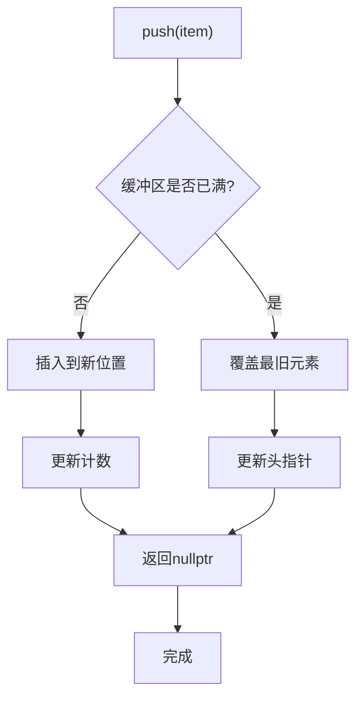

图表来源
- [src/utils/ringbuffer.h:19-47](file://src/utils/ringbuffer.h#L19-L47)

章节来源
- [src/utils/ringbuffer.h](file://src/utils/ringbuffer.h)

### CAN跟踪模型（cantracemodel.h/.cpp）
集成四阶段优化架构的高性能CAN跟踪模型

#### Phase 1: 行缓存格式化
- **可见行缓存**：仅缓存当前可见范围内的行数据，减少内存占用
- **智能淘汰**：根据滚动位置自动淘汰不可见行的缓存
- **格式延迟**：仅在需要显示时才进行字符串格式化

#### Phase 2: 批量更新与刷新率控制
- **待处理队列**：使用pendingFrames暂存新帧，避免频繁UI更新
- **可调刷新率**：支持High(50ms)、Medium(100ms)、Low(200ms)、Paused四种模式
- **批量提交**：定时器触发时批量提交所有待处理帧，减少信号发射次数

#### Phase 3: 智能行缓存
- **RowCache结构**：缓存每行的各列格式化结果和背景色
- **条件缓存**：仅在可见范围内缓存，超出范围自动清理
- **失效机制**：当数据变化时清除相关缓存，保证数据一致性

#### Phase 4: 环形缓冲区存储
- **内存优化**：从QVector改为RingBuffer，避免O(n)内存移动
- **固定容量**：支持百万级帧存储，内存占用恒定
- **序列号管理**：使用seqCounter确保No.列永不回退
- **覆盖模式**：支持按CAN ID覆盖或滚动覆盖两种模式

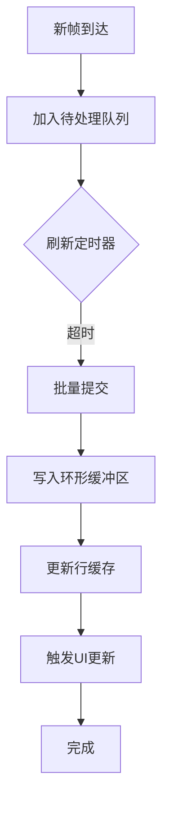

图表来源
- [src/models/cantracemodel.cpp:206-225](file://src/models/cantracemodel.cpp#L206-L225)
- [src/models/cantracemodel.cpp:245-302](file://src/models/cantracemodel.cpp#L245-L302)

章节来源
- [src/models/cantracemodel.h](file://src/models/cantracemodel.h)
- [src/models/cantracemodel.cpp](file://src/models/cantracemodel.cpp)

### TraceView组件（traceview.cpp）
高性能表格视图组件，集成可见行范围管理

核心特性：
- **可见行范围通知**：通过setVisibleRange接口通知模型当前可见范围
- **智能缓存管理**：配合CanTraceModel的行缓存机制，自动淘汰不可见行
- **Wireshark风格界面**：提供专业级的CAN数据分析界面
- **快捷键支持**：集成Ctrl+G跳转、Ctrl+F查找等高效导航功能

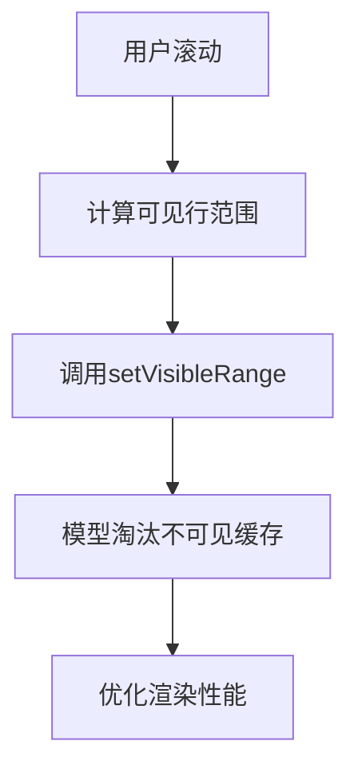

图表来源
- [src/ui/traceview.cpp:126-130](file://src/ui/traceview.cpp#L126-L130)

章节来源
- [src/ui/traceview.cpp](file://src/ui/traceview.cpp)

### 图形视图组件（graphicview.h/.cpp）
**新增功能**：基于QCustomPlot的高性能波形显示组件，支持多种降采样策略

核心特性：
- **视口降采样**：实现O(视口宽)恒定渲染成本，支持百万级数据实时显示
- **多种抽稀策略**：MinMax（保轮廓）、Avg（平均值）、First（首点）、Decimate（等间隔）
- **视口缓存**：缓存当前视口的降采样结果，避免重复计算
- **增量更新**：环形缓冲写入时标记min/max失效，按需重新计算
- **批量重绘**：50ms定时批量重绘，平衡实时性与性能

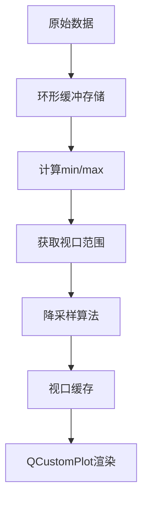

图表来源
- [src/ui/graphicview.cpp:2037-2111](file://src/ui/graphicview.cpp#L2037-L2111)

章节来源
- [src/ui/graphicview.h](file://src/ui/graphicview.h)
- [src/ui/graphicview.cpp](file://src/ui/graphicview.cpp)

### 降采样算法（downsample.cpp）
**新增功能**：实现O(视口宽)恒定渲染成本的多种抽稀策略

#### 算法原理
- **二分查找定位**：使用lowerBound快速定位视口区间[t1, t2]内的数据点
- **外延点处理**：区间两侧各外延1个点，保证阶梯线边缘跳变沿渲染正确
- **桶化策略**：将时间轴划分为多个桶，每个桶内应用不同的抽稀策略

#### 四种抽稀策略

**MinMax策略（默认）**：
- 每桶保留最小值和最大值两个点，保持波形轮廓特征
- 适用于需要保持波形形状的场景
- 输出点数约为桶数的2倍

**Avg策略**：
- 计算桶内所有点的平均值，平滑噪声
- 适用于高频噪声数据的可视化
- 输出点数等于桶数

**First策略**：
- 取桶内第一个点作为代表
- 计算量最小，适合大数据集
- 可能丢失波形细节

**Decimate策略**：
- 等间隔抽取，每N个点取1个
- 保证最新数据点不丢失
- 适合均匀分布的数据

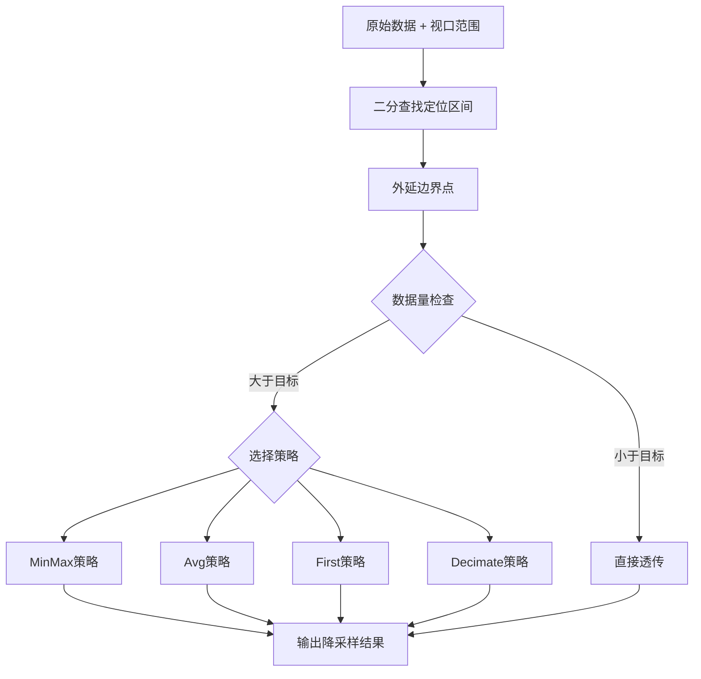

图表来源
- [src/ui/graphic/downsample.cpp:23-162](file://src/ui/graphic/downsample.cpp#L23-L162)

章节来源
- [src/ui/graphic/downsample.cpp](file://src/ui/graphic/downsample.cpp)

### 样式系统（default.qss）
职责与优化要点：
- 选择器粒度：尽量精确匹配，避免通配符与深层嵌套
- 属性裁剪：仅声明必要样式属性，减少解析与计算
- 背景与阴影：谨慎使用渐变、阴影与复杂边框，评估绘制成本
- 动态切换：避免在事件循环中频繁setStyleSheet，批量更新后一次性应用

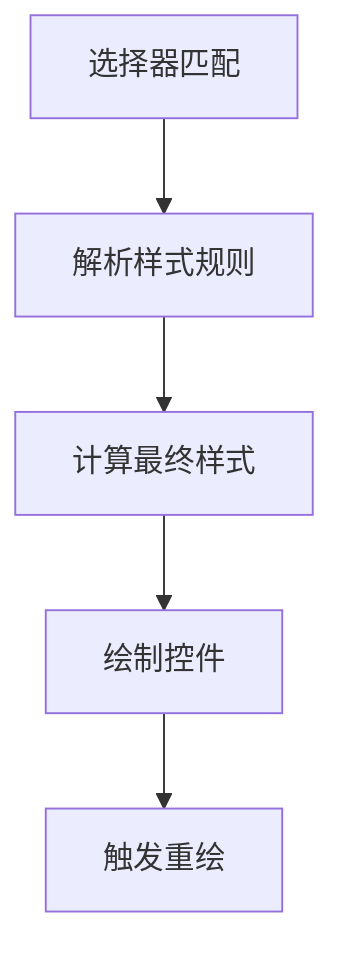

图表来源
- [resources/styles/default.qss](file://resources/styles/default.qss)

章节来源
- [resources/styles/default.qss](file://resources/styles/default.qss)

### 资源系统（resources.qrc）
职责与优化要点：
- 分类与压缩：按功能分组，启用压缩减少I/O与内存占用
- 按需加载：大图与不常用资源延迟加载，避免启动时峰值内存
- 缓存策略：复用已加载资源，避免重复解码与解压
- 版本管理：资源变更需清理构建缓存，确保一致性

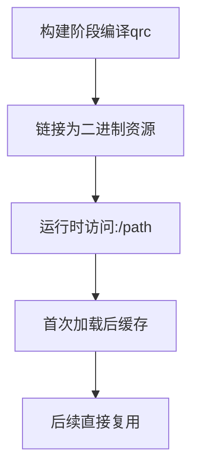

图表来源
- [resources/resources.qrc](file://resources/resources.qrc)

章节来源
- [resources/resources.qrc](file://resources/resources.qrc)

## 依赖关系分析
- 构建依赖：顶层CMake聚合子模块，确保资源与源码正确链接
- 运行时依赖：main.cpp依赖Qt库、样式与资源；主窗口依赖UI布局与样式
- CAN跟踪模型依赖环形缓冲区模板和CAN帧数据结构
- TraceView组件依赖CanTraceModel和FilterEngine
- **新增**：图形视图组件依赖降采样算法和QCustomPlot库
- **新增**：降采样算法依赖环形缓冲区模板
- 潜在耦合：样式与UI强耦合，修改QSS可能影响渲染性能；资源路径变更需同步qrc

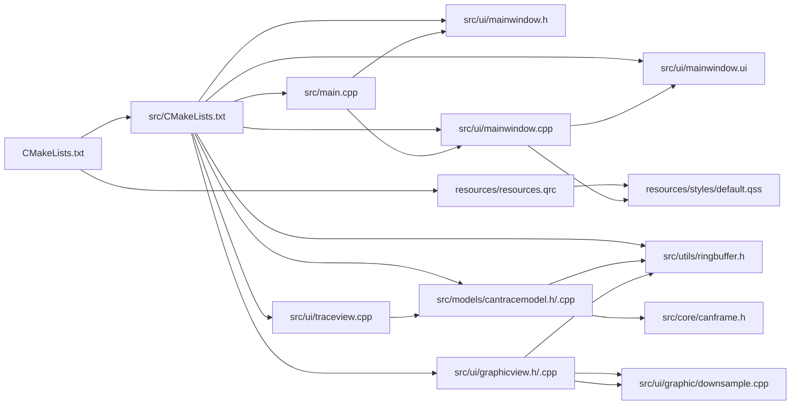

图表来源
- [CMakeLists.txt](file://CMakeLists.txt)
- [src/CMakeLists.txt](file://src/CMakeLists.txt)
- [src/main.cpp](file://src/main.cpp)
- [src/ui/mainwindow.h](file://src/ui/mainwindow.h)
- [src/ui/mainwindow.cpp](file://src/ui/mainwindow.cpp)
- [src/ui/mainwindow.ui](file://src/ui/mainwindow.ui)
- [resources/resources.qrc](file://resources/resources.qrc)
- [resources/styles/default.qss](file://resources/styles/default.qss)
- [src/utils/ringbuffer.h](file://src/utils/ringbuffer.h)
- [src/models/cantracemodel.h](file://src/models/cantracemodel.h)
- [src/core/canframe.h](file://src/core/canframe.h)
- [src/ui/traceview.cpp](file://src/ui/traceview.cpp)
- [src/ui/graphicview.h](file://src/ui/graphicview.h)
- [src/ui/graphicview.cpp](file://src/ui/graphicview.cpp)
- [src/ui/graphic/downsample.cpp](file://src/ui/graphic/downsample.cpp)

章节来源
- [CMakeLists.txt](file://CMakeLists.txt)
- [src/CMakeLists.txt](file://src/CMakeLists.txt)
- [src/main.cpp](file://src/main.cpp)
- [src/ui/mainwindow.h](file://src/ui/mainwindow.h)
- [src/ui/mainwindow.cpp](file://src/ui/mainwindow.cpp)
- [src/ui/mainwindow.ui](file://src/ui/mainwindow.ui)
- [resources/resources.qrc](file://resources/resources.qrc)
- [resources/styles/default.qss](file://resources/styles/default.qss)
- [src/utils/ringbuffer.h](file://src/utils/ringbuffer.h)
- [src/models/cantracemodel.h](file://src/models/cantracemodel.h)
- [src/core/canframe.h](file://src/core/canframe.h)
- [src/ui/traceview.cpp](file://src/ui/traceview.cpp)
- [src/ui/graphicview.h](file://src/ui/graphicview.h)
- [src/ui/graphicview.cpp](file://src/ui/graphicview.cpp)
- [src/ui/graphic/downsample.cpp](file://src/ui/graphic/downsample.cpp)

## 性能考虑

### 内存管理优化
- 对象生命周期
  - 使用父子层级自动释放：将父对象显式传递，避免悬空指针与重复释放
  - 智能指针与RAII：对非Qt管理的对象使用智能指针，确保异常安全
  - 容器与临时对象：避免在热点路径频繁分配/释放，使用对象池或预分配
- 环形缓冲区内存优化
  - 固定容量设计：避免动态扩容导致的内存碎片和重新分配
  - O(1)追加操作：消除QVector::removeFirst()的O(n)内存移动开销
  - 内存占用恒定：百万帧场景内存占用从O(n·sizeof(QByteArray))降至O(capacity·sizeof(CanFrame))
- 内存泄漏检测
  - 开发环境：启用调试输出与日志，配合平台工具（如Valgrind、AddressSanitizer）定位泄漏
  - 运行时统计：记录关键对象的创建/销毁计数，发现增长趋势异常
  - 可视化：借助IDE内存分析器生成快照对比，定位持续增长的对象

### UI渲染优化
- 事件循环优化
  - 避免阻塞事件循环：将耗时操作放入工作线程，通过信号/槽回传结果
  - 降低事件频率：节流/防抖高频输入（鼠标移动、滚动），合并更新请求
  - 优先级调度：区分前台UI与后台任务，保证响应性
- 批量更新与刷新率控制
  - 待处理队列：使用pendingFrames暂存新帧，避免频繁UI更新
  - 可调刷新率：支持High(50ms)、Medium(100ms)、Low(200ms)、Paused四种模式
  - 批量提交：定时器触发时批量提交所有待处理帧，减少信号发射次数
- 可见行范围管理
  - 智能缓存：仅缓存当前可见范围内的行数据，减少内存占用
  - 自动淘汰：根据滚动位置自动淘汰不可见行的缓存
  - 范围通知：TraceView通过setVisibleRange接口通知模型可见范围变化
- 重绘区域控制
  - 局部更新：使用update(rect)指定脏矩形，减少全量重绘
  - 合并绘制：批量更新后再触发一次重绘，避免抖动
  - 自定义绘制：仅在必要时重写paintEvent，并确保绘制路径简洁
- 智能行缓存
  - 可见行缓存：仅缓存当前可见范围内的行数据，减少内存占用
  - 智能淘汰：根据滚动位置自动淘汰不可见行的缓存
  - 格式延迟：仅在需要显示时才进行字符串格式化
- 异步加载策略
  - 数据加载：使用QNetworkAccessManager或自定义线程池，分片拉取与缓存
  - 资源加载：大图与字体按需加载，首屏最小化资源集
  - 进度反馈：提供占位与骨架屏，提升感知性能
- **新增**：图形视图性能优化
  - **视口降采样**：实现O(视口宽)恒定渲染成本，支持百万级数据实时显示
  - **多种抽稀策略**：MinMax（保轮廓）、Avg（平均值）、First（首点）、Decimate（等间隔）
  - **视口缓存**：缓存当前视口的降采样结果，避免重复计算
  - **增量更新**：环形缓冲写入时标记min/max失效，按需重新计算
  - **批量重绘**：50ms定时批量重绘，平衡实时性与性能

### 样式与资源优化
- QSS样式优化
  - 选择器精简：避免深层嵌套与通配符，提高匹配效率
  - 属性裁剪：仅声明必要属性，减少解析与计算
  - 动态样式：避免在事件循环中频繁setStyleSheet，批量更新后一次性应用
- 资源文件打包
  - 分类与压缩：按功能分组，启用压缩减少体积与I/O
  - 按需加载：延迟加载非关键资源，降低启动内存峰值
  - 缓存复用：同一资源多次使用时保持引用，避免重复解码

### 构建与部署优化
- CMake优化
  - 增量构建：合理使用依赖声明，减少不必要的重新编译
  - 并行编译：开启多核编译，缩短构建时间
  - 发布模式：关闭调试符号与断言，启用优化级别
- 运行时配置
  - 高DPI与线程：根据目标平台调整Qt选项，平衡兼容性与性能
  - 日志级别：生产环境降低日志输出，减少I/O开销

## 故障排查指南
- 常见症状
  - 界面卡顿：检查事件循环是否被阻塞，是否存在高频重绘
  - 内存增长：观察对象数量与大小变化，定位未释放的容器或缓存
  - 启动缓慢：分析资源加载与样式解析耗时，拆分首屏依赖
- CAN跟踪性能问题
  - 帧丢失：检查环形缓冲区容量设置是否过小，导致频繁覆盖
  - 刷新延迟：调整刷新率设置，平衡实时性与性能
  - 内存溢出：监控环形缓冲区使用情况，必要时调整最大帧数限制
  - 缓存失效：检查setVisibleRange是否正确调用，确保缓存机制正常工作
- **新增**：图形视图性能问题
  - **渲染卡顿**：检查降采样策略是否合适，尝试切换到First或Decimate策略
  - **数据失真**：验证MinMax策略是否正确保留波形轮廓，调整桶大小
  - **内存占用过高**：确认环形缓冲区容量设置，避免过大容量
  - **视口缓存失效**：检查视口范围变化是否正确触发缓存重建
- 诊断步骤
  - 启用详细日志与统计：记录关键路径耗时与对象生命周期
  - 使用性能分析器：CPU火焰图、内存快照、GPU绘制统计
  - 回归验证：每次优化后复测关键指标，确保无退化
- 修复策略
  - 重构热点路径：拆分长函数、引入缓存与批处理
  - 降级与容错：在低性能设备上禁用昂贵特性（阴影、模糊）
  - 监控告警：在生产环境埋点关键指标，及时发现问题

## 结论
通过合理的内存管理、UI渲染优化与样式/资源策略，可以显著提升Qt应用的响应性与稳定性。**新增的环形缓冲区存储系统和四阶段优化架构**为处理大规模CAN数据提供了高性能解决方案，在百万帧场景下实现了内存占用恒定和O(1)追加操作。**TraceView组件的可见行范围管理**进一步提升了大数据集的渲染性能。**新增的图形视图组件及其降采样算法**实现了O(视口宽)恒定渲染成本，支持百万级波形数据的实时显示，通过多种抽稀策略满足不同场景需求。建议以"测量—假设—实验—验证"的闭环持续优化，并结合平台工具进行深度诊断。

## 附录
- 术语
  - 事件循环：Qt消息分发机制，驱动UI与异步回调
  - 脏矩形：需要重绘的区域，用于局部更新
  - qrc：Qt资源编译器，将资源嵌入二进制
  - 环形缓冲区：固定容量的循环数据结构，支持O(1)追加和覆盖
  - 待处理队列：暂存新数据的缓冲队列，用于批量处理
  - 可见行范围：当前屏幕上显示的数据行范围，用于智能缓存
  - **新增**：降采样算法：将大量数据点减少到可视数量的算法，保持关键特征
  - **新增**：视口缓存：缓存当前视口的降采样结果，避免重复计算
  - **新增**：抽稀策略：不同的数据点选择算法，如MinMax、Avg、First、Decimate
- 参考实践
  - 使用Qt内置性能工具（如Qt Creator Profiler）
  - 结合平台工具（Valgrind、ASan、Instruments）交叉验证
  - 建立性能基线与回归测试，保障长期质量
  - 针对CAN跟踪场景，使用环形缓冲区容量调优和刷新率配置
  - 利用TraceView的可见行范围管理优化大数据集渲染
  - **新增**：针对图形视图场景，选择合适的降采样策略和视口缓存配置
  - **新增**：使用性能分析器监控降采样算法的执行时间和内存占用