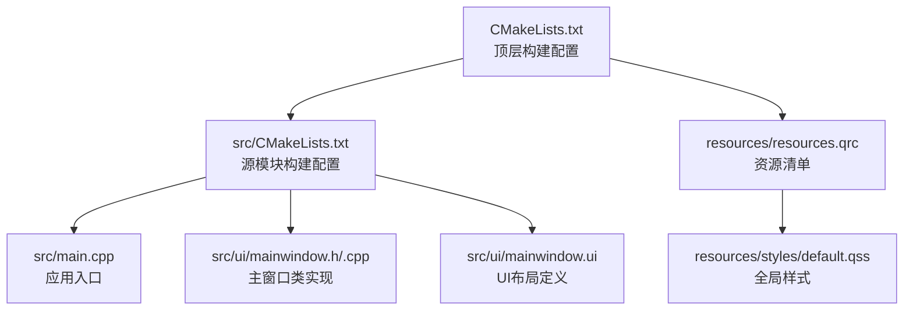
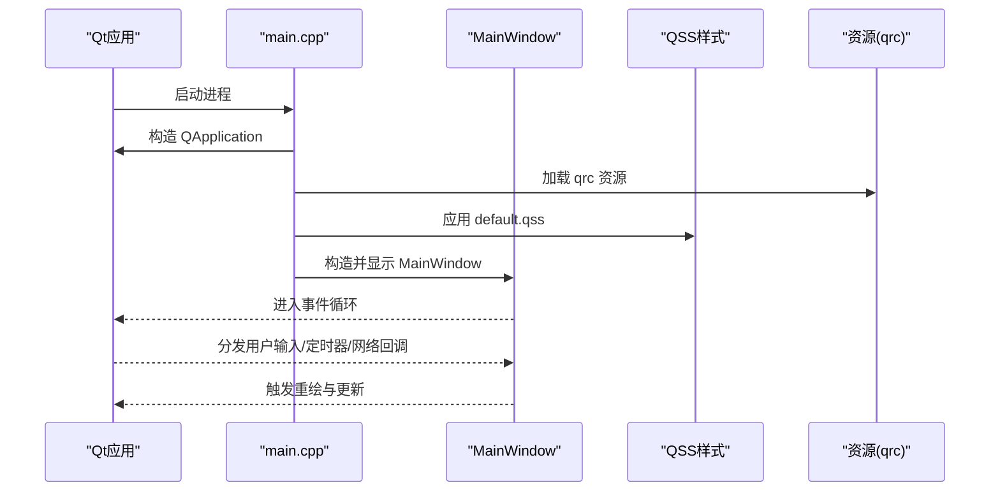
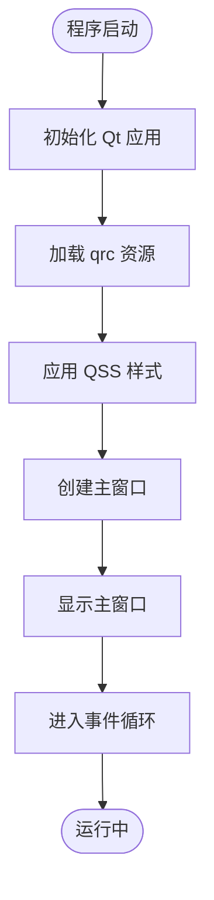
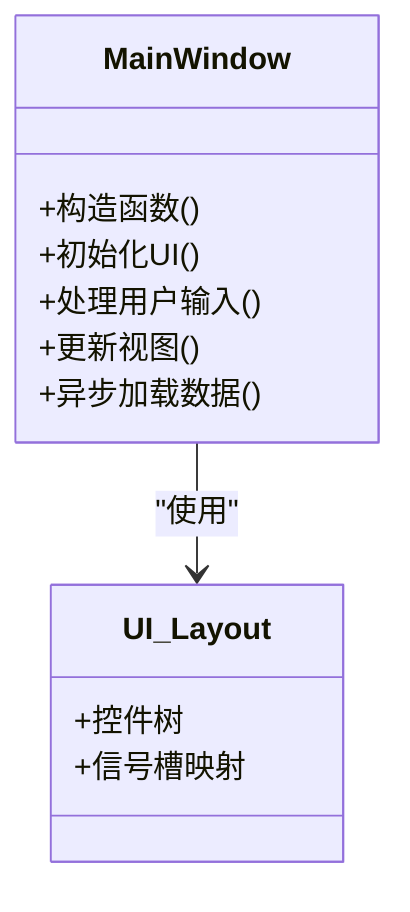
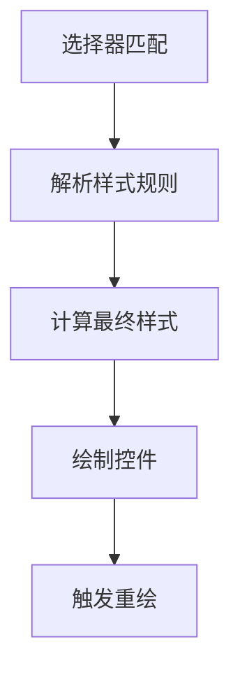
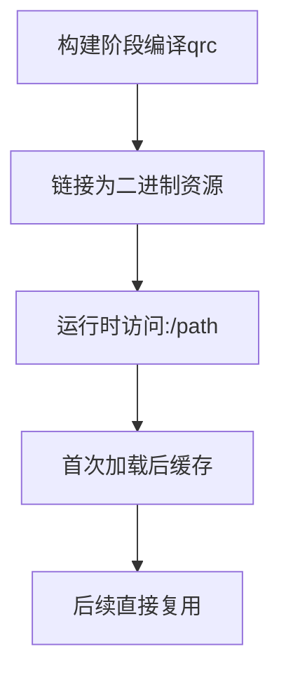
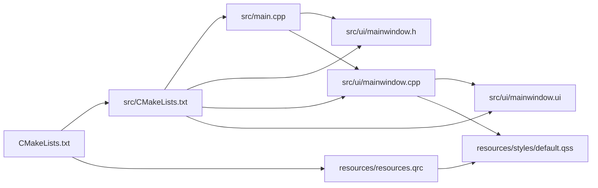

# 性能优化

<cite>
**本文引用的文件**   
- [CMakeLists.txt](file://CMakeLists.txt)
- [src/CMakeLists.txt](file://src/CMakeLists.txt)
- [src/main.cpp](file://src/main.cpp)
- [src/ui/mainwindow.h](file://src/ui/mainwindow.h)
- [src/ui/mainwindow.cpp](file://src/ui/mainwindow.cpp)
- [src/ui/mainwindow.ui](file://src/ui/mainwindow.ui)
- [resources/styles/default.qss](file://resources/styles/default.qss)
- [resources/resources.qrc](file://resources/resources.qrc)
</cite>

## 目录
1. [简介](#简介)
2. [项目结构](#项目结构)
3. [核心组件](#核心组件)
4. [架构总览](#架构总览)
5. [详细组件分析](#详细组件分析)
6. [依赖关系分析](#依赖关系分析)
7. [性能考虑](#性能考虑)
8. [故障排查指南](#故障排查指南)
9. [结论](#结论)
10. [附录](#附录)

## 简介
本指南面向Qt应用程序的性能优化，聚焦以下目标：
- 内存管理优化：对象生命周期管理与内存泄漏检测
- UI渲染优化：事件循环优化、重绘区域控制与异步加载策略
- 样式与资源：QSS样式优化与资源文件打包策略
- 性能分析与问题定位：工具使用与常见问题排查

本指南结合仓库中的Qt工程结构（CMake构建、主窗口UI、QSS样式与资源qrc）给出可操作的实践建议。

## 项目结构
该Qt应用采用CMake组织，主要包含：
- 顶层CMake配置与子模块CMake
- 应用入口main.cpp
- 主窗口UI与逻辑（mainwindow.* 与 mainwindow.ui）
- 样式与资源（default.qss 与 resources.qrc）

图表来源
- [CMakeLists.txt](file://CMakeLists.txt)
- [src/CMakeLists.txt](file://src/CMakeLists.txt)
- [src/main.cpp](file://src/main.cpp)
- [src/ui/mainwindow.h](file://src/ui/mainwindow.h)
- [src/ui/mainwindow.cpp](file://src/ui/mainwindow.cpp)
- [src/ui/mainwindow.ui](file://src/ui/mainwindow.ui)
- [resources/resources.qrc](file://resources/resources.qrc)
- [resources/styles/default.qss](file://resources/styles/default.qss)

章节来源
- [CMakeLists.txt](file://CMakeLists.txt)
- [src/CMakeLists.txt](file://src/CMakeLists.txt)
- [src/main.cpp](file://src/main.cpp)
- [src/ui/mainwindow.h](file://src/ui/mainwindow.h)
- [src/ui/mainwindow.cpp](file://src/ui/mainwindow.cpp)
- [src/ui/mainwindow.ui](file://src/ui/mainwindow.ui)
- [resources/resources.qcc](file://resources/resources.qrc)
- [resources/styles/default.qss](file://resources/styles/default.qss)

## 核心组件
- 应用入口：负责初始化Qt应用、设置样式与资源、创建并显示主窗口
- 主窗口：承载UI与业务交互，通常涉及事件处理、数据绑定与视图更新
- 样式系统：通过QSS统一外观，影响渲染路径与绘制开销
- 资源系统：通过qrc集中管理图片、字体等静态资源，影响加载与缓存

章节来源
- [src/main.cpp](file://src/main.cpp)
- [src/ui/mainwindow.h](file://src/ui/mainwindow.h)
- [src/ui/mainwindow.cpp](file://src/ui/mainwindow.cpp)
- [resources/styles/default.qss](file://resources/styles/default.qss)
- [resources/resources.qrc](file://resources/resources.qrc)

## 架构总览
下图展示从应用启动到UI渲染的关键流程，以及样式与资源的加载点。

图表来源
- [src/main.cpp](file://src/main.cpp)
- [src/ui/mainwindow.cpp](file://src/ui/mainwindow.cpp)
- [resources/resources.qrc](file://resources/resources.qrc)
- [resources/styles/default.qss](file://resources/styles/default.qss)

## 详细组件分析

### 应用入口（main.cpp）
职责与优化要点：
- 尽早完成必要的资源与样式初始化，避免在事件循环中阻塞
- 合理设置Qt运行期选项（如高DPI、线程模型），减少运行时开销
- 将耗时初始化延迟到后台线程或按需加载

图表来源
- [src/main.cpp](file://src/main.cpp)

章节来源
- [src/main.cpp](file://src/main.cpp)

### 主窗口（mainwindow.h/.cpp/.ui）
职责与优化要点：
- 事件处理：避免在槽函数中执行长耗时任务；使用信号/槽解耦与队列连接
- 视图更新：合并频繁更新，使用update()而非repaint()，必要时指定更新区域
- 数据绑定：大列表使用模型/视图（QAbstractItemModel），启用分页与懒加载
- 动画与过渡：优先使用Qt动画框架，避免手动高频刷新

图表来源
- [src/ui/mainwindow.h](file://src/ui/mainwindow.h)
- [src/ui/mainwindow.cpp](file://src/ui/mainwindow.cpp)
- [src/ui/mainwindow.ui](file://src/ui/mainwindow.ui)

章节来源
- [src/ui/mainwindow.h](file://src/ui/mainwindow.h)
- [src/ui/mainwindow.cpp](file://src/ui/mainwindow.cpp)
- [src/ui/mainwindow.ui](file://src/ui/mainwindow.ui)

### 样式系统（default.qss）
职责与优化要点：
- 选择器粒度：尽量精确匹配，避免通配符与深层嵌套
- 属性裁剪：仅声明必要样式属性，减少解析与计算
- 背景与阴影：谨慎使用渐变、阴影与复杂边框，评估绘制成本
- 动态切换：避免在事件循环中频繁setStyleSheet，批量更新后一次性应用

图表来源
- [resources/styles/default.qss](file://resources/styles/default.qss)

章节来源
- [resources/styles/default.qss](file://resources/styles/default.qss)

### 资源系统（resources.qrc）
职责与优化要点：
- 分类与压缩：按功能分组，启用压缩减少I/O与内存占用
- 按需加载：大图与不常用资源延迟加载，避免启动时峰值内存
- 缓存策略：复用已加载资源，避免重复解码与解压
- 版本管理：资源变更需清理构建缓存，确保一致性

图表来源
- [resources/resources.qrc](file://resources/resources.qrc)

章节来源
- [resources/resources.qrc](file://resources/resources.qrc)

## 依赖关系分析
- 构建依赖：顶层CMake聚合子模块，确保资源与源码正确链接
- 运行时依赖：main.cpp依赖Qt库、样式与资源；主窗口依赖UI布局与样式
- 潜在耦合：样式与UI强耦合，修改QSS可能影响渲染性能；资源路径变更需同步qrc

图表来源
- [CMakeLists.txt](file://CMakeLists.txt)
- [src/CMakeLists.txt](file://src/CMakeLists.txt)
- [src/main.cpp](file://src/main.cpp)
- [src/ui/mainwindow.h](file://src/ui/mainwindow.h)
- [src/ui/mainwindow.cpp](file://src/ui/mainwindow.cpp)
- [src/ui/mainwindow.ui](file://src/ui/mainwindow.ui)
- [resources/resources.qrc](file://resources/resources.qrc)
- [resources/styles/default.qss](file://resources/styles/default.qss)

章节来源
- [CMakeLists.txt](file://CMakeLists.txt)
- [src/CMakeLists.txt](file://src/CMakeLists.txt)
- [src/main.cpp](file://src/main.cpp)
- [src/ui/mainwindow.h](file://src/ui/mainwindow.h)
- [src/ui/mainwindow.cpp](file://src/ui/mainwindow.cpp)
- [src/ui/mainwindow.ui](file://src/ui/mainwindow.ui)
- [resources/resources.qrc](file://resources/resources.qrc)
- [resources/styles/default.qss](file://resources/styles/default.qss)

## 性能考虑

### 内存管理优化
- 对象生命周期
  - 使用父子层级自动释放：将父对象显式传递，避免悬空指针与重复释放
  - 智能指针与RAII：对非Qt管理的对象使用智能指针，确保异常安全
  - 容器与临时对象：避免在热点路径频繁分配/释放，使用对象池或预分配
- 内存泄漏检测
  - 开发环境：启用调试输出与日志，配合平台工具（如Valgrind、AddressSanitizer）定位泄漏
  - 运行时统计：记录关键对象的创建/销毁计数，发现增长趋势异常
  - 可视化：借助IDE内存分析器生成快照对比，定位持续增长的对象

### UI渲染优化
- 事件循环优化
  - 避免阻塞事件循环：将耗时操作放入工作线程，通过信号/槽回传结果
  - 降低事件频率：节流/防抖高频输入（鼠标移动、滚动），合并更新请求
  - 优先级调度：区分前台UI与后台任务，保证响应性
- 重绘区域控制
  - 局部更新：使用update(rect)指定脏矩形，减少全量重绘
  - 合并绘制：批量更新后再触发一次重绘，避免抖动
  - 自定义绘制：仅在必要时重写paintEvent，并确保绘制路径简洁
- 异步加载策略
  - 数据加载：使用QNetworkAccessManager或自定义线程池，分片拉取与缓存
  - 资源加载：大图与字体按需加载，首屏最小化资源集
  - 进度反馈：提供占位与骨架屏，提升感知性能

### 样式与资源优化
- QSS样式优化
  - 选择器精简：避免深层嵌套与通配符，提高匹配效率
  - 属性裁剪：仅声明必要属性，减少解析与计算
  - 动态样式：避免在事件循环中频繁setStyleSheet，批量更新后一次性应用
- 资源文件打包
  - 分类与压缩：按功能分组，启用压缩减少体积与I/O
  - 按需加载：延迟加载非关键资源，降低启动内存峰值
  - 缓存复用：同一资源多次使用时保持引用，避免重复解码

### 构建与部署优化
- CMake优化
  - 增量构建：合理使用依赖声明，减少不必要的重新编译
  - 并行编译：开启多核编译，缩短构建时间
  - 发布模式：关闭调试符号与断言，启用优化级别
- 运行时配置
  - 高DPI与线程：根据目标平台调整Qt选项，平衡兼容性与性能
  - 日志级别：生产环境降低日志输出，减少I/O开销

## 故障排查指南
- 常见症状
  - 界面卡顿：检查事件循环是否被阻塞，是否存在高频重绘
  - 内存增长：观察对象数量与大小变化，定位未释放的容器或缓存
  - 启动缓慢：分析资源加载与样式解析耗时，拆分首屏依赖
- 诊断步骤
  - 启用详细日志与统计：记录关键路径耗时与对象生命周期
  - 使用性能分析器：CPU火焰图、内存快照、GPU绘制统计
  - 回归验证：每次优化后复测关键指标，确保无退化
- 修复策略
  - 重构热点路径：拆分长函数、引入缓存与批处理
  - 降级与容错：在低性能设备上禁用昂贵特性（阴影、模糊）
  - 监控告警：在生产环境埋点关键指标，及时发现问题

## 结论
通过合理的内存管理、UI渲染优化与样式/资源策略，可以显著提升Qt应用的响应性与稳定性。建议以“测量—假设—实验—验证”的闭环持续优化，并结合平台工具进行深度诊断。

## 附录
- 术语
  - 事件循环：Qt消息分发机制，驱动UI与异步回调
  - 脏矩形：需要重绘的区域，用于局部更新
  - qrc：Qt资源编译器，将资源嵌入二进制
- 参考实践
  - 使用Qt内置性能工具（如Qt Creator Profiler）
  - 结合平台工具（Valgrind、ASan、Instruments）交叉验证
  - 建立性能基线与回归测试，保障长期质量