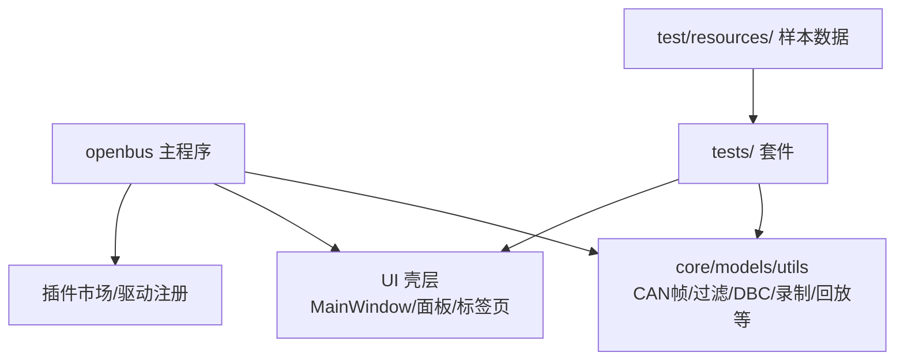
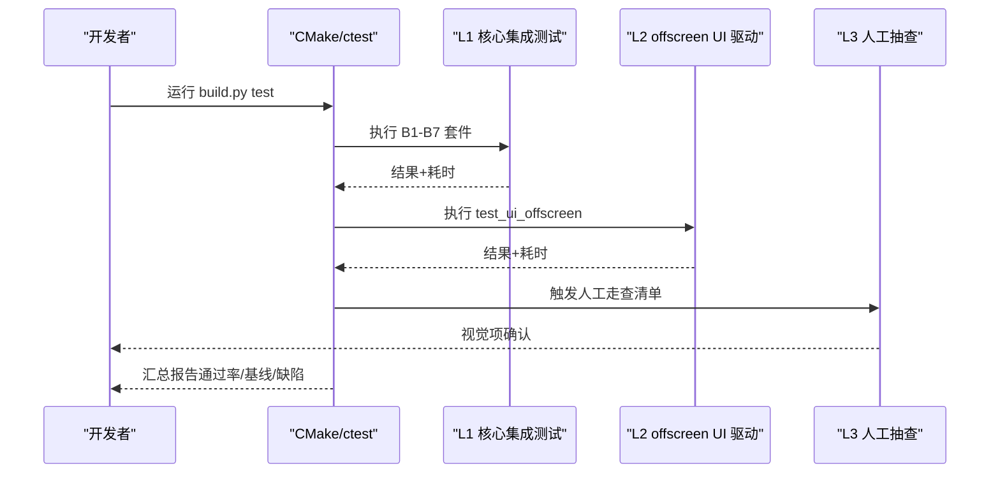
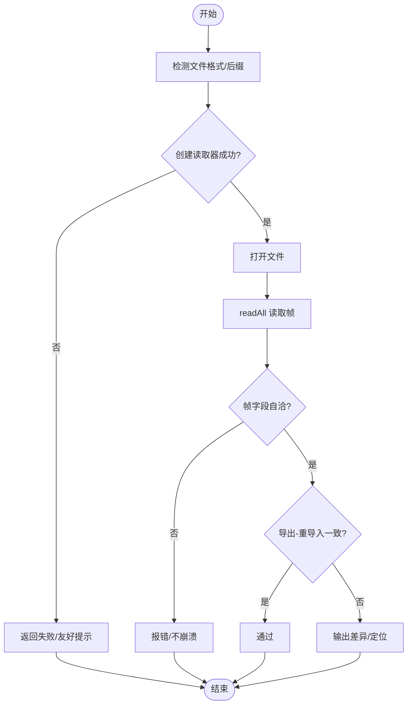
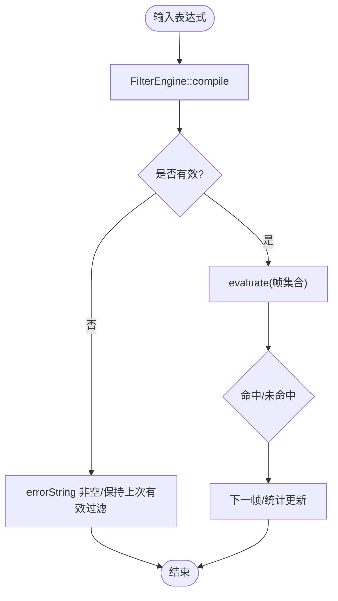
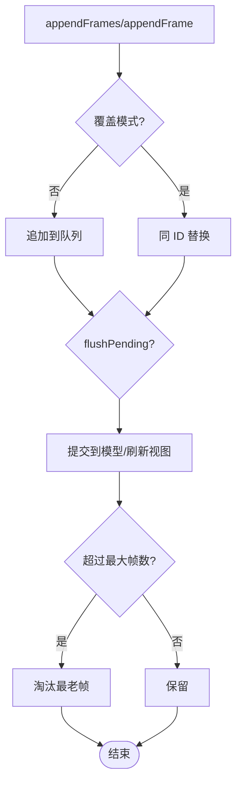
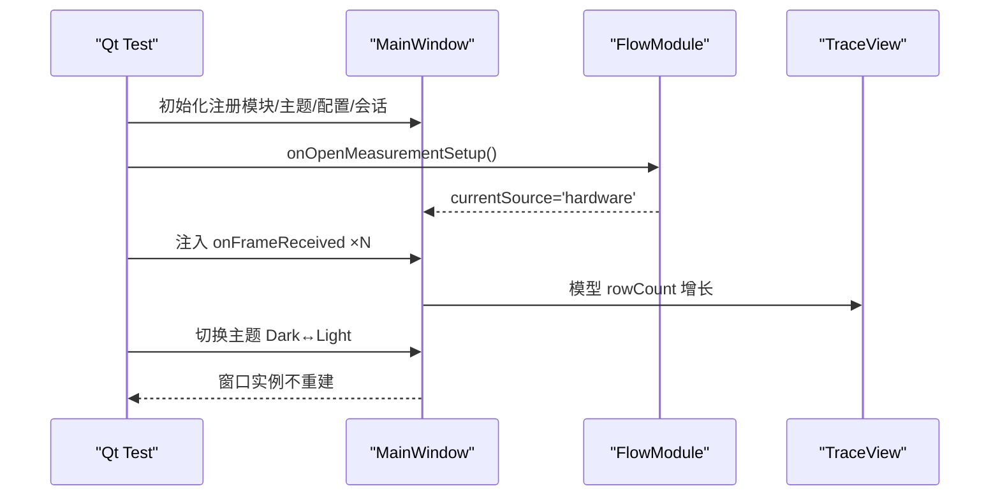
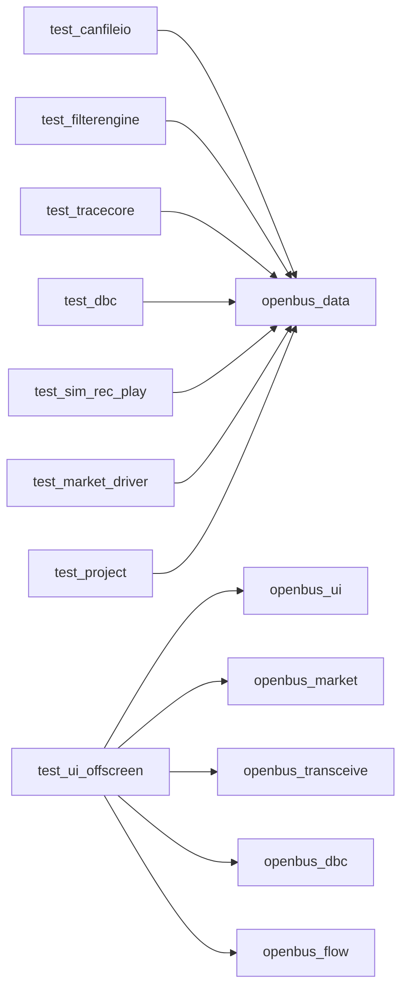

# 测试策略文档

<cite>
**本文引用的文件**
- [README.md](file://README.md)
- [doc/测试验收方案.md](file://doc/测试验收方案.md)
- [doc/测试报告.md](file://doc/测试报告.md)
- [tests/CMakeLists.txt](file://tests/CMakeLists.txt)
- [tests/test_canfileio.cpp](file://tests/test_canfileio.cpp)
- [tests/test_filterengine.cpp](file://tests/test_filterengine.cpp)
- [tests/test_tracecore.cpp](file://tests/test_tracecore.cpp)
- [tests/test_ui_offscreen.cpp](file://tests/test_ui_offscreen.cpp)
</cite>

## 目录
1. [引言](#引言)
2. [项目结构](#项目结构)
3. [核心组件](#核心组件)
4. [架构总览](#架构总览)
5. [详细组件分析](#详细组件分析)
6. [依赖关系分析](#依赖关系分析)
7. [性能考量](#性能考量)
8. [故障排查指南](#故障排查指南)
9. [结论](#结论)
10. [附录](#附录)

## 引言
本测试策略面向 openbus（CAN/CAN FD 报文分析工具）的端到端业务级验收，目标是以“业务流程为主线”验证采集→解析→分析→记录→回放→导出的闭环可用性，覆盖各功能入口与跨模块集成问题，形成可追溯的测试报告与缺陷清单。策略采用三层金字塔：L1 核心逻辑集成测试、L2 offscreen UI 驱动测试、L3 人工视觉抽查，兼顾效率与可靠性。

## 项目结构
本项目在顶层 README 中给出了整体架构概览与功能特性；测试体系位于 tests/ 目录，按业务域拆分为多个 Qt Test 套件，并通过 CMake 聚合为统一执行入口。测试数据存放于 test/resources/，供 L1/L2 用例使用。

图表来源
- [README.md:568-611](file://README.md#L568-L611)
- [tests/CMakeLists.txt:1-108](file://tests/CMakeLists.txt#L1-L108)

章节来源
- [README.md:1-112](file://README.md#L1-L112)
- [tests/CMakeLists.txt:1-108](file://tests/CMakeLists.txt#L1-L108)

## 核心组件
- 测试框架与工程组织：通过 tests/CMakeLists.txt 定义 openbus_add_test 宏，将每个测试套件构建为独立可执行进程，链接 openbus_data 或 UI 静态库，并自动部署 Qt6Test.dll 与 offscreen 平台插件。
- L1 核心逻辑集成测试：覆盖文件 I/O、过滤引擎语义、Trace 模型行为、DBC 解码、采集/录制/回放、市场索引与驱动注册、工程配置保存恢复。
- L2 offscreen UI 驱动测试：在无头模式下复刻 main.cpp 初始化链，驱动真实 MainWindow，断言面板生命周期、模型-视图联动、命令生效等。
- L3 人工视觉抽查：主题切换、图标渲染、布局美观等视觉项走查。

章节来源
- [tests/CMakeLists.txt:1-108](file://tests/CMakeLists.txt#L1-L108)
- [doc/测试验收方案.md:48-66](file://doc/测试验收方案.md#L48-L66)

## 架构总览
测试策略以“需求→自动化用例映射”为核心，将验收需求清单中的 8 大业务域 + 4 专项转化为 L1/L2/L3 分层验证。关键决策点包括硬件分级（无硬件为主）、缺陷分级（P0-P3）、准出标准（通过率阈值、数据正确性专项、稳定性专项）。

图表来源
- [doc/测试验收方案.md:117-143](file://doc/测试验收方案.md#L117-L143)
- [tests/CMakeLists.txt:95-108](file://tests/CMakeLists.txt#L95-L108)

章节来源
- [doc/测试验收方案.md:11-45](file://doc/测试验收方案.md#L11-L45)
- [doc/测试验收方案.md:117-143](file://doc/测试验收方案.md#L117-L143)

## 详细组件分析

### 文件 I/O 套件（B1：test_canfileio）
- 覆盖要点：格式推断与工厂支持、读小 BLF/ASC、大 BLF 加载计时、导出-重导入闭环（ASC/CSV/BLF）、异常文件容错、不存在文件处理。
- 断言原则：真实样本只断言自洽性不变量；闭环测试用自构造已知帧做精确比对（帧数/ID/DLC/数据/时间戳单调）。
- 性能基线：记录大 BLF 解析耗时与速率，作为回归基线。

图表来源
- [tests/test_canfileio.cpp:1-200](file://tests/test_canfileio.cpp#L1-L200)

章节来源
- [tests/test_canfileio.cpp:1-200](file://tests/test_canfileio.cpp#L1-L200)

### 过滤引擎套件（B2：test_filterengine）
- 覆盖要点：表达式编译与求值、比较运算符全集、逻辑组合、变量语义（id/dlc/ch/time/fd/ext/rx/tx/std/error）、语法糖（裸十六进制、in 列表）、data contains 字节序列匹配、非法表达式处理、预设保存/恢复闭环。
- 断言原则：全部基于自构造已知帧进行精确断言，确保表达式语义符合需求约定。

图表来源
- [tests/test_filterengine.cpp:1-200](file://tests/test_filterengine.cpp#L1-L200)

章节来源
- [tests/test_filterengine.cpp:1-200](file://tests/test_filterengine.cpp#L1-L200)

### Trace 模型套件（B3：test_tracecore）
- 覆盖要点：批量追加、实时追加+手动 flush、环形缓冲容量限制（淘汰最老帧）、覆盖模式（同 ID 替换）、行标记/颜色/标签、按 ID 统计、时间参考点。
- 行为验证：seqCounter 永不回退；覆盖模式下 seq 仅计入有效提交；视窗机制保障滚动流畅。

图表来源
- [tests/test_tracecore.cpp:1-200](file://tests/test_tracecore.cpp#L1-L200)

章节来源
- [tests/test_tracecore.cpp:1-200](file://tests/test_tracecore.cpp#L1-L200)

### offscreen UI 驱动套件（C：test_ui_offscreen）
- 覆盖要点：主窗口构造（三组 QDockWidget、菜单栏、状态栏）、默认实例（Trace1/Graphic1）、数据驱动链路（onMeasurementToggled 门控 → onFrameReceived → TraceView 行数增长）、主题切换存活。
- 环境要求：QT_QPA_PLATFORM=offscreen，完整复刻 main.cpp 初始化链（模块注册→主题→配置/会话→MainWindow），禁用 ZLG 外置驱动规避间歇崩溃。

图表来源
- [tests/test_ui_offscreen.cpp:1-200](file://tests/test_ui_offscreen.cpp#L1-L200)

章节来源
- [tests/test_ui_offscreen.cpp:1-200](file://tests/test_ui_offscreen.cpp#L1-L200)

### 其他套件概览
- DBC 套件（B4）：加载解析、信号解码正确性抽查、多库并存/卸载、异常 DBC 容错。
- 采集/录制/回放套件（B5）：CanSimulator 产帧 → Recorder 落盘 → 重载帧比对 → Player 时间轴推进/变速。
- 市场与驱动套件（B6）：MarketIndex 解析本地 market.json、.odp sha256 校验拒绝篡改、DriverRegistry 扫描/禁用/延迟卸载状态机。
- 工程与配置套件（B7）：工程保存/恢复字段、书签、过滤预设、会话状态。

章节来源
- [doc/测试验收方案.md:122-133](file://doc/测试验收方案.md#L122-L133)

## 依赖关系分析
- 测试工程依赖：
  - L1 套件链接 openbus_data（core/models/utils），使用 QTEST_GUILESS_MAIN，避免加载平台插件。
  - L2 套件链接 openbus_ui 静态库及多个业务模块 DLL，并部署 Qt6Test.dll 与 qoffscreen 平台插件。
- 外部依赖：
  - Qt6 Test、Qt Offscreen Integration Plugin。
  - 测试数据位于 test/resources/，通过 SIN_SOURCE_DIR 编译宏定位。

图表来源
- [tests/CMakeLists.txt:14-93](file://tests/CMakeLists.txt#L14-L93)

章节来源
- [tests/CMakeLists.txt:14-93](file://tests/CMakeLists.txt#L14-L93)

## 性能考量
- 大 BLF 加载耗时与速率：作为基线记录，防止回归恶化。
- Trace 实时链路：20 帧同步注入 + 50ms 批量刷新，视窗机制（ViewportProxyModel 2000 行）保障流畅。
- 全量回归耗时：L1+L2 套件总耗时约 4s，满足快速回归需求。

章节来源
- [doc/测试报告.md:202-209](file://doc/测试报告.md#L202-L209)

## 故障排查指南
- 常见缺陷与修复路径：
  - DEF-06：ZLG 外置驱动枚举堆损坏（间歇性），通过禁用 zlg 驱动规避；修复需开启 FullPageHeap/ASan 复现，审查 enumerate 路径与临时对象构造顺序。
  - DEF-08：跨 DLL PMF connect 断连群，建议改用 SIGNAL()/SLOT() 字符串形式或将连接下沉至 data DLL 装配代码。
  - DEF-10：FlowModule 两参 createPage 未覆写导致页面无法打开，补 override 转发三参版。
  - DEF-11：MainWindow 析构 destroyed 回调 UAF，显式断开实例 destroyed 回调。
- 调试技巧：
  - 使用 -o file,txt 文件输出防 stdout 管道缓冲丢失。
  - 通过 qWarning 打点二分定位流程分支。
  - 对跨 DLL 信号连接，优先用 QSignalSpy 字符串法验证。

章节来源
- [doc/测试报告.md:66-191](file://doc/测试报告.md#L66-L191)

## 结论
本测试策略以自动化分层验证为主，辅以少量人工抽查，覆盖了 openbus 的核心业务闭环与关键交互路径。当前阶段已实现 L1 七套件与 L2 offscreen UI 驱动的贯通，具备秒级回归能力；针对尚未修复的跨 DLL 信号连接与外置驱动枚举问题，提供了明确的修复路径与验收标准。后续将持续完善 L3 视觉抽查与更多场景用例，提升验收质量与效率。

## 附录
- 验收范围与里程碑：详见测试验收方案的阶段划分与里程碑（A/B/C/D）。
- 通过标准：冒烟与核心链路通过率 100%，总体通过率 ≥ 95%，P0/P1 缺陷为零或已有修复计划且用户接受。
- 遗留与建议：补充样本工程、移除规避策略后的回归验证、新增启动无 connect 警告断言等。

章节来源
- [doc/测试验收方案.md:117-143](file://doc/测试验收方案.md#L117-L143)
- [doc/测试验收方案.md:388-397](file://doc/测试验收方案.md#L388-L397)
- [doc/测试报告.md:212-246](file://doc/测试报告.md#L212-L246)