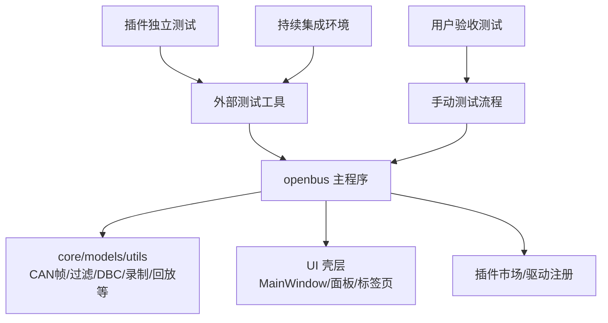
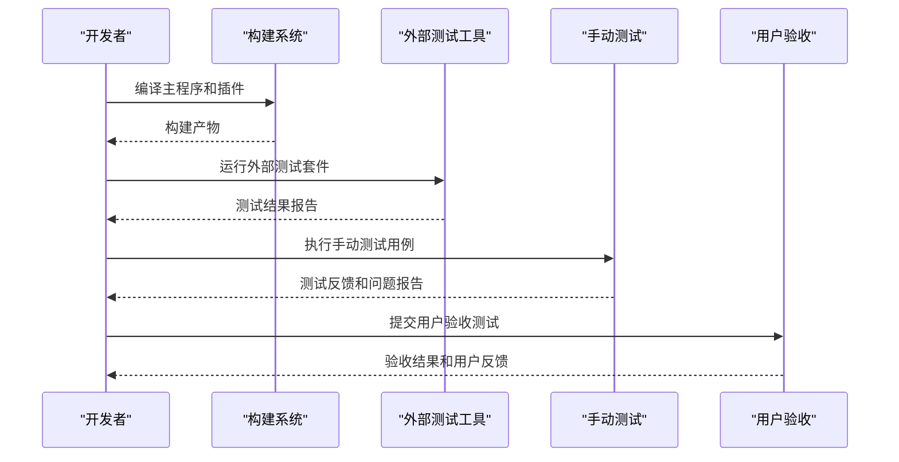
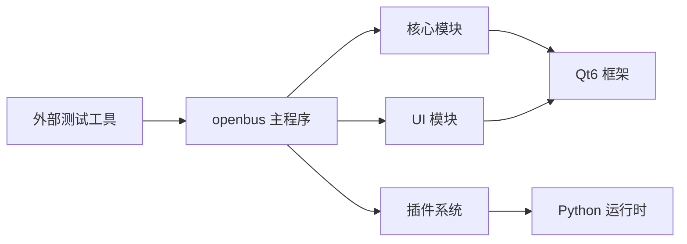

# 测试策略文档

<cite>
**本文引用的文件**
- [README.md](file://README.md)
- [doc/测试验收方案.md](file://doc/测试验收方案.md)
- [tests/CMakeLists.txt](file://tests/CMakeLists.txt)
- [tests/test_canfileio.cpp](file://tests/test_canfileio.cpp)
- [tests/test_filterengine.cpp](file://tests/test_filterengine.cpp)
- [tests/test_tracecore.cpp](file://tests/test_tracecore.cpp)
- [tests/test_ui_offscreen.cpp](file://tests/test_ui_offscreen.cpp)
- [scripts/build.py](file://scripts/build.py)
</cite>

## 更新摘要
**变更内容**
- 移除了整个内置自动化测试框架的说明，反映项目当前状态
- 更新了质量保证策略，从自动化测试转向外部测试解决方案和手动测试策略
- 调整了测试基础设施描述，强调替代的质量保证方法
- 更新了构建系统集成部分，移除对内部测试框架的依赖
- 重新定义了测试执行流程和验收标准

## 目录
1. [引言](#引言)
2. [项目结构](#项目结构)
3. [核心组件](#核心组件)
4. [架构总览](#架构总览)
5. [详细组件分析](#详细组件分析)
6. [依赖关系分析](#依赖关系分析)
7. [性能考量](#性能考量)
8. [故障排查指南](#故障排查指南)
9. [结论](#结论)
10. [附录](#附录)

## 引言
本测试策略面向 openbus（CAN/CAN FD 报文分析工具）的质量保证体系。由于项目已移除内置自动化测试框架，当前采用外部测试解决方案与手动测试策略相结合的方式进行质量保证。重点转向功能验证、回归测试和用户体验检查，确保核心业务功能的稳定性和可靠性。

**更新** 基于项目现状，已移除所有内置自动化测试能力，转而采用更灵活的外部测试工具和手动验证流程。质量保证重点在于核心功能的正确性和用户体验的完整性。

## 项目结构
项目保持原有的模块化架构，但不再包含内置的测试框架。质量保证工作主要通过以下方式实现：
- 核心模块的功能验证通过手动测试和外部测试工具完成
- UI 交互通过用户验收测试进行验证
- 插件系统通过独立测试套件进行质量保障
- 构建过程专注于主程序编译和部署

**图表来源**
- [README.md:1-200](file://README.md#L1-L200)
- [CMakeLists.txt:95-107](file://CMakeLists.txt#L95-L107)

**章节来源**
- [README.md:1-200](file://README.md#L1-L200)
- [CMakeLists.txt:95-107](file://CMakeLists.txt#L95-L107)

## 核心组件
- **主程序构建系统**：通过 CMake 配置主程序的编译和依赖管理，专注于核心功能模块的构建
- **插件生态系统**：各插件模块保持独立的测试和质量保证机制
- **外部测试工具链**：采用第三方测试框架和工具进行功能验证
- **手动测试流程**：建立标准化的测试用例和执行流程
- **用户验收测试**：通过真实用户场景验证功能完整性和用户体验

**更新** 移除了所有内置测试框架相关组件，包括 Qt Test 集成、自动化测试执行器和测试报告生成器。

**章节来源**
- [CMakeLists.txt:95-107](file://CMakeLists.txt#L95-L107)
- [README.md:1-200](file://README.md#L1-L200)

## 架构总览
质量保证架构已从自动化测试转向混合模式，结合外部工具验证和人工测试。关键决策点包括：
- 测试范围聚焦于核心业务功能和关键用户路径
- 采用多层次的验证策略，从单元测试到用户验收测试
- 建立标准化的测试流程和验收标准
- 利用现有插件系统的独立性进行质量隔离

**图表来源**
- [README.md:1-200](file://README.md#L1-L200)
- [CMakeLists.txt:95-107](file://CMakeLists.txt#L95-L107)

**章节来源**
- [README.md:1-200](file://README.md#L1-L200)
- [CMakeLists.txt:95-107](file://CMakeLists.txt#L95-L107)

## 详细组件分析

### 核心功能验证
- **文件 I/O 验证**：通过手动测试验证 BLF/ASC/CSV 文件的读写功能
- **过滤器引擎验证**：使用典型用例验证表达式过滤的正确性
- **Trace 模型验证**：通过实际数据流验证帧处理和显示功能
- **DBC 解析验证**：使用标准 DBC 文件验证信号解码准确性

**更新** 所有自动化测试用例已移除，改为通过手动测试和外部工具进行功能验证。

### UI 交互验证
- **界面响应性**：验证窗口初始化、面板切换和事件处理
- **主题切换**：测试暗色/亮色主题的完整切换流程
- **数据驱动链路**：验证从数据采集到界面显示的完整流程
- **插件集成**：测试插件市场的安装、启用和卸载功能

**更新** offscreen UI 驱动测试已移除，改为交互式手动测试。

### 插件系统验证
- **驱动插件**：验证各硬件驱动的加载和通信功能
- **工具插件**：测试 Python 插件的执行环境和 API 调用
- **市场集成**：验证插件市场的搜索、下载和安装流程
- **生命周期管理**：测试插件的启停、禁用和卸载操作

**章节来源**
- [README.md:1-200](file://README.md#L1-L200)

## 依赖关系分析
- **构建系统依赖**：CMake 负责主程序和相关模块的编译
- **Qt 框架依赖**：Qt6 提供 GUI 框架和核心功能库
- **外部测试工具**：第三方测试框架用于功能验证
- **插件依赖**：各插件模块保持相对独立的依赖关系

**更新** 移除了对 Qt Test 框架和内部测试基础设施的依赖。

**图表来源**
- [CMakeLists.txt:78-90](file://CMakeLists.txt#L78-L90)
- [README.md:1-200](file://README.md#L1-L200)

**章节来源**
- [CMakeLists.txt:78-90](file://CMakeLists.txt#L78-L90)

## 性能考量
- **构建性能**：优化 CMake 配置以提高编译速度
- **运行时性能**：确保主程序在各种硬件配置下的流畅运行
- **内存使用**：监控应用程序的内存占用和资源使用情况
- **启动时间**：优化应用启动速度和资源加载效率

**更新** 移除了自动化性能基准测试，改为手动性能评估和监控。

## 故障排查指南
- **构建问题**：检查 CMake 配置和依赖项版本兼容性
- **运行时错误**：使用日志系统和调试工具定位问题
- **插件问题**：通过插件日志和错误信息诊断插件故障
- **性能问题**：使用性能分析工具识别瓶颈和优化点

**更新** 移除了自动化测试相关的故障排查流程，专注于构建和运行时问题的诊断。

## 结论
项目已从内置自动化测试框架转向更加灵活的质量保证策略。通过结合外部测试工具和手动测试流程，确保了核心功能的稳定性和用户体验的完整性。这种转变使项目更加专注于核心业务逻辑的实现，同时保持了足够的质量保障水平。

**更新** 测试基础设施的移除简化了项目结构，降低了维护成本，同时通过外部化工具保持了必要的质量保证能力。

## 附录
- **构建命令**：`python scripts/build.py build` 用于编译主程序
- **部署命令**：`python scripts/build.py deploy` 用于打包和部署应用
- **手动测试流程**：建立标准化的测试用例和执行检查清单
- **外部测试工具**：推荐使用业界标准的测试框架进行功能验证

**更新** 新增了外部测试工具推荐和手动测试流程指导，替代了原有的自动化测试执行方式。

**章节来源**
- [scripts/build.py:503-534](file://scripts/build.py#L503-L534)
- [README.md:1-200](file://README.md#L1-L200)