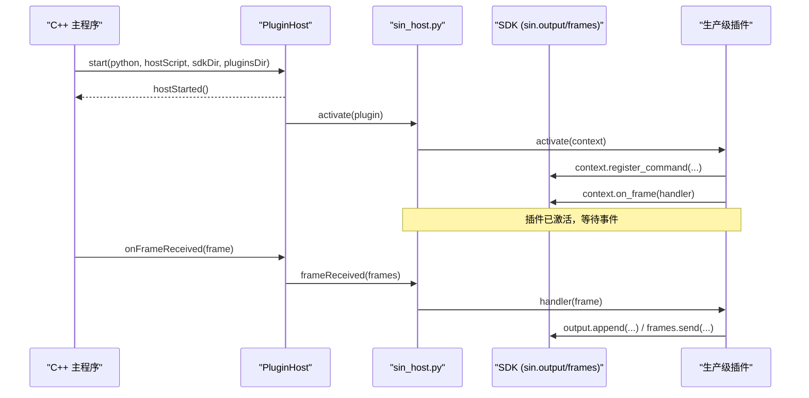
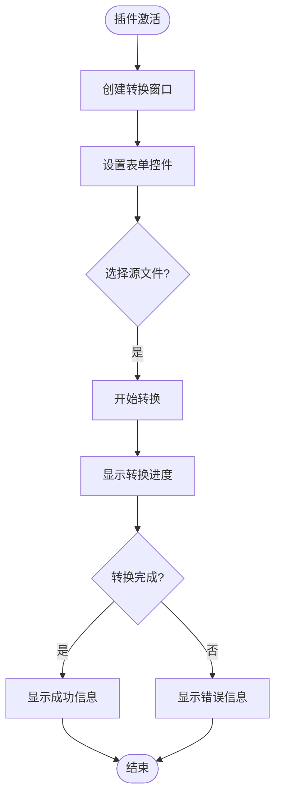
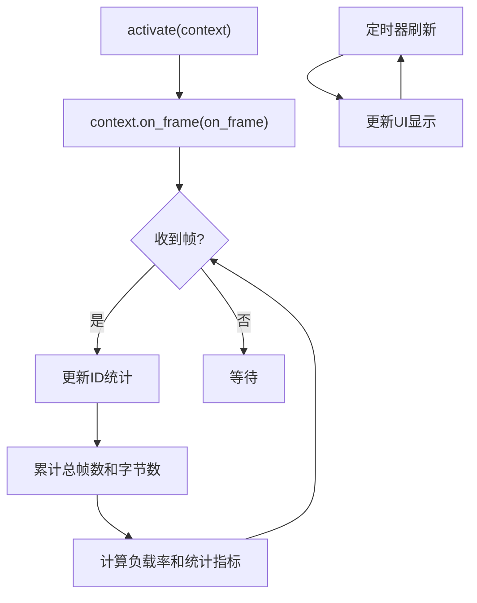
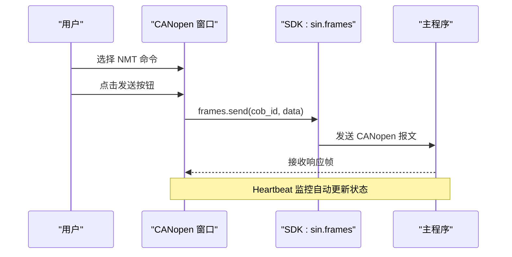
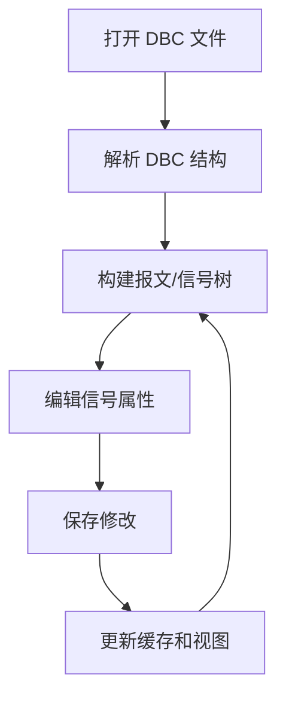
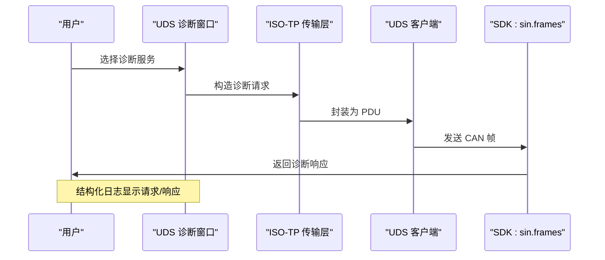
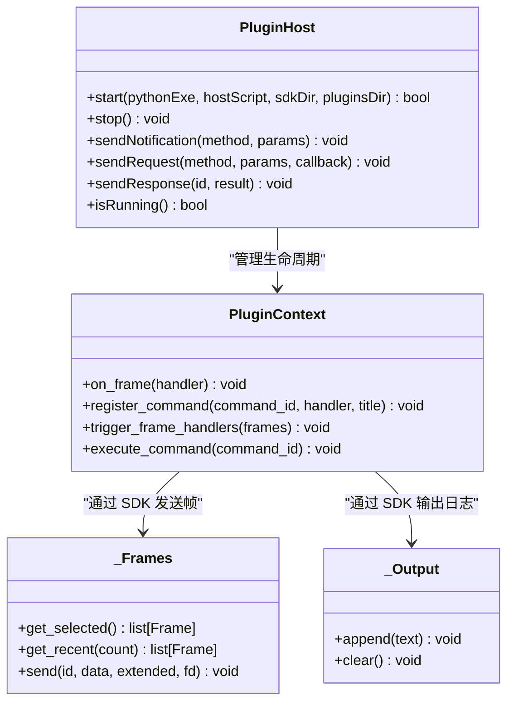
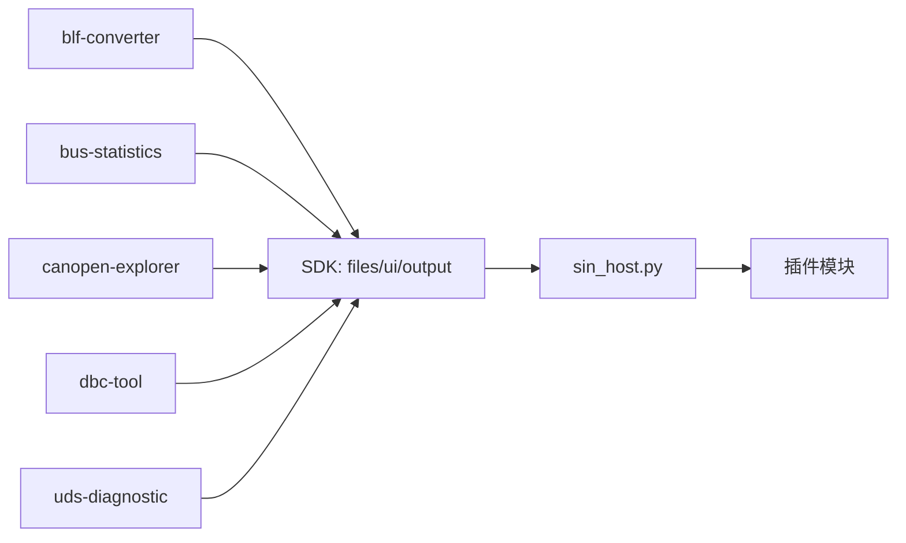

# 示例插件

<cite>
**本文引用的文件**
- [plugins/blf-converter/main.py](file://plugins/blf-converter/main.py)
- [plugins/blf-converter/plugin.json](file://plugins/blf-converter/plugin.json)
- [plugins/bus-statistics/main.py](file://plugins/bus-statistics/main.py)
- [plugins/bus-statistics/plugin.json](file://plugins/bus-statistics/plugin.json)
- [plugins/canopen-explorer/main.py](file://plugins/canopen-explorer/main.py)
- [plugins/canopen-explorer/plugin.json](file://plugins/canopen-explorer/plugin.json)
- [plugins/dbc-tool/main.py](file://plugins/dbc-tool/main.py)
- [plugins/dbc-tool/plugin.json](file://plugins/dbc-tool/plugin.json)
- [plugins/uds-diagnostic/main.py](file://plugins/uds-diagnostic/main.py)
- [plugins/uds-diagnostic/plugin.json](file://plugins/uds-diagnostic/plugin.json)
- [sdk/sin/__init__.py](file://sdk/sin/__init__.py)
- [sdk/sin/frames.py](file://sdk/sin/frames.py)
- [sdk/sin/output.py](file://sdk/sin/output.py)
- [sdk/sin/ui.py](file://sdk/sin/ui.py)
- [scripts/sin_host.py](file://scripts/sin_host.py)
</cite>

## 更新摘要
**所做更改**
- 移除了已删除的示例插件（hello-world、frame-counter、ui-demo）的相关章节和引用
- 更新了项目结构部分以反映当前可用的5个生产级插件
- 重构了详细组件分析章节，替换为当前实际存在的插件示例
- 更新了依赖关系分析和架构图表以匹配新的插件生态
- 保持了文档的整体结构和一致性

## 目录
1. [简介](#简介)
2. [项目结构](#项目结构)
3. [核心组件](#核心组件)
4. [架构总览](#架构总览)
5. [详细组件分析](#详细组件分析)
6. [依赖关系分析](#依赖关系分析)
7. [性能考虑](#性能考虑)
8. [故障排查指南](#故障排查指南)
9. [结论](#结论)
10. [附录](#附录)

## 简介
本仓库包含一个 CAN 总线分析工具的插件系统，以及五个生产级示例插件：blf-converter、bus-statistics、canopen-explorer、dbc-tool、uds-diagnostic。这些插件通过 Python SDK 与主程序通信，支持命令注册、帧事件订阅、输出面板写入、发送 CAN 帧、DBC 信号编解码以及 PyQt6 独立窗口 UI。

**更新** 移除了原有的 hello-world、frame-counter、ui-demo 三个基础示例插件，这些插件已被更专业的生产级插件所替代。

## 项目结构
- 示例插件位于 plugins/ 下，每个插件包含 main.py 与 plugin.json 描述元数据与激活事件。
- Python SDK 位于 sdk/sin/，提供 output、frames、signals、commands、ui 等接口。
- 宿主脚本 scripts/sin_host.py 负责加载插件、分发消息、管理事件循环。
- C++ 插件宿主在 src/core/plugin/ 中，使用 QProcess 启动并维护 JSON-RPC 通道。

```mermaid
graph TB
subgraph "C++ 主程序"
PM["PluginManager"]
PH["PluginHost"]
end
subgraph "Python 宿主进程"
SH["sin_host.py"]
SDK["SDK: sin.*"]
end
subgraph "生产级插件"
P1["blf-converter"]
P2["bus-statistics"]
P3["canopen-explorer"]
P4["dbc-tool"]
P5["uds-diagnostic"]
end
PM --> PH
PH < --> SH
SH --> SDK
SH --> P1
SH --> P2
SH --> P3
SH --> P4
SH --> P5
```

**图示来源**
- [src/core/plugin/pluginmanager.h:17-25](file://src/core/plugin/pluginmanager.h#L17-L25)
- [src/core/plugin/pluginhost.h:13-21](file://src/core/plugin/pluginhost.h#L13-L21)
- [scripts/sin_host.py:1-10](file://scripts/sin_host.py#L1-L10)
- [sdk/sin/__init__.py:1-19](file://sdk/sin/__init__.py#L1-L19)

**章节来源**
- [src/core/plugin/pluginmanager.h:17-25](file://src/core/plugin/pluginmanager.h#L17-L25)
- [src/core/plugin/pluginhost.h:13-21](file://src/core/plugin/pluginhost.h#L13-L21)
- [scripts/sin_host.py:1-10](file://scripts/sin_host.py#L1-L10)
- [sdk/sin/__init__.py:1-19](file://sdk/sin/__init__.py#L1-L19)

## 核心组件
- 插件元数据与激活事件：plugin.json 声明 name、version、main、activationEvents、contributes.commands。
- 插件上下文：context.on_frame() 注册帧回调；context.register_command() 注册命令。
- SDK 能力：
  - output.append/clear：向输出面板写入文本。
  - frames.send/get_selected/get_recent：发送或获取 CAN 帧。
  - signals.decode/encode：基于 DBC 的信号编解码。
  - commands.execute：执行主程序已注册的命令。
  - ui.create_window/show_*：创建 PyQt6 独立窗口（可选）。
- 宿主与主程序通信：JSON-RPC over stdin/stdout，支持通知与请求/响应。

**章节来源**
- [plugins/blf-converter/plugin.json:1-17](file://plugins/blf-converter/plugin.json#L1-L17)
- [plugins/bus-statistics/plugin.json:1-17](file://plugins/bus-statistics/plugin.json#L1-L17)
- [plugins/canopen-explorer/plugin.json:1-17](file://plugins/canopen-explorer/plugin.json#L1-L17)
- [plugins/dbc-tool/plugin.json:1-17](file://plugins/dbc-tool/plugin.json#L1-L17)
- [plugins/uds-diagnostic/plugin.json:1-17](file://plugins/uds-diagnostic/plugin.json#L1-L17)
- [sdk/sin/output.py:9-25](file://sdk/sin/output.py#L9-L25)
- [sdk/sin/frames.py:9-91](file://sdk/sin/frames.py#L9-L91)
- [sdk/sin/ui.py:27-76](file://sdk/sin/ui.py#L27-L76)

## 架构总览
插件系统采用"C++ 主程序 + Python 宿主进程"的隔离架构。C++ 侧通过 PluginHost 启动 Python 宿主，并以 newline-delimited JSON-RPC 进行双向通信。Python 宿主负责加载插件模块、维护插件上下文、分发帧事件与命令执行，并通过 SDK 将操作转发回主程序。



**图示来源**
- [src/core/plugin/pluginhost.cpp:24-78](file://src/core/plugin/pluginhost.cpp#L24-L78)
- [scripts/sin_host.py:142-164](file://scripts/sin_host.py#L142-L164)
- [scripts/sin_host.py:178-194](file://scripts/sin_host.py#L178-L194)
- [sdk/sin/output.py:12-22](file://sdk/sin/output.py#L12-L22)
- [sdk/sin/frames.py:69-88](file://sdk/sin/frames.py#L69-L88)

## 详细组件分析

### blf-converter 插件
- 功能：报文日志格式转换工具，支持 BLF/ASC/CSV/PCAP/TRC 之间相互转换。
- 关键点：
  - 通过 sin.files API 调用宿主 C++ 引擎进行后台转换，不阻塞 UI。
  - 支持拖拽源文件、进度显示、取消、日志记录。
  - 使用 PyQt6 创建图形界面，提供友好的用户交互。



**图示来源**
- [plugins/blf-converter/main.py:37-241](file://plugins/blf-converter/main.py#L37-L241)
- [plugins/blf-converter/plugin.json:7-15](file://plugins/blf-converter/plugin.json#L7-L15)

**章节来源**
- [plugins/blf-converter/main.py:1-252](file://plugins/blf-converter/main.py#L1-L252)
- [plugins/blf-converter/plugin.json:1-17](file://plugins/blf-converter/plugin.json#L1-L17)

### bus-statistics 插件
- 功能：总线统计分析，实时统计按 CAN ID 的帧数、周期、频率、累计字节数。
- 关键点：
  - 使用 context.on_frame 订阅实时帧数据。
  - 计算总线负载率、周期抖动、频率统计。
  - 支持暂停/继续、清零、导出 CSV 功能。



**图示来源**
- [plugins/bus-statistics/main.py:49-221](file://plugins/bus-statistics/main.py#L49-L221)
- [plugins/bus-statistics/plugin.json:7-15](file://plugins/bus-statistics/plugin.json#L7-L15)

**章节来源**
- [plugins/bus-statistics/main.py:1-228](file://plugins/bus-statistics/main.py#L1-L228)
- [plugins/bus-statistics/plugin.json:1-17](file://plugins/bus-statistics/plugin.json#L1-L17)

### canopen-explorer 插件
- 功能：CANopen 工具（CiA 301），实现 NMT 节点控制、SDO 读写、Heartbeat 监控、Emergency 解析。
- 关键点：
  - 完整的 CANopen 协议栈实现。
  - 多标签页界面：NMT 控制、SDO 读写、Heartbeat 监控、Emergency 日志。
  - 支持常用对象字典的快速访问。



**图示来源**
- [plugins/canopen-explorer/main.py:68-341](file://plugins/canopen-explorer/main.py#L68-L341)
- [plugins/canopen-explorer/plugin.json:7-15](file://plugins/canopen-explorer/plugin.json#L7-L15)

**章节来源**
- [plugins/canopen-explorer/main.py:1-347](file://plugins/canopen-explorer/main.py#L1-L347)
- [plugins/canopen-explorer/plugin.json:1-17](file://plugins/canopen-explorer/plugin.json#L1-L17)

### dbc-tool 插件
- 功能：DBC 查看编辑工具，支持报文/信号树形展示、信号属性编辑、保存/另存为。
- 关键点：
  - 独立的 DBC 会话管理，不影响当前工程已加载的 DBC。
  - 左侧树形展示报文→信号层级，支持名称/ID 搜索过滤。
  - 右侧信号属性表格可编辑 startBit/bitLength/factor/offset/min/max/unit/comment。



**图示来源**
- [plugins/dbc-tool/main.py:28-387](file://plugins/dbc-tool/main.py#L28-L387)
- [plugins/dbc-tool/plugin.json:7-15](file://plugins/dbc-tool/plugin.json#L7-L15)

**章节来源**
- [plugins/dbc-tool/main.py:1-397](file://plugins/dbc-tool/main.py#L1-L397)
- [plugins/dbc-tool/plugin.json:1-17](file://plugins/dbc-tool/plugin.json#L1-L17)

### uds-diagnostic 插件
- 功能：UDS 诊断客户端（ISO 14229，G10 强化版），对标 ZCANPro/CANoe/TSMaster。
- 关键点：
  - 完整 ISO-TP 流控状态机（BS/STmin/FC）。
  - 服务表单+响应解码、DID 字典/周期轮询、DTC 管理。
  - 种子-密钥安全访问（三种算法）、34/36/37 刷写助手。



**图示来源**
- [plugins/uds-diagnostic/main.py:125-800](file://plugins/uds-diagnostic/main.py#L125-L800)
- [plugins/uds-diagnostic/plugin.json:7-15](file://plugins/uds-diagnostic/plugin.json#L7-L15)

**章节来源**
- [plugins/uds-diagnostic/main.py:1-1312](file://plugins/uds-diagnostic/main.py#L1-L1312)
- [plugins/uds-diagnostic/plugin.json:1-17](file://plugins/uds-diagnostic/plugin.json#L1-L17)

### 插件宿主与 SDK 通信
- 通信协议：newline-delimited JSON-RPC 2.0，方法包括 activate/deactivate/frameReceived/executeCommand/fileOpened/shutdown 等。
- 请求/响应：SDK 通过 send_request 发起请求，宿主通过 deliver_response 投递响应。
- 线程模型：stdin 读取在独立线程，Qt 模式下使用 QTimer 轮询消息队列，避免阻塞。



**图示来源**
- [src/core/plugin/pluginhost.h:22-95](file://src/core/plugin/pluginhost.h#L22-L95)
- [scripts/sin_host.py:78-117](file://scripts/sin_host.py#L78-L117)
- [sdk/sin/frames.py:39-91](file://sdk/sin/frames.py#L39-L91)
- [sdk/sin/output.py:9-25](file://sdk/sin/output.py#L9-L25)

**章节来源**
- [src/core/plugin/pluginhost.h:22-95](file://src/core/plugin/pluginhost.h#L22-L95)
- [src/core/plugin/pluginhost.cpp:106-156](file://src/core/plugin/pluginhost.cpp#L106-L156)
- [scripts/sin_host.py:225-261](file://scripts/sin_host.py#L225-L261)
- [scripts/sin_host.py:276-398](file://scripts/sin_host.py#L276-L398)

## 依赖关系分析
- 插件对 SDK 的依赖：
  - blf-converter：files、ui、output（用于进度和状态显示）。
  - bus-statistics：frames、ui、output（用于实时统计和显示）。
  - canopen-explorer：frames、ui（用于 CANopen 协议操作）。
  - dbc-tool：dbc、ui、output（用于 DBC 文件操作）。
  - uds-diagnostic：frames、ui（用于 UDS 诊断通信）。
- SDK 对宿主的依赖：
  - output/frames/commands/signals/files/dbc 通过 _transport 发送通知或请求。
- 宿主对插件的依赖：
  - 根据 plugin.json 的 main 字段加载模块，调用 activate/deactivate。
  - 分发 frameReceived 与 executeCommand。



**图示来源**
- [plugins/blf-converter/main.py:37-241](file://plugins/blf-converter/main.py#L37-L241)
- [plugins/bus-statistics/main.py:49-221](file://plugins/bus-statistics/main.py#L49-L221)
- [plugins/canopen-explorer/main.py:68-341](file://plugins/canopen-explorer/main.py#L68-L341)
- [plugins/dbc-tool/main.py:28-387](file://plugins/dbc-tool/main.py#L28-L387)
- [plugins/uds-diagnostic/main.py:125-800](file://plugins/uds-diagnostic/main.py#L125-L800)
- [sdk/sin/output.py:12-22](file://sdk/sin/output.py#L12-L22)
- [sdk/sin/frames.py:69-88](file://sdk/sin/frames.py#L69-L88)
- [scripts/sin_host.py:123-164](file://scripts/sin_host.py#L123-L164)

**章节来源**
- [plugins/blf-converter/main.py:37-241](file://plugins/blf-converter/main.py#L37-L241)
- [plugins/bus-statistics/main.py:49-221](file://plugins/bus-statistics/main.py#L49-L221)
- [plugins/canopen-explorer/main.py:68-341](file://plugins/canopen-explorer/main.py#L68-L341)
- [plugins/dbc-tool/main.py:28-387](file://plugins/dbc-tool/main.py#L28-L387)
- [plugins/uds-diagnostic/main.py:125-800](file://plugins/uds-diagnostic/main.py#L125-L800)
- [sdk/sin/output.py:12-22](file://sdk/sin/output.py#L12-L22)
- [sdk/sin/frames.py:69-88](file://sdk/sin/frames.py#L69-L88)
- [scripts/sin_host.py:123-164](file://scripts/sin_host.py#L123-L164)

## 性能考虑
- 帧事件分发：宿主将帧转换为 Frame 对象后分发给所有已激活的 on_frame 处理器，建议插件内部做轻量处理，避免阻塞。
- 批量缓冲：C++ 侧使用帧缓冲与定时器批量转发，减少频繁 IPC 开销。
- UI 刷新：各插件中使用 QTimer 进行周期性 UI 更新，避免高频渲染压力。
- 异常隔离：插件异常被捕获并记录到日志，不影响其他插件与宿主稳定性。
- 后台任务：blf-converter 使用宿主 C++ 引擎进行后台转换，不阻塞 UI 线程。

## 故障排查指南
- 插件加载失败：检查 plugin.json 的 main 路径是否存在，查看宿主日志中的"插件加载失败"信息。
- 命令未生效：确认 plugin.json 的 contributes.commands 与 context.register_command 的 id 一致。
- 帧事件未触发：确认 activationEvents 包含 onFrame，且插件已激活。
- UI 不可用：若未安装 PyQt6，会提示安装；确保 QApplication 已初始化后再创建窗口。
- 宿主崩溃重启：PluginHost 具备指数退避重启机制，关注 hostCrashed/hostError 信号。

**章节来源**
- [scripts/sin_host.py:123-139](file://scripts/sin_host.py#L123-L139)
- [scripts/sin_host.py:225-261](file://scripts/sin_host.py#L225-L261)
- [sdk/sin/ui.py:30-46](file://sdk/sin/ui.py#L30-L46)
- [src/core/plugin/pluginhost.h:63-70](file://src/core/plugin/pluginhost.h#L63-L70)

## 结论
该插件系统通过清晰的职责划分与稳定的 IPC 机制，实现了插件与主程序的解耦。当前的生产级插件展示了专业级的功能实现，包括报文格式转换、总线统计分析、CANopen 协议工具、DBC 编辑器以及 UDS 诊断客户端。开发者可基于 SDK 快速扩展功能。建议遵循轻量处理、异常隔离与性能优化原则，以获得更好的用户体验与系统稳定性。

**更新** 从基础示例插件转向生产级插件，提供了更专业和实用的功能演示。

## 附录
- 常用 API 速查：
  - 输出：sin.output.append(text)、sin.output.clear()
  - 帧：sin.frames.send(id, data, extended=False, fd=False)、sin.frames.get_selected()、sin.frames.get_recent(count)
  - 信号：sin.signals.decode(can_id, data)、sin.signals.encode(can_id, signal_values)
  - 命令：sin.commands.execute(command_id)
  - UI：sin.ui.create_window(title)、show_message/show_warning/show_error
  - 文件：sin.files.convert(src, tgt, format, on_progress, on_finished)
  - DBC：sin.dbc.open(path)、sin.dbc.messages(db_id)、sin.dbc.update_signal()
- 插件元数据关键字段：name、version、author、description、main、activationEvents、contributes.commands

**更新** 新增了文件操作、DBC 操作等专业 API 的使用说明。