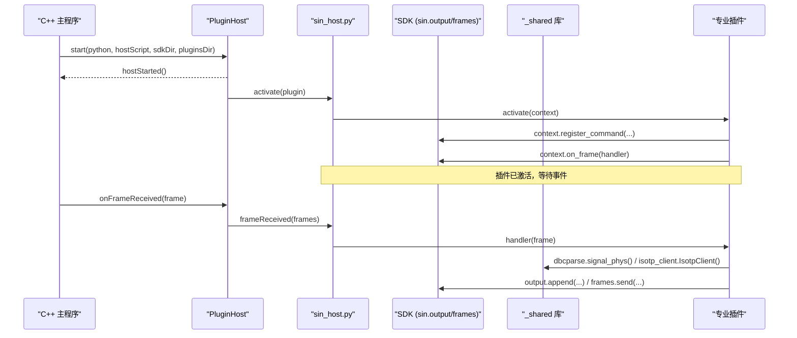
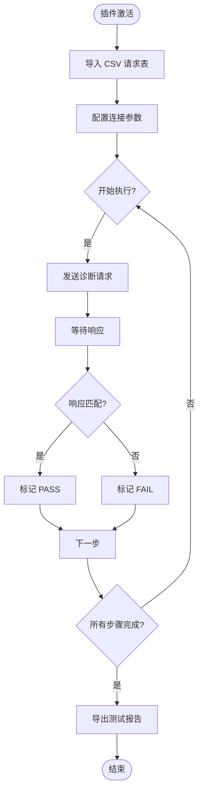
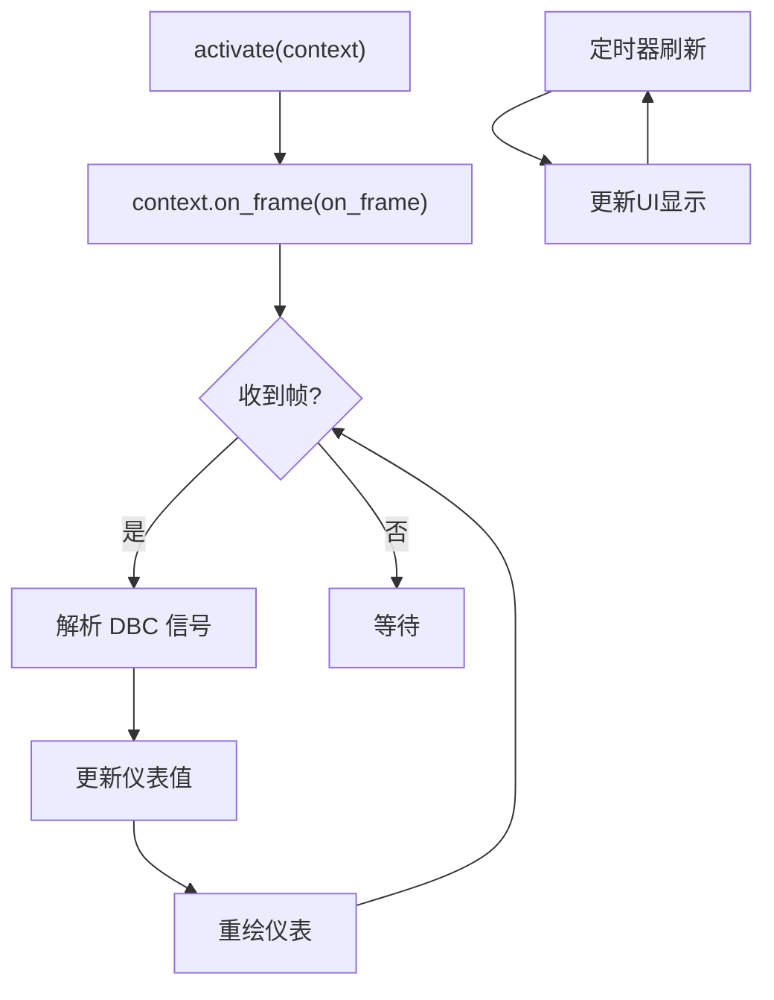
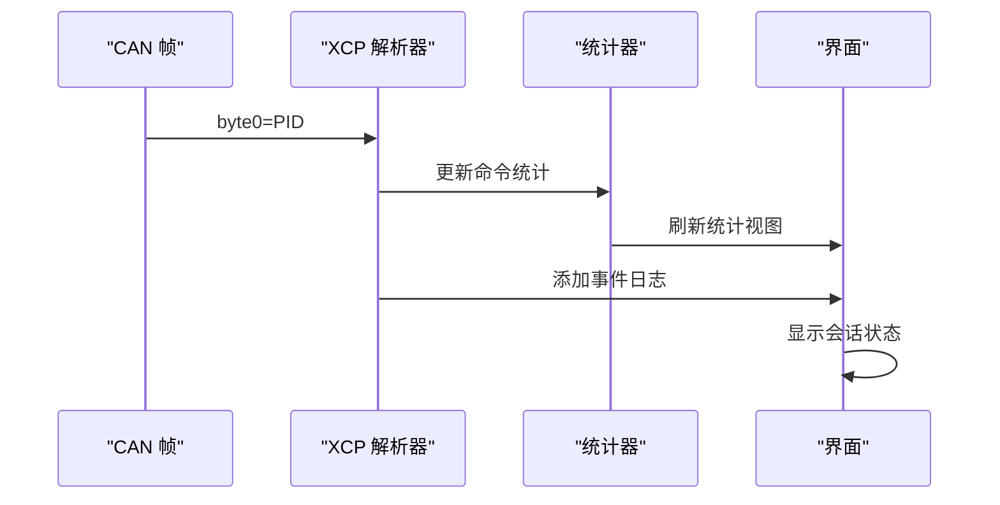
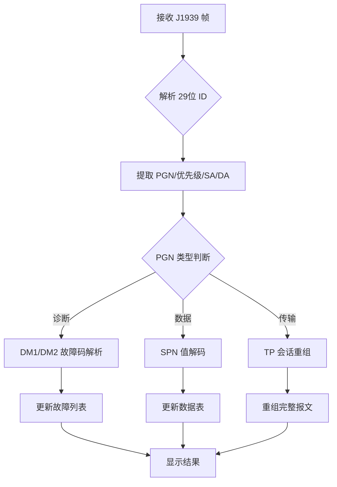
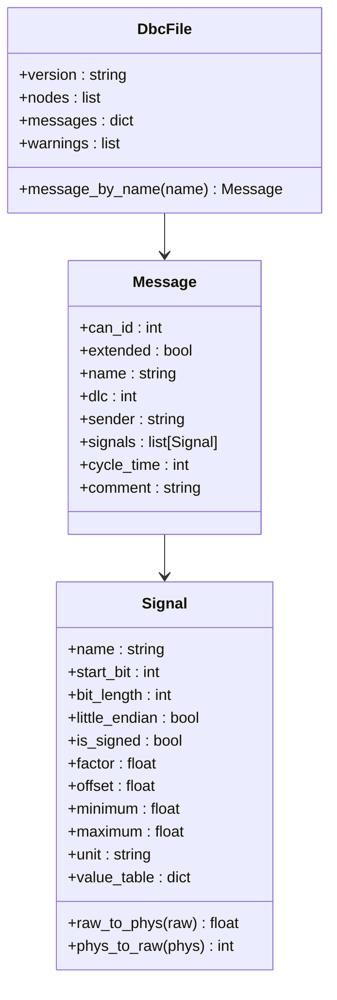
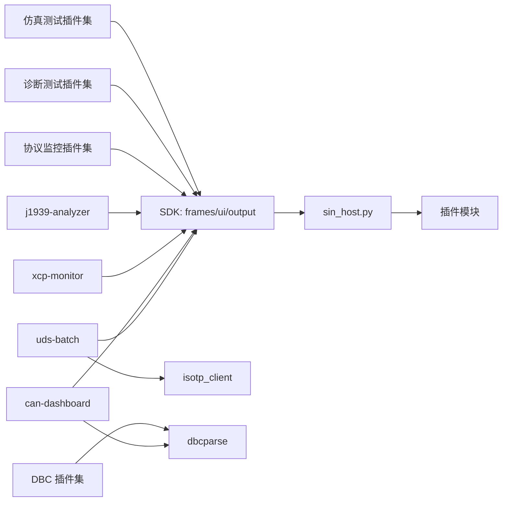

# 示例插件

<cite>
**本文引用的文件**
- [plugins/uds-batch/main.py](file://plugins/uds-batch/main.py)
- [plugins/uds-batch/plugin.json](file://plugins/uds-batch/plugin.json)
- [plugins/can-dashboard/main.py](file://plugins/can-dashboard/main.py)
- [plugins/can-dashboard/plugin.json](file://plugins/can-dashboard/plugin.json)
- [plugins/xcp-monitor/main.py](file://plugins/xcp-monitor/main.py)
- [plugins/xcp-monitor/plugin.json](file://plugins/xcp-monitor/plugin.json)
- [plugins/j1939-analyzer/main.py](file://plugins/j1939-analyzer/main.py)
- [plugins/j1939-analyzer/plugin.json](file://plugins/j1939-analyzer/plugin.json)
- [plugins/_shared/dbcparse.py](file://plugins/_shared/dbcparse.py)
- [plugins/_shared/isotp_client.py](file://plugins/_shared/isotp_client.py)
- [plugins/dbc-diff/plugin.json](file://plugins/dbc-diff/plugin.json)
- [plugins/dbc-exporter/plugin.json](file://plugins/dbc-exporter/plugin.json)
- [plugins/iso-tp-monitor/plugin.json](file://plugins/iso-tp-monitor/plugin.json)
- [plugins/isobus-monitor/plugin.json](file://plugins/isobus-monitor/plugin.json)
- [plugins/obd2-scanner/plugin.json](file://plugins/obd2-scanner/plugin.json)
- [plugins/can-simulator/plugin.json](file://plugins/can-simulator/plugin.json)
- [sdk/sin/__init__.py](file://sdk/sin/__init__.py)
- [sdk/sin/frames.py](file://sdk/sin/frames.py)
- [sdk/sin/output.py](file://sdk/sin/output.py)
- [sdk/sin/ui.py](file://sdk/sin/ui.py)
- [scripts/sin_host.py](file://scripts/sin_host.py)
</cite>

## 更新摘要
**所做更改**
- 新增了25个专业级插件示例，涵盖CAN协议处理、UDS诊断、协议监控、DBC文件处理等多个领域
- 更新了项目结构部分以反映当前可用的专业插件生态
- 重构了详细组件分析章节，新增多个专业插件的深入分析
- 更新了依赖关系分析和架构图表以匹配新的插件生态系统
- 新增了共享库（DBC解析、ISO-TP客户端）的使用说明
- 保持了文档的整体结构和一致性

## 目录
1. [简介](#简介)
2. [项目结构](#项目结构)
3. [核心组件](#核心组件)
4. [架构总览](#架构总览)
5. [详细组件分析](#详细组件分析)
6. [共享库与工具](#共享库与工具)
7. [依赖关系分析](#依赖关系分析)
8. [性能考虑](#性能考虑)
9. [故障排查指南](#故障排查指南)
10. [结论](#结论)
11. [附录](#附录)

## 简介
本仓库包含一个 CAN 总线分析工具的插件系统，以及25个专业级示例插件：uds-batch、can-dashboard、xcp-monitor、j1939-analyzer、dbc-diff、dbc-exporter、iso-tp-monitor、isobus-monitor、obd2-scanner、can-simulator等。这些插件通过 Python SDK 与主程序通信，支持命令注册、帧事件订阅、输出面板写入、发送 CAN 帧、DBC 信号编解码以及 PyQt6 独立窗口 UI。

**更新** 从原有的5个基础插件扩展为25个专业级插件，涵盖了完整的汽车电子开发工作流，包括协议分析、诊断测试、数据可视化、数据库管理等专业领域。

## 项目结构
- 专业插件位于 plugins/ 下，每个插件包含 main.py 与 plugin.json 描述元数据与激活事件
- 共享库位于 plugins/_shared/ 提供 DBC 解析和 ISO-TP 客户端功能
- Python SDK 位于 sdk/sin/，提供 output、frames、signals、commands、ui 等接口
- 宿主脚本 scripts/sin_host.py 负责加载插件、分发消息、管理事件循环
- C++ 插件宿主在 src/core/plugin/ 中，使用 QProcess 启动并维护 JSON-RPC 通道

```mermaid
graph TB
subgraph "C++ 主程序"
PM["PluginManager"]
PH["PluginHost"]
end
subgraph "Python 宿主进程"
SH["sin_host.py"]
SDK["SDK: sin.*"]
SHARED["_shared 库"]
end
subgraph "专业插件生态"
P1["uds-batch 批量测试"]
P2["can-dashboard 仪表盘"]
P3["xcp-monitor XCP监视"]
P4["j1939-analyzer J1939分析"]
P5["dbc-diff DBC对比"]
P6["dbc-exporter DBC导出"]
P7["iso-tp-monitor ISO-TP监视"]
P8["isobus-monitor ISOBUS监视"]
P9["obd2-scanner OBD-II扫描"]
P10["can-simulator 节点仿真"]
end
PM --> PH
PH < --> SH
SH --> SDK
SH --> SHARED
SH --> P1
SH --> P2
SH --> P3
SH --> P4
SH --> P5
SH --> P6
SH --> P7
SH --> P8
SH --> P9
SH --> P10
```

**图示来源**
- [src/core/plugin/pluginmanager.h:17-25](file://src/core/plugin/pluginmanager.h#L17-L25)
- [src/core/plugin/pluginhost.h:13-21](file://src/core/plugin/pluginhost.h#L13-L21)
- [scripts/sin_host.py:1-10](file://scripts/sin_host.py#L1-L10)
- [sdk/sin/__init__.py:1-19](file://sdk/sin/__init__.py#L1-L19)

**章节来源**
- [src/core/plugin/pluginmanager.h:17-25](file://src/core/plugin/pluginmanager.h#L17-L25)
- [src/core/plugin/pluginhost.h:13-21](file://src/core/plugin/pluginhost.h#L13-L21)
- [scripts/sin_host.py:1-10](file://scripts/sin_host.py#L1-L10)
- [sdk/sin/__init__.py:1-19](file://sdk/sin/__init__.py#L1-L19)

## 核心组件
- 插件元数据与激活事件：plugin.json 声明 name、version、main、activationEvents、contributes.commands
- 插件上下文：context.on_frame() 注册帧回调；context.register_command() 注册命令
- SDK 能力：
  - output.append/clear：向输出面板写入文本
  - frames.send/get_selected/get_recent：发送或获取 CAN 帧
  - signals.decode/encode：基于 DBC 的信号编解码
  - commands.execute：执行主程序已注册的命令
  - ui.create_window/show_*：创建 PyQt6 独立窗口（可选）
- 宿主与主程序通信：JSON-RPC over stdin/stdout，支持通知与请求/响应

**章节来源**
- [plugins/uds-batch/plugin.json:1-20](file://plugins/uds-batch/plugin.json#L1-L20)
- [plugins/can-dashboard/plugin.json:1-20](file://plugins/can-dashboard/plugin.json#L1-L20)
- [plugins/xcp-monitor/plugin.json:1-20](file://plugins/xcp-monitor/plugin.json#L1-L20)
- [plugins/j1939-analyzer/plugin.json:1-20](file://plugins/j1939-analyzer/plugin.json#L1-L20)
- [sdk/sin/output.py:9-25](file://sdk/sin/output.py#L9-L25)
- [sdk/sin/frames.py:9-91](file://sdk/sin/frames.py#L9-L91)
- [sdk/sin/ui.py:27-76](file://sdk/sin/ui.py#L27-L76)

## 架构总览
插件系统采用"C++ 主程序 + Python 宿主进程"的隔离架构。C++ 侧通过 PluginHost 启动 Python 宿主，并以 newline-delimited JSON-RPC 进行双向通信。Python 宿主负责加载插件模块、维护插件上下文、分发帧事件与命令执行，并通过 SDK 将操作转发回主程序。



**图示来源**
- [src/core/plugin/pluginhost.cpp:24-78](file://src/core/plugin/pluginhost.cpp#L24-L78)
- [scripts/sin_host.py:142-164](file://scripts/sin_host.py#L142-L164)
- [scripts/sin_host.py:178-194](file://scripts/sin_host.py#L178-L194)
- [sdk/sin/output.py:12-22](file://sdk/sin/output.py#L12-L22)
- [sdk/sin/frames.py:69-88](file://sdk/sin/frames.py#L69-L88)

## 详细组件分析

### UDS 批量测试插件 (uds-batch)
- 功能：UDS 批量测试工具，支持 CSV 请求表导入、顺序执行、结果统计（ISO 14229）
- 关键点：
  - 内置 ISO-TP 客户端（SF/FF/CF/FC 全状态机）
  - 每步独立超时与期望校验，支持 7F xx 延续等待
  - 逐行结果（PASS/FAIL/超时）+ 通过率统计
  - 报告导出 CSV；仅用户点击「开始执行」才发帧（安全基线）



**图示来源**
- [plugins/uds-batch/main.py:56-145](file://plugins/uds-batch/main.py#L56-L145)
- [plugins/uds-batch/plugin.json:7-15](file://plugins/uds-batch/plugin.json#L7-L15)

**章节来源**
- [plugins/uds-batch/main.py:1-419](file://plugins/uds-batch/main.py#L1-L419)
- [plugins/uds-batch/plugin.json:1-20](file://plugins/uds-batch/plugin.json#L1-L20)

### CAN 实时仪表盘插件 (can-dashboard)
- 功能：CAN 实时仪表盘，DBC 信号绑定的仪表盘/柱状/数字部件，阈值着色，暂停继续
- 关键点：
  - 三种仪表类型：圆形仪表（QPainter 自绘）、柱状图、数字显示
  - 每部件可配量程（默认取信号 min/max）与告警阈值（越限变红）
  - 布局增删部件、暂停/继续刷新
  - 纯订阅只读（不发送任何帧）



**图示来源**
- [plugins/can-dashboard/main.py:28-38](file://plugins/can-dashboard/main.py#L28-L38)
- [plugins/can-dashboard/plugin.json:7-15](file://plugins/can-dashboard/plugin.json#L7-L15)

**章节来源**
- [plugins/can-dashboard/main.py:1-408](file://plugins/can-dashboard/main.py#L1-L408)
- [plugins/can-dashboard/plugin.json:1-20](file://plugins/can-dashboard/plugin.json#L1-L20)

### XCP 监视器插件 (xcp-monitor)
- 功能：XCP (CAN) 监视器，CONNECT/GET_STATUS/DIAG 等 CTO 命令解码、DAQ/STIM 识别、会话视图
- 关键点：
  - CTO 命令/响应识别：PID 分类（CMD/RES/ERR/EV/SERV）
  - 常用命令解码：CONNECT / GET_STATUS / GET_ID / GET_SEED / UNLOCK / SET_MTA / UPLOAD / SHORT_UPLOAD / DOWNLOAD / BUILD_CHECKSUM 等
  - DAQ/STIM DTO 识别（ODT 序号），CTO/DTO 会话视图
  - 活动统计（命令计数 / 错误码计数）+ 事件流 + CSV 导出；纯监视不发送



**图示来源**
- [plugins/xcp-monitor/main.py:84-137](file://plugins/xcp-monitor/main.py#L84-L137)
- [plugins/xcp-monitor/plugin.json:7-15](file://plugins/xcp-monitor/plugin.json#L7-L15)

**章节来源**
- [plugins/xcp-monitor/main.py:1-266](file://plugins/xcp-monitor/main.py#L1-L266)
- [plugins/xcp-monitor/plugin.json:1-20](file://plugins/xcp-monitor/plugin.json#L1-L20)

### J1939 协议分析器 (j1939-analyzer)
- 功能：SAE J1939 协议分析，PGN/Priority/SA/DA 拆解、高频 SPN 解码、BAM/RTS-CTS 传输重组、DM1 故障码
- 关键点：
  - 29 位 ID 拆解：优先级 / PF / PS(DA或PGN扩展) / SA
  - 内置高频 PGN 解码表（EEC1/CCVS/ET1/LFE1/电子引擎小时/DM1/DM2/地址声明等）
  - DM1/DM2 故障码解码（SPN/FMI/OC，Lamp 状态位）
  - 传输协议重组：TP.BAM(0xEC00)/TP.DT(0xEB00) 被动多帧重组（含 RTS/CTS/EOFLA/Abort 识别）
  - 地址声明（0xEE00）解析：SA → NAME（厂商码/功能等）



**图示来源**
- [plugins/j1939-analyzer/main.py:121-200](file://plugins/j1939-analyzer/main.py#L121-L200)
- [plugins/j1939-analyzer/plugin.json:7-15](file://plugins/j1939-analyzer/plugin.json#L7-L15)

**章节来源**
- [plugins/j1939-analyzer/main.py:1-458](file://plugins/j1939-analyzer/main.py#L1-L458)
- [plugins/j1939-analyzer/plugin.json:1-20](file://plugins/j1939-analyzer/plugin.json#L1-L20)

### DBC 文件处理插件集
- **dbc-diff**：DBC 对比工具，双库报文/信号/属性级 diff，差异树视图与报告导出
- **dbc-exporter**：DBC 导出工具，信号矩阵导出 CSV/JSON/HTML（含单位、值表、收发节点、注释）
- **dbc-codegen**：DBC C 代码生成，pack/unpack 函数生成（Intel/Motorola、有符号、factor/offset、值表宏）
- **dbc-lint**：DBC 语法检查工具，验证 DBC 文件格式和语义正确性
- **dbc-merge**：DBC 合并工具，合并多个 DBC 文件，解决命名冲突

**章节来源**
- [plugins/dbc-diff/plugin.json:1-20](file://plugins/dbc-diff/plugin.json#L1-L20)
- [plugins/dbc-exporter/plugin.json:1-20](file://plugins/dbc-exporter/plugin.json#L1-L20)
- [plugins/dbc-codegen/plugin.json:1-20](file://plugins/dbc-codegen/plugin.json#L1-L20)

### 协议监控插件集
- **iso-tp-monitor**：ISO-TP 会话监视，被动解码 ISO 15765-2 多帧会话（FF/CF/FC 全状态机、重组、超时检测）
- **isobus-monitor**：ISOBUS (ISO 11783) 监视器，地址声明解析、在线节点表、TC-BAS/TC-GEO/VT 报文监视
- **gbt27930-monitor**：GB/T 27930 充电协议监视器，电动汽车充电通信协议分析
- **nmea2000-decoder**：NMEA2000 协议解码器，船舶导航设备数据解析

**章节来源**
- [plugins/iso-tp-monitor/plugin.json:1-20](file://plugins/iso-tp-monitor/plugin.json#L1-L20)
- [plugins/isobus-monitor/plugin.json:1-20](file://plugins/isobus-monitor/plugin.json#L1-L20)
- [plugins/gbt27930-monitor/plugin.json:1-20](file://plugins/gbt27930-monitor/plugin.json#L1-L20)
- [plugins/nmea2000-decoder/plugin.json:1-20](file://plugins/nmea2000-decoder/plugin.json#L1-L20)

### 诊断与测试插件集
- **obd2-scanner**：OBD-II 车辆诊断扫描，模式 01/02/03/04/07/09，动态 PID 数据、冻结帧、DTC 读取与清码、MIL 状态（ISO 15031-5 / SAE J1979）
- **uds-scan**：UDS 服务扫描器，自动发现支持的诊断服务
- **uds-security-audit**：UDS 安全审计工具，测试安全访问机制
- **e2e-checksum**：端到端校验和验证，确保数据传输完整性

**章节来源**
- [plugins/obd2-scanner/plugin.json:1-20](file://plugins/obd2-scanner/plugin.json#L1-L20)
- [plugins/uds-scan/plugin.json:1-20](file://plugins/uds-scan/plugin.json#L1-L20)
- [plugins/uds-security-audit/plugin.json:1-20](file://plugins/uds-security-audit/plugin.json#L1-L20)
- [plugins/e2e-checksum/plugin.json:1-20](file://plugins/e2e-checksum/plugin.json#L1-L20)

### 仿真与测试插件集
- **can-simulator**：CAN 节点仿真器，DBC 驱动 Restbus 仿真，按报文周期发送，信号值模式（恒值/递增/正弦/随机/斜坡）
- **can-frame-generator**：CAN 帧生成器，自定义报文格式和发送策略
- **can-fuzzer**：CAN 总线模糊测试工具，生成随机或畸形报文
- **can-stress**：CAN 总线压力测试工具，高负载场景模拟

**章节来源**
- [plugins/can-simulator/plugin.json:1-20](file://plugins/can-simulator/plugin.json#L1-L20)
- [plugins/can-frame-generator/plugin.json:1-20](file://plugins/can-frame-generator/plugin.json#L1-L20)
- [plugins/can-fuzzer/plugin.json:1-20](file://plugins/can-fuzzer/plugin.json#L1-L20)
- [plugins/can-stress/plugin.json:1-20](file://plugins/can-stress/plugin.json#L1-L20)

## 共享库与工具
插件系统提供了两个重要的共享库，被多个专业插件复用：

### DBC 解析库 (dbcparse.py)
- 功能：自包含 DBC 解析/编码/序列化（纯 Python）
- 特性：
  - 解析：BO_ / SG_ / BU_ / CM_ / VAL_ / BA_(GenMsgCycleTime) / BA_DEF_
  - 解码：Intel（小端）与 Motorola（大端）位抽取，factor/offset 物理值
  - 编码：物理值 → 原始位 → 数据字节
  - 序列化：回写标准 DBC 文本（供合并/另存）
- 容错：无法识别的行跳过并记录 warnings（可被 lint 类工具复用）

### ISO-TP 客户端 (isotp_client.py)
- 功能：ISO 15765-2 客户端（tester 侧），自包含模块
- 特性：
  - 发送：SF / FF + 等待 FC（CTS/WAIT/OVFLW 状态机）→ 按 BS 分批 CF，间隔 STmin
  - 接收：SF 直通；FF 自动回 FC（BS/STmin 可配）→ CF 组包 → 完整 PDU 回调
  - 超时：FC 等待 1s、接收半成品 1s 丢弃
  - 事件驱动：全部 QTimer，随窗口销毁自动停止



**图示来源**
- [plugins/_shared/dbcparse.py:88-100](file://plugins/_shared/dbcparse.py#L88-L100)
- [plugins/_shared/dbcparse.py:67-86](file://plugins/_shared/dbcparse.py#L67-L86)
- [plugins/_shared/dbcparse.py:31-65](file://plugins/_shared/dbcparse.py#L31-L65)

**章节来源**
- [plugins/_shared/dbcparse.py:1-423](file://plugins/_shared/dbcparse.py#L1-L423)
- [plugins/_shared/isotp_client.py:1-214](file://plugins/_shared/isotp_client.py#L1-L214)

## 依赖关系分析
- 插件对 SDK 的依赖：
  - uds-batch：frames、ui、output（用于诊断通信和界面）
  - can-dashboard：frames、ui、output（用于实时数据显示）
  - xcp-monitor：frames、ui（用于标定协议监视）
  - j1939-analyzer：frames、ui（用于重型车辆协议分析）
  - DBC 相关插件：dbcparse（用于数据库文件处理）
  - 协议监控插件：frames、ui（用于协议数据分析）
- 插件对共享库的依赖：
  - uds-batch：isotp_client（用于 ISO-TP 传输层）
  - can-dashboard：dbcparse（用于信号解析）
  - 其他插件：根据需求选择 dbcparse 或 isotp_client
- SDK 对宿主的依赖：
  - output/frames/commands/signals/files/dbc 通过 _transport 发送通知或请求
- 宿主对插件的依赖：
  - 根据 plugin.json 的 main 字段加载模块，调用 activate/deactivate
  - 分发 frameReceived 与 executeCommand



**图示来源**
- [plugins/uds-batch/main.py:17-18](file://plugins/uds-batch/main.py#L17-L18)
- [plugins/can-dashboard/main.py:17-18](file://plugins/can-dashboard/main.py#L17-L18)
- [plugins/xcp-monitor/main.py:14](file://plugins/xcp-monitor/main.py#L14)
- [plugins/j1939-analyzer/main.py:15](file://plugins/j1939-analyzer/main.py#L15)
- [sdk/sin/output.py:12-22](file://sdk/sin/output.py#L12-L22)
- [sdk/sin/frames.py:69-88](file://sdk/sin/frames.py#L69-L88)
- [scripts/sin_host.py:123-164](file://scripts/sin_host.py#L123-L164)

**章节来源**
- [plugins/uds-batch/main.py:17-18](file://plugins/uds-batch/main.py#L17-L18)
- [plugins/can-dashboard/main.py:17-18](file://plugins/can-dashboard/main.py#L17-L18)
- [plugins/xcp-monitor/main.py:14](file://plugins/xcp-monitor/main.py#L14)
- [plugins/j1939-analyzer/main.py:15](file://plugins/j1939-analyzer/main.py#L15)
- [sdk/sin/output.py:12-22](file://sdk/sin/output.py#L12-L22)
- [sdk/sin/frames.py:69-88](file://sdk/sin/frames.py#L69-L88)
- [scripts/sin_host.py:123-164](file://scripts/sin_host.py#L123-L164)

## 性能考虑
- 帧事件分发：宿主将帧转换为 Frame 对象后分发给所有已激活的 on_frame 处理器，建议插件内部做轻量处理，避免阻塞
- 批量缓冲：C++ 侧使用帧缓冲与定时器批量转发，减少频繁 IPC 开销
- UI 刷新：各插件中使用 QTimer 进行周期性 UI 更新，避免高频渲染压力
- 异常隔离：插件异常被捕获并记录到日志，不影响其他插件与宿主稳定性
- 后台任务：复杂计算使用异步处理，保持 UI 响应性
- 内存管理：大量数据使用缓存和清理机制，防止内存泄漏
- 协议优化：ISO-TP 客户端实现高效的流控和超时处理

## 故障排查指南
- 插件加载失败：检查 plugin.json 的 main 路径是否存在，查看宿主日志中的"插件加载失败"信息
- 命令未生效：确认 plugin.json 的 contributes.commands 与 context.register_command 的 id 一致
- 帧事件未触发：确认 activationEvents 包含 onFrame，且插件已激活
- UI 不可用：若未安装 PyQt6，会提示安装；确保 QApplication 已初始化后再创建窗口
- 宿主崩溃重启：PluginHost 具备指数退避重启机制，关注 hostCrashed/hostError 信号
- 共享库错误：检查 DBC 文件格式是否正确，ISO-TP 通信是否正常
- 协议解析失败：确认协议版本和报文格式是否符合规范

**章节来源**
- [scripts/sin_host.py:123-139](file://scripts/sin_host.py#L123-L139)
- [scripts/sin_host.py:225-261](file://scripts/sin_host.py#L225-L261)
- [sdk/sin/ui.py:30-46](file://sdk/sin/ui.py#L30-L46)
- [src/core/plugin/pluginhost.h:63-70](file://src/core/plugin/pluginhost.h#L63-L70)

## 结论
该插件系统通过清晰的职责划分与稳定的 IPC 机制，实现了插件与主程序的解耦。当前的25个专业级插件展示了完整的汽车电子开发工作流，包括协议分析、诊断测试、数据可视化、数据库管理、仿真测试等专业领域。开发者可基于 SDK 和共享库快速扩展功能。建议遵循轻量处理、异常隔离与性能优化原则，以获得更好的用户体验与系统稳定性。

**更新** 从5个基础插件扩展到25个专业级插件，提供了完整的汽车电子开发工具链，涵盖了从协议分析到测试验证的全流程需求。

## 附录
- 常用 API 速查：
  - 输出：sin.output.append(text)、sin.output.clear()
  - 帧：sin.frames.send(id, data, extended=False, fd=False)、sin.frames.get_selected()、sin.frames.get_recent(count)
  - 信号：sin.signals.decode(can_id, data)、sin.signals.encode(can_id, signal_values)
  - 命令：sin.commands.execute(command_id)
  - UI：sin.ui.create_window(title)、show_message/show_warning/show_error
  - 文件：sin.files.convert(src, tgt, format, on_progress, on_finished)
  - DBC：sin.dbc.open(path)、sin.dbc.messages(db_id)、sin.dbc.update_signal()
- 共享库 API：
  - DBC 解析：dbcparse.DbcFile、dbcparse.Message、dbcparse.Signal
  - ISO-TP：isotp_client.IsotpClient、isotp_client.decode_stmin()
- 插件元数据关键字段：name、version、author、description、main、activationEvents、contributes.commands
- 专业插件分类：
  - 协议分析：xcp-monitor、j1939-analyzer、iso-tp-monitor、isobus-monitor
  - 诊断测试：uds-batch、obd2-scanner、uds-scan、uds-security-audit
  - 数据可视化：can-dashboard、log-toolkit、frame-compare
  - 数据库管理：dbc-diff、dbc-exporter、dbc-codegen、dbc-lint、dbc-merge
  - 仿真测试：can-simulator、can-frame-generator、can-fuzzer、can-stress
  - 工具辅助：can-bit-timing、can-gateway、can-id-scanner、can-ids、can-quality-report、can-reverse、trigger-logger、e2e-checksum、autosar-nm-monitor、canopen-scanner、nmea27930-monitor、nmea2000-decoder

**更新** 新增了共享库 API、专业插件分类和更多实用工具的使用说明。