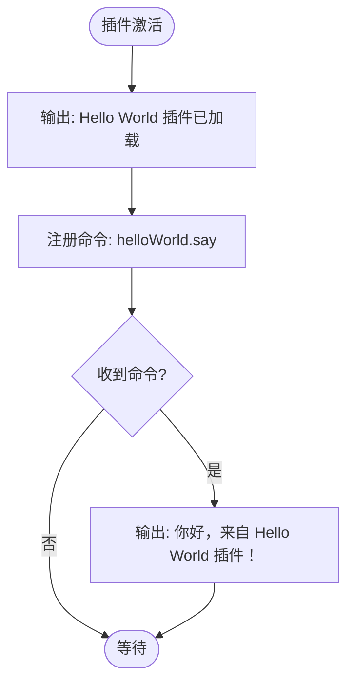
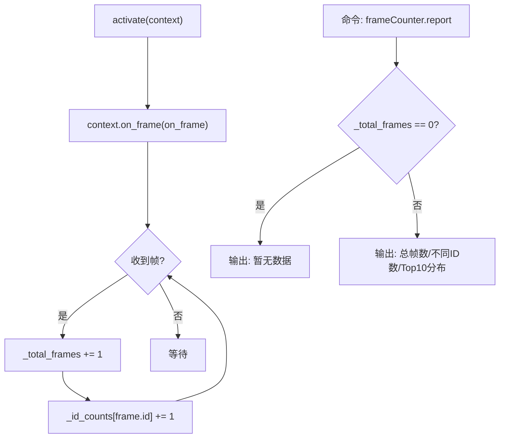
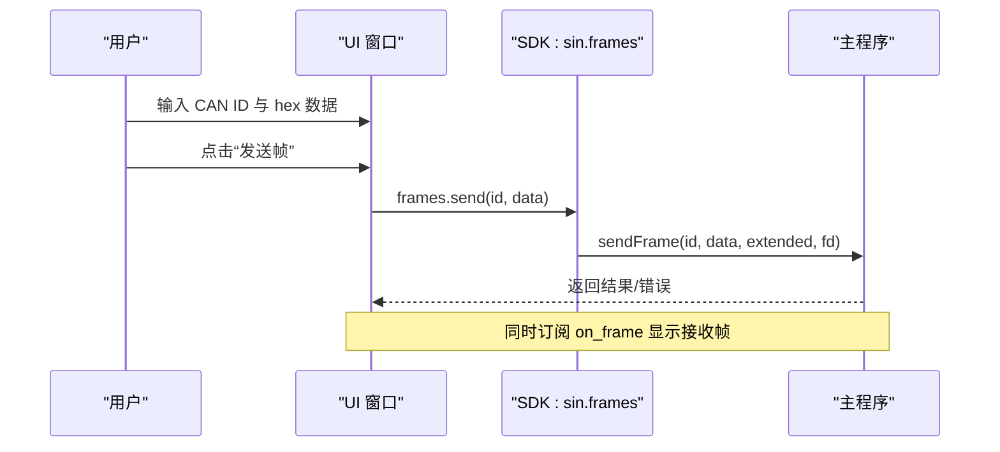
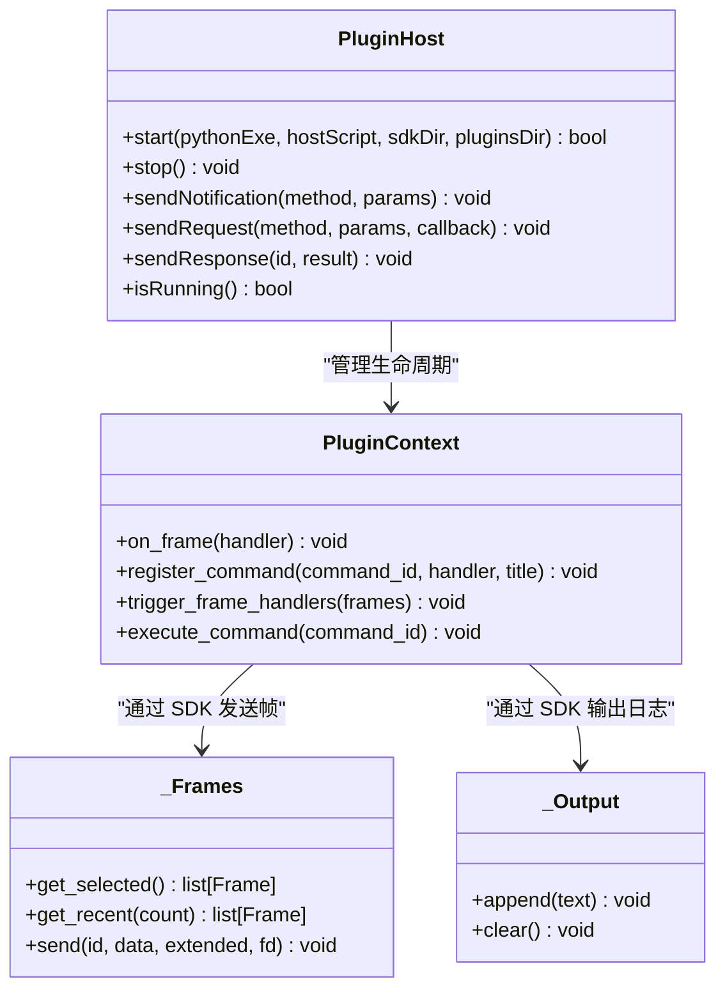
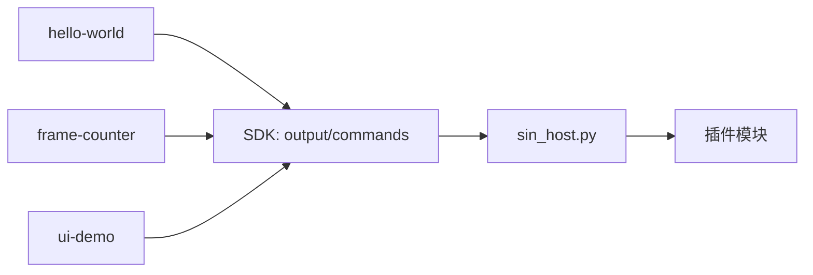

# 示例插件

<cite>
**本文引用的文件**
- [plugins/hello-world/main.py](file://plugins/hello-world/main.py)
- [plugins/hello-world/plugin.json](file://plugins/hello-world/plugin.json)
- [plugins/frame-counter/main.py](file://plugins/frame-counter/main.py)
- [plugins/frame-counter/plugin.json](file://plugins/frame-counter/plugin.json)
- [plugins/ui-demo/main.py](file://plugins/ui-demo/main.py)
- [plugins/ui-demo/plugin.json](file://plugins/ui-demo/plugin.json)
- [sdk/sin/__init__.py](file://sdk/sin/__init__.py)
- [sdk/sin/frames.py](file://sdk/sin/frames.py)
- [sdk/sin/output.py](file://sdk/sin/output.py)
- [sdk/sin/commands.py](file://sdk/sin/commands.py)
- [sdk/sin/signals.py](file://sdk/sin/signals.py)
- [sdk/sin/ui.py](file://sdk/sin/ui.py)
- [scripts/sin_host.py](file://scripts/sin_host.py)
- [src/core/plugin/pluginhost.h](file://src/core/plugin/pluginhost.h)
- [src/core/plugin/pluginhost.cpp](file://src/core/plugin/pluginhost.cpp)
- [src/core/plugin/pluginmanager.h](file://src/core/plugin/pluginmanager.h)
</cite>

## 目录
1. [简介](#简介)
2. [项目结构](#项目结构)
3. [核心组件](#核心组件)
4. [架构总览](#架构总览)
5. [详细组件分析](#详细组件分析)
6. [依赖关系分析](#依赖关系分析)
7. [性能考虑](#性能考虑)
8. [故障排查指南](#故障排查指南)
9. [结论](#结论)
10. [附录](#附录)

## 简介
本仓库包含一个 CAN 总线分析工具的插件系统，以及三个示例插件：hello-world、frame-counter、ui-demo。插件通过 Python SDK 与主程序通信，支持命令注册、帧事件订阅、输出面板写入、发送 CAN 帧、DBC 信号编解码以及 PyQt6 独立窗口 UI。

## 项目结构
- 示例插件位于 plugins/ 下，每个插件包含 main.py 与 plugin.json 描述元数据与激活事件。
- Python SDK 位于 sdk/sin/，提供 output、frames、signals、commands、ui 等接口。
- 宿主脚本 scripts/sin_host.py 负责加载插件、分发消息、管理事件循环。
- C++ 插件宿主在 src/core/plugin/ 中，使用 QProcess 启动并维护 JSON-RPC 通道。

```mermaid
graph TB
subgraph "C++ 主程序"
PM["PluginManager"]
PH["PluginHost"]
end
subgraph "Python 宿主进程"
SH["sin_host.py"]
SDK["SDK: sin.*"]
end
subgraph "示例插件"
P1["hello-world"]
P2["frame-counter"]
P3["ui-demo"]
end
PM --> PH
PH < --> SH
SH --> SDK
SH --> P1
SH --> P2
SH --> P3
```

**图示来源**
- [src/core/plugin/pluginmanager.h:17-25](file://src/core/plugin/pluginmanager.h#L17-L25)
- [src/core/plugin/pluginhost.h:13-21](file://src/core/plugin/pluginhost.h#L13-L21)
- [scripts/sin_host.py:1-10](file://scripts/sin_host.py#L1-L10)
- [sdk/sin/__init__.py:1-19](file://sdk/sin/__init__.py#L1-L19)

**章节来源**
- [src/core/plugin/pluginmanager.h:17-25](file://src/core/plugin/pluginmanager.h#L17-L25)
- [src/core/plugin/pluginhost.h:13-21](file://src/core/plugin/pluginhost.h#L13-L21)
- [scripts/sin_host.py:1-10](file://scripts/sin_host.py#L1-L10)
- [sdk/sin/__init__.py:1-19](file://sdk/sin/__init__.py#L1-L19)

## 核心组件
- 插件元数据与激活事件：plugin.json 声明 name、version、main、activationEvents、contributes.commands。
- 插件上下文：context.on_frame() 注册帧回调；context.register_command() 注册命令。
- SDK 能力：
  - output.append/clear：向输出面板写入文本。
  - frames.send/get_selected/get_recent：发送或获取 CAN 帧。
  - signals.decode/encode：基于 DBC 的信号编解码。
  - commands.execute：执行主程序已注册的命令。
  - ui.create_window/show_*：创建 PyQt6 独立窗口（可选）。
- 宿主与主程序通信：JSON-RPC over stdin/stdout，支持通知与请求/响应。

**章节来源**
- [plugins/hello-world/plugin.json:1-16](file://plugins/hello-world/plugin.json#L1-L16)
- [plugins/frame-counter/plugin.json:1-18](file://plugins/frame-counter/plugin.json#L1-L18)
- [plugins/ui-demo/plugin.json:1-14](file://plugins/ui-demo/plugin.json#L1-L14)
- [sdk/sin/output.py:9-25](file://sdk/sin/output.py#L9-L25)
- [sdk/sin/frames.py:9-91](file://sdk/sin/frames.py#L9-L91)
- [sdk/sin/signals.py:9-55](file://sdk/sin/signals.py#L9-L55)
- [sdk/sin/commands.py:9-22](file://sdk/sin/commands.py#L9-L22)
- [sdk/sin/ui.py:27-76](file://sdk/sin/ui.py#L27-L76)

## 架构总览
插件系统采用“C++ 主程序 + Python 宿主进程”的隔离架构。C++ 侧通过 PluginHost 启动 Python 宿主，并以 newline-delimited JSON-RPC 进行双向通信。Python 宿主负责加载插件模块、维护插件上下文、分发帧事件与命令执行，并通过 SDK 将操作转发回主程序。


**图示来源**
- [src/core/plugin/pluginhost.cpp:24-78](file://src/core/plugin/pluginhost.cpp#L24-L78)
- [scripts/sin_host.py:142-164](file://scripts/sin_host.py#L142-L164)
- [scripts/sin_host.py:178-194](file://scripts/sin_host.py#L178-L194)
- [sdk/sin/output.py:12-22](file://sdk/sin/output.py#L12-L22)
- [sdk/sin/frames.py:69-88](file://sdk/sin/frames.py#L69-L88)

## 详细组件分析

### hello-world 插件
- 功能：启动时输出欢迎信息，注册命令并在输出面板显示问候。
- 关键点：
  - plugin.json 声明 activationEvents 包含 onStartup 与 onCommand。
  - activate(context) 调用 sin.output.append 与 context.register_command。
  - deactivate(context) 卸载时输出日志。



**图示来源**
- [plugins/hello-world/main.py:11-24](file://plugins/hello-world/main.py#L11-L24)
- [plugins/hello-world/plugin.json:7-15](file://plugins/hello-world/plugin.json#L7-L15)

**章节来源**
- [plugins/hello-world/main.py:1-25](file://plugins/hello-world/main.py#L1-L25)
- [plugins/hello-world/plugin.json:1-16](file://plugins/hello-world/plugin.json#L1-L16)

### frame-counter 插件
- 功能：实时统计接收到的 CAN 帧数量与按 ID 分布，支持命令输出 Top 10 报告。
- 关键点：
  - activationEvents 包含 onStartup、onFrame、onCommand。
  - context.on_frame 注册回调，累计全局计数与 ID 分布。
  - 命令触发时生成格式化报告并输出。



**图示来源**
- [plugins/frame-counter/main.py:16-53](file://plugins/frame-counter/main.py#L16-L53)
- [plugins/frame-counter/plugin.json:7-15](file://plugins/frame-counter/plugin.json#L7-L15)

**章节来源**
- [plugins/frame-counter/main.py:1-54](file://plugins/frame-counter/main.py#L1-L54)
- [plugins/frame-counter/plugin.json:1-18](file://plugins/frame-counter/plugin.json#L1-L18)

### ui-demo 插件
- 功能：创建 PyQt6 独立窗口，支持发送 CAN 帧、实时显示接收帧、清空输出。
- 关键点：
  - 动态导入 PyQt6，未安装时提示安装。
  - 使用 sin.ui.create_window 创建主窗口，布局控件。
  - 按钮点击调用 sin.frames.send 发送帧。
  - context.on_frame 订阅帧并更新 UI。
  - 注册命令 uidemo.clear 清空输出与计数器。



**图示来源**
- [plugins/ui-demo/main.py:15-105](file://plugins/ui-demo/main.py#L15-L105)
- [sdk/sin/ui.py:30-46](file://sdk/sin/ui.py#L30-L46)
- [sdk/sin/frames.py:69-88](file://sdk/sin/frames.py#L69-L88)

**章节来源**
- [plugins/ui-demo/main.py:1-106](file://plugins/ui-demo/main.py#L1-L106)
- [plugins/ui-demo/plugin.json:1-14](file://plugins/ui-demo/plugin.json#L1-L14)
- [sdk/sin/ui.py:27-76](file://sdk/sin/ui.py#L27-L76)

### 插件宿主与 SDK 通信
- 通信协议：newline-delimited JSON-RPC 2.0，方法包括 activate/deactivate/frameReceived/executeCommand/fileOpened/shutdown 等。
- 请求/响应：SDK 通过 send_request 发起请求，宿主通过 deliver_response 投递响应。
- 线程模型：stdin 读取在独立线程，Qt 模式下使用 QTimer 轮询消息队列，避免阻塞。



**图示来源**
- [src/core/plugin/pluginhost.h:22-95](file://src/core/plugin/pluginhost.h#L22-L95)
- [scripts/sin_host.py:78-117](file://scripts/sin_host.py#L78-L117)
- [sdk/sin/frames.py:39-91](file://sdk/sin/frames.py#L39-L91)
- [sdk/sin/output.py:9-25](file://sdk/sin/output.py#L9-L25)

**章节来源**
- [src/core/plugin/pluginhost.h:22-95](file://src/core/plugin/pluginhost.h#L22-L95)
- [src/core/plugin/pluginhost.cpp:106-156](file://src/core/plugin/pluginhost.cpp#L106-L156)
- [scripts/sin_host.py:225-261](file://scripts/sin_host.py#L225-L261)
- [scripts/sin_host.py:276-398](file://scripts/sin_host.py#L276-L398)

## 依赖关系分析
- 插件对 SDK 的依赖：
  - hello-world：output、commands（通过 context.register_command）。
  - frame-counter：output、frames（仅用于输出）、context.on_frame。
  - ui-demo：ui、frames、output、context.on_frame。
- SDK 对宿主的依赖：
  - output/frames/commands/signals 通过 _transport 发送通知或请求。
- 宿主对插件的依赖：
  - 根据 plugin.json 的 main 字段加载模块，调用 activate/deactivate。
  - 分发 frameReceived 与 executeCommand。



**图示来源**
- [plugins/hello-world/main.py:11-24](file://plugins/hello-world/main.py#L11-L24)
- [plugins/frame-counter/main.py:16-53](file://plugins/frame-counter/main.py#L16-L53)
- [plugins/ui-demo/main.py:15-105](file://plugins/ui-demo/main.py#L15-L105)
- [sdk/sin/output.py:12-22](file://sdk/sin/output.py#L12-L22)
- [sdk/sin/frames.py:69-88](file://sdk/sin/frames.py#L69-L88)
- [scripts/sin_host.py:123-164](file://scripts/sin_host.py#L123-L164)

**章节来源**
- [plugins/hello-world/main.py:11-24](file://plugins/hello-world/main.py#L11-L24)
- [plugins/frame-counter/main.py:16-53](file://plugins/frame-counter/main.py#L16-L53)
- [plugins/ui-demo/main.py:15-105](file://plugins/ui-demo/main.py#L15-L105)
- [sdk/sin/output.py:12-22](file://sdk/sin/output.py#L12-L22)
- [sdk/sin/frames.py:69-88](file://sdk/sin/frames.py#L69-L88)
- [scripts/sin_host.py:123-164](file://scripts/sin_host.py#L123-L164)

## 性能考虑
- 帧事件分发：宿主将帧转换为 Frame 对象后分发给所有已激活的 on_frame 处理器，建议插件内部做轻量处理，避免阻塞。
- 批量缓冲：C++ 侧使用帧缓冲与定时器批量转发，减少频繁 IPC 开销。
- UI 刷新：ui-demo 中每帧更新 UI 可能带来渲染压力，建议在高频场景下节流或合并更新。
- 异常隔离：插件异常被捕获并记录到日志，不影响其他插件与宿主稳定性。

[本节为通用指导，不直接分析具体文件]

## 故障排查指南
- 插件加载失败：检查 plugin.json 的 main 路径是否存在，查看宿主日志中的“插件加载失败”信息。
- 命令未生效：确认 plugin.json 的 contributes.commands 与 context.register_command 的 id 一致。
- 帧事件未触发：确认 activationEvents 包含 onFrame，且插件已激活。
- UI 不可用：若未安装 PyQt6，会提示安装；确保 QApplication 已初始化后再创建窗口。
- 宿主崩溃重启：PluginHost 具备指数退避重启机制，关注 hostCrashed/hostError 信号。

**章节来源**
- [scripts/sin_host.py:123-139](file://scripts/sin_host.py#L123-L139)
- [scripts/sin_host.py:225-261](file://scripts/sin_host.py#L225-L261)
- [sdk/sin/ui.py:30-46](file://sdk/sin/ui.py#L30-L46)
- [src/core/plugin/pluginhost.h:63-70](file://src/core/plugin/pluginhost.h#L63-L70)

## 结论
该插件系统通过清晰的职责划分与稳定的 IPC 机制，实现了插件与主程序的解耦。示例插件展示了基本用法与高级能力（帧统计、UI 交互），开发者可基于 SDK 快速扩展功能。建议遵循轻量处理、异常隔离与性能优化原则，以获得更好的用户体验与系统稳定性。

[本节为总结性内容，不直接分析具体文件]

## 附录
- 常用 API 速查：
  - 输出：sin.output.append(text)、sin.output.clear()
  - 帧：sin.frames.send(id, data, extended=False, fd=False)、sin.frames.get_selected()、sin.frames.get_recent(count)
  - 信号：sin.signals.decode(can_id, data)、sin.signals.encode(can_id, signal_values)
  - 命令：sin.commands.execute(command_id)
  - UI：sin.ui.create_window(title)、show_message/show_warning/show_error
- 插件元数据关键字段：name、version、author、description、main、activationEvents、contributes.commands

[本节为参考信息，不直接分析具体文件]