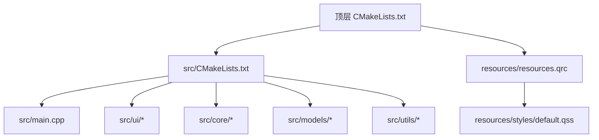
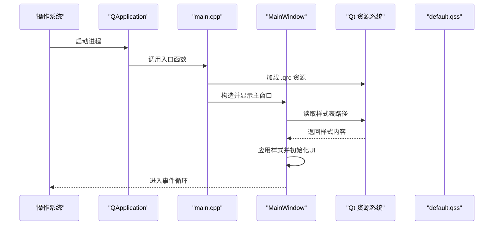
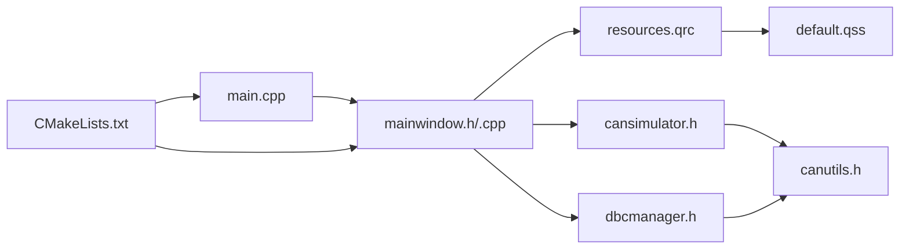

# 编码规范

<cite>
**本文引用的文件**   
- [POLICY-ENGLISH-CODING.md](file://doc/POLICY-ENGLISH-CODING.md)
- [English_Coding_Policy.md](file://doc/English_Coding_Policy.md)
- [CMakeLists.txt](file://CMakeLists.txt)
- [src/CMakeLists.txt](file://src/CMakeLists.txt)
- [src/main.cpp](file://src/main.cpp)
- [src/core/cansimulator.h](file://src/core/cansimulator.h)
- [src/core/dbcmanager.h](file://src/core/dbcmanager.h)
- [src/models/cantracemodel.h](file://src/models/cantracemodel.h)
- [src/ui/mainwindow.h](file://src/ui/mainwindow.h)
- [src/ui/activitybar.h](file://src/ui/activitybar.h)
- [src/ui/bottompanel.h](file://src/ui/bottompanel.h)
- [src/utils/canutils.h](file://src/utils/canutils.h)
- [resources/styles/default.qss](file://resources/styles/default.qss)
- [resources/resources.qrc](file://resources/resources.qrc)
- [README.md](file://README.md)
</cite>

## 更新摘要
**所做更改**   
- 根据最新的英文编码政策更新了强制规范和执行机制
- 增强了预检系统和自动化检查工具的描述
- 更新了Qt特定开发约定以匹配当前实现
- 添加了详细的违规处理流程和修复指南
- 完善了构建系统规范和Git工作流程要求

## 目录
1. [简介](#简介)
2. [全英文编码策略](#全英文编码策略)
3. [项目结构](#项目结构)
4. [核心组件](#核心组件)
5. [架构总览](#架构总览)
6. [详细组件分析](#详细组件分析)
7. [依赖关系分析](#依赖关系分析)
8. [性能考虑](#性能考虑)
9. [故障排查指南](#故障排查指南)
10. [结论](#结论)
11. [附录](#附录)

## 简介
本规范面向使用 C++ 与 Qt 的桌面应用开发，目标是统一团队在命名约定、代码格式、注释风格、文件组织以及 Qt 特定实践（信号槽、内存管理、事件处理）上的行为，确保可维护性、可读性与一致性。文档同时给出基于当前仓库的示例引用路径，便于对照实际实现。

**重要更新**：本项目已采用强制性的全英文编码策略，所有核心代码文件禁止使用中文字符，以确保跨平台构建稳定性和团队协作效率。该策略通过自动化预检系统和Git Hook强制执行。

## 全英文编码策略

### 核心规则概述
- **文件命名**：绝对禁止中文文件名，所有源文件、头文件、配置文件必须使用英文
- **代码注释**：逐步过渡到纯英文注释，UI界面文本除外
- **变量和函数命名**：严格使用英文命名，禁止中文拼音或汉字
- **构建系统**：CMakeLists.txt 必须使用全英文路径
- **Git操作**：分支名和提交消息使用英文

### 强制执行机制

#### 预检系统
```bash
# 运行完整预检系统
python pre_build_health_check.py

# 专门扫描中文问题
python scan_chinese_chars.py > scan_results.txt

# 在自动构建流程中集成
python auto_build_with_prepcheck.py
```

#### Git Hook 集成（可选但推荐）
```bash
# 激活pre-commit钩子
chmod +x .git/hooks/pre-commit

# 钩子内容示例
#!/bin/bash
echo "Running pre-build health check..."
python pre_build_health_check.py > /dev/null 2>&1

if [ $? -ne 0 ]; then
    echo "[BLOCKED] Code quality issues detected!"
    cat .tmp/pre_build_check.txt
    exit 1
fi

exit 0
```

### 违规后果
- ❌ **pre-commit hook 阻止提交** (发现中文文件名)
- ❌ **CI 流水线标记为失败** (检测到编译错误由编码引起)
- ❌ **PR 审查不予通过** (评审者有权拒绝含中文的代码)

### 迁移指南

#### 第一阶段：新项目（立即执行）
- ✅ 所有新增文件使用英文命名
- ✅ 所有新注释使用英文
- ✅ 所有变量和函数名使用英文

#### 第二阶段：现有代码（逐步替换）
当修改包含中文的文件时，**顺便**替换为英文:

```bash
# 示例：重命名文件并翻译注释
git mv "old_中文文件名.cpp" "new_english_name.cpp"
sed -i 's|// 中文注释|// English comment|g' new_english_name.cpp
```

#### 第三阶段：清理遗留（未来）
- [ ] 扫描整个代码库识别中文文件名
- [ ] 制定批量重命名计划
- [ ] 逐步替换为英文版本

**章节来源**   
- [POLICY-ENGLISH-CODING.md:1-157](file://doc/POLICY-ENGLISH-CODING.md#L1-L157)
- [English_Coding_Policy.md:1-181](file://doc/English_Coding_Policy.md#L1-L181)

## 项目结构
本项目采用分层与按功能组织的混合方式：
- src：源代码根目录，包含入口 main.cpp 与 UI 模块 ui/
- resources：资源文件，包括样式表与 Qt 资源清单
- CMakeLists.txt：顶层构建配置；src/CMakeLists.txt：模块级构建配置



**图表来源**   
- [CMakeLists.txt:1-95](file://CMakeLists.txt#L1-L95)
- [src/CMakeLists.txt:1-200](file://src/CMakeLists.txt#L1-L200)
- [src/main.cpp:1-79](file://src/main.cpp#L1-L79)

**章节来源**   
- [CMakeLists.txt:1-95](file://CMakeLists.txt#L1-L95)
- [src/CMakeLists.txt:1-200](file://src/CMakeLists.txt#L1-L200)
- [README.md:1-200](file://README.md#L1-L200)

## 核心组件
- 应用程序入口：负责初始化 Qt 应用、加载资源、创建并显示主窗口
- 主窗口：承载界面布局、业务交互、信号槽连接与事件处理
- CAN仿真器：模拟CAN总线数据生成与传输
- DBC管理器：解析和管理DBC数据库文件
- 跟踪模型：提供CAN数据模型的MVC架构支持
- 工具类：提供CAN总线相关的实用函数

**章节来源**   
- [src/main.cpp:1-79](file://src/main.cpp#L1-L79)
- [src/ui/mainwindow.h:1-200](file://src/ui/mainwindow.h#L1-L200)
- [src/core/cansimulator.h:1-69](file://src/core/cansimulator.h#L1-L69)
- [src/core/dbcmanager.h:1-73](file://src/core/dbcmanager.h#L1-L73)
- [src/models/cantracemodel.h:1-200](file://src/models/cantracemodel.h#L1-L200)

## 架构总览
下图展示从入口到主窗口的典型启动流程，以及资源加载与样式应用的关系。



**图表来源**   
- [src/main.cpp:1-79](file://src/main.cpp#L1-L79)
- [src/ui/mainwindow.h:1-200](file://src/ui/mainwindow.h#L1-L200)
- [resources/resources.qrc:1-50](file://resources/resources.qrc#L1-L50)
- [resources/styles/default.qss:1-200](file://resources/styles/default.qss#L1-L200)

## 详细组件分析

### 命名约定
- 类名：使用大驼峰（PascalCase），如 MainWindow、CanSimulator、DbcManager
- 函数与方法：动词开头，小驼峰（camelCase），如 loadConfig()、updateView()
- 变量与成员：小驼峰（camelCase），私有成员可使用前缀 m_ 或下划线后缀 _，保持全项目一致
- 常量与枚举：常量使用全大写加下划线（UPPER_SNAKE_CASE），枚举值使用大驼峰
- 文件名：头文件与源文件使用小写+下划线或大驼峰，需与类名对应且一致
- 信号与槽：信号以 onXxx() 或 xxxRequested() 风格；槽以 handleXxx() 或 onXxx() 风格，语义清晰

**章节来源**   
- [src/ui/mainwindow.h:1-200](file://src/ui/mainwindow.h#L1-L200)
- [src/core/cansimulator.h:1-69](file://src/core/cansimulator.h#L1-L69)
- [src/core/dbcmanager.h:1-73](file://src/core/dbcmanager.h#L1-L73)

### 代码格式标准
- 缩进：4 空格，不使用 Tab
- 行宽：建议不超过 120 字符
- 花括号：K&R 风格，控制语句与函数体左花括号同行
- 空行：逻辑块之间保留一个空行，提升可读性
- 头文件保护：使用 #pragma once 或 include guards
- 包含顺序：Qt 头文件、第三方库、项目内部头文件，分块并排序
- 命名空间：避免全局污染，合理划分命名空间或使用内联命名空间

**章节来源**   
- [src/main.cpp:1-79](file://src/main.cpp#L1-L79)
- [src/ui/mainwindow.h:1-200](file://src/ui/mainwindow.h#L1-L200)
- [src/utils/canutils.h:1-79](file://src/utils/canutils.h#L1-L79)

### 注释规范
- 文件头：简要说明用途、作者、日期、许可证
- 类与接口：说明职责、前置条件、线程安全性
- 函数：参数含义、返回值、异常/错误码、副作用
- 关键逻辑：解释"为什么"，而非"是什么"
- 避免过时注释：随代码变更同步更新

**章节来源**   
- [src/ui/mainwindow.h:1-200](file://src/ui/mainwindow.h#L1-L200)
- [src/core/cansimulator.h:1-69](file://src/core/cansimulator.h#L1-L69)

### 文件组织结构
- src/main.cpp：应用入口，负责初始化与生命周期
- src/ui/*：用户界面相关组件，包括主窗口、面板、视图等
- src/core/*：核心业务逻辑，包含CAN仿真、DBC管理等
- src/models/*：数据模型层，提供MVC架构支持
- src/utils/*：工具类，提供通用功能
- resources/*：样式与资源清单集中管理
- CMakeLists.txt：顶层与模块级构建脚本，明确目标与依赖

**章节来源**   
- [CMakeLists.txt:1-95](file://CMakeLists.txt#L1-L95)
- [src/CMakeLists.txt:1-200](file://src/CMakeLists.txt#L1-L200)
- [resources/resources.qrc:1-50](file://resources/resources.qrc#L1-L50)

### Qt 特定开发约定

#### 信号槽使用模式
- 优先使用函数指针形式的 connect，编译期检查
- 信号与槽的参数类型应严格匹配，必要时使用 lambda 适配
- 跨线程通信使用 Qt::QueuedConnection，避免直接访问非线程安全对象
- 断开不再需要的连接，防止悬挂指针与内存泄漏

**章节来源**   
- [src/ui/mainwindow.h:1-200](file://src/ui/mainwindow.h#L1-L200)
- [src/ui/activitybar.h:1-200](file://src/ui/activitybar.h#L1-L200)

#### 内存管理最佳实践
- 优先使用栈对象与 RAII，避免裸 new/delete
- 父子层级管理 QObject 生命周期，必要时使用智能指针
- 避免循环引用，使用弱引用或设计解耦
- 资源释放放在析构或显式 close()/release()，保证异常安全

**章节来源**   
- [src/ui/mainwindow.h:1-200](file://src/ui/mainwindow.h#L1-L200)
- [src/ui/bottompanel.h:1-200](file://src/ui/bottompanel.h#L1-L200)

#### 事件处理规范
- 重写事件时调用基类实现，避免破坏默认行为
- 自定义事件使用 QEvent 派生类，并通过 post/send 投递
- 耗时操作放入工作线程，通过信号槽回传结果到 GUI 线程
- 避免在事件处理器中阻塞，保持响应性

**章节来源**   
- [src/ui/mainwindow.h:1-200](file://src/ui/mainwindow.h#L1-L200)

#### 资源与样式管理
- 使用 .qrc 统一管理样式、图标等资源，便于打包与分发
- 样式表通过 qApp->setStyleSheet() 或对象 setStyleSheet() 应用
- 动态切换主题时，注意清理旧样式与缓存

**章节来源**   
- [resources/resources.qrc:1-50](file://resources/resources.qrc#L1-L50)
- [resources/styles/default.qss:1-200](file://resources/styles/default.qss#L1-L200)

### 错误处理与资源管理最佳实践
- 输入校验：对用户输入进行边界与合法性检查，返回明确的错误码或抛出异常
- 资源获取失败：记录日志并回退到安全状态，避免崩溃
- 异常安全：使用 try-catch 包裹可能抛出的操作，确保资源释放
- 日志记录：分级输出，包含上下文信息，便于定位问题

**章节来源**   
- [src/utils/canutils.h:1-79](file://src/utils/canutils.h#L1-L79)

### 具体示例参考路径
- 正确的类定义与成员命名：[src/ui/mainwindow.h:1-200](file://src/ui/mainwindow.h#L1-L200)
- 信号槽连接与槽函数实现：[src/ui/mainwindow.h:1-200](file://src/ui/mainwindow.h#L1-L200)
- 应用入口与资源加载：[src/main.cpp:1-79](file://src/main.cpp#L1-L79)
- 样式表与资源清单：[resources/styles/default.qss:1-200](file://resources/styles/default.qss#L1-L200), [resources/resources.qrc:1-50](file://resources/resources.qrc#L1-L50)
- CAN仿真器实现：[src/core/cansimulator.h:1-69](file://src/core/cansimulator.h#L1-L69)
- DBC管理器接口：[src/core/dbcmanager.h:1-73](file://src/core/dbcmanager.h#L1-L73)
- 跟踪模型定义：[src/models/cantracemodel.h:1-200](file://src/models/cantracemodel.h#L1-L200)

## 依赖关系分析
- main.cpp 依赖 Qt 核心库与主窗口模块
- mainwindow.* 依赖 Qt GUI 与样式资源
- 核心模块依赖CAN工具类和模型层
- 构建系统通过 CMake 链接各模块与资源



**图表来源**   
- [src/main.cpp:1-79](file://src/main.cpp#L1-L79)
- [src/ui/mainwindow.h:1-200](file://src/ui/mainwindow.h#L1-L200)
- [src/core/cansimulator.h:1-69](file://src/core/cansimulator.h#L1-L69)
- [src/core/dbcmanager.h:1-73](file://src/core/dbcmanager.h#L1-L73)
- [src/utils/canutils.h:1-79](file://src/utils/canutils.h#L1-L79)
- [resources/resources.qrc:1-50](file://resources/resources.qrc#L1-L50)
- [CMakeLists.txt:1-95](file://CMakeLists.txt#L1-L95)

**章节来源**   
- [src/main.cpp:1-79](file://src/main.cpp#L1-L79)
- [src/ui/mainwindow.h:1-200](file://src/ui/mainwindow.h#L1-L200)
- [src/core/cansimulator.h:1-69](file://src/core/cansimulator.h#L1-L69)
- [src/core/dbcmanager.h:1-73](file://src/core/dbcmanager.h#L1-L73)
- [src/utils/canutils.h:1-79](file://src/utils/canutils.h#L1-L79)
- [resources/resources.qrc:1-50](file://resources/resources.qrc#L1-L50)
- [CMakeLists.txt:1-95](file://CMakeLists.txt#L1-L95)

## 性能考虑
- 避免在主线程执行耗时任务，使用线程池或后台线程
- 减少不必要的重绘与布局计算，合理使用 update()/repaint()
- 使用 const 引用传递大对象，避免拷贝开销
- 预分配容器容量，减少频繁扩容
- 合理使用 Qt 模型/视图，避免数据重复与冗余渲染
- CAN数据处理时使用批量操作，减少信号槽通信开销

## 故障排查指南
- 启动失败：检查 Qt 环境、资源路径与 .qrc 编译产物
- 样式不生效：确认样式表路径、选择器语法与优先级
- 信号槽未触发：检查连接是否成功、对象生命周期与线程亲和性
- 内存泄漏：使用工具检测（如 Valgrind、AddressSanitizer），审查新对象所有权
- 界面卡顿：定位耗时操作，拆分任务与异步化
- CAN数据异常：检查仿真器配置、DBC文件解析与数据格式
- 编码问题：运行预检系统检查中文残留，确保全英文编码策略执行

**章节来源**   
- [src/main.cpp:1-79](file://src/main.cpp#L1-L79)
- [src/ui/mainwindow.h:1-200](file://src/ui/mainwindow.h#L1-L200)
- [resources/resources.qrc:1-50](file://resources/resources.qrc#L1-L50)

## 结论
遵循本规范可显著提升代码质量与团队协作效率。建议在 CI 中集成静态检查与格式化，持续保障一致性。对于 Qt 特性，坚持 RAII、信号槽与线程安全的最佳实践，确保应用稳定与高性能。

**重要提醒**：严格执行全英文编码策略，通过自动化预检系统确保代码质量和跨平台兼容性。所有团队成员必须遵守强制性的编码规范，违反将导致构建失败和PR被拒绝。

## 附录
- 常用 Qt 命名与模式参考：QObject、QWidget、QTimer、QThread、QVariant
- 推荐工具：clang-format、cpplint、Qt Creator 代码检查
- 参考仓库：README.md 中的项目说明与构建指引
- 编码策略文档：POLICY-ENGLISH-CODING.md - 全英文编码策略详细说明

**章节来源**   
- [README.md:1-200](file://README.md#L1-L200)
- [POLICY-ENGLISH-CODING.md:1-607](file://doc/POLICY-ENGLISH-CODING.md#L1-L607)
- [English_Coding_Policy.md:1-181](file://doc/English_Coding_Policy.md#L1-L181)