# 自动化测试框架

<cite>
**本文引用的文件**
- [README.md](file://README.md)
- [CMakeLists.txt](file://CMakeLists.txt)
- [src/main.cpp](file://src/main.cpp)
- [src/core/candevicemanager.h](file://src/core/candevicemanager.h)
- [src/core/candevice.h](file://src/core/candevice.h)
- [src/core/cansimulator.h](file://src/core/cansimulator.h)
- [src/core/recorder.h](file://src/core/recorder.h)
- [src/core/player.h](file://src/core/player.h)
- [tests/CMakeLists.txt](file://tests/CMakeLists.txt)
- [tests/test_sim_rec_play.cpp](file://tests/test_sim_rec_play.cpp)
- [tests/test_canfileio.cpp](file://tests/test_canfileio.cpp)
- [tests/test_dbc.cpp](file://tests/test_dbc.cpp)
- [tests/test_filterengine.cpp](file://tests/test_filterengine.cpp)
- [tests/test_shell.cpp](file://tests/test_shell.cpp)
- [tests/test_perf_shell.py](file://tests/test_perf_shell.py)
- [tests/test_runner.cpp](file://tests/test_runner.cpp)
- [tests/test_ui_offscreen.cpp](file://tests/test_ui_offscreen.cpp)
- [scripts/build.py](file://scripts/build.py)
- [scripts/run-tests.ps1](file://scripts/run-tests.ps1)
- [scripts/diagnose_window_issue.bat](file://scripts/diagnose_window_issue.bat)
- [src/core/shell/shell_protocol.h](file://src/core/shell/shell_protocol.h)
- [src/core/shell/shell_command.h](file://src/core/shell/shell_command.h)
- [tests/SHELL-TEST-Report-20260824.md](file://tests/SHELL-TEST-Report-20260824.md)
</cite>

## 更新摘要
**变更内容**
- **新增无头UI测试基础设施** (test_ui_offscreen.cpp)：完整的Qt GUI测试套件，支持离屏模式下的界面验证
- **增强调试工具链**：新增多个诊断脚本和改进的构建验证流程
- **改进开发工作流**：通过build.py脚本实现智能工具链检测和自动化测试执行
- **扩展测试架构**：从L1核心逻辑测试扩展到L2 UI层测试，形成完整的三层验证体系

## 目录
1. [简介](#简介)
2. [项目结构](#项目结构)
3. [核心组件](#核心组件)
4. [架构总览](#架构总览)
5. [详细组件分析](#详细组件分析)
6. [依赖关系分析](#依赖关系分析)
7. [性能考量](#性能考量)
8. [故障排查指南](#故障排查指南)
9. [结论](#结论)
10. [附录](#附录)

## 简介
本仓库是一个面向 CAN/CAN FD 报文录制、回放、解析与分析的桌面工具，同时提供完整的自动化测试框架。测试框架基于 Qt Test，按业务域划分为多个独立可执行测试套件，覆盖文件 I/O、过滤引擎、Trace 模型、DBC 解析、采集/录制/回放、市场驱动与工程配置等关键能力；并提供**全新的无头 UI 驱动（offscreen）以进行界面级验证**。**最新版本新增了完整的 Shell 协议测试框架，包括二进制协议单元测试、性能基准测试和综合测试运行器，支持 C++ 和 Python 混合测试套件。**

整体设计强调：
- 进程隔离：每个测试套件为独立进程，避免共享单例状态污染。
- 分层验证：L1 核心逻辑集成测试 + L2 offscreen UI 驱动 + L3 Shell 协议测试。
- 闭环断言：通过"写→读"或"编码→解码"等闭环保证数据一致性。
- 可扩展：新增测试套件只需遵循 CMake 函数约定并加入聚合目标。
- **多语言支持：C++ 单元测试 + Python 性能测试 + 综合测试运行器**。
- **GUI测试支持：无头UI测试确保界面功能正确性**。

## 项目结构
测试相关的关键位置与职责如下：
- tests/CMakeLists.txt：定义测试构建流程、聚合目标、Qt Test 插件部署与 offscreen 环境设置。
- tests/*.cpp：各业务域 C++ 测试套件，使用 QTEST_GUILESS_MAIN 运行于无 GUI 环境。
- tests/*.py：Python 性能测试脚本，用于网络协议性能基准测试。
- src/core/*：被测核心模块（模拟器、录制器、播放器、设备抽象、文件 I/O、过滤引擎、DBC 管理等）。
- test/resources/*：测试样本数据（如 DBC、BLF、ASC 等）。
- **tests/test_runner.cpp：综合测试运行器，统一执行所有测试套件并生成阶段化报告**。
- **tests/test_ui_offscreen.cpp：无头UI测试套件，验证Qt界面功能和交互流程**。
- **scripts/*：构建、调试和测试辅助脚本，提供完整的开发工作流支持**。

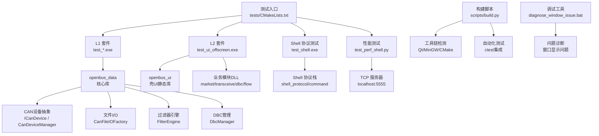

**图表来源**
- [tests/CMakeLists.txt:1-114](file://tests/CMakeLists.txt#L1-L114)
- [tests/test_runner.cpp:1-99](file://tests/test_runner.cpp#L1-L99)
- [tests/test_ui_offscreen.cpp:1-439](file://tests/test_ui_offscreen.cpp#L1-L439)
- [scripts/build.py:1-815](file://scripts/build.py#L1-L815)
- [scripts/diagnose_window_issue.bat:1-76](file://scripts/diagnose_window_issue.bat#L1-L76)

章节来源
- [tests/CMakeLists.txt:1-114](file://tests/CMakeLists.txt#L1-L114)
- [tests/test_runner.cpp:1-99](file://tests/test_runner.cpp#L1-L99)
- [tests/test_ui_offscreen.cpp:1-439](file://tests/test_ui_offscreen.cpp#L1-L439)

## 核心组件
- 模拟器（CanSimulator）：后台线程生成混合流量（标准ID/扩展ID/经典帧/CAN FD），通过无锁队列批量投递到主线程，发射 frameGenerated。
- 录制器（Recorder）：将 CanFrame 流式写入 BLF/ASC/CSV，支持暂停/恢复、统计帧数、事件回调。
- 播放器（Player）：从文件加载帧序列，按原始时间戳回放，支持播放/暂停/停止/seek/速度/循环。
- 设备管理器（CanDeviceManager）：统一封装内置模拟器与真实硬件（ZLG/PEAK/Kvaser/SLCAN/Candle），对外暴露一致信号接口。
- 设备抽象（ICanDevice）：厂商驱动统一接口，包含打开/关闭/发送/接收/滤波等能力。
- 文件 I/O（CanFileIOFactory）：多格式读写器工厂（BLF/ASC/CSV/PCAP/TRC），提供读取器创建与能力查询。
- 过滤引擎（FilterEngine）：表达式解析与求值，支持变量、比较、逻辑组合、语法糖与 data contains。
- DBC 管理（DbcManager）：加载 DBC、解析报文/信号、编码/解码、查找与索引。
- **Shell 协议栈（ShellMessage）**：OAI-02 二进制协议编解码，支持命令/响应/事件消息类型，CRC-16 校验。
- **命令注册表（CommandRegistry）**：支持通配符前缀匹配的命令路由系统，线程安全注册与执行。
- **性能测试客户端（PerfTestClient）**：TCP 客户端，测量 OAI-02 协议吞吐量和延迟指标。
- **无头UI测试框架（TestUiOffscreen）**：基于Qt Test的GUI测试框架，支持离屏模式下的界面验证。

章节来源
- [src/core/cansimulator.h:1-69](file://src/core/cansimulator.h#L1-L69)
- [src/core/recorder.h:1-52](file://src/core/recorder.h#L1-L52)
- [src/core/player.h:1-77](file://src/core/player.h#L1-L77)
- [src/core/candevicemanager.h:1-142](file://src/core/candevicemanager.h#L1-L142)
- [src/core/candevice.h:1-127](file://src/core/candevice.h#L1-L127)
- [src/core/shell/shell_protocol.h:1-78](file://src/core/shell/shell_protocol.h#L1-L78)
- [src/core/shell/shell_command.h:1-116](file://src/core/shell/shell_command.h#L1-L116)
- [tests/test_perf_shell.py:16-73](file://tests/test_perf_shell.py#L16-L73)
- [tests/test_ui_offscreen.cpp:74-439](file://tests/test_ui_offscreen.cpp#L74-L439)

## 架构总览
测试框架围绕"生产者-消费者"与"模块化 DLL"展开，**新增 Shell 协议测试层和无头UI测试层形成完整的四层验证体系**：
- 模拟器/播放器作为生产者，通过无锁队列与定时器批量消费，降低 UI 压力。
- 设备管理器桥接模拟器与真实硬件，屏蔽差异，统一信号模型。
- 录制器与播放器对接文件 I/O 层，形成"录-存-放"闭环。
- 过滤引擎与 DBC 管理为上层 UI 与分析提供语义能力。
- **Shell 协议层提供标准化的 TCP 通信接口，支持远程控制和性能测试**。
- **无头UI测试层提供完整的GUI功能验证，确保界面交互的正确性**。
- 测试套件按业务域拆分，独立进程运行，确保稳定性与可重复性。

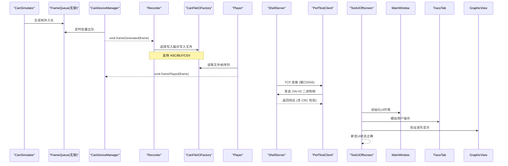

**图表来源**
- [src/core/cansimulator.h:1-69](file://src/core/cansimulator.h#L1-L69)
- [src/core/candevicemanager.h:1-142](file://src/core/candevicemanager.h#L1-L142)
- [src/core/recorder.h:1-52](file://src/core/recorder.h#L1-L52)
- [src/core/player.h:1-77](file://src/core/player.h#L1-L77)
- [tests/test_perf_shell.py:16-73](file://tests/test_perf_shell.py#L16-L73)
- [tests/test_ui_offscreen.cpp:100-142](file://tests/test_ui_offscreen.cpp#L100-L142)

## 详细组件分析

### 采集/录制/回放（B5）
- 模拟器生命周期与配置：start/stop 幂等、channel/interval 设置、运行态检测。
- 帧流合法性：ID 在预定义池、DLC↔数据长度一致、时间戳单调不减、通道固定。
- 流量构成：扩展帧与 CAN FD 帧按比例出现。
- 录制闭环：ASC 录制后由 reader 正确读回，逐帧比对 ID/扩展/DLC/数据。
- 暂停/恢复：暂停期间丢弃帧，恢复后继续计数与事件。
- 播放器元数据：totalFrames/totalTime/currentTime/speed 正确。
- 加速回放：framePlayed 有序、finished 触发、循环模式回绕。
- seek/pause/stop：定位、续播、停止后归位。

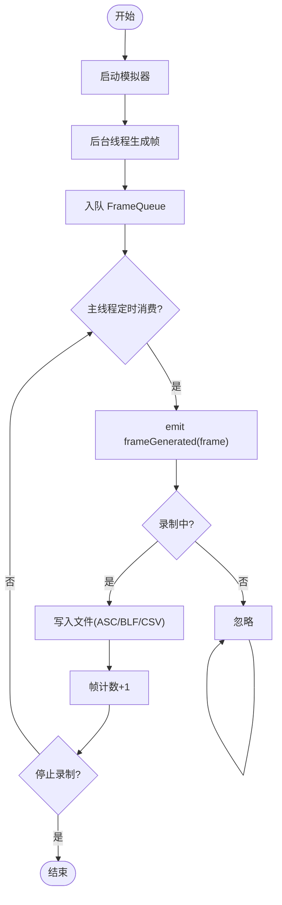

**图表来源**
- [src/core/cansimulator.h:1-69](file://src/core/cansimulator.h#L1-L69)
- [src/core/recorder.h:1-52](file://src/core/recorder.h#L1-L52)
- [tests/test_sim_rec_play.cpp:1-330](file://tests/test_sim_rec_play.cpp#L1-L330)

章节来源
- [tests/test_sim_rec_play.cpp:1-330](file://tests/test_sim_rec_play.cpp#L1-L330)

### 文件 I/O（B1）
- 格式推断：根据后缀识别 BLF/ASC/CSV/PCAP/TRC。
- 工厂能力：canRead/canWrite 校验。
- 小样本读取：info.blf/info.asc 读出帧数>0，字段自洽。
- 大样本计时：CD701 大 BLF 加载耗时记录与宽松上限。
- 异常容错：截断 BLF 不崩溃，readAll 返回确定值。
- 不存在文件：友好失败。
- 导出-重导入闭环：ASC/CSV/BLF 写→读→逐帧精确比对。

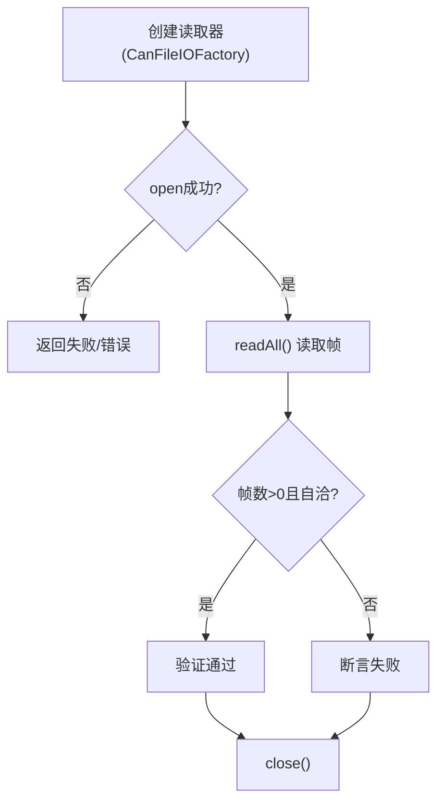

**图表来源**
- [tests/test_canfileio.cpp:1-200](file://tests/test_canfileio.cpp#L1-L200)

章节来源
- [tests/test_canfileio.cpp:1-200](file://tests/test_canfileio.cpp#L1-L200)

### 过滤引擎（B2）
- 表达式编译与求值：id==0x123、dlc>4、!rx、not(...) or (...)、fd && dlc>8。
- 变量全集：id/dlc/ch/time/fd/ext/rx/tx/std/error。
- 语法糖：裸十六进制、id in 列表。
- data contains：字节序列匹配，含与其他条件组合。
- 非法表达式：isValid=false 且 errorString 非空，evaluate 保持透传。

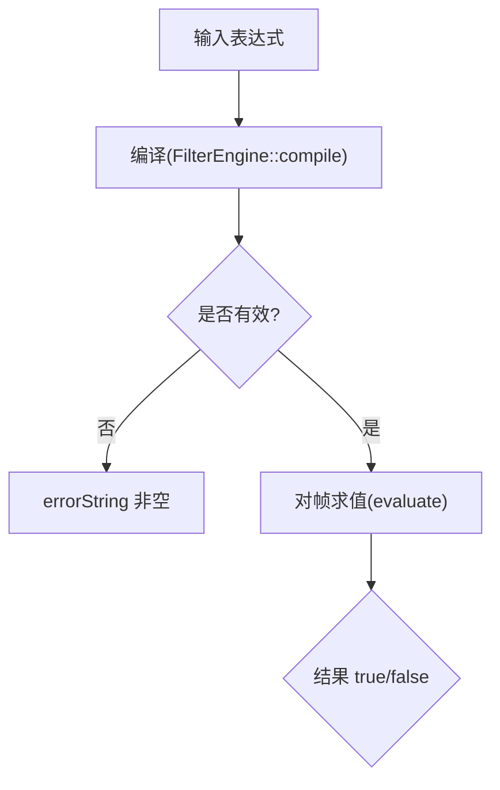

**图表来源**
- [tests/test_filterengine.cpp:1-200](file://tests/test_filterengine.cpp#L1-L200)

章节来源
- [tests/test_filterengine.cpp:1-200](file://tests/test_filterengine.cpp#L1-L200)

### DBC 解析与解码（B4）
- 真实 DBC 加载：V5.4.0 样本，报文/信号结构自洽。
- 自构造 DBC：已知 factor/offset/单位/字节序/值表，精确断言。
- 解码：decodeFrame/decodeSignal 物理值与描述符。
- 编码-解码闭环：encode 物理值 → decode 读回一致。
- 卸载：unload 后 findMessage 失效。
- 异常容错：乱码 DBC 不崩溃，返回失败。

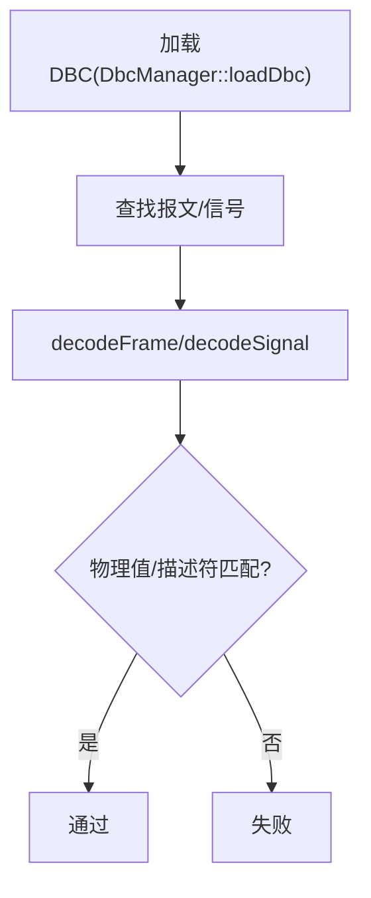

**图表来源**
- [tests/test_dbc.cpp:1-200](file://tests/test_dbc.cpp#L1-L200)

章节来源
- [tests/test_dbc.cpp:1-200](file://tests/test_dbc.cpp#L1-L200)

### Shell 协议测试（新增）
- **二进制协议编解码**：Magic bytes (0x5F4F)、版本控制、CRC-16 校验、消息序列化/反序列化。
- **消息类型检测**：Command（客户端→服务器）、Response（服务器→客户端）、Event（推送事件）。
- **命令注册表**：支持通配符前缀匹配（trace.*、dbc.*、system.*），精确匹配优先。
- **执行器功能**：JSON 解析、命令路由、错误处理、异常容错。
- **端到端测试**：完整请求-响应周期验证，包含错误场景处理。

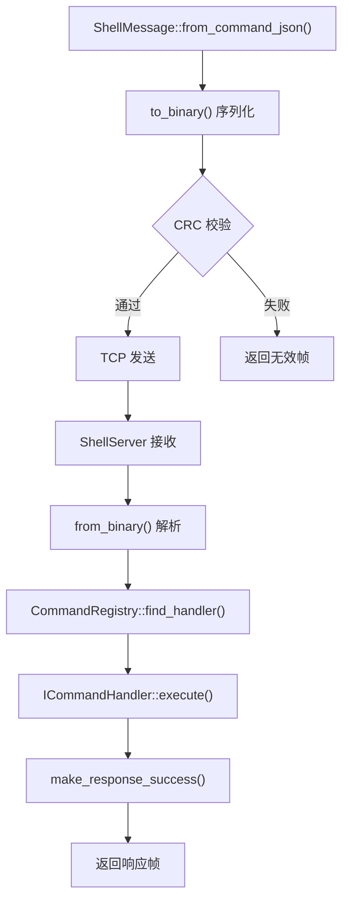

**图表来源**
- [tests/test_shell.cpp:11-56](file://tests/test_shell.cpp#L11-L56)
- [src/core/shell/shell_protocol.h:34-70](file://src/core/shell/shell_protocol.h#L34-L70)
- [src/core/shell/shell_command.h:71-111](file://src/core/shell/shell_command.h#L71-L111)

章节来源
- [tests/test_shell.cpp:1-156](file://tests/test_shell.cpp#L1-L156)
- [src/core/shell/shell_protocol.h:1-78](file://src/core/shell/shell_protocol.h#L1-L78)
- [src/core/shell/shell_command.h:1-116](file://src/core/shell/shell_command.h#L1-L116)

### 性能基准测试（新增）
- **吞吐量测试**：高并发请求测试，测量 QPS（每秒查询数）和延迟分布。
- **延迟统计**：最小/最大/平均/P99 延迟，中位数计算。
- **协议兼容性**：Python 客户端与 C++ 服务器的 OAI-02 协议互操作。
- **网络性能**：本地回环网络下的协议开销评估。
- **资源监控**：内存使用、CPU 占用、连接池管理。

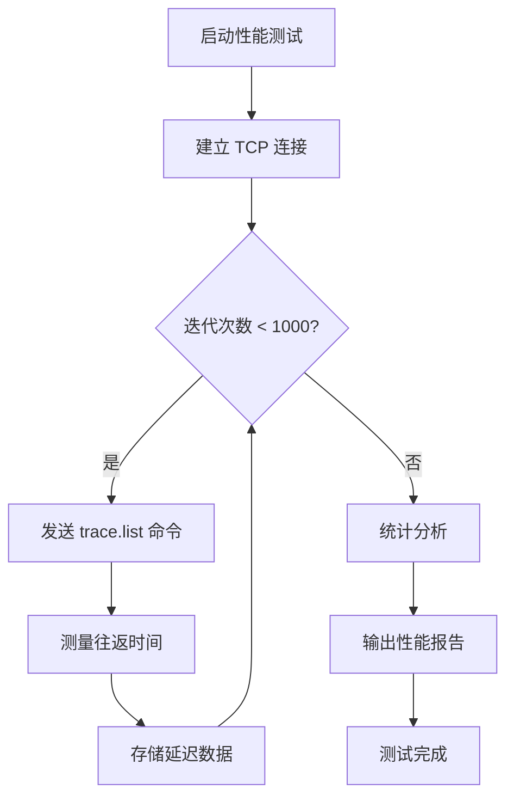

**图表来源**
- [tests/test_perf_shell.py:75-118](file://tests/test_perf_shell.py#L75-L118)

章节来源
- [tests/test_perf_shell.py:1-139](file://tests/test_perf_shell.py#L1-L139)

### 无头UI测试框架（全新）
- **离屏模式支持**：通过 QT_QPA_PLATFORM=offscreen 环境变量实现无GUI环境测试。
- **窗口结构验证**：检查 MainWindow、QDockWidget、菜单栏、状态栏等核心UI组件。
- **默认实例验证**：确保 TraceTab 和 GraphicView 等关键组件正确初始化。
- **帧流驱动测试**：验证 onMeasurementToggled 和 onFrameReceived 信号正确处理。
- **清理列表功能**：测试 FilterBar::clearListRequested 信号与 TraceTab::clearTrace 的联动。
- **主题切换验证**：确保 Dark/Light 主题切换不影响UI稳定性。
- **图形回放测试**：验证 GraphicView 的信号添加、波形显示和回放功能。

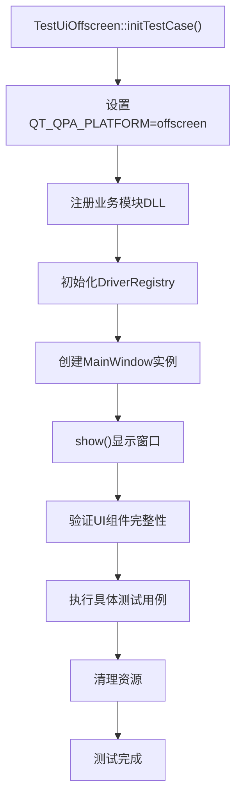

**图表来源**
- [tests/test_ui_offscreen.cpp:100-142](file://tests/test_ui_offscreen.cpp#L100-L142)
- [tests/test_ui_offscreen.cpp:171-184](file://tests/test_ui_offscreen.cpp#L171-L184)

章节来源
- [tests/test_ui_offscreen.cpp:1-439](file://tests/test_ui_offscreen.cpp#L1-L439)

### 综合测试运行器（新增）
- **阶段化测试**：Phase B1-B7 数据层测试 + Phase C UI 测试，分阶段执行和报告。
- **统一入口**：单一程序执行所有测试套件，简化测试流程。
- **错误汇总**：统计失败用例数量，提供清晰的测试结果。
- **环境初始化**：自动设置测试数据目录，处理路径问题。
- **进度显示**：实时显示测试执行进度和状态。

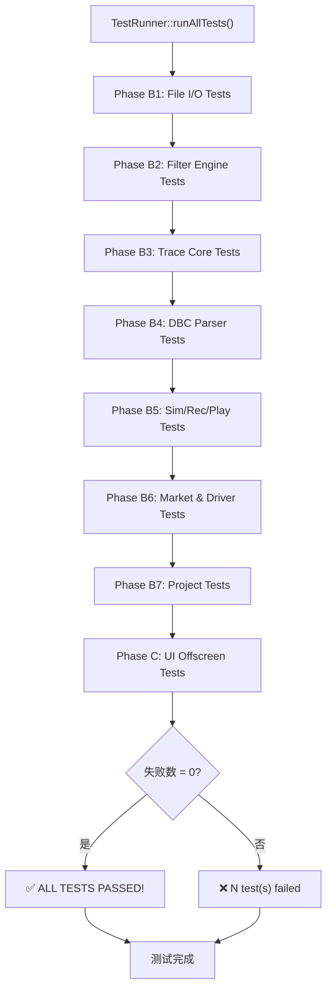

**图表来源**
- [tests/test_runner.cpp:24-67](file://tests/test_runner.cpp#L24-L67)

章节来源
- [tests/test_runner.cpp:1-99](file://tests/test_runner.cpp#L1-L99)

### 设备抽象与管理
- ICanDevice：统一品牌标识、枚举、打开/关闭、发送/接收、厂商扩展、硬件滤波。
- CanDeviceManager：桥接模拟器与真实设备，统一信号模型，后台接收线程 + 主线程批量消费。

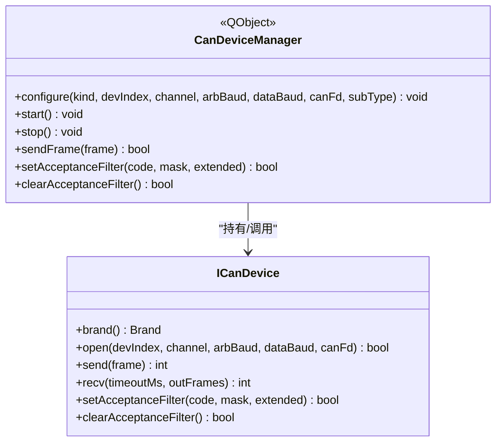

**图表来源**
- [src/core/candevice.h:1-127](file://src/core/candevice.h#L1-L127)
- [src/core/candevicemanager.h:1-142](file://src/core/candevicemanager.h#L1-L142)

章节来源
- [src/core/candevice.h:1-127](file://src/core/candevice.h#L1-L127)
- [src/core/candevicemanager.h:1-142](file://src/core/candevicemanager.h#L1-L142)

## 依赖关系分析
- 测试构建依赖：
  - L1 套件链接 openbus_data（核心库）与 Qt6::Test。
  - L2 offscreen 套件链接 openbus_ui 及四个业务模块 DLL，并复制 Qt6::Test 与 qoffscreen 平台插件。
  - **Shell 协议测试链接 shell 协议栈和 Catch2 测试框架**。
  - **性能测试使用 Python 标准库 socket、struct、json 模块**。
- 运行时依赖：
  - 主程序 main.cpp 注册业务模块并通过 ModuleRegistry 动态加载。
  - 测试套件复用相同初始化链，确保行为一致。
  - **Shell 服务器需要监听指定端口（默认 5555）**。
  - **无头UI测试需要Qt offscreen平台插件支持**。

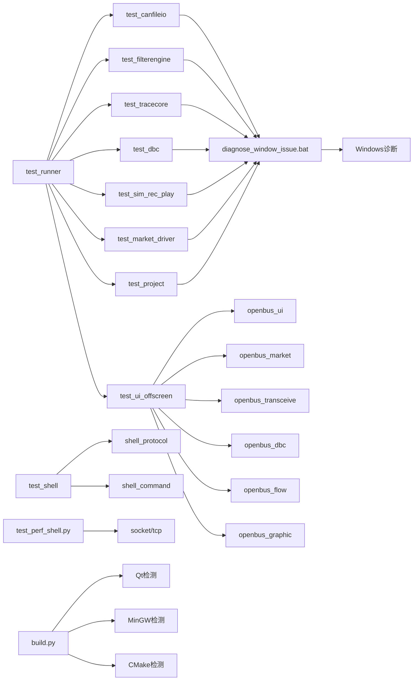

**图表来源**
- [tests/CMakeLists.txt:1-114](file://tests/CMakeLists.txt#L1-L114)
- [tests/test_runner.cpp:13-20](file://tests/test_runner.cpp#L13-L20)
- [tests/test_perf_shell.py:9-13](file://tests/test_perf_shell.py#L9-L13)
- [scripts/build.py:104-176](file://scripts/build.py#L104-L176)
- [scripts/diagnose_window_issue.bat:1-76](file://scripts/diagnose_window_issue.bat#L1-L76)

章节来源
- [tests/CMakeLists.txt:1-114](file://tests/CMakeLists.txt#L1-L114)
- [src/main.cpp:1-73](file://src/main.cpp#L1-L73)

## 性能考量
- 模拟器与设备管理器采用"后台线程 + 无锁队列 + 主线程定时器批量消费"，在高负载下减少 UI 阻塞与上下文切换开销。
- 播放器按原始时间戳回放，结合 speed/loop/seek 控制，保证时序准确与用户体验。
- 文件 I/O 测试包含大样本计时用例，用于回归监控加载性能。
- 过滤引擎表达式编译一次、多次求值，适合高频筛选场景。
- **Shell 协议测试提供性能基准，支持 P99 延迟、QPS 等关键指标监控**。
- **TCP 通信优化：二进制协议减少序列化开销，CRC 校验保证数据完整性**。
- **性能测试脚本支持自定义迭代次数和网络参数，便于不同环境下的基准测试**。
- **无头UI测试通过离屏模式避免GUI渲染开销，提高测试执行效率**。

[本节为通用性能讨论，不直接分析具体文件]

## 故障排查指南
- 模拟器未产生帧：检查 start/stop 状态、channel/interval 配置、队列积压情况。
- 录制失败：确认路径存在、扩展名受支持、writer 创建成功；暂停期间不会计数。
- 播放器异常：确认 load/loadFrames 成功、speed 合法、seek 越界钳制。
- 文件 I/O 错误：检查文件格式推断、reader 创建、open/readAll/close 流程；异常文件应不崩溃。
- 过滤表达式无效：查看 isValid 与 errorString，修正语法或变量。
- DBC 解析失败：检查 DBC 文本合法性、信号定义完整性；乱码应返回失败且不崩溃。
- **Shell 协议测试失败**：确认服务器已启动、端口可用、协议版本兼容、CRC 校验通过。
- **性能测试连接失败**：检查防火墙设置、端口占用、服务器进程状态。
- **综合测试运行器错误**：确认测试数据目录存在、各子测试可独立运行、依赖库完整。
- **无头UI测试失败**：检查 QT_QPA_PLATFORM 环境变量设置、Qt offscreen 插件是否正确部署。
- **窗口显示问题**：使用 diagnose_window_issue.bat 脚本进行深度诊断，检查进程状态和Qt插件加载情况。

章节来源
- [tests/test_sim_rec_play.cpp:1-330](file://tests/test_sim_rec_play.cpp#L1-L330)
- [tests/test_canfileio.cpp:1-200](file://tests/test_canfileio.cpp#L1-L200)
- [tests/test_filterengine.cpp:1-200](file://tests/test_filterengine.cpp#L1-L200)
- [tests/test_dbc.cpp:1-200](file://tests/test_dbc.cpp#L1-L200)
- [tests/test_shell.cpp:122-134](file://tests/test_shell.cpp#L122-L134)
- [tests/test_perf_shell.py:121-139](file://tests/test_perf_shell.py#L121-L139)
- [tests/test_ui_offscreen.cpp:100-142](file://tests/test_ui_offscreen.cpp#L100-L142)
- [scripts/diagnose_window_issue.bat:1-76](file://scripts/diagnose_window_issue.bat#L1-L76)

## 结论
该自动化测试框架以清晰的层次划分与严格的闭环断言，覆盖了 CAN/CAN FD 工具的核心能力。**最新版本通过新增 Shell 协议测试、无头UI测试、性能基准测试和综合测试运行器，形成了完整的四层验证体系**：
- **L1 核心逻辑集成测试**：覆盖文件 I/O、过滤引擎、DBC 解析、采集录制回放等基础功能。
- **L2 UI 驱动测试**：无头 UI 验证界面交互和面板联动，确保GUI功能正确性。
- **L3 Shell 协议测试**：二进制协议编解码、命令路由、性能基准测试。
- **L4 综合测试运行器**：统一执行所有测试套件，提供阶段化报告和错误汇总。

通过进程隔离、无头 UI 驱动、模块化 DLL 设计、智能工具链检测和多语言测试支持，确保了测试的可维护性与可扩展性。**新增的调试工具和构建验证流程进一步提升了开发效率和问题诊断能力**。未来可在以下方面持续增强：
- 增加更多边界与异常用例（网络/并发/资源耗尽）。
- 引入性能基准与回归阈值。
- 扩展 UI 自动化脚本（录制/回放交互）。
- 完善报告与可视化（HTML/CSV 输出）。
- **增加分布式测试支持，支持多节点性能测试**。
- **实现测试覆盖率统计和代码质量分析**。
- **增强CI/CD集成，支持自动化测试流水线**。

[本节为总结性内容，不直接分析具体文件]

## 附录
- 构建与运行测试：
  - 使用 CMake 启用测试：enable_testing() 与 add_test。
  - 聚合目标 tests 仅构建测试套件，避免主程序重链。
  - Windows 下自动复制 Qt6::Test 与 qoffscreen 平台插件。
  - **综合测试运行器：`build/bin/test_runner.exe` 执行所有测试套件**。
  - **自动化测试脚本：`python scripts/build.py test` 执行完整测试流程**。
  - **PowerShell测试脚本：`.\scripts\run-tests.ps1` 生成详细测试报告**。
- 测试数据：
  - 通过 SIN_SOURCE_DIR 宏定位 test/resources 下的样本文件。
  - **Shell 协议测试数据：OAI-02 协议规范、示例消息、性能基准数据**。
- 参考文档：
  - README 中的功能特性与对标分析，帮助理解测试覆盖的业务价值。
  - **SHELL-TEST-Report-20260824.md：Shell 协议测试详细报告和验收标准**。
  - **测试验收方案.md：完整的测试策略和执行计划**。
- 调试工具：
  - **窗口问题诊断：`scripts/diagnose_window_issue.bat` 深度诊断窗口显示问题**。
  - **快速测试：`scripts/quick_test.bat` 快速验证程序运行状态**。
  - **构建脚本：`scripts/build.py` 智能工具链检测和自动化构建**。

章节来源
- [tests/CMakeLists.txt:1-114](file://tests/CMakeLists.txt#L1-L114)
- [CMakeLists.txt:83-86](file://CMakeLists.txt#L83-L86)
- [README.md:32-111](file://README.md#L32-L111)
- [tests/SHELL-TEST-Report-20260824.md:1-325](file://tests/SHELL-TEST-Report-20260824.md#L1-L325)
- [doc/05-TESTING/测试验收方案.md:1-449](file://doc/05-TESTING/测试验收方案.md#L1-L449)
- [scripts/build.py:628-678](file://scripts/build.py#L628-L678)
- [scripts/run-tests.ps1:1-252](file://scripts/run-tests.ps1#L1-L252)
- [scripts/diagnose_window_issue.bat:1-76](file://scripts/diagnose_window_issue.bat#L1-L76)