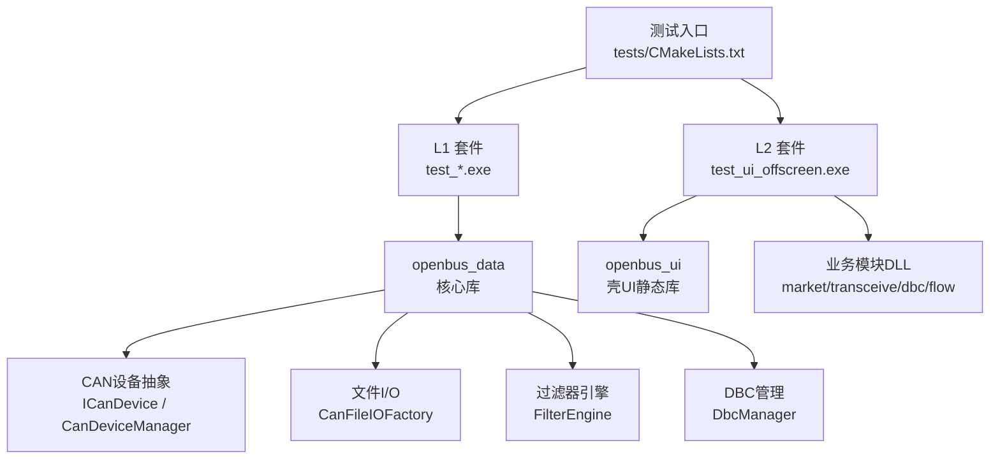
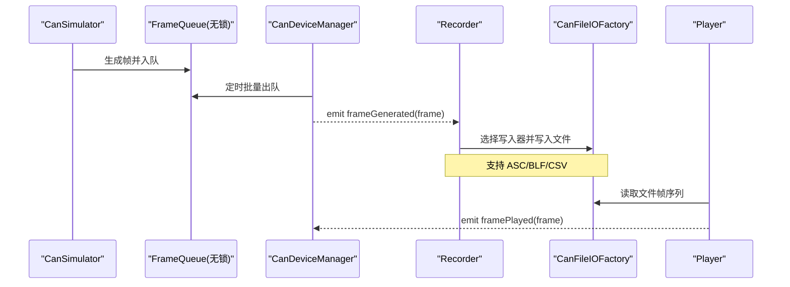
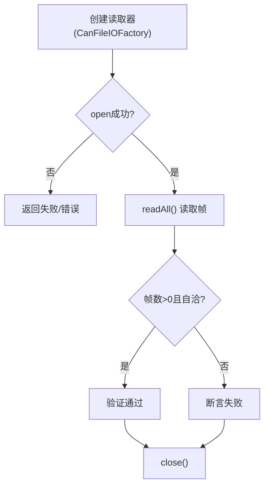
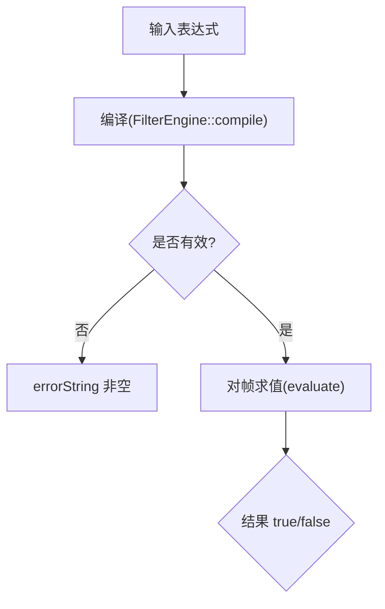
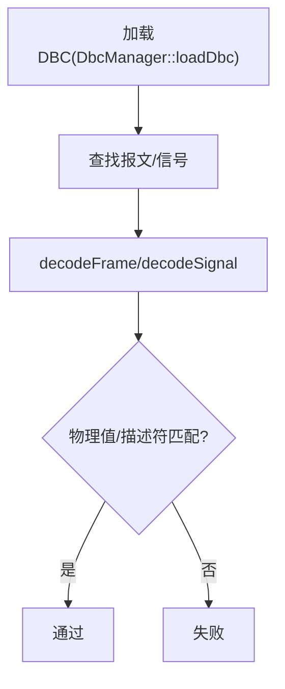
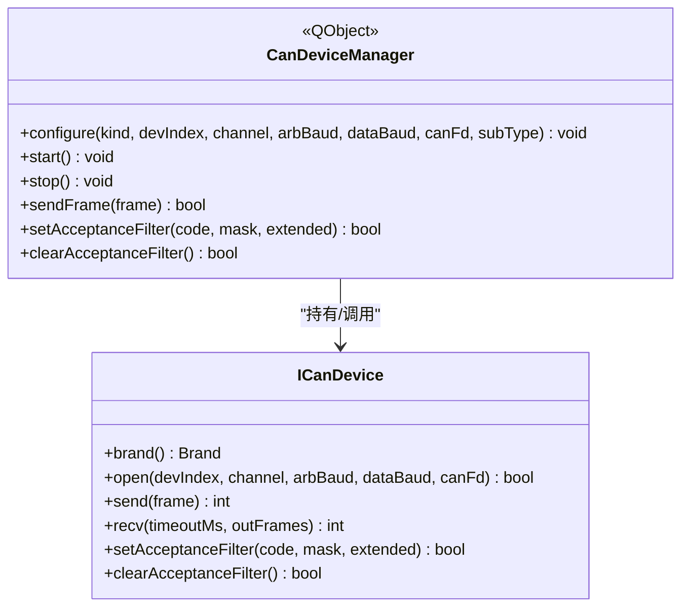
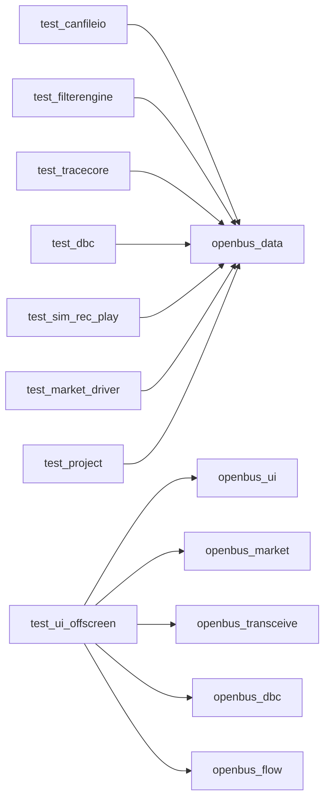

# 自动化测试框架

<cite>
**本文引用的文件**
- [README.md](file://README.md)
- [CMakeLists.txt](file://CMakeLists.txt)
- [src/main.cpp](file://src/main.cpp)
- [src/core/candevicemanager.h](file://src/core/candevicemanager.h)
- [src/core/candevice.h](file://src/core/candevice.h)
- [src/core/cansimulator.h](file://src/core/cansimulator.h)
- [src/core/recorder.h](file://src/core/recorder.h)
- [src/core/player.h](file://src/core/player.h)
- [tests/CMakeLists.txt](file://tests/CMakeLists.txt)
- [tests/test_sim_rec_play.cpp](file://tests/test_sim_rec_play.cpp)
- [tests/test_canfileio.cpp](file://tests/test_canfileio.cpp)
- [tests/test_dbc.cpp](file://tests/test_dbc.cpp)
- [tests/test_filterengine.cpp](file://tests/test_filterengine.cpp)
</cite>

## 目录
1. [简介](#简介)
2. [项目结构](#项目结构)
3. [核心组件](#核心组件)
4. [架构总览](#架构总览)
5. [详细组件分析](#详细组件分析)
6. [依赖关系分析](#依赖关系分析)
7. [性能考量](#性能考量)
8. [故障排查指南](#故障排查指南)
9. [结论](#结论)
10. [附录](#附录)

## 简介
本仓库是一个面向 CAN/CAN FD 报文录制、回放、解析与分析的桌面工具，同时提供完整的自动化测试框架。测试框架基于 Qt Test，按业务域划分为多个独立可执行测试套件，覆盖文件 I/O、过滤引擎、Trace 模型、DBC 解析、采集/录制/回放、市场驱动与工程配置等关键能力；并提供无头 UI 驱动（offscreen）以进行界面级验证。整体设计强调：
- 进程隔离：每个测试套件为独立进程，避免共享单例状态污染。
- 分层验证：L1 核心逻辑集成测试 + L2 offscreen UI 驱动。
- 闭环断言：通过“写→读”或“编码→解码”等闭环保证数据一致性。
- 可扩展：新增测试套件只需遵循 CMake 函数约定并加入聚合目标。

## 项目结构
测试相关的关键位置与职责如下：
- tests/CMakeLists.txt：定义测试构建流程、聚合目标、Qt Test 插件部署与 offscreen 环境设置。
- tests/*.cpp：各业务域测试套件，使用 QTEST_GUILESS_MAIN 运行于无 GUI 环境。
- src/core/*：被测核心模块（模拟器、录制器、播放器、设备抽象、文件 I/O、过滤引擎、DBC 管理等）。
- test/resources/*：测试样本数据（如 DBC、BLF、ASC 等）。

图表来源
- [tests/CMakeLists.txt:1-108](file://tests/CMakeLists.txt#L1-L108)
- [CMakeLists.txt:78-86](file://CMakeLists.txt#L78-L86)

章节来源
- [tests/CMakeLists.txt:1-108](file://tests/CMakeLists.txt#L1-L108)
- [CMakeLists.txt:78-86](file://CMakeLists.txt#L78-L86)

## 核心组件
- 模拟器（CanSimulator）：后台线程生成混合流量（标准ID/扩展ID/经典帧/CAN FD），通过无锁队列批量投递到主线程，发射 frameGenerated。
- 录制器（Recorder）：将 CanFrame 流式写入 BLF/ASC/CSV，支持暂停/恢复、统计帧数、事件回调。
- 播放器（Player）：从文件加载帧序列，按原始时间戳回放，支持播放/暂停/停止/seek/速度/循环。
- 设备管理器（CanDeviceManager）：统一封装内置模拟器与真实硬件（ZLG/PEAK/Kvaser/SLCAN/Candle），对外暴露一致信号接口。
- 设备抽象（ICanDevice）：厂商驱动统一接口，包含打开/关闭/发送/接收/滤波等能力。
- 文件 I/O（CanFileIOFactory）：多格式读写器工厂（BLF/ASC/CSV/PCAP/TRC），提供读取器创建与能力查询。
- 过滤引擎（FilterEngine）：表达式解析与求值，支持变量、比较、逻辑组合、语法糖与 data contains。
- DBC 管理（DbcManager）：加载 DBC、解析报文/信号、编码/解码、查找与索引。

章节来源
- [src/core/cansimulator.h:1-69](file://src/core/cansimulator.h#L1-L69)
- [src/core/recorder.h:1-52](file://src/core/recorder.h#L1-L52)
- [src/core/player.h:1-77](file://src/core/player.h#L1-L77)
- [src/core/candevicemanager.h:1-142](file://src/core/candevicemanager.h#L1-L142)
- [src/core/candevice.h:1-127](file://src/core/candevice.h#L1-L127)
- [tests/test_canfileio.cpp:1-200](file://tests/test_canfileio.cpp#L1-L200)
- [tests/test_filterengine.cpp:1-200](file://tests/test_filterengine.cpp#L1-L200)
- [tests/test_dbc.cpp:1-200](file://tests/test_dbc.cpp#L1-L200)

## 架构总览
测试框架围绕“生产者-消费者”与“模块化 DLL”展开：
- 模拟器/播放器作为生产者，通过无锁队列与定时器批量消费，降低 UI 压力。
- 设备管理器桥接模拟器与真实硬件，屏蔽差异，统一信号模型。
- 录制器与播放器对接文件 I/O 层，形成“录-存-放”闭环。
- 过滤引擎与 DBC 管理为上层 UI 与分析提供语义能力。
- 测试套件按业务域拆分，独立进程运行，确保稳定性与可重复性。

图表来源
- [src/core/cansimulator.h:1-69](file://src/core/cansimulator.h#L1-L69)
- [src/core/candevicemanager.h:1-142](file://src/core/candevicemanager.h#L1-L142)
- [src/core/recorder.h:1-52](file://src/core/recorder.h#L1-L52)
- [src/core/player.h:1-77](file://src/core/player.h#L1-L77)
- [tests/test_canfileio.cpp:1-200](file://tests/test_canfileio.cpp#L1-L200)

## 详细组件分析

### 采集/录制/回放（B5）
- 模拟器生命周期与配置：start/stop 幂等、channel/interval 设置、运行态检测。
- 帧流合法性：ID 在预定义池、DLC↔数据长度一致、时间戳单调不减、通道固定。
- 流量构成：扩展帧与 CAN FD 帧按比例出现。
- 录制闭环：ASC 录制后由 reader 正确读回，逐帧比对 ID/扩展/DLC/数据。
- 暂停/恢复：暂停期间丢弃帧，恢复后继续计数与事件。
- 播放器元数据：totalFrames/totalTime/currentTime/speed 正确。
- 加速回放：framePlayed 有序、finished 触发、循环模式回绕。
- seek/pause/stop：定位、续播、停止后归位。

图表来源
- [src/core/cansimulator.h:1-69](file://src/core/cansimulator.h#L1-L69)
- [src/core/recorder.h:1-52](file://src/core/recorder.h#L1-L52)
- [tests/test_sim_rec_play.cpp:1-330](file://tests/test_sim_rec_play.cpp#L1-L330)

章节来源
- [tests/test_sim_rec_play.cpp:1-330](file://tests/test_sim_rec_play.cpp#L1-L330)

### 文件 I/O（B1）
- 格式推断：根据后缀识别 BLF/ASC/CSV/PCAP/TRC。
- 工厂能力：canRead/canWrite 校验。
- 小样本读取：info.blf/info.asc 读出帧数>0，字段自洽。
- 大样本计时：CD701 大 BLF 加载耗时记录与宽松上限。
- 异常容错：截断 BLF 不崩溃，readAll 返回确定值。
- 不存在文件：友好失败。
- 导出-重导入闭环：ASC/CSV/BLF 写→读→逐帧精确比对。

图表来源
- [tests/test_canfileio.cpp:1-200](file://tests/test_canfileio.cpp#L1-L200)

章节来源
- [tests/test_canfileio.cpp:1-200](file://tests/test_canfileio.cpp#L1-L200)

### 过滤引擎（B2）
- 表达式编译与求值：id==0x123、dlc>4、!rx、not(...) or (...)、fd && dlc>8。
- 变量全集：id/dlc/ch/time/fd/ext/rx/tx/std/error。
- 语法糖：裸十六进制、id in 列表。
- data contains：字节序列匹配，含与其他条件组合。
- 非法表达式：isValid=false 且 errorString 非空，evaluate 保持透传。

图表来源
- [tests/test_filterengine.cpp:1-200](file://tests/test_filterengine.cpp#L1-L200)

章节来源
- [tests/test_filterengine.cpp:1-200](file://tests/test_filterengine.cpp#L1-L200)

### DBC 解析与解码（B4）
- 真实 DBC 加载：V5.4.0 样本，报文/信号结构自洽。
- 自构造 DBC：已知 factor/offset/单位/字节序/值表，精确断言。
- 解码：decodeFrame/decodeSignal 物理值与描述符。
- 编码-解码闭环：encode 物理值 → decode 读回一致。
- 卸载：unload 后 findMessage 失效。
- 异常容错：乱码 DBC 不崩溃，返回失败。

图表来源
- [tests/test_dbc.cpp:1-200](file://tests/test_dbc.cpp#L1-L200)

章节来源
- [tests/test_dbc.cpp:1-200](file://tests/test_dbc.cpp#L1-L200)

### 设备抽象与管理
- ICanDevice：统一品牌标识、枚举、打开/关闭、发送/接收、厂商扩展、硬件滤波。
- CanDeviceManager：桥接模拟器与真实设备，统一信号模型，后台接收线程 + 主线程批量消费。

图表来源
- [src/core/candevice.h:1-127](file://src/core/candevice.h#L1-L127)
- [src/core/candevicemanager.h:1-142](file://src/core/candevicemanager.h#L1-L142)

章节来源
- [src/core/candevice.h:1-127](file://src/core/candevice.h#L1-L127)
- [src/core/candevicemanager.h:1-142](file://src/core/candevicemanager.h#L1-L142)

## 依赖关系分析
- 测试构建依赖：
  - L1 套件链接 openbus_data（核心库）与 Qt6::Test。
  - L2 offscreen 套件链接 openbus_ui 及四个业务模块 DLL，并复制 Qt6::Test 与 qoffscreen 平台插件。
- 运行时依赖：
  - 主程序 main.cpp 注册业务模块并通过 ModuleRegistry 动态加载。
  - 测试套件复用相同初始化链，确保行为一致。

图表来源
- [tests/CMakeLists.txt:1-108](file://tests/CMakeLists.txt#L1-L108)
- [src/main.cpp:1-73](file://src/main.cpp#L1-L73)

章节来源
- [tests/CMakeLists.txt:1-108](file://tests/CMakeLists.txt#L1-L108)
- [src/main.cpp:1-73](file://src/main.cpp#L1-L73)

## 性能考量
- 模拟器与设备管理器采用“后台线程 + 无锁队列 + 主线程定时器批量消费”，在高负载下减少 UI 阻塞与上下文切换开销。
- 播放器按原始时间戳回放，结合 speed/loop/seek 控制，保证时序准确与用户体验。
- 文件 I/O 测试包含大样本计时用例，用于回归监控加载性能。
- 过滤引擎表达式编译一次、多次求值，适合高频筛选场景。

[本节为通用性能讨论，不直接分析具体文件]

## 故障排查指南
- 模拟器未产生帧：检查 start/stop 状态、channel/interval 配置、队列积压情况。
- 录制失败：确认路径存在、扩展名受支持、writer 创建成功；暂停期间不会计数。
- 播放器异常：确认 load/loadFrames 成功、speed 合法、seek 越界钳制。
- 文件 I/O 错误：检查文件格式推断、reader 创建、open/readAll/close 流程；异常文件应不崩溃。
- 过滤表达式无效：查看 isValid 与 errorString，修正语法或变量。
- DBC 解析失败：检查 DBC 文本合法性、信号定义完整性；乱码应返回失败且不崩溃。

章节来源
- [tests/test_sim_rec_play.cpp:1-330](file://tests/test_sim_rec_play.cpp#L1-L330)
- [tests/test_canfileio.cpp:1-200](file://tests/test_canfileio.cpp#L1-L200)
- [tests/test_filterengine.cpp:1-200](file://tests/test_filterengine.cpp#L1-L200)
- [tests/test_dbc.cpp:1-200](file://tests/test_dbc.cpp#L1-L200)

## 结论
该自动化测试框架以清晰的层次划分与严格的闭环断言，覆盖了 CAN/CAN FD 工具的核心能力。通过进程隔离、无头 UI 驱动与模块化 DLL 设计，确保了测试的可维护性与可扩展性。未来可在以下方面持续增强：
- 增加更多边界与异常用例（网络/并发/资源耗尽）。
- 引入性能基准与回归阈值。
- 扩展 UI 自动化脚本（录制/回放交互）。
- 完善报告与可视化（HTML/CSV 输出）。

[本节为总结性内容，不直接分析具体文件]

## 附录
- 构建与运行测试：
  - 使用 CMake 启用测试：enable_testing() 与 add_test。
  - 聚合目标 tests 仅构建测试套件，避免主程序重链。
  - Windows 下自动复制 Qt6::Test 与 qoffscreen 平台插件。
- 测试数据：
  - 通过 SIN_SOURCE_DIR 宏定位 test/resources 下的样本文件。
- 参考文档：
  - README 中的功能特性与对标分析，帮助理解测试覆盖的业务价值。

章节来源
- [tests/CMakeLists.txt:1-108](file://tests/CMakeLists.txt#L1-L108)
- [CMakeLists.txt:83-86](file://CMakeLists.txt#L83-L86)
- [README.md:32-111](file://README.md#L32-L111)