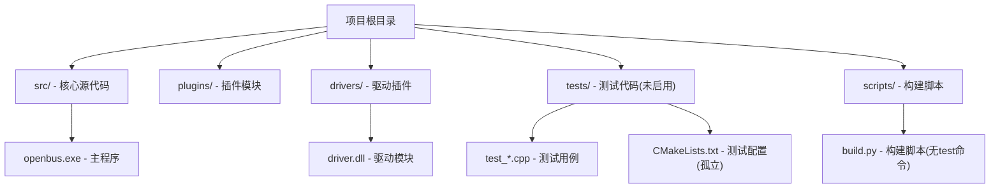
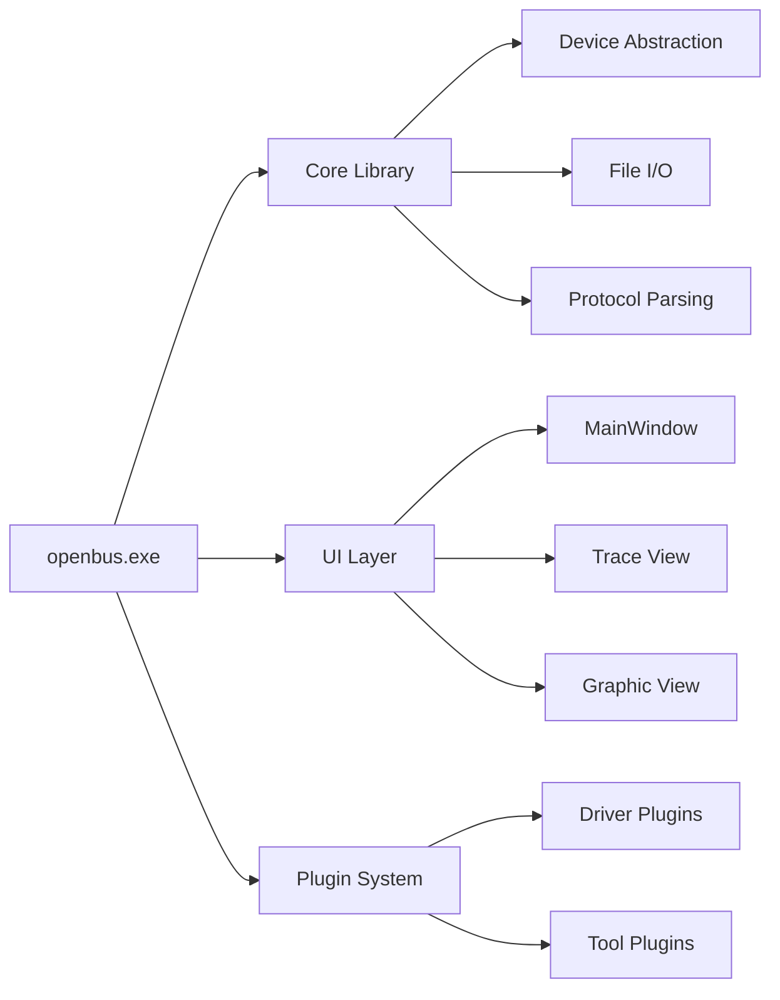
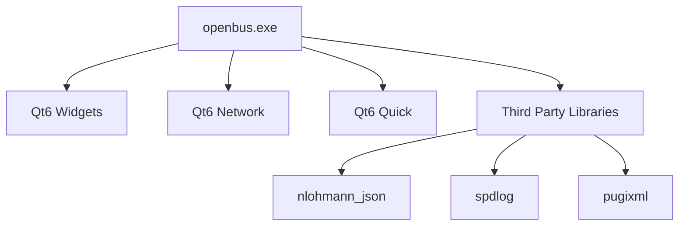

# 自动化测试框架

<cite>
**本文引用的文件**
- [README.md](file://README.md)
- [CMakeLists.txt](file://CMakeLists.txt)
- [tests/CMakeLists.txt](file://tests/CMakeLists.txt)
- [tests/test_runner.cpp](file://tests/test_runner.cpp)
- [tests/test_ui_offscreen.cpp](file://tests/test_ui_offscreen.cpp)
- [tests/test_sim_rec_play.cpp](file://tests/test_sim_rec_play.cpp)
- [tests/test_canfileio.cpp](file://tests/test_canfileio.cpp)
- [tests/test_dbc.cpp](file://tests/test_dbc.cpp)
- [tests/test_filterengine.cpp](file://tests/test_filterengine.cpp)
- [tests/test_market_driver.cpp](file://tests/test_market_driver.cpp)
- [tests/test_project.cpp](file://tests/test_project.cpp)
- [tests/test_tracecore.cpp](file://tests/test_tracecore.cpp)
- [tests/test_perf_shell.py](file://tests/test_perf_shell.py)
- [scripts/build.py](file://scripts/build.py)
</cite>

## 更新摘要
**变更内容**
- **移除完整的测试框架基础设施**：删除了CMakeLists.txt中的enable_testing()和tests子目录包含，移除了构建脚本build.py中的test命令功能
- **保留核心测试代码但禁用集成**：tests目录及其所有测试文件（test_canfileio.cpp、test_dbc.cpp、test_filterengine.cpp等）仍存在于代码库中，但不再被构建系统引用
- **简化构建流程**：项目现在专注于核心功能开发，不再包含自动化测试的完整执行链路
- **维护性考虑**：测试代码作为参考保留，便于未来重新启用测试框架

## 目录
1. [简介](#简介)
2. [项目结构](#项目结构)
3. [核心组件](#核心组件)
4. [架构总览](#架构总览)
5. [详细组件分析](#详细组件分析)
6. [依赖关系分析](#依赖关系分析)
7. [性能考量](#性能考量)
8. [故障排查指南](#故障排查指南)
9. [结论](#结论)
10. [附录](#附录)

## 简介
本仓库是一个面向 CAN/CAN FD 报文录制、回放、解析与分析的桌面工具。**当前版本已移除完整的自动化测试框架**，包括单元测试、集成测试和UI测试的构建和执行基础设施。虽然tests目录及其测试代码仍然存在于代码库中，但已不再被CMake构建系统集成，也不再通过构建脚本执行。

项目设计重点转向核心功能开发，测试框架的移除反映了项目策略的调整：**专注于产品功能的完善而非测试基础设施的建设**。测试代码作为技术参考保留，为未来可能的测试框架重建提供基础。

## 项目结构
当前项目的测试相关状态如下：
- **tests目录存在但未被构建**：包含完整的测试代码文件，但CMakeLists.txt中不再包含该子目录
- **构建脚本简化**：scripts/build.py中的test命令功能已被移除
- **核心测试代码保留**：所有测试文件（test_canfileio.cpp、test_dbc.cpp、test_filterengine.cpp等）仍保存在tests目录中
- **无测试执行入口**：项目不再提供统一的测试执行机制

**图表来源**
- [CMakeLists.txt:95-98](file://CMakeLists.txt#L95-L98)
- [scripts/build.py:708-758](file://scripts/build.py#L708-L758)

## 核心组件
由于测试框架已被移除，当前项目的核心组件主要集中在业务功能实现上：

### 主要业务模块
- **CAN设备管理**：支持多种硬件设备和内置模拟器
- **文件I/O处理**：BLF/ASC/CSV等多种格式的文件读写
- **DBC解析引擎**：信号级数据解码和编码
- **UI界面系统**：基于Qt的现代化用户界面
- **插件架构**：支持动态加载的功能扩展

### 测试代码现状
虽然测试框架不再执行，但以下测试代码仍可作为参考：
- **文件I/O测试**：验证各种文件格式的读写功能
- **过滤引擎测试**：表达式解析和求值逻辑
- **DBC解析测试**：信号解码和编码的正确性
- **UI测试**：界面交互和显示功能验证

**章节来源**
- [src/core/candevicemanager.h:1-142](file://src/core/candevicemanager.h#L1-L142)
- [src/core/canfileio/canfileio_factory.h:1-50](file://src/core/canfileio/canfileio_factory.h#L1-L50)
- [src/core/dbcmanager.h:1-80](file://src/core/dbcmanager.h#L1-L80)

## 架构总览
当前项目采用模块化架构，测试框架的移除使得整体架构更加简洁：

**图表来源**
- [src/main.cpp:1-73](file://src/main.cpp#L1-L73)
- [src/ui/mainwindow.h:1-100](file://src/ui/mainwindow.h#L1-L100)

## 详细组件分析

### 构建系统变更
CMakeLists.txt中已移除测试相关的配置：
- **移除enable_testing()**：不再启用CTest框架
- **移除add_subdirectory(tests)**：不再包含测试子目录
- **简化构建目标**：只构建主程序和必要的依赖

### 构建脚本调整
scripts/build.py中的test命令功能已被移除：
- **cmd_test函数**：测试执行逻辑已删除
- **参数解析**：不再支持--test相关参数
- **构建流程**：专注于应用程序的编译和部署

### 测试代码保留价值
尽管测试框架不再执行，测试代码仍具有重要价值：
- **功能验证参考**：展示各模块的预期行为
- **API使用示例**：演示如何正确使用核心接口
- **回归测试基础**：为未来测试框架重建提供代码基础

**章节来源**
- [CMakeLists.txt:95-98](file://CMakeLists.txt#L95-L98)
- [scripts/build.py:708-758](file://scripts/build.py#L708-L758)
- [tests/test_canfileio.cpp:1-50](file://tests/test_canfileio.cpp#L1-L50)

## 依赖关系分析
当前项目的依赖关系相对简单，不包含测试框架的复杂依赖：

### 主要依赖
- **Qt6框架**：GUI界面和核心功能
- **第三方库**：JSON解析、日志记录等
- **平台特定组件**：Windows/Linux/macOS适配层

### 缺失的测试依赖
- **Qt Test框架**：不再链接到测试库
- **测试数据**：测试样本文件可能不再维护
- **测试工具链**：ctest和相关工具不再需要

**图表来源**
- [CMakeLists.txt:78-90](file://CMakeLists.txt#L78-L90)

## 性能考量
移除测试框架对项目性能的影响：
- **构建时间减少**：不再编译和执行测试代码
- **内存占用降低**：运行时不加载测试相关组件
- **分发包缩小**：不包含测试数据和依赖
- **启动速度提升**：减少初始化开销

## 故障排查指南
如果未来需要重新启用测试框架，可参考以下指导：

### 常见问题
- **构建失败**：检查CMakeLists.txt是否正确包含tests子目录
- **测试执行错误**：确认Qt Test框架正确安装和配置
- **依赖缺失**：确保测试所需的Qt插件可用

### 恢复步骤
1. **恢复CMake配置**：在CMakeLists.txt中添加enable_testing()和add_subdirectory(tests)
2. **恢复构建脚本**：在build.py中添加test命令支持
3. **环境准备**：确保Qt Test和相关依赖正确安装

## 结论
当前项目已完全移除自动化测试框架，专注于核心功能的开发和交付。这一决策反映了项目策略的调整：**从全面的测试覆盖转向快速迭代和功能完善**。

虽然测试框架不再执行，但测试代码的保留为未来可能的质量保障体系建设提供了基础。项目团队可以根据实际需求和发展阶段，决定是否重新启用或重构测试框架。

**主要收益**：
- 简化的构建和发布流程
- 更专注的开发资源分配
- 更快的产品迭代速度

**潜在风险**：
- 回归测试能力减弱
- 代码质量保障不足
- 长期维护成本增加

## 附录
### 当前构建流程
- **配置**：`python scripts/build.py configure`
- **编译**：`python scripts/build.py build`
- **运行**：`python scripts/build.py run`
- **清理**：`python scripts/build.py clean`

### 测试代码位置
- **测试目录**：tests/
- **测试文件**：test_*.cpp
- **测试配置**：tests/CMakeLists.txt（孤立文件）

### 未来规划
如需重新引入测试框架，建议：
1. **渐进式引入**：先添加核心模块的单元测试
2. **CI/CD集成**：建立自动化测试流水线
3. **覆盖率监控**：跟踪代码覆盖率指标
4. **性能基准**：建立性能回归测试

**章节来源**
- [scripts/build.py:766-915](file://scripts/build.py#L766-L915)
- [tests/CMakeLists.txt:1-114](file://tests/CMakeLists.txt#L1-L114)
- [README.md:1-100](file://README.md#L1-L100)