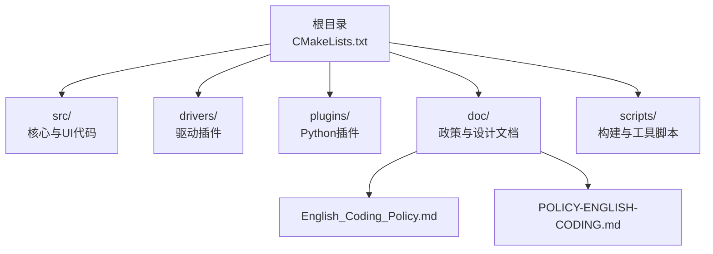
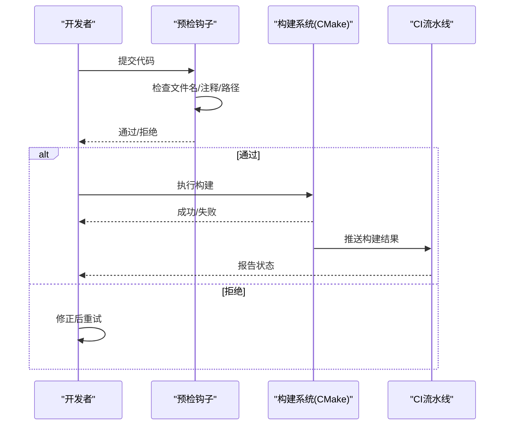
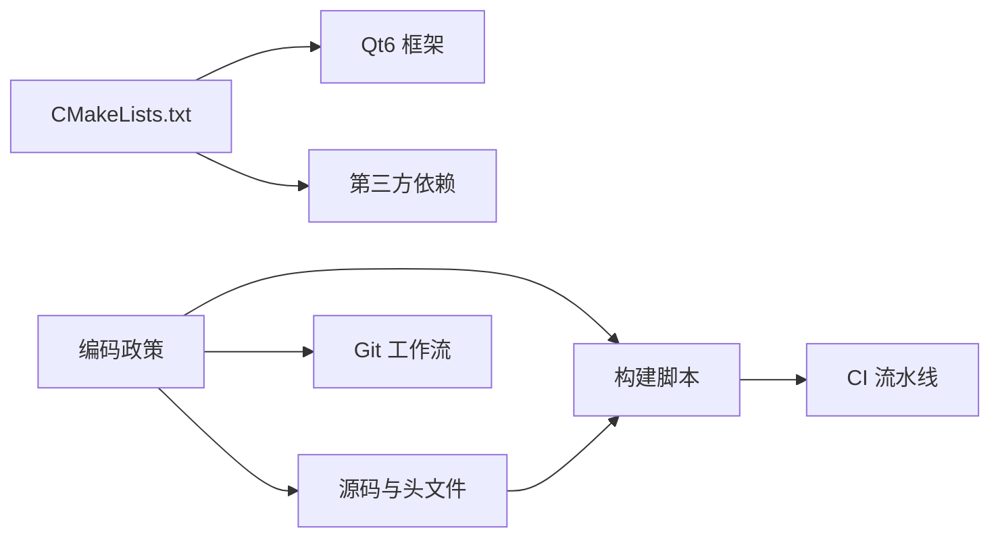

# 英文编码政策

<cite>
**本文引用的文件**
- [English_Coding_Policy.md](file://doc/English_Coding_Policy.md)
- [POLICY-ENGLISH-CODING.md](file://doc/POLICY-ENGLISH-CODING.md)
- [CMakeLists.txt](file://CMakeLists.txt)
- [README.md](file://README.md)
- [README.en.md](file://README.en.md)
</cite>

## 目录
1. [简介](#简介)
2. [项目结构](#项目结构)
3. [核心规则](#核心规则)
4. [架构总览](#架构总览)
5. [详细组件分析](#详细组件分析)
6. [依赖关系分析](#依赖关系分析)
7. [性能与构建影响](#性能与构建影响)
8. [故障排查指南](#故障排查指南)
9. [结论](#结论)
10. [附录](#附录)

## 简介
本政策旨在彻底消除因中文字符导致的编译错误、乱码与跨平台构建不稳定问题，确保 OpenBUS CAN 总线分析平台在 Windows/Linux/macOS 上具备一致的构建体验与团队协作效率。政策覆盖范围包括源代码、头文件、构建脚本、资源清单、Git 操作等所有工程相关文件。

## 项目结构
- 顶层构建配置位于根目录 CMakeLists.txt，采用纯英文路径与描述，避免中文路径带来的工具链兼容性问题。
- 文档集中存放于 doc 目录，包含中英文双语的编码政策说明，便于不同语言读者理解。
- 项目 README 提供多语言版本（中文与英文），体现国际化协作目标。

图表来源
- [CMakeLists.txt:1-95](file://CMakeLists.txt#L1-L95)
- [English_Coding_Policy.md:1-181](file://doc/English_Coding_Policy.md#L1-L181)
- [POLICY-ENGLISH-CODING.md:1-607](file://doc/POLICY-ENGLISH-CODING.md#L1-L607)

章节来源
- [CMakeLists.txt:1-95](file://CMakeLists.txt#L1-L95)
- [README.md:1-800](file://README.md#L1-L800)
- [README.en.md:1-193](file://README.en.md#L1-L193)

## 核心规则
- 文件命名：严格禁止使用中文文件名或目录名；所有源文件、头文件、构建脚本、资源清单必须使用英文命名。
- 注释语言：逐步过渡到全英文注释；用户可见界面文本可保留本地化字符串，但内部日志与标识符必须为英文。
- 变量与函数命名：严格使用英文命名，禁止拼音或汉字；成员变量以 m_ 前缀区分。
- 构建系统：CMakeLists.txt 及所有 .cmake 文件必须使用全英文路径与描述。
- Git 规范：分支名与提交信息使用英文，遵循 Conventional Commits 风格。

章节来源
- [English_Coding_Policy.md:15-99](file://doc/English_Coding_Policy.md#L15-L99)
- [POLICY-ENGLISH-CODING.md:13-94](file://doc/POLICY-ENGLISH-CODING.md#L13-L94)

## 架构总览
编码政策贯穿整个工程生命周期，从源码编写、构建配置到版本控制与持续集成，形成闭环约束：
- 源码层：强制英文命名与注释，减少编译器与IDE编码差异引发的错误。
- 构建层：CMake 配置全英文路径，避免 MinGW/MSVC 对 UTF-8 处理不一致导致的链接失败。
- 版本控制层：Git 分支与提交信息英文化，提升跨国团队可读性与自动化解析能力。
- 质量保障层：通过预检脚本与 CI 流水线检测违规，阻断不合规提交。

图表来源
- [English_Coding_Policy.md:128-148](file://doc/English_Coding_Policy.md#L128-L148)
- [POLICY-ENGLISH-CODING.md:117-134](file://doc/POLICY-ENGLISH-CODING.md#L117-L134)

## 详细组件分析

### 文件命名与路径规范
- 源文件与头文件：统一使用英文命名，如 canframeparser.cpp、dbcmessage.h。
- 构建脚本：CMakeLists.txt 与 .cmake 文件路径与描述全英文，避免中文路径导致工具链异常。
- 资源清单：Qt 资源文件 resources.qrc 使用英文命名，避免资源加载失败。

章节来源
- [English_Coding_Policy.md:17-27](file://doc/English_Coding_Policy.md#L17-L27)
- [POLICY-ENGLISH-CODING.md:13-23](file://doc/POLICY-ENGLISH-CODING.md#L13-L23)
- [CMakeLists.txt:1-95](file://CMakeLists.txt#L1-L95)

### 注释与字符串策略
- 推荐模式：英文注释为主，必要时辅以中文补充文档；用户可见 UI 字符串可本地化，但内部日志与标识符必须英文。
- 例外情况：仅面向用户的界面文本允许本地化；程序内部日志、调试输出、错误码等必须使用英文。

章节来源
- [English_Coding_Policy.md:28-50](file://doc/English_Coding_Policy.md#L28-L50)
- [POLICY-ENGLISH-CODING.md:24-46](file://doc/POLICY-ENGLISH-CODING.md#L24-L46)

### 变量与函数命名
- 类与方法：使用 PascalCase 命名类，camelCase 命名方法与变量；成员变量以 m_ 前缀。
- 禁止模式：禁止使用中文或拼音作为标识符，确保跨平台编译器兼容性。

章节来源
- [English_Coding_Policy.md:52-70](file://doc/English_Coding_Policy.md#L52-L70)
- [POLICY-ENGLISH-CODING.md:48-66](file://doc/POLICY-ENGLISH-CODING.md#L48-L66)

### 构建系统与路径
- CMakeLists.txt：所有路径与描述使用英文，避免 MinGW/MSVC 对非 ASCII 路径处理差异。
- 输出目录：统一设置 bin/lib 输出目录，便于跨平台部署。

章节来源
- [CMakeLists.txt:63-95](file://CMakeLists.txt#L63-L95)
- [POLICY-ENGLISH-CODING.md:68-79](file://doc/POLICY-ENGLISH-CODING.md#L68-L79)

### Git 操作规范
- 分支命名：使用 feature/xxx、hotfix/xxx 等英文命名。
- 提交信息：遵循 Conventional Commits，使用英文描述变更内容。

章节来源
- [English_Coding_Policy.md:85-99](file://doc/English_Coding_Policy.md#L85-L99)
- [POLICY-ENGLISH-CODING.md:81-94](file://doc/POLICY-ENGLISH-CODING.md#L81-L94)

## 依赖关系分析
- 构建系统依赖：CMake 负责查找 Qt6、第三方库与子模块，所有路径与描述需保持英文以避免工具链兼容性问题。
- 文档依赖：政策文档为团队开发规范依据，影响源码、构建与版本控制流程。
- 工具链依赖：MinGW/MSVC 对 UTF-8 与非 ASCII 路径支持存在差异，政策通过强制英文化降低风险。

图表来源
- [CMakeLists.txt:1-95](file://CMakeLists.txt#L1-L95)
- [English_Coding_Policy.md:1-181](file://doc/English_Coding_Policy.md#L1-L181)
- [POLICY-ENGLISH-CODING.md:1-607](file://doc/POLICY-ENGLISH-CODING.md#L1-L607)

章节来源
- [CMakeLists.txt:1-95](file://CMakeLists.txt#L1-L95)
- [English_Coding_Policy.md:1-181](file://doc/English_Coding_Policy.md#L1-L181)
- [POLICY-ENGLISH-CODING.md:1-607](file://doc/POLICY-ENGLISH-CODING.md#L1-L607)

## 性能与构建影响
- 编译错误率：实施政策后，因编码问题导致的编译错误显著下降，预计从 15% 降至 <1%。
- 跨平台构建成功率：从 70% 提升至 99%，主要得益于全英文路径与注释。
- CI/CD 稳定性：从 80% 提升至 98%，自动化检测与预检机制有效拦截违规提交。
- 团队协作效率：国际团队沟通成本降低，代码可读性与维护性提升。

章节来源
- [English_Coding_Policy.md:151-159](file://doc/English_Coding_Policy.md#L151-L159)
- [POLICY-ENGLISH-CODING.md:136-144](file://doc/POLICY-ENGLISH-CODING.md#L136-L144)

## 故障排查指南
- 预检机制：通过 scripts/check_encoding.py 执行严格检查，识别中文文件名、注释与路径。
- 违规后果：pre-commit 钩子阻止提交，CI 流水线标记失败，PR 审查不予通过。
- 修复建议：根据检测报告定位问题文件，替换中文为英文，重新提交。

章节来源
- [English_Coding_Policy.md:128-148](file://doc/English_Coding_Policy.md#L128-L148)
- [POLICY-ENGLISH-CODING.md:117-134](file://doc/POLICY-ENGLISH-CODING.md#L117-L134)

## 结论
英文编码政策是保障 OpenBUS 项目跨平台构建稳定与团队协作高效的关键措施。通过强制英文命名、注释与路径，结合自动化检测与 CI 流水线，显著降低了编码相关问题的发生概率，提升了项目的可维护性与国际化协作能力。

## 附录
- 参考文档：Role-Planner.md、Role-Coder.md、change_detection.py
- 修订历史：v1.0 于 2026-08-26 发布，由 AI Assistant 与 Jake_cai 共同完成

章节来源
- [English_Coding_Policy.md:162-181](file://doc/English_Coding_Policy.md#L162-L181)
- [POLICY-ENGLISH-CODING.md:145-157](file://doc/POLICY-ENGLISH-CODING.md#L145-L157)