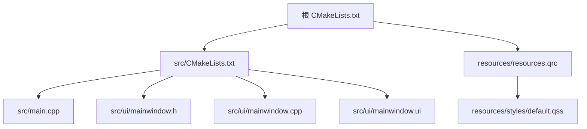
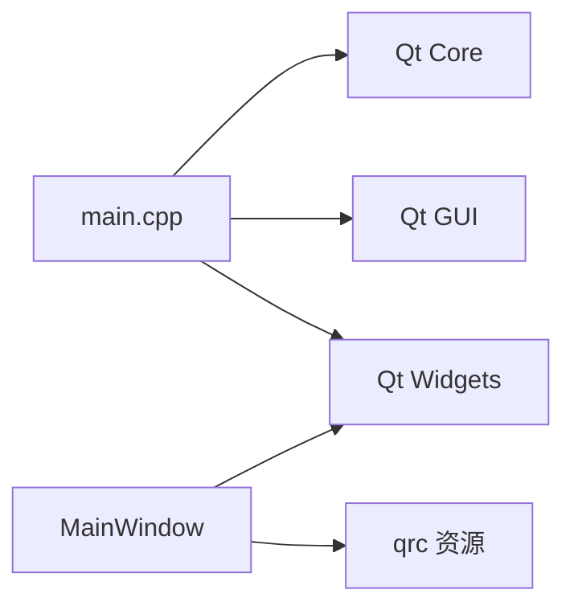

# 调试指南

<cite>
**本文引用的文件**   
- [CMakeLists.txt](file://CMakeLists.txt)
- [src/CMakeLists.txt](file://src/CMakeLists.txt)
- [src/main.cpp](file://src/main.cpp)
- [src/ui/mainwindow.h](file://src/ui/mainwindow.h)
- [src/ui/mainwindow.cpp](file://src/ui/mainwindow.cpp)
- [src/ui/mainwindow.ui](file://src/ui/mainwindow.ui)
- [resources/styles/default.qss](file://resources/styles/default.qss)
- [resources/resources.qrc](file://resources/resources.qrc)
</cite>

## 目录
1. [简介](#简介)
2. [项目结构](#项目结构)
3. [核心组件](#核心组件)
4. [架构总览](#架构总览)
5. [详细组件分析](#详细组件分析)
6. [依赖关系分析](#依赖关系分析)
7. [性能考虑](#性能考虑)
8. [故障排查指南](#故障排查指南)
9. [结论](#结论)
10. [附录](#附录)

## 简介
本指南面向使用 Qt Creator 调试 Qt C++ 应用的开发者，围绕断点设置、变量监视、调用栈分析、信号槽调试、UI 状态检查与性能分析等主题，提供从入门到进阶的实战方法。同时总结常见问题的定位思路与解决方案，并给出日志记录策略与错误追踪技巧，帮助你在复杂 UI 与事件驱动系统中快速定位问题。

## 项目结构
本项目采用 CMake 构建，源码位于 src 目录，UI 定义在 ui 子目录，资源文件在 resources 目录。Qt Creator 将基于 CMake 生成构建系统并进行调试。



图表来源
- [CMakeLists.txt](file://CMakeLists.txt)
- [src/CMakeLists.txt](file://src/CMakeLists.txt)
- [src/main.cpp](file://src/main.cpp)
- [src/ui/mainwindow.h](file://src/ui/mainwindow.h)
- [src/ui/mainwindow.cpp](file://src/ui/mainwindow.cpp)
- [src/ui/mainwindow.ui](file://src/ui/mainwindow.ui)
- [resources/resources.qrc](file://resources/resources.qrc)
- [resources/styles/default.qss](file://resources/styles/default.qss)

章节来源
- [CMakeLists.txt](file://CMakeLists.txt)
- [src/CMakeLists.txt](file://src/CMakeLists.txt)
- [src/main.cpp](file://src/main.cpp)
- [src/ui/mainwindow.h](file://src/ui/mainwindow.h)
- [src/ui/mainwindow.cpp](file://src/ui/mainwindow.cpp)
- [src/ui/mainwindow.ui](file://src/ui/mainwindow.ui)
- [resources/resources.qrc](file://resources/resources.qrc)
- [resources/styles/default.qss](file://resources/styles/default.qss)

## 核心组件
- 应用入口：main.cpp 负责创建 QApplication 与主窗口实例，并启动事件循环。
- 主窗口：MainWindow 类封装了 UI 逻辑与业务交互，通常包含信号槽连接、UI 初始化与事件处理。
- UI 描述：mainwindow.ui 通过 Qt Designer 定义界面布局与控件树。
- 样式与资源：default.qss 提供全局样式；resources.qrc 管理资源路径。

调试要点
- 入口断点：在 main 函数开始处设置断点，确认程序正常启动与参数解析。
- 构造/析构断点：为 MainWindow 构造函数与析构函数设置断点，观察生命周期。
- 信号槽断点：在槽函数入口处设置断点，验证触发时机与参数。
- UI 状态断点：在关键槽函数中读取控件属性（如文本、可见性、启用状态）进行校验。

章节来源
- [src/main.cpp](file://src/main.cpp)
- [src/ui/mainwindow.h](file://src/ui/mainwindow.h)
- [src/ui/mainwindow.cpp](file://src/ui/mainwindow.cpp)
- [src/ui/mainwindow.ui](file://src/ui/mainwindow.ui)
- [resources/styles/default.qss](file://resources/styles/default.qss)
- [resources/resources.qrc](file://resources/resources.qrc)

## 架构总览
下图展示了 Qt 应用的基本运行流程与调试切入点。

```mermaid
sequenceDiagram
participant OS as "操作系统"
participant App as "QApplication"
participant MW as "MainWindow"
participant UI as "UI 控件树"
participant Loop as "事件循环"
OS->>App : 启动进程
App->>MW : 构造主窗口
MW->>UI : 加载 .ui 并建立控件树
App->>Loop : 进入事件循环
UI-->>MW : 用户操作触发信号
MW-->>UI : 槽函数更新状态
Loop-->>App : 事件分发
```

图表来源
- [src/main.cpp](file://src/main.cpp)
- [src/ui/mainwindow.h](file://src/ui/mainwindow.h)
- [src/ui/mainwindow.cpp](file://src/ui/mainwindow.cpp)
- [src/ui/mainwindow.ui](file://src/ui/mainwindow.ui)

## 详细组件分析

### 应用入口（main.cpp）
- 职责：创建 QApplication、构造主窗口、显示窗口、执行 exec() 进入事件循环。
- 调试建议：
  - 在 main 起始位置设置断点，检查命令行参数与环境变量。
  - 在 QApplication::exec() 前设置条件断点，捕获异常退出。
  - 使用“调用栈”回溯崩溃或卡死时的调用链。

章节来源
- [src/main.cpp](file://src/main.cpp)

### 主窗口（MainWindow）
- 职责：初始化 UI、连接信号槽、处理用户交互与业务逻辑。
- 调试建议：
  - 在构造函数内对关键成员赋值后设置断点，验证初始状态。
  - 在槽函数入口设置断点，结合“局部变量”和“表达式求值”检查输入输出。
  - 使用“内存视图”或“对象树”查看控件层级与属性变化。
  - 针对异步任务（定时器、网络请求），在回调处设置断点并检查上下文。

章节来源
- [src/ui/mainwindow.h](file://src/ui/mainwindow.h)
- [src/ui/mainwindow.cpp](file://src/ui/mainwindow.cpp)

### UI 描述（mainwindow.ui）
- 职责：声明控件名称、布局、默认属性与信号槽映射。
- 调试建议：
  - 在 Qt Creator 的“设计模式”下核对控件名是否与代码一致。
  - 若运行时找不到控件，优先检查 .ui 中的 objectName 与代码中的 findChild 或指针命名。
  - 使用“对象树”面板实时查看控件树结构与属性。

章节来源
- [src/ui/mainwindow.ui](file://src/ui/mainwindow.ui)

### 样式与资源（default.qss、resources.qrc）
- 职责：统一界面风格与资源路径管理。
- 调试建议：
  - 在 QSS 生效前后分别截图对比，定位样式未生效的原因（选择器优先级、命名空间）。
  - 检查 qrc 路径与实际文件路径是否一致，避免资源加载失败。

章节来源
- [resources/styles/default.qss](file://resources/styles/default.qss)
- [resources/resources.qrc](file://resources/resources.qrc)

## 依赖关系分析
- 构建依赖：CMake 配置决定目标可执行文件与链接库。
- 运行时依赖：Qt 框架库、平台插件、样式插件、国际化资源等。
- 模块耦合：main.cpp 依赖 QApplication；MainWindow 依赖 Qt 控件与样式资源。



图表来源
- [CMakeLists.txt](file://CMakeLists.txt)
- [src/CMakeLists.txt](file://src/CMakeLists.txt)
- [src/main.cpp](file://src/main.cpp)
- [src/ui/mainwindow.h](file://src/ui/mainwindow.h)
- [src/ui/mainwindow.cpp](file://src/ui/mainwindow.cpp)
- [resources/resources.qrc](file://resources/resources.qrc)

章节来源
- [CMakeLists.txt](file://CMakeLists.txt)
- [src/CMakeLists.txt](file://src/CMakeLists.txt)
- [src/main.cpp](file://src/main.cpp)
- [src/ui/mainwindow.h](file://src/ui/mainwindow.h)
- [src/ui/mainwindow.cpp](file://src/ui/mainwindow.cpp)
- [resources/resources.qrc](file://resources/resources.qrc)

## 性能考虑
- 启动时间：减少主线程阻塞操作，延迟非关键初始化至后台线程。
- UI 卡顿：避免在绘制或事件处理中进行耗时计算，必要时使用 QElapsedTimer 测量耗时。
- 内存占用：关注频繁分配/释放的对象，使用对象池或复用机制。
- I/O 瓶颈：网络与磁盘操作应异步化，避免阻塞事件循环。
- 工具建议：
  - Qt Creator 内置性能分析（Profiler）用于 CPU/内存热点定位。
  - Valgrind/AddressSanitizer 检测内存泄漏与越界访问。
  - Perf/Windows Performance Analyzer 做系统级分析。

[本节为通用指导，不直接分析具体文件]

## 故障排查指南

### 断点与调试基础
- 断点类型：
  - 普通断点：在函数入口或关键行设置。
  - 条件断点：根据表达式命中，减少无关中断。
  - 数据断点：监控变量读写，定位非法修改。
  - 异常断点：捕获特定异常类型，便于快速定位。
- 变量监视：
  - 使用“监视表达式”跟踪复杂对象状态。
  - 使用“局部变量”面板查看作用域内变量。
  - 使用“内存视图”检查原始字节与缓冲区内容。
- 调用栈分析：
  - 逐层展开调用栈，定位最近一次函数调用。
  - 使用“返回地址”跳转到源码对应位置。
  - 注意多线程下的栈切换与线程 ID。

章节来源
- [src/main.cpp](file://src/main.cpp)
- [src/ui/mainwindow.cpp](file://src/ui/mainwindow.cpp)

### 信号槽调试
- 常见问题：
  - 信号未触发：检查 sender/receiver 生命周期、连接有效性。
  - 槽未执行：确认连接方式（同步/异步）、线程上下文。
  - 参数不匹配：确保信号与槽签名一致。
- 调试技巧：
  - 在槽函数首行设置断点，打印参数与上下文。
  - 使用 QObject::connect 返回值判断连接成功与否。
  - 借助“对象树”面板查看父子关系与事件传播。

章节来源
- [src/ui/mainwindow.h](file://src/ui/mainwindow.h)
- [src/ui/mainwindow.cpp](file://src/ui/mainwindow.cpp)

### UI 组件状态检查
- 常用检查项：
  - 控件可见性与启用状态（visible/enabled）。
  - 文本内容与格式（text/formatting）。
  - 布局与几何信息（geometry/layout）。
  - 样式表生效情况（stylesheet）。
- 调试技巧：
  - 在 Qt Creator 的“对象树”面板实时查看属性。
  - 使用“截图对比”定位样式差异。
  - 在重绘相关函数（paintEvent/update）设置断点。

章节来源
- [src/ui/mainwindow.ui](file://src/ui/mainwindow.ui)
- [resources/styles/default.qss](file://resources/styles/default.qss)

### 日志记录策略
- 分级输出：
  - 调试级别：仅在 Debug 构建输出，避免 Release 污染。
  - 信息级别：关键流程节点与状态变更。
  - 警告级别：潜在风险与降级行为。
  - 错误级别：异常与不可恢复错误。
- 最佳实践：
  - 使用统一的日志宏，支持开关与格式化。
  - 避免在热路径上频繁写入磁盘，必要时缓冲或异步落盘。
  - 包含上下文信息（线程、时间戳、模块名、调用位置）。

章节来源
- [src/main.cpp](file://src/main.cpp)
- [src/ui/mainwindow.cpp](file://src/ui/mainwindow.cpp)

### 错误追踪技巧
- 崩溃定位：
  - 使用“调用栈”与“反汇编”定位崩溃指令。
  - 开启堆栈符号加载，确保调试符号可用。
- 内存问题：
  - 使用 AddressSanitizer 或 Valgrind 检测越界与泄漏。
  - 关注智能指针与裸指针混用场景。
- 并发问题：
  - 使用线程锁与原子操作辅助定位竞态。
  - 通过线程 ID 与调度日志分析时序问题。

章节来源
- [src/main.cpp](file://src/main.cpp)
- [src/ui/mainwindow.cpp](file://src/ui/mainwindow.cpp)

### 性能分析工具使用
- Qt Creator Profiler：
  - 采集 CPU/内存/IO 指标，识别热点函数。
  - 结合采样与插桩模式平衡精度与开销。
- 外部工具：
  - Windows：Performance Monitor、xperf、ETW。
  - Linux：perf、systemtap、bpftrace。
  - macOS：Instruments、dtrace。
- 分析方法：
  - 先定位顶层热点，再下钻到具体函数。
  - 结合调用图与火焰图理解调用关系。
  - 对比优化前后的指标变化评估效果。

[本节为通用指导，不直接分析具体文件]

## 结论
通过合理的断点策略、变量监视与调用栈分析，配合信号槽调试、UI 状态检查与性能分析工具，可以高效定位 Qt 应用中的逻辑错误、UI 异常与性能瓶颈。建议建立标准化的日志记录与错误追踪流程，提升问题复现与修复效率。

[本节为总结性内容，不直接分析具体文件]

## 附录

### 常用调试快捷键与面板
- 断点控制：F9 切换断点，F5 继续执行，F10/F11 单步。
- 变量查看：局部变量、监视表达式、内存视图、对象树。
- 调用栈：逐帧跳转、返回地址定位、线程切换。
- 日志输出：控制台输出、文件日志、远程日志收集。

[本节为通用指导，不直接分析具体文件]

### 构建与调试环境建议
- 使用 Debug 构建进行问题定位，Release 构建用于性能测试。
- 确保调试符号与源文件路径正确，避免符号缺失。
- 合理配置 CMake 选项，启用必要的调试特性（如 ASan）。

章节来源
- [CMakeLists.txt](file://CMakeLists.txt)
- [src/CMakeLists.txt](file://src/CMakeLists.txt)