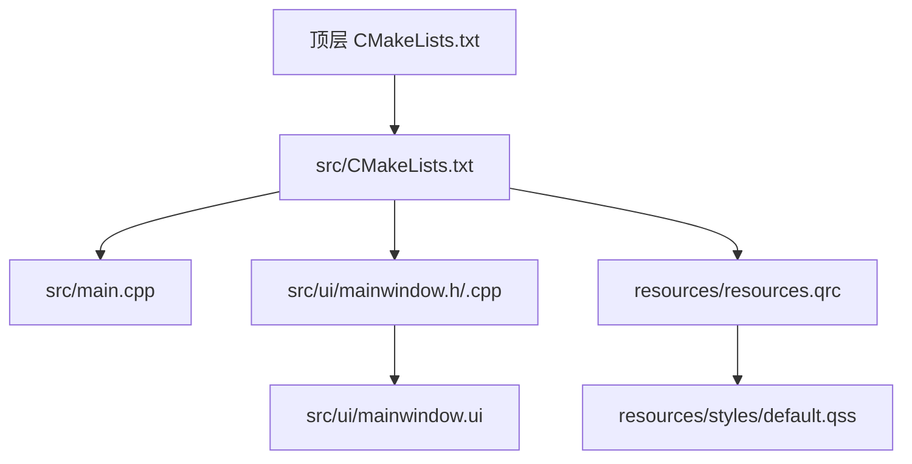
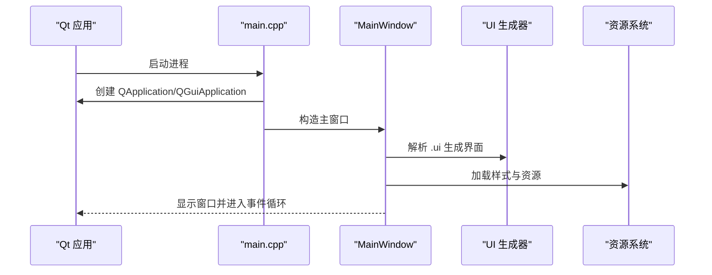
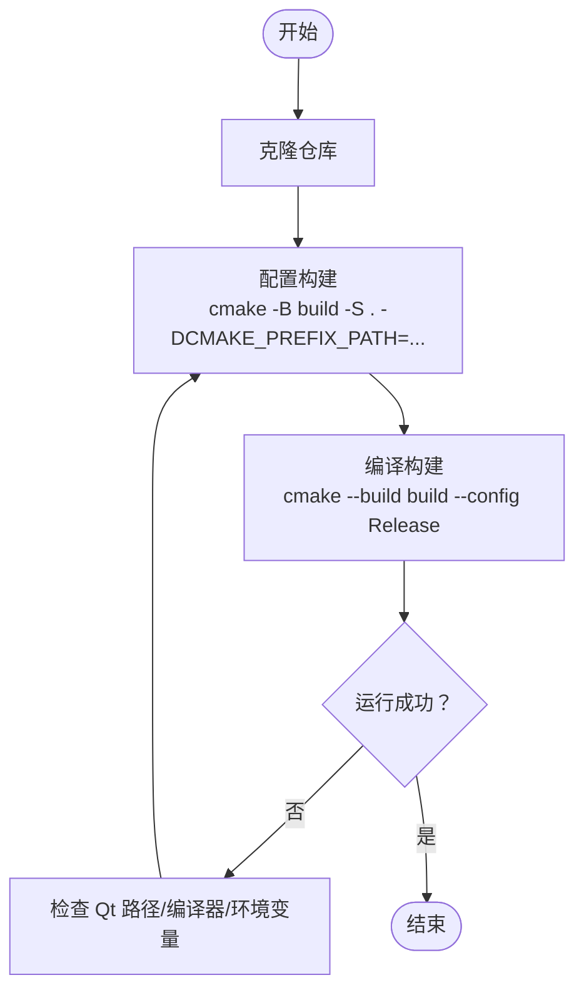
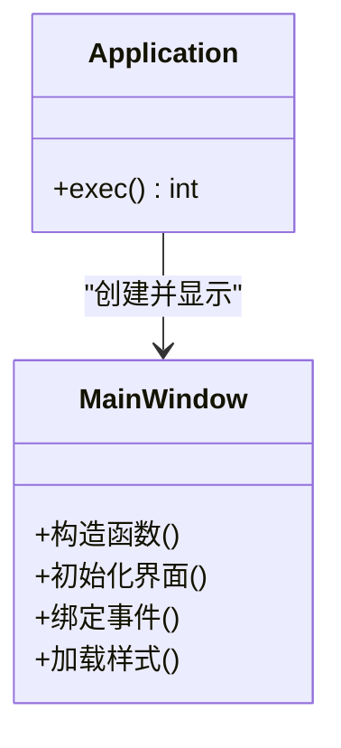
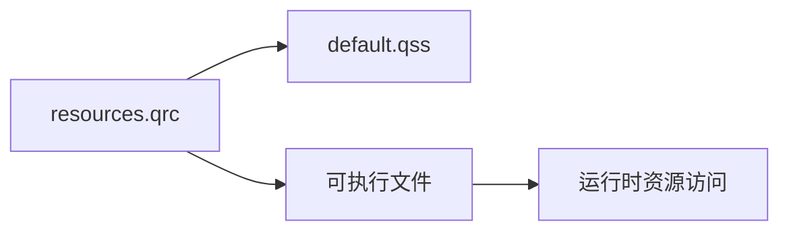
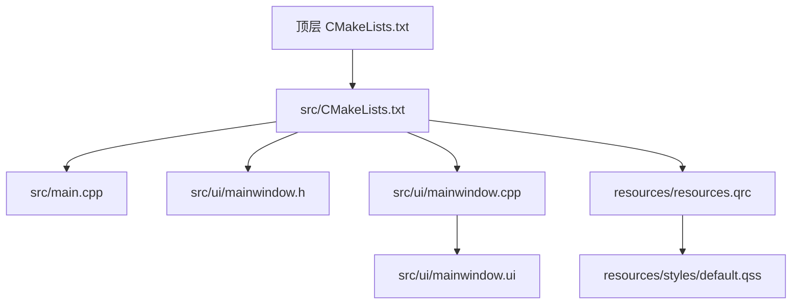

# 快速开始

<cite>
**本文引用的文件**   
- [CMakeLists.txt](file://CMakeLists.txt)
- [src/CMakeLists.txt](file://src/CMakeLists.txt)
- [src/main.cpp](file://src/main.cpp)
- [src/ui/mainwindow.h](file://src/ui/mainwindow.h)
- [src/ui/mainwindow.cpp](file://src/ui/mainwindow.cpp)
- [src/ui/mainwindow.ui](file://src/ui/mainwindow.ui)
- [resources/resources.qrc](file://resources/resources.qrc)
- [resources/styles/default.qss](file://resources/styles/default.qss)
</cite>

## 目录
1. [简介](#简介)
2. [项目结构](#项目结构)
3. [核心组件](#核心组件)
4. [架构总览](#架构总览)
5. [详细组件分析](#详细组件分析)
6. [依赖分析](#依赖分析)
7. [性能考虑](#性能考虑)
8. [故障排除指南](#故障排除指南)
9. [结论](#结论)
10. [附录](#附录)

## 简介
本快速开始指南面向初学者，帮助你在最短时间内完成环境准备、克隆代码、配置构建并运行第一个 Qt 应用。本项目基于 CMake + Qt（含 Qt Designer UI 与资源系统），采用分层目录组织：顶层 CMake 负责整体构建，src 包含主程序与界面逻辑，resources 管理样式与资源。

## 项目结构
- 顶层 CMakeLists.txt：定义项目名称、版本、Qt 模块、子目录与安装规则。
- src/CMakeLists.txt：编译源文件、生成 Qt 元对象/信号槽代码、链接库。
- src/main.cpp：应用程序入口，创建窗口并启动事件循环。
- src/ui/mainwindow.*：主窗口类声明与实现，配合 .ui 描述界面布局。
- resources/*：Qt 资源文件与默认样式表。

图示来源
- [CMakeLists.txt:1-200](file://CMakeLists.txt#L1-L200)
- [src/CMakeLists.txt:1-200](file://src/CMakeLists.txt#L1-L200)
- [src/main.cpp:1-200](file://src/main.cpp#L1-L200)
- [src/ui/mainwindow.h:1-200](file://src/ui/mainwindow.h#L1-L200)
- [src/ui/mainwindow.cpp:1-200](file://src/ui/mainwindow.cpp#L1-L200)
- [src/ui/mainwindow.ui:1-200](file://src/ui/mainwindow.ui#L1-L200)
- [resources/resources.qrc:1-200](file://resources/resources.qrc#L1-L200)
- [resources/styles/default.qss:1-200](file://resources/styles/default.qss#L1-L200)

章节来源
- [CMakeLists.txt:1-200](file://CMakeLists.txt#L1-L200)
- [src/CMakeLists.txt:1-200](file://src/CMakeLists.txt#L1-L200)
- [src/main.cpp:1-200](file://src/main.cpp#L1-L200)
- [src/ui/mainwindow.h:1-200](file://src/ui/mainwindow.h#L1-L200)
- [src/ui/mainwindow.cpp:1-200](file://src/ui/mainwindow.cpp#L1-L200)
- [src/ui/mainwindow.ui:1-200](file://src/ui/mainwindow.ui#L1-L200)
- [resources/resources.qrc:1-200](file://resources/resources.qrc#L1-L200)
- [resources/styles/default.qss:1-200](file://resources/styles/default.qss#L1-L200)

## 核心组件
- 应用程序入口 main.cpp：初始化 Qt 应用实例，创建主窗口并进入事件循环。
- 主窗口 MainWindow：封装界面控件与交互逻辑，由 .ui 文件驱动布局。
- 资源系统 resources.qrc：将样式表等静态资源打包进可执行文件，便于分发。
- 样式 default.qss：统一外观风格，可在运行时加载或作为资源引用。

章节来源
- [src/main.cpp:1-200](file://src/main.cpp#L1-L200)
- [src/ui/mainwindow.h:1-200](file://src/ui/mainwindow.h#L1-L200)
- [src/ui/mainwindow.cpp:1-200](file://src/ui/mainwindow.cpp#L1-L200)
- [src/ui/mainwindow.ui:1-200](file://src/ui/mainwindow.ui#L1-L200)
- [resources/resources.qrc:1-200](file://resources/resources.qrc#L1-L200)
- [resources/styles/default.qss:1-200](file://resources/styles/default.qss#L1-L200)

## 架构总览
下图展示从入口到界面的调用链路与资源加载关系。

图示来源
- [src/main.cpp:1-200](file://src/main.cpp#L1-L200)
- [src/ui/mainwindow.h:1-200](file://src/ui/mainwindow.h#L1-L200)
- [src/ui/mainwindow.cpp:1-200](file://src/ui/mainwindow.cpp#L1-L200)
- [src/ui/mainwindow.ui:1-200](file://src/ui/mainwindow.ui#L1-L200)
- [resources/resources.qrc:1-200](file://resources/resources.qrc#L1-L200)

## 详细组件分析

### 构建系统与 CMake 流程
- 顶层 CMakeLists.txt 定义项目元数据、查找 Qt 模块、添加子目录与安装目标。
- src/CMakeLists.txt 指定源文件、启用 Qt 自动 MOC/UIC/RCC、链接所需库。
- 构建产物位于 build 目录（推荐），支持多配置（Debug/Release）。

图示来源
- [CMakeLists.txt:1-200](file://CMakeLists.txt#L1-L200)
- [src/CMakeLists.txt:1-200](file://src/CMakeLists.txt#L1-L200)

章节来源
- [CMakeLists.txt:1-200](file://CMakeLists.txt#L1-L200)
- [src/CMakeLists.txt:1-200](file://src/CMakeLists.txt#L1-L200)

### 主程序与主窗口
- main.cpp 负责创建应用实例、设置窗口并启动事件循环。
- MainWindow 通过 .ui 文件生成界面，并在构造函数中绑定信号槽与样式。

图示来源
- [src/main.cpp:1-200](file://src/main.cpp#L1-L200)
- [src/ui/mainwindow.h:1-200](file://src/ui/mainwindow.h#L1-L200)
- [src/ui/mainwindow.cpp:1-200](file://src/ui/mainwindow.cpp#L1-L200)
- [src/ui/mainwindow.ui:1-200](file://src/ui/mainwindow.ui#L1-L200)

章节来源
- [src/main.cpp:1-200](file://src/main.cpp#L1-L200)
- [src/ui/mainwindow.h:1-200](file://src/ui/mainwindow.h#L1-L200)
- [src/ui/mainwindow.cpp:1-200](file://src/ui/mainwindow.cpp#L1-L200)
- [src/ui/mainwindow.ui:1-200](file://src/ui/mainwindow.ui#L1-L200)

### 资源与样式
- resources.qrc 将样式表与图标等资源纳入构建系统，避免运行时路径问题。
- default.qss 提供统一主题，可在应用启动时加载。

图示来源
- [resources/resources.qrc:1-200](file://resources/resources.qrc#L1-L200)
- [resources/styles/default.qss:1-200](file://resources/styles/default.qss#L1-L200)

章节来源
- [resources/resources.qrc:1-200](file://resources/resources.qrc#L1-L200)
- [resources/styles/default.qss:1-200](file://resources/styles/default.qss#L1-L200)

## 依赖分析
- 外部依赖：Qt（Core、Widgets、Gui、UiTools、Rcc）、CMake、平台编译器（MSVC/Clang/GCC）。
- 内部依赖：src/CMakeLists.txt 依赖顶层 CMakeLists.txt；UI 文件依赖 Qt 的 uic；资源依赖 rcc。

图示来源
- [CMakeLists.txt:1-200](file://CMakeLists.txt#L1-L200)
- [src/CMakeLists.txt:1-200](file://src/CMakeLists.txt#L1-L200)
- [src/main.cpp:1-200](file://src/main.cpp#L1-L200)
- [src/ui/mainwindow.h:1-200](file://src/ui/mainwindow.h#L1-L200)
- [src/ui/mainwindow.cpp:1-200](file://src/ui/mainwindow.cpp#L1-L200)
- [src/ui/mainwindow.ui:1-200](file://src/ui/mainwindow.ui#L1-L200)
- [resources/resources.qrc:1-200](file://resources/resources.qrc#L1-L200)
- [resources/styles/default.qss:1-200](file://resources/styles/default.qss#L1-L200)

章节来源
- [CMakeLists.txt:1-200](file://CMakeLists.txt#L1-L200)
- [src/CMakeLists.txt:1-200](file://src/CMakeLists.txt#L1-L200)

## 性能考虑
- 首次构建较慢属正常现象，后续增量编译会显著加速。
- 使用 Ninja 生成器可提升大型项目的构建速度（可选）。
- 合理拆分模块与按需启用 Qt 特性可减少编译开销。

## 故障排除指南
- 找不到 Qt 库或头文件
  - 确认已正确安装 Qt，并通过 CMAKE_PREFIX_PATH 指向 Qt 安装根目录。
  - Windows 下确保 MSVC 工具链与 Qt 版本匹配。
- 无法定位 qmake/cmake 命令
  - 将 Qt/bin 与 CMake/bin 加入系统 PATH，或在 IDE 中配置工具链路径。
- 资源未生效或样式不加载
  - 确认 resources.qrc 已纳入构建，且样式路径在资源中正确声明。
- 权限或路径问题
  - 以管理员权限运行终端（Windows）或使用绝对路径避免相对路径错误。
- 清理重建
  - 删除 build 目录后重新 cmake configure 与 build。

章节来源
- [CMakeLists.txt:1-200](file://CMakeLists.txt#L1-L200)
- [src/CMakeLists.txt:1-200](file://src/CMakeLists.txt#L1-L200)
- [resources/resources.qrc:1-200](file://resources/resources.qrc#L1-L200)

## 结论
按照本指南完成环境准备与构建配置后，即可顺利运行首个 Qt 应用。建议在熟悉基础流程后，逐步扩展功能与模块，保持 CMake 配置清晰与资源管理规范。

## 附录

### 环境要求
- 操作系统：Windows / macOS / Linux
- 编译器：MSVC（Windows）、Clang/GCC（macOS/Linux）
- 构建系统：CMake 3.15+
- 框架：Qt 5.15+ 或 Qt 6.x（根据 CMake 配置选择）
- 可选：Ninja（加速构建）

### 安装步骤（从零开始）
- 安装 CMake 与平台编译器
  - Windows：安装 Visual Studio（含 C++ 桌面开发）与 CMake。
  - macOS：安装 Xcode 命令行工具与 Homebrew 版 CMake。
  - Linux：安装 gcc/g++、make 与 CMake。
- 安装 Qt
  - 使用 Qt Online Installer 安装对应版本的 Qt（建议与编译器匹配）。
  - 记录 Qt 安装根目录（例如 Windows 的 C:\Qt\6.x.x\msvc_xxx）。
- 克隆项目
  - git clone <仓库地址>
  - cd sin
- 配置构建
  - 创建构建目录：mkdir build && cd build
  - 配置 CMake（示例，按实际 Qt 路径调整）：
    - Windows (MSVC): cmake -B . -S .. -DCMAKE_PREFIX_PATH="C:\Qt\6.x.x\msvc_xxx" -DCMAKE_BUILD_TYPE=Release
    - macOS/Linux: cmake -B . -S .. -DCMAKE_PREFIX_PATH="/path/to/Qt/6.x.x/gcc_64" -DCMAKE_BUILD_TYPE=Release
- 编译
  - cmake --build . --config Release
- 运行
  - 在构建目录中运行生成的可执行文件（名称以项目名为准）。

### 第一个应用的运行示例
- 完成上述构建后，在构建目录中找到可执行文件并双击运行，或通过命令行执行。
- 若出现样式未生效，请确认 resources.qrc 与 default.qss 已被正确打包。

### 常见问题速查
- 找不到 Qt 模块
  - 检查 CMAKE_PREFIX_PATH 是否指向正确的 Qt 版本与平台。
- 链接错误（如 LNK2019）
  - 确认已链接 QtWidgets/Gui/Core 等必要模块。
- 资源路径错误
  - 使用 :/ 前缀访问资源，并确保 qrc 中包含对应文件。