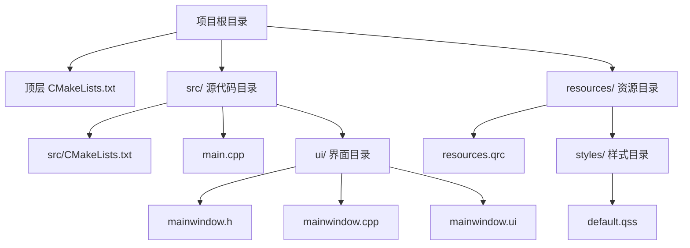

# 快速开始

<cite>
**本文引用的文件**   
- [CMakeLists.txt](file://CMakeLists.txt)
- [src/CMakeLists.txt](file://src/CMakeLists.txt)
- [src/main.cpp](file://src/main.cpp)
- [src/ui/mainwindow.h](file://src/ui/mainwindow.h)
- [src/ui/mainwindow.cpp](file://src/ui/mainwindow.cpp)
- [src/ui/mainwindow.ui](file://src/ui/mainwindow.ui)
- [resources/resources.qrc](file://resources/resources.qrc)
- [resources/styles/default.qss](file://resources/styles/default.qss)
</cite>

## 更新摘要
**所做更改**
- 根据新的项目结构更新了环境要求和安装步骤
- 添加了 Qt Designer UI 文件的配置说明
- 更新了 CMake 构建流程以反映新的项目组织
- 增强了故障排除指南以涵盖 Qt 桌面应用开发常见问题

## 目录
1. [简介](#简介)
2. [环境要求](#环境要求)
3. [项目结构](#项目结构)
4. [安装步骤](#安装步骤)
5. [构建配置](#构建配置)
6. [运行第一个应用](#运行第一个应用)
7. [Qt Designer 使用](#qt-designer-使用)
8. [资源管理](#资源管理)
9. [故障排除指南](#故障排除指南)
10. [结论](#结论)

## 简介
本快速开始指南专为初学者设计，帮助你在最短时间内完成 Qt 桌面应用的开发环境搭建、代码克隆、构建配置并运行第一个应用。本项目采用现代化的 CMake + Qt 架构，包含完整的 Qt Designer UI 文件和资源管理系统，提供清晰的分层目录结构和标准化的开发工作流。

## 环境要求
### 必需组件
- **操作系统**：Windows 10/11、macOS 10.15+、Linux (Ubuntu 18.04+)
- **编译器**：
  - Windows: Visual Studio 2019+ (含 C++ 桌面开发工具包)
  - macOS: Xcode 命令行工具
  - Linux: GCC/G++ 7.0+ 或 Clang 6.0+
- **构建系统**：CMake 3.15 或更高版本
- **框架**：Qt 5.15+ 或 Qt 6.x（推荐与编译器版本匹配）

### 可选工具
- **IDE**：Visual Studio、Qt Creator、CLion、VS Code
- **生成器**：Ninja（提升大型项目构建速度）
- **版本控制**：Git 2.20+

## 项目结构
项目采用清晰的模块化组织结构：



**章节来源**
- [CMakeLists.txt](file://CMakeLists.txt)
- [src/CMakeLists.txt](file://src/CMakeLists.txt)
- [src/main.cpp](file://src/main.cpp)
- [src/ui/mainwindow.h](file://src/ui/mainwindow.h)
- [src/ui/mainwindow.cpp](file://src/ui/mainwindow.cpp)
- [src/ui/mainwindow.ui](file://src/ui/mainwindow.ui)
- [resources/resources.qrc](file://resources/resources.qrc)
- [resources/styles/default.qss](file://resources/styles/default.qss)

## 安装步骤
### 第一步：安装开发环境
#### Windows 用户
1. 安装 Visual Studio 2019/2022，选择"使用 C++ 的桌面开发"工作负载
2. 安装 CMake（可从官网下载或使用 vcpkg）
3. 安装 Qt Online Installer 并选择对应版本的 Qt

#### macOS 用户
1. 安装 Xcode 命令行工具：`xcode-select --install`
2. 通过 Homebrew 安装 CMake：`brew install cmake`
3. 安装 Qt：`brew install qt@6`

#### Linux 用户
```bash
# Ubuntu/Debian
sudo apt update
sudo apt install build-essential cmake qtbase5-dev qttools5-dev-tools

# CentOS/RHEL
sudo yum groupinstall "Development Tools"
sudo yum install cmake qt5-qtbase-devel qt5-qttools-devel
```

### 第二步：克隆项目
```bash
git clone <仓库地址>
cd sin
```

### 第三步：验证环境
```bash
# 检查 CMake 版本
cmake --version

# 检查 Qt 安装（Windows 示例）
where qmake

# 检查编译器
g++ --version  # Linux/macOS
cl.exe         # Windows
```

## 构建配置
### 创建构建目录
```bash
mkdir build
cd build
```

### 配置 CMake
根据操作系统和 Qt 安装路径进行配置：

#### Windows (MSVC)
```bash
cmake -B . -S .. -DCMAKE_PREFIX_PATH="C:\Qt\6.x.x\msvc_xxx" -DCMAKE_BUILD_TYPE=Release
```

#### macOS
```bash
cmake -B . -S .. -DCMAKE_PREFIX_PATH="/usr/local/opt/qt" -DCMAKE_BUILD_TYPE=Release
```

#### Linux
```bash
cmake -B . -S .. -DCMAKE_PREFIX_PATH="/usr/lib/x86_64-linux-gnu/cmake/Qt5" -DCMAKE_BUILD_TYPE=Release
```

### 编译项目
```bash
cmake --build . --config Release
```

**章节来源**
- [CMakeLists.txt](file://CMakeLists.txt)
- [src/CMakeLists.txt](file://src/CMakeLists.txt)

## 运行第一个应用
构建完成后，在 `build` 目录中找到生成的可执行文件并运行：

```bash
# Windows
.\Release\sin.exe

# macOS
./Release/sin.app/Contents/MacOS/sin

# Linux
./Release/sin
```

首次运行时，应用程序将显示主窗口界面，包括菜单栏、工具栏和状态栏等标准 Qt 桌面应用元素。

## Qt Designer 使用
项目包含完整的 Qt Designer 支持，便于可视化界面设计：

### 编辑界面文件
```bash
# 打开 Qt Designer 编辑主窗口
designer src/ui/mainwindow.ui
```

### 修改界面布局
1. 在 Qt Designer 中拖拽控件到设计区域
2. 设置控件属性（名称、文本、尺寸等）
3. 添加信号槽连接
4. 保存后重新构建项目

### 界面文件结构
- `.ui` 文件：XML 格式的界面描述
- 自动生成对应的 C++ 头文件
- 支持实时预览和属性编辑器

**章节来源**
- [src/ui/mainwindow.ui](file://src/ui/mainwindow.ui)

## 资源管理
项目使用 Qt 资源系统进行静态资源管理：

### 资源文件结构
```
resources/
├── resources.qrc          # 资源索引文件
└── styles/
    └── default.qss        # 默认样式表
```

### 添加新资源
1. 在 `resources.qrc` 中添加新文件路径
2. 使用 `:/` 前缀在代码中访问资源
3. 重新构建项目以更新资源索引

### 样式加载
```cpp
// 在应用中加载样式表
QFile file(":/styles/default.qss");
if (file.open(QIODevice::ReadOnly)) {
    QString style = QLatin1String(file.readAll());
    QApplication::setStyleSheet(style);
}
```

**章节来源**
- [resources/resources.qrc](file://resources/resources.qrc)
- [resources/styles/default.qss](file://resources/styles/default.qss)

## 故障排除指南
### 常见构建问题

#### 找不到 Qt 库
**问题**：CMake 无法找到 Qt 安装路径
**解决方案**：
```bash
# 指定正确的 Qt 路径
cmake -DCMAKE_PREFIX_PATH="/path/to/qt/installation"

# Windows 环境变量
set CMAKE_PREFIX_PATH=C:\Qt\6.x.x\msvc_xxx
```

#### 编译器不匹配
**问题**：Qt 版本与编译器不兼容
**解决方案**：
- 确保使用与 Qt 匹配的编译器版本
- Windows: MSVC 2019+ 对应 Qt 5.15+/6.x
- 检查 Qt 安装时选择的编译器套件

#### 资源文件未生效
**问题**：样式表或图标未正确加载
**解决方案**：
- 确认 `resources.qrc` 包含所有必要文件
- 检查资源路径是否正确
- 重新构建项目以更新资源索引

#### 权限问题
**问题**：无法写入构建目录
**解决方案**：
- 使用管理员权限运行终端
- 确保构建目录有写权限
- 尝试使用绝对路径

### 调试技巧
```bash
# 详细构建输出
cmake --build . --verbose

# 清理重建
rm -rf build
mkdir build && cd build
cmake ..
cmake --build .

# 检查依赖关系
cmake --graphviz=deps.dot
```

**章节来源**
- [CMakeLists.txt](file://CMakeLists.txt)
- [src/CMakeLists.txt](file://src/CMakeLists.txt)

## 结论
按照本指南完成环境准备与构建配置后，即可顺利运行首个 Qt 桌面应用。建议开发者：

1. **熟悉项目结构**：理解 CMake 配置、Qt Designer 文件和资源管理的组织方式
2. **掌握开发工作流**：从界面设计到代码实现的完整开发流程
3. **利用调试工具**：使用 IDE 和命令行工具进行问题排查
4. **扩展功能**：基于现有架构逐步添加新功能模块

随着对项目的熟悉，可以进一步探索 Qt 的高级特性，如多线程、数据库集成、网络编程等，构建更复杂的桌面应用程序。