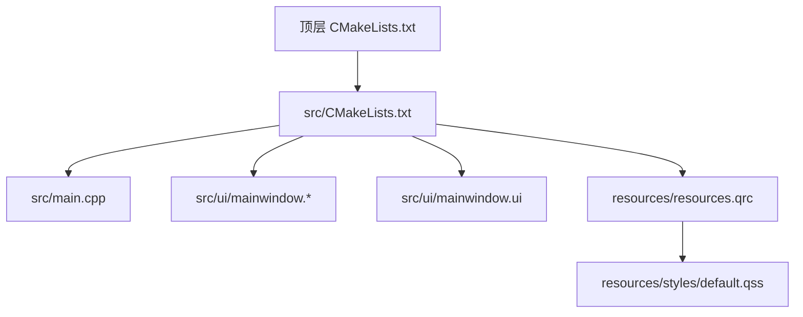
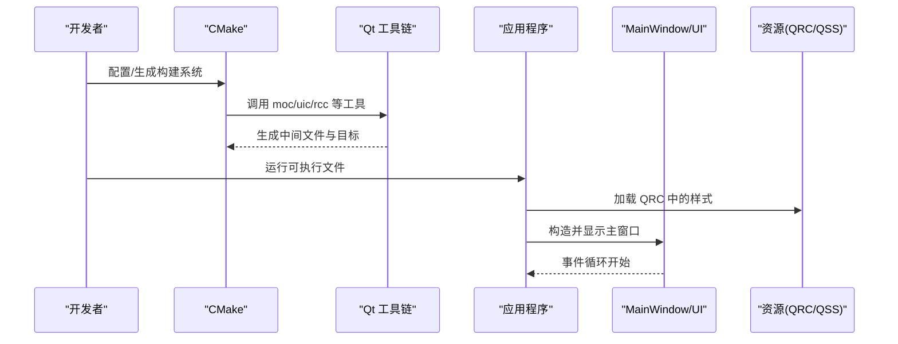
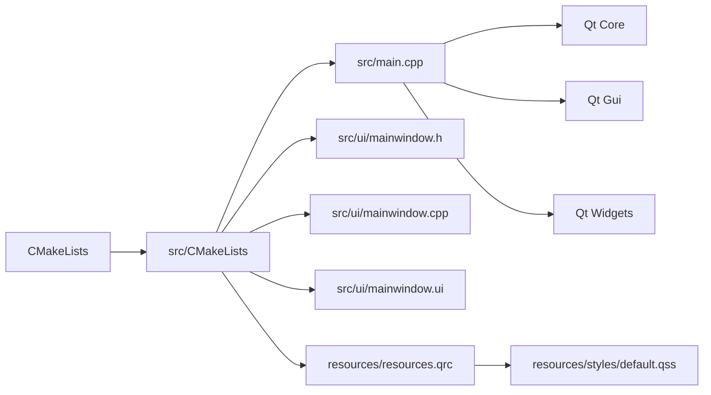

# 故障排除

<cite>
**本文引用的文件**   
- [CMakeLists.txt](file://CMakeLists.txt)
- [src/CMakeLists.txt](file://src/CMakeLists.txt)
- [src/main.cpp](file://src/main.cpp)
- [src/ui/mainwindow.h](file://src/ui/mainwindow.h)
- [src/ui/mainwindow.cpp](file://src/ui/mainwindow.cpp)
- [src/ui/mainwindow.ui](file://src/ui/mainwindow.ui)
- [resources/styles/default.qss](file://resources/styles/default.qss)
- [resources/resources.qrc](file://resources/resources.qrc)
- [README.en.md](file://README.en.md)
</cite>

## 目录
1. [简介](#简介)
2. [项目结构](#项目结构)
3. [核心组件](#核心组件)
4. [架构总览](#架构总览)
5. [详细组件分析](#详细组件分析)
6. [依赖分析](#依赖分析)
7. [性能考虑](#性能考虑)
8. [故障排除指南](#故障排除指南)
9. [结论](#结论)
10. [附录](#附录)

## 简介
本故障排除文档面向使用 CMake + Qt（Widgets）构建的桌面应用，聚焦于编译期、运行期与性能三类常见问题。内容涵盖错误日志分析、调试工具使用、性能瓶颈定位方法，以及社区支持与问题报告模板，帮助用户快速定位并解决问题。

## 项目结构
本项目采用分层组织：顶层 CMake 配置负责整体构建，src 下包含主程序入口与 UI 模块，resources 提供样式与资源清单。Qt 资源系统通过 .qrc 管理样式表等资源文件。

图表来源 
- [CMakeLists.txt](file://CMakeLists.txt)
- [src/CMakeLists.txt](file://src/CMakeLists.txt)
- [src/main.cpp](file://src/main.cpp)
- [src/ui/mainwindow.h](file://src/ui/mainwindow.h)
- [src/ui/mainwindow.cpp](file://src/ui/mainwindow.cpp)
- [src/ui/mainwindow.ui](file://src/ui/mainwindow.ui)
- [resources/resources.qrc](file://resources/resources.qrc)
- [resources/styles/default.qss](file://resources/styles/default.qss)

章节来源
- [CMakeLists.txt](file://CMakeLists.txt)
- [src/CMakeLists.txt](file://src/CMakeLists.txt)
- [src/main.cpp](file://src/main.cpp)
- [src/ui/mainwindow.h](file://src/ui/mainwindow.h)
- [src/ui/mainwindow.cpp](file://src/ui/mainwindow.cpp)
- [src/ui/mainwindow.ui](file://src/ui/mainwindow.ui)
- [resources/resources.qss](file://resources/styles/default.qss)
- [resources/resources.qrc](file://resources/resources.qrc)

## 核心组件
- 构建系统：CMake 负责生成 Qt 目标、链接库与资源处理。
- 应用入口：main.cpp 初始化 QApplication 并启动主窗口。
- UI 层：MainWindow 承载界面逻辑，UI 由 .ui 描述，样式由 QSS 提供。
- 资源系统：QRC 将样式表打包进可执行文件，便于部署。

章节来源
- [src/main.cpp](file://src/main.cpp)
- [src/ui/mainwindow.h](file://src/ui/mainwindow.h)
- [src/ui/mainwindow.cpp](file://src/ui/mainwindow.cpp)
- [src/ui/mainwindow.ui](file://src/ui/mainwindow.ui)
- [resources/resources.qrc](file://resources/resources.qrc)
- [resources/styles/default.qss](file://resources/styles/default.qss)

## 架构总览
下图展示从构建到运行的关键路径：CMake 生成 Qt 目标，main 创建应用实例并加载 MainWindow，UI 由 .ui 生成代码驱动，样式通过 QSS 注入。

图表来源 
- [CMakeLists.txt](file://CMakeLists.txt)
- [src/CMakeLists.txt](file://src/CMakeLists.txt)
- [src/main.cpp](file://src/main.cpp)
- [src/ui/mainwindow.ui](file://src/ui/mainwindow.ui)
- [resources/resources.qrc](file://resources/resources.qrc)
- [resources/styles/default.qss](file://resources/styles/default.qss)

## 详细组件分析

### 构建系统（CMake）
- 常见问题
  - Qt 未正确发现或版本不匹配：检查 find_package(QtX REQUIRED COMPONENTS Widgets Core Gui) 与 Qt 安装路径。
  - 目标名称冲突或重复定义：确保 add_executable/add_library 的唯一性。
  - 资源未生效：确认 qrc 已加入 SOURCES，且 rcc 能正常生成。
  - 平台相关库缺失：Windows 需 Qt 的 platform plugin；Linux 需对应 X11/Wayland 依赖。
- 诊断要点
  - 查看 CMake 输出中 Qt 查找结果与编译器/链接器命令。
  - 在 Windows 上确认 Qt 的 bin 目录在 PATH 中或在 CMake 中指定 Qt_DIR。
- 解决步骤
  - 清理构建目录后重新生成。
  - 显式设置 Qt 根目录或 CMAKE_PREFIX_PATH。
  - 核对 Qt 组件与目标平台一致。

章节来源
- [CMakeLists.txt](file://CMakeLists.txt)
- [src/CMakeLists.txt](file://src/CMakeLists.txt)

### 应用入口（main.cpp）
- 常见问题
  - QApplication 初始化失败：缺少必要的平台插件或环境变量。
  - 主窗口未显示：构造函数未调用 show() 或事件循环未进入。
  - 崩溃于退出：析构顺序不当或全局对象生命周期问题。
- 诊断要点
  - 启用 Qt 调试输出以观察初始化流程。
  - 使用断点验证 main 的执行路径。
- 解决步骤
  - 确保 QApplication 构造在主线程。
  - 保证主窗口在 show() 前完成必要初始化。
  - 避免在析构中执行耗时操作。

章节来源
- [src/main.cpp](file://src/main.cpp)

### UI 层（MainWindow 与 .ui）
- 常见问题
  - 信号槽连接失败：函数签名不匹配或未使用 Q_OBJECT。
  - 控件找不到：uic 生成的头文件未包含或命名空间不一致。
  - 布局错乱：容器/拉伸因子设置不当。
- 诊断要点
  - 检查 moc 是否生成对应头文件。
  - 使用 Qt Creator 的“转到槽”功能验证连接。
- 解决步骤
  - 修正信号槽签名，必要时添加 Q_EMIT/Q_SLOT。
  - 清理并重建以更新 uic/moc 产物。

章节来源
- [src/ui/mainwindow.h](file://src/ui/mainwindow.h)
- [src/ui/mainwindow.cpp](file://src/ui/mainwindow.cpp)
- [src/ui/mainwindow.ui](file://src/ui/mainwindow.ui)

### 资源系统（QRC 与 QSS）
- 常见问题
  - 样式未生效：路径错误或资源未打包。
  - 运行时资源加载失败：相对路径在不同工作目录下解析异常。
- 诊断要点
  - 使用 qrc 路径前缀 :/ 访问资源。
  - 打印实际加载路径以排查工作目录差异。
- 解决步骤
  - 统一使用绝对资源路径。
  - 将样式文件纳入 qrc 并确保 rcc 生成。

章节来源
- [resources/resources.qrc](file://resources/resources.qrc)
- [resources/styles/default.qss](file://resources/styles/default.qss)

## 依赖分析
- 内部依赖
  - src/CMakeLists.txt 依赖顶层 CMakeLists 的配置与 Qt 环境。
  - main.cpp 依赖 Qt Widgets/Core/Gui 及 UI 生成代码。
  - UI 层依赖 .ui 生成的头文件与 QSS 样式。
- 外部依赖
  - Qt 框架（Widgets、Core、Gui、UiTools 等）。
  - 平台相关插件与系统库（如 XCB/X11、D-Bus、OpenGL）。
- 潜在风险
  - 版本不兼容导致 ABI 不匹配。
  - 动态库缺失导致运行时崩溃。

图表来源 
- [CMakeLists.txt](file://CMakeLists.txt)
- [src/CMakeLists.txt](file://src/CMakeLists.txt)
- [src/main.cpp](file://src/main.cpp)
- [src/ui/mainwindow.h](file://src/ui/mainwindow.h)
- [src/ui/mainwindow.cpp](file://src/ui/mainwindow.cpp)
- [src/ui/mainwindow.ui](file://src/ui/mainwindow.ui)
- [resources/resources.qrc](file://resources/resources.qrc)
- [resources/styles/default.qss](file://resources/styles/default.qss)

章节来源
- [CMakeLists.txt](file://CMakeLists.txt)
- [src/CMakeLists.txt](file://src/CMakeLists.txt)
- [src/main.cpp](file://src/main.cpp)

## 性能考虑
- 启动时间优化
  - 延迟加载非关键资源与模块。
  - 减少主线程初始化工作量，避免阻塞。
- UI 渲染
  - 避免在 paintEvent 中进行重计算，使用缓存。
  - 合理使用模型/视图，避免频繁刷新。
- 内存与 CPU
  - 监控大对象生命周期，及时释放。
  - 避免在事件循环中执行耗时任务，使用后台线程。
- 测量手段
  - 使用 Qt Creator 的性能分析器或平台工具（如 Windows Performance Analyzer、Linux perf）。
  - 开启 Qt 性能统计选项，定位热点函数。

[本节为通用指导，无需引用具体文件]

## 故障排除指南

### 编译期问题
- 症状
  - 找不到 Qt 头文件或库。
  - moc/uic/rcc 报错。
  - 链接阶段符号缺失。
- 诊断步骤
  - 检查 CMake 输出中的 Qt 查找与编译器/链接器命令。
  - 确认 Qt 安装路径与 CMAKE_PREFIX_PATH 设置正确。
  - 清理构建目录后重新生成。
- 常见原因与修复
  - Qt 版本不匹配：统一开发环境与运行环境的 Qt 版本。
  - 平台插件缺失：安装对应平台的 Qt 插件包。
  - 资源未打包：确认 qrc 已加入源集。

章节来源
- [CMakeLists.txt](file://CMakeLists.txt)
- [src/CMakeLists.txt](file://src/CMakeLists.txt)

### 运行期问题
- 症状
  - 应用无法启动或立即退出。
  - 界面空白或样式未生效。
  - 崩溃或段错误。
- 诊断步骤
  - 启用 Qt 调试输出与环境变量（如 QT_DEBUG_PLUGINS）。
  - 使用调试器附加进程，查看堆栈回溯。
  - 检查工作目录与资源路径。
- 常见原因与修复
  - 缺少平台插件：将 Qt 的 platform 插件目录加入 PATH 或复制至可执行目录。
  - 资源路径错误：使用 :/ 前缀的绝对路径。
  - 信号槽连接失败：核对签名与 Q_OBJECT。

章节来源
- [src/main.cpp](file://src/main.cpp)
- [resources/resources.qrc](file://resources/resources.qrc)
- [resources/styles/default.qss](file://resources/styles/default.qss)

### 性能问题
- 症状
  - 启动慢、界面卡顿、CPU 占用高。
- 诊断步骤
  - 使用性能分析器采集火焰图或热点函数。
  - 分离主线程与后台任务，避免阻塞事件循环。
  - 对 UI 绘制进行采样与缓存。
- 常见原因与修复
  - 主线程同步 I/O：改为异步或后台线程。
  - 频繁重绘：合并更新或使用增量刷新。
  - 资源加载过大：按需加载与压缩资源。

[本节为通用指导，无需引用具体文件]

### 错误日志分析
- 建议
  - 捕获标准输出/错误并重定向到日志文件。
  - 记录关键节点的时间戳与上下文信息。
  - 区分警告与致命错误，便于分级处理。
- 工具
  - 控制台输出重定向、平台日志收集器、Qt 消息处理器。

[本节为通用指导，无需引用具体文件]

### 调试工具使用
- Qt Creator
  - 断点、单步、变量监视、调用栈。
  - 内置性能分析与内存检测。
- 平台工具
  - Windows：Visual Studio 调试器、Performance Profiler。
  - Linux：gdb、perf、Valgrind。
  - macOS：Instruments、LLDB。
- 技巧
  - 先复现最小用例，再逐步扩大范围。
  - 关闭非必要插件与装饰，隔离问题。

[本节为通用指导，无需引用具体文件]

### 性能瓶颈定位
- 方法
  - 分层测量：启动阶段、UI 渲染、业务逻辑。
  - 热点识别：CPU 热点、内存峰值、I/O 等待。
- 优化
  - 算法复杂度优化、数据结构选择。
  - 并行化与缓存策略。
  - 资源预取与懒加载。

[本节为通用指导，无需引用具体文件]

### 社区支持资源
- Qt 官方文档与论坛
  - 文档中心、API 参考、示例工程。
- CMake 文档与社区
  - 手册、FAQ、邮件列表。
- 开源社区
  - GitHub Issues/ Discussions、Stack Overflow。

[本节为通用指导，无需引用具体文件]

### 问题报告模板
- 基本信息
  - 操作系统、Qt 版本、CMake 版本、编译器版本。
- 复现步骤
  - 清晰列出操作步骤与期望行为。
- 日志与截图
  - 附上完整构建/运行日志、崩溃堆栈、界面截图。
- 最小可复现工程
  - 提供精简工程与依赖说明。

[本节为通用指导，无需引用具体文件]

## 结论
通过系统化地梳理构建、运行与性能三类问题，结合日志分析与调试工具，能够快速定位并解决大多数常见故障。建议在团队内建立统一的构建与调试规范，提升问题定位效率与稳定性。

## 附录
- 相关文档
  - README 英文说明可作为背景参考。

章节来源
- [README.en.md](file://README.en.md)