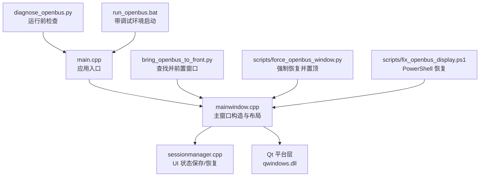
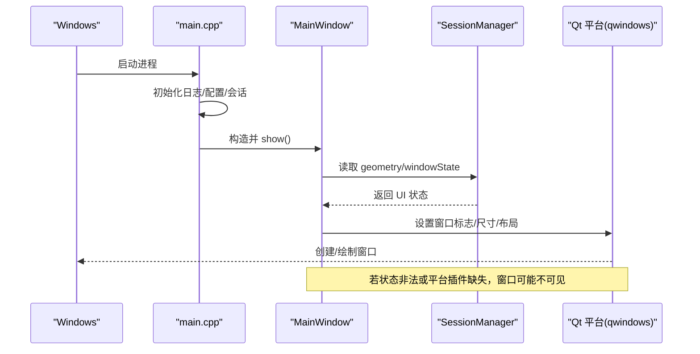
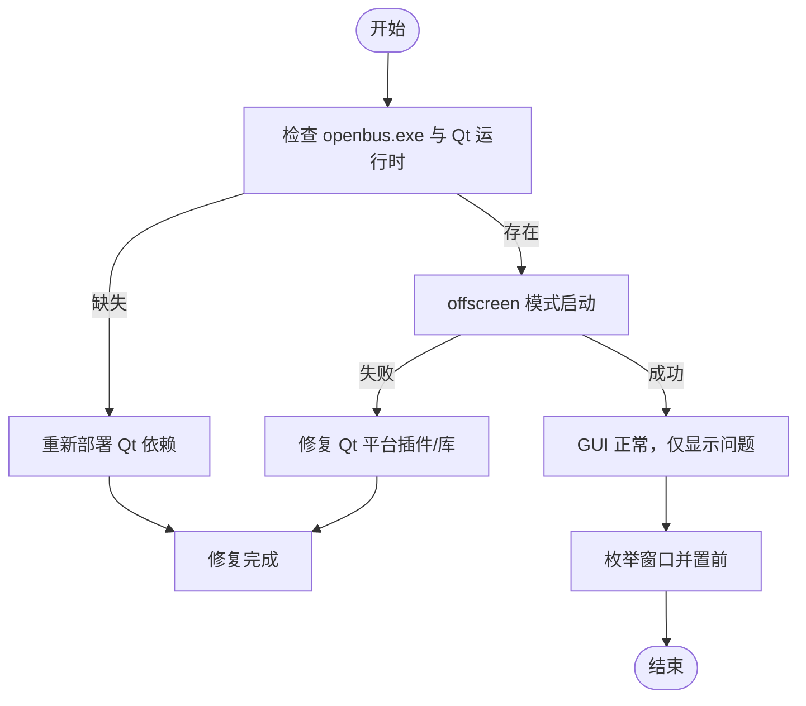
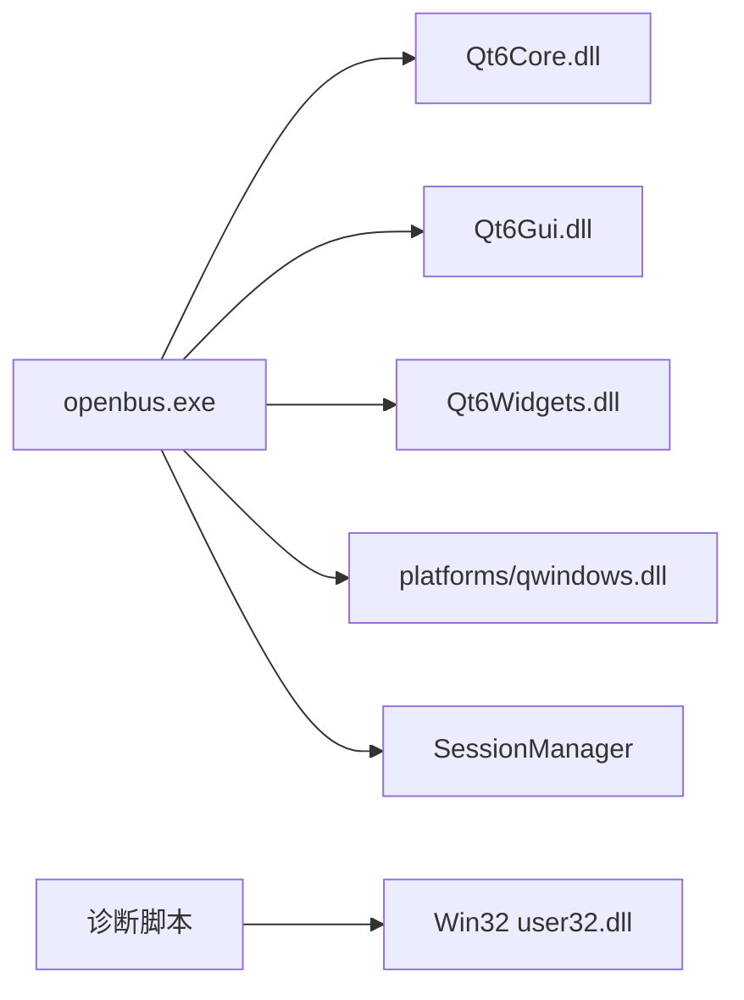

# Windows窗口显示问题诊断与修复

<cite>
**本文引用的文件**
- [src/main.cpp](file://src/main.cpp)
- [src/ui/mainwindow.h](file://src/ui/mainwindow.h)
- [src/ui/mainwindow.cpp](file://src/ui/mainwindow.cpp)
- [src/core/sessionmanager.cpp](file://src/core/sessionmanager.cpp)
- [diagnose_openbus.py](file://diagnose_openbus.py)
- [bring_openbus_to_front.py](file://bring_openbus_to_front.py)
- [scripts/force_openbus_window.py](file://scripts/force_openbus_window.py)
- [scripts/fix_openbus_display.ps1](file://scripts/fix_openbus_display.ps1)
- [run_openbus.bat](file://run_openbus.bat)
</cite>

## 目录
1. [简介](#简介)
2. [项目结构](#项目结构)
3. [核心组件](#核心组件)
4. [架构总览](#架构总览)
5. [详细组件分析](#详细组件分析)
6. [依赖关系分析](#依赖关系分析)
7. [性能与稳定性考量](#性能与稳定性考量)
8. [故障排查指南](#故障排查指南)
9. [结论](#结论)
10. [附录](#附录)

## 简介
本文件聚焦于 openbus 在 Windows 平台上的“窗口不显示/无法置顶/被遮挡”等显示问题的诊断与修复。内容覆盖：
- 启动流程与窗口创建关键点
- 会话状态（geometry/windowState）对窗口位置的影响
- 常见原因定位（Qt 平台插件、DLL 缺失、无边框窗口行为、多显示器布局、进程前台抢占）
- 提供可执行的诊断脚本与恢复手段（Python/PowerShell/BAT）
- 给出针对主程序代码的修复建议与验证步骤

## 项目结构
与窗口显示直接相关的代码与工具主要分布在以下位置：
- 应用入口与初始化：src/main.cpp
- 主窗口与 UI 装配：src/ui/mainwindow.h / src/ui/mainwindow.cpp
- 会话状态持久化：src/core/sessionmanager.cpp
- 诊断与恢复工具：diagnose_openbus.py、bring_openbus_to_front.py、scripts/force_openbus_window.py、scripts/fix_openbus_display.ps1、run_openbus.bat

图示来源
- [src/main.cpp:21-78](file://src/main.cpp#L21-L78)
- [src/ui/mainwindow.cpp:98-154](file://src/ui/mainwindow.cpp#L98-L154)
- [src/core/sessionmanager.cpp:322-347](file://src/core/sessionmanager.cpp#L322-L347)
- [diagnose_openbus.py:50-82](file://diagnose_openbus.py#L50-L82)
- [bring_openbus_to_front.py:28-55](file://bring_openbus_to_front.py#L28-L55)
- [scripts/force_openbus_window.py:41-74](file://scripts/force_openbus_window.py#L41-L74)
- [scripts/fix_openbus_display.ps1:45-68](file://scripts/fix_openbus_display.ps1#L45-L68)
- [run_openbus.bat:6-16](file://run_openbus.bat#L6-L16)

章节来源
- [src/main.cpp:21-78](file://src/main.cpp#L21-L78)
- [src/ui/mainwindow.cpp:98-154](file://src/ui/mainwindow.cpp#L98-L154)
- [src/core/sessionmanager.cpp:322-347](file://src/core/sessionmanager.cpp#L322-L347)

## 核心组件
- 应用入口 main.cpp
  - 注册元类型、初始化日志、加载配置与会话、注册业务模块、应用主题、创建并显示 MainWindow，异常兜底提示。
- 主窗口 MainWindow
  - 构造阶段完成菜单、状态栏、主布局、事件过滤安装；通过模块接口创建各功能页；维护实例表与标签页切换。
  - 关键：窗口标志位（无边框）、布局尺寸、Dock/面板可见性、TopBar 集成。
- 会话管理器 SessionManager
  - 保存/恢复 geometry 与 windowState，以及侧边栏可见性、活动面板等 UI 状态。
- 诊断与恢复工具
  - diagnose_openbus.py：检查可执行与 Qt 运行时、平台插件、尝试 offscreen 模式启动并输出错误。
  - bring_openbus_to_front.py：枚举可见窗口，匹配标题包含 openbus/open bus，恢复并置前。
  - scripts/force_openbus_window.py：获取窗口位置信息，最小化/隐藏时恢复，置前。
  - scripts/fix_openbus_display.ps1：PowerShell 调用 Win32 API 最大化并置前。
  - run_openbus.bat：以调试环境变量启动，便于观察控制台输出。

章节来源
- [src/main.cpp:21-78](file://src/main.cpp#L21-L78)
- [src/ui/mainwindow.h:46-77](file://src/ui/mainwindow.h#L46-L77)
- [src/ui/mainwindow.cpp:98-154](file://src/ui/mainwindow.cpp#L98-L154)
- [src/core/sessionmanager.cpp:322-347](file://src/core/sessionmanager.cpp#L322-L347)
- [diagnose_openbus.py:20-82](file://diagnose_openbus.py#L20-L82)
- [bring_openbus_to_front.py:28-55](file://bring_openbus_to_front.py#L28-L55)
- [scripts/force_openbus_window.py:41-74](file://scripts/force_openbus_window.py#L41-L74)
- [scripts/fix_openbus_display.ps1:45-68](file://scripts/fix_openbus_display.ps1#L45-L68)
- [run_openbus.bat:6-16](file://run_openbus.bat#L6-L16)

## 架构总览
openbus 的窗口显示由“应用入口 → 主窗口构造 → 会话状态恢复 → Qt 平台渲染”构成闭环。若任一环节异常，均可能导致窗口不可见或被遮挡。

图示来源
- [src/main.cpp:21-78](file://src/main.cpp#L21-L78)
- [src/ui/mainwindow.cpp:98-154](file://src/ui/mainwindow.cpp#L98-L154)
- [src/core/sessionmanager.cpp:322-347](file://src/core/sessionmanager.cpp#L322-L347)

## 详细组件分析

### 应用入口与异常处理（main.cpp）
- 作用：负责全局初始化、模块注册、主题应用、窗口创建与显示、异常兜底。
- 风险点：
  - 若在 show() 之前发生异常，窗口不会显示。
  - 未捕获异常会弹出致命错误对话框并退出。
- 建议：
  - 首次启动失败时优先使用 run_openbus.bat 查看控制台输出。
  - 确认日志系统已正确初始化。

章节来源
- [src/main.cpp:21-78](file://src/main.cpp#L21-L78)

### 主窗口构造与布局（mainwindow.h/.cpp）
- 作用：构建菜单栏、状态栏、主布局，安装事件过滤器，连接数据管线与侧边栏，创建模块页面。
- 风险点：
  - 注释掉的无边框标志位会影响拖拽、贴靠等行为；若启用需确保 TopBar 能承载窗口拖动。
  - 布局阶段过早/过晚调用某些方法可能导致控件未就绪。
  - 模块页面创建失败时，相关功能不可用但不一定影响主窗口显示。
- 建议：
  - 逐步启用无边框，并在每次变更后验证拖拽与贴靠。
  - 在 createLayout() 后增加最小化/还原测试，确保窗口可被系统管理。

章节来源
- [src/ui/mainwindow.h:46-77](file://src/ui/mainwindow.h#L46-L77)
- [src/ui/mainwindow.cpp:98-154](file://src/ui/mainwindow.cpp#L98-L154)

### 会话状态恢复（sessionmanager.cpp）
- 作用：保存/恢复 geometry 与 windowState，控制侧边栏可见性与活动面板。
- 风险点：
  - 上次关闭时的 geometry/windowState 可能指向不可见区域（如多显示器移除后）。
  - 恢复顺序不当会导致窗口被置于屏幕外。
- 建议：
  - 在恢复 UI 状态前校验矩形是否在当前可用屏幕范围内。
  - 若检测到无效几何，重置为默认居中并记录日志。

章节来源
- [src/core/sessionmanager.cpp:322-347](file://src/core/sessionmanager.cpp#L322-L347)

### 诊断与恢复工具链
- diagnose_openbus.py
  - 检查可执行与 Qt 运行时 DLL、platforms/qwindows.dll 是否存在。
  - 使用 offscreen 模式启动以捕获错误输出，判断是否为 GUI 初始化失败。
- bring_openbus_to_front.py
  - 枚举可见窗口，匹配标题关键字，调用 ShowWindow + SetForegroundWindow 恢复并置前。
- scripts/force_openbus_window.py
  - 获取窗口位置信息，若最小化/隐藏则恢复，再置前。
- scripts/fix_openbus_display.ps1
  - PowerShell 内联 Win32 API，最大化并置前。
- run_openbus.bat
  - 以 QT_DEBUG=1 启动，便于观察控制台输出。

图示来源
- [diagnose_openbus.py:20-82](file://diagnose_openbus.py#L20-L82)
- [bring_openbus_to_front.py:28-55](file://bring_openbus_to_front.py#L28-L55)
- [scripts/force_openbus_window.py:41-74](file://scripts/force_openbus_window.py#L41-L74)
- [scripts/fix_openbus_display.ps1:45-68](file://scripts/fix_openbus_display.ps1#L45-L68)
- [run_openbus.bat:6-16](file://run_openbus.bat#L6-L16)

章节来源
- [diagnose_openbus.py:20-82](file://diagnose_openbus.py#L20-L82)
- [bring_openbus_to_front.py:28-55](file://bring_openbus_to_front.py#L28-L55)
- [scripts/force_openbus_window.py:41-74](file://scripts/force_openbus_window.py#L41-L74)
- [scripts/fix_openbus_display.ps1:45-68](file://scripts/fix_openbus_display.ps1#L45-L68)
- [run_openbus.bat:6-16](file://run_openbus.bat#L6-L16)

## 依赖关系分析
- 主程序依赖 Qt 平台插件 qwindows.dll 进行窗口创建与渲染。
- 主窗口依赖会话管理器恢复 UI 状态，从而决定窗口几何与可见性。
- 诊断工具依赖 Windows API（user32）进行窗口枚举与状态调整。

图示来源
- [diagnose_openbus.py:29-48](file://diagnose_openbus.py#L29-L48)
- [src/core/sessionmanager.cpp:322-347](file://src/core/sessionmanager.cpp#L322-L347)

章节来源
- [diagnose_openbus.py:29-48](file://diagnose_openbus.py#L29-L48)
- [src/core/sessionmanager.cpp:322-347](file://src/core/sessionmanager.cpp#L322-L347)

## 性能与稳定性考量
- 避免在窗口构造早期进行耗时操作，防止阻塞 UI 线程导致长时间无响应。
- 恢复 UI 状态时应做边界检查，避免将窗口置于不可见区域。
- 使用 offscreen 模式快速定位 GUI 初始化错误，减少交互干扰。
- 对频繁调用的 Win32 API（枚举窗口、置前）应限制频率，避免不必要的系统调用。

[本节为通用指导，不直接分析具体文件]

## 故障排查指南
按优先级从易到难执行以下步骤：

1) 使用诊断脚本快速定位
- 运行 diagnose_openbus.py，检查：
  - openbus.exe 是否存在
  - Qt 运行时 DLL 是否齐全
  - platforms/qwindows.dll 是否存在
  - offscreen 模式是否能启动并输出错误信息
- 参考输出中的 STDERR 行定位缺失库或初始化错误。

章节来源
- [diagnose_openbus.py:20-82](file://diagnose_openbus.py#L20-L82)

2) 使用 PowerShell 恢复窗口
- 运行 scripts/fix_openbus_display.ps1，尝试找到窗口句柄并最大化、置前。
- 若找不到窗口，说明进程可能未启动或崩溃。

章节来源
- [scripts/fix_openbus_display.ps1:45-68](file://scripts/fix_openbus_display.ps1#L45-L68)

3) 使用 Python 工具强制置前
- 运行 scripts/force_openbus_window.py 或 bring_openbus_to_front.py，自动枚举可见窗口并恢复/置前。
- 适用于窗口被其他程序遮挡或处于最小化状态。

章节来源
- [scripts/force_openbus_window.py:41-74](file://scripts/force_openbus_window.py#L41-L74)
- [bring_openbus_to_front.py:28-55](file://bring_openbus_to_front.py#L28-L55)

4) 检查会话状态导致的“窗口跑到屏幕外”
- 删除或清理上次会话保存的 geometry/windowState，让程序以默认位置启动。
- 在多显示器环境下，确保当前屏幕范围包含窗口矩形。

章节来源
- [src/core/sessionmanager.cpp:322-347](file://src/core/sessionmanager.cpp#L322-L347)

5) 检查无边框窗口行为
- 若启用了无边框，请确认 TopBar 支持拖拽；必要时临时禁用无边框验证是否为 UI 框架问题。
- 验证 Aero Snap 与任务栏行为是否正常。

章节来源
- [src/ui/mainwindow.cpp:109-111](file://src/ui/mainwindow.cpp#L109-L111)

6) 使用批处理带调试启动
- 运行 run_openbus.bat，观察控制台输出，定位启动期异常。

章节来源
- [run_openbus.bat:6-16](file://run_openbus.bat#L6-L16)

## 结论
- 大多数“窗口不显示”问题源于：Qt 运行时/平台插件缺失、会话状态非法、无边框 UI 未正确处理、窗口被遮挡或位于不可见屏幕区域。
- 推荐流程：先用 diagnose_openbus.py 排除运行时问题，再用 PowerShell/Python 工具恢复窗口，最后检查会话状态与无边框配置。
- 若问题复现，建议在主程序中增加更严格的几何校验与日志记录，提升可观测性。

[本节为总结性内容，不直接分析具体文件]

## 附录
- 常用命令速查
  - 诊断：python diagnose_openbus.py
  - 强制置前：python scripts/force_openbus_window.py
  - 快速恢复：powershell -File scripts/fix_openbus_display.ps1
  - 调试启动：双击 run_openbus.bat

[本节为补充信息，不直接分析具体文件]