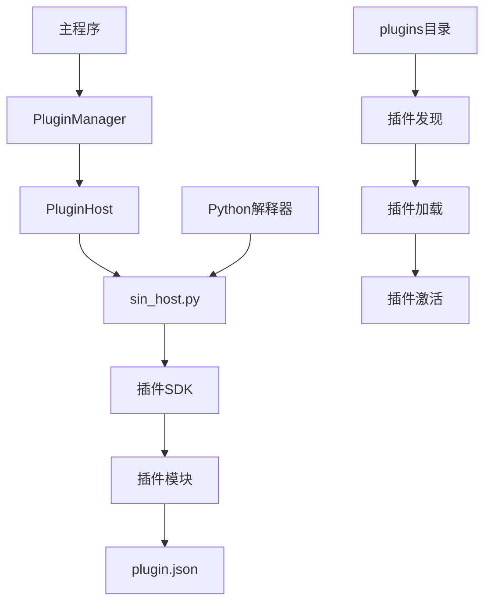
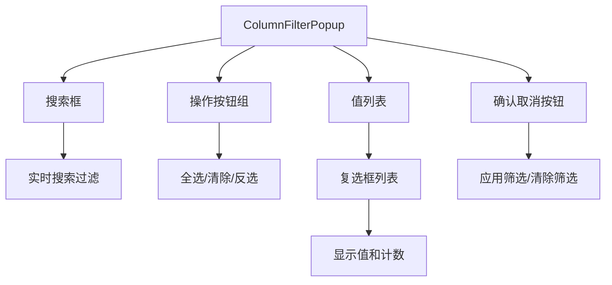
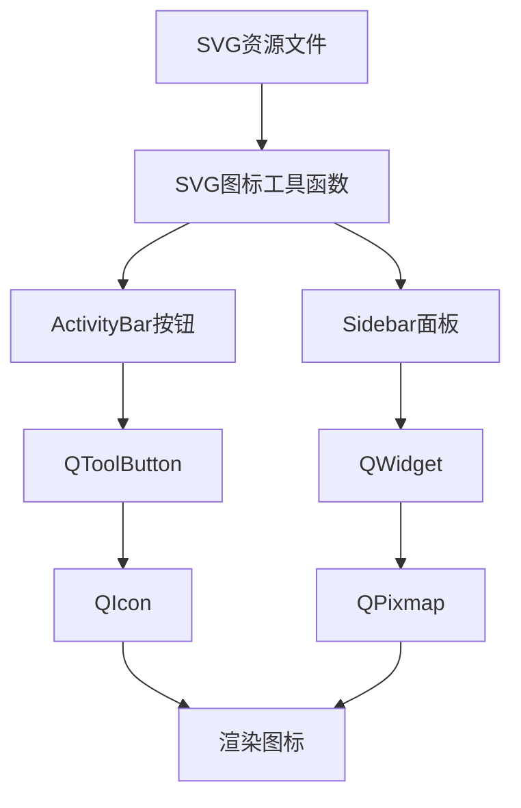
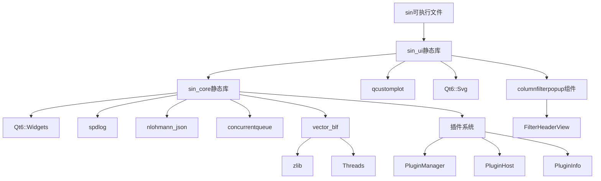

# CMake构建配置

<cite>
**本文引用的文件**
- [CMakeLists.txt](file://CMakeLists.txt)
- [src/CMakeLists.txt](file://src/CMakeLists.txt)
- [third_party/Dependencies.cmake](file://third_party/Dependencies.cmake)
- [resources/resources.qrc](file://resources/resources.qrc)
- [src/utils/svg_icon.h](file://src/utils/svg_icon.h)
- [src/ui/activitybar.cpp](file://src/ui/activitybar.cpp)
- [src/ui/columnfilterpopup.h](file://src/ui/columnfilterpopup.h)
- [src/ui/columnfilterpopup.cpp](file://src/ui/columnfilterpopup.cpp)
- [src/ui/filterheaderview.h](file://src/ui/filterheaderview.h)
- [src/ui/filterheaderview.cpp](file://src/ui/filterheaderview.cpp)
- [src/core/plugin/pluginmanager.h](file://src/core/plugin/pluginmanager.h)
- [src/core/plugin/pluginhost.h](file://src/core/plugin/pluginhost.h)
- [src/core/plugin/plugininfo.h](file://src/core/plugin/plugininfo.h)
- [scripts/sin_host.py](file://scripts/sin_host.py)
- [plugins/frame-counter/plugin.json](file://plugins/frame-counter/plugin.json)
- [plugins/hello-world/plugin.json](file://plugins/hello-world/plugin.json)
- [sdk/sin/__init__.py](file://sdk/sin/__init__.py)
</cite>

## 更新摘要
**所做更改**
- 新增插件系统核心组件到构建配置，包括PluginManager、PluginHost和PluginInfo类
- 更新CMakeLists.txt以集成Python插件宿主的编译和部署流程
- 添加插件发现机制，支持动态加载Python插件模块
- 实现插件生命周期管理，包括激活、停用和事件处理
- 增强构建脚本以支持插件系统的完整构建流程

## 目录
1. [项目概述](#项目概述)
2. [根目录CMakeLists.txt配置](#根目录cmakeliststxt配置)
3. [src/CMakeLists.txt核心配置](#srccmakeliststxt核心配置)
4. [插件系统架构](#插件系统架构)
5. [Excel风格列筛选系统](#excel风格列筛选系统)
6. [SVG图标系统集成](#svg图标系统集成)
7. [设备驱动支持配置](#设备驱动支持配置)
8. [第三方库依赖管理](#第三方库依赖管理)
9. [平台特定配置](#平台特定配置)
10. [构建优化配置](#构建优化配置)
11. [安装目标配置](#安装目标配置)

## 项目概述

本项目是一个基于Qt6的CAN总线报文分析工具，采用模块化架构设计。CMake构建系统支持多平台编译，包括Windows、macOS和Linux。项目结构清晰，分为core（核心逻辑）、models（数据模型）、ui（用户界面）和utils（工具函数）四个主要层次。**新增完整的Python插件系统支持**，允许通过Python扩展功能，提供动态加载和执行外部功能的强大能力。

**章节来源**
- [CMakeLists.txt:1-7](file://CMakeLists.txt#L1-L7)

## 根目录CMakeLists.txt配置

### 项目基础设置
```cmake
cmake_minimum_required(VERSION 3.21)

project(sin
    VERSION 0.1.0
    DESCRIPTION "报文解析、分析、回放、录制、trace、graphic 桌面软件"
    LANGUAGES CXX
)
```

### C++标准配置
项目使用C++17标准，禁用扩展以确保跨平台兼容性：
- `CMAKE_CXX_STANDARD`: 设置为17
- `CMAKE_CXX_STANDARD_REQUIRED`: 强制要求C++17
- `CMAKE_CXX_EXTENSIONS`: 关闭编译器扩展

### Qt自动化处理
启用Qt的自动MOC、UIC和RCC处理：
- `CMAKE_AUTOMOC`: 自动生成元对象代码
- `CMAKE_AUTOUIC`: 自动生成UI类
- `CMAKE_AUTORCC`: 自动处理资源文件

### Qt6组件查找配置
**已更新** 新增Qt6 Svg组件支持，用于SVG图标渲染功能：
```cmake
find_package(Qt6 REQUIRED COMPONENTS Widgets PrintSupport Svg)
```

支持的Qt6组件包括：
- **Widgets**: 图形界面框架
- **PrintSupport**: 打印支持
- **Svg**: SVG图标渲染支持

### 输出目录配置
所有可执行文件输出到`bin`目录：
```cmake
set(CMAKE_RUNTIME_OUTPUT_DIRECTORY ${CMAKE_BINARY_DIR}/bin)
```

**章节来源**
- [CMakeLists.txt:9-14](file://CMakeLists.txt#L9-L14)
- [CMakeLists.txt:16-21](file://CMakeLists.txt#L16-L21)
- [CMakeLists.txt:40-45](file://CMakeLists.txt#L40-L45)
- [CMakeLists.txt:37](file://CMakeLists.txt#L37)

## src/CMakeLists.txt核心配置

### 源文件组织结构

#### Core层源文件
Core层包含核心业务逻辑，按功能模块组织：
- **数据结构**: canframe.h, dbcdata.h
- **录制回放**: recorder.cpp, player.cpp, cansimulator.cpp
- **DBC处理**: dbcmanager.cpp, dbc_adapter.cpp
- **过滤引擎**: filter_engine.cpp
- **应用配置**: appconfig.cpp
- **项目管理**: projectmanager.cpp
- **日志系统**: logging.cpp
- **插件系统**: plugininfo.h/cpp, pluginhost.h/cpp, pluginmanager.h/cpp (**新增**)

#### CanFileIO模块源文件
新增的canfileio模块支持多种文件格式：
- **接口定义**: canfileio.h, canfileio.cpp
- **工厂模式**: canfileio_factory.h, canfileio_factory.cpp
- **BLF格式**: blf.h, blf.cpp (Vector二进制格式)
- **ASC格式**: asc.h, asc.cpp (Vector文本格式)
- **CSV格式**: csv.h, csv.cpp (通用文本格式)
- **PCAP格式**: pcap_reader.h, pcap_reader.cpp (网络捕获格式)
- **TRC格式**: trc_reader.h, trc_reader.cpp (Vector旧版格式)

#### Models层源文件
Qt数据模型实现：
- cantracemodel.h/cpp: CAN轨迹数据模型
- canfilterproxymodel.h/cpp: 过滤器代理模型

#### Utils层源文件
工具函数库：
- canutils.h/cpp: CAN总线工具函数
- message_queue.h: 消息队列实现
- logging.h: 日志工具
- **svg_icon.h**: SVG图标渲染工具

#### UI层源文件
完整的用户界面组件：
- 主窗口: mainwindow.h/cpp
- 视图组件: traceview.h/cpp, graphicview.h/cpp
- 控制面板: activitybar.h/cpp, bottompanel.h/cpp, rightpanel.h/cpp
- 对话框: signalconfigdialog.h/cpp, dbcimportdialog.h/cpp, settingsdialog.h/cpp
- 标签页: signalsendtab.h/cpp, playbacktab.h/cpp, recordtab.h/cpp, dbcdetailtab.h/cpp
- 特殊视图: udsview.h/cpp, canopenview.h/cpp
- 主题管理: thememanager.h/cpp
- 测量设置: measurementsetupview.h/cpp
- **列筛选**: columnfilterpopup.h/cpp (新增)
- **表头视图**: filterheaderview.h/cpp (增强)

**章节来源**
- [src/CMakeLists.txt:5-87](file://src/CMakeLists.txt#L5-L87)
- [src/CMakeLists.txt:89-169](file://src/CMakeLists.txt#L89-L169)

### 静态库构建配置

#### sin_core静态库
核心功能库，包含所有业务逻辑：
```cmake
add_library(sin_core STATIC
    ${SRC_CORE}
    ${SRC_MODELS}
    ${SRC_UTILS}
)
```

#### sin_ui静态库
用户界面库，独立于核心逻辑：
```cmake
add_library(sin_ui STATIC
    ${SRC_UI}
)
```

### 依赖链接配置

#### PUBLIC依赖
对外暴露的头文件和库：
- Qt6::Widgets: Qt图形界面框架
- spdlog: 日志库
- nlohmann_json: JSON解析库
- concurrentqueue: 并发队列库

#### PRIVATE依赖
内部使用的库，不对外暴露：
- vector_blf: Vector BLF文件格式库
- qcustomplot: 图表绘制库
- **Qt6::Svg**: SVG图标渲染支持

**章节来源**
- [src/CMakeLists.txt:175-179](file://src/CMakeLists.txt#L175-L179)
- [src/CMakeLists.txt:258-260](file://src/CMakeLists.txt#L258-L260)
- [src/CMakeLists.txt:210-215](file://src/CMakeLists.txt#L210-L215)
- [src/CMakeLists.txt:270-273](file://src/CMakeLists.txt#L270-L273)

## 插件系统架构

### 插件系统整体架构

**新增** 项目实现了完整的Python插件系统，支持动态加载和执行外部功能：



### 插件管理器核心组件

#### PluginManager - 插件管理器
负责插件的发现、生命周期管理和消息分发：
- **插件发现**: 扫描`plugins/`目录，读取每个插件的`plugin.json`配置文件
- **生命周期管理**: 控制插件的激活、停用的状态转换
- **事件分发**: 将CAN帧、命令等事件转发给相应的插件
- **进程管理**: 启动和管理Python宿主进程

#### PluginHost - 插件宿主
管理Python宿主进程的通信：
- **进程启动**: 启动独立的Python进程运行`sing_host.py`
- **JSON-RPC通信**: 通过stdin/stdout与宿主进程进行JSON-RPC 2.0通信
- **错误处理**: 处理宿主进程崩溃和通信异常

#### PluginInfo - 插件信息
描述插件的元数据和配置：
- **基本信息**: 名称、版本、作者、描述
- **激活事件**: 定义插件在何时被激活（onStartup、onFrame、onCommand等）
- **贡献点**: 声明插件提供的功能（命令、文件格式等）

**章节来源**
- [src/core/plugin/pluginmanager.h:17-25](file://src/core/plugin/pluginmanager.h#L17-L25)
- [src/core/plugin/plugininfo.h:8-53](file://src/core/plugin/plugininfo.h#L8-L53)
- [scripts/sin_host.py:1-10](file://scripts/sin_host.py#L1-L10)

### 插件发现机制

插件系统通过以下步骤发现可用插件：

1. **目录扫描**: 扫描`plugins/`目录下的所有子目录
2. **配置文件读取**: 读取每个插件目录中的`plugin.json`文件
3. **元数据验证**: 验证插件配置文件的完整性和有效性
4. **重复检测**: 防止同名插件冲突

```cpp
void PluginManager::discoverPlugins() {
    // 查找插件目录
    QString pluginsDir = findAppBaseDir() + "/plugins";
    
    if (!pluginsDir.exists()) {
        spdlog::info("PluginManager: 插件目录不存在");
        return;
    }
    
    // 扫描插件目录
    QStringList entries = pluginsDir.entryList(QDir::Dirs | QDir::NoDotAndDotDot);
    for (const auto &entry : entries) {
        QString pluginDir = pluginsDir.absoluteFilePath(entry);
        PluginInfo info;
        if (info.loadFromDirectory(pluginDir)) {
            m_plugins.insert(info.name, info);
        }
    }
}
```

### 插件生命周期管理

插件系统支持完整的生命周期管理：

#### 激活阶段
- **onStartup**: 应用程序启动时激活
- **onFrame**: 接收到CAN帧时激活
- **onCommand**: 执行特定命令时激活

#### 运行阶段
- **帧处理**: 接收并处理CAN帧数据
- **命令执行**: 响应主程序的命令请求
- **状态维护**: 保持插件的内部状态

#### 停用阶段
- **资源清理**: 释放插件占用的资源
- **状态保存**: 可选地保存插件状态

**章节来源**
- [src/core/plugin/pluginmanager.cpp:145-183](file://src/core/plugin/pluginmanager.cpp#L145-L183)
- [src/core/plugin/pluginmanager.cpp:226-238](file://src/core/plugin/pluginmanager.cpp#L226-L238)
- [src/core/plugin/pluginmanager.cpp:240-278](file://src/core/plugin/pluginmanager.cpp#L240-L278)

### Python宿主进程通信

插件系统通过JSON-RPC 2.0协议与Python宿主进程通信：

#### 通信协议
- **传输方式**: stdin/stdout管道
- **数据格式**: newline-delimited JSON
- **协议版本**: JSON-RPC 2.0

#### 消息类型
- **activate/deactivate**: 插件生命周期控制
- **frameReceived**: CAN帧数据传递
- **executeCommand**: 命令执行请求
- **output.append**: 输出消息
- **registerCommand**: 命令注册

#### 错误处理
- **进程崩溃检测**: 监控宿主进程状态
- **通信异常处理**: 处理JSON解析和传输错误
- **插件异常隔离**: 单个插件错误不影响其他插件

**章节来源**
- [scripts/sin_host.py:225-261](file://scripts/sin_host.py#L225-L261)
- [scripts/sin_host.py:276-305](file://scripts/sin_host.py#L276-L305)

### 插件SDK接口

插件通过Python SDK与主程序交互：

#### 核心API
- **sin.output**: 输出消息到主程序面板
- **sin.frames**: 访问CAN帧数据
- **sin.commands**: 注册和执行命令
- **sin.workspace**: 工作区操作
- **sin.signals**: 信号处理

#### UI支持
- **PyQt6集成**: 可选的GUI功能支持
- **窗口管理**: 插件自定义界面的创建和管理
- **事件循环**: 与Qt事件系统集成的能力

**章节来源**
- [sdk/sin/__init__.py:1-31](file://sdk/sin/__init__.py#L1-L31)
- [plugins/frame-counter/main.py:1-54](file://plugins/frame-counter/main.py#L1-L54)

## Excel风格列筛选系统

### ColumnFilterPopup组件架构

**新增** 实现了完整的Excel风格列筛选弹出面板，提供强大的数据过滤功能：



### 核心功能特性

#### 搜索功能
- 实时搜索：输入时立即过滤显示结果
- 大小写不敏感搜索
- 支持部分匹配

#### 批量操作
- **全选**：选择所有当前可见项
- **清除**：取消选择所有当前可见项  
- **反选**：切换当前可见项的选择状态

#### 值显示
- 显示原始值文本
- 显示出现次数统计
- 支持复选框状态管理

### 信号与槽机制

**已更新** ColumnFilterPopup提供了完整的信号接口：

```cpp
signals:
    void filterApplied(int column, const QSet<QString> &selected);
    void filterCleared(int column);
```

### FilterHeaderView集成

**已更新** 表头视图集成了漏斗图标和排序指示器：

```cpp
// 自定义绘制漏斗图标
void drawFilterIcon(QPainter *painter, const QRect &rect,
                    bool active, bool hovered) const;

// 检测漏斗图标点击区域
int sectionAtFilter(const QPoint &pos) const;
```

### 用户界面设计

#### 布局结构
- **顶部**：搜索框，支持清空按钮
- **中部**：全选/清除/反选按钮行
- **主体**：可滚动的值列表，最大高度300px
- **底部**：清除筛选和确定按钮

#### 视觉样式
- 白色背景，灰色边框
- 激活状态蓝色高亮
- 悬停状态深灰色提示
- 始终可见的浅灰色漏斗图标

**章节来源**
- [src/ui/columnfilterpopup.h:15-85](file://src/ui/columnfilterpopup.h#L15-L85)
- [src/ui/columnfilterpopup.cpp:18-79](file://src/ui/columnfilterpopup.cpp#L18-L79)
- [src/ui/filterheaderview.h:8-69](file://src/ui/filterheaderview.h#L8-L69)
- [src/ui/filterheaderview.cpp:181-229](file://src/ui/filterheaderview.cpp#L181-L229)

## SVG图标系统集成

### SVG图标渲染架构

项目实现了完整的SVG图标系统，支持动态颜色渲染和双状态图标显示：



### SVG图标工具函数

**新增** SVG图标渲染工具提供了灵活的图标处理能力：

```cpp
// 读取 SVG 文件，替换 currentColor 为指定颜色，渲染为 QPixmap
inline QPixmap renderSvgPixmap(const QString &resourcePath, const QString &color, int size = 22)
{
    QFile file(resourcePath);
    if (!file.open(QIODevice::ReadOnly))
        return {};
    QString svg = QString::fromUtf8(file.readAll());
    svg.replace(QStringLiteral("currentColor"), color);
    QSvgRenderer renderer(svg.toUtf8());
    QPixmap pixmap(size, size);
    pixmap.fill(Qt::transparent);
    QPainter painter(&pixmap);
    painter.setRenderHint(QPainter::Antialiasing);
    renderer.render(&painter);
    return pixmap;
}
```

### ActivityBar中的SVG图标使用

**已更新** ActivityBar使用SVG图标实现双状态显示：

```cpp
static QIcon makeActivityIcon(const QString &resourcePath)
{
    QIcon icon;
    icon.addPixmap(renderSvgPixmap(resourcePath, "#858585", 24), QIcon::Normal, QIcon::Off);
    icon.addPixmap(renderSvgPixmap(resourcePath, "#c8c8c8", 24), QIcon::Active, QIcon::Off);
    icon.addPixmap(renderSvgPixmap(resourcePath, "#ffffff", 24), QIcon::Normal, QIcon::On);
    return icon;
}
```

### 资源文件管理

**已更新** QRC资源文件包含了所有SVG图标：

```xml
<RCC>
    <qresource prefix="/">
        <file>styles/default.qss</file>
        <file>styles/theme.qss</file>
        <file>icons/project.svg</file>
        <file>icons/trace.svg</file>
        <file>icons/graphic.svg</file>
        <file>icons/database.svg</file>
        <file>icons/send.svg</file>
        <file>icons/record.svg</file>
        <file>icons/device.svg</file>
        <file>icons/protocol.svg</file>
        <file>icons/flow.svg</file>
        <file>icons/tools.svg</file>
        <file>icons/settings.svg</file>
        <file>icons/file.svg</file>
    </qresource>
</RCC>
```

**章节来源**
- [src/utils/svg_icon.h:11-31](file://src/utils/svg_icon.h#L11-L31)
- [src/ui/activitybar.cpp:8-15](file://src/ui/activitybar.cpp#L8-L15)
- [resources/resources.qrc:1-19](file://resources/resources.qrc#L1-L19)
- [src/CMakeLists.txt:270-273](file://src/CMakeLists.txt#L270-L273)

## 设备驱动支持配置

### 驱动DLL自动复制机制

**已更新** 改进了设备驱动的构建后处理：

```cmake
if(EXISTS "${CMAKE_SOURCE_DIR}/driver")
    add_custom_command(TARGET sin POST_BUILD
        COMMAND ${CMAKE_COMMAND} -E copy_directory
                "${CMAKE_SOURCE_DIR}/driver"
                "$<TARGET_FILE_DIR:sin>"
        COMMENT "Copying driver DLLs to output directory"
    )
    # 安装规则 — 安装包包含驱动 DLL
    install(DIRECTORY "${CMAKE_SOURCE_DIR}/driver/"
            DESTINATION bin
            FILES_MATCHING PATTERN "*.dll"
    )
endif()
```

### ZLG设备驱动支持

项目集成了ZLG USB-CAN设备的完整驱动支持：
- **内核驱动**: kerneldlls目录下包含各种设备驱动
- **配置文件**: devices_property目录包含设备属性配置
- **头文件**: zlgcan.h提供API接口定义

### 驱动目录结构

```
driver/
├── kerneldlls/
│   ├── ZPS/
│   │   ├── resources/
│   │   └── source/
│   ├── devices_property/
│   ├── USBCAN.xml
│   ├── VCI_USBCAN2.xml
│   └── dll_cfg.ini
└── zlgcan.h
```

**章节来源**
- [src/CMakeLists.txt:345-357](file://src/CMakeLists.txt#L345-357)

## 第三方库依赖管理

### vector_blf库配置

vector_blf库是Vector BLF文件格式的C++实现，采用GPL-3.0许可证：

```cmake
# 查找zlib依赖
find_package(ZLIB QUIET)
if(NOT ZLIB_FOUND OR NOT ZLIB_LIBRARY OR ZLIB_LIBRARY STREQUAL "ZLIB_LIBRARY-NOTFOUND")
    # 回退到MinGW自带zlib
    set(ZLIB_INCLUDE_DIRS "D:/Qt/Tools/mingw1310_64/x86_64-w64-mingw32/include")
    set(ZLIB_LIBRARIES "D:/Qt/Tools/mingw1310_64/x86_64-w64-mingw32/lib/libz.a")
endif()

# 生成配置文件
configure_file(
    ${CMAKE_CURRENT_SOURCE_DIR}/src/Vector/BLF/config.h.in
    ${CMAKE_CURRENT_BINARY_DIR}/src/Vector/BLF/config.h
    COPYONLY
)

# 生成导出头文件
file(WRITE ${CMAKE_CURRENT_BINARY_DIR}/src/Vector/BLF/vector_blf_export.h
"#pragma once
#define VECTOR_BLF_EXPORT
#define VECTOR_BLF_NO_EXPORT
#define VECTOR_BLF_DEPRECATED
")

# 收集源文件并构建静态库
file(GLOB VECTOR_BLF_SOURCES "${CMAKE_CURRENT_SOURCE_DIR}/src/Vector/BLF/*.cpp")
add_library(vector_blf STATIC ${VECTOR_BLF_SOURCES})

# 链接依赖库
target_link_libraries(vector_blf PUBLIC Threads::Threads ${ZLIB_LIBRARIES})
```

### 其他第三方库

#### spdlog日志库
- **用途**: 高性能C++日志库
- **集成方式**: 直接包含头文件
- **路径**: third_party/spdlog/include

#### nlohmann_json JSON库
- **用途**: 现代C++ JSON解析库
- **集成方式**: 单头文件库
- **路径**: third_party/nlohmann_json

#### concurrentqueue并发队列
- **用途**: 无锁并发队列实现
- **集成方式**: 单头文件库
- **路径**: third_party/concurrentqueue

#### qcustomplot图表库
- **用途**: Qt图表绘制库
- **集成方式**: 静态库链接
- **用途**: 仅graphicview.cpp使用

**章节来源**
- [third_party/Dependencies.cmake:1-32](file://third_party/Dependencies.cmake#L1-L32)
- [src/CMakeLists.txt:210-220](file://src/CMakeLists.txt#L210-L220)

## 平台特定配置

### Windows平台配置

#### GUI程序设置
```cmake
if(WIN32)
    set_target_properties(sin PROPERTIES
        WIN32_EXECUTABLE TRUE
    )
endif()
```

#### 链接器配置
**已更新** 移除了LLD链接器的使用，改用默认的ld.bfd链接器以获得更好的兼容性：
```cmake
if(WIN32 AND CMAKE_CXX_COMPILER_ID STREQUAL "GNU")
    message(STATUS "使用默认 ld.bfd 链接器")
endif()
```

### macOS和Linux平台
- 默认使用系统提供的编译器
- 依赖库通过包管理器或源码编译获取
- 无需特殊的GUI程序设置

**章节来源**
- [CMakeLists.txt:30-32](file://CMakeLists.txt#L30-L32)
- [src/CMakeLists.txt:334-338](file://src/CMakeLists.txt#L334-L338)

## 构建优化配置

### 预编译头(PCH)优化

#### Core层PCH配置
针对核心层使用精简的Qt头文件列表：
```cmake
target_precompile_headers(sin_core PRIVATE
    <QObject>
    <QString>
    <QStringList>
    <QVariant>
    <QList>
    <QHash>
    <QVector>
    <QPair>
    <QMetaType>
    <QByteArray>
    <QTimer>
    <QThread>
    <QFile>
    <QDataStream>
    <QDir>
    <QFileInfo>
    <QRegularExpression>
    <QStandardPaths>
    <QTextStream>
    <QColor>
    <QRandomGenerator>
    <QStringConverter>
    <QAbstractTableModel>
    <QSortFilterProxyModel>
    <vector>
    <string>
    <memory>
    <functional>
)
```

#### UI层PCH配置
针对UI层使用完整的Qt Widget头文件列表：
```cmake
target_precompile_headers(sin_ui PRIVATE
    <QWidget>
    <QMainWindow>
    <QVBoxLayout>
    <QHBoxLayout>
    <QSplitter>
    <QToolBar>
    <QAction>
    <QMenu>
    <QMenuBar>
    <QStatusBar>
    <QLabel>
    <QPushButton>
    <QToolButton>
    <QTreeWidget>
    <QTableWidget>
    <QListWidget>
    <QComboBox>
    <QLineEdit>
    <QCheckBox>
    <QHeaderView>
    <QDockWidget>
    <QTabWidget>
    <QFileDialog>
    <QMessageBox>
    <QCloseEvent>
    <QMouseEvent>
    <QApplication>
    <QSettings>
    <QJsonDocument>
    <QJsonObject>
    <QJsonArray>
    <QDateTime>
    <QTimer>
    <QThread>
    <QFileInfo>
    <QDebug>
    <vector>
    <string>
    <memory>
    <functional>
)
```

### 编译器优化选项

#### Debug构建优化
- 使用默认调试级别
- 提升编译和链接速度

#### Release构建优化
- 使用默认的优化级别
- 移除调试信息

**章节来源**
- [src/CMakeLists.txt:223-252](file://src/CMakeLists.txt#L223-L252)
- [src/CMakeLists.txt:276-317](file://src/CMakeLists.txt#L276-L317)

## 安装目标配置

### 可执行文件安装
```cmake
install(TARGETS sin
    RUNTIME DESTINATION bin
)
```

### 库文件安装
当前配置未包含库文件的安装规则，如需安装sin_core和sin_ui库，可以添加：
```cmake
install(TARGETS sin_core sin_ui
    ARCHIVE DESTINATION lib
    LIBRARY DESTINATION lib
)
```

### 头文件安装
如需安装公共头文件，可以添加：
```cmake
install(DIRECTORY core/ models/ utils/
    DESTINATION include/sin
    FILES_MATCHING PATTERN "*.h"
)
```

### 驱动文件安装
**已更新** 改进了驱动文件的安装规则：
```cmake
install(DIRECTORY "${CMAKE_SOURCE_DIR}/driver/"
        DESTINATION bin
        FILES_MATCHING PATTERN "*.dll"
)
```

### 插件系统安装
**新增** 插件系统的安装配置：
- **插件目录**: 自动复制`plugins/`目录到安装位置
- **SDK模块**: 包含Python SDK供插件开发使用
- **宿主脚本**: 部署`sing_host.py`到安装目录

**章节来源**
- [CMakeLists.txt:60-62](file://CMakeLists.txt#L60-L62)
- [src/CMakeLists.txt:362-364](file://src/CMakeLists.txt#L362-L364)
- [src/CMakeLists.txt:352-357](file://src/CMakeLists.txt#L352-L357)

## 构建流程总结

### 依赖关系图


### 构建步骤
1. **配置阶段**: CMake检查依赖项并生成构建系统
2. **编译阶段**: 
   - 先编译sin_core核心库（包含插件系统）
   - 再编译sin_ui界面库（包含新的columnfilterpopup组件）
   - 最后链接sin可执行文件
3. **链接阶段**: 链接所有依赖库生成最终可执行文件
4. **安装阶段**: 将可执行文件、驱动文件和插件系统安装到指定目录

### 性能优化效果
- **编译时间**: 通过PCH和优化选项减少编译时间
- **链接时间**: 使用默认链接器确保稳定性
- **内存占用**: 精简调试信息减少内存占用
- **启动时间**: 优化的二进制文件提升应用程序启动速度
- **用户体验**: 新增的列筛选功能和插件系统提供更高效的数据过滤能力和扩展性

**章节来源**
- [src/CMakeLists.txt:175-179](file://src/CMakeLists.txt#L175-L179)
- [src/CMakeLists.txt:322-329](file://src/CMakeLists.txt#L322-L329)
- [src/CMakeLists.txt:81-87](file://src/CMakeLists.txt#L81-L87)