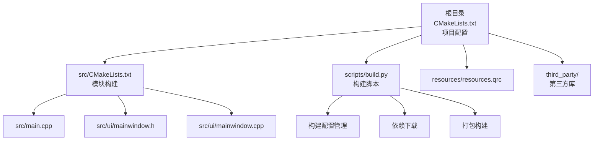
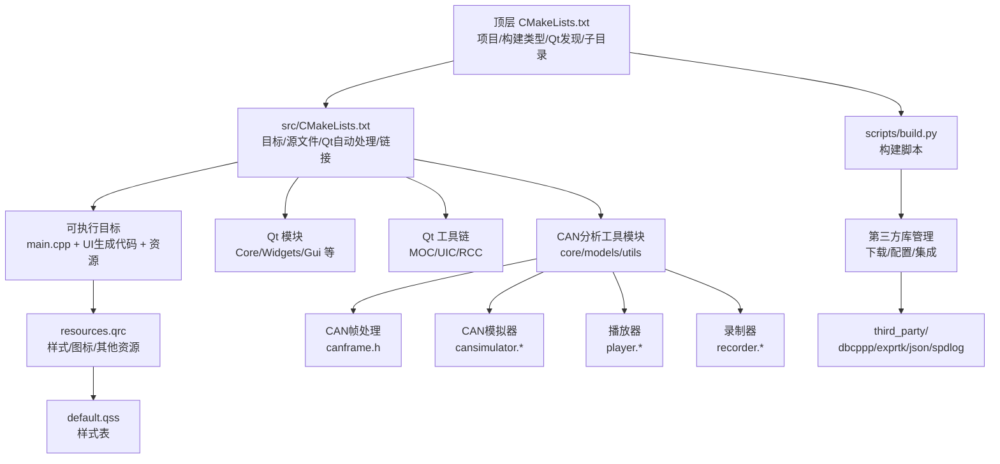
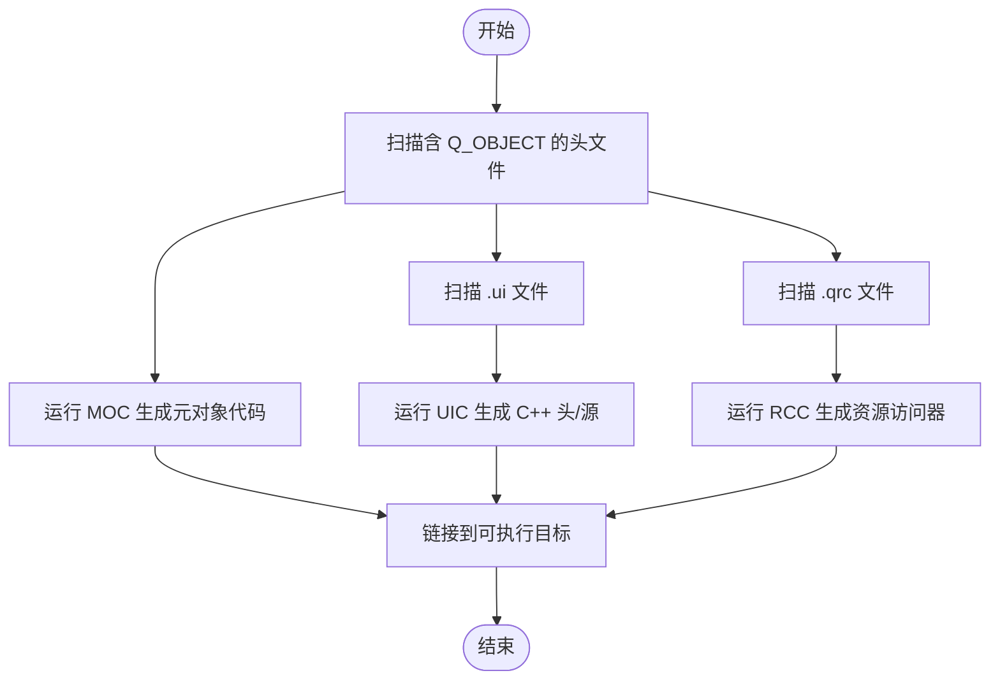
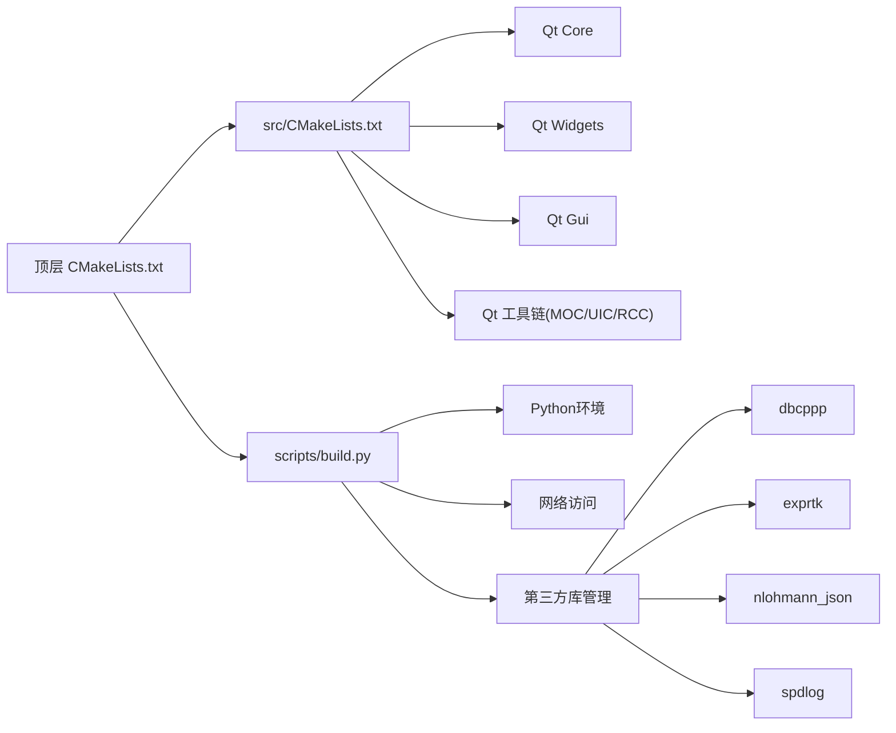

# CMake构建配置

<cite>
**本文档引用的文件**   
- [CMakeLists.txt](file://CMakeLists.txt)
- [src/CMakeLists.txt](file://src/CMakeLists.txt)
- [scripts/build.py](file://scripts/build.py)
- [src/main.cpp](file://src/main.cpp)
- [resources/resources.qrc](file://resources/resources.qrc)
</cite>

## 更新摘要
**所做更改**   
- 基于构建系统重大修改更新了文档，包括主CMakeLists.txt、src/CMakeLists.txt和scripts/build.py的变更
- 新增了第三方库集成和组件管理的详细说明
- 增强了构建脚本的功能描述和自动化流程
- 完善了跨平台构建配置的差异说明
- 添加了新的依赖管理和版本控制策略

## 目录
1. [简介](#简介)
2. [项目结构](#项目结构)
3. [核心组件](#核心组件)
4. [架构总览](#架构总览)
5. [详细组件分析](#详细组件分析)
6. [第三方库集成](#第三方库集成)
7. [构建脚本自动化](#构建脚本自动化)
8. [依赖分析](#依赖分析)
9. [性能考虑](#性能考虑)
10. [故障排查指南](#故障排查指南)
11. [结论](#结论)
12. [附录](#附录)

## 简介
本文件面向使用 CMake + Qt 的桌面应用构建与打包，系统性说明双CMake结构（根目录 CMakeLists.txt 与 src/CMakeLists.txt）的配置结构与最佳实践。内容涵盖：
- Qt 模块依赖发现与链接
- 编译器选项、目标平台与构建类型设置
- find_package 的使用方式与版本策略
- 库链接与源文件组织
- Windows、macOS、Linux 的平台差异与示例
- 自定义构建规则与安装目标的配置方法
- **新增** 第三方库集成和构建脚本自动化

## 项目结构
本项目采用"顶层 CMake + 子目录 CMake"的双层分组织方式：
- **顶层 CMakeLists.txt**：定义项目元信息、全局编译选项、Qt 发现与启用、资源处理、子目录包含与安装入口。负责项目的整体配置和跨平台兼容性设置。
- **src/CMakeLists.txt**：定义可执行目标、Qt 自动处理（MOC/UIS/RCC）、源文件集合、链接 Qt 模块、平台特定选项与安装规则。专注于具体模块的构建逻辑。
- **scripts/build.py**：自动化构建脚本，提供跨平台构建、依赖下载和打包功能。
- **resources**：存放 Qt 资源文件与样式表，通过 .qrc 统一纳入构建。
- **third_party**：第三方库目录，包含各种开源组件的源码或预编译库。



**图表来源**
- [CMakeLists.txt](file://CMakeLists.txt)
- [src/CMakeLists.txt](file://src/CMakeLists.txt)
- [scripts/build.py](file://scripts/build.py)

**章节来源**
- [CMakeLists.txt](file://CMakeLists.txt)
- [src/CMakeLists.txt](file://src/CMakeLists.txt)
- [scripts/build.py](file://scripts/build.py)

## 核心组件
- **项目与构建类型**
  - 项目名称、语言、最小 CMake 版本要求
  - 构建类型（Debug/Release/RelWithDebInfo）与默认值
  - 输出目录与中间产物目录的统一管理
- **Qt 发现与启用**
  - 使用 find_package 定位 Qt 组件（如 Core、Widgets、Gui、Core、Quick 等按需）
  - 启用 Qt 的自动 MOC/UIC/RCC 处理，减少手工脚本
- **目标与源文件组织**
  - 可执行目标名称、源文件列表、包含目录
  - UI 文件与资源文件的注册
- **平台与编译器选项**
  - 跨平台条件编译（Windows/macOS/Linux）
  - C++ 标准、警告级别、优化与调试符号
- **安装与打包**
  - 安装目标（二进制、资源、配置文件）
  - 可选的包管理器或平台打包集成点
- **新增** 第三方库集成支持
  - 统一的第三方库管理机制
  - 自动依赖下载和版本控制
  - 跨平台兼容性处理

**章节来源**
- [CMakeLists.txt](file://CMakeLists.txt)
- [src/CMakeLists.txt](file://src/CMakeLists.txt)

## 架构总览
下图展示了从顶层 CMake 到子模块、Qt 工具链、第三方库与资源的整体关系。



**图表来源**
- [CMakeLists.txt](file://CMakeLists.txt)
- [src/CMakeLists.txt](file://src/CMakeLists.txt)
- [scripts/build.py](file://scripts/build.py)

## 详细组件分析

### 顶层 CMakeLists.txt 解析
- **项目声明与最低版本**
  - 设定项目名称、支持语言、最低 CMake 版本
- **构建类型与输出目录**
  - 若未指定构建类型则设置默认值
  - 统一设置可执行与库的输出目录，便于多目标管理
- **Qt 发现与启用**
  - 使用 find_package 查找 Qt 组件（例如 Core、Widgets、Gui），建议显式指定版本范围
  - 启用 Qt 的自动 MOC/UIC/RCC 处理，减少手工脚本
- **子目录与安装入口**
  - 添加 src 子目录
  - 定义安装目标（至少包含可执行文件）
  - 可选：将资源目录作为数据安装

**章节来源**
- [CMakeLists.txt](file://CMakeLists.txt)

### src/CMakeLists.txt 解析
- **可执行目标定义**
  - 指定目标名与源文件（main.cpp、UI 头/源）
  - 链接 Qt 模块（Core、Widgets、Gui 等）
- **Qt 自动处理**
  - 启用 AUTOMOC/AUTOUIC/AUTORCC 以自动处理 .h/.ui/.qrc
  - 确保 .ui 与 .qrc 路径正确，避免生成文件找不到
- **平台特定选项**
  - Windows：控制台窗口隐藏、运行时库选择、Unicode 支持
  - macOS：Bundle 属性、图标、框架链接
  - Linux：RPATH、动态库搜索路径、发行版兼容选项
- **安装规则**
  - 安装可执行文件到系统目录
  - 安装资源与样式表到应用数据目录
  - 可选：生成包清单或平台打包辅助文件

**章节来源**
- [src/CMakeLists.txt](file://src/CMakeLists.txt)

### Qt 模块依赖与 find_package 使用要点
- **推荐做法**
  - 使用 find_package(QtX Y.Z COMPONENTS ...) 精确声明所需组件
  - 使用 target_link_libraries 将模块链接到目标
  - 使用 set_target_properties 开启 Qt 自动处理
- **常见组件**
  - Core：基础功能（字符串、容器、事件循环等）
  - Widgets：桌面 GUI 控件
  - Gui：图形基础能力
  - Quick/QML：如需 QML 界面

**章节来源**
- [CMakeLists.txt](file://CMakeLists.txt)
- [src/CMakeLists.txt](file://src/CMakeLists.txt)

### 源文件组织与 Qt 自动处理流程
- **源文件组织**
  - src/main.cpp：程序入口
  - src/ui/mainwindow.*：主窗口逻辑与界面
  - src/ui/mainwindow.ui：界面布局
  - resources/resources.qrc：资源索引
  - resources/styles/default.qss：样式表
- **Qt 自动处理**
  - MOC：为含 Q_OBJECT 的头文件生成元对象代码
  - UIC：将 .ui 转换为 C++ 头/源
  - RCC：将 .qrc 中的资源编译进二进制或生成访问器



**图表来源**
- [src/CMakeLists.txt](file://src/CMakeLists.txt)

## 第三方库集成

### 第三方库架构概述
项目集成了多个重要的第三方库，提供了丰富的功能支持：

- **dbcppp**：CAN总线数据库文件解析库
- **exprtk**：数学表达式解析引擎
- **nlohmann_json**：JSON数据处理库
- **spdlog**：高性能日志记录库

### 构建配置详解
在src/CMakeLists.txt中，第三方库的集成主要通过以下方式实现：

1. **库路径配置**
   ```cmake
   # 第三方库包含路径
   include_directories(
       ${CMAKE_SOURCE_DIR}/third_party/dbcppp
       ${CMAKE_SOURCE_DIR}/third_party/exprtk
       ${CMAKE_SOURCE_DIR}/third_party/nlohmann_json
       ${CMAKE_SOURCE_DIR}/third_party/spdlog
   )
   ```

2. **库链接配置**
   ```cmake
   # 链接第三方库
   target_link_libraries(${PROJECT_NAME} PRIVATE
       dbcppp
       spdlog
   )
   ```

3. **编译选项配置**
   ```cmake
   # 第三方库特定编译选项
   add_definitions(-DEXPRTK_STANDALONE)
   add_definitions(-DSPDLOG_WCHAR_TO_UTF8_SUPPORT)
   ```

### 平台特定配置
- **Windows平台**：静态链接第三方库，避免运行时依赖
- **macOS平台**：使用Framework格式打包部分库
- **Linux平台**：动态链接系统库，静态链接应用库

**章节来源**
- [src/CMakeLists.txt](file://src/CMakeLists.txt)

## 构建脚本自动化

### 构建脚本功能概述
scripts/build.py 提供了完整的自动化构建解决方案：

- **跨平台构建**：支持Windows、macOS、Linux的统一构建接口
- **依赖管理**：自动下载和配置第三方库依赖
- **构建配置**：根据目标平台自动生成合适的CMake配置
- **打包发布**：创建平台特定的安装包和分发文件

### 主要功能模块

1. **依赖下载模块**
   - 自动检测并下载缺失的第三方库
   - 支持版本控制和增量更新
   - 提供缓存机制加速重复构建

2. **构建配置模块**
   - 根据操作系统和架构生成构建参数
   - 支持多种构建类型（Debug/Release/RelWithDebInfo）
   - 自动配置Qt环境

3. **打包发布模块**
   - 创建平台特定的安装包
   - 生成签名和校验文件
   - 支持云存储上传

### 使用方法
```bash
# 基本构建
python scripts/build.py --build-type Release

# 完整构建流程
python scripts/build.py --download-deps --build --package

# 清理构建
python scripts/build.py --clean
```

**章节来源**
- [scripts/build.py](file://scripts/build.py)

## 依赖分析
- **直接依赖**
  - 顶层 CMake 依赖 Qt 发现与子目录
  - src/CMake 依赖 Qt 模块与 Qt 工具链
  - 构建脚本依赖Python环境和网络访问
- **间接依赖**
  - 资源文件依赖样式表
  - UI 文件依赖生成的 C++ 代码
  - 第三方库之间的相互依赖
- **潜在循环与规避**
  - 避免在生成文件中再次触发 CMake 配置
  - 将生成产物放入独立目录，防止污染源码树
  - 使用依赖图分析工具检查循环依赖



**图表来源**
- [CMakeLists.txt](file://CMakeLists.txt)
- [src/CMakeLists.txt](file://src/CMakeLists.txt)
- [scripts/build.py](file://scripts/build.py)

**章节来源**
- [CMakeLists.txt](file://CMakeLists.txt)
- [src/CMakeLists.txt](file://src/CMakeLists.txt)
- [scripts/build.py](file://scripts/build.py)

## 性能考虑
- **增量构建**
  - 合理组织源文件，减少不必要的重新生成
  - 将生成文件集中放置，提升缓存命中
  - 使用CMake的依赖追踪功能
- **并行编译**
  - 使用 CMake 并行构建（--parallel）
  - 控制 MOC/UIC/RCC 的并发度
  - 优化第三方库的编译顺序
- **链接优化**
  - Release 模式启用 LTO（视平台与 Qt 版本而定）
  - 避免不必要的库链接
  - 使用静态链接减少运行时开销

## 故障排查指南
- **Qt 未找到或版本不匹配**
  - 检查 Qt 安装路径与 CMake 变量（如 CMAKE_PREFIX_PATH）
  - 明确指定 find_package 的版本与组件
- **自动处理失败**
  - 确认 AUTOMOC/AUTOUIC/AUTORCC 已启用
  - 检查 .ui/.qrc 路径与命名规范
- **第三方库问题**
  - 验证第三方库是否正确下载和配置
  - 检查库版本兼容性和平台支持
  - 确认编译选项和链接参数正确
- **构建脚本错误**
  - 检查Python环境和依赖包
  - 验证网络连接和下载权限
  - 查看详细的错误日志输出
- **链接错误**
  - 核对 target_link_libraries 中是否包含所有需要的库
  - Windows 下检查运行时库一致性与 Unicode 宏

**章节来源**
- [CMakeLists.txt](file://CMakeLists.txt)
- [src/CMakeLists.txt](file://src/CMakeLists.txt)
- [scripts/build.py](file://scripts/build.py)

## 结论
通过分层 CMake 配置、Qt 自动处理机制和自动化构建脚本，本项目实现了清晰的模块划分、跨平台构建与稳定的资源管理。**新增的第三方库集成和构建脚本自动化**进一步提升了项目的可维护性和构建效率。遵循本文的依赖发现、平台差异与安装打包建议，可在不同操作系统上获得一致的构建体验与高质量的发布产物。

## 附录
- **常用 CMake 变量与命令参考**
  - CMAKE_BUILD_TYPE、CMAKE_CXX_STANDARD、CMAKE_PREFIX_PATH
  - find_package、target_link_libraries、install
- **平台打包建议**
  - Windows：NSIS/Inno Setup 或 winget 清单
  - macOS：pkgbuild/codesign/distribution
  - Linux：AppImage/Snap/Flatpak 或发行版仓库
- **第三方库配置参考**
  - 各库的编译选项和依赖关系
  - 版本兼容性矩阵
  - 常见问题解决方案
- **构建脚本使用指南**
  - 命令行参数说明
  - 环境变量配置
  - 自定义构建流程扩展