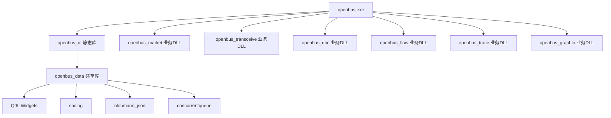
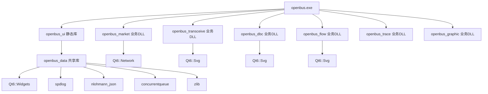

# CMake构建配置

<cite>
**本文引用的文件**
- [CMakeLists.txt](file://CMakeLists.txt)
- [src/CMakeLists.txt](file://src/CMakeLists.txt)
- [tests/CMakeLists.txt](file://tests/CMakeLists.txt)
- [third_party/Dependencies.cmake](file://third_party/Dependencies.cmake)
- [doc/构建基线.md](file://doc/构建基线.md)
</cite>

## 更新摘要
**所做更改**
- **重大架构变更**：从两个静态库（openbus_core, openbus_ui）重构为分层共享库架构，包含公共底座DLL（openbus_data）和多个业务DLL
- **新增业务模块DLL**：openbus_market、openbus_transceive、openbus_dbc、openbus_flow等独立业务模块
- **增强PCH配置**：为每个业务DLL配置专门的预编译头优化
- **模块化依赖管理**：通过ModuleRegistry实现壳与业务模块的松耦合通信
- **改进构建系统**：支持thin archive、Dev构建档、更好的链接器兼容性
- **增强测试框架**：集成Qt Test和CTest，提供完整的自动化测试执行环境

## 目录
1. [项目概述](#项目概述)
2. [根目录CMakeLists.txt配置](#根目录cmakeliststxt配置)
3. [分层共享库架构](#分层共享库架构)
4. [业务模块DLL配置](#业务模块dll配置)
5. [模块接口与注册机制](#模块接口与注册机制)
6. [预编译头优化配置](#预编译头优化配置)
7. [第三方库依赖管理](#第三方库依赖管理)
8. [平台特定配置](#平台特定配置)
9. [测试框架集成](#测试框架集成)
10. [安装目标配置](#安装目标配置)
11. [构建流程总结](#构建流程总结)

## 项目概述

本项目是一个基于Qt6的CAN总线报文分析工具，采用先进的分层共享库架构设计。CMake构建系统支持多平台编译，包括Windows、macOS和Linux。**项目已重命名为 openbus**，实现了从单体静态库到模块化共享库的重大架构升级，提供完整的Python插件系统支持和动态业务模块加载能力。

新的架构将核心功能封装在`openbus_data`共享库中，各个业务功能（市场、收发、DBC、流程等）作为独立的业务DLL，通过统一的模块接口进行通信，实现了高度的模块化和可维护性。

**章节来源**
- [CMakeLists.txt:3-7](file://CMakeLists.txt#L3-L7)
- [src/CMakeLists.txt:175-188](file://src/CMakeLists.txt#L175-L188)

## 根目录CMakeLists.txt配置

### 项目基础设置
```cmake
cmake_minimum_required(VERSION 3.21)

project(openbus
    VERSION 0.1.0
    DESCRIPTION "报文解析、分析、回放、录制、trace、graphic 桌面软件"
    LANGUAGES CXX
)
```

### C++标准配置
项目使用C++17标准，禁用扩展以确保跨平台兼容性：
- `CMAKE_CXX_STANDARD`: 设置为17
- `CMAKE_CXX_STANDARD_REQUIRED`: 强制要求C++17
- `CMAKE_CXX_EXTENSIONS`: 关闭编译器扩展

### Qt自动化处理
启用Qt的自动MOC、UIC和RCC处理：
- `CMAKE_AUTOMOC`: 自动生成元对象代码
- `CMAKE_AUTOUIC`: 自动生成UI类
- `CMAKE_AUTORCC`: 自动处理资源文件

### Qt6组件查找配置
**已更新** 新增Qt6 Network组件支持，用于市场索引和网络功能：
```cmake
find_package(Qt6 REQUIRED COMPONENTS Widgets PrintSupport Svg Network)
```

支持的Qt6组件包括：
- **Widgets**: 图形界面框架
- **PrintSupport**: 打印支持
- **Svg**: SVG图标渲染支持
- **Network**: 网络通信支持

### 输出目录配置
所有可执行文件输出到`bin`目录：
```cmake
set(CMAKE_RUNTIME_OUTPUT_DIRECTORY ${CMAKE_BINARY_DIR}/bin)
```

### 构建系统改进
**已更新** 增强的构建配置说明和优化选项：
- PCH（预编译头）在 src/CMakeLists.txt 中配置
- 使用默认 ld.bfd 链接器以获得最佳兼容性
- Dev 构建档（日常开发）：-O1 -g1，独立 build-dev/ 目录
- **thin archive：只记录对象路径不复制内容，静态库重打包降为毫秒级**

**章节来源**
- [CMakeLists.txt:9-14](file://CMakeLists.txt#L9-L14)
- [CMakeLists.txt:16-21](file://CMakeLists.txt#L16-L21)
- [CMakeLists.txt:58-61](file://CMakeLists.txt#L58-L61)
- [CMakeLists.txt:23-31](file://CMakeLists.txt#L23-L31)

## 分层共享库架构

### 架构设计原则
项目采用了清晰的分层共享库架构，将原来的两个静态库重构为：



### openbus_data - 公共底座DLL
**全新架构** 核心功能库，包含所有业务逻辑和数据层：
```cmake
add_library(openbus_data SHARED
    ${SRC_CORE}
    ${SRC_MODELS}
    ${SRC_UTILS}
    ui/thememanager.h
    ui/thememanager.cpp
)
```

该库包含了：
- **Core层**：数据结构、录制回放、模拟器、DBC处理、文件格式I/O
- **Models层**：Qt数据模型实现
- **Utils层**：工具函数库
- **ThemeManager**：主题管理单例

### 依赖关系设计
**已更新** 通过PUBLIC依赖确保头文件正确传播：
```cmake
target_include_directories(openbus_data PUBLIC
    ${CMAKE_CURRENT_SOURCE_DIR}
)

target_link_libraries(openbus_data PUBLIC Qt6::Widgets)
target_link_libraries(openbus_data PRIVATE z)
```

**章节来源**
- [src/CMakeLists.txt:175-188](file://src/CMakeLists.txt#L175-L188)
- [src/CMakeLists.txt:190-235](file://src/CMakeLists.txt#L190-L235)

## 业务模块DLL配置

### 模块架构设计
每个业务功能都作为独立的共享库实现，通过统一的模块接口与主程序通信：

#### openbus_market - 插件市场业务DLL
```cmake
add_library(openbus_market SHARED
    ui/markettab.h
    ui/markettab.cpp
    ui/marketmodel.h
    ui/marketmodel.cpp
    ui/marketmodule.h
    ui/marketmodule.cpp
)
```

#### openbus_transceive - 收发业务DLL
包含发送、回放、离线分析、录制四个页面：
```cmake
add_library(openbus_transceive SHARED
    ui/signalsendtab.h
    ui/signalsendtab.cpp
    ui/playbacktab.h
    ui/playbacktab.cpp
    ui/offlineanalysistab.h
    ui/offlineanalysistab.cpp
    ui/recordtab.h
    ui/recordtab.cpp
    ui/dbcimportdialog.h
    ui/dbcimportdialog.cpp
    ui/transceivemodule.h
    ui/transceivemodule.cpp
)
```

#### openbus_dbc - DBC业务DLL
```cmake
add_library(openbus_dbc SHARED
    ui/dbcdetailtab.h
    ui/dbcdetailtab.cpp
    ui/tools/dbcsignallistview.h
    ui/tools/dbcsignallistview.cpp
    ui/dbcmodule.h
    ui/dbcmodule.cpp
)
```

#### openbus_flow - 测量流程业务DLL
```cmake
add_library(openbus_flow SHARED
    ui/measurementsetupview.h
    ui/measurementsetupview.cpp
    ui/deviceconnectiontab.h
    ui/deviceconnectiontab.cpp
    ui/flowmodule.h
    ui/flowmodule.cpp
)
```

### 模块依赖管理
每个业务DLL都依赖openbus_data并链接相应的Qt组件：
```cmake
target_link_libraries(openbus_market PUBLIC
    openbus_data
    Qt6::Widgets
    Qt6::Network
    Qt6::Svg
)
```

**章节来源**
- [src/CMakeLists.txt:271-334](file://src/CMakeLists.txt#L271-L334)
- [src/CMakeLists.txt:336-400](file://src/CMakeLists.txt#L336-L400)
- [src/CMakeLists.txt:402-456](file://src/CMakeLists.txt#L402-L456)
- [src/CMakeLists.txt:458-523](file://src/CMakeLists.txt#L458-L523)

## 模块接口与注册机制

### 统一模块接口设计
项目实现了完整的模块接口体系，定义了壳与业务模块之间的契约：

```mermaid
graph TD
A[ShellContext] --> B[Player*]
A --> C[Recorder*]
A --> D[CanDeviceManager*]
A --> E[CanSimulator*]
A --> F[DbcManager*]
A --> G[回调函数]
H[IBusinessModule] --> I[id() - 模块标识]
H --> J[title() - 模块标题]
H --> K[icon() - 模块图标]
H --> L[createWidget() - 创建界面]
H --> M[invoke() - 动作调用]
H --> N[query() - 状态查询]
```

### ShellContext - 模块上下文
**新增** 模块间通信的核心结构体：
```cpp
struct ShellContext {
    QWidget *mainWindow = nullptr;
    Player *player = nullptr;
    Recorder *recorder = nullptr;
    CanDeviceManager *deviceManager = nullptr;
    CanSimulator *simulator = nullptr;
    DbcManager *dbcManager = nullptr;
    std::function<void(const QString &)> appendOutput;
    std::function<void(int level, const QString &source, const QString &message)> addProblem;
    std::function<void(const QString &action, const QVariant &arg)> shellInvoke;
};
```

### IBusinessModule - 业务模块接口
**新增** 统一的模块接口定义：
```cpp
class IBusinessModule {
public:
    virtual ~IBusinessModule() = default;
    virtual QString id() const = 0;
    virtual QString title() const = 0;
    virtual QIcon icon() const = 0;
    virtual QWidget *createWidget(ShellContext &ctx) = 0;
    virtual void invoke(const QString &action, const QVariant &arg = {}) {}
    virtual QStringList pages() const { return {}; }
    virtual QWidget *createPage(const QString &pageId, ShellContext &ctx) { return nullptr; }
    virtual QVariant query(const QString &what, const QVariant &arg = {}) { return {}; }
};
```

### ModuleRegistry - 模块注册表
**新增** 模块发现和管理机制：
```cpp
class ModuleRegistry {
public:
    using ModuleFactory = std::function<IBusinessModule *()>;
    static ModuleRegistry *instance();
    void registerModule(const QString &id, ModuleFactory factory);
    IBusinessModule *module(const QString &id) const;
    QStringList ids() const;
};
```

### 模块实现示例
每个业务模块都实现IBusinessModule接口：

#### MarketModule实现
```cpp
class MarketModule : public IBusinessModule {
public:
    QString id() const override;
    QString title() const override;
    QIcon icon() const override;
    QWidget *createWidget(ShellContext &ctx) override;
    void invoke(const QString &action, const QVariant &arg) override;
private:
    MarketTab *m_tab = nullptr;
};
```

#### TransceiveModule多页面实现
```cpp
class TransceiveModule : public IBusinessModule {
public:
    QString id() const override;
    QString title() const override;
    QIcon icon() const override;
    QWidget *createWidget(ShellContext &ctx) override;
    QStringList pages() const override;
    QWidget *createPage(const QString &pageId, ShellContext &ctx) override;
    void invoke(const QString &action, const QVariant &arg) override;
    QVariant query(const QString &what, const QVariant &arg = {}) override;
private:
    QWidget *createSendPage(ShellContext &ctx);
    QWidget *createPlaybackPage(ShellContext &ctx);
    QWidget *createOfflinePage(ShellContext &ctx);
    QWidget *createRecordPage(ShellContext &ctx);
    ShellContext m_ctx;
    QHash<QString, QWidget *> m_pages;
};
```

**章节来源**
- [src/core/module/imodule.h:31-80](file://src/core/module/imodule.h#L31-L80)
- [src/core/module/imodule.h:82-171](file://src/core/module/imodule.h#L82-L171)
- [src/core/module/moduleregistry.h:27-50](file://src/core/module/moduleregistry.h#L27-L50)
- [src/ui/marketmodule.h:18-28](file://src/ui/marketmodule.h#L18-L28)
- [src/ui/transceivemodule.h:28-51](file://src/ui/transceivemodule.h#L28-L51)

## 预编译头优化配置

### 分层PCH策略
**新增** 为每个库配置专门的预编译头以优化编译时间：

#### openbus_data PCH配置
针对核心层使用精简的Qt头文件列表：
```cmake
target_precompile_headers(openbus_data PRIVATE
    <QObject>
    <QString>
    <QStringList>
    <QVariant>
    <QList>
    <QHash>
    <QVector>
    <QPair>
    <QMetaType>
    <QByteArray>
    <QTimer>
    <QThread>
    <QFile>
    <QDataStream>
    <QDir>
    <QFileInfo>
    <QRegularExpression>
    <QStandardPaths>
    <QTextStream>
    <QColor>
    <QRandomGenerator>
    <QStringConverter>
    <QAbstractTableModel>
    <QSortFilterProxyModel>
    <vector>
    <string>
    <memory>
    <functional>
)
```

#### 业务模块PCH配置
每个业务DLL都有针对性的PCH配置：

**openbus_market** - 市场模块PCH：
```cmake
target_precompile_headers(openbus_market PRIVATE
    <QObject>
    <QWidget>
    <QFrame>
    <QVBoxLayout>
    <QHBoxLayout>
    <QLabel>
    <QPushButton>
    <QToolButton>
    <QTableWidget>
    <QHeaderView>
    <QLineEdit>
    <QMenu>
    <QMessageBox>
    <QFileDialog>
    <QProgressBar>
    <QScrollArea>
    <QSplitter>
    <QJsonDocument>
    <QJsonArray>
    <QJsonObject>
    <QDir>
    <QFile>
    <QFileInfo>
    <QStandardPaths>
    <QTemporaryFile>
    <QProcess>
    <QPointer>
    <QNetworkAccessManager>
    <QNetworkReply>
    <QNetworkRequest>
    <QSvgRenderer>
    <QCryptographicHash>
    <QTimer>
    <vector>
    <string>
    <memory>
    <functional>
    <algorithm>
)
```

**openbus_transceive** - 收发模块PCH：
```cmake
target_precompile_headers(openbus_transceive PRIVATE
    <QObject>
    <QWidget>
    <QFrame>
    <QVBoxLayout>
    <QHBoxLayout>
    <QGridLayout>
    <QGroupBox>
    <QLabel>
    <QPushButton>
    <QToolButton>
    <QTableWidget>
    <QTableWidgetItem>
    <QHeaderView>
    <QLineEdit>
    <QComboBox>
    <QCheckBox>
    <QSpinBox>
    <QDoubleSpinBox>
    <QSlider>
    <QSplitter>
    <QMenu>
    <QMessageBox>
    <QFileDialog>
    <QDateTime>
    <QTimer>
    <QDir>
    <QFile>
    <QFileInfo>
    <QSvgRenderer>
    <vector>
    <string>
    <memory>
    <functional>
    <algorithm>
)
```

**章节来源**
- [src/CMakeLists.txt:237-269](file://src/CMakeLists.txt#L237-L269)
- [src/CMakeLists.txt:294-334](file://src/CMakeLists.txt#L294-L334)
- [src/CMakeLists.txt:364-400](file://src/CMakeLists.txt#L364-L400)
- [src/CMakeLists.txt:424-456](file://src/CMakeLists.txt#L424-L456)
- [src/CMakeLists.txt:480-523](file://src/CMakeLists.txt#L480-L523)
- [src/CMakeLists.txt:553-596](file://src/CMakeLists.txt#L553-L596)

## 第三方库依赖管理

### 依赖管理架构
**已更新** 改进的第三方库依赖管理系统：

#### spdlog日志库
- **用途**: 高性能C++日志库
- **集成方式**: INTERFACE IMPORTED目标
- **路径**: third_party/spdlog/include

#### nlohmann_json JSON库
- **用途**: 现代C++ JSON解析库
- **集成方式**: 单头文件库
- **路径**: third_party/nlohmann_json

#### concurrentqueue并发队列
- **用途**: 无锁并发队列实现
- **集成方式**: 单头文件库
- **路径**: third_party/concurrentqueue

#### qcustomplot图表库
- **用途**: Qt图表绘制库
- **集成方式**: 静态库构建
- **条件编译**: 仅在存在源文件时构建

#### vector_blf库配置
**已更新** Vector BLF文件格式的C++实现，支持条件编译：
```cmake
if(EXISTS "${CMAKE_SOURCE_DIR}/third_party/vector_blf/CMakeLists.txt")
    add_subdirectory(${CMAKE_SOURCE_DIR}/third_party/vector_blf ${CMAKE_BINARY_DIR}/vector_blf)
endif()
```

### 条件编译支持
**新增** 通过宏定义控制可选功能：
```cmake
if(TARGET vector_blf)
    target_link_libraries(openbus_data PRIVATE vector_blf)
    target_compile_definitions(openbus_data PRIVATE HAS_VECTOR_BLF)
endif()
```

当启用vector_blf库时，会定义`HAS_VECTOR_BLF`宏，允许代码中使用高级BLF功能。

**章节来源**
- [third_party/Dependencies.cmake:5-31](file://third_party/Dependencies.cmake#L5-L31)
- [src/CMakeLists.txt:198-235](file://src/CMakeLists.txt#L198-L235)

## 平台特定配置

### Windows平台配置
**已更新** 增强的Windows平台支持：

#### GUI程序设置
```cmake
if(WIN32)
    set_target_properties(openbus PROPERTIES
        WIN32_EXECUTABLE TRUE
    )
endif()
```

#### 链接器配置
**已更新** 移除了LLD链接器的使用，改用默认的ld.bfd链接器以获得更好的兼容性：
```cmake
if(WIN32 AND CMAKE_CXX_COMPILER_ID STREQUAL "GNU")
    message(STATUS "使用默认 ld.bfd 链接器")
    
    # Dev 档 — 日常开发：O1 + 行号级调试信息，链接体积/耗时数量级下降
    set(CMAKE_CXX_FLAGS_DEV "-O1 -g1")
    
    # thin archive：只记录对象路径不复制内容，静态库重打包降为毫秒级
    set(CMAKE_CXX_ARCHIVE_CREATE "<CMAKE_AR> qcT <TARGET> <LINK_FLAGS> <OBJECTS>")
    set(CMAKE_CXX_ARCHIVE_APPEND "<CMAKE_AR> qT <TARGET> <OBJECTS>")
endif()
```

#### 驱动DLL自动复制
**已更新** 改进了设备驱动的构建后处理：
```cmake
if(EXISTS "${CMAKE_SOURCE_DIR}/driver")
    add_custom_command(TARGET openbus POST_BUILD
        COMMAND ${CMAKE_COMMAND} -E copy_directory
                "${CMAKE_SOURCE_DIR}/driver"
                "$<TARGET_FILE_DIR:openbus>"
        COMMENT "Copying driver DLLs to output directory"
    )
    install(DIRECTORY "${CMAKE_SOURCE_DIR}/driver/"
            DESTINATION bin
            FILES_MATCHING PATTERN "*.dll"
    )
endif()
```

### macOS和Linux平台
- 默认使用系统提供的编译器
- 依赖库通过包管理器或源码编译获取
- 无需特殊的GUI程序设置

**章节来源**
- [CMakeLists.txt:32-48](file://CMakeLists.txt#L32-L48)
- [src/CMakeLists.txt:627-634](file://src/CMakeLists.txt#L627-L634)
- [src/CMakeLists.txt:636-653](file://src/CMakeLists.txt#L636-L653)

## 测试框架集成

### 测试架构设计
**新增** 完整的测试框架集成，支持多层级的自动化测试：

#### 测试目录结构
```
tests/
├── CMakeLists.txt          # 测试构建配置
├── test_canfileio.cpp      # 文件I/O测试
├── test_filterengine.cpp   # 过滤引擎测试
├── test_tracecore.cpp      # Trace核心测试
├── test_dbc.cpp           # DBC解析测试
├── test_sim_rec_play.cpp  # 采集/录制/回放测试
├── test_market_driver.cpp # 市场驱动测试
├── test_project.cpp       # 工程配置测试
└── test_ui_offscreen.cpp  # UI无头测试
```

#### 测试执行器配置
**新增** 通过CTest集成测试执行：
```cmake
enable_testing()
add_subdirectory(tests)
```

#### 测试套件分类
- **L1 核心逻辑测试**：使用QTEST_GUILESS_MAIN，隔离进程级单例状态
- **L2 UI驱动测试**：使用offscreen模式驱动真实MainWindow

### 测试目标配置
**新增** 聚合测试目标和自动化部署：
```cmake
function(openbus_add_test name)
    add_executable(test_${name} test_${name}.cpp)
    target_compile_definitions(test_${name} PRIVATE
        SIN_SOURCE_DIR="${CMAKE_SOURCE_DIR}")
    target_link_libraries(test_${name} PRIVATE
        openbus_data
        Qt6::Test)
    add_test(NAME ${name} COMMAND test_${name}
             WORKING_DIRECTORY ${CMAKE_BINARY_DIR}/bin)
endfunction()
```

### 测试执行流程
**新增** 完整的测试执行链：
1. **构建阶段**：编译所有测试可执行文件
2. **部署阶段**：自动复制Qt6Test.dll和平台插件
3. **执行阶段**：通过ctest运行所有测试套件
4. **报告阶段**：生成测试结果报告

### 性能优化效果
**新增** 测试框架带来的构建性能提升：
- **thin archive支持**：静态库重打包时间从分钟级降至毫秒级
- **增量构建优化**：修改单个文件后的重新构建时间显著减少
- **并行测试执行**：支持多线程测试执行

**章节来源**
- [CMakeLists.txt:83-86](file://CMakeLists.txt#L83-L86)
- [tests/CMakeLists.txt:1-108](file://tests/CMakeLists.txt#L1-108)

## 安装目标配置

### 可执行文件安装
```cmake
install(TARGETS openbus
    RUNTIME DESTINATION bin
)
```

### 驱动文件安装
**已更新** 改进了驱动文件的安装规则：
```cmake
install(DIRECTORY "${CMAKE_SOURCE_DIR}/driver/"
        DESTINATION bin
        FILES_MATCHING PATTERN "*.dll"
)
```

### 业务模块安装
**新增** 业务DLL的安装配置：
```cmake
# 各业务DLL会自动随主程序一起安装
# 通过target_link_libraries声明的依赖会被正确处理
```

**章节来源**
- [CMakeLists.txt:81-86](file://CMakeLists.txt#L81-L86)
- [src/CMakeLists.txt:655-660](file://src/CMakeLists.txt#L655-L660)

## 构建流程总结

### 新的分层构建架构


### 构建步骤
1. **配置阶段**: CMake检查依赖项并生成构建系统
2. **编译阶段**: 
   - 先编译openbus_data核心共享库
   - 再编译各个业务DLL（market、transceive、dbc、flow等）
   - 最后编译openbus_ui静态库和openbus可执行文件
3. **链接阶段**: 链接所有依赖库生成最终可执行文件
4. **安装阶段**: 将可执行文件、驱动文件和业务模块安装到指定目录
5. **测试阶段**: 构建并执行所有测试套件

### 性能优化效果
- **编译时间**: 通过分层PCH和优化选项显著减少编译时间
- **链接时间**: 使用thin archive和默认链接器确保稳定性
- **内存占用**: 精简调试信息减少内存占用
- **启动时间**: 优化的二进制文件提升应用程序启动速度
- **模块化**: 业务DLL支持独立开发和测试，提高开发效率

### 架构优势
- **松耦合**: 通过ModuleRegistry实现模块间的松耦合通信
- **可扩展性**: 新业务模块可以轻松添加，不影响现有代码
- **可维护性**: 职责分离，每个DLL专注于特定功能领域
- **可测试性**: 业务模块可以独立进行测试和验证

### Thin Archive性能提升
**新增** 通过thin archive技术实现的构建性能优化：
- **静态库重打包**：从分钟级降至毫秒级
- **增量构建**：修改单个文件后的重新构建时间大幅减少
- **存储优化**：只记录对象路径，不复制实际内容

**章节来源**
- [src/CMakeLists.txt:598-625](file://src/CMakeLists.txt#L598-L625)
- [src/CMakeLists.txt:175-188](file://src/CMakeLists.txt#L175-L188)
- [src/core/module/moduleregistry.h:27-50](file://src/core/module/moduleregistry.h#L27-L50)
- [doc/构建基线.md:22-39](file://doc/构建基线.md#L22-L39)