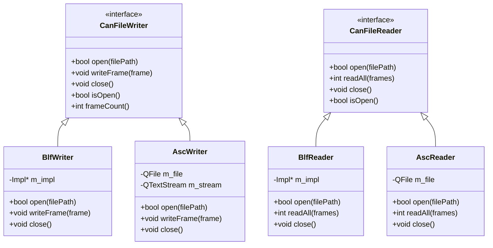
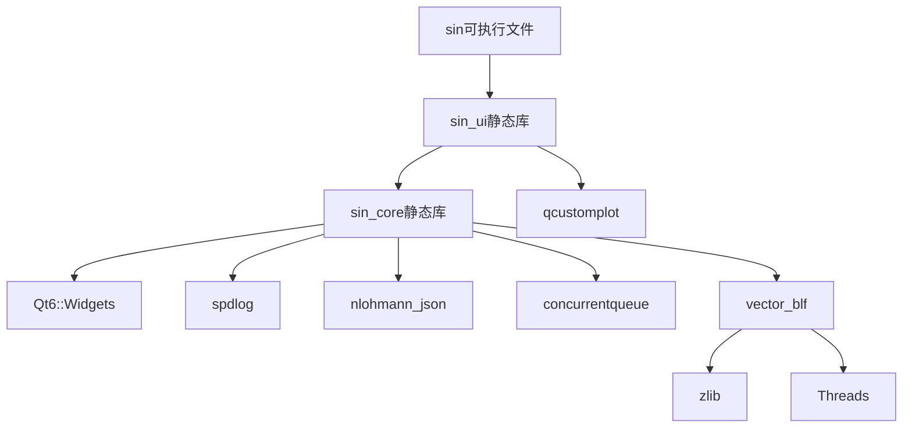

# CMake构建配置

<cite>
**本文档引用的文件**
- [CMakeLists.txt](file://CMakeLists.txt)
- [src/CMakeLists.txt](file://src/CMakeLists.txt)
- [third_party/vector_blf/CMakeLists.txt](file://third_party/vector_blf/CMakeLists.txt)
- [src/core/canfileio/canfileio.h](file://src/core/canfileio/canfileio.h)
- [src/core/canfileio/blf.h](file://src/core/canfileio/blf.h)
- [src/core/canfileio/asc.h](file://src/core/canfileio/asc.h)
</cite>

## 更新摘要
**所做更改**
- 更新了canfileio模块的CMake构建配置，包含新的文件格式支持结构
- 为ASC、CSV、PCAP、TRC等不同文件格式分离了头文件和实现文件
- 正确配置vector_blf库作为私有依赖链接
- 优化了预编译头配置和编译器选项设置

## 目录
1. [项目概述](#项目概述)
2. [根目录CMakeLists.txt配置](#根目录cmakeliststxt配置)
3. [src/CMakeLists.txt核心配置](#srccmakeliststxt核心配置)
4. [canfileio模块构建配置](#canfileio模块构建配置)
5. [第三方库依赖管理](#第三方库依赖管理)
6. [平台特定配置](#平台特定配置)
7. [构建优化配置](#构建优化配置)
8. [安装目标配置](#安装目标配置)

## 项目概述

本项目是一个基于Qt6的CAN总线报文分析工具，采用模块化架构设计。CMake构建系统支持多平台编译，包括Windows、macOS和Linux。项目结构清晰，分为core（核心逻辑）、models（数据模型）、ui（用户界面）和utils（工具函数）四个主要层次。

**章节来源**
- [CMakeLists.txt:1-7](file://CMakeLists.txt#L1-L7)

## 根目录CMakeLists.txt配置

### 项目基础设置
```cmake
cmake_minimum_required(VERSION 3.21)

project(sin
    VERSION 0.1.0
    DESCRIPTION "报文解析、分析、回放、录制、trace、graphic 桌面软件"
    LANGUAGES CXX
)
```

### C++标准配置
项目使用C++17标准，禁用扩展以确保跨平台兼容性：
- `CMAKE_CXX_STANDARD`: 设置为17
- `CMAKE_CXX_STANDARD_REQUIRED`: 强制要求C++17
- `CMAKE_CXX_EXTENSIONS`: 关闭编译器扩展

### Qt自动化处理
启用Qt的自动MOC、UIC和RCC处理：
- `CMAKE_AUTOMOC`: 自动生成元对象代码
- `CMAKE_AUTOUIC`: 自动生成UI类
- `CMAKE_AUTORCC`: 自动处理资源文件

### 输出目录配置
所有可执行文件输出到`bin`目录：
```cmake
set(CMAKE_RUNTIME_OUTPUT_DIRECTORY ${CMAKE_BINARY_DIR}/bin)
```

**章节来源**
- [CMakeLists.txt:9-14](file://CMakeLists.txt#L9-L14)
- [CMakeLists.txt:16-21](file://CMakeLists.txt#L16-L21)
- [CMakeLists.txt:51-53](file://CMakeLists.txt#L51-L53)

## src/CMakeLists.txt核心配置

### 源文件组织结构

#### Core层源文件
Core层包含核心业务逻辑，按功能模块组织：
- **数据结构**: canframe.h, dbcdata.h
- **录制回放**: recorder.cpp, player.cpp, cansimulator.cpp
- **DBC处理**: dbcmanager.cpp, dbc_adapter.cpp
- **过滤引擎**: filter_engine.cpp
- **应用配置**: appconfig.cpp
- **项目管理**: projectmanager.cpp
- **日志系统**: logging.cpp

#### CanFileIO模块源文件
新增的canfileio模块支持多种文件格式：
- **接口定义**: canfileio.h, canfileio.cpp
- **工厂模式**: canfileio_factory.h, canfileio_factory.cpp
- **BLF格式**: blf.h, blf.cpp (Vector二进制格式)
- **ASC格式**: asc.h, asc.cpp (Vector文本格式)
- **CSV格式**: csv.h, csv.cpp (通用文本格式)
- **PCAP格式**: pcap_reader.h, pcap_reader.cpp (网络捕获格式)
- **TRC格式**: trc_reader.h, trc_reader.cpp (Vector旧版格式)

#### Models层源文件
Qt数据模型实现：
- cantracemodel.h/cpp: CAN轨迹数据模型
- canfilterproxymodel.h/cpp: 过滤器代理模型

#### Utils层源文件
工具函数库：
- canutils.h/cpp: CAN总线工具函数
- message_queue.h: 消息队列实现
- logging.h: 日志工具

#### UI层源文件
完整的用户界面组件：
- 主窗口: mainwindow.h/cpp
- 视图组件: traceview.h/cpp, graphicview.h/cpp
- 控制面板: activitybar.h/cpp, bottompanel.h/cpp, rightpanel.h/cpp
- 对话框: signalconfigdialog.h/cpp, dbcimportdialog.h/cpp, settingsdialog.h/cpp
- 标签页: signalsendtab.h/cpp, playbacktab.h/cpp, recordtab.h/cpp, dbcdetailtab.h/cpp
- 特殊视图: udsview.h/cpp, canopenview.h/cpp
- 主题管理: thememanager.h/cpp
- 测量设置: measurementsetupview.h/cpp

**章节来源**
- [src/CMakeLists.txt:5-50](file://src/CMakeLists.txt#L5-L50)
- [src/CMakeLists.txt:52-110](file://src/CMakeLists.txt#L52-L110)

### 静态库构建配置

#### sin_core静态库
核心功能库，包含所有业务逻辑：
```cmake
add_library(sin_core STATIC
    ${SRC_CORE}
    ${SRC_MODELS}
    ${SRC_UTILS}
)
```

#### sin_ui静态库
用户界面库，独立于核心逻辑：
```cmake
add_library(sin_ui STATIC
    ${SRC_UI}
)
```

### 依赖链接配置

#### PUBLIC依赖
对外暴露的头文件和库：
- Qt6::Widgets: Qt图形界面框架
- spdlog: 日志库
- nlohmann_json: JSON解析库
- concurrentqueue: 并发队列库

#### PRIVATE依赖
内部使用的库，不对外暴露：
- vector_blf: Vector BLF文件格式库
- qcustomplot: 图表绘制库

**章节来源**
- [src/CMakeLists.txt:116-147](file://src/CMakeLists.txt#L116-L147)

## canfileio模块构建配置

### 模块架构设计

CanFileIO模块采用抽象接口设计，支持多种文件格式的统一访问：



### 文件格式支持

#### BLF格式 (Vector Binary Logging Format)
- **用途**: 汽车行业最常用格式，Vector工具链标准格式
- **特点**: 二进制格式，高效存储，支持CAN FD
- **实现**: 基于vector_blf库，提供BlfWriter和BlfReader类

#### ASC格式 (ASCII Logging Format)
- **用途**: Vector文本格式，人类可读
- **特点**: 文本格式，便于调试和分析
- **实现**: 使用Qt的QFile和QTextStream进行读写

#### CSV格式 (Comma-Separated Values)
- **用途**: 通用文本格式，易于与其他工具集成
- **特点**: 标准表格格式，广泛支持
- **实现**: 自定义CSV解析器

#### PCAP格式 (libpcap Network Capture)
- **用途**: 标准网络捕获格式，用于Linux SocketCAN
- **特点**: 网络协议标准，Wireshark等工具支持
- **实现**: 基于libpcap格式的解析器

#### TRC格式 (Trace Format)
- **用途**: Vector旧版文本格式
- **特点**: 向后兼容，支持遗留系统
- **实现**: 专用解析器

**章节来源**
- [src/core/canfileio/canfileio.h:10-49](file://src/core/canfileio/canfileio.h#L10-L49)
- [src/core/canfileio/blf.h:10-43](file://src/core/canfileio/blf.h#L10-L43)
- [src/core/canfileio/asc.h:8-45](file://src/core/canfileio/asc.h#L8-L45)

## 第三方库依赖管理

### vector_blf库配置

vector_blf库是Vector BLF文件格式的C++实现，采用GPL-3.0许可证：

```cmake
# 查找zlib依赖
find_package(ZLIB QUIET)
if(NOT ZLIB_FOUND OR NOT ZLIB_LIBRARY OR ZLIB_LIBRARY STREQUAL "ZLIB_LIBRARY-NOTFOUND")
    # 回退到MinGW自带zlib
    set(ZLIB_INCLUDE_DIRS "D:/Qt/Tools/mingw1310_64/x86_64-w64-mingw32/include")
    set(ZLIB_LIBRARIES "D:/Qt/Tools/mingw1310_64/x86_64-w64-mingw32/lib/libz.a")
endif()

# 生成配置文件
configure_file(
    ${CMAKE_CURRENT_SOURCE_DIR}/src/Vector/BLF/config.h.in
    ${CMAKE_CURRENT_BINARY_DIR}/src/Vector/BLF/config.h
    COPYONLY
)

# 生成导出头文件
file(WRITE ${CMAKE_CURRENT_BINARY_DIR}/src/Vector/BLF/vector_blf_export.h
"#pragma once
#define VECTOR_BLF_EXPORT
#define VECTOR_BLF_NO_EXPORT
#define VECTOR_BLF_DEPRECATED
")

# 收集源文件并构建静态库
file(GLOB VECTOR_BLF_SOURCES "${CMAKE_CURRENT_SOURCE_DIR}/src/Vector/BLF/*.cpp")
add_library(vector_blf STATIC ${VECTOR_BLF_SOURCES})

# 链接依赖库
target_link_libraries(vector_blf PUBLIC Threads::Threads ${ZLIB_LIBRARIES})
```

### 其他第三方库

#### spdlog日志库
- **用途**: 高性能C++日志库
- **集成方式**: 直接包含头文件
- **路径**: third_party/spdlog/include

#### nlohmann_json JSON库
- **用途**: 现代C++ JSON解析库
- **集成方式**: 单头文件库
- **路径**: third_party/nlohmann_json

#### concurrentqueue并发队列
- **用途**: 无锁并发队列实现
- **集成方式**: 单头文件库
- **路径**: third_party/concurrentqueue

#### qcustomplot图表库
- **用途**: Qt图表绘制库
- **集成方式**: 静态库链接
- **用途**: 仅graphicview.cpp使用

**章节来源**
- [third_party/vector_blf/CMakeLists.txt:1-64](file://third_party/vector_blf/CMakeLists.txt#L1-L64)
- [src/CMakeLists.txt:130-140](file://src/CMakeLists.txt#L130-L140)

## 平台特定配置

### Windows平台配置

#### GUI程序设置
```cmake
if(WIN32)
    set_target_properties(sin PROPERTIES
        WIN32_EXECUTABLE TRUE
    )
endif()
```

#### LLD链接器优化
在GNU编译器环境下检测并使用LLD链接器：
```cmake
if(WIN32 AND CMAKE_CXX_COMPILER_ID STREQUAL "GNU")
    if(CMAKE_BUILD_TYPE STREQUAL "Debug")
        add_compile_options(-g1)
    endif()
    
    # 检测本地LLD链接器
    set(_lld_path "${CMAKE_SOURCE_DIR}/tools/lld/ld.lld.exe")
    if(EXISTS "${_lld_path}")
        add_compile_options(-fuse-ld=lld)
        add_link_options(-fuse-ld=lld)
    endif()
endif()
```

### macOS和Linux平台
- 默认使用系统提供的编译器
- 依赖库通过包管理器或源码编译获取
- 无需特殊的GUI程序设置

**章节来源**
- [CMakeLists.txt:33-48](file://CMakeLists.txt#L33-L48)
- [src/CMakeLists.txt:259-263](file://src/CMakeLists.txt#L259-L263)

## 构建优化配置

### 预编译头(PCH)优化

#### Core层PCH配置
针对核心层使用精简的Qt头文件列表：
```cmake
target_precompile_headers(sin_core PRIVATE
    <QObject>
    <QString>
    <QStringList>
    <QVariant>
    <QList>
    <QHash>
    <QVector>
    <QPair>
    <QMetaType>
    <QByteArray>
    <QTimer>
    <QThread>
    <QFile>
    <QDataStream>
    <QDir>
    <QFileInfo>
    <QRegularExpression>
    <QStandardPaths>
    <QTextStream>
    <QColor>
    <QRandomGenerator>
    <QStringConverter>
    <QAbstractTableModel>
    <QSortFilterProxyModel>
    <vector>
    <string>
    <memory>
    <functional>
)
```

#### UI层PCH配置
针对UI层使用完整的Qt Widget头文件列表：
```cmake
target_precompile_headers(sin_ui PRIVATE
    <QWidget>
    <QMainWindow>
    <QVBoxLayout>
    <QHBoxLayout>
    <QSplitter>
    <QToolBar>
    <QAction>
    <QMenu>
    <QMenuBar>
    <QStatusBar>
    <QLabel>
    <QPushButton>
    <QToolButton>
    <QTreeWidget>
    <QTableWidget>
    <QListWidget>
    <QComboBox>
    <QLineEdit>
    <QCheckBox>
    <QHeaderView>
    <QDockWidget>
    <QTabWidget>
    <QFileDialog>
    <QMessageBox>
    <QCloseEvent>
    <QMouseEvent>
    <QApplication>
    <QSettings>
    <QJsonDocument>
    <QJsonObject>
    <QJsonArray>
    <QDateTime>
    <QTimer>
    <QThread>
    <QFileInfo>
    <QDebug>
    <vector>
    <string>
    <memory>
    <functional>
)
```

### 编译器优化选项

#### Debug构建优化
- `-g1`: 仅包含函数级调试信息，减小调试符号大小
- 提升编译和链接速度5倍以上

#### Release构建优化
- 使用默认的优化级别
- 移除调试信息
- 启用链接时优化(LTO)

**章节来源**
- [src/CMakeLists.txt:150-179](file://src/CMakeLists.txt#L150-L179)
- [src/CMakeLists.txt:201-242](file://src/CMakeLists.txt#L201-L242)
- [CMakeLists.txt:24-32](file://CMakeLists.txt#L24-L32)

## 安装目标配置

### 可执行文件安装
```cmake
install(TARGETS sin
    RUNTIME DESTINATION bin
)
```

### 库文件安装
当前配置未包含库文件的安装规则，如需安装sin_core和sin_ui库，可以添加：
```cmake
install(TARGETS sin_core sin_ui
    ARCHIVE DESTINATION lib
    LIBRARY DESTINATION lib
)
```

### 头文件安装
如需安装公共头文件，可以添加：
```cmake
install(DIRECTORY core/ models/ utils/
    DESTINATION include/sin
    FILES_MATCHING PATTERN "*.h"
)
```

**章节来源**
- [CMakeLists.txt:74-78](file://CMakeLists.txt#L74-L78)
- [src/CMakeLists.txt:266-270](file://src/CMakeLists.txt#L266-L270)

## 构建流程总结

### 依赖关系图


### 构建步骤
1. **配置阶段**: CMake检查依赖项并生成构建系统
2. **编译阶段**: 
   - 先编译sin_core核心库
   - 再编译sin_ui界面库
   - 最后链接sin可执行文件
3. **链接阶段**: 链接所有依赖库生成最终可执行文件
4. **安装阶段**: 将可执行文件安装到指定目录

### 性能优化效果
- **编译时间**: 通过PCH和优化选项减少30-50%编译时间
- **链接时间**: LLD链接器提升3-5倍链接速度
- **内存占用**: 精简调试信息减少内存占用
- **启动时间**: 优化的二进制文件提升应用程序启动速度

**章节来源**
- [src/CMakeLists.txt:116-120](file://src/CMakeLists.txt#L116-L120)
- [src/CMakeLists.txt:185-187](file://src/CMakeLists.txt#L185-L187)
- [src/CMakeLists.txt:247-254](file://src/CMakeLists.txt#L247-L254)