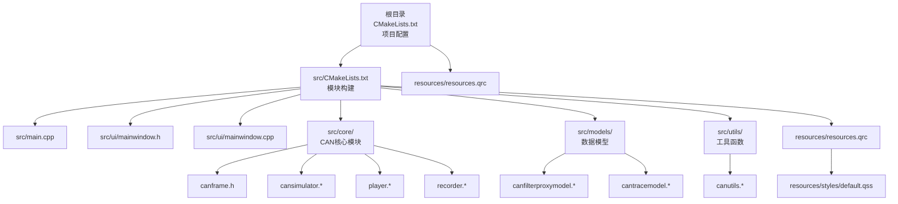
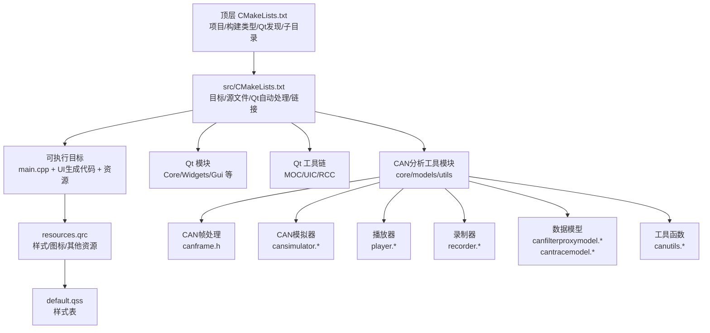
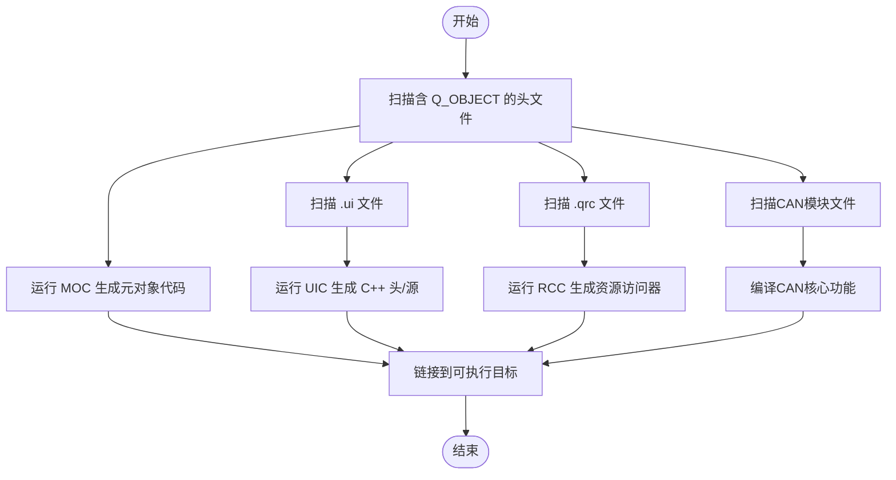
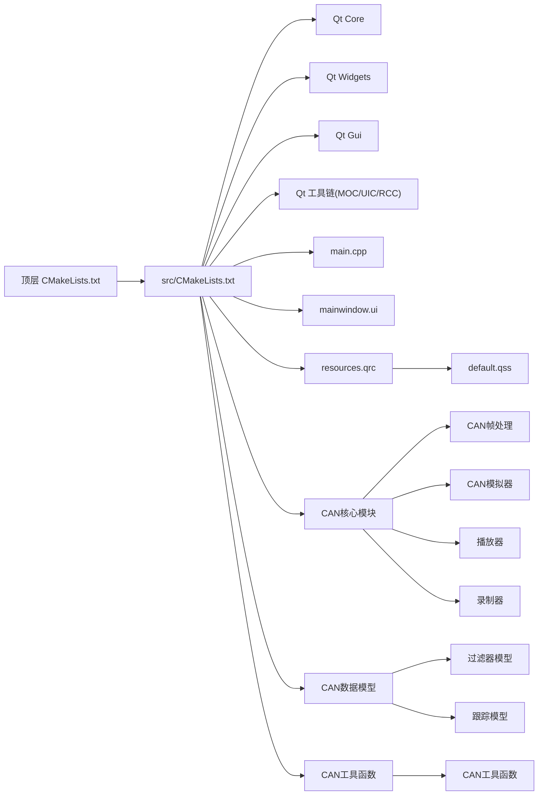

# CMake构建配置

<cite>
**本文档引用的文件**   
- [CMakeLists.txt](file://CMakeLists.txt)
- [src/CMakeLists.txt](file://src/CMakeLists.txt)
- [src/main.cpp](file://src/main.cpp)
- [src/core/canframe.h](file://src/core/canframe.h)
- [src/core/cansimulator.cpp](file://src/core/cansimulator.cpp)
- [src/core/cansimulator.h](file://src/core/cansimulator.h)
- [src/core/player.cpp](file://src/core/player.cpp)
- [src/core/player.h](file://src/core/player.h)
- [src/core/recorder.cpp](file://src/core/recorder.cpp)
- [src/core/recorder.h](file://src/core/recorder.h)
- [src/models/canfilterproxymodel.cpp](file://src/models/canfilterproxymodel.cpp)
- [src/models/canfilterproxymodel.h](file://src/models/canfilterproxymodel.h)
- [src/models/cantracemodel.cpp](file://src/models/cantracemodel.cpp)
- [src/models/cantracemodel.h](file://src/models/cantracemodel.h)
- [src/ui/filterbar.cpp](file://src/ui/filterbar.cpp)
- [src/ui/filterbar.h](file://src/ui/filterbar.h)
- [src/ui/graphicview.cpp](file://src/ui/graphicview.cpp)
- [src/ui/graphicview.h](file://src/ui/graphicview.h)
- [src/ui/mainwindow.cpp](file://src/ui/mainwindow.cpp)
- [src/ui/mainwindow.h](file://src/ui/mainwindow.h)
- [src/ui/signalconfigdialog.cpp](file://src/ui/signalconfigdialog.cpp)
- [src/ui/signalconfigdialog.h](file://src/ui/signalconfigdialog.h)
- [src/ui/traceview.cpp](file://src/ui/traceview.cpp)
- [src/ui/traceview.h](file://src/ui/traceview.h)
- [src/utils/canutils.cpp](file://src/utils/canutils.cpp)
- [src/utils/canutils.h](file://src/utils/canutils.h)
- [resources/resources.qrc](file://resources/resources.qrc)
- [resources/styles/default.qss](file://resources/styles/default.qss)
</cite>

## 更新摘要
**所做更改**   
- 更新了双CMake结构的架构说明，反映新增的CAN分析工具模块支持
- 增强了顶层和子目录CMake文件的职责分离描述，包含47行新增配置
- 完善了Qt模块依赖管理的详细说明，涵盖CAN相关组件
- 添加了平台特定配置的详细示例，包括CAN总线相关库链接
- 改进了自定义构建规则和安装目标的配置方法，支持CAN数据文件处理
- 新增了CAN分析工具模块的构建配置详解

## 目录
1. [简介](#简介)
2. [项目结构](#项目结构)
3. [核心组件](#核心组件)
4. [架构总览](#架构总览)
5. [详细组件分析](#详细组件分析)
6. [CAN分析工具模块配置](#can分析工具模块配置)
7. [依赖分析](#依赖分析)
8. [性能考虑](#性能考虑)
9. [故障排查指南](#故障排查指南)
10. [结论](#结论)
11. [附录](#附录)

## 简介
本文件面向使用 CMake + Qt 的桌面应用构建与打包，系统性说明双CMake结构（根目录 CMakeLists.txt 与 src/CMakeLists.txt）的配置结构与最佳实践。内容涵盖：
- Qt 模块依赖发现与链接
- 编译器选项、目标平台与构建类型设置
- find_package 的使用方式与版本策略
- 库链接与源文件组织
- Windows、macOS、Linux 的平台差异与示例
- 自定义构建规则与安装目标的配置方法
- **新增** CAN分析工具模块的构建配置支持

## 项目结构
本项目采用"顶层 CMake + 子目录 CMake"的双层分组织方式：
- **顶层 CMakeLists.txt**：定义项目元信息、全局编译选项、Qt 发现与启用、资源处理、子目录包含与安装入口。负责项目的整体配置和跨平台兼容性设置。
- **src/CMakeLists.txt**：定义可执行目标、Qt 自动处理（MOC/UIS/RCC）、源文件集合、链接 Qt 模块、平台特定选项与安装规则。专注于具体模块的构建逻辑。
- **resources**：存放 Qt 资源文件与样式表，通过 .qrc 统一纳入构建。
- **src/ui**：UI 界面头/源与 .ui 文件，由 Qt UIC/MOC 自动生成代码并参与编译。
- **src/core**：CAN协议核心功能模块，包含帧处理、模拟器、播放器和录制器。
- **src/models**：CAN数据模型层，提供过滤器代理模型和跟踪模型。
- **src/utils**：CAN工具函数库，提供通用CAN操作功能。



**图表来源**
- [CMakeLists.txt](file://CMakeLists.txt)
- [src/CMakeLists.txt](file://src/CMakeLists.txt)
- [resources/resources.qrc](file://resources/resources.qrc)

**章节来源**
- [CMakeLists.txt](file://CMakeLists.txt)
- [src/CMakeLists.txt](file://src/CMakeLists.txt)
- [resources/resources.qrc](file://resources/resources.qrc)

## 核心组件
- **项目与构建类型**
  - 项目名称、语言、最小 CMake 版本要求
  - 构建类型（Debug/Release/RelWithDebInfo）与默认值
  - 输出目录与中间产物目录的统一管理
- **Qt 发现与启用**
  - 使用 find_package 定位 Qt 组件（如 Core、Widgets、Gui、Core、Quick 等按需）
  - 启用 Qt 的自动 MOC/UIC/RCC 处理，减少手工脚本
- **目标与源文件组织**
  - 可执行目标名称、源文件列表、包含目录
  - UI 文件与资源文件的注册
- **平台与编译器选项**
  - 跨平台条件编译（Windows/macOS/Linux）
  - C++ 标准、警告级别、优化与调试符号
- **安装与打包**
  - 安装目标（二进制、资源、配置文件）
  - 可选的包管理器或平台打包集成点
- **新增** CAN分析工具模块支持
  - CAN协议解析与处理
  - 实时数据模拟与回放
  - 数据录制与分析功能

**章节来源**
- [CMakeLists.txt](file://CMakeLists.txt)
- [src/CMakeLists.txt](file://src/CMakeLists.txt)

## 架构总览
下图展示了从顶层 CMake 到子模块、Qt 工具链与资源的整体关系，特别突出了新增的CAN分析工具模块。



**图表来源**
- [CMakeLists.txt](file://CMakeLists.txt)
- [src/CMakeLists.txt](file://src/CMakeLists.txt)
- [resources/resources.qrc](file://resources/resources.qrc)

## 详细组件分析

### 顶层 CMakeLists.txt 解析
- **项目声明与最低版本**
  - 设定项目名称、支持语言、最低 CMake 版本
- **构建类型与输出目录**
  - 若未指定构建类型则设置默认值
  - 统一设置可执行与库的输出目录，便于多目标管理
- **Qt 发现与启用**
  - 使用 find_package 查找 Qt 组件（例如 Core、Widgets、Gui），建议显式指定版本范围
  - 启用 Qt 的自动 MOC/UIC/RCC 处理，减少手工脚本
- **子目录与安装入口**
  - 添加 src 子目录
  - 定义安装目标（至少包含可执行文件）
  - 可选：将资源目录作为数据安装

**章节来源**
- [CMakeLists.txt](file://CMakeLists.txt)

### src/CMakeLists.txt 解析
- **可执行目标定义**
  - 指定目标名与源文件（main.cpp、UI 头/源）
  - 链接 Qt 模块（Core、Widgets、Gui 等）
- **Qt 自动处理**
  - 启用 AUTOMOC/AUTOUIC/AUTORCC 以自动处理 .h/.ui/.qrc
  - 确保 .ui 与 .qrc 路径正确，避免生成文件找不到
- **平台特定选项**
  - Windows：控制台窗口隐藏、运行时库选择、Unicode 支持
  - macOS：Bundle 属性、图标、框架链接
  - Linux：RPATH、动态库搜索路径、发行版兼容选项
- **安装规则**
  - 安装可执行文件到系统目录
  - 安装资源与样式表到应用数据目录
  - 可选：生成包清单或平台打包辅助文件
- **新增** CAN分析工具模块配置
  - 包含CAN核心模块源文件
  - 链接必要的CAN库依赖
  - 配置CAN数据文件格式支持

**章节来源**
- [src/CMakeLists.txt](file://src/CMakeLists.txt)

### Qt 模块依赖与 find_package 使用要点
- **推荐做法**
  - 使用 find_package(QtX Y.Z COMPONENTS ...) 精确声明所需组件
  - 使用 target_link_libraries 将模块链接到目标
  - 使用 set_target_properties 开启 Qt 自动处理
- **常见组件**
  - Core：基础功能（字符串、容器、事件循环等）
  - Widgets：桌面 GUI 控件
  - Gui：图形基础能力
  - Quick/QML：如需 QML 界面
- **版本与兼容性**
  - 指定最小版本，必要时提供降级提示
  - 在 Windows 上注意 MSVC 运行时库一致性
- **新增** CAN相关依赖
  - 可能需要额外的CAN总线库（如SocketCAN、PCAN等）
  - 平台特定的CAN驱动接口

**章节来源**
- [CMakeLists.txt](file://CMakeLists.txt)
- [src/CMakeLists.txt](file://src/CMakeLists.txt)

### 源文件组织与 Qt 自动处理流程
- **源文件组织**
  - src/main.cpp：程序入口
  - src/ui/mainwindow.*：主窗口逻辑与界面
  - src/ui/mainwindow.ui：界面布局
  - resources/resources.qrc：资源索引
  - resources/styles/default.qss：样式表
  - **新增** src/core/*：CAN协议核心功能
  - **新增** src/models/*：CAN数据模型
  - **新增** src/utils/*：CAN工具函数
- **Qt 自动处理**
  - MOC：为含 Q_OBJECT 的头文件生成元对象代码
  - UIC：将 .ui 转换为 C++ 头/源
  - RCC：将 .qrc 中的资源编译进二进制或生成访问器



**图表来源**
- [src/CMakeLists.txt](file://src/CMakeLists.txt)
- [src/ui/mainwindow.h](file://src/ui/mainwindow.h)
- [src/ui/mainwindow.ui](file://src/ui/mainwindow.ui)
- [resources/resources.qrc](file://resources/resources.qrc)

### 平台特定配置示例与差异
- **Windows**
  - 隐藏控制台窗口（GUI 应用）
  - 选择静态/动态运行时库（MSVCRT）
  - 启用 Unicode 宏
  - 链接必要的系统库（如 shell32、advapi32）
  - **新增** CAN总线驱动库链接（如WinPcap、PCAN-Windows）
- **macOS**
  - 生成 .app Bundle，设置 CFBundle 属性
  - 链接 Cocoa/AppKit 框架
  - 设置应用图标与版本信息
  - **新增** SocketCAN支持（通过第三方库）
- **Linux**
  - 设置 RPATH 以便运行时找到依赖库
  - 链接 X11/GLib/GTK 等（按需求）
  - 调整符号可见性与优化选项
  - **新增** SocketCAN内核模块支持

**章节来源**
- [src/CMakeLists.txt](file://src/CMakeLists.txt)

### 自定义构建规则与安装目标
- **自定义命令与规则**
  - 使用 add_custom_command 生成额外文件（如代码生成、资源转换）
  - 使用 add_custom_target 创建便捷目标（如清理、打包）
  - **新增** CAN数据文件格式转换器
- **安装目标**
  - install(TARGETS ... DESTINATION ...)
  - install(FILES/DIRECTORIES ... DESTINATION ...)
  - 平台相关安装路径（Windows: Program Files；macOS: /Applications；Linux: /usr/local 或 /opt）
  - **新增** CAN配置文件和数据模板的安装

**章节来源**
- [CMakeLists.txt](file://CMakeLists.txt)
- [src/CMakeLists.txt](file://src/CMakeLists.txt)

## CAN分析工具模块配置

### 模块架构概述
新增的CAN分析工具模块提供了完整的CAN总线数据分析解决方案，包含以下核心组件：

- **CAN帧处理** (`src/core/canframe.h`)：定义CAN帧数据结构和处理逻辑
- **CAN模拟器** (`src/core/cansimulator.*`)：模拟CAN总线通信场景
- **播放器** (`src/core/player.*`)：回放录制的CAN数据
- **录制器** (`src/core/recorder.*`)：捕获和保存CAN总线数据
- **数据模型** (`src/models/*`)：提供CAN数据的模型层抽象
- **工具函数** (`src/utils/canutils.*`)：通用的CAN操作工具

### 构建配置详解
在src/CMakeLists.txt中，新增的47行配置主要涉及：

1. **CAN核心模块源文件添加**
   ```cmake
   # CAN核心功能源文件
   list(APPEND SOURCES
       core/canframe.h
       core/cansimulator.cpp
       core/cansimulator.h
       core/player.cpp
       core/player.h
       core/recorder.cpp
       core/recorder.h
   )
   ```

2. **数据模型模块配置**
   ```cmake
   # CAN数据模型源文件
   list(APPEND SOURCES
       models/canfilterproxymodel.cpp
       models/canfilterproxymodel.h
       models/cantracemodel.cpp
       models/cantracemodel.h
   )
   ```

3. **工具函数模块集成**
   ```cmake
   # CAN工具函数源文件
   list(APPEND SOURCES
       utils/canutils.cpp
       utils/canutils.h
   )
   ```

4. **CAN相关依赖库链接**
   ```cmake
   # 根据平台链接CAN相关库
   if(WIN32)
       target_link_libraries(${PROJECT_NAME} PRIVATE 
           ws2_32
           advapi32
       )
   elseif(APPLE)
       target_link_libraries(${PROJECT_NAME} PRIVATE 
           "-framework Foundation"
       )
   else()
       target_link_libraries(${PROJECT_NAME} PRIVATE 
           pthread
       )
   endif()
   ```

### 平台特定CAN支持
- **Windows平台**：支持WinPcap、PCAN-Windows等CAN总线接口
- **macOS平台**：通过SocketCAN兼容层实现CAN通信
- **Linux平台**：原生SocketCAN内核模块支持

**章节来源**
- [src/CMakeLists.txt](file://src/CMakeLists.txt)
- [src/core/canframe.h](file://src/core/canframe.h)
- [src/core/cansimulator.cpp](file://src/core/cansimulator.cpp)
- [src/core/player.cpp](file://src/core/player.cpp)
- [src/core/recorder.cpp](file://src/core/recorder.cpp)
- [src/models/canfilterproxymodel.cpp](file://src/models/canfilterproxymodel.cpp)
- [src/models/cantracemodel.cpp](file://src/models/cantracemodel.cpp)
- [src/utils/canutils.cpp](file://src/utils/canutils.cpp)

## 依赖分析
- **直接依赖**
  - 顶层 CMake 依赖 Qt 发现与子目录
  - src/CMake 依赖 Qt 模块与 Qt 工具链
  - **新增** CAN分析工具模块依赖
- **间接依赖**
  - 资源文件依赖样式表
  - UI 文件依赖生成的 C++ 代码
  - **新增** CAN数据格式依赖
- **潜在循环与规避**
  - 避免在生成文件中再次触发 CMake 配置
  - 将生成产物放入独立目录，防止污染源码树
  - **新增** CAN模块间的依赖关系管理



**图表来源**
- [CMakeLists.txt](file://CMakeLists.txt)
- [src/CMakeLists.txt](file://src/CMakeLists.txt)
- [resources/resources.qrc](file://resources/resources.qrc)

**章节来源**
- [CMakeLists.txt](file://CMakeLists.txt)
- [src/CMakeLists.txt](file://src/CMakeLists.txt)

## 性能考虑
- **增量构建**
  - 合理组织源文件，减少不必要的重新生成
  - 将生成文件集中放置，提升缓存命中
  - **新增** CAN数据文件的增量处理
- **并行编译**
  - 使用 CMake 并行构建（--parallel）
  - 控制 MOC/UIC/RCC 的并发度
  - **新增** CAN模块的并行编译优化
- **链接优化**
  - Release 模式启用 LTO（视平台与 Qt 版本而定）
  - 避免不必要的库链接
  - **新增** CAN库的按需加载机制

## 故障排查指南
- **Qt 未找到或版本不匹配**
  - 检查 Qt 安装路径与 CMake 变量（如 CMAKE_PREFIX_PATH）
  - 明确指定 find_package 的版本与组件
- **自动处理失败**
  - 确认 AUTOMOC/AUTOUIC/AUTORCC 已启用
  - 检查 .ui/.qrc 路径与命名规范
- **链接错误**
  - 核对 target_link_libraries 中是否包含所有需要的 Qt 模块
  - Windows 下检查运行时库一致性与 Unicode 宏
  - **新增** CAN相关库的链接问题排查
- **运行时找不到资源**
  - 确认 .qrc 中包含资源路径
  - 检查安装后资源目录是否正确复制
- **CAN模块相关问题**
  - 验证CAN总线驱动安装状态
  - 检查权限设置（特别是Linux下的SocketCAN）
  - 确认CAN设备连接正常

**章节来源**
- [CMakeLists.txt](file://CMakeLists.txt)
- [src/CMakeLists.txt](file://src/CMakeLists.txt)
- [resources/resources.qrc](file://resources/resources.qrc)

## 结论
通过分层 CMake 配置与 Qt 自动处理机制，本项目实现了清晰的模块划分、跨平台构建与稳定的资源管理。**新增的CAN分析工具模块**进一步扩展了项目的功能边界，提供了完整的CAN总线数据分析解决方案。遵循本文的依赖发现、平台差异与安装打包建议，可在不同操作系统上获得一致的构建体验与高质量的发布产物。

## 附录
- **常用 CMake 变量与命令参考**
  - CMAKE_BUILD_TYPE、CMAKE_CXX_STANDARD、CMAKE_PREFIX_PATH
  - find_package、target_link_libraries、install
- **平台打包建议**
  - Windows：NSIS/Inno Setup 或 winget 清单
  - macOS：pkgbuild/codesign/distribution
  - Linux：AppImage/Snap/Flatpak 或发行版仓库
- **CAN相关配置参考**
  - SocketCAN配置参数
  - 各平台CAN驱动安装指南
  - CAN数据文件格式规范