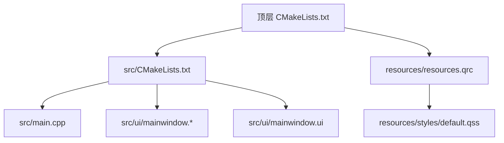
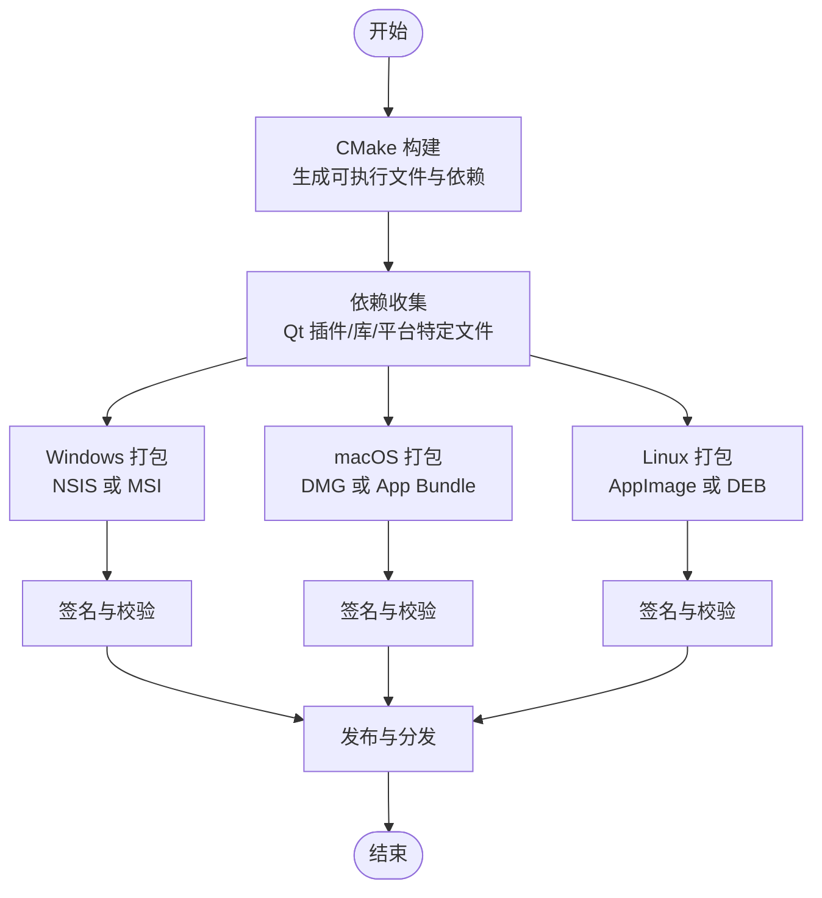
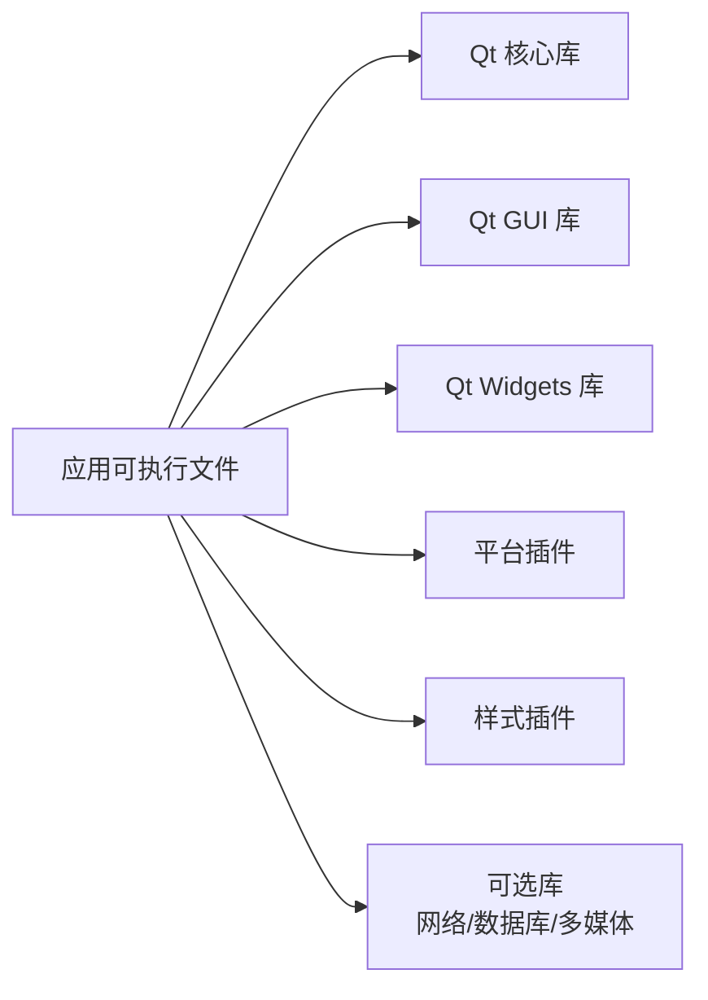

# 打包和部署

<cite>
**本文引用的文件**   
- [CMakeLists.txt](file://CMakeLists.txt)
- [src/CMakeLists.txt](file://src/CMakeLists.txt)
- [src/main.cpp](file://src/main.cpp)
- [src/ui/mainwindow.h](file://src/ui/mainwindow.h)
- [src/ui/mainwindow.cpp](file://src/ui/mainwindow.cpp)
- [src/ui/mainwindow.ui](file://src/ui/mainwindow.ui)
- [resources/resources.qrc](file://resources/resources.qrc)
- [README.en.md](file://README.en.md)
</cite>

## 目录
1. [简介](#简介)
2. [项目结构](#项目结构)
3. [核心组件](#核心组件)
4. [架构总览](#架构总览)
5. [详细组件分析](#详细组件分析)
6. [依赖分析](#依赖分析)
7. [性能考虑](#性能考虑)
8. [故障排查指南](#故障排查指南)
9. [结论](#结论)
10. [附录](#附录)

## 简介
本指南面向使用 Qt 与 CMake 构建的桌面应用，提供跨平台打包与部署的综合实践。内容覆盖 Windows（MSI/NSIS）、macOS（DMG）与 Linux（AppImage/DEB）的安装包制作；Qt 依赖库收集策略、动态库发现与运行时环境配置；CI/CD 集成示例、自动化构建脚本与发布流程最佳实践；以及应用签名、代码验证与安全部署注意事项。文档基于当前仓库中的 CMake 配置与 Qt 资源组织方式，给出可操作的步骤与图示说明。

## 项目结构
本项目采用 CMake 作为构建系统，Qt 作为 UI 框架，资源通过 Qt 资源系统（QRC）管理。顶层 CMakeLists 负责工程级设置与产物输出，src 子模块包含主程序入口与 UI 实现，resources 目录集中样式与资源清单。

图表来源
- [CMakeLists.txt:1-200](file://CMakeLists.txt#L1-L200)
- [src/CMakeLists.txt:1-200](file://src/CMakeLists.txt#L1-L200)
- [resources/resources.qrc:1-200](file://resources/resources.qrc#L1-L200)

章节来源
- [CMakeLists.txt:1-200](file://CMakeLists.txt#L1-L200)
- [src/CMakeLists.txt:1-200](file://src/CMakeLists.txt#L1-L200)
- [resources/resources.qrc:1-200](file://resources/resources.qrc#L1-L200)

## 核心组件
- 构建系统：CMake 负责目标定义、链接选项、安装规则与平台特性开关。
- 应用程序入口：main.cpp 初始化 Qt 应用并加载主窗口。
- UI 层：mainwindow 系列文件定义界面布局与交互逻辑。
- 资源系统：resources.qrc 将样式与静态资源编译进应用或按平台策略分发。

章节来源
- [src/main.cpp:1-200](file://src/main.cpp#L1-L200)
- [src/ui/mainwindow.h:1-200](file://src/ui/mainwindow.h#L1-L200)
- [src/ui/mainwindow.cpp:1-200](file://src/ui/mainwindow.cpp#L1-L200)
- [src/ui/mainwindow.ui:1-200](file://src/ui/mainwindow.ui#L1-L200)
- [resources/resources.qrc:1-200](file://resources/resources.qrc#L1-L200)

## 架构总览
下图展示从源码到各平台安装包的整体流程，包括构建、依赖收集、打包与签名环节。

图表来源
- [CMakeLists.txt:1-200](file://CMakeLists.txt#L1-L200)
- [src/CMakeLists.txt:1-200](file://src/CMakeLists.txt#L1-L200)
- [resources/resources.qrc:1-200](file://resources/resources.qrc#L1-L200)

## 详细组件分析

### 构建系统与安装规则（CMake）
- 顶层 CMakeLists 用于统一工程配置、版本信息与安装前缀设置。
- src/CMakeLists 定义可执行目标、链接 Qt 模块、启用 UIC/MOC/RCC 处理，并配置 install 规则以支持 cpack。
- resources.qrc 声明资源路径，便于在应用内访问样式与图标。

建议实践
- 使用 find_package(Qt6 REQUIRED COMPONENTS Widgets Core Gui) 定位 Qt 组件。
- 使用 set(CMAKE_INSTALL_PREFIX ...) 指定安装目录，配合 install(TARGETS ... RUNTIME DESTINATION bin) 等规则。
- 为不同平台设置变量（如 WIN32_EXECUTABLE、MACOSX_BUNDLE），以便后续打包工具识别产物。

章节来源
- [CMakeLists.txt:1-200](file://CMakeLists.txt#L1-L200)
- [src/CMakeLists.txt:1-200](file://src/CMakeLists.txt#L1-L200)
- [resources/resources.qrc:1-200](file://resources/resources.qrc#L1-L200)

### 应用程序入口与 UI 初始化
- main.cpp 负责创建 QApplication/QGuiApplication、设置应用元信息、加载主窗口并进入事件循环。
- mainwindow 类封装界面逻辑，UI 文件由 uic 生成对应头文件供 C++ 调用。

建议实践
- 在启动阶段加载 QSS 样式表，确保资源路径正确。
- 对异常进行捕获与日志记录，便于部署后问题定位。

章节来源
- [src/main.cpp:1-200](file://src/main.cpp#L1-L200)
- [src/ui/mainwindow.h:1-200](file://src/ui/mainwindow.h#L1-L200)
- [src/ui/mainwindow.cpp:1-200](file://src/ui/mainwindow.cpp#L1-L200)
- [src/ui/mainwindow.ui:1-200](file://src/ui/mainwindow.ui#L1-L200)

### 资源管理与样式加载
- resources.qrc 集中管理样式与图标，避免硬编码路径。
- default.qss 提供默认主题样式，可在运行时切换。

建议实践
- 使用 :/ 前缀访问 QRC 资源，保证跨平台一致性。
- 将大体积资源按需加载，减少启动时间。

章节来源
- [resources/resources.qrc:1-200](file://resources/resources.qrc#L1-L200)
- [src/ui/mainwindow.cpp:1-200](file://src/ui/mainwindow.cpp#L1-L200)

## 依赖分析
Qt 依赖与插件在不同平台差异较大，需按平台策略收集：
- Windows：Qt DLLs、平台插件（qwindows.dll）、样式插件（qwindowsvistastyle.dll）、网络/数据库等可选模块。
- macOS：Qt Frameworks、平台插件（QtWidgets.framework 等）、QML 相关库（若使用）。
- Linux：Qt 共享库、平台插件（libqxcb.so）、字体与媒体后端（freetype、harfbuzz、gst-plugins 等）。

图表来源
- [src/CMakeLists.txt:1-200](file://src/CMakeLists.txt#L1-L200)
- [CMakeLists.txt:1-200](file://CMakeLists.txt#L1-L200)

章节来源
- [src/CMakeLists.txt:1-200](file://src/CMakeLists.txt#L1-L200)
- [CMakeLists.txt:1-200](file://CMakeLists.txt#L1-L200)

## 性能考虑
- 启动优化：延迟加载非必要模块与资源，减少初始 I/O 与内存占用。
- 资源压缩：对图片与文本资源进行压缩，降低安装包体积。
- 并行构建：启用多核编译与增量构建，缩短 CI 时间。
- 依赖最小化：仅链接必要 Qt 模块，避免引入冗余库。

[本节为通用指导，不直接分析具体文件]

## 故障排查指南
常见问题与定位方法
- 运行时找不到 Qt DLL/Framework：检查 PATH/Library 路径与 rpath；使用依赖分析工具（Dependency Walker、otool、ldd）确认缺失项。
- 平台插件加载失败：确认 qwindows/qxcb 等插件随应用分发且路径正确。
- QRC 资源未生效：确认 RCC 已运行且资源路径前缀一致。
- 权限与沙箱限制：Linux AppImage 需要可执行位；macOS DMG 需正确签名与公证。

章节来源
- [src/CMakeLists.txt:1-200](file://src/CMakeLists.txt#L1-L200)
- [resources/resources.qrc:1-200](file://resources/resources.qrc#L1-L200)

## 结论
通过 CMake 统一构建、按平台策略收集 Qt 依赖、结合专用打包工具与签名流程，可实现稳定可靠的跨平台发布。建议在 CI 中固化构建与测试步骤，确保每次发布产物一致且可追溯。

[本节为总结性内容，不直接分析具体文件]

## 附录

### Windows 打包（MSI/NSIS）
- NSIS 方案
  - 使用 windeployqt 收集 Qt 依赖与插件。
  - 编写 NSIS 脚本，定义安装目录、快捷方式、卸载逻辑与注册表项。
  - 使用 signtool 对安装包与可执行文件签名。
- MSI 方案
  - 使用 WiX Toolset 或 Visual Studio Installer Projects 生成 MSI。
  - 通过 CMake install 规则生成 .wxs 或直接打包二进制。
  - 配置升级策略与补丁更新。

关键步骤
- 依赖收集：windeployqt --release --no-translations --dir <dist_dir> <exe_path>
- 打包：nsis 或 wix 工具链生成安装包
- 签名：signtool sign /f <证书.pfx> /p <密码> <文件路径>

章节来源
- [CMakeLists.txt:1-200](file://CMakeLists.txt#L1-L200)
- [src/CMakeLists.txt:1-200](file://src/CMakeLists.txt#L1-L200)

### macOS 打包（DMG）
- 应用包（App Bundle）
  - 使用 macdeployqt 自动拷贝 Qt Frameworks 与插件至 .app。
  - 配置 Info.plist 与图标。
- DMG 生成
  - 使用 hdiutil 创建磁盘映像，设置背景图与安装提示。
- 签名与公证
  - codesign 对 .app 与内部库签名。
  - xcrun altool 提交 Apple 公证。

关键步骤
- 依赖收集：macdeployqt <app_path> -verbose=1
- 签名：codesign --deep --sign "<开发者ID>" <app_path>
- 公证：xcrun altool --notarization-request ...

章节来源
- [CMakeLists.txt:1-200](file://CMakeLists.txt#L1-L200)
- [src/CMakeLists.txt:1-200](file://src/CMakeLists.txt#L1-L200)

### Linux 打包（AppImage/DEB）
- AppImage
  - 使用 linuxdeployqt 收集依赖并生成 AppImage。
  - 配置 AppRun 与 desktop 文件。
- DEB
  - 使用 dpkg-deb 或 fpm 将安装目录打包为 .deb。
  - 配置控制文件（control, postinst, prerm 等）。

关键步骤
- 依赖收集：linuxdeployqt <app_path> -appimage
- 签名：debsign 或 gpg 对 .deb 签名
- 校验：sha256sum 生成校验文件

章节来源
- [CMakeLists.txt:1-200](file://CMakeLists.txt#L1-L200)
- [src/CMakeLists.txt:1-200](file://src/CMakeLists.txt#L1-L200)

### Qt 依赖库打包策略与运行时环境配置
- 策略选择
  - 静态链接：增大体积但简化依赖；需启用 Qt 静态构建。
  - 动态收集：使用工具按平台收集依赖，保持较小体积。
- 运行时配置
  - Windows：PATH 环境变量或相对路径放置 DLL。
  - macOS：@rpath 与 install_name_tool 调整库路径。
  - Linux：LD_LIBRARY_PATH 或 rpath 嵌入。

章节来源
- [src/CMakeLists.txt:1-200](file://src/CMakeLists.txt#L1-L200)
- [CMakeLists.txt:1-200](file://CMakeLists.txt#L1-L200)

### CI/CD 集成示例与自动化构建脚本
- GitHub Actions
  - 矩阵构建：Windows/macOS/Linux 三端并行。
  - 缓存依赖：Qt SDK、包管理器缓存。
  - 上传制品：保存安装包与校验文件。
- 脚本要点
  - 构建阶段：cmake --build --config Release
  - 打包阶段：调用 windeployqt/macdeployqt/linuxdeployqt
  - 签名阶段：平台签名命令
  - 发布阶段：上传至 GitHub Releases 或对象存储

章节来源
- [CMakeLists.txt:1-200](file://CMakeLists.txt#L1-L200)
- [src/CMakeLists.txt:1-200](file://src/CMakeLists.txt#L1-L200)

### 应用签名、代码验证与安全部署注意事项
- 签名
  - Windows：使用 PFX 证书与 signtool。
  - macOS：使用开发者证书与 codesign，必要时进行公证。
  - Linux：使用 GPG 对包签名，客户端校验签名。
- 代码验证
  - 生成哈希文件（SHA256），随安装包分发。
  - 客户端启动时校验完整性。
- 安全部署
  - 最小权限原则：按需申请系统权限。
  - 敏感数据加密存储与传输。
  - 更新通道使用 HTTPS 与签名校验。

章节来源
- [CMakeLists.txt:1-200](file://CMakeLists.txt#L1-L200)
- [src/CMakeLists.txt:1-200](file://src/CMakeLists.txt#L1-L200)

### 发布流程最佳实践
- 版本号管理：语义化版本（SemVer），标签与分支策略一致。
- 制品命名规范：包含版本、平台与架构信息。
- 回滚策略：保留历史版本与快速回滚能力。
- 监控与反馈：集成崩溃上报与用户反馈渠道。

[本节为通用指导，不直接分析具体文件]