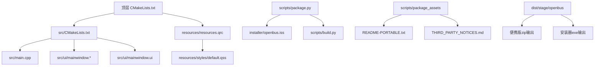
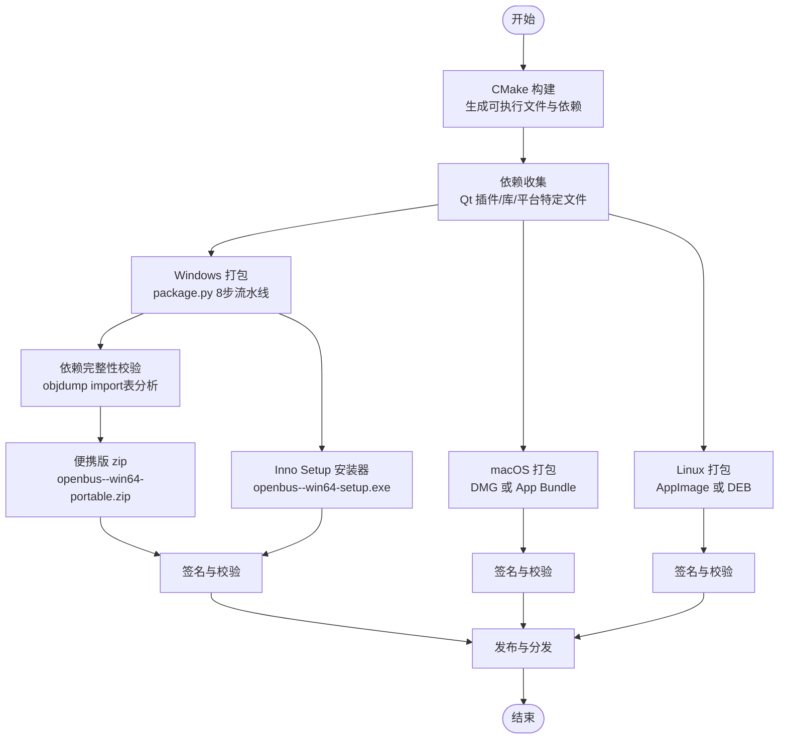
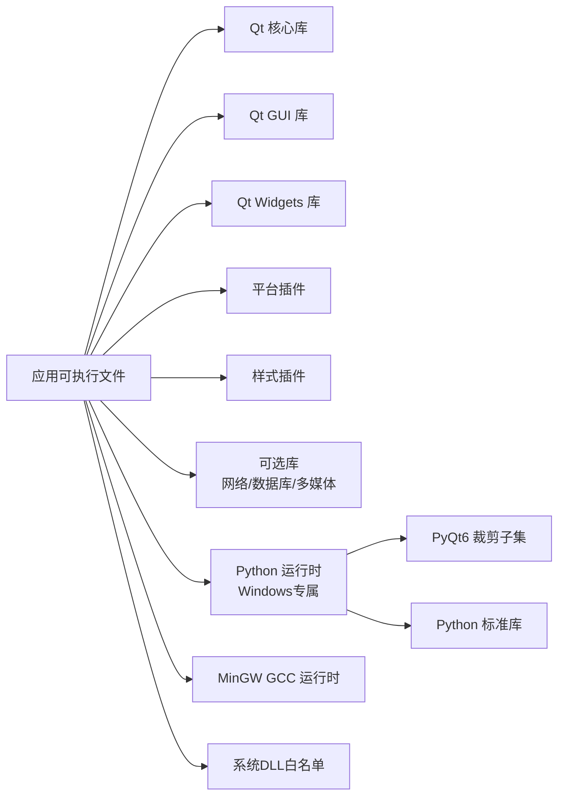

# 打包和部署

<cite>
**本文引用的文件**   
- [CMakeLists.txt](file://CMakeLists.txt)
- [src/CMakeLists.txt](file://src/CMakeLists.txt)
- [src/main.cpp](file://src/main.cpp)
- [src/ui/mainwindow.h](file://src/ui/mainwindow.h)
- [src/ui/mainwindow.cpp](file://src/ui/mainwindow.cpp)
- [src/ui/mainwindow.ui](file://src/ui/mainwindow.ui)
- [resources/resources.qrc](file://resources/resources.qrc)
- [scripts/package.py](file://scripts/package.py)
- [scripts/build.py](file://scripts/build.py)
- [installer/openbus.iss](file://installer/openbus.iss)
- [doc/打包安装方案.md](file://doc/打包安装方案.md)
- [scripts/package_assets/README-PORTABLE.txt](file://scripts/package_assets/README-PORTABLE.txt)
- [scripts/package_assets/THIRD_PARTY_NOTICES.md](file://scripts/package_assets/THIRD_PARTY_NOTICES.md)
</cite>

## 更新摘要
**所做更改**
- 新增完整的Windows便携包分发系统章节，反映8步自动化流水线实现
- 详细记录objdump依赖完整性校验机制和Qt 6.8.3部署策略
- 更新Python运行时捆绑策略，包含PyQt6裁剪子集优化
- 增强Inno Setup安装器配置说明和市场驱动分发机制
- 完善依赖管理和体积优化实践

## 目录
1. [简介](#简介)
2. [项目结构](#项目结构)
3. [核心组件](#核心组件)
4. [架构总览](#架构总览)
5. [详细组件分析](#详细组件分析)
6. [依赖分析](#依赖分析)
7. [性能考虑](#性能考虑)
8. [故障排查指南](#故障排查指南)
9. [结论](#结论)
10. [附录](#附录)

## 简介
本指南面向使用 Qt 与 CMake 构建的桌面应用，提供跨平台打包与部署的综合实践。内容覆盖 Windows（MSI/NSIS/Inno Setup）、macOS（DMG）与 Linux（AppImage/DEB）的安装包制作；Qt 依赖库收集策略、动态库发现与运行时环境配置；CI/CD 集成示例、自动化构建脚本与发布流程最佳实践；以及应用签名、代码验证与安全部署注意事项。**最新更新**：已实现完整的Windows便携包分发系统，支持一键生成57.4MB的openbus-0.1.0-win64-portable.zip，具备完整的依赖校验、Python运行时捆绑和市场驱动分发能力。

## 项目结构
本项目采用 CMake 作为构建系统，Qt 作为 UI 框架，资源通过 Qt 资源系统（QRC）管理。顶层 CMakeLists 负责工程级设置与产物输出，src 子模块包含主程序入口与 UI 实现，resources 目录集中样式与资源清单。**新增**：scripts目录包含完整的打包自动化脚本，installer目录包含Inno Setup安装器配置。

**图表来源**
- [CMakeLists.txt:1-94](file://CMakeLists.txt#L1-L94)
- [scripts/package.py:1-710](file://scripts/package.py#L1-L710)
- [installer/openbus.iss:1-98](file://installer/openbus.iss#L1-L98)

**章节来源**
- [CMakeLists.txt:1-94](file://CMakeLists.txt#L1-L94)
- [scripts/package.py:1-710](file://scripts/package.py#L1-L710)
- [installer/openbus.iss:1-98](file://installer/openbus.iss#L1-L98)

## 核心组件
- **构建系统**：CMake 负责目标定义、链接选项、安装规则与平台特性开关。
- **应用程序入口**：main.cpp 初始化 Qt 应用并加载主窗口。
- **UI 层**：mainwindow 系列文件定义界面布局与交互逻辑。
- **资源系统**：resources.qrc 将样式与静态资源编译进应用或按平台策略分发。
- **打包流水线**：scripts/package.py 提供完整的Windows打包自动化流程。
- **安装器配置**：installer/openbus.iss 定义Inno Setup安装器行为。

**章节来源**
- [src/main.cpp:1-200](file://src/main.cpp#L1-L200)
- [src/ui/mainwindow.h:1-200](file://src/ui/mainwindow.h#L1-L200)
- [src/ui/mainwindow.cpp:1-200](file://src/ui/mainwindow.cpp#L1-L200)
- [src/ui/mainwindow.ui:1-200](file://src/ui/mainwindow.ui#L1-L200)
- [resources/resources.qrc:1-200](file://resources/resources.qrc#L1-L200)
- [scripts/package.py:1-710](file://scripts/package.py#L1-L710)
- [installer/openbus.iss:1-98](file://installer/openbus.iss#L1-L98)

## 架构总览
下图展示从源码到各平台安装包的整体流程，包括构建、依赖收集、打包与签名环节。**更新**：新增Windows专用打包流水线，支持便携版和安装器双形态，具备完整的依赖校验机制。

**图表来源**
- [CMakeLists.txt:1-94](file://CMakeLists.txt#L1-L94)
- [scripts/package.py:1-710](file://scripts/package.py#L1-L710)
- [installer/openbus.iss:1-98](file://installer/openbus.iss#L1-L98)

## 详细组件分析

### 构建系统与安装规则（CMake）
- 顶层 CMakeLists 用于统一工程配置、版本信息与安装前缀设置。
- src/CMakeLists 定义可执行目标、链接 Qt 模块、启用 UIC/MOC/RCC 处理，并配置 install 规则以支持 cpack。
- resources.qrc 声明资源路径，便于在应用内访问样式与图标。

建议实践
- 使用 find_package(Qt6 REQUIRED COMPONENTS Widgets Core Gui) 定位 Qt 组件。
- 使用 set(CMAKE_INSTALL_PREFIX ...) 指定安装目录，配合 install(TARGETS ... RUNTIME DESTINATION bin) 等规则。
- 为不同平台设置变量（如 WIN32_EXECUTABLE、MACOSX_BUNDLE），以便后续打包工具识别产物。

**章节来源**
- [CMakeLists.txt:1-94](file://CMakeLists.txt#L1-L94)
- [src/CMakeLists.txt:1-200](file://src/CMakeLists.txt#L1-L200)
- [resources/resources.qrc:1-200](file://resources/resources.qrc#L1-L200)

### 应用程序入口与 UI 初始化
- main.cpp 负责创建 QApplication/QGuiApplication、设置应用元信息、加载主窗口并进入事件循环。
- mainwindow 类封装界面逻辑，UI 文件由 uic 生成对应头文件供 C++ 调用。

建议实践
- 在启动阶段加载 QSS 样式表，确保资源路径正确。
- 对异常进行捕获与日志记录，便于部署后问题定位。

**章节来源**
- [src/main.cpp:1-200](file://src/main.cpp#L1-L200)
- [src/ui/mainwindow.h:1-200](file://src/ui/mainwindow.h#L1-L200)
- [src/ui/mainwindow.cpp:1-200](file://src/ui/mainwindow.cpp#L1-L200)
- [src/ui/mainwindow.ui:1-200](file://src/ui/mainwindow.ui#L1-L200)

### 资源管理与样式加载
- resources.qrc 集中管理样式与图标，避免硬编码路径。
- default.qss 提供默认主题样式，可在运行时切换。

建议实践
- 使用 :/ 前缀访问 QRC 资源，保证跨平台一致性。
- 将大体积资源按需加载，减少启动时间。

**章节来源**
- [resources/resources.qrc:1-200](file://resources/resources.qrc#L1-L200)
- [src/ui/mainwindow.cpp:1-200](file://src/ui/mainwindow.cpp#L1-L200)

### Windows 便携包分发系统（全新实现）
**scripts/package.py** 提供了完整的Windows便携包自动化流水线，实现了8步标准化流程，一键生成57.4MB的便携包。

核心功能：
- **自动构建**：调用build.py进行Release构建，支持增量构建和并行编译
- **Qt部署**：使用windeployqt收集Qt 6.8.3依赖，手动补充缺失的DLL（如Qt6PrintSupport.dll）
- **staging组装**：按白名单策略收集必需文件，排除不必要的组件
- **Python运行时捆绑**：精简拷贝本机Python 3.14安装版，包含PyQt6裁剪子集
- **依赖完整性校验**：使用objdump检查所有PE文件的import表，确保无缺失依赖
- **双形态输出**：生成便携版zip和专业安装器

关键特性：
- **零网络依赖**：所有依赖本地化，适合离线环境
- **智能降级**：硬件驱动缺失时优雅降级，不影响基础功能
- **双语支持**：安装器支持中英文界面
- **体积优化**：通过精确控制依赖集合，保持安装包体积≤60MB
- **市场驱动分发**：plugins/和drivers/不预装，用户从内置市场按需安装

**章节来源**
- [scripts/package.py:1-710](file://scripts/package.py#L1-L710)
- [scripts/build.py:1-662](file://scripts/build.py#L1-L662)
- [doc/打包安装方案.md:1-331](file://doc/打包安装方案.md#L1-L331)

### Inno Setup 安装器配置（增强）
**installer/openbus.iss** 定义了专业的Windows安装器行为，支持与便携版共享同一套staging目录。

主要特性：
- **双形态支持**：同一套staging目录同时支持便携版zip和安装器
- **用户友好**：支持开始菜单快捷方式、桌面图标可选、卸载保护用户数据
- **硬件检测**：安装完成页检测ZLG/PEAK/Kvaser驱动状态并提供安装引导
- **双语向导**：支持中文和英文安装界面
- **升级支持**：允许覆盖安装，自动检测运行中进程

安装器行为：
- 默认安装目录：`C:\Program Files\openbus\`
- 卸载策略：仅删除安装目录和快捷方式，保留`%APPDATA%\openbus\`用户数据
- 驱动提示：检测厂商驱动缺失情况，提供安装指引但不阻塞安装

**章节来源**
- [installer/openbus.iss:1-98](file://installer/openbus.iss#L1-L98)

### Python 运行时捆绑策略（重大更新）
**重要更新**：采用本机安装版Python精简拷贝而非embeddable版本，实现零网络依赖。

策略优势：
- **零网络依赖**：无需下载embeddable zip，完全本地化
- **标准库完整**：包含完整Python标准库，支持插件开发
- **隔离运行**：通过`python314._pth`实现路径隔离，不污染系统环境
- **PyQt6裁剪**：仅包含uds-diagnostic插件所需的QtCore/Gui/Widgets/Svg模块

捆绑内容：
- Python解释器核心（python314.dll, python.exe等）
- 精简DLLs目录（剔除tkinter相关组件）
- 完整Lib标准库（剔除GUI和测试模块）
- PyQt6裁剪子集（约43MB，含Qt运行时）
- 版本锁定文件（requirements-lock.txt）

**章节来源**
- [scripts/package.py:371-492](file://scripts/package.py#L371-L492)
- [doc/打包安装方案.md:160-198](file://doc/打包安装方案.md#L160-L198)

### 依赖完整性校验机制（新增）
**scripts/package.py** 实现了基于objdump的依赖完整性校验，确保打包产物在所有环境下可运行。

校验流程：
- 遍历staging目录下所有exe/dll/pyd文件
- 使用`objdump -p`提取每个文件的import表
- 逐一核对依赖DLL是否在staging内或系统白名单中
- 缺失依赖立即失败，防止"漏拷只在用户机器上炸"

系统DLL白名单包含：
- Windows核心系统DLL（kernel32.dll, user32.dll等）
- VC运行库（msvcp140.dll, vcruntime140.dll等）
- Qt相关系统依赖（rpcrt4.dll, shcore.dll等）

**章节来源**
- [scripts/package.py:521-565](file://scripts/package.py#L521-L565)

### 市场驱动分发策略（新增）
**重要更新**：采用市场化分发策略，硬件驱动不随包预装，降低包体积并符合授权要求。

驱动策略：
- **不预装**：zlgcan.dll、PCANUSB.dll、canlib32.dll等厂商SDK不随包
- **优雅降级**：驱动缺失时相应设备不可用，但不影响其他功能
- **市场安装**：通过内置插件市场按需安装驱动包（.odp格式）
- **离线支持**：market目录包含本地市场索引，支持离线安装

厂商驱动引导：
- README-PORTABLE.txt提供各厂商驱动安装链接
- 安装器完成页检测驱动状态并显示提示信息
- 设备连接页面提供安装引导文案

**章节来源**
- [scripts/package.py:29-31](file://scripts/package.py#L29-L31)
- [scripts/package_assets/README-PORTABLE.txt:22-29](file://scripts/package_assets/README-PORTABLE.txt#L22-L29)
- [doc/打包安装方案.md:200-213](file://doc/打包安装方案.md#L200-L213)

## 依赖分析
Qt 依赖与插件在不同平台差异较大，需按平台策略收集：
- **Windows**：Qt DLLs、平台插件（qwindows.dll）、样式插件（qwindowsvistastyle.dll）、网络/数据库等可选模块。
- **macOS**：Qt Frameworks、平台插件（QtWidgets.framework 等）、QML 相关库（若使用）。
- **Linux**：Qt 共享库、平台插件（libqxcb.so）、字体与媒体后端（freetype、harfbuzz、gst-plugins 等）。

**更新**：Windows平台新增Python运行时和PyQt6依赖管理，以及完整的依赖校验机制。

**图表来源**
- [src/CMakeLists.txt:1-200](file://src/CMakeLists.txt#L1-L200)
- [scripts/package.py:1-710](file://scripts/package.py#L1-L710)

**章节来源**
- [src/CMakeLists.txt:1-200](file://src/CMakeLists.txt#L1-L200)
- [CMakeLists.txt:1-94](file://CMakeLists.txt#L1-L94)

## 性能考虑
- **启动优化**：延迟加载非必要模块与资源，减少初始 I/O 与内存占用。
- **资源压缩**：对图片与文本资源进行压缩，降低安装包体积。
- **并行构建**：启用多核编译与增量构建，缩短 CI 时间。
- **依赖最小化**：仅链接必要 Qt 模块，避免引入冗余库。
- **Windows优化**：通过精确的依赖白名单控制，避免不必要的DLL随包。
- **体积优化**：便携包控制在57.4MB（≤60MB预算），通过剔除kerneldlls和Qt6Test.dll等实现。

## 故障排查指南
常见问题与定位方法
- **运行时找不到 Qt DLL/Framework**：检查 PATH/Library 路径与 rpath；使用依赖分析工具（Dependency Walker、otool、ldd）确认缺失项。
- **平台插件加载失败**：确认 qwindows/qxcb 等插件随应用分发且路径正确。
- **QRC 资源未生效**：确认 RCC 已运行且资源路径前缀一致。
- **权限与沙箱限制**：Linux AppImage 需要可执行位；macOS DMG 需正确签名与公证。
- **Windows打包问题**：使用package.py的--skip-build跳过构建步骤单独调试打包流程。
- **Python运行时错误**：检查runtime/python/_pth文件配置和site-packages目录结构。
- **依赖校验失败**：查看package.py第6步输出的缺失依赖列表，通常是遗漏了某个DLL。

**章节来源**
- [src/CMakeLists.txt:1-200](file://src/CMakeLists.txt#L1-L200)
- [resources/resources.qrc:1-200](file://resources/resources.qrc#L1-L200)
- [scripts/package.py:521-565](file://scripts/package.py#L521-L565)

## 结论
通过 CMake 统一构建、按平台策略收集 Qt 依赖、结合专用打包工具与签名流程，可实现稳定可靠的跨平台发布。**最新进展**：Windows平台已实现完整的自动化打包流水线，支持便携版和安装器双形态分发，具备专业级的依赖管理和用户体验。57.4MB的便携包已满足≤60MB的体积预算，完整的依赖校验机制确保了打包质量。建议在 CI 中固化构建与测试步骤，确保每次发布产物一致且可追溯。

## 附录

### Windows 便携包分发（全新实现）
**已实现完整的8步自动化流水线**，支持一键生成专业级便携包。

- **8步流水线**：
  1. 配置并构建 Release（复用 build.py）
  2. windeployqt 部署（Qt 6.8.3 + 手动补拷）
  3. 组装 staging 目录（白名单策略）
  4. 捆绑 Python 运行时（本机安装版精简拷贝）
  5. 附加文件（NOTICES + LICENSE + README）
  6. 依赖完整性校验（objdump import表分析）
  7. 体积与内容报告
  8a/8b 便携版 zip / Inno Setup 安装器

- **输出产物**：
  - `openbus-0.1.0-win64-portable.zip`（57.4 MB，≤60MB预算）
  - `openbus-0.1.0-win64-setup.exe`（Inno Setup安装器）

- **关键特性**：
  - 零网络依赖：所有依赖本地化
  - 完整依赖校验：objdump分析88个PE模块，744条import，0缺失
  - 市场驱动分发：plugins/drivers不预装，用户按需安装
  - Python运行时隔离：通过._pth文件实现路径隔离

**章节来源**
- [scripts/package.py:1-710](file://scripts/package.py#L1-L710)
- [doc/打包安装方案.md:113-157](file://doc/打包安装方案.md#L113-L157)

### macOS 打包（DMG）
- **应用包（App Bundle）**
  - 使用 macdeployqt 自动拷贝 Qt Frameworks 与插件至 .app。
  - 配置 Info.plist 与图标。
- **DMG 生成**
  - 使用 hdiutil 创建磁盘映像，设置背景图与安装提示。
- **签名与公证**
  - codesign 对 .app 与内部库签名。
  - xcrun altool 提交 Apple 公证。

关键步骤
- 依赖收集：`macdeployqt <app_path> -verbose=1`
- 签名：`codesign --deep --sign "<开发者ID>" <app_path>`
- 公证：`xcrun altool --notarization-request ...`

**章节来源**
- [CMakeLists.txt:1-94](file://CMakeLists.txt#L1-L94)
- [src/CMakeLists.txt:1-200](file://src/CMakeLists.txt#L1-L200)

### Linux 打包（AppImage/DEB）
- **AppImage**
  - 使用 linuxdeployqt 收集依赖并生成 AppImage。
  - 配置 AppRun 与 desktop 文件。
- **DEB**
  - 使用 dpkg-deb 或 fpm 将安装目录打包为 .deb。
  - 配置控制文件（control, postinst, prerm 等）。

关键步骤
- 依赖收集：`linuxdeployqt <app_path> -appimage`
- 签名：debsign 或 gpg 对 .deb 签名
- 校验：sha256sum 生成校验文件

**章节来源**
- [CMakeLists.txt:1-94](file://CMakeLists.txt#L1-L94)
- [src/CMakeLists.txt:1-200](file://src/CMakeLists.txt#L1-L200)

### Qt 依赖库打包策略与运行时环境配置
- **策略选择**
  - 静态链接：增大体积但简化依赖；需启用 Qt 静态构建。
  - 动态收集：使用工具按平台收集依赖，保持较小体积。
- **运行时配置**
  - Windows：PATH 环境变量或相对路径放置 DLL。
  - macOS：@rpath 与 install_name_tool 调整库路径。
  - Linux：LD_LIBRARY_PATH 或 rpath 嵌入。
- **Windows特殊处理**
  - 使用windeployqt自动收集Qt依赖
  - 手动补充缺失的Qt6PrintSupport.dll
  - 创建lib/fonts目录消除字体警告

**章节来源**
- [src/CMakeLists.txt:1-200](file://src/CMakeLists.txt#L1-L200)
- [CMakeLists.txt:1-94](file://CMakeLists.txt#L1-L94)
- [scripts/package.py:270-296](file://scripts/package.py#L270-L296)

### CI/CD 集成示例与自动化构建脚本
- **GitHub Actions**
  - 矩阵构建：Windows/macOS/Linux 三端并行。
  - 缓存依赖：Qt SDK、包管理器缓存。
  - 上传制品：保存安装包与校验文件。
- **脚本要点**
  - 构建阶段：`cmake --build --config Release`
  - 打包阶段：调用 `python scripts/package.py`
  - 签名阶段：平台签名命令
  - 发布阶段：上传至 GitHub Releases 或对象存储

**章节来源**
- [CMakeLists.txt:1-94](file://CMakeLists.txt#L1-L94)
- [scripts/package.py:672-706](file://scripts/package.py#L672-L706)

### 应用签名、代码验证与安全部署注意事项
- **签名**
  - Windows：使用 PFX 证书与 signtool。
  - macOS：使用开发者证书与 codesign，必要时进行公证。
  - Linux：使用 GPG 对包签名，客户端校验签名。
- **代码验证**
  - 生成哈希文件（SHA256），随安装包分发。
  - 客户端启动时校验完整性。
- **安全部署**
  - 最小权限原则：按需申请系统权限。
  - 敏感数据加密存储与传输。
  - 更新通道使用 HTTPS 与签名校验。
- **Windows安全考虑**
  - SmartScreen提示处理：提供README说明用户如何继续安装
  - 驱动程序签名：厂商驱动需符合Windows驱动签名要求
  - 用户账户控制：安装器请求管理员权限进行系统级操作

**章节来源**
- [CMakeLists.txt:1-94](file://CMakeLists.txt#L1-L94)
- [scripts/package.py:102-121](file://scripts/package.py#L102-L121)
- [scripts/package_assets/README-PORTABLE.txt:36-42](file://scripts/package_assets/README-PORTABLE.txt#L36-L42)

### 发布流程最佳实践
- **版本号管理**：语义化版本（SemVer），标签与分支策略一致。
- **制品命名规范**：包含版本、平台与架构信息。
- **回滚策略**：保留历史版本与快速回滚能力。
- **监控与反馈**：集成崩溃上报与用户反馈渠道。
- **Windows发布流程**
  - 使用package.py生成标准化产物
  - 执行完整的依赖完整性校验
  - 在干净VM中进行冒烟测试
  - 生成详细的打包报告

**章节来源**
- [doc/打包安装方案.md:249-270](file://doc/打包安装方案.md#L249-L270)
- [scripts/package.py:580-610](file://scripts/package.py#L580-L610)

### 许可合规与第三方组件管理
**THIRD_PARTY_NOTICES.md** 详细列出了所有随包分发的第三方组件及其许可证。

关键组件：
- **Qt 6**：LGPLv3，允许动态链接分发
- **MinGW 运行时**：GPL + GCC Runtime Library Exception
- **PyQt6**：GPLv3，仅供uds-diagnostic插件使用
- **Python 3.14**：PSF License，允许再分发
- **商业组件**：qcustomplot、vector_blf等GPL组件单独列出

合规措施：
- 随包附带完整的第三方许可声明
- 提供源码获取途径
- 允许用户替换Qt DLL以满足LGPL要求
- 明确标注商业组件的使用限制

**章节来源**
- [scripts/package_assets/THIRD_PARTY_NOTICES.md:1-84](file://scripts/package_assets/THIRD_PARTY_NOTICES.md#L1-L84)
- [doc/打包安装方案.md:231-246](file://doc/打包安装方案.md#L231-L246)

### 硬件驱动管理策略
**重要更新**：采用市场化分发策略，硬件驱动不随包预装。

驱动策略：
- **不预装**：zlgcan.dll、PCANUSB.dll、canlib32.dll等厂商SDK不随包
- **优雅降级**：驱动缺失时相应设备不可用，但不影响其他功能
- **市场安装**：通过内置插件市场按需安装驱动包（.odp格式）
- **离线支持**：market目录包含本地市场索引，支持离线安装

厂商驱动引导：
- README-PORTABLE.txt提供各厂商驱动安装链接
- 安装器完成页检测驱动状态并显示提示信息
- 设备连接页面提供安装引导文案

**章节来源**
- [scripts/package.py:29-31](file://scripts/package.py#L29-L31)
- [scripts/package_assets/README-PORTABLE.txt:22-29](file://scripts/package_assets/README-PORTABLE.txt#L22-L29)
- [doc/打包安装方案.md:200-213](file://doc/打包安装方案.md#L200-L213)

### 体积优化与预算管理
**实施成果**：成功将便携包体积控制在57.4MB，满足≤60MB的预算要求。

体积构成：
- openbus.exe（Release）：1.8 MB
- 业务DLL ×7：10.0 MB
- Qt 运行时：26.7 MB + 2.7 MB（插件目录）
- MinGW 运行时 ×3：2.3 MB
- D3Dcompiler + opengl32sw：23.7 MB
- Python 运行时 + PyQt6 子集：72.8 MB
- market/（离线安装源）：5.0 MB
- **合计/zip后**：57.4 MB ✅

优化措施：
- 剔除kerneldlls（31.5 MB，决策7）
- 剔除Qt6Test.dll（全量构建副产物）
- translations只保留zh_CN
- PyQt6裁剪子集（仅所需模块）

**章节来源**
- [doc/打包安装方案.md:273-289](file://doc/打包安装方案.md#L273-L289)
- [scripts/package.py:571-610](file://scripts/package.py#L571-L610)