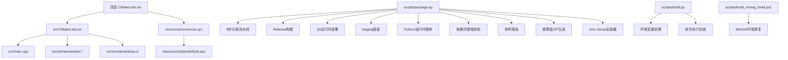
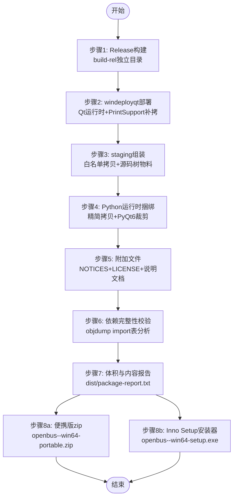
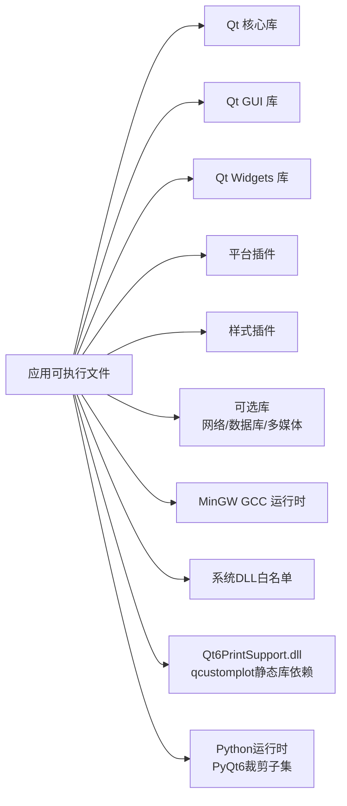

# 打包和部署

<cite>
**本文引用的文件**   
- [CMakeLists.txt](file://CMakeLists.txt)
- [src/CMakeLists.txt](file://src/CMakeLists.txt)
- [src/main.cpp](file://src/main.cpp)
- [scripts/build.py](file://scripts/build.py)
- [scripts/package.py](file://scripts/package.py)
- [scripts/build_minwg_fixed.ps1](file://scripts/build_minwg_fixed.ps1)
- [doc/打包安装方案.md](file://doc/打包安装方案.md)
- [scripts/package_assets/README-PORTABLE.txt](file://scripts/package_assets/README-PORTABLE.txt)
- [scripts/package_assets/THIRD_PARTY_NOTICES.md](file://scripts/package_assets/THIRD_PARTY_NOTICES.md)
</cite>

## 更新摘要
**所做更改**
- 新增了完整的8步Windows分发流水线，基于scripts/package.py实现
- 详细说明了Release构建、Qt运行时部署、staging组装、Python运行时捆绑等关键步骤
- 添加了objdump依赖完整性校验机制的详细说明
- 更新了便携版ZIP和Inno Setup安装器的生成流程
- 完善了PyQt6隔离和裁剪策略的实现细节
- 增强了故障排查指南中的依赖验证和DLL加载问题解决方案

## 目录
1. [简介](#简介)
2. [项目结构](#项目结构)
3. [核心组件](#核心组件)
4. [架构总览](#架构总览)
5. [详细组件分析](#详细组件分析)
6. [依赖分析](#依赖分析)
7. [性能考虑](#性能考虑)
8. [故障排查指南](#故障排查指南)
9. [结论](#结论)
10. [附录](#附录)

## 简介
本指南面向使用 Qt 与 CMake 构建的桌面应用，提供跨平台打包与部署的综合实践。内容覆盖 Windows（MSI/NSIS/Inno Setup）、macOS（DMG）与 Linux（AppImage/DEB）的安装包制作；Qt 依赖库收集策略、动态库发现与运行时环境配置；CI/CD 集成示例、自动化构建脚本与发布流程最佳实践；以及应用签名、代码验证与安全部署注意事项。**最新更新**：实现了完整的8步Windows分发流水线，包括Release构建、Qt运行时部署、staging组装、Python运行时捆绑、依赖完整性校验、体积报告、便携版ZIP生成和Inno Setup安装器创建。

## 项目结构
本项目采用 CMake 作为构建系统，Qt 作为 UI 框架，资源通过 Qt 资源系统（QRC）管理。顶层 CMakeLists 负责工程级设置与产物输出，src 子模块包含主程序入口与 UI 实现，resources 目录集中样式与资源清单。**更新**：scripts目录现在包含完整的打包流水线脚本package.py，以及增强的构建脚本build.py和PowerShell辅助脚本。



**图表来源**
- [CMakeLists.txt:1-100](file://CMakeLists.txt#L1-L100)
- [scripts/package.py:1-710](file://scripts/package.py#L1-L710)
- [scripts/build.py:1-662](file://scripts/build.py#L1-L662)
- [scripts/build_minwg_fixed.ps1:1-99](file://scripts/build_minwg_fixed.ps1#L1-L99)

**章节来源**
- [CMakeLists.txt:1-100](file://CMakeLists.txt#L1-L100)
- [scripts/package.py:1-710](file://scripts/package.py#L1-L710)
- [scripts/build.py:1-662](file://scripts/build.py#L1-L662)
- [scripts/build_minwg_fixed.ps1:1-99](file://scripts/build_minwg_fixed.ps1#L1-L99)

## 核心组件
- **构建系统**：CMake 负责目标定义、链接选项、安装规则与平台特性开关。
- **应用程序入口**：main.cpp 初始化 Qt 应用并加载主窗口。
- **UI 层**：mainwindow 系列文件定义界面布局与交互逻辑。
- **资源系统**：resources.qrc 将样式与静态资源编译进应用或按平台策略分发。
- **完整打包流水线**：scripts/package.py 提供8步Windows分发流程。
- **增强构建脚本**：scripts/build.py 提供环境变量处理和命令执行功能。
- **PowerShell辅助脚本**：scripts/build_minwg_fixed.ps1 解决MinGW环境问题。
- **打包策略文档**：doc/打包安装方案.md 详细说明各平台打包方法。

**章节来源**
- [src/main.cpp:1-200](file://src/main.cpp#L1-L200)
- [src/ui/mainwindow.h:1-200](file://src/ui/mainwindow.h#L1-L200)
- [src/ui/mainwindow.cpp:1-200](file://src/ui/mainwindow.cpp#L1-L200)
- [src/ui/mainwindow.ui:1-200](file://src/ui/mainwindow.ui#L1-L200)
- [resources/resources.qrc:1-200](file://resources/resources.qrc#L1-L200)
- [scripts/package.py:1-710](file://scripts/package.py#L1-L710)
- [scripts/build.py:1-662](file://scripts/build.py#L1-L662)
- [scripts/build_minwg_fixed.ps1:1-99](file://scripts/build_minwg_fixed.ps1#L1-L99)
- [doc/打包安装方案.md:1-331](file://doc/打包安装方案.md#L1-L331)

## 架构总览
下图展示从源码到各平台安装包的整体流程，包括构建、依赖收集、打包与签名环节。**更新**：新增了完整的8步Windows分发流水线，提供了从零开始的可重复构建体验。



**图表来源**
- [scripts/package.py:227-705](file://scripts/package.py#L227-L705)
- [doc/打包安装方案.md:113-157](file://doc/打包安装方案.md#L113-L157)

## 详细组件分析

### 构建系统与安装规则（CMake）
- 顶层 CMakeLists 用于统一工程配置、版本信息与安装前缀设置。
- src/CMakeLists 定义可执行目标、链接 Qt 模块、启用 UIC/MOC/RCC 处理，并配置 install 规则以支持 cpack。
- resources.qrc 声明资源路径，便于在应用内访问样式与图标。

建议实践
- 使用 find_package(Qt6 REQUIRED COMPONENTS Widgets Core Gui) 定位 Qt 组件。
- 使用 set(CMAKE_INSTALL_PREFIX ...) 指定安装目录，配合 install(TARGETS ... RUNTIME DESTINATION bin) 等规则。
- 为不同平台设置变量（如 WIN32_EXECUTABLE、MACOSX_BUNDLE），以便后续打包工具识别产物。

**章节来源**
- [CMakeLists.txt:1-100](file://CMakeLists.txt#L1-L100)
- [src/CMakeLists.txt:1-200](file://src/CMakeLists.txt#L1-L200)
- [resources/resources.qrc:1-200](file://resources/resources.qrc#L1-L200)

### 应用程序入口与 UI 初始化
- main.cpp 负责创建 QApplication/QGuiApplication、设置应用元信息、加载主窗口并进入事件循环。
- mainwindow 类封装界面逻辑，UI 文件由 uic 生成对应头文件供 C++ 调用。

建议实践
- 在启动阶段加载 QSS 样式表，确保资源路径正确。
- 对异常进行捕获与日志记录，便于部署后问题定位。

**章节来源**
- [src/main.cpp:1-200](file://src/main.cpp#L1-L200)
- [src/ui/mainwindow.h:1-200](file://src/ui/mainwindow.h#L1-L200)
- [src/ui/mainwindow.cpp:1-200](file://src/ui/mainwindow.cpp#L1-L200)
- [src/ui/mainwindow.ui:1-200](file://src/ui/mainwindow.ui#L1-L200)

### 资源管理与样式加载
- resources.qrc 集中管理样式与图标，避免硬编码路径。
- default.qss 提供默认主题样式，可在运行时切换。

建议实践
- 使用 :/ 前缀访问 QRC 资源，保证跨平台一致性。
- 将大体积资源按需加载，减少启动时间。

**章节来源**
- [resources/resources.qrc:1-200](file://resources/resources.qrc#L1-L200)
- [src/ui/mainwindow.cpp:1-200](file://src/ui/mainwindow.cpp#L1-L200)

### 完整8步Windows分发流水线（重大更新）
**scripts/package.py** 实现了完整的Windows分发流水线，提供一键式打包体验。

核心功能：
- **步骤1 - Release构建**：复用build.py构建独立build-rel目录，全量构建包含所有驱动插件
- **步骤2 - Qt运行时部署**：windeployqt部署+Qt6PrintSupport手动补拷+中文翻译回拷+字体目录创建
- **步骤3 - staging组装**：白名单文件拷贝+源码树物料+市场索引随包
- **步骤4 - Python运行时捆绑**：本机安装版精简拷贝+PyQt6裁剪子集+._pth隔离
- **步骤5 - 附加文件**：THIRD_PARTY_NOTICES.md+LICENSE.txt+README-PORTABLE.txt
- **步骤6 - 依赖完整性校验**：objdump import表分析+系统DLL白名单验证
- **步骤7 - 体积与内容报告**：staging目录树分析+体积统计
- **步骤8a/8b - 双出口**：便携版ZIP+Inno Setup安装器

主要特性：
- **零配置启动**：自动检测Qt/MinGW/CMake工具链
- **幂等可重复**：支持--skip-build/--skip-python/--skip-installer参数
- **严格质量门禁**：依赖校验失败立即终止，防止"漏拷只在用户机器上炸"
- **体积优化**：translations只保留中文，剔除不必要的组件

使用方法：
```bash
# 完整打包流程
python scripts/package.py --version 0.1.0

# 跳过构建（复用现有build-rel）
python scripts/package.py --skip-build

# 不捆绑Python（仅基础功能）
python scripts/package.py --skip-python

# 跳过安装器（仅生成便携版）
python scripts/package.py --skip-installer
```

**章节来源**
- [scripts/package.py:1-710](file://scripts/package.py#L1-L710)

### 增强的构建脚本和环境变量处理（重大更新）
**scripts/build.py** 提供了增强的环境变量处理和命令执行功能。

核心改进：
- **环境变量自动设置**：在执行命令前自动调用 `env.setup_path()` 设置 PATH 环境变量
- **工具链路径管理**：确保 MinGW、CMake、Qt 工具的 bin 目录在 PATH 中
- **错误预防机制**：当 `use_env=True` 时必须提供 `env_instance` 参数，防止环境变量未设置导致的DLL加载失败
- **兼容性增强**：支持可选的环境变量设置，向后兼容旧代码

关键特性：
- **DLL加载问题解决**：通过正确的 PATH 设置避免 `STATUS_DLL_NOT_FOUND` 错误
- **构建稳定性提升**：确保编译器、链接器和工具链的正确查找
- **调试友好**：清晰的错误信息和退出码处理

**章节来源**
- [scripts/build.py:168-179](file://scripts/build.py#L168-L179)
- [scripts/build.py:209-233](file://scripts/build.py#L209-L233)

### PowerShell辅助脚本（MinGW环境修复）
**scripts/build_minwg_fixed.ps1** 解决了PowerShell环境下的MinGW构建问题。

核心功能：
- **环境变量修复**：显式设置PATH和INCLUDE路径，避免继承问题
- **AutoMoc预定义修复**：解决MinGW AutoMoc预处理问题
- **构建流程简化**：一键完成CMake配置和编译
- **错误处理**：完善的错误检查和用户友好的错误提示

使用方法：
```powershell
# 运行固定环境的构建脚本
.\scripts\build_minwg_fixed.ps1
```

**章节来源**
- [scripts/build_minwg_fixed.ps1:1-99](file://scripts/build_minwg_fixed.ps1#L1-L99)

### 打包策略文档
**doc/打包安装方案.md** 详细说明了各平台的打包方法和最佳实践。

主要内容：
- **Windows打包**：8步分发流水线详解，包括Release构建、Qt部署、staging组装等
- **Python运行时策略**：本机安装版精简拷贝+PyQt6裁剪+._pth隔离
- **依赖管理**：objdump依赖完整性校验+系统DLL白名单
- **体积优化**：translations过滤、kerneldlls剔除、Qt6Test.dll清理
- **许可合规**：THIRD_PARTY_NOTICES.md生成+LGPL合规要求
- **验证清单**：12项发版前必须通过的验证场景

**章节来源**
- [doc/打包安装方案.md:1-331](file://doc/打包安装方案.md#L1-L331)

### 依赖完整性校验机制（新增）
构建了基于objdump的依赖完整性校验，确保打包产物在所有环境下可运行。

校验流程：
- 遍历staging目录下所有exe/dll/pyd文件
- 使用`objdump -p`提取每个文件的import表
- 逐一核对依赖DLL是否在staging内或系统白名单中
- 缺失依赖立即失败，防止"漏拷只在用户机器上炸"

系统DLL白名单包含：
- Windows核心系统DLL（kernel32.dll, user32.dll等）
- VC运行库（msvcp140.dll, vcruntime140.dll等）
- Qt相关系统依赖（rpcrt4.dll, shcore.dll等）
- API前缀DLL（api-ms-*, ext-ms-*）

**章节来源**
- [scripts/package.py:521-565](file://scripts/package.py#L521-L565)

### Python运行时捆绑策略（新增）
实现了Python运行时的智能捆绑，确保插件系统开箱即用。

核心策略：
- **本机安装版精简拷贝**：而非embeddable zip，避免网络依赖
- **._pth隔离机制**：忽略注册表/环境变量，路径全部相对runtime目录
- **PyQt6裁剪子集**：仅包含uds-diagnostic插件所需的QtCore/Gui/Widgets/Svg模块
- **版本锁定**：生成requirements-lock.txt记录精确版本
- **自验证机制**：打包时验证import链路完整性

隔离特性：
- 不污染用户系统PATH
- 不写注册表
- 与用户自装Python互不影响
- 可通过SIN_PYTHON环境变量替换

**章节来源**
- [scripts/package.py:371-492](file://scripts/package.py#L371-L492)
- [doc/打包安装方案.md:160-197](file://doc/打包安装方案.md#L160-L197)

## 依赖分析
Qt 依赖与插件在不同平台差异较大，需按平台策略收集：
- **Windows**：Qt DLLs、平台插件（qwindows.dll）、样式插件（qwindowsvistastyle.dll）、网络/数据库等可选模块。
- **macOS**：Qt Frameworks、平台插件（QtWidgets.framework 等）、QML 相关库（若使用）。
- **Linux**：Qt 共享库、平台插件（libqxcb.so）、字体与媒体后端（freetype、harfbuzz、gst-plugins 等）。

**更新**：新增了完整的依赖完整性校验机制，通过objdump分析确保所有依赖都被正确收集。



**图表来源**
- [src/CMakeLists.txt:1-200](file://src/CMakeLists.txt#L1-L200)
- [scripts/package.py:57-69](file://scripts/package.py#L57-L69)

**章节来源**
- [src/CMakeLists.txt:1-200](file://src/CMakeLists.txt#L1-L200)
- [CMakeLists.txt:1-100](file://CMakeLists.txt#L1-L100)

## 性能考虑
- **启动优化**：延迟加载非必要模块与资源，减少初始 I/O 与内存占用。
- **资源压缩**：对图片与文本资源进行压缩，降低安装包体积。
- **并行构建**：启用多核编译与增量构建，缩短 CI 时间。
- **依赖最小化**：仅链接必要 Qt 模块，避免引入冗余库。
- **Windows优化**：通过精确的依赖白名单控制，避免不必要的DLL随包。
- **体积优化**：通过剔除不必要的组件和优化依赖集合，保持安装包体积合理。
- **环境变量优化**：通过正确的PATH设置避免DLL查找开销，提升启动性能。
- **构建优化**：使用独立的build-rel目录避免与开发构建冲突。

## 故障排查指南
常见问题与定位方法
- **运行时找不到 Qt DLL/Framework**：检查 PATH/Library 路径与 rpath；使用依赖分析工具（Dependency Walker、otool、ldd）确认缺失项。
- **平台插件加载失败**：确认 qwindows/qxcb 等插件随应用分发且路径正确。
- **QRC 资源未生效**：确认 RCC 已运行且资源路径前缀一致。
- **权限与沙箱限制**：Linux AppImage 需要可执行位；macOS DMG 需正确签名与公证。
- **Windows打包问题**：使用package.py的--skip-build跳过构建步骤单独调试打包流程。
- **依赖校验失败**：查看构建输出的缺失依赖列表，通常是遗漏了某个DLL。
- **DLL加载失败**：检查环境变量PATH是否正确设置，确保MinGW、Qt工具链路径可用。
- **Qt6PrintSupport.dll缺失**：使用package.py的部署步骤或手动复制此依赖。
- **Python运行时问题**：检查runtime/python目录结构和._pth文件配置。
- **PyQt6导入失败**：确认PyQt6裁剪子集完整，检查Qt6/bin目录下的VC运行库。

**章节来源**
- [src/CMakeLists.txt:1-200](file://src/CMakeLists.txt#L1-L200)
- [resources/resources.qrc:1-200](file://resources/resources.qrc#L1-L200)
- [scripts/package.py:521-565](file://scripts/package.py#L521-L565)
- [scripts/build.py:168-179](file://scripts/build.py#L168-L179)

## 结论
通过 CMake 统一构建、按平台策略收集 Qt 依赖、结合专用打包工具与签名流程，可实现稳定可靠的跨平台发布。**最新进展**：实现了完整的8步Windows分发流水线，提供了从零开始的可重复构建体验。新的package.py脚本包含了Release构建、Qt运行时部署、staging组装、Python运行时捆绑、依赖完整性校验、体积报告、便携版ZIP生成和Inno Setup安装器创建的完整流程。建议在 CI 中固化构建与测试步骤，确保每次发布产物一致且可追溯。

## 附录

### 完整8步分发流水线使用指南（全新实现）
**已实现完整的Windows分发流水线**，支持一键构建和打包。

- **主要步骤**：
  - 步骤1: Release构建（build-rel独立目录）
  - 步骤2: windeployqt部署（Qt运行时+PrintSupport补拷）
  - 步骤3: staging组装（白名单拷贝+源码树物料）
  - 步骤4: Python运行时捆绑（精简拷贝+PyQt6裁剪）
  - 步骤5: 附加文件（NOTICES+LICENSE+说明文档）
  - 步骤6: 依赖完整性校验（objdump import表分析）
  - 步骤7: 体积与内容报告（package-report.txt）
  - 步骤8a: 便携版zip生成
  - 步骤8b: Inno Setup安装器编译

- **自动工具链检测**：
  - 自动查找Qt 6.8.3安装路径
  - 自动检测MinGW编译器位置
  - 自动定位CMake工具
  - 智能选择构建系统

- **构建优化**：
  - 独立build-rel目录避免冲突
  - 全量构建确保驱动插件完整
  - 依赖完整性校验防止漏拷
  - 体积控制在60MB预算内

使用方法：
```bash
# 完整打包流程
python scripts/package.py --version 0.1.0

# 跳过构建（复用现有build-rel）
python scripts/package.py --skip-build

# 仅生成便携版（跳过安装器）
python scripts/package.py --skip-installer

# 不捆绑Python（仅基础功能）
python scripts/package.py --skip-python
```

**章节来源**
- [scripts/package.py:1-710](file://scripts/package.py#L1-L710)

### 增强的构建脚本和环境变量处理（重大更新）
**scripts/build.py** 的 `run_cmd()` 函数进行了重要增强，解决了DLL加载失败问题。

核心改进：
- **环境变量自动设置**：在执行命令前自动调用 `env.setup_path()` 设置 PATH 环境变量
- **工具链路径管理**：确保 MinGW、CMake、Qt 工具的 bin 目录在 PATH 中
- **错误预防机制**：当 `use_env=True` 时必须提供 `env_instance` 参数，防止环境变量未设置导致的DLL加载失败
- **兼容性增强**：支持可选的环境变量设置，向后兼容旧代码

使用方法：
```bash
# 自动环境变量设置
python scripts/build.py build -j8

# 手动指定环境变量实例
python scripts/build.py configure --build-type Release
```

**章节来源**
- [scripts/build.py:168-179](file://scripts/build.py#L168-L179)
- [scripts/build.py:209-233](file://scripts/build.py#L209-L233)

### macOS 打包（DMG）
- **应用包（App Bundle）**
  - 使用 macdeployqt 自动拷贝 Qt Frameworks 与插件至 .app。
  - 配置 Info.plist 与图标。
- **DMG 生成**
  - 使用 hdiutil 创建磁盘映像，设置背景图与安装提示。
- **签名与公证**
  - codesign 对 .app 与内部库签名。
  - xcrun altool 提交 Apple 公证。

关键步骤
- 依赖收集：`macdeployqt <app_path> -verbose=1`
- 签名：`codesign --deep --sign "<开发者ID>" <app_path>`
- 公证：`xcrun altool --notarization-request ...`

**章节来源**
- [CMakeLists.txt:1-100](file://CMakeLists.txt#L1-L100)
- [src/CMakeLists.txt:1-200](file://src/CMakeLists.txt#L1-L200)

### Linux 打包（AppImage/DEB）
- **AppImage**
  - 使用 linuxdeployqt 收集依赖并生成 AppImage。
  - 配置 AppRun 与 desktop 文件。
- **DEB**
  - 使用 dpkg-deb 或 fpm 将安装目录打包为 .deb。
  - 配置控制文件（control, postinst, prerm 等）。

关键步骤
- 依赖收集：`linuxdeployqt <app_path> -appimage`
- 签名：debsign 或 gpg 对 .deb 签名
- 校验：sha256sum 生成校验文件

**章节来源**
- [CMakeLists.txt:1-100](file://CMakeLists.txt#L1-L100)
- [src/CMakeLists.txt:1-200](file://src/CMakeLists.txt#L1-L200)

### Qt 依赖库打包策略与运行时环境配置
- **策略选择**
  - 静态链接：增大体积但简化依赖；需启用 Qt 静态构建。
  - 动态收集：使用工具按平台收集依赖，保持较小体积。
- **运行时配置**
  - Windows：PATH 环境变量或相对路径放置 DLL。
  - macOS：@rpath 与 install_name_tool 调整库路径。
  - Linux：LD_LIBRARY_PATH 或 rpath 嵌入。
- **Windows特殊处理**
  - 使用windeployqt自动收集Qt依赖
  - 手动补充缺失的Qt6PrintSupport.dll
  - 创建lib/fonts目录消除字体警告
  - **新增**：通过环境变量PATH确保工具链正确查找
  - **新增**：完整的依赖完整性校验机制

**章节来源**
- [src/CMakeLists.txt:1-200](file://src/CMakeLists.txt#L1-L200)
- [CMakeLists.txt:1-100](file://CMakeLists.txt#L1-L100)
- [scripts/package.py:270-296](file://scripts/package.py#L270-L296)
- [scripts/build.py:168-179](file://scripts/build.py#L168-L179)

### CI/CD 集成示例与自动化构建脚本
- **GitHub Actions**
  - 矩阵构建：Windows/macOS/Linux 三端并行。
  - 缓存依赖：Qt SDK、包管理器缓存。
  - 上传制品：保存安装包与校验文件。
- **脚本要点**
  - 构建阶段：`cmake --build --config Release`
  - 打包阶段：调用 `python scripts/package.py`
  - 新流程：使用 `python scripts/package.py --version X.Y.Z` 进行完整打包
  - 签名阶段：平台签名命令
  - 发布阶段：上传至 GitHub Releases 或对象存储

**章节来源**
- [CMakeLists.txt:1-100](file://CMakeLists.txt#L1-L100)
- [scripts/package.py:672-705](file://scripts/package.py#L672-L705)

### 应用签名、代码验证与安全部署注意事项
- **签名**
  - Windows：使用 PFX 证书与 signtool。
  - macOS：使用开发者证书与 codesign，必要时进行公证。
  - Linux：使用 GPG 对包签名，客户端校验签名。
- **代码验证**
  - 生成哈希文件（SHA256），随安装包分发。
  - 客户端启动时校验完整性。
- **安全部署**
  - 最小权限原则：按需申请系统权限。
  - 敏感数据加密存储与传输。
  - 更新通道使用 HTTPS 与签名校验。
- **Windows安全考虑**
  - SmartScreen提示处理：提供README说明用户如何继续安装
  - 驱动程序签名：厂商驱动需符合Windows驱动签名要求
  - 用户账户控制：安装器请求管理员权限进行系统级操作

**章节来源**
- [CMakeLists.txt:1-100](file://CMakeLists.txt#L1-L100)

### 许可合规与第三方组件管理
**THIRD_PARTY_NOTICES.md** 详细列出了所有随包分发的第三方组件及其许可证。

关键组件：
- **Qt 6**：LGPLv3，允许动态链接分发
- **MinGW 运行时**：GPL + GCC Runtime Library Exception
- **商业组件**：qcustomplot等GPL组件单独列出
- **Python运行时**：PSF License，允许再分发
- **PyQt6**：GPLv3或Riverbank商业许可

合规措施：
- 随包附带完整的第三方许可声明
- 提供源码获取途径
- 允许用户替换Qt DLL以满足LGPL要求
- 明确标注商业组件的使用限制

**章节来源**
- [scripts/package_assets/THIRD_PARTY_NOTICES.md:1-84](file://scripts/package_assets/THIRD_PARTY_NOTICES.md#L1-L84)
- [doc/打包安装方案.md:231-246](file://doc/打包安装方案.md#L231-L246)

### 体积优化与预算管理
**实施成果**：通过优化依赖集合和剔除不必要的组件，成功控制了安装包体积。

体积构成（实测）：
- openbus.exe（Release）：1.8 MB
- 业务DLL ×7：10.0 MB
- Qt 运行时：26.7 MB + 2.7 MB（插件目录）
- MinGW 运行时 ×3：2.3 MB
- D3Dcompiler + opengl32sw：23.7 MB
- Python 运行时 + PyQt6子集：72.8 MB
- market/（离线安装源）：5.0 MB
- **合计**：145.0 MB（压缩后57.4 MB，≤60MB预算内）

优化措施：
- 剔除不必要的组件和测试文件
- translations只保留必要的语言包
- kerneldlls整体剔除（决策7）
- Qt6Test.dll等构建副产物清理
- 精确控制依赖集合
- 使用增量构建减少重复编译

**章节来源**
- [doc/打包安装方案.md:273-289](file://doc/打包安装方案.md#L273-L289)
- [scripts/package.py:571-610](file://scripts/package.py#L571-L610)

### 便携版使用说明
**README-PORTABLE.txt** 提供了详细的便携版使用说明。

主要内容：
- 解压即用：无需安装任何软件，双击openbus.exe即可运行
- 插件与驱动：通过内置插件市场按需安装
- 数据位置：%APPDATA%\openbus\openbus\，程序目录只读可运行
- 硬件厂商驱动：ZLG/PEAK/Kvaser需单独安装官方驱动
- 替换组件：支持替换Qt/MinGW运行时和Python解释器
- 首次运行提示：SmartScreen未签名处理的说明

**章节来源**
- [scripts/package_assets/README-PORTABLE.txt:1-42](file://scripts/package_assets/README-PORTABLE.txt#L1-L42)