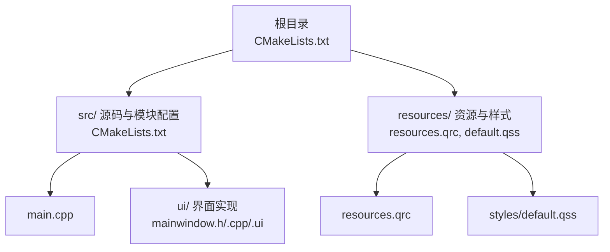
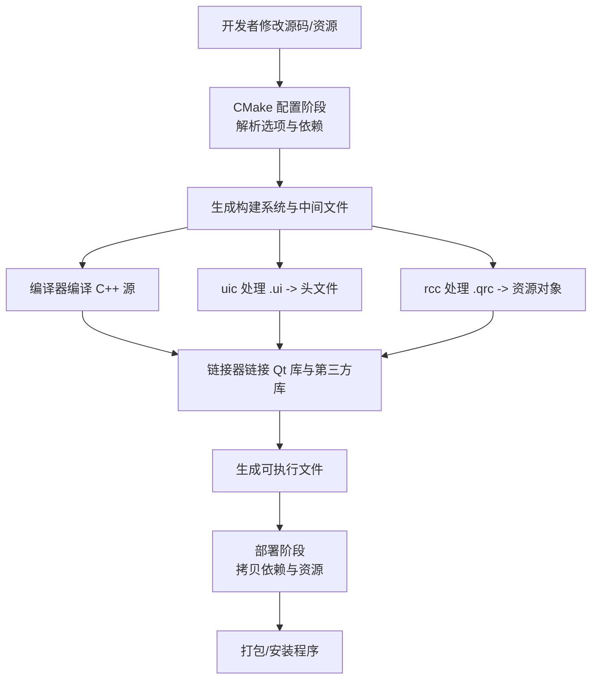
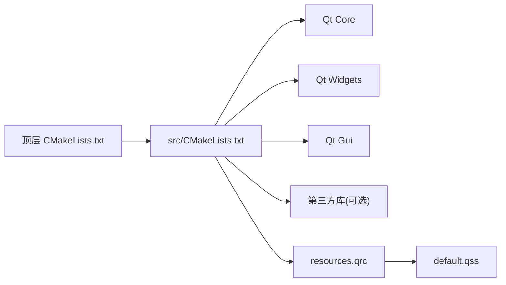

# 构建和部署

<cite>
**本文引用的文件**   
- [CMakeLists.txt](file://CMakeLists.txt)
- [src/CMakeLists.txt](file://src/CMakeLists.txt)
- [README.en.md](file://README.en.md)
- [resources/resources.qrc](file://resources/resources.qrc)
- [resources/styles/default.qss](file://resources/styles/default.qss)
- [src/main.cpp](file://src/main.cpp)
- [src/ui/mainwindow.h](file://src/ui/mainwindow.h)
- [src/ui/mainwindow.cpp](file://src/ui/mainwindow.cpp)
- [src/ui/mainwindow.ui](file://src/ui/mainwindow.ui)
</cite>

## 目录
1. [简介](#简介)
2. [项目结构](#项目结构)
3. [核心组件](#核心组件)
4. [架构总览](#架构总览)
5. [详细组件分析](#详细组件分析)
6. [依赖分析](#依赖分析)
7. [性能考虑](#性能考虑)
8. [故障排除指南](#故障排除指南)
9. [结论](#结论)
10. [附录](#附录)

## 简介
本指南面向使用 CMake 与 Qt（基于资源文件 .qrc、样式表 .qss 以及 UI 文件 .ui）的桌面应用，提供从环境准备到发布打包的完整构建与部署流程。内容涵盖：
- CMake 配置选项与依赖管理
- 平台特定设置（Windows/macOS/Linux）
- 可执行文件生成过程与资源集成
- 依赖库打包与安装程序制作
- 交叉编译与多目标构建
- 构建优化技巧与常见问题排查

## 项目结构
本项目采用分层组织：顶层 CMakeLists.txt 负责整体工程配置，src 子目录包含源代码与模块级 CMakeLists.txt，resources 目录集中管理 Qt 资源与样式。UI 层通过 .ui 文件定义界面，Qt 工具链会在构建时自动生成相关代码。



图表来源
- [CMakeLists.txt](file://CMakeLists.txt)
- [src/CMakeLists.txt](file://src/CMakeLists.txt)
- [resources/resources.qrc](file://resources/resources.qrc)
- [resources/styles/default.qss](file://resources/styles/default.qss)
- [src/main.cpp](file://src/main.cpp)
- [src/ui/mainwindow.h](file://src/ui/mainwindow.h)
- [src/ui/mainwindow.cpp](file://src/ui/mainwindow.cpp)
- [src/ui/mainwindow.ui](file://src/ui/mainwindow.ui)

章节来源
- [CMakeLists.txt](file://CMakeLists.txt)
- [src/CMakeLists.txt](file://src/CMakeLists.txt)
- [README.en.md](file://README.en.md)

## 核心组件
- 顶层 CMake 工程：定义项目名称、版本、全局编译选项、子目录包含与安装规则。
- 模块 CMake：声明可执行目标、链接 Qt 库、启用 Qt 特性（如自动 MOC/UIC/RCC）、添加资源文件。
- Qt 资源系统：通过 resources.qrc 将样式与图标等资源编译进二进制，确保跨平台一致性。
- UI 与样式：.ui 文件由 uic 生成头文件；.qss 作为样式表在运行时加载或嵌入。

章节来源
- [CMakeLists.txt](file://CMakeLists.txt)
- [src/CMakeLists.txt](file://src/CMakeLists.txt)
- [resources/resources.qrc](file://resources/resources.qrc)
- [resources/styles/default.qss](file://resources/styles/default.qss)
- [src/ui/mainwindow.ui](file://src/ui/mainwindow.ui)

## 架构总览
下图展示从 CMake 配置到 Qt 工具链再到最终可执行文件的构建流程，以及资源与样式的集成路径。



图表来源
- [CMakeLists.txt](file://CMakeLists.txt)
- [src/CMakeLists.txt](file://src/CMakeLists.txt)
- [resources/resources.qrc](file://resources/resources.qrc)

## 详细组件分析

### CMake 配置与构建选项
- 必要组件
  - 指定 Qt 组件（如 Core、Widgets、Gui），并启用 Qt 自动处理（MOC/UIC/RCC）。
  - 设置 C++ 标准与编译特性，保证跨平台一致行为。
- 常用选项
  - 构建类型：Debug/Release/RelWithDebInfo
  - 安装前缀：用于 make install 的目标路径
  - 静态/动态链接：控制 Qt 与第三方库的链接方式
  - 平台开关：针对 Windows/macOS/Linux 的差异进行条件编译
- 建议实践
  - 使用 find_package(QtX REQUIRED COMPONENTS ...) 显式声明依赖
  - 使用 target_* API 为可执行目标设置属性（如 include_directories、link_libraries、set_target_properties）
  - 通过 add_subdirectory(src) 引入模块构建

章节来源
- [CMakeLists.txt](file://CMakeLists.txt)
- [src/CMakeLists.txt](file://src/CMakeLists.txt)

### 可执行文件生成过程
- 入口点：main.cpp 初始化 Qt 应用并创建主窗口。
- UI 生成：.ui 经 uic 生成头文件，供 mainwindow.cpp 使用。
- 资源集成：resources.qrc 经 rcc 生成资源对象，确保样式与图标随二进制分发。
- 链接阶段：链接 Qt 库与任何第三方库，生成最终可执行文件。

```mermaid
sequenceDiagram
participant Dev as "开发者"
participant CMake as "CMake"
participant UIC as "uic"
participant RCC as "rcc"
participant CC as "编译器"
participant Link as "链接器"
participant Bin as "可执行文件"
Dev->>CMake : 配置工程(设置选项/依赖)
CMake-->>UIC : 生成 UI 头文件
CMake-->>RCC : 生成资源对象
Dev->>CC : 编译 main.cpp 与 UI 实现
CC-->>Link : 输出目标文件
RCC-->>Link : 注入资源
Link-->>Bin : 生成可执行文件
```

图表来源
- [src/main.cpp](file://src/main.cpp)
- [src/ui/mainwindow.ui](file://src/ui/mainwindow.ui)
- [resources/resources.qrc](file://resources/resources.qrc)

章节来源
- [src/main.cpp](file://src/main.cpp)
- [src/ui/mainwindow.h](file://src/ui/mainwindow.h)
- [src/ui/mainwindow.cpp](file://src/ui/mainwindow.cpp)
- [src/ui/mainwindow.ui](file://src/ui/mainwindow.ui)
- [resources/resources.qrc](file://resources/resources.qrc)

### 依赖管理与 Qt 集成
- Qt 发现与验证：通过 find_package 定位 Qt 安装，检查所需组件是否满足。
- 自动特性：启用 Qt 的自动 MOC/UIC/RCC，减少手工脚本。
- 平台差异：针对不同平台设置库名、插件路径、运行时依赖查找策略。
- 第三方库：建议使用包管理器（vcpkg/conan）或系统包管理器统一依赖。

章节来源
- [CMakeLists.txt](file://CMakeLists.txt)
- [src/CMakeLists.txt](file://src/CMakeLists.txt)

### 资源与样式集成
- resources.qrc：集中管理样式表、图标等，便于版本化与跨平台访问。
- default.qss：作为主题样式，可在运行时加载或通过 rcc 嵌入。
- 最佳实践：避免绝对路径，使用 :/ 前缀引用资源；保持资源命名规范。

章节来源
- [resources/resources.qrc](file://resources/resources.qrc)
- [resources/styles/default.qss](file://resources/styles/default.qss)

### 平台特定设置与交叉编译
- Windows
  - 使用 MSVC/MinGW 工具链；注意 DLL 依赖与运行时环境（如 vcruntime）。
  - 可选：使用 windeployqt 自动收集 Qt 依赖。
- macOS
  - 使用 Xcode 工具链；注意 Framework 与 dylib 签名与代码签名。
  - 可选：macdeployqt 打包依赖与插件。
- Linux
  - 使用 GCC/Clang；注意 RPATH 与系统库版本兼容性。
  - 可选：linuxdeploy 与 AppImage 打包。
- 交叉编译
  - 通过 CMAKE_TOOLCHAIN_FILE 指定工具链文件。
  - 明确目标三元组（arch-os-abi），设置 Qt 交叉安装路径。

章节来源
- [CMakeLists.txt](file://CMakeLists.txt)
- [src/CMakeLists.txt](file://src/CMakeLists.txt)

### 发布流程与安装程序制作
- 清理与增量构建：先 clean 再 build，确保无残留中间文件影响结果。
- 依赖收集：使用平台工具（windeployqt/macdeployqt/linuxdeploy）收集 Qt 与第三方库。
- 打包格式：
  - Windows：NSIS/Inno Setup 生成安装包
  - macOS：DMG/PKG 或 Notarization
  - Linux：AppImage/Snap/Flatpak
- 安装规则：通过 CMake 的 install() 命令定义安装目录结构与权限。

章节来源
- [CMakeLists.txt](file://CMakeLists.txt)
- [src/CMakeLists.txt](file://src/CMakeLists.txt)

## 依赖分析
下图展示 CMake 配置对 Qt 及第三方库的依赖关系，以及各模块之间的耦合。



图表来源
- [CMakeLists.txt](file://CMakeLists.txt)
- [src/CMakeLists.txt](file://src/CMakeLists.txt)
- [resources/resources.qrc](file://resources/resources.qrc)
- [resources/styles/default.qss](file://resources/styles/default.qss)

章节来源
- [CMakeLists.txt](file://CMakeLists.txt)
- [src/CMakeLists.txt](file://src/CMakeLists.txt)

## 性能考虑
- 构建优化
  - 使用 Ninja 生成器提升并行构建速度
  - 开启增量编译与缓存（ccache/sccache）
  - 合理划分模块，减少不必要的重新编译
- 运行期优化
  - Release 模式启用 LTO/O3（视平台支持）
  - 按需加载资源，避免一次性加载大型资源
  - 合理使用 Qt 插件机制，延迟加载重型功能

[本节为通用指导，不直接分析具体文件]

## 故障排除指南
- CMake 找不到 Qt
  - 检查 Qt 安装路径与 CMAKE_PREFIX_PATH
  - 确认 find_package 的版本与组件匹配
- 链接错误（未定义符号/缺失库）
  - 核对 target_link_libraries 与 Qt 组件
  - 检查平台特定的库后缀与导入库
- 运行时崩溃或样式不生效
  - 确认资源路径正确（:/ 前缀）
  - 检查 .qss 编码与语法
- 部署后缺少依赖
  - 使用对应平台的部署工具收集依赖
  - 校验 RPATH/DLL 搜索路径

章节来源
- [CMakeLists.txt](file://CMakeLists.txt)
- [src/CMakeLists.txt](file://src/CMakeLists.txt)
- [resources/resources.qrc](file://resources/resources.qrc)
- [resources/styles/default.qss](file://resources/styles/default.qss)

## 结论
通过规范的 CMake 配置与 Qt 资源管理，可实现跨平台一致的构建与部署体验。结合平台专用部署工具与合理的依赖管理策略，能够稳定地生成可分发的安装包。建议在 CI 中固化构建与打包流程，确保每次发布的一致性。

[本节为总结性内容，不直接分析具体文件]

## 附录
- 快速构建步骤（示例）
  - 配置：cmake -B build -DCMAKE_BUILD_TYPE=Release
  - 构建：cmake --build build --config Release
  - 安装：cmake --install build --prefix /your/install/path
- 常用 CMake 选项
  - CMAKE_BUILD_TYPE
  - CMAKE_INSTALL_PREFIX
  - CMAKE_TOOLCHAIN_FILE
  - Qt 相关变量（CMAKE_PREFIX_PATH、Qt6_DIR 等）

章节来源
- [CMakeLists.txt](file://CMakeLists.txt)
- [src/CMakeLists.txt](file://src/CMakeLists.txt)
- [README.en.md](file://README.en.md)