# 构建和部署

<cite>
**本文引用的文件**
- [CMakeLists.txt](file://CMakeLists.txt)
- [src/CMakeLists.txt](file://src/CMakeLists.txt)
- [scripts/build.py](file://scripts/build.py)
- [scripts/build.ps1](file://scripts/build.ps1)
- [pre_build_health_check.py](file://pre_build_health_check.py)
- [auto_build_with_prepcheck.py](file://auto_build_with_prepcheck.py)
- [complete_build_workflow.py](file://complete_build_workflow.py)
- [drivers/CMakeLists.txt](file://drivers/CMakeLists.txt)
- [drivers/zlg/CMakeLists.txt](file://drivers/zlg/CMakeLists.txt)
- [drivers/candle/CMakeLists.txt](file://drivers/candle/CMakeLists.txt)
- [drivers/peak/CMakeLists.txt](file://drivers/peak/CMakeLists.txt)
- [drivers/kvaser/CMakeLists.txt](file://drivers/kvaser/CMakeLists.txt)
- [drivers/slcan/CMakeLists.txt](file://drivers/slcan/CMakeLists.txt)
- [src/core/driver/candriverplugin.h](file://src/core/driver/candriverplugin.h)
- [src/core/driver/driverregistry.cpp](file://src/core/driver/driverregistry.cpp)
- [src/core/driver/marketindex.cpp](file://src/core/driver/marketindex.cpp)
- [EngineAnalysis.openbusproj](file://EngineAnalysis.openbusproj)
- [third_party/Dependencies.cmake](file://third_party/Dependencies.cmake)
- [src/core/protocol/iprotocoladapter.h](file://src/core/protocol/iprotocoladapter.h)
- [src/core/protocol/protocolregistry.h](file://src/core/protocol/protocolregistry.h)
- [src/core/module/imodule.h](file://src/core/module/imodule.h)
- [src/core/module/moduleregistry.h](file://src/core/module/moduleregistry.h)
- [scripts/package.py](file://scripts/package.py)
- [doc/打包安装方案.md](file://doc/打包安装方案.md)
- [doc/BUILD-PYTHON-SCRIPT-CHANGELOG.md](file://doc/BUILD-PYTHON-SCRIPT-CHANGELOG.md)
- [doc/BUILD-PYTHON-SCRIPT-OPTIMIZATION.md](file://doc/BUILD-PYTHON-SCRIPT-OPTIMIZATION.md)
- [batch_clean_chinese.py](file://batch_clean_chinese.py)
- [scan_chinese_chars.py](file://scan_chinese_chars.py)
- [scripts/debug_frameless.ps1](file://scripts/debug_frameless.ps1)
- [scripts/gdb_debug.ps1](file://scripts/gdb_debug.ps1)
- [README.md](file://README.md)
- [doc/工程结构约束机制.md](file://doc/工程结构约束机制.md)
</cite>

## 更新摘要
**所做更改**
- **新增MSVC编译器兼容性优化**：在CMakeLists.txt中添加了对MSVC编译器的特殊处理，启用/FS标志支持并行构建
- **增强预构建健康检查系统**：完善了pre_build_health_check.py的功能，提供更全面的代码质量检查
- **完善自动化构建工作流**：更新了auto_build_with_prepcheck.py和complete_build_workflow.py，提供更健壮的构建流程
- **改进PowerShell构建脚本**：增强了build.ps1的Windows构建体验，支持更丰富的命令选项
- **优化构建日志系统**：改进了构建过程中的日志记录和错误报告机制

## 目录
- 项目概述
- CMake配置选项
- 依赖管理
- 平台特定设置
- 可执行文件生成过程
- **v2.0 构建系统升级**
- **MSVC编译器兼容性优化**
- **PowerShell构建脚本**
- **预构建健康检查系统**
- **自动化构建工作流**
- **智能工具链检测**
- **并行编译支持**
- **增强日志系统**
- **项目结构验证系统**
- **变更检测与协作流程**
- **构建性能度量工具**
- **插件生态系统增强**
- Ninja构建系统
- 驱动插件构建系统
- 统一市场格式
- 驱动包打包和部署
- 插件包打包和部署
- 市场索引管理
- libusb依赖管理
- 依赖库打包
- 安装程序制作
- 不同平台的构建配置
- 交叉编译设置
- 发布流程
- 构建优化技巧
- 故障排除方法

## 项目概述

本项目是一个基于Qt6的CAN总线分析工具，使用CMake作为构建系统。项目结构清晰，包含核心功能模块、UI界面、模型层和工具类。最新版本实现了完整的模块化架构重构，将单体应用拆分为多个独立的业务DLL模块，支持协议子系统集成和Flow-based测量流程。

**重大更新** 项目已完成模块化架构重构，新增了openbus_data公共底座DLL、openbus_market插件市场模块、openbus_transceive收发模块、openbus_dbc DBC处理模块、openbus_flow测量流程模块、openbus_trace跟踪模块和openbus_graphic图形模块。同时引入了协议适配层接口，支持多协议扩展。现在支持统一的插件市场格式，可同时管理硬件驱动和软件插件。同时引入了先进的libusb依赖管理系统，确保USB CAN设备的稳定运行。

**最新变更** 项目现已采用基于市场的分发模型，插件和驱动不再预装，而是通过集成插件市场按需安装。staging目录结构已更新为排除plugins/和drivers/目录，market/目录包含本地市场索引文件和驱动/插件包用于离线安装。Python运行时已从可嵌入版本过渡到本地安装的Python运行时，通过python314._pth文件实现隔离，提供零网络依赖的完整标准库支持。**构建系统已升级至 v2.0**，引入智能工具链检测、并行编译支持和增强日志功能，显著提升构建效率和用户体验。**新增PowerShell构建脚本**，为Windows开发者提供简化的构建体验。**新增MSVC编译器兼容性优化**，提供更好的跨平台构建支持。**新增项目结构验证系统和变更检测机制**，建立了完善的工程结构约束和团队协作流程。**构建了完整的插件生态系统**，支持32款专业插件的自动生成和部署。

### 项目架构

```mermaid
graph TD
A[主程序 main.cpp] --> B[openbus_ui 壳静态库]
B --> C[openbus_data 公共底座DLL]
B --> D[openbus_market 市场模块DLL]
B --> E[openbus_transceive 收发模块DLL]
B --> F[openbus_dbc DBC模块DLL]
B --> G[openbus_flow 流程模块DLL]
B --> H[openbus_trace 跟踪模块DLL]
B --> I[openbus_graphic 图形模块DLL]
C --> C1[core核心功能]
C --> C2[models数据模型]
C --> C3[utils工具类]
C --> C4[thememanager主题管理]
D --> D1[markettab市场页面]
D --> D2[marketmodule模块适配器]
E --> E1[signalsendtab信号发送]
E --> E2[playbacktab回放页面]
E --> E3[offlineanalysistab离线分析]
E --> E4[recordtab录制页面]
F --> F1[dbcdetailtab DBC详情]
F --> F2[dbcsignallistview信号列表]
G --> G1[measurementsetupview测量配置]
G --> G2[deviceconnectiontab设备连接]
H --> H1[traceview跟踪视图]
H --> H2[filterbar过滤栏]
H --> H3[colorruleeditor着色规则]
I --> I1[graphicview图形视图]
I --> I2[datawindow数据窗口]
I --> I3[signalconfigdialog信号配置]
J[协议子系统] --> J1[IProtocolAdapter接口]
J --> J2[ProtocolRegistry注册表]
J --> J3[CAN协议适配器]
K[驱动插件 drivers/] --> K1[ZLG 驱动]
K --> K2[PEAK 驱动]
K --> K3[Kvaser 驱动]
K --> K4[Candle/GS_USB 驱动]
K --> K5[SLCAN 驱动]
L[Python插件 plugins/] --> L1[BLF转换器]
L --> L2[总线统计]
L --> L3[CANopen浏览器]
L --> L4[DBC工具]
L --> L5[UDS诊断]
M[构建脚本 scripts/] --> M1[build.py v2.0]
M --> M2[build.ps1 PowerShell]
M --> M3[Ninja构建系统]
M --> M4[driver_tool.py驱动工具]
M --> M5[plugin_tool.py插件工具]
M --> M6[make_market.py市场生成]
M --> M7[download_libusb.py依赖下载]
M --> M8[package.py打包流水线]
M --> M9[pre_build_health_check.py健康检查]
M --> M10[auto_build_with_prepcheck.py自动构建]
N[测试资源] --> N1[EngineAnalysis.openbusproj示例项目]
N --> N2[示例DBC文件]
N --> N3[示例BLF文件]
O[市场分发] --> O1[market/本地市场索引]
O --> O2[.odp驱动包]
O --> O3[.opk插件包]
P[Python运行时] --> P1[runtime/python/]
P --> P2[python314._pth隔离]
P --> P3[PyQt6裁剪子集]
Q[构建日志] --> Q1[.tmp/logs/时间戳日志]
Q --> Q2[智能日志管理]
R[健康检查] --> R1[pre_build_health_check.py]
R --> R2[batch_clean_chinese.py]
R --> R3[scan_chinese_chars.py]
R --> R4[auto_build_with_prepcheck.py]
R --> R5[complete_build_workflow.py]
```


**图表来源**
- [scripts/build.py:1-815](file://scripts/build.py#L1-L815)
- [scripts/build.ps1:1-201](file://scripts/build.ps1#L1-L201)
- [pre_build_health_check.py:1-409](file://pre_build_health_check.py#L1-L409)
- [auto_build_with_prepcheck.py:1-112](file://auto_build_with_prepcheck.py#L1-L112)
- [complete_build_workflow.py:1-193](file://complete_build_workflow.py#L1-L193)

## CMake配置选项

### 根级CMake配置
项目的根级CMakeLists.txt定义了整体构建配置和子模块组织。

**主要配置选项：**
- `PROJECT_NAME`: 项目名称设置为"openbus"（已从'sin'更新）
- `VERSION`: 版本号设置为0.1.0
- `DESCRIPTION`: 项目描述为"报文解析、分析、回放、录制、trace、graphic 桌面软件"
- `CMAKE_CXX_STANDARD`: 设置C++标准为C++17
- `QT_VERSION`: 自动检测Qt6版本
- `BUILD_TYPE`: 支持Debug、Release、RelWithDebInfo、MinSizeRel模式

**新增特性：**
- Dev构建档支持：-O1 -g1优化级别，独立build-dev/目录
- Thin archive技术：静态库重打包降为毫秒级
- 默认ld.bfd链接器：避免文件锁问题
- **MSVC编译器兼容性优化**：添加/FS标志支持并行构建
- **Ninja构建系统支持**：优先使用Ninja进行构建，提供2-3倍编译速度提升

### 源码级CMake配置
src/CMakeLists.txt详细定义了各个模块的构建规则，实现了完整的模块化架构：

**新增的模块化构建组件：**
- **openbus_data** 公共底座DLL：包含core、models、utils和thememanager
- **openbus_market** 市场模块DLL：市场页面和模块适配器
- **openbus_transceive** 收发模块DLL：信号发送、回放、离线分析、录制四页面
- **openbus_dbc** DBC模块DLL：DBC详情页和信号清单工具
- **openbus_flow** 流程模块DLL：测量配置和设备连接页面
- **openbus_trace** 跟踪模块DLL：Trace视图和相关组件
- **openbus_graphic** 图形模块DLL：Graphic视图和数据窗口
- **openbus_ui** 壳静态库：剩余界面组件

**Section sources**
- [CMakeLists.txt:3-7](file://CMakeLists.txt#L3-L7)
- [CMakeLists.txt:32-58](file://CMakeLists.txt#L32-L58)
- [src/CMakeLists.txt:198-771](file://src/CMakeLists.txt#L198-L771)

## 依赖管理

### Qt框架依赖
项目依赖以下Qt6模块：
- **QtCore**: 核心功能
- **QtGui**: 图形界面基础
- **QtWidgets**: 桌面UI组件
- **QtPrintSupport**: 打印支持（qcustomplot静态库需要）
- **QtSvg**: SVG图标渲染（activitybar/sidebarpanels使用）
- **QtNetwork**: 网络请求（市场索引下载）

### 第三方库依赖
- **spdlog**: 日志记录库（INTERFACE IMPORTED）
- **nlohmann/json**: JSON解析库（单头文件）
- **concurrentqueue**: 并发队列库
- **qcustomplot**: 自定义绘图库（静态链接）
- **vector_blf**: Vector BLF文件格式支持（可选）
- **zlib**: BLF文件压缩支持
- **pugixml**: ARXML文件解析支持（可选）

### 模块化依赖关系
新的模块化架构建立了清晰的依赖层次：
- **openbus_data**: 基础依赖（Qt Widgets/Svg/Network, zlib）
- **业务DLL**: 依赖openbus_data + 各自特定的Qt模块
- **主程序**: 链接所有业务DLL和openbus_ui静态库

### libusb依赖管理
**新增** 项目现在集成了智能的libusb依赖管理系统：

**libusb自动管理特性：**
- 从PyPI官方wheel包自动下载libusb-1.0.dll
- PE头验证确保下载的是正确的64位DLL
- 自动放置到driver/目录供CMake POST_BUILD处理
- 支持多个PyPI源（libusb1, libusb-package）
- 提供手动替代方案说明

### Python运行时依赖管理
**新增** 项目现在捆绑本地安装的Python运行时，通过python314._pth文件实现隔离：

**Python运行时特性：**
- 本机安装版精简拷贝，剔除tkinter等GUI组件
- python314._pth隔离机制，忽略注册表和环境影响
- PyQt6裁剪子集（仅uds-diagnostic插件需要）
- 零网络依赖，完整的标准库支持
- 自动导入site-packages，支持插件市场安装

**Section sources**
- [CMakeLists.txt:65-73](file://CMakeLists.txt#L65-L73)
- [third_party/Dependencies.cmake:5-31](file://third_party/Dependencies.cmake#L5-L31)
- [src/CMakeLists.txt:214-251](file://src/CMakeLists.txt#L214-L251)
- [scripts/download_libusb.py:1-108](file://scripts/download_libusb.py#L1-L108)
- [scripts/package.py:371-492](file://scripts/package.py#L371-L492)
- [doc/打包安装方案.md:178-188](file://doc/打包安装方案.md#L178-L188)

## 平台特定设置

### Windows平台
```cmake
if(WIN32 AND CMAKE_CXX_COMPILER_ID STREQUAL "GNU")
    message(STATUS "使用默认 ld.bfd 链接器")
endif()

set(CMAKE_RUNTIME_OUTPUT_DIRECTORY ${CMAKE_BINARY_DIR}/bin)
```

**新增特性：**
- Dev构建档：`CMAKE_CXX_FLAGS_DEV "-O1 -g1"`
- Thin archive：`CMAKE_CXX_ARCHIVE_CREATE "<CMAKE_AR> qcT <TARGET> <LINK_FLAGS> <OBJECTS>"`
- 文件锁问题解决：避免使用LLD链接器
- **MSVC编译器优化**：添加/FS标志支持并行构建
- **Ninja构建系统**：优先使用tools/ninja/ninja.exe进行构建

### Linux平台
```cmake
find_package(Qt6 REQUIRED COMPONENTS Widgets PrintSupport Svg Network)
qt_standard_project_setup()
```

### macOS平台
```cmake
set(CMAKE_OSX_ARCHITECTURES "x86_64;arm64")
set(CMAKE_MACOSX_BUNDLE ON)
```

**Section sources**
- [CMakeLists.txt:32-60](file://CMakeLists.txt#L32-L60)

## 可执行文件生成过程

### 构建流程
1. **配置阶段**: CMake检测依赖并生成构建文件（优先Ninja生成器）
2. **编译阶段**: 编译所有源文件为对象文件（支持并行编译）
3. **链接阶段**: 链接所有对象文件和库文件（按模块顺序）
4. **资源处理**: 处理Qt资源和样式文件
5. **依赖复制**: 自动复制driver/目录内容到输出目录

### 模块化输出结构
```
build/
├── bin/
│   ├── openbus.exe      # 主可执行文件
│   ├── driver/          # 驱动依赖目录（包含libusb-1.0.dll）
│   │   └── libusb-1.0.dll  # USB设备通信库
│   ├── drivers/          # 驱动插件目录
│   │   ├── zlg/         # ZLG 驱动插件
│   │   ├── peak/        # PEAK 驱动插件
│   │   ├── kvaser/      # Kvaser 驱动插件
│   │   ├── candle/      # Candle/GS_USB 驱动插件
│   │   └── slcan/       # SLCAN 驱动插件
│   ├── openbus_data.dll     # 公共底座DLL
│   ├── openbus_market.dll   # 市场模块DLL
│   ├── openbus_transceive.dll # 收发模块DLL
│   ├── openbus_dbc.dll      # DBC模块DLL
│   ├── openbus_flow.dll     # 流程模块DLL
│   ├── openbus_trace.dll    # 跟踪模块DLL
│   └── openbus_graphic.dll  # 图形模块DLL
├── market/              # 市场索引和包文件
└── resources/
    └── *.qrc            # Qt资源文件
```

### 应用程序元数据
应用程序在启动时设置以下元数据：
- 应用名称: "openbus"
- 组织名称: "openbus"
- 应用版本: "0.1.0"

**Section sources**
- [src/CMakeLists.txt:745-771](file://src/CMakeLists.txt#L745-L771)
- [src/main.cpp:16-19](file://src/main.cpp#L16-L19)

## v2.0 构建系统升级

### 构建脚本 v2.0 核心特性

**智能工具链检测**：
- 自动检测 Qt、MinGW、CMake 安装位置
- 支持环境变量覆盖（SIN_QT_DIR、SIN_MINGW_DIR、SIN_CMAKE_DIR）
- 常见安装路径优先级排序
- 回退机制确保构建可用性

**并行编译支持**：
- 自动检测CPU核心数并启用并行编译
- 支持 `-j<N>` 参数指定并行任务数
- Ninja 和 MinGW Makefiles 均支持并行构建
- 显著缩短构建时间

**增强日志系统**：
- 所有构建输出自动保存到 `.tmp/logs/` 目录
- 按时间戳命名日志文件（YYYYMMDD_HHMMSS.log）
- 实时输出摘要显示（前10行和后20行）
- 完整日志文件便于问题排查

### 常用命令速查
```bash
# 完整构建流程（推荐）
python scripts/build.py all

# 增量编译（自动配置）
python scripts/build.py build -j8

# Dev 快速开发档
python scripts/build.py configure --build-type Dev --build-dir build-dev
python scripts/build.py build --build-dir build-dev -j8

# 查看环境状态
python scripts/build.py status

# 清理构建
python scripts/build.py clean
```

**Section sources**
- [scripts/build.py:1-41](file://scripts/build.py#L1-L41)
- [doc/BUILD-PYTHON-SCRIPT-CHANGELOG.md:58-74](file://doc/BUILD-PYTHON-SCRIPT-CHANGELOG.md#L58-L74)
- [doc/BUILD-PYTHON-SCRIPT-OPTIMIZATION.md:46-86](file://doc/BUILD-PYTHON-SCRIPT-OPTIMIZATION.md#L46-L86)

## MSVC编译器兼容性优化

### MSVC特殊处理
**新增** 项目现在提供了针对MSVC编译器的专门优化：

**核心优化特性：**
- **/FS标志启用**：支持多线程安全的全局符号访问
- **并行构建支持**：解决MSVC下的文件锁定问题
- **兼容性增强**：确保MSVC编译器与项目的完全兼容

### 编译器检测逻辑
```cmake
elseif(WIN32 AND CMAKE_CXX_COMPILER_ID STREQUAL "MSVC")
    message(STATUS "Using MSVC compiler /FS flag for parallel builds")
    add_compile_options(/FS)
endif()
```

### 构建优势
- **更好的并行编译**：MSVC编译器下的高效并行构建
- **减少构建冲突**：避免多线程编译时的文件锁定问题
- **跨平台一致性**：确保不同编译器下的构建行为一致

**Section sources**
- [CMakeLists.txt:55-58](file://CMakeLists.txt#L55-L58)

## PowerShell构建脚本

### 简化的Windows构建体验
**新增** 项目现在提供了专门的PowerShell构建脚本`scripts/build.ps1`，为Windows开发者提供简化的构建体验：

**核心特性：**
- **简化命令**：支持configure、build、run、debug、clean、rebuild、deploy、all等常用命令
- **智能工具链检测**：自动检测Qt、MinGW、CMake安装位置
- **颜色化输出**：提供友好的彩色控制台输出
- **进程管理**：自动终止正在运行的openbus.exe进程
- **并行编译**：自动检测CPU核心数进行并行构建

### 常用命令
```powershell
# 完整构建流程
.\scripts\build.ps1 all

# 配置CMake
.\scripts\build.ps1 configure

# 增量构建
.\scripts\build.ps1 build -j12

# 运行应用程序
.\scripts\build.ps1 run

# 部署Qt依赖
.\scripts\build.ps1 deploy

# 清理构建目录
.\scripts\build.ps1 clean

# 完全重建
.\scripts\build.ps1 rebuild
```

### 环境变量配置
```powershell
# 设置Qt路径
$env:SIN_QT_DIR = "D:\Qt\6.8.3\mingw_64"

# 设置MinGW路径
$env:SIN_MINGW_DIR = "D:\Qt\Tools\mingw1310_64"

# 设置CMake路径
$env:SIN_CMAKE_DIR = "C:\Program Files\CMake"
```

### 构建流程控制
```powershell
# 查看帮助信息
.\scripts\build.ps1

# 指定构建类型
.\scripts\build.ps1 configure --build-type Release

# 指定并行任务数
.\scripts\build.ps1 build -j16

# 自定义构建目录
.\scripts\build.ps1 configure --build-dir build-custom
```

**Section sources**
- [scripts/build.ps1:1-201](file://scripts/build.ps1#L1-L201)

## 预构建健康检查系统

### 代码质量检查工具
**新增** 项目现在集成了全面的预构建健康检查系统，在编译前自动检测代码质量问题：

**核心检查功能：**
- **中文注释检测**：扫描C++、Python、CMake文件中的中文注释
- **缺失头文件检测**：识别未包含必要Qt头文件的使用
- **前置声明检查**：检测不必要的前置声明
- **包含顺序验证**：确保头文件包含顺序符合规范
- **头文件自包含性**：验证头文件的独立性

### 健康检查工作流程
```bash
# 运行预构建健康检查
python pre_build_health_check.py

# 查看检查结果报告
cat .tmp/pre_build_check.txt

# 自动构建（包含预检查）
python auto_build_with_prepcheck.py
```

### 检查规则详解
**中文注释检查**：
- 目标文件：*.cpp, *.h, *.hpp, *.py, CMakeLists.txt, *.cmake
- 排除目录：third_party/
- 严重级别：错误（阻止构建）

**Qt头文件检查**：
- 检测50+个常用Qt类的头文件包含
- 支持QWidget、QPushButton、QTableWidget等UI组件
- 区分完全使用和前置声明场景

**Section sources**
- [pre_build_health_check.py:17-66](file://pre_build_health_check.py#L17-L66)
- [pre_build_health_check.py:67-111](file://pre_build_health_check.py#L67-L111)
- [pre_build_health_check.py:112-206](file://pre_build_health_check.py#L112-L206)
- [pre_build_health_check.py:353-397](file://pre_build_health_check.py#L353-L397)

## 自动化构建工作流

### 智能构建包装器
**auto_build_with_prepcheck.py** 提供带预检查的完整构建流程：

**工作流程：**
1. **预构建健康检查**：运行代码质量检查
2. **缺失头文件修复建议**：自动生成修复指导
3. **完整构建执行**：调用 complete_build_workflow.py
4. **结果验证**：确保构建产物完整性

### 专业级构建脚本
**complete_build_workflow.py** 提供企业级构建体验：

**核心功能：**
- **智能清理**：自动终止运行中的进程，释放文件锁
- **CMake配置**：自动检测和配置构建环境
- **并行编译**：支持多核并行构建
- **产物验证**：检查生成的可执行文件和DLL

### 构建流程控制
```bash
# 自动构建（带预检查）
python auto_build_with_prepcheck.py

# 直接运行完整工作流
python complete_build_workflow.py

# 查看构建状态
python scripts/build.py status
```

**Section sources**
- [auto_build_with_prepcheck.py:11-33](file://auto_build_with_prepcheck.py#L11-L33)
- [auto_build_with_prepcheck.py:36-77](file://auto_build_with_prepcheck.py#L36-L77)
- [complete_build_workflow.py:11-59](file://complete_build_workflow.py#L11-L59)
- [complete_build_workflow.py:61-91](file://complete_build_workflow.py#L61-L91)
- [complete_build_workflow.py:94-123](file://complete_build_workflow.py#L94-L123)
- [complete_build_workflow.py:126-148](file://complete_build_workflow.py#L126-L148)

## 智能工具链检测

### 自动检测机制
构建脚本 v2.0 实现了智能的工具链自动检测系统：

**检测优先级**：
1. **环境变量**：`SIN_QT_DIR`、`SIN_MINGW_DIR`、`SIN_CMAKE_DIR`
2. **常见安装路径**：D:\Qt\*、C:\Qt\*、C:\Program Files\CMake
3. **命令行参数**：`--qt-dir`、`--mingw-dir`、`--cmake-dir`
4. **默认回退值**：确保构建可用性

**支持的检测目标**：
- **Qt 安装目录**：检测 qmake.exe 存在性
- **MinGW 编译器**：检测 g++.exe 和 gcc.exe
- **CMake 工具**：支持通配符匹配最新版本
- **Ninja 构建系统**：检测 tools/ninja/ninja.exe

### 环境变量配置
```bash
# Windows PowerShell
$env:SIN_QT_DIR = "D:\Qt\6.8.3\mingw_64"
$env:SIN_MINGW_DIR = "D:\Qt\Tools\mingw1310_64"
$env:SIN_CMAKE_DIR = "C:\Program Files\CMake"

# Linux/Mac
export SIN_QT_DIR="/usr/local/Qt6.8.3"
export SIN_MINGW_DIR="/usr/bin/mingw"
export SIN_CMAKE_DIR="/usr/bin/cmake"
```

### 环境状态检查
```bash
# 查看当前检测到的工具链
python scripts/build.py status
```

预期输出：
```
=======================================================
  环境状态
=======================================================
  项目根目录:  D:\sin\sin_20260727\sin
  构建目录:    D:\sin\sin_20260727\sin\build  [已存在]
  可执行文件:  D:\sin\sin_20260727\sin\build\bin\openbus.exe  [未构建]

[ OK ] CMake        C:\Program Files\CMake\bin\cmake.exe
[ OK ] g++          D:\Qt\Tools\mingw1310_64\bin\g++.exe
[ OK ] gcc          D:\Qt\Tools\mingw1310_64\bin\gcc.exe
[ OK ] windeployqt  D:\Qt\6.8.3\mingw_64\bin\windeployqt.exe
[ OK ] gdb          D:\Qt\Tools\mingw1310_64\bin\gdb.exe
[WARN] 未检测到 Ninja，使用 MinGW Makefiles（较慢）

  构建类型:    Debug
```

**Section sources**
- [scripts/build.py:104-181](file://scripts/build.py#L104-L181)
- [scripts/build.py:229-303](file://scripts/build.py#L229-L303)
- [scripts/build.py:576-594](file://scripts/build.py#L576-L594)
- [doc/BUILD-PYTHON-SCRIPT-OPTIMIZATION.md:116-131](file://doc/BUILD-PYTHON-SCRIPT-OPTIMIZATION.md#L116-L131)

## 并行编译支持

### 自动并行检测
构建脚本 v2.0 支持智能的并行编译检测：

**并行策略**：
- 自动检测 CPU 核心数并使用相应线程数
- 支持 `-j<N>` 参数覆盖默认并行数
- Ninja 和 MinGW Makefiles 均支持并行构建
- 避免过度并行导致的内存不足问题

### 性能优化
```bash
# 使用默认并行数（自动检测）
python scripts/build.py build

# 指定并行任务数
python scripts/build.py build -j16

# Dev 档快速编译
python scripts/build.py build --build-dir build-dev -j8
```

### 构建系统选择
**Ninja 优先策略**：
- 优先检测 `tools/ninja/ninja.exe`
- 如果Ninja可用，使用 Ninja 构建系统
- 否则回退到 MinGW Makefiles
- Ninja 提供 2-3 倍编译速度提升

**Section sources**
- [scripts/build.py:258-260](file://scripts/build.py#L258-L260)
- [scripts/build.py:392-399](file://scripts/build.py#L392-399)
- [scripts/build.py:458-463](file://scripts/build.py#L458-L463)

## 增强日志系统

### 日志管理机制
构建脚本 v2.0 实现了完善的日志管理系统：

**日志存储**：
- 所有构建输出保存到 `.tmp/logs/` 目录
- 按时间戳命名：`YYYYMMDD_HHMMSS.log`
- 自动创建目录结构
- Git 忽略规则保护隐私

**智能输出控制**：
- 实时输出摘要显示（前10行和后20行）
- 完整日志文件保存便于问题排查
- 错误信息高亮显示
- 构建进度百分比显示

### 日志文件管理
```bash
# 查看最近的构建日志
ls -la .tmp/logs/ | tail -5

# 搜索错误信息
grep -i "error" .tmp/logs/*.log

# 查看最后构建的详细日志
tail -f .tmp/logs/$(ls -t .tmp/logs/ | head -1)
```

### 日志清理策略
```bash
# 清理超过7天的日志
find .tmp/logs -name "*.log" -mtime +7 -delete

# 压缩归档旧日志
tar -czf logs_archive.tar.gz .tmp/logs/*.log

# 完全清理临时文件
rm -rf .tmp/*
```

**Section sources**
- [scripts/build.py:77-86](file://scripts/build.py#L77-L86)
- [scripts/build.py:306-363](file://scripts/build.py#L306-L363)
- [doc/BUILD-PYTHON-SCRIPT-CHANGELOG.md:19-39](file://doc/BUILD-PYTHON-SCRIPT-CHANGELOG.md#L19-L39)

## 项目结构验证系统

### 工程结构强制约束
**新增** 项目现在集成了全面的项目结构验证系统，通过verify_structure.py提供多层次的工程结构检查和约束机制：

**核心验证功能：**
- **Markdown文件定位检查**：确保所有.md文件都在doc/目录下（除README.md外）
- **中文文件名检测**：扫描整个项目树，识别包含中文字符的文件名
- **中文路径检测**：检测文件路径中包含的中文字符
- **CMakeLists.txt合规检查**：验证新添加的文件是否在正确的分类列表中

### 验证工作流程
```bash
# 运行结构验证检查
python scripts/verify_structure.py

# 以JSON格式输出报告
python scripts/verify_structure.py --json

# 查看详细的验证报告
python scripts/verify_structure.py 2>&1 | tee verification_report.txt
```

### 多层防护机制
项目建立了五层防护机制来确保工程结构规范：

| 机制 | 触发时机 | 阻断能力 | 说明 |
|------|---------|---------|------|
| Git Pre-commit Hook | git commit时 | 🔴 100%阻断 | 强制检查提交前的文件结构 |
| PowerShell验证脚本 | 手动运行 | 🟡 扫描检查 | 提供完整的仓库结构扫描 |
| README用户提醒 | 查看文档时 | 🟢 预防提醒 | 在README中明确规范要求 |
| Memory系统记忆 | 所有对话 | 🟡 辅助记忆 | AI Agent行为约束 |
| Qoder AI内置约束 | 工具调用时 | 🔴 实时拦截 | 防止AI生成违规文件 |

### 自动化检查流程
```bash
# 完整的结构验证流程
echo "开始工程结构验证..."
python scripts/verify_structure.py
if [ $? -eq 0 ]; then
    echo "✅ 结构验证通过"
else
    echo "❌ 发现结构问题，请按照提示修复"
    exit 1
fi
```

**Section sources**
- [scripts/verify_structure.py:21-44](file://scripts/verify_structure.py#L21-L44)
- [scripts/verify_structure.py:46-78](file://scripts/verify_structure.py#L46-L78)
- [scripts/verify_structure.py:80-114](file://scripts/verify_structure.py#L80-L114)
- [doc/工程结构约束机制.md:14-25](file://doc/工程结构约束机制.md#L14-L25)
- [doc/工程结构约束机制.md:168-178](file://doc/工程结构约束机制.md#L168-L178)

## 变更检测与协作流程

### 智能变更分析
**新增** 项目集成了change_detection.py，提供智能的变更影响分析和团队协作流程触发机制：

**核心分析功能：**
- **变更文件识别**：自动获取git diff中的修改文件列表
- **代码行数统计**：计算每个文件的增删行数和净变化量
- **受影响模块检测**：识别核心模块（src/models/, src/core/, include/openbus_data/）的改动
- **复杂度评分算法**：基于代码行数、文件数量、核心模块改动的综合评分

### 六角色协作流程
系统根据变更复杂度自动触发不同级别的角色协作流程：

| 变更级别 | 复杂度评分 | 涉及角色 | 截止时间 |
|----------|------------|----------|----------|
| minor_change | <40分 | coder, reviewer | 24小时 |
| medium_change | 40-69分 | coder, reviewer, compiler | 32小时 |
| major_change | ≥70分 | planner, coder, reviewer, compiler, tester, packager | 72小时 |

### 变更检测工作流程
```bash
# 运行变更检测
python scripts/change_detection.py

# 查看生成的角色通知
cat build/role_notification.json

# 查看受影响的模块
python scripts/change_detection.py | grep "受影响模块"
```

### 自动化通知机制
系统会自动生成角色通知文件，包含：
- 变更摘要和复杂度评分
- 需要参与的角色列表
- 合理的截止时间计算
- 各角色的检查清单

**Section sources**
- [scripts/change_detection.py:41-88](file://scripts/change_detection.py#L41-L88)
- [scripts/change_detection.py:91-136](file://scripts/change_detection.py#L91-L136)
- [scripts/change_detection.py:139-175](file://scripts/change_detection.py#L139-L175)
- [scripts/change_detection.py:199-270](file://scripts/change_detection.py#L199-L270)

## 构建性能度量工具

### 场景化性能分析
**新增** 项目提供了measure_build.py，支持多种构建场景的性能度量和分析：

**支持的构建场景：**
- **ui场景**：touch一个UI源文件后的增量构建耗时
- **core场景**：touch一个核心源文件后的增量构建耗时  
- **clean场景**：全量构建的总耗时
- **analyze场景**：仅分析现有.ninja_log文件的历史记录

### 关键性能指标
系统重点关注以下关键构建步骤的性能：
- openbus.exe（主程序链接）
- libopenbus_ui.a（壳UI静态库）
- libqcustomplot.a（绘图库）
- openbus_data.dll（公共底座DLL）
- openbus_market.dll（市场模块DLL）
- openbus_transceive.dll（收发模块DLL）

### 性能度量流程
```bash
# 运行所有场景的性能度量
python scripts/measure_build.py --scenario all

# 仅分析历史构建日志
python scripts/measure_build.py --scenario analyze

# 指定构建目录和并行数
python scripts/measure_build.py --build-dir build-dev -j16

# 查看生成的构建基线
cat doc/构建基线.md
```

### 基线记录机制
性能度量结果会自动追加到doc/构建基线.md文件中，包含：
- 时间戳和构建类型信息
- 各场景的墙钟时间和步骤跨度
- 关键步骤的详细耗时表格
- 历史对比数据，支持优化效果评估

**Section sources**
- [scripts/measure_build.py:7-16](file://scripts/measure_build.py#L7-L16)
- [scripts/measure_build.py:49-57](file://scripts/measure_build.py#L49-L57)
- [scripts/measure_build.py:134-147](file://scripts/measure_build.py#L134-L147)
- [scripts/measure_build.py:181-199](file://scripts/measure_build.py#L181-L199)
- [scripts/measure_build.py:202-266](file://scripts/measure_build.py#L202-L266)

## 插件生态系统增强

### 插件宿主系统
**新增** 项目完善了sin_host.py，提供完整的Python插件宿主环境和JSON-RPC通信机制：

**核心功能特性：**
- **JSON-RPC 2.0通信**：基于stdin/stdout的跨进程通信协议
- **插件生命周期管理**：动态加载、激活、停用和卸载插件
- **帧数据处理**：订阅制的数据推送机制，无订阅=零开销
- **命令注册和执行**：插件可扩展的命令系统
- **Qt事件循环集成**：支持PyQt6 UI功能的插件

### 插件资产生成器
**新增** gen_plugin_assets.py提供批量插件脚手架生成能力：

**支持的插件类型：**
- **诊断工具**：OBD-II扫描、UDS诊断、安全审计
- **协议分析**：J1939、ISO-TP、GB/T 27930、NMEA2000
- **开发工具**：报文发送器、节点仿真器、网关工具
- **数据库工具**：DBC对比、合并、导出、代码生成
- **安全工具**：入侵检测、模糊测试、压力测试

### 插件开发流程
```bash
# 生成32款插件的脚手架文件
python scripts/gen_plugin_assets.py

# 仅检查main.py是否齐全
python scripts/gen_plugin_assets.py --check

# 查看生成的插件清单
ls -la plugins/*/plugin.json
```

### 端到端构建支持
**新增** build_e2e.ps1提供Windows平台下的端到端构建支持：

**功能特性：**
- **Qt元对象编译**：自动调用moc.exe处理Qt信号槽
- **手动构建流程**：绕过CMake的直接g++编译
- **依赖库链接**：自动链接Qt Core和Network库
- **测试程序构建**：支持e2e测试程序的独立构建

**Section sources**
- [scripts/sin_host.py:1-10](file://scripts/sin_host.py#L1-L10)
- [scripts/sin_host.py:93-139](file://scripts/sin_host.py#L93-L139)
- [scripts/sin_host.py:145-218](file://scripts/sin_host.py#L145-L218)
- [scripts/sin_host.py:267-311](file://scripts/sin_host.py#L267-L311)
- [scripts/gen_plugin_assets.py:19-85](file://scripts/gen_plugin_assets.py#L19-L85)
- [scripts/gen_plugin_assets.py:96-141](file://scripts/gen_plugin_assets.py#L96-L141)
- [scripts/build_e2e.ps1:1-25](file://scripts/build_e2e.ps1#L1-L25)

## Ninja构建系统

### 构建系统选择
项目现在支持双构建系统：Ninja和MinGW Makefiles，其中Ninja是首选构建系统。

**Ninja优势：**
- **编译速度提升**：比MinGW Makefiles快2-3倍
- **增量构建优化**：更智能的依赖分析和增量编译
- **并行构建支持**：充分利用多核CPU进行并行编译
- **内存占用优化**：相比Makefiles更低的内存消耗

### 自动检测机制
构建脚本会自动检测可用的构建系统：
- 优先检查`tools/ninja/ninja.exe`是否存在
- 如果Ninja不可用，回退到MinGW Makefiles
- 自动配置PATH环境变量以包含Ninja路径

### 构建配置
```bash
# 使用Ninja构建（推荐）
python scripts/build.py configure
python scripts/build.py build -j8

# 指定构建系统
python scripts/build.py configure --build-type Release
```

### 性能对比
| 构建系统 | 首次构建时间 | 增量构建时间 | 内存占用 |
|----------|-------------|-------------|----------|
| Ninja | 基准 | 基准 | 基准 |
| MinGW Makefiles | 2-3倍慢 | 2-3倍慢 | 更高 |

**Section sources**
- [scripts/build.py:161-185](file://scripts/build.py#L161-L185)
- [scripts/build.py:246-253](file://scripts/build.py#L246-L253)

## 驱动插件构建系统

### 驱动插件架构
驱动插件采用QPluginLoader机制实现动态加载，提供标准化的接口定义：

**驱动插件接口规范：**
- `driverId()`: 驱动唯一标识符
- `displayName()`: 显示名称
- `version()`: 驱动版本
- `deviceTypes()`: 支持的设备类型列表
- `enumerateDevices()`: 枚举可用物理设备
- `createDevice()`: 创建设备实例

### 支持的驱动品牌
项目内置支持五个主流CAN总线设备厂商：

| 品牌 | ID | 特点 | 设备数量 |
|------|----|----|----------|
| ZLG 致远电子 | zlg | 国产主流，性价比高 | 9种型号 |
| PEAK System | peak | 德国品质，专业级 | 3种型号 |
| Kvaser | kvaser | 瑞典品牌，稳定性强 | 4种型号 |
| Candle/GS_USB | candle | 开源社区驱动，支持多种USB-CAN设备 | 7种型号 |
| SLCAN | slcan | 通用串口协议，兼容性强 | 多种设备 |

### 驱动插件构建配置
每个驱动插件都有独立的CMakeLists.txt配置文件：

**构建特性：**
- 使用 `qt_add_plugin()` 创建Qt插件目标
- 输出到 `build/bin/drivers/<id>/` 目录
- 与主程序保持ABI兼容性
- 支持厂商SDK的动态加载
- Candle驱动支持libusb-1.0.dll动态加载
- **自动化Qt元对象编译**：通过CMAKE_AUTOMOC自动生成moc文件

### 自动化Qt元对象编译
项目启用了完整的Qt元对象编译自动化：

**自动化特性：**
- `CMAKE_AUTOMOC ON`：自动生成moc文件
- `CMAKE_AUTOUIC ON`：自动生成ui文件处理代码
- `CMAKE_AUTORCC ON`：自动生成资源文件处理代码
- 支持Qt信号槽机制的自动绑定
- 支持Qt属性系统的自动注册

**Section sources**
- [src/core/driver/candriverplugin.h:21-44](file://src/core/driver/candriverplugin.h#L21-L44)
- [drivers/zlg/CMakeLists.txt:1-33](file://drivers/zlg/CMakeLists.txt#L1-L33)
- [drivers/peak/CMakeLists.txt:1-33](file://drivers/peak/CMakeLists.txt#L1-L33)
- [drivers/kvaser/CMakeLists.txt:1-33](file://drivers/kvaser/CMakeLists.txt#L1-L33)
- [drivers/candle/CMakeLists.txt:1-36](file://drivers/candle/CMakeLists.txt#L1-L36)
- [drivers/slcan/CMakeLists.txt:1-33](file://drivers/slcan/CMakeLists.txt#L1-L33)

## 插件生态系统

### Python插件架构
项目现在支持Python插件生态系统，通过plugin_tool.py进行统一管理：

**插件特性：**
- 基于ZIP格式的.opk包格式
- 标准化的plugin.json清单文件
- 支持命令扩展和事件触发
- 自动发现和加载机制

### 内置插件列表
项目预装了五个核心Python插件：

| 插件名称 | 功能 | 版本 |
|----------|------|------|
| blf-converter | BLF日志格式转换工具 | 1.0.0 |
| bus-statistics | 总线统计分析工具 | 1.0.0 |
| canopen-explorer | CANopen协议浏览器 | 1.0.0 |
| dbc-tool | DBC数据库查看编辑器 | 1.0.0 |
| uds-diagnostic | UDS诊断客户端 | 1.1.0 |

### 插件包格式
.opk包采用ZIP格式，包含：
- `plugin.json`: 插件清单文件
- `main.py`: 插件入口文件
- 可选的资源文件和依赖库
- 自动排除__pycache__和.pyc文件

**Section sources**
- [scripts/plugin_tool.py:1-207](file://scripts/plugin_tool.py#L1-L207)
- [plugins/blf-converter/plugin.json:1-17](file://plugins/blf-converter/plugin.json#L1-L17)
- [plugins/uds-diagnostic/plugin.json:1-17](file://plugins/uds-diagnostic/plugin.json#L1-L17)

## 统一市场格式

### Schema 2 市场结构
make_market.py v2引入了全新的统一市场格式，支持驱动和插件的混合管理：

**市场索引结构：**
```json
{
  "schema": 2,
  "version": "2026.8.18",
  "updated": "2026-08-18",
  "base": ".",
  "drivers": [...],
  "plugins": [...]
}
```

### 驱动条目增强
每个驱动条目现在包含丰富的元数据：
- **基本信息**: id, name, vendor, version, package
- **安全信息**: sha256, size, license, abiVersion
- **展示信息**: icon, image, summary, readme, keywords
- **设备信息**: devices[] 简表（型号、通道数、CAN FD支持等）
- **兼容性**: minAppVersion, updatedAt

### 插件条目增强
插件条目支持详细的描述和分类：
- **基本信息**: id, name, publisher, version, description
- **包信息**: package, sha256, size
- **展示信息**: icon, readme, tags, keywords
- **兼容性**: minAppVersion, updatedAt

### 自动生成流程
make_market.py自动执行以下操作：
1. 扫描drivers/目录下的驱动插件
2. 扫描plugins/目录下的Python插件
3. 调用driver_tool.py和plugin_tool.py进行打包
4. 计算SHA256校验和
5. 复制市场资源文件
6. 生成统一的market.json索引

**Section sources**
- [scripts/make_market.py:1-416](file://scripts/make_market.py#L1-L416)
- [src/core/driver/marketindex.cpp:82-137](file://src/core/driver/marketindex.cpp#L82-L137)

## 驱动包打包和部署

### .odp 驱动包格式
驱动包采用ZIP格式封装，包含以下必需文件：
- `driver.json`: 驱动清单文件
- `driver_<id>.dll`: 驱动插件DLL文件
- `CHECKSUMS.sha256`: 完整性校验文件
- 可选：`icon.svg`、`assets/`、`vendor/` 等附加资源

### 驱动包管理工具
driver_tool.py 提供完整的驱动包生命周期管理：

**主要功能：**
- **pack**: 打包驱动目录为 .odp 文件
- **install**: 安装驱动包到指定目录
- **uninstall**: 卸载已安装的驱动
- **validate**: 验证驱动包完整性

### 安全校验机制
驱动包安装过程包含多重安全检查：
- SHA256 完整性校验
- 驱动清单验证
- 文件路径安全检查
- 版本兼容性检查

### 部署流程
```bash
# 打包驱动
python scripts/driver_tool.py pack <驱动目录> -o output.odp

# 安装驱动
python scripts/driver_tool.py install output.odp ./drivers

# 卸载驱动
python scripts/driver_tool.py uninstall zlg ./drivers

# 验证驱动
python scripts/driver_tool.py validate <驱动目录或包>
```

**Section sources**
- [scripts/driver_tool.py:1-306](file://scripts/driver_tool.py#L1-L306)
- [src/core/driver/driverregistry.cpp:186-272](file://src/core/driver/driverregistry.cpp#L186-L272)

## 插件包打包和部署

### .opk 插件包格式
Python插件包采用ZIP格式，包含：
- `plugin.json`: 插件清单文件
- `main.py`: 插件主程序
- 可选的资源文件和依赖
- 自动排除__pycache__和.pyc文件

### 插件包管理工具
plugin_tool.py 提供完整的插件包生命周期管理：

**主要功能：**
- **pack**: 打包插件目录为 .opk 文件
- **install**: 安装插件包到plugins目录
- **uninstall**: 卸载已安装的插件
- **validate**: 验证插件包完整性

### 安全校验机制
插件包安装过程包含多重安全检查：
- plugin.json清单验证
- 入口文件存在性检查
- 路径穿越攻击防护
- 文件名格式验证

### 部署流程
```bash
# 打包插件
python scripts/plugin_tool.py pack <插件目录> -o output.opk

# 安装插件
python scripts/plugin_tool.py install output.opk ./plugins

# 卸载插件
python scripts/plugin_tool.py uninstall blf-converter ./plugins

# 验证插件
python scripts/plugin_tool.py validate <插件目录或包>
```

**Section sources**
- [scripts/plugin_tool.py:1-207](file://scripts/plugin_tool.py#L1-L207)

## 市场索引管理

### 市场索引结构
market.json 文件定义了可用的驱动和设备信息：

**索引字段说明：**
- `version`: 市场索引版本
- `updated`: 更新时间戳
- `base`: 基础URL路径
- `drivers`: 可用驱动列表
- `plugins`: 可用插件列表

### 本地市场生成
make_market.py 脚本用于生成本地开发环境的市场索引：

**生成流程：**
1. 扫描 build/bin/drivers/ 下的驱动插件
2. 扫描 plugins/ 下的Python插件
3. 读取每个驱动的 driver.json 清单
4. 读取每个插件的 plugin.json 清单
5. 计算驱动包的SHA256哈希值
6. 计算插件包的SHA256哈希值
7. 合并内置设备信息和插件元数据
8. 生成 market.json 索引文件

### 设备信息管理
内置设备信息包含详细的规格参数：

**设备属性：**
- 基本标识：driverId、model、vendor、type
- 功能特性：channels、canFd、maxBaud、timestamp
- 连接方式：interface、power
- 营销信息：summary、tags、intro、images

### 插件元数据增强
插件元数据包含丰富的描述信息：
- **标题和描述**: 中文标题和详细描述
- **标签和关键词**: 用于搜索和分类
- **README扩展**: 详细的功能说明和使用指南
- **图标资源**: 自动复制插件图标到市场资源目录

**Section sources**
- [scripts/make_market.py:1-416](file://scripts/make_market.py#L1-L416)
- [src/core/driver/marketindex.cpp:41-185](file://src/core/driver/marketindex.cpp#L41-L185)

## libusb依赖管理

### 自动下载机制
**新增** 项目现在提供智能的libusb依赖管理系统，通过download_libusb.py脚本实现：

**核心功能：**
- 从PyPI官方镜像自动下载libusb-1.0.dll
- 支持多个PyPI项目源（libusb1, libusb-package）
- PE头验证确保下载的是正确的64位DLL
- 自动放置到driver/目录供后续构建使用

### PE头验证机制
脚本实现了严格的架构验证：
- 解析PE文件的Machine字段（0x8664=x64, 0x14C=x86）
- 拒绝32位DLL文件，确保64位架构匹配
- 智能评分算法优先选择真正的x64版本
- 失败时提供详细的手动获取指导

### CMake集成
构建系统集成libusb依赖管理：
- CMake POST_BUILD步骤自动复制driver/目录到输出目录
- 支持条件编译检查driver目录存在性
- 安装规则包含driver目录中的DLL文件

### 使用流程
```bash
# 自动下载libusb依赖
python scripts/download_libusb.py

# 正常构建流程（会自动复制libusb-1.0.dll）
python scripts/build.py configure
python scripts/build.py build

# 手动获取替代方案
# 从 https://libusb.info 下载7z包
# 提取 VS2022~x64/dll/libusb-1.0.dll 放入 driver/ 目录
```

### Candle驱动集成
Candle/GS_USB驱动现在支持libusb-1.0.dll的动态加载：
- 运行时搜索顺序：drivers/candle/vendor → 应用目录 → PATH
- 通过QLibrary动态加载，避免编译时依赖
- 支持多种USB-CAN设备的即插即用

**Section sources**
- [scripts/download_libusb.py:1-108](file://scripts/download_libusb.py#L1-L108)
- [src/CMakeLists.txt:787-799](file://src/CMakeLists.txt#L787-L799)
- [drivers/candle/CMakeLists.txt:1-36](file://drivers/candle/CMakeLists.txt#L1-L36)
- [drivers/candle/driver.json:18-22](file://drivers/candle/driver.json#L18-L22)

## 依赖库打包

### Windows打包
使用windeployqt工具自动部署Qt依赖：
```bash
python scripts/build.py deploy
```

### Linux打包
创建AppImage或deb包：
```bash
# AppImage
linuxdeploy-x86_64.AppImage --appdir AppDir --desktop-file openbus.desktop --icon resources/icon.png --output appimage

# Debian包
dpkg-deb --build openbus-package/ openbus_1.0_amd64.deb
```

### macOS打包
创建.app应用程序包：
```bash
macdeployqt openbus.app -dmg
```

### 便携式打包
**新增** 项目现在支持一键式便携式打包：

**package.py脚本功能：**
- 自动化构建Release版本
- windeployqt部署Qt依赖
- 组装staging目录结构
- 捆绑Python运行时
- 依赖完整性校验
- 生成便携版zip和安装器

**Section sources**
- [scripts/build.py:363-382](file://scripts/build.py#L363-L382)
- [scripts/package.py:1-710](file://scripts/package.py#L1-L710)

## 安装程序制作

### Windows安装程序
使用Inno Setup创建安装程序：
```ini
[Setup]
AppName=Openbus CAN Analyzer
AppVersion=0.1.0
DefaultDirName={pf}\Openbus CAN Analyzer
OutputDir=.
OutputBaseFilename=openbus-installer

[Files]
Source: "bin\*"; DestDir: "{app}"; Flags: ignoreversion recursesubdirs
```

### Linux安装脚本
```bash
#!/bin/bash
DESTDIR=/usr/local
mkdir -p $DESTDIR/bin
cp bin/openbus $DESTDIR/bin/
chmod +x $DESTDIR/bin/openbus
```

### macOS安装包
使用pkgbuild创建安装包：
```bash
pkgbuild --root openbus.app --identifier com.openbus.cananalyzer --version 0.1.0 openbus.pkg
```

## 不同平台的构建配置

### Windows MSVC构建
```bash
# 使用Visual Studio 2019
cmake -G "Visual Studio 16 2019" -A x64 -DCMAKE_PREFIX_PATH=C:/Qt/6.8.3/msvc2019_64 ..
cmake --build . --config Release
```

### MinGW构建（推荐）
```bash
# 使用MinGW-w64
python scripts/build.py configure --build-type Release
python scripts/build.py build -j8
```

### Linux构建
```bash
# 标准构建
cmake -DCMAKE_BUILD_TYPE=Release ..
make -j$(nproc)

# 使用Ninja
cmake -G Ninja -DCMAKE_BUILD_TYPE=Release ..
ninja
```

### macOS构建
```bash
# 使用Xcode
cmake -G Xcode -DCMAKE_PREFIX_PATH=/opt/homebrew/opt/qt@6 ..
cmake --build . --config Release

# 使用命令行
cmake -DCMAKE_BUILD_TYPE=Release ..
make -j$(sysctl -n hw.ncpu)
```

**Section sources**
- [scripts/build.py:207-245](file://scripts/build.py#L207-L245)

## 交叉编译设置

### Windows到Linux
```bash
# 安装交叉编译器
sudo apt-get install gcc-mingw-w64 g++-mingw-w64

# 配置交叉编译
cmake -DCMAKE_TOOLCHAIN_FILE=toolchain-mingw.cmake \
      -DCMAKE_PREFIX_PATH=/usr/x86_64-w64-mingw32/Qt6 ..
```

### Linux到Windows
```bash
# 配置交叉编译工具链
cat > toolchain-mingw.cmake << EOF
set(CMAKE_SYSTEM_NAME Windows)
set(CMAKE_C_COMPILER x86_64-w64-mingw32-gcc)
set(CMAKE_CXX_COMPILER x86_64-w64-mingw32-g++)
EOF
```

### macOS到iOS
```bash
# 配置iOS工具链
cmake -DCMAKE_TOOLCHAIN_FILE=iOS.cmake \
      -DCMAKE_IOS_DEPLOYMENT_TARGET=12.0 \
      -DIOS_ARCH=arm64 ..
```

## 发布流程

### 版本管理
```bash
# 更新版本号
git tag -a v0.1.0 -m "Release version 0.1.0"

# 创建发布分支
git checkout -b release/v0.1.0

# 更新CHANGELOG.md
vim CHANGELOG.md
```

### 自动化构建
```bash
# 完整构建流程
python scripts/build.py all --build-type Release

# 仅配置和构建
python scripts/build.py configure --build-type Release
python scripts/build.py build -j8

# 部署和运行
python scripts/build.py deploy
python scripts/build.py run

# 生成市场索引
python scripts/make_market.py

# 打包发布产物
python scripts/package.py
```

### 发布检查清单
- [ ] 代码通过所有测试
- [ ] 文档已更新
- [ ] 变更日志已维护
- [ ] 许可证信息正确
- [ ] 签名验证通过
- [ ] 兼容性测试完成
- [ ] 驱动包完整性验证
- [ ] 插件包完整性验证
- [ ] 市场索引更新
- [ ] libusb依赖验证
- [ ] Qt 6字体目录验证
- [ ] Python运行时自验证通过
- [ ] **预构建健康检查通过**
- [ ] **国际化清理完成**
- [ ] **项目结构验证通过**
- [ ] **变更检测流程完成**

**Section sources**
- [scripts/build.py:385-392](file://scripts/build.py#L385-392)
- [scripts/package.py:672-706](file://scripts/package.py#L672-706)

## 构建优化技巧

### 并行编译
```bash
# 使用多核编译
python scripts/build.py build -j8

# 使用Ninja加速（自动检测）
python scripts/build.py configure
python scripts/build.py build -j$(nproc)
```

### 缓存优化
```bash
# 清理构建缓存
python scripts/build.py clean

# 重新构建
python scripts/build.py rebuild
```

### 链接优化
```cmake
# 启用LTO（在CMakeLists.txt中配置）
set(CMAKE_INTERPROCEDURAL_OPTIMIZATION TRUE)

# 启用strip
set(CMAKE_STRIP /usr/bin/strip)

# 优化标志
add_compile_options(-O3 -DNDEBUG)
```

### 模块化构建优化
新的模块化架构提供了更好的构建性能：
- **Thin archive技术**: 静态库重打包降为毫秒级
- **PCH预编译头**: 各模块独立的预编译头配置
- **增量编译**: 模块间解耦，修改单一模块不影响其他模块
- **Ninja构建系统**: 2-3倍编译速度提升

### 代码质量优化
**新增** 通过预构建健康检查提升代码质量：
- **自动中文注释清理**：使用 batch_clean_chinese.py 批量处理
- **缺失头文件检测**：提前发现编译问题
- **包含顺序验证**：确保代码规范一致性
- **头文件自包含性检查**：提高代码可维护性

### 性能监控优化
**新增** 通过构建性能度量工具持续优化：
- **场景化性能测试**：模拟真实开发场景的构建耗时
- **关键步骤分析**：识别构建瓶颈和优化机会
- **基线记录对比**：跟踪优化前后的性能变化
- **自动化性能回归**：CI/CD中集成性能测试

**Section sources**
- [scripts/build.py:275-295](file://scripts/build.py#L275-295)
- [src/CMakeLists.txt:256-285](file://src/CMakeLists.txt#L256-L285)
- [scripts/measure_build.py:150-169](file://scripts/measure_build.py#L150-L169)

## 故障排除方法

### 常见构建错误

#### Qt依赖问题
```bash
# 检查Qt安装
python scripts/build.py status

# 指定Qt路径
python scripts/build.py configure --qt-dir C:/Qt/6.8.3/mingw_64

# 清理构建缓存
python scripts/build.py clean
```

#### 编译器问题
```bash
# 检查编译器版本
python scripts/build.py status

# 指定MinGW路径
python scripts/build.py configure --mingw-dir C:/Qt/Tools/mingw1310_64

# 指定CMake路径
python scripts/build.py configure --cmake-dir C:/tools/cmake-3.30.3-windows-x86_64
```

#### 内存不足
```bash
# 减少并行编译
python scripts/build.py build -j2

# 清理构建目录
python scripts/build.py clean
```

### 构建日志排查
**v2.0 新增的日志功能**：

#### 查看构建日志
```bash
# 查看最新的构建日志
tail -f .tmp/logs/$(ls -t .tmp/logs/ | head -1)

# 搜索错误信息
grep -i "error" .tmp/logs/*.log

# 查看特定时间的构建日志
cat .tmp/logs/20260825_194738.log
```

#### 日志文件管理
```bash
# 列出所有日志文件
ls -la .tmp/logs/

# 清理超过7天的日志
find .tmp/logs -name "*.log" -mtime +7 -delete

# 压缩归档旧日志
tar -czf logs_archive.tar.gz .tmp/logs/*.log
```

### libusb依赖故障排除
**新增** libusb相关的故障排除方法：

#### libusb下载失败
```bash
# 检查网络连接
python scripts/download_libusb.py

# 手动获取libusb-1.0.dll
# 从 https://libusb.info 下载7z包
# 提取 VS2022~x64/dll/libusb-1.0.dll 放入 driver/ 目录

# 验证DLL架构
python -c "import struct; f=open('driver/libusb-1.0.dll','rb'); data=f.read(); print('PE Machine:', hex(struct.unpack_from('<H', data, 0x3C+4)[0]))"
```

#### 驱动加载失败
```bash
# 验证驱动包完整性
python scripts/driver_tool.py validate <驱动目录>

# 检查驱动清单格式
python scripts/driver_tool.py validate <驱动目录>

# 重新安装驱动
python scripts/driver_tool.py install <包.odp> ./drivers
```

#### 插件加载失败
```bash
# 验证插件包完整性
python scripts/plugin_tool.py validate <插件目录>

# 检查插件清单格式
python scripts/plugin_tool.py validate <插件目录>

# 重新安装插件
python scripts/plugin_tool.py install <包.opk> ./plugins
```

#### 市场索引问题
```bash
# 重新生成市场索引
python scripts/make_market.py

# 检查市场文件结构
ls -la build/market/

# 验证JSON格式
python -m json.tool build/market/market.json
```

### 模块化架构故障排除
**新增** 模块化架构相关的故障排除方法：

#### DLL加载失败
```bash
# 检查DLL依赖关系
dumpbin /dependents build/bin/openbus_data.dll

# 验证模块导出符号
dumpbin /exports build/bin/openbus_market.dll

# 检查模块注册状态
python -c "from PyQt6.QtCore import QLibrary; print(QLibrary('openbus_market').load())"
```

#### 模块间通信问题
```bash
# 检查ShellContext指针传递
# 确认各模块正确接收ShellContext参数

# 验证模块工厂函数
python -c "
import ctypes
lib = ctypes.CDLL('build/bin/openbus_market.dll')
factory = lib.openbus_createMarketModule
print('Factory function found:', factory is not None)
"
```

#### PCH预编译头问题
```bash
# 清理PCH缓存
python scripts/build.py clean

# 重新配置构建
python scripts/build.py configure

# 检查PCH文件生成
ls -la build/CMakeFiles/*.pch
```

### Python运行时故障排除
**新增** Python运行时相关的故障排除方法：

#### Python绑定失败
```bash
# 检查Python运行时完整性
python scripts/package.py --skip-build --skip-installer

# 验证Python隔离机制
./runtime/python/python.exe -c "import sys; print(sys.path)"

# 检查PyQt6导入
./runtime/python/python.exe -c "import PyQt6.QtCore; print('PyQt6 OK')"
```

#### 插件市场安装失败
```bash
# 检查市场索引文件
ls -la market/

# 验证驱动包完整性
python scripts/driver_tool.py validate market/*.odp

# 重新生成市场索引
python scripts/make_market.py
```

### 预构建健康检查故障排除
**新增** 预构建健康检查相关的问题解决：

#### 中文注释问题
```bash
# 扫描中文字符问题
python scan_chinese_chars.py

# 批量清理中文注释
python batch_clean_chinese.py

# 查看健康检查报告
cat .tmp/pre_build_check.txt
```

#### 缺失头文件问题
```bash
# 运行预构建检查
python pre_build_health_check.py

# 查看缺失头文件列表
grep "Missing" .tmp/pre_build_check.txt

# 手动添加缺失的头文件
# 根据报告提示添加相应的#include语句
```

#### 构建流程中断
```bash
# 使用自动构建包装器
python auto_build_with_prepcheck.py

# 直接运行完整工作流
python complete_build_workflow.py

# 查看详细错误信息
python scripts/build.py build -v
```

### 项目结构验证故障排除
**新增** 项目结构验证相关的问题解决：

#### 文件位置错误
```bash
# 运行结构验证
python scripts/verify_structure.py

# 查看具体的文件位置问题
python scripts/verify_structure.py 2>&1 | grep -A 5 "misplaced_markdown"

# 移动错误的文件到正确位置
mv wrong_file.md doc/
```

#### 中文文件名问题
```bash
# 检测中文文件名
python scripts/verify_structure.py 2>&1 | grep -A 5 "chinese_filenames"

# 重命名包含中文的文件
rename 's/[^\x00-\x7F]/_/g' *
```

#### CMakeLists.txt合规问题
```bash
# 检查CMake配置
python scripts/verify_structure.py 2>&1 | grep -A 5 "cmake_validation"

# 验证文件分类是否正确
# 根据报告提示调整CMakeLists.txt中的文件分组
```

### 变更检测故障排除
**新增** 变更检测相关的问题解决：

#### 变更分析失败
```bash
# 检查Git状态
git status

# 运行变更检测
python scripts/change_detection.py

# 查看生成的通知文件
cat build/role_notification.json
```

#### 角色流程触发异常
```bash
# 检查受影响模块识别
python scripts/change_detection.py 2>&1 | grep "受影响模块"

# 验证复杂度评分
python scripts/change_detection.py 2>&1 | grep "复杂度评分"

# 手动触发角色流程
python scripts/change_detection.py
```

### 性能度量故障排除
**新增** 性能度量相关的问题解决：

#### 构建性能分析失败
```bash
# 检查构建目录
ls -la build/.ninja_log

# 运行性能度量
python scripts/measure_build.py --scenario analyze

# 查看生成的基线文件
cat doc/构建基线.md
```

#### 增量构建检测异常
```bash
# 检查触摸文件
touch src/ui/markettab.cpp

# 运行增量构建测试
python scripts/measure_build.py --scenario ui

# 验证关键步骤识别
python scripts/measure_build.py 2>&1 | grep "关键步骤"
```

### 调试技巧
```bash
# 启用详细输出
python scripts/build.py configure --build-type Debug

# 查看构建状态
python scripts/build.py status

# 直接运行GDB调试
python scripts/build.py debug
```

### 性能分析
```bash
# 分析构建时间
time python scripts/build.py build

# 检查依赖关系
cmake --graphviz=deps.dot ..
dot -Tpng deps.dot -o deps.png

# 内存使用分析
valgrind --leak-check=yes ./build/bin/openbus.exe
```

**Section sources**
- [scripts/build.py:394-412](file://scripts/build.py#L394-L412)
- [scripts/build.py:314-334](file://scripts/build.py#L314-L334)
- [scripts/download_libusb.py:78-108](file://scripts/download_libusb.py#L78-L108)
- [scripts/package.py:482-492](file://scripts/package.py#L482-L492)
- [doc/BUILD-PYTHON-SCRIPT-CHANGELOG.md:76-107](file://doc/BUILD-PYTHON-SCRIPT-CHANGELOG.md#L76-L107)
- [pre_build_health_check.py:353-397](file://pre_build_health_check.py#L353-L397)
- [auto_build_with_prepcheck.py:80-107](file://auto_build_with_prepcheck.py#L80-L107)
- [scripts/verify_structure.py:116-171](file://scripts/verify_structure.py#L116-L171)
- [scripts/change_detection.py:199-270](file://scripts/change_detection.py#L199-L270)
- [scripts/measure_build.py:202-266](file://scripts/measure_build.py#L202-L266)

## 构建脚本高级用法

### 环境变量配置
构建脚本支持通过环境变量覆盖默认路径：

```bash
# 设置Qt路径
export SIN_QT_DIR="C:/Qt/6.8.3/mingw_64"

# 设置MinGW路径
export SIN_MINGW_DIR="C:/Qt/Tools/mingw1310_64"

# 设置CMake路径
export SIN_CMAKE_DIR="C:/tools/cmake-3.30.3-windows-x86_64"
```

### 构建系统检测
脚本会自动检测可用的构建系统：
- **Ninja**: 优先使用，编译速度更快
- **MinGW Makefiles**: 回退方案

### 工具链验证
```bash
# 检查工具链完整性
python scripts/build.py status

# 显示环境信息
python scripts/build.py status
```

### 进程管理
构建脚本包含智能进程管理功能：
- 自动检测并终止正在运行的openbus.exe进程
- 避免文件锁导致的链接失败
- 确保构建过程的稳定性

### 预构建检查集成
**新增** 构建脚本现在支持预构建健康检查集成：

```bash
# 使用自动构建包装器（包含预检查）
python auto_build_with_prepcheck.py

# 直接运行完整工作流
python complete_build_workflow.py

# 单独运行健康检查
python pre_build_health_check.py
```

### 结构验证集成
**新增** 构建流程中集成项目结构验证：

```bash
# 在构建前验证项目结构
python scripts/verify_structure.py && python scripts/build.py build

# 集成到CI/CD流水线
python scripts/verify_structure.py || (echo "结构验证失败" && exit 1)
```

### 变更检测集成
**新增** 构建流程中集成变更检测：

```bash
# 在提交前检测变更影响
python scripts/change_detection.py

# 根据变更级别决定构建策略
python scripts/change_detection.py | grep "变更级别"
```

### 性能监控集成
**新增** 构建流程中集成性能监控：

```bash
# 定期运行性能度量
python scripts/measure_build.py --scenario all

# 监控构建性能趋势
watch -n 3600 'python scripts/measure_build.py --scenario analyze'
```

**Section sources**
- [scripts/build.py:114-188](file://scripts/build.py#L114-188)
- [scripts/build.py:248-273](file://scripts/build.py#L248-273)
- [scripts/build.py:64-68](file://scripts/build.py#L64-68)
- [auto_build_with_prepcheck.py:80-107](file://auto_build_with_prepcheck.py#L80-107)
- [scripts/verify_structure.py:163-171](file://scripts/verify_structure.py#L163-171)
- [scripts/change_detection.py:199-270](file://scripts/change_detection.py#L199-L270)
- [scripts/measure_build.py:202-266](file://scripts/measure_build.py#L202-L266)

## 测试资源管理

### 示例项目资源
项目现在包含完整的测试资源，特别是EngineAnalysis.openbusproj示例项目：

**示例项目特性：**
- 完整的发动机分析场景配置
- 包含DBC文件引用和BLF日志文件
- 预设的Trace过滤条件和Graphic信号配置
- 支持实时测量和离线分析

### 测试资源结构
```
test/resources/
├── EngineAnalysis.openbusproj    # 示例项目配置
├── V5.4.0_20260605_INFO_CAN.dbc  # 示例DBC文件
├── CD701_LS6C3E1E2RA960027_2023-12-20_17-12-16.blf  # 示例BLF文件
└── bad.dbc                       # 错误示例文件
```

### 项目配置格式
EngineAnalysis.openbusproj支持两种格式：
- **v1格式**: 简单的键值对配置
- **v2格式**: 完整的JSON格式配置，包含元数据和详细设置

**Section sources**
- [EngineAnalysis.openbusproj:1-4](file://EngineAnalysis.openbusproj#L1-L4)
- [test/resources/EngineAnalysis.openbusproj:1-78](file://test/resources/EngineAnalysis.openbusproj#L1-L78)

## 协议子系统集成

### 协议适配层架构
项目引入了全新的协议适配层，支持多协议扩展：

**核心接口：**
- **IProtocolAdapter**: 协议适配器抽象接口
- **ProtocolRegistry**: 协议适配器注册表
- **BusMessage**: 统一的消息数据结构

**协议特性：**
- 支持多种协议类型（CAN、EtherCAT、通用协议等）
- 可扩展的协议解析器注册机制
- 统一的Trace列定义和字段格式化
- 文件IO过滤器支持

### 协议适配器实现
当前实现了CAN协议适配器：

**功能特性：**
- CAN协议标识和显示名称
- 支持硬件、文件、模拟器等多种数据源
- DBC、ARXML、J1939DBC等解析器支持
- Trace列定义和字段格式化
- 文件导入导出过滤器

**Section sources**
- [src/core/protocol/iprotocoladapter.h:24-65](file://src/core/protocol/iprotocoladapter.h#L24-L65)
- [src/core/protocol/protocolregistry.h:18-45](file://src/core/protocol/protocolregistry.h#L18-L45)

## 模块化业务架构

### 业务模块接口设计
项目实现了完整的业务模块接口体系：

**核心接口：**
- **IBusinessModule**: 业务模块抽象接口
- **ShellContext**: 模块上下文服务
- **ModuleRegistry**: 模块注册表

**模块特性：**
- 统一的模块创建和管理机制
- 支持多页面模块（如transceive模块包含4个页面）
- 参数化页面创建支持
- 模块间通信的标准动作约定

### 业务模块实现
当前实现了多个业务模块：

| 模块 | 功能 | 页面数 | 主要组件 |
|------|------|--------|----------|
| market | 插件市场 | 1 | markettab, marketmodule |
| transceive | 收发功能 | 4 | signalsendtab, playbacktab, offlineanalysistab, recordtab |
| dbc | DBC处理 | 1 | dbcdetailtab, dbcsignallistview |
| flow | 测量流程 | 2 | measurementsetupview, deviceconnectiontab |
| trace | 跟踪视图 | 1 | traceview, filterbar, colorruleeditor |
| graphic | 图形视图 | 1 | graphicview, datawindow, signalconfigdialog |

**Section sources**
- [src/core/module/imodule.h:93-200](file://src/core/module/imodule.h#L93-L200)
- [src/core/module/moduleregistry.h:27-50](file://src/core/module/moduleregistry.h#L27-L50)
- [src/CMakeLists.txt:294-626](file://src/CMakeLists.txt#L294-L626)

## 基于市场的分发模型

### 市场驱动的分发策略
**新增** 项目现已采用基于市场的分发模型，插件和驱动不再预装，而是通过集成插件市场按需安装：

**市场分发特性：**
- staging目录不包含plugins/和drivers/目录
- market/目录包含本地市场索引和离线安装包
- 用户首次使用时从市场安装所需插件和驱动
- 支持离线安装源，无需网络连接

### 市场目录结构
```
market/
├── market.json           # 本地市场索引
├── assets/               # 市场资源文件
├── opk/                 # 插件包目录
│   ├── blf-converter_1.0.0.opk
│   ├── bus-statistics_1.0.0.opk
│   ├── canopen-explorer_1.0.0.opk
│   ├── dbc-tool_1.0.0.opk
│   └── uds-diagnostic_1.1.0.opk
├── zlg-driver_*.odp     # 驱动包
├── peak-driver_*.odp
├── kvaser-driver_*.odp
├── slcan-driver_*.odp
└── candle-driver_*.odp
```

### Python运行时隔离
**新增** 项目使用本地安装的Python运行时，通过python314._pth文件实现隔离：

**隔离机制特性：**
- 忽略注册表和环境影响变量
- 路径全部相对runtime目录
- 包含import site以启用site-packages
- pip不随包，插件市场安装为纯文件拷贝
- 完整的标准库支持，剔除GUI组件

**Section sources**
- [scripts/package.py:135-157](file://scripts/package.py#L135-L157)
- [scripts/package.py:371-492](file://scripts/package.py#L371-L492)
- [doc/打包安装方案.md:178-188](file://doc/打包安装方案.md#L178-L188)
- [scripts/make_market.py:389-396](file://scripts/make_market.py#L389-L396)

## 调试工具增强

### Windows调试支持
**新增** 项目现在提供了专门的Windows调试工具：

**调试脚本功能：**
- **无框窗口调试**：debug_frameless.ps1用于调试无边框窗口问题
- **GDB集成调试**：gdb_debug.ps1提供自动化的GDB调试流程
- **进程管理**：自动设置环境变量和调试参数
- **日志收集**：自动生成调试日志和堆栈跟踪

### 调试工作流程
```powershell
# 无框窗口调试
.\scripts\debug_frameless.ps1

# GDB调试
.\scripts\gdb_debug.ps1

# 设置调试环境变量
$env:QT_DEBUG_PLUGINS = "1"
$env:QT_QPA_PLATFORM = "offscreen"
```

### 调试技巧
```powershell
# 查看Qt插件加载信息
$env:QT_DEBUG_PLUGINS = "1"

# 使用离屏模式调试
$env:QT_QPA_PLATFORM = "offscreen"

# 设置调试断点
break main
run
bt full
```

**Section sources**
- [scripts/debug_frameless.ps1:1-43](file://scripts/debug_frameless.ps1#L1-L43)
- [scripts/gdb_debug.ps1:1-43](file://scripts/gdb_debug.ps1#L1-L43)