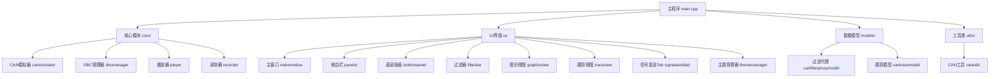

# 构建和部署

<cite>
**本文引用的文件**
- [CMakeLists.txt](file://CMakeLists.txt)
- [src/CMakeLists.txt](file://src/CMakeLists.txt)
- [scripts/build.py](file://scripts/build.py)
- [third_party/Dependencies.cmake](file://third_party/Dependencies.cmake)
- [src/main.cpp](file://src/main.cpp)
- [resources/resources.qrc](file://resources/resources.qrc)
</cite>

## 更新摘要
**所做更改**
- 项目名称从'sin'正式更改为'openbus'，影响所有构建配置、目标名称和安装规则
- 更新了CMake配置中的项目定义，版本保持0.1.0但描述更加精确
- 修改了构建脚本中的可执行文件路径和进程管理逻辑
- 更新了应用程序元数据（应用名称、组织名）
- 调整了安装规则和部署配置以匹配新项目名称

## 目录
- 项目概述
- CMake配置选项
- 依赖管理
- 平台特定设置
- 可执行文件生成过程
- 依赖库打包
- 安装程序制作
- 不同平台的构建配置
- 交叉编译设置
- 发布流程
- 构建优化技巧
- 故障排除方法

## 项目概述

本项目是一个基于Qt6的CAN总线分析工具，使用CMake作为构建系统。项目结构清晰，包含核心功能模块、UI界面、模型层和工具类。最新版本增加了信号发送Tab和主题管理器组件，提供了更丰富的用户交互体验。

### 项目架构


**图表来源**
- [src/main.cpp:11-53](file://src/main.cpp#L11-L53)
- [src/core/cansimulator.h](file://src/core/cansimulator.h)
- [src/ui/mainwindow.h](file://src/ui/mainwindow.h)
- [src/ui/signalsendtab.h](file://src/ui/signalsendtab.h)
- [src/ui/thememanager.h](file://src/ui/thememanager.h)

## CMake配置选项

### 根级CMake配置
项目的根级CMakeLists.txt定义了整体构建配置和子模块组织。

**主要配置选项：**
- `PROJECT_NAME`: 项目名称设置为"openbus"（已从'sin'更新）
- `VERSION`: 版本号设置为0.1.0
- `DESCRIPTION`: 项目描述为"报文解析、分析、回放、录制、trace、graphic 桌面软件"
- `CMAKE_CXX_STANDARD`: 设置C++标准为C++17
- `QT_VERSION`: 自动检测Qt6版本
- `BUILD_TYPE`: 支持Debug、Release、RelWithDebInfo、MinSizeRel模式

### 源码级CMake配置
src/CMakeLists.txt详细定义了各个模块的构建规则：

**新增的构建组件：**
- openbus_core静态库（核心功能模块）
- openbus_ui静态库（UI界面组件）
- openbus可执行目标（主程序）
- 信号发送Tab组件（signalsendtab）
- 主题管理器组件（thememanager）
- UI面板组件（sidebarpanels）
- 活动栏组件（activitybar）
- 分割编辑器区域（spliteditorarea）
- 信号配置对话框（signalconfigdialog）

**Section sources**
- [CMakeLists.txt:3-7](file://CMakeLists.txt#L3-L7)
- [src/CMakeLists.txt:185-337](file://src/CMakeLists.txt#L185-L337)

## 依赖管理

### Qt框架依赖
项目依赖以下Qt6模块：
- **QtCore**: 核心功能
- **QtGui**: 图形界面基础
- **QtWidgets**: 桌面UI组件
- **QtPrintSupport**: 打印支持（qcustomplot静态库需要）
- **QtSvg**: SVG图标渲染（activitybar/sidebarpanels使用）

### 第三方库依赖
- **spdlog**: 日志记录库
- **nlohmann/json**: JSON解析库
- **concurrentqueue**: 并发队列库
- **qcustomplot**: 自定义绘图库（静态链接）
- **vector_blf**: Vector BLF文件格式支持
- **zlib**: BLF文件压缩支持
- **pugixml**: ARXML文件解析支持

### 依赖安装命令
```bash
# Windows (MSYS2)
pacman -S mingw-w64-x86_64-qt6 mingw-w64-x86_64-zlib

# Linux (Ubuntu/Debian)
sudo apt-get install qtbase6-dev zlib1g-dev

# macOS
brew install qt@6 zlib
```

**Section sources**
- [CMakeLists.txt:42-45](file://CMakeLists.txt#L42-L45)
- [third_party/Dependencies.cmake:5-31](file://third_party/Dependencies.cmake#L5-L31)

## 平台特定设置

### Windows平台
```cmake
if(WIN32 AND CMAKE_CXX_COMPILER_ID STREQUAL "GNU")
    message(STATUS "使用默认 ld.bfd 链接器")
endif()

set(CMAKE_RUNTIME_OUTPUT_DIRECTORY ${CMAKE_BINARY_DIR}/bin)
```

### Linux平台
```cmake
find_package(Qt6 REQUIRED COMPONENTS Widgets PrintSupport Svg)
qt_standard_project_setup()
```

### macOS平台
```cmake
set(CMAKE_OSX_ARCHITECTURES "x86_64;arm64")
set(CMAKE_MACOSX_BUNDLE ON)
```

**Section sources**
- [CMakeLists.txt:30-45](file://CMakeLists.txt#L30-L45)

## 可执行文件生成过程

### 构建流程
1. **配置阶段**: CMake检测依赖并生成构建文件
2. **编译阶段**: 编译所有源文件为对象文件
3. **链接阶段**: 链接所有对象文件和库文件
4. **资源处理**: 处理Qt资源和样式文件

### 输出结构
```
build/
├── bin/
│   ├── openbus.exe      # Windows可执行文件（已从sin.exe更新）
│   └── openbus          # Unix可执行文件
├── lib/
│   └── *.dll            # Windows动态库
└── resources/
    └── *.qrc            # Qt资源文件
```

### 应用程序元数据
应用程序在启动时设置以下元数据：
- 应用名称: "openbus"
- 组织名称: "openbus"
- 应用版本: "0.1.0"

**Section sources**
- [src/CMakeLists.txt:337-344](file://src/CMakeLists.txt#L337-L344)
- [src/main.cpp:16-19](file://src/main.cpp#L16-L19)

## 依赖库打包

### Windows打包
使用windeployqt工具自动部署Qt依赖：
```bash
python scripts/build.py deploy
```

### Linux打包
创建AppImage或deb包：
```bash
# AppImage
linuxdeploy-x86_64.AppImage --appdir AppDir --desktop-file openbus.desktop --icon resources/icon.png --output appimage

# Debian包
dpkg-deb --build openbus-package/ openbus_1.0_amd64.deb
```

### macOS打包
创建.app应用程序包：
```bash
macdeployqt openbus.app -dmg
```

**Section sources**
- [scripts/build.py:363-382](file://scripts/build.py#L363-L382)

## 安装程序制作

### Windows安装程序
使用Inno Setup创建安装程序：
```ini
[Setup]
AppName=Openbus CAN Analyzer
AppVersion=0.1.0
DefaultDirName={pf}\Openbus CAN Analyzer
OutputDir=.
OutputBaseFilename=openbus-installer

[Files]
Source: "bin\*"; DestDir: "{app}"; Flags: ignoreversion recursesubdirs
```

### Linux安装脚本
```bash
#!/bin/bash
DESTDIR=/usr/local
mkdir -p $DESTDIR/bin
cp bin/openbus $DESTDIR/bin/
chmod +x $DESTDIR/bin/openbus
```

### macOS安装包
使用pkgbuild创建安装包：
```bash
pkgbuild --root openbus.app --identifier com.openbus.cananalyzer --version 0.1.0 openbus.pkg
```

## 不同平台的构建配置

### Windows MSVC构建
```bash
# 使用Visual Studio 2019
cmake -G "Visual Studio 16 2019" -A x64 -DCMAKE_PREFIX_PATH=C:/Qt/6.8.3/msvc2019_64 ..
cmake --build . --config Release
```

### MinGW构建（推荐）
```bash
# 使用MinGW-w64
python scripts/build.py configure --build-type Release
python scripts/build.py build -j8
```

### Linux构建
```bash
# 标准构建
cmake -DCMAKE_BUILD_TYPE=Release ..
make -j$(nproc)

# 使用Ninja
cmake -G Ninja -DCMAKE_BUILD_TYPE=Release ..
ninja
```

### macOS构建
```bash
# 使用Xcode
cmake -G Xcode -DCMAKE_PREFIX_PATH=/opt/homebrew/opt/qt@6 ..
cmake --build . --config Release

# 使用命令行
cmake -DCMAKE_BUILD_TYPE=Release ..
make -j$(sysctl -n hw.ncpu)
```

**Section sources**
- [scripts/build.py:207-245](file://scripts/build.py#L207-L245)

## 交叉编译设置

### Windows到Linux
```bash
# 安装交叉编译器
sudo apt-get install gcc-mingw-w64 g++-mingw-w64

# 配置交叉编译
cmake -DCMAKE_TOOLCHAIN_FILE=toolchain-mingw.cmake \
      -DCMAKE_PREFIX_PATH=/usr/x86_64-w64-mingw32/Qt6 ..
```

### Linux到Windows
```bash
# 配置交叉编译工具链
cat > toolchain-mingw.cmake << EOF
set(CMAKE_SYSTEM_NAME Windows)
set(CMAKE_C_COMPILER x86_64-w64-mingw32-gcc)
set(CMAKE_CXX_COMPILER x86_64-w64-mingw32-g++)
EOF
```

### macOS到iOS
```bash
# 配置iOS工具链
cmake -DCMAKE_TOOLCHAIN_FILE=iOS.cmake \
      -DCMAKE_IOS_DEPLOYMENT_TARGET=12.0 \
      -DIOS_ARCH=arm64 ..
```

## 发布流程

### 版本管理
```bash
# 更新版本号
git tag -a v0.1.0 -m "Release version 0.1.0"

# 创建发布分支
git checkout -b release/v0.1.0

# 更新CHANGELOG.md
vim CHANGELOG.md
```

### 自动化构建
```bash
# 完整构建流程
python scripts/build.py all --build-type Release

# 仅配置和构建
python scripts/build.py configure --build-type Release
python scripts/build.py build -j8

# 部署和运行
python scripts/build.py deploy
python scripts/build.py run
```

### 发布检查清单
- [ ] 代码通过所有测试
- [ ] 文档已更新
- [ ] 变更日志已维护
- [ ] 许可证信息正确
- [ ] 签名验证通过
- [ ] 兼容性测试完成

**Section sources**
- [scripts/build.py:385-392](file://scripts/build.py#L385-L392)

## 构建优化技巧

### 并行编译
```bash
# 使用多核编译
python scripts/build.py build -j8

# 使用Ninja加速（自动检测）
python scripts/build.py configure
python scripts/build.py build -j$(nproc)
```

### 缓存优化
```bash
# 清理构建缓存
python scripts/build.py clean

# 重新构建
python scripts/build.py rebuild
```

### 链接优化
```cmake
# 启用LTO（在CMakeLists.txt中配置）
set(CMAKE_INTERPROCEDURAL_OPTIMIZATION TRUE)

# 启用strip
set(CMAKE_STRIP /usr/bin/strip)

# 优化标志
add_compile_options(-O3 -DNDEBUG)
```

**Section sources**
- [scripts/build.py:275-295](file://scripts/build.py#L275-L295)

## 故障排除方法

### 常见构建错误

#### Qt依赖问题
```bash
# 检查Qt安装
python scripts/build.py status

# 指定Qt路径
python scripts/build.py configure --qt-dir C:/Qt/6.8.3/mingw_64

# 清理构建缓存
python scripts/build.py clean
```

#### 编译器问题
```bash
# 检查编译器版本
python scripts/build.py status

# 指定MinGW路径
python scripts/build.py configure --mingw-dir C:/Qt/Tools/mingw1310_64

# 指定CMake路径
python scripts/build.py configure --cmake-dir C:/tools/cmake-3.30.3-windows-x86_64
```

#### 内存不足
```bash
# 减少并行编译
python scripts/build.py build -j2

# 清理构建目录
python scripts/build.py clean
```

### 调试技巧
```bash
# 启用详细输出
python scripts/build.py configure --build-type Debug

# 查看构建状态
python scripts/build.py status

# 直接运行GDB调试
python scripts/build.py debug
```

### 性能分析
```bash
# 分析构建时间
time python scripts/build.py build

# 检查依赖关系
cmake --graphviz=deps.dot ..
dot -Tpng deps.dot -o deps.png

# 内存使用分析
valgrind --leak-check=yes ./build/bin/openbus.exe
```

**Section sources**
- [scripts/build.py:394-412](file://scripts/build.py#L394-L412)
- [scripts/build.py:314-334](file://scripts/build.py#L314-L334)

## 构建脚本高级用法

### 环境变量配置
构建脚本支持通过环境变量覆盖默认路径：

```bash
# 设置Qt路径
export SIN_QT_DIR="C:/Qt/6.8.3/mingw_64"

# 设置MinGW路径
export SIN_MINGW_DIR="C:/Qt/Tools/mingw1310_64"

# 设置CMake路径
export SIN_CMAKE_DIR="C:/tools/cmake-3.30.3-windows-x86_64"
```

### 构建系统检测
脚本会自动检测可用的构建系统：
- **Ninja**: 优先使用，编译速度更快
- **MinGW Makefiles**: 回退方案

### 工具链验证
```bash
# 检查工具链完整性
python scripts/build.py status

# 显示环境信息
python scripts/build.py status
```

### 进程管理
构建脚本包含智能进程管理功能：
- 自动检测并终止正在运行的openbus.exe进程
- 避免文件锁导致的链接失败
- 确保构建过程的稳定性

**Section sources**
- [scripts/build.py:114-188](file://scripts/build.py#L114-L188)
- [scripts/build.py:248-273](file://scripts/build.py#L248-L273)
- [scripts/build.py:64-68](file://scripts/build.py#L64-L68)