# 构建和部署

<cite>
**本文引用的文件**
- [CMakeLists.txt](file://CMakeLists.txt)
- [src/CMakeLists.txt](file://src/CMakeLists.txt)
- [scripts/build.py](file://scripts/build.py)
- [third_party/Dependencies.cmake](file://third_party/Dependencies.cmake)
- [src/main.cpp](file://src/main.cpp)
- [resources/resources.qrc](file://resources/resources.qrc)
- [drivers/CMakeLists.txt](file://drivers/CMakeLists.txt)
- [drivers/zlg/CMakeLists.txt](file://drivers/zlg/CMakeLists.txt)
- [drivers/peak/CMakeLists.txt](file://drivers/peak/CMakeLists.txt)
- [drivers/kvaser/CMakeLists.txt](file://drivers/kvaser/CMakeLists.txt)
- [scripts/driver_tool.py](file://scripts/driver_tool.py)
- [scripts/make_market.py](file://scripts/make_market.py)
- [scripts/plugin_tool.py](file://scripts/plugin_tool.py)
- [src/core/driver/candriverplugin.h](file://src/core/driver/candriverplugin.h)
- [src/core/driver/driverregistry.cpp](file://src/core/driver/driverregistry.cpp)
- [src/core/driver/marketindex.cpp](file://src/core/driver/marketindex.cpp)
</cite>

## 更新摘要
**所做更改**
- **重大更新**: make_market.py脚本大幅增强，支持新的统一市场格式（schema 2），包含驱动和插件的统一管理
- **新增功能**: 自动插件打包机制，支持Python插件的.opk格式打包和分发
- **增强元数据**: 为驱动和插件提供丰富的元数据处理，包括图标、描述、标签和关键词
- **统一市场结构**: 市场索引现在同时包含drivers[]和plugins[]数组，支持混合生态
- **自动化流程**: 集成driver_tool.py和plugin_tool.py，实现完整的包生命周期管理

## 目录
- 项目概述
- CMake配置选项
- 依赖管理
- 平台特定设置
- 可执行文件生成过程
- 驱动插件构建系统
- 插件生态系统
- 统一市场格式
- 驱动包打包和部署
- 插件包打包和部署
- 市场索引管理
- 依赖库打包
- 安装程序制作
- 不同平台的构建配置
- 交叉编译设置
- 发布流程
- 构建优化技巧
- 故障排除方法

## 项目概述

本项目是一个基于Qt6的CAN总线分析工具，使用CMake作为构建系统。项目结构清晰，包含核心功能模块、UI界面、模型层和工具类。最新版本增加了信号发送Tab和主题管理器组件，提供了更丰富的用户交互体验。

**重大更新** 新增了完整的驱动插件生态系统，支持外置驱动的动态加载、打包分发和市场化管理。现在支持统一的插件市场格式，可同时管理硬件驱动和软件插件。

### 项目架构

```mermaid
graph TD
A[主程序 main.cpp] --> B[核心模块 core/]
A --> C[UI界面 ui/]
A --> D[数据模型 models/]
A --> E[工具类 utils/]
B --> B1[CAN模拟器 cansimulator]
B --> B2[DBC管理器 dbcmanager]
B --> B3[播放器 player]
B --> B4[录制器 recorder]
B --> B5[驱动注册表 DriverRegistry]
B --> B6[市场索引 MarketIndex]
C --> C1[主窗口 mainwindow]
C --> C2[侧边栏 panels/]
C --> C3[底部面板 bottompanel]
C --> C4[过滤器 filterbar]
C --> C5[图形视图 graphicview]
C --> C6[跟踪视图 traceview]
C --> C7[信号发送Tab signalsendtab]
C --> C8[主题管理器 thememanager]
D --> D1[过滤代理 canfilterproxymodel]
D --> D2[跟踪模型 cantracemodel]
E --> E1[CAN工具 canutils]
F[驱动插件 drivers/] --> F1[ZLG 驱动]
F --> F2[PEAK 驱动]
F --> F3[Kvaser 驱动]
G[Python插件 plugins/] --> G1[BLF转换器]
G --> G2[总线统计]
G --> G3[CANopen浏览器]
G --> G4[DBC工具]
G --> G5[UDS诊断]
H[构建脚本 scripts/] --> H1[build.py]
H --> H2[driver_tool.py]
H --> H3[plugin_tool.py]
H --> H4[make_market.py]
I[市场索引 build/market/] --> I1[market.json schema 2]
I --> I2[驱动包 .odp]
I --> I3[插件包 .opk]
```


**图表来源**
- [src/main.cpp:11-53](file://src/main.cpp#L11-L53)
- [src/core/cansimulator.h](file://src/core/cansimulator.h)
- [src/ui/mainwindow.h](file://src/ui/mainwindow.h)
- [src/ui/signalsendtab.h](file://src/ui/signalsendtab.h)
- [src/ui/thememanager.h](file://src/ui/thememanager.h)
- [src/core/driver/driverregistry.cpp:95-102](file://src/core/driver/driverregistry.cpp#L95-L102)
- [src/core/driver/marketindex.cpp:41-52](file://src/core/driver/marketindex.cpp#L41-L52)
- [scripts/make_market.py:289-330](file://scripts/make_market.py#L289-L330)

## CMake配置选项

### 根级CMake配置
项目的根级CMakeLists.txt定义了整体构建配置和子模块组织。

**主要配置选项：**
- `PROJECT_NAME`: 项目名称设置为"openbus"（已从'sin'更新）
- `VERSION`: 版本号设置为0.1.0
- `DESCRIPTION`: 项目描述为"报文解析、分析、回放、录制、trace、graphic 桌面软件"
- `CMAKE_CXX_STANDARD`: 设置C++标准为C++17
- `QT_VERSION`: 自动检测Qt6版本
- `BUILD_TYPE`: 支持Debug、Release、RelWithDebInfo、MinSizeRel模式

### 源码级CMake配置
src/CMakeLists.txt详细定义了各个模块的构建规则：

**新增的构建组件：**
- openbus_core静态库（核心功能模块）
- openbus_ui静态库（UI界面组件）
- openbus可执行目标（主程序）
- 信号发送Tab组件（signalsendtab）
- 主题管理器组件（thememanager）
- UI面板组件（sidebarpanels）
- 活动栏组件（activitybar）
- 分割编辑器区域（spliteditorarea）
- 信号配置对话框（signalconfigdialog）

### 驱动插件CMake配置
drivers/CMakeLists.txt管理所有驱动插件的构建：

**驱动插件特性：**
- 每个驱动作为独立的Qt插件目标构建
- 输出到 build/bin/drivers/<id>/ 目录
- 与主程序共享相同的ABI契约（Qt6 + MinGW 13.1 x64 + C++17）
- 支持三种品牌驱动：ZLG、PEAK、Kvaser

**Section sources**
- [CMakeLists.txt:3-7](file://CMakeLists.txt#L3-L7)
- [src/CMakeLists.txt:185-337](file://src/CMakeLists.txt#L185-L337)
- [drivers/CMakeLists.txt:1-20](file://drivers/CMakeLists.txt#L1-L20)

## 依赖管理

### Qt框架依赖
项目依赖以下Qt6模块：
- **QtCore**: 核心功能
- **QtGui**: 图形界面基础
- **QtWidgets**: 桌面UI组件
- **QtPrintSupport**: 打印支持（qcustomplot静态库需要）
- **QtSvg**: SVG图标渲染（activitybar/sidebarpanels使用）
- **QtNetwork**: 网络请求（市场索引下载）

### 第三方库依赖
- **spdlog**: 日志记录库
- **nlohmann/json**: JSON解析库
- **concurrentqueue**: 并发队列库
- **qcustomplot**: 自定义绘图库（静态链接）
- **vector_blf**: Vector BLF文件格式支持
- **zlib**: BLF文件压缩支持
- **pugixml**: ARXML文件解析支持

### 依赖安装命令
```bash
# Windows (MSYS2)
pacman -S mingw-w64-x86_64-qt6 mingw-w64-x86_64-zlib

# Linux (Ubuntu/Debian)
sudo apt-get install qtbase6-dev zlib1g-dev

# macOS
brew install qt@6 zlib
```

**Section sources**
- [CMakeLists.txt:42-45](file://CMakeLists.txt#L42-L45)
- [third_party/Dependencies.cmake:5-31](file://third_party/Dependencies.cmake#L5-L31)

## 平台特定设置

### Windows平台
```cmake
if(WIN32 AND CMAKE_CXX_COMPILER_ID STREQUAL "GNU")
    message(STATUS "使用默认 ld.bfd 链接器")
endif()

set(CMAKE_RUNTIME_OUTPUT_DIRECTORY ${CMAKE_BINARY_DIR}/bin)
```

### Linux平台
```cmake
find_package(Qt6 REQUIRED COMPONENTS Widgets PrintSupport Svg Network)
qt_standard_project_setup()
```

### macOS平台
```cmake
set(CMAKE_OSX_ARCHITECTURES "x86_64;arm64")
set(CMAKE_MACOSX_BUNDLE ON)
```

**Section sources**
- [CMakeLists.txt:30-45](file://CMakeLists.txt#L30-L45)

## 可执行文件生成过程

### 构建流程
1. **配置阶段**: CMake检测依赖并生成构建文件
2. **编译阶段**: 编译所有源文件为对象文件
3. **链接阶段**: 链接所有对象文件和库文件
4. **资源处理**: 处理Qt资源和样式文件

### 输出结构
```
build/
├── bin/
│   ├── openbus.exe      # Windows可执行文件（已从sin.exe更新）
│   ├── drivers/          # 驱动插件目录
│   │   ├── zlg/         # ZLG 驱动插件
│   │   ├── peak/        # PEAK 驱动插件
│   │   └── kvaser/      # Kvaser 驱动插件
│   └── openbus          # Unix可执行文件
├── lib/
│   └── *.dll            # Windows动态库
├── market/              # 市场索引和包文件
│   ├── market.json      # 统一市场索引（schema 2）
│   ├── assets/          # 市场资源文件
│   └── opk/             # Python插件包
└── resources/
    └── *.qrc            # Qt资源文件
```

### 应用程序元数据
应用程序在启动时设置以下元数据：
- 应用名称: "openbus"
- 组织名称: "openbus"
- 应用版本: "0.1.0"

**Section sources**
- [src/CMakeLists.txt:337-344](file://src/CMakeLists.txt#L337-L344)
- [src/main.cpp:16-19](file://src/main.cpp#L16-L19)

## 驱动插件构建系统

### 驱动插件架构
驱动插件采用QPluginLoader机制实现动态加载，提供标准化的接口定义：

**驱动插件接口规范：**
- `driverId()`: 驱动唯一标识符
- `displayName()`: 显示名称
- `version()`: 驱动版本
- `deviceTypes()`: 支持的设备类型列表
- `enumerateDevices()`: 枚举可用物理设备
- `createDevice()`: 创建设备实例

### 支持的驱动品牌
项目内置支持三个主流CAN总线设备厂商：

| 品牌 | ID | 特点 | 设备数量 |
|------|----|----|----------|
| ZLG 致远电子 | zlg | 国产主流，性价比高 | 9种型号 |
| PEAK System | peak | 德国品质，专业级 | 3种型号 |
| Kvaser | kvaser | 瑞典品牌，稳定性强 | 4种型号 |

### 驱动插件构建配置
每个驱动插件都有独立的CMakeLists.txt配置文件：

**构建特性：**
- 使用 `qt_add_plugin()` 创建Qt插件目标
- 输出到 `build/bin/drivers/<id>/` 目录
- 与主程序保持ABI兼容性
- 支持厂商SDK的动态加载

**Section sources**
- [src/core/driver/candriverplugin.h:21-44](file://src/core/driver/candriverplugin.h#L21-L44)
- [drivers/zlg/CMakeLists.txt:1-31](file://drivers/zlg/CMakeLists.txt#L1-L31)
- [drivers/peak/CMakeLists.txt:1-31](file://drivers/peak/CMakeLists.txt#L1-L31)
- [drivers/kvaser/CMakeLists.txt:1-31](file://drivers/kvaser/CMakeLists.txt#L1-L31)

## 插件生态系统

### Python插件架构
项目现在支持Python插件生态系统，通过plugin_tool.py进行统一管理：

**插件特性：**
- 基于ZIP格式的.opk包格式
- 标准化的plugin.json清单文件
- 支持命令扩展和事件触发
- 自动发现和加载机制

### 内置插件列表
项目预装了五个核心Python插件：

| 插件名称 | 功能 | 版本 |
|----------|------|------|
| blf-converter | BLF日志格式转换工具 | 1.0.0 |
| bus-statistics | 总线统计分析工具 | 1.0.0 |
| canopen-explorer | CANopen协议浏览器 | 1.0.0 |
| dbc-tool | DBC数据库查看编辑器 | 1.0.0 |
| uds-diagnostic | UDS诊断客户端 | 1.1.0 |

### 插件包格式
.opk包采用ZIP格式，包含：
- `plugin.json`: 插件清单文件
- `main.py`: 插件入口文件
- 可选的资源文件和依赖库
- 自动排除__pycache__和.pyc文件

**Section sources**
- [scripts/plugin_tool.py:1-207](file://scripts/plugin_tool.py#L1-L207)
- [plugins/blf-converter/plugin.json:1-17](file://plugins/blf-converter/plugin.json#L1-L17)
- [plugins/uds-diagnostic/plugin.json:1-17](file://plugins/uds-diagnostic/plugin.json#L1-L17)

## 统一市场格式

### Schema 2 市场结构
make_market.py v2引入了全新的统一市场格式，支持驱动和插件的混合管理：

**市场索引结构：**
```json
{
  "schema": 2,
  "version": "2026.8.18",
  "updated": "2026-08-18",
  "base": ".",
  "drivers": [...],
  "plugins": [...]
}
```

### 驱动条目增强
每个驱动条目现在包含丰富的元数据：
- **基本信息**: id, name, vendor, version, package
- **安全信息**: sha256, size, license, abiVersion
- **展示信息**: icon, image, summary, readme, keywords
- **设备信息**: devices[] 简表（型号、通道数、CAN FD支持等）
- **兼容性**: minAppVersion, updatedAt

### 插件条目增强
插件条目支持详细的描述和分类：
- **基本信息**: id, name, publisher, version, description
- **包信息**: package, sha256, size
- **展示信息**: icon, readme, tags, keywords
- **兼容性**: minAppVersion, updatedAt

### 自动生成流程
make_market.py自动执行以下操作：
1. 扫描drivers/目录下的驱动插件
2. 扫描plugins/目录下的Python插件
3. 调用driver_tool.py和plugin_tool.py进行打包
4. 计算SHA256校验和
5. 复制市场资源文件
6. 生成统一的market.json索引

**Section sources**
- [scripts/make_market.py:1-335](file://scripts/make_market.py#L1-L335)
- [src/core/driver/marketindex.cpp:82-137](file://src/core/driver/marketindex.cpp#L82-L137)

## 驱动包打包和部署

### .odp 驱动包格式
驱动包采用ZIP格式封装，包含以下必需文件：
- `driver.json`: 驱动清单文件
- `driver_<id>.dll`: 驱动插件DLL文件
- `CHECKSUMS.sha256`: 完整性校验文件
- 可选：`icon.svg`、`assets/`、`vendor/` 等附加资源

### 驱动包管理工具
driver_tool.py 提供完整的驱动包生命周期管理：

**主要功能：**
- **pack**: 打包驱动目录为 .odp 文件
- **install**: 安装驱动包到指定目录
- **uninstall**: 卸载已安装的驱动
- **validate**: 验证驱动包完整性

### 安全校验机制
驱动包安装过程包含多重安全检查：
- SHA256 完整性校验
- 驱动清单验证
- 文件路径安全检查
- 版本兼容性检查

### 部署流程
```bash
# 打包驱动
python scripts/driver_tool.py pack <驱动目录> -o output.odp

# 安装驱动
python scripts/driver_tool.py install output.odp ./drivers

# 卸载驱动
python scripts/driver_tool.py uninstall zlg ./drivers

# 验证驱动
python scripts/driver_tool.py validate <驱动目录或包>
```

**Section sources**
- [scripts/driver_tool.py:1-306](file://scripts/driver_tool.py#L1-L306)
- [src/core/driver/driverregistry.cpp:186-272](file://src/core/driver/driverregistry.cpp#L186-L272)

## 插件包打包和部署

### .opk 插件包格式
Python插件包采用ZIP格式，包含：
- `plugin.json`: 插件清单文件
- `main.py`: 插件主程序
- 可选的资源文件和依赖
- 自动排除__pycache__和.pyc文件

### 插件包管理工具
plugin_tool.py 提供完整的插件包生命周期管理：

**主要功能：**
- **pack**: 打包插件目录为 .opk 文件
- **install**: 安装插件包到plugins目录
- **uninstall**: 卸载已安装的插件
- **validate**: 验证插件包完整性

### 安全校验机制
插件包安装过程包含多重安全检查：
- plugin.json清单验证
- 入口文件存在性检查
- 路径穿越攻击防护
- 文件名格式验证

### 部署流程
```bash
# 打包插件
python scripts/plugin_tool.py pack <插件目录> -o output.opk

# 安装插件
python scripts/plugin_tool.py install output.opk ./plugins

# 卸载插件
python scripts/plugin_tool.py uninstall blf-converter ./plugins

# 验证插件
python scripts/plugin_tool.py validate <插件目录或包>
```

**Section sources**
- [scripts/plugin_tool.py:1-207](file://scripts/plugin_tool.py#L1-L207)

## 市场索引管理

### 市场索引结构
market.json 文件定义了可用的驱动和设备信息：

**索引字段说明：**
- `version`: 市场索引版本
- `updated`: 更新时间戳
- `base`: 基础URL路径
- `drivers`: 可用驱动列表
- `plugins`: 可用插件列表

### 本地市场生成
make_market.py 脚本用于生成本地开发环境的市场索引：

**生成流程：**
1. 扫描 build/bin/drivers/ 下的驱动插件
2. 扫描 plugins/ 下的Python插件
3. 读取每个驱动的 driver.json 清单
4. 读取每个插件的 plugin.json 清单
5. 计算驱动包的SHA256哈希值
6. 计算插件包的SHA256哈希值
7. 合并内置设备信息和插件元数据
8. 生成 market.json 索引文件

### 设备信息管理
内置设备信息包含详细的规格参数：

**设备属性：**
- 基本标识：driverId、model、vendor、type
- 功能特性：channels、canFd、maxBaud、timestamp
- 连接方式：interface、power
- 营销信息：summary、tags、intro、images

### 插件元数据增强
插件元数据包含丰富的描述信息：
- **标题和描述**: 中文标题和详细描述
- **标签和关键词**: 用于搜索和分类
- **README扩展**: 详细的功能说明和使用指南
- **图标资源**: 自动复制插件图标到市场资源目录

**Section sources**
- [scripts/make_market.py:1-335](file://scripts/make_market.py#L1-L335)
- [src/core/driver/marketindex.cpp:41-185](file://src/core/driver/marketindex.cpp#L41-L185)

## 依赖库打包

### Windows打包
使用windeployqt工具自动部署Qt依赖：
```bash
python scripts/build.py deploy
```

### Linux打包
创建AppImage或deb包：
```bash
# AppImage
linuxdeploy-x86_64.AppImage --appdir AppDir --desktop-file openbus.desktop --icon resources/icon.png --output appimage

# Debian包
dpkg-deb --build openbus-package/ openbus_1.0_amd64.deb
```

### macOS打包
创建.app应用程序包：
```bash
macdeployqt openbus.app -dmg
```

**Section sources**
- [scripts/build.py:363-382](file://scripts/build.py#L363-382)

## 安装程序制作

### Windows安装程序
使用Inno Setup创建安装程序：
```ini
[Setup]
AppName=Openbus CAN Analyzer
AppVersion=0.1.0
DefaultDirName={pf}\Openbus CAN Analyzer
OutputDir=.
OutputBaseFilename=openbus-installer

[Files]
Source: "bin\*"; DestDir: "{app}"; Flags: ignoreversion recursesubdirs
```

### Linux安装脚本
```bash
#!/bin/bash
DESTDIR=/usr/local
mkdir -p $DESTDIR/bin
cp bin/openbus $DESTDIR/bin/
chmod +x $DESTDIR/bin/openbus
```

### macOS安装包
使用pkgbuild创建安装包：
```bash
pkgbuild --root openbus.app --identifier com.openbus.cananalyzer --version 0.1.0 openbus.pkg
```

## 不同平台的构建配置

### Windows MSVC构建
```bash
# 使用Visual Studio 2019
cmake -G "Visual Studio 16 2019" -A x64 -DCMAKE_PREFIX_PATH=C:/Qt/6.8.3/msvc2019_64 ..
cmake --build . --config Release
```

### MinGW构建（推荐）
```bash
# 使用MinGW-w64
python scripts/build.py configure --build-type Release
python scripts/build.py build -j8
```

### Linux构建
```bash
# 标准构建
cmake -DCMAKE_BUILD_TYPE=Release ..
make -j$(nproc)

# 使用Ninja
cmake -G Ninja -DCMAKE_BUILD_TYPE=Release ..
ninja
```

### macOS构建
```bash
# 使用Xcode
cmake -G Xcode -DCMAKE_PREFIX_PATH=/opt/homebrew/opt/qt@6 ..
cmake --build . --config Release

# 使用命令行
cmake -DCMAKE_BUILD_TYPE=Release ..
make -j$(sysctl -n hw.ncpu)
```

**Section sources**
- [scripts/build.py:207-245](file://scripts/build.py#L207-L245)

## 交叉编译设置

### Windows到Linux
```bash
# 安装交叉编译器
sudo apt-get install gcc-mingw-w64 g++-mingw-w64

# 配置交叉编译
cmake -DCMAKE_TOOLCHAIN_FILE=toolchain-mingw.cmake \
      -DCMAKE_PREFIX_PATH=/usr/x86_64-w64-mingw32/Qt6 ..
```

### Linux到Windows
```bash
# 配置交叉编译工具链
cat > toolchain-mingw.cmake << EOF
set(CMAKE_SYSTEM_NAME Windows)
set(CMAKE_C_COMPILER x86_64-w64-mingw32-gcc)
set(CMAKE_CXX_COMPILER x86_64-w64-mingw32-g++)
EOF
```

### macOS到iOS
```bash
# 配置iOS工具链
cmake -DCMAKE_TOOLCHAIN_FILE=iOS.cmake \
      -DCMAKE_IOS_DEPLOYMENT_TARGET=12.0 \
      -DIOS_ARCH=arm64 ..
```

## 发布流程

### 版本管理
```bash
# 更新版本号
git tag -a v0.1.0 -m "Release version 0.1.0"

# 创建发布分支
git checkout -b release/v0.1.0

# 更新CHANGELOG.md
vim CHANGELOG.md
```

### 自动化构建
```bash
# 完整构建流程
python scripts/build.py all --build-type Release

# 仅配置和构建
python scripts/build.py configure --build-type Release
python scripts/build.py build -j8

# 部署和运行
python scripts/build.py deploy
python scripts/build.py run

# 生成市场索引
python scripts/make_market.py
```

### 发布检查清单
- [ ] 代码通过所有测试
- [ ] 文档已更新
- [ ] 变更日志已维护
- [ ] 许可证信息正确
- [ ] 签名验证通过
- [ ] 兼容性测试完成
- [ ] 驱动包完整性验证
- [ ] 插件包完整性验证
- [ ] 市场索引更新

**Section sources**
- [scripts/build.py:385-392](file://scripts/build.py#L385-L392)

## 构建优化技巧

### 并行编译
```bash
# 使用多核编译
python scripts/build.py build -j8

# 使用Ninja加速（自动检测）
python scripts/build.py configure
python scripts/build.py build -j$(nproc)
```

### 缓存优化
```bash
# 清理构建缓存
python scripts/build.py clean

# 重新构建
python scripts/build.py rebuild
```

### 链接优化
```cmake
# 启用LTO（在CMakeLists.txt中配置）
set(CMAKE_INTERPROCEDURAL_OPTIMIZATION TRUE)

# 启用strip
set(CMAKE_STRIP /usr/bin/strip)

# 优化标志
add_compile_options(-O3 -DNDEBUG)
```

**Section sources**
- [scripts/build.py:275-295](file://scripts/build.py#L275-L295)

## 故障排除方法

### 常见构建错误

#### Qt依赖问题
```bash
# 检查Qt安装
python scripts/build.py status

# 指定Qt路径
python scripts/build.py configure --qt-dir C:/Qt/6.8.3/mingw_64

# 清理构建缓存
python scripts/build.py clean
```

#### 编译器问题
```bash
# 检查编译器版本
python scripts/build.py status

# 指定MinGW路径
python scripts/build.py configure --mingw-dir C:/Qt/Tools/mingw1310_64

# 指定CMake路径
python scripts/build.py configure --cmake-dir C:/tools/cmake-3.30.3-windows-x86_64
```

#### 内存不足
```bash
# 减少并行编译
python scripts/build.py build -j2

# 清理构建目录
python scripts/build.py clean
```

### 驱动相关故障排除

#### 驱动加载失败
```bash
# 验证驱动包完整性
python scripts/driver_tool.py validate <驱动目录>

# 检查驱动清单格式
python scripts/driver_tool.py validate <驱动目录>

# 重新安装驱动
python scripts/driver_tool.py install <包.odp> ./drivers
```

#### 插件加载失败
```bash
# 验证插件包完整性
python scripts/plugin_tool.py validate <插件目录>

# 检查插件清单格式
python scripts/plugin_tool.py validate <插件目录>

# 重新安装插件
python scripts/plugin_tool.py install <包.opk> ./plugins
```

#### 市场索引问题
```bash
# 重新生成市场索引
python scripts/make_market.py

# 检查市场文件结构
ls -la build/market/

# 验证JSON格式
python -m json.tool build/market/market.json
```

### 调试技巧
```bash
# 启用详细输出
python scripts/build.py configure --build-type Debug

# 查看构建状态
python scripts/build.py status

# 直接运行GDB调试
python scripts/build.py debug
```

### 性能分析
```bash
# 分析构建时间
time python scripts/build.py build

# 检查依赖关系
cmake --graphviz=deps.dot ..
dot -Tpng deps.dot -o deps.png

# 内存使用分析
valgrind --leak-check=yes ./build/bin/openbus.exe
```

**Section sources**
- [scripts/build.py:394-412](file://scripts/build.py#L394-L412)
- [scripts/build.py:314-334](file://scripts/build.py#L314-L334)

## 构建脚本高级用法

### 环境变量配置
构建脚本支持通过环境变量覆盖默认路径：

```bash
# 设置Qt路径
export SIN_QT_DIR="C:/Qt/6.8.3/mingw_64"

# 设置MinGW路径
export SIN_MINGW_DIR="C:/Qt/Tools/mingw1310_64"

# 设置CMake路径
export SIN_CMAKE_DIR="C:/tools/cmake-3.30.3-windows-x86_64"
```

### 构建系统检测
脚本会自动检测可用的构建系统：
- **Ninja**: 优先使用，编译速度更快
- **MinGW Makefiles**: 回退方案

### 工具链验证
```bash
# 检查工具链完整性
python scripts/build.py status

# 显示环境信息
python scripts/build.py status
```

### 进程管理
构建脚本包含智能进程管理功能：
- 自动检测并终止正在运行的openbus.exe进程
- 避免文件锁导致的链接失败
- 确保构建过程的稳定性

**Section sources**
- [scripts/build.py:114-188](file://scripts/build.py#L114-L188)
- [scripts/build.py:248-273](file://scripts/build.py#L248-L273)
- [scripts/build.py:64-68](file://scripts/build.py#L64-L68)