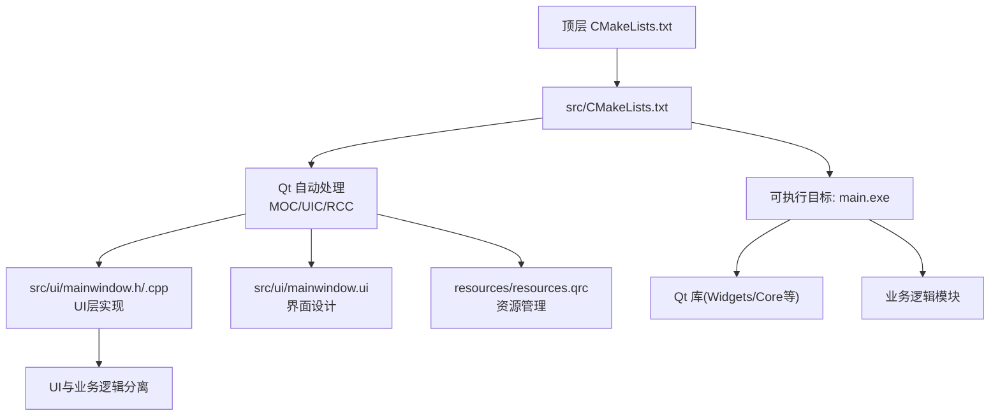
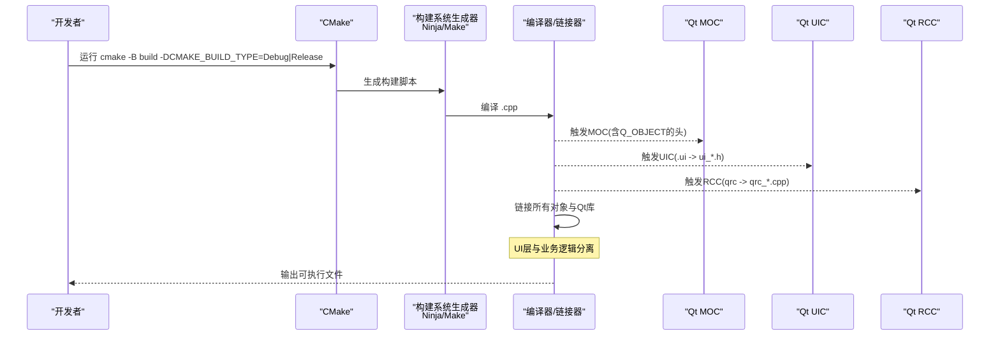
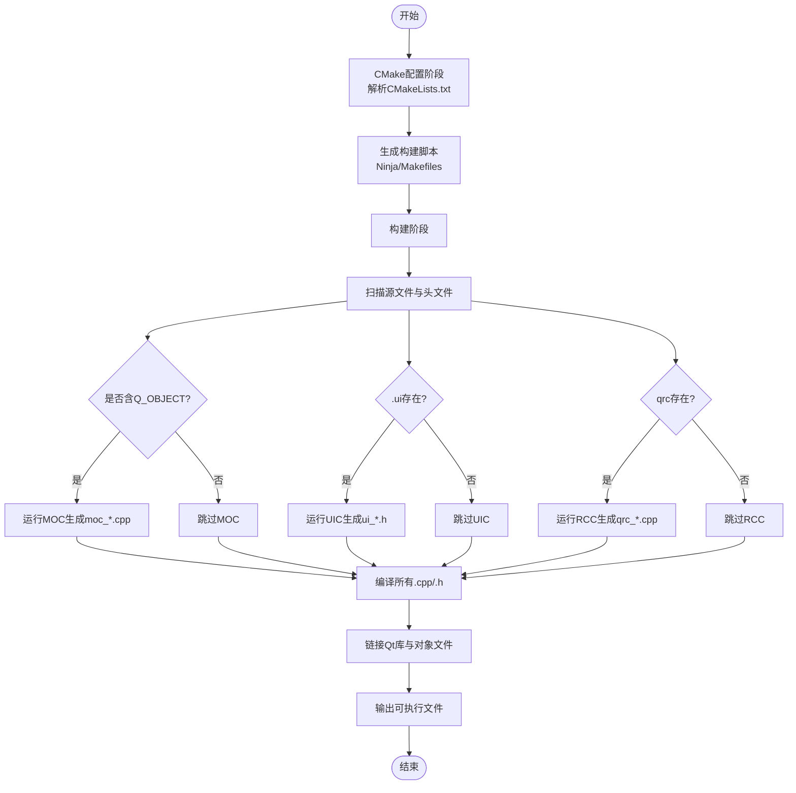
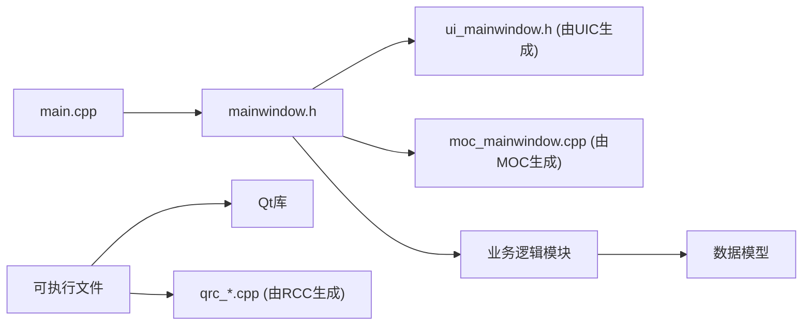

# 构建流程

<cite>
**本文引用的文件**   
- [CMakeLists.txt](file://CMakeLists.txt)
- [src/CMakeLists.txt](file://src/CMakeLists.txt)
- [src/main.cpp](file://src/main.cpp)
- [src/ui/mainwindow.h](file://src/ui/mainwindow.h)
- [src/ui/mainwindow.cpp](file://src/ui/mainwindow.cpp)
- [src/ui/mainwindow.ui](file://src/ui/mainwindow.ui)
- [resources/resources.qrc](file://resources/resources.qrc)
- [README.en.md](file://README.en.md)
</cite>

## 更新摘要
**所做更改**   
- 更新了项目结构分析以反映CMake-based Qt桌面应用程序的分离关注点架构
- 增强了UI和业务逻辑分离的详细说明
- 完善了CMake构建系统的配置和生成过程描述
- 优化了依赖分析和故障排查指南

## 目录
1. [简介](#简介)
2. [项目结构](#项目结构)
3. [核心组件](#核心组件)
4. [架构总览](#架构总览)
5. [详细组件分析](#详细组件分析)
6. [依赖分析](#依赖分析)
7. [性能考虑](#性能考虑)
8. [故障排查指南](#故障排查指南)
9. [结论](#结论)
10. [附录](#附录)

## 简介
本文件面向基于CMake的Qt桌面应用程序，系统化说明从项目初始化到生成可执行文件的完整构建流程。重点覆盖：
- CMake配置与生成过程
- Qt资源编译（qrc）
- MOC元对象代码生成
- UIC界面文件转换
- UI与业务逻辑的分离架构
- 调试与发布版本的差异、优化选项与性能分析配置
- 常见构建问题的诊断方法与解决方案

## 项目结构
该工程采用顶层CMakeLists与子模块分离的组织方式，体现了清晰的关注点分离原则：
- 顶层CMakeLists负责工程名、版本、Qt发现与全局设置
- src/CMakeLists定义可执行目标、链接Qt库、启用Qt自动化处理（MOC/UIC/RCC）
- resources下包含Qt资源文件（qrc），用于打包样式与静态资源
- src/ui包含基于Qt Designer的界面文件（.ui）及对应的头/源文件，实现UI层独立管理
- src/main.cpp作为应用入口，协调各模块

**图表来源** 
- [CMakeLists.txt](file://CMakeLists.txt)
- [src/CMakeLists.txt](file://src/CMakeLists.txt)
- [src/ui/mainwindow.ui](file://src/ui/mainwindow.ui)
- [resources/resources.qrc](file://resources/resources.qrc)

**章节来源**
- [CMakeLists.txt](file://CMakeLists.txt)
- [src/CMakeLists.txt](file://src/CMakeLists.txt)
- [src/main.cpp](file://src/main.cpp)
- [src/ui/mainwindow.h](file://src/ui/mainwindow.h)
- [src/ui/mainwindow.cpp](file://src/ui/mainwindow.cpp)
- [src/ui/mainwindow.ui](file://src/ui/mainwindow.ui)
- [resources/resources.qrc](file://resources/resources.qrc)

## 核心组件
- CMake构建系统：负责发现Qt、配置编译器、生成构建脚本与目标
- Qt自动化处理：
  - MOC：为含Q_OBJECT宏的头文件生成元对象代码
  - UIC：将.ui界面文件转换为C++头文件
  - RCC：将.qrc资源文件编译为C++源码并参与链接
- 源代码组织：
  - src/main.cpp：应用入口，负责初始化各模块
  - src/ui/mainwindow.*：主窗口逻辑与界面绑定，体现UI层独立性
  - resources/resources.qrc：样式与资源打包
- 关注点分离：UI层（mainwindow.*）与业务逻辑清晰分离，便于维护和测试

**章节来源**
- [src/CMakeLists.txt](file://src/CMakeLists.txt)
- [src/main.cpp](file://src/main.cpp)
- [src/ui/mainwindow.h](file://src/ui/mainwindow.h)
- [src/ui/mainwindow.cpp](file://src/ui/mainwindow.cpp)
- [src/ui/mainwindow.ui](file://src/ui/mainwindow.ui)
- [resources/resources.qrc](file://resources/resources.qrc)

## 架构总览
下图展示从CMake配置到最终可执行文件的整体流程，包括Qt各工具的介入点和UI与业务逻辑的分离架构。

**图表来源** 
- [CMakeLists.txt](file://CMakeLists.txt)
- [src/CMakeLists.txt](file://src/CMakeLists.txt)
- [src/ui/mainwindow.ui](file://src/ui/mainwindow.ui)
- [resources/resources.qrc](file://resources/resources.qrc)

## 详细组件分析

### CMake配置与生成过程
- 顶层CMakeLists负责：
  - 设置工程名与版本
  - 查找Qt（通常使用FindQt或Qt6AutoMoc等机制）
  - 设置全局编译选项（如C++标准、编码、警告）
- 子模块CMakeLists负责：
  - 定义可执行目标（add_executable）
  - 链接Qt库（如Qt::Widgets, Qt::Core）
  - 启用Qt自动化处理（set(CMAKE_AUTOMOC ON; set(CMAKE_AUTOUIC ON); set(CMAKE_AUTORCC ON)）
  - 添加资源文件（qt_add_resources 或 add_custom_target 调用rcc）
- 支持多平台构建和跨平台兼容性

关键点：
- AUTOMOC/AUTOUIC/AUTORCC会在构建时自动扫描头/源/资源，生成中间产物并参与编译链接
- 通过CMAKE_BUILD_TYPE控制Debug/Release，影响优化级别与调试符号
- 模块化构建支持增量编译和并行构建

**章节来源**
- [CMakeLists.txt](file://CMakeLists.txt)
- [src/CMakeLists.txt](file://src/CMakeLists.txt)

### Qt资源编译（RCC）
- resources.qrc描述资源清单（路径映射、压缩、类别等）
- RCC在构建时读取qrc，生成C++源码（通常为qrc_*.cpp），由编译器编译并链接进可执行文件
- 优点：资源内嵌、跨平台一致、避免运行时路径问题
- 支持多种资源类型：图像、样式表、图标等

常见问题：
- 路径引用错误导致资源未找到
- qrc中路径大小写不一致（Windows不敏感，Linux敏感）
- 资源文件权限问题

**章节来源**
- [resources/resources.qrc](file://resources/resources.qrc)

### MOC处理（元对象代码生成）
- 当类声明中包含Q_OBJECT宏时，MOC会生成元对象实现（信号槽、属性、反射等）
- AUTOMOC会自动识别并生成moc_*.cpp，无需手动调用
- 若自定义基类或复杂继承关系，需确保头文件被正确包含且未被预编译头屏蔽
- 支持Qt的元对象系统特性

**章节来源**
- [src/ui/mainwindow.h](file://src/ui/mainwindow.h)
- [src/ui/mainwindow.cpp](file://src/ui/mainwindow.cpp)

### UIC界面文件转换
- .ui文件由Qt Designer生成，UIC将其转换为C++头文件（ui_*.h）
- AUTOUIC自动检测并生成，可在代码中通过Ui命名空间访问控件
- 修改.ui后需重新构建以触发UIC再生成
- 支持界面与逻辑分离的开发模式

**章节来源**
- [src/ui/mainwindow.ui](file://src/ui/mainwindow.ui)
- [src/ui/mainwindow.cpp](file://src/ui/mainwindow.cpp)

### 构建流程时序图（代码级）

**图表来源** 
- [src/CMakeLists.txt](file://src/CMakeLists.txt)
- [src/ui/mainwindow.ui](file://src/ui/mainwindow.ui)
- [resources/resources.qrc](file://resources/resources.qrc)

## 依赖分析
- 外部依赖：
  - Qt框架（Widgets/Core/Gui等）
  - 编译器工具链（MSVC/GCC/Clang）
  - 构建系统（Ninja/Make）
- 内部依赖：
  - main.cpp依赖UI模块（mainwindow）
  - mainwindow依赖.ui生成的ui_*.h
  - 资源依赖qrc中定义的路径与内容
  - UI层与业务逻辑解耦，降低耦合度

**图表来源** 
- [src/main.cpp](file://src/main.cpp)
- [src/ui/mainwindow.h](file://src/ui/mainwindow.h)
- [src/ui/mainwindow.cpp](file://src/ui/mainwindow.cpp)
- [src/ui/mainwindow.ui](file://src/ui/mainwindow.ui)
- [resources/resources.qrc](file://resources/resources.qrc)

**章节来源**
- [src/main.cpp](file://src/main.cpp)
- [src/ui/mainwindow.h](file://src/ui/mainwindow.h)
- [src/ui/mainwindow.cpp](file://src/ui/mainwindow.cpp)
- [src/ui/mainwindow.ui](file://src/ui/mainwindow.ui)
- [resources/resources.qrc](file://resources/resources.qrc)

## 性能考虑
- 构建性能：
  - 使用并行构建（Ninja默认支持）
  - 增量构建：仅重编译变更文件
  - 合理拆分源文件，减少单文件编译开销
  - 使用预编译头文件加速大型项目
- 运行性能：
  - Release模式开启优化（-O2/-O3）
  - 资源压缩（qrc中可选压缩）
  - 避免不必要的信号槽连接与频繁UI刷新
  - 懒加载大资源文件
- 性能分析：
  - Windows：VS Profiler / perfmon
  - Linux：perf / valgrind
  - Qt：QTimer/QElapsedTimer进行关键路径计时
  - 内存分析工具集成

## 故障排查指南
常见问题与解决思路：
- 依赖缺失
  - 现象：找不到Qt库或头文件
  - 排查：确认Qt安装路径、环境变量、CMake是否成功find_package
  - 解决：指定Qt根路径或使用vcpkg/conan管理依赖
- 路径错误
  - 现象：资源加载失败、.ui无法生成
  - 排查：检查qrc路径大小写、相对路径基准、CMake中的源集定义
  - 解决：统一路径风格，必要时使用绝对路径或变量
- 编译失败
  - 现象：MOC/UIC/RCC报错、链接错误
  - 排查：查看生成目录下的moc_uic_rcc日志；确认头文件包含顺序与宏定义
  - 解决：清理构建目录（rm -rf build）、重新生成；检查C++标准与Qt版本匹配
- 调试与发布差异
  - 现象：Release崩溃但Debug正常
  - 排查：检查未初始化变量、越界访问、优化导致的代码重排
  - 解决：使用AddressSanitizer/UBSan定位问题
- UI相关错误
  - 现象：界面显示异常、控件无法访问
  - 排查：检查.ui文件语法、控件名称一致性、信号槽连接
  - 解决：重新生成UI文件、验证控件ID

**章节来源**
- [CMakeLists.txt](file://CMakeLists.txt)
- [src/CMakeLists.txt](file://src/CMakeLists.txt)
- [resources/resources.qrc](file://resources/resources.qrc)
- [src/ui/mainwindow.ui](file://src/ui/mainwindow.ui)

## 结论
本项目的构建流程以CMake为核心，结合Qt的AUTOMOC/AUTOUIC/AUTORCC实现自动化代码生成与资源编译。通过合理的工程组织与构建配置，实现了UI层与业务逻辑的清晰分离，提高了代码的可维护性和可扩展性。遇到问题时，优先检查依赖、路径与生成日志，逐步定位并修复。

## 附录
- 常用命令参考（示例）：
  - 配置：cmake -B build -DCMAKE_BUILD_TYPE=Debug|Release
  - 构建：cmake --build build --config Debug|Release
  - 清理：删除build目录后重新生成
  - 调试：cmake --build build --target debug
- 相关文档：
  - README.en.md提供项目背景与使用说明
- 最佳实践：
  - 保持UI层简洁，业务逻辑独立
  - 合理使用Qt自动化功能
  - 定期清理构建缓存
  - 使用版本控制管理构建配置

**章节来源**
- [README.en.md](file://README.en.md)