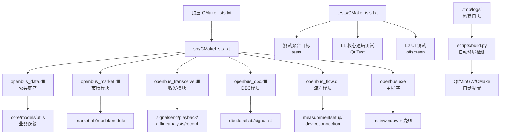
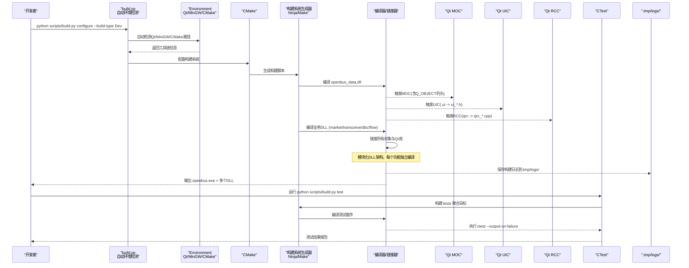
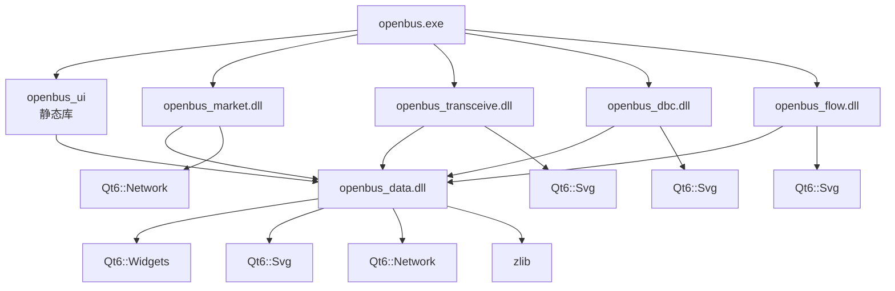
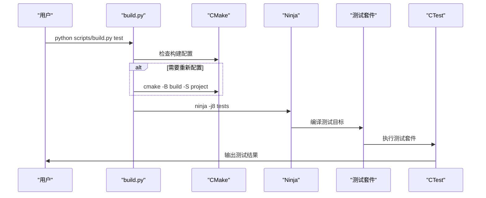
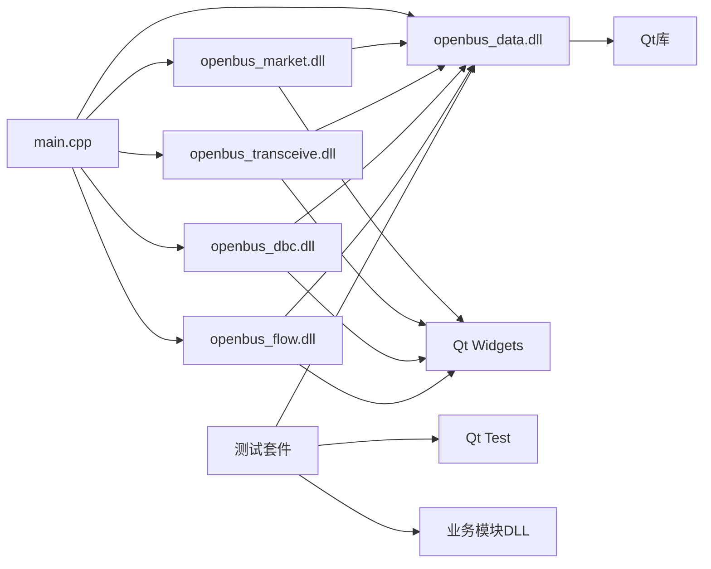

# 构建流程

<cite>
**本文引用的文件**   
- [CMakeLists.txt](file://CMakeLists.txt)
- [src/CMakeLists.txt](file://src/CMakeLists.txt)
- [src/main.cpp](file://src/main.cpp)
- [src/ui/mainwindow.h](file://src/ui/mainwindow.h)
- [src/ui/mainwindow.cpp](file://src/ui/mainwindow.cpp)
- [src/ui/marketmodule.h](file://src/ui/marketmodule.h)
- [src/ui/transceivemodule.h](file://src/ui/transceivemodule.h)
- [src/ui/dbcmodule.h](file://src/ui/dbcmodule.h)
- [src/ui/flowmodule.h](file://src/ui/flowmodule.h)
- [resources/resources.qrc](file://resources/resources.qrc)
- [scripts/build.py](file://scripts/build.py)
- [scripts/measure_build.py](file://scripts/measure_build.py)
- [tests/CMakeLists.txt](file://tests/CMakeLists.txt)
- [tests/test_canfileio.cpp](file://tests/test_canfileio.cpp)
- [doc/03-IMPLEMENTATION/构建基线.md](file://doc/03-IMPLEMENTATION/构建基线.md)
- [.tmp/pre_build_check.txt](file://.tmp/pre_build_check.txt)
</cite>

## 更新摘要
**所做更改**   
- 更新了构建系统架构，详细说明scripts/build.py的自动环境检测功能（Qt、MinGW、CMake）
- 增强了构建类型管理，支持Dev、Debug、Release、RelWithDebInfo等多种构建类型
- 新增增强的输出日志系统，所有构建输出自动保存到.tmp/logs/目录
- 完善了构建脚本功能，提供统一的构建工作流和错误诊断
- 更新了预构建检查系统和代码健康报告
- 增强了并行编译优化和增量构建性能改进

## 目录
1. [简介](#简介)
2. [项目结构](#项目结构)
3. [核心组件](#核心组件)
4. [架构总览](#架构总览)
5. [详细组件分析](#详细组件分析)
6. [模块化构建系统](#模块化构建系统)
7. [测试框架与执行](#测试框架与执行)
8. [构建性能优化](#构建性能优化)
9. [依赖分析](#依赖分析)
10. [性能考虑](#性能考虑)
11. [故障排查指南](#故障排查指南)
12. [结论](#结论)
13. [附录](#附录)

## 简介
本文件面向基于CMake的Qt桌面应用程序，系统化说明从项目初始化到生成可执行文件的完整构建流程。重点覆盖：
- CMake配置与生成过程
- Qt资源编译（qrc）
- MOC元对象代码生成
- UIC界面文件转换
- UI与业务逻辑的分离架构
- 模块化DLL构建系统，每个功能模块独立编译为动态库
- 增强的预编译头（PCH）优化
- 构建性能测量工具和分析
- 完整的测试框架集成，支持ctest统一执行
- **新增**：scripts/build.py的自动环境检测功能
- **新增**：改进的构建类型管理系统
- **新增**：增强的输出日志系统
- 调试与发布版本的差异、优化选项与性能分析配置
- 常见构建问题的诊断方法与解决方案

## 项目结构
该工程采用顶层CMakeLists与子模块分离的组织方式，体现了清晰的关注点分离原则：
- 顶层CMakeLists负责工程名、版本、Qt发现与全局设置
- src/CMakeLists定义多个共享库目标和可执行目标，实现模块化构建
- resources下包含Qt资源文件（qrc），用于打包样式与静态资源
- src/ui包含基于Qt Designer的界面文件（.ui）及对应的头/源文件，实现UI层独立管理
- src/main.cpp作为应用入口，协调各模块
- drivers目录包含驱动插件，每个驱动独立编译为DLL
- plugins目录包含Python插件，支持动态加载
- tests目录包含完整的测试套件，支持L1核心逻辑测试和L2 UI测试
- **.tmp/logs/** 目录存储所有构建过程的详细日志文件

**图表来源** 
- [CMakeLists.txt](file://CMakeLists.txt)
- [src/CMakeLists.txt](file://src/CMakeLists.txt)
- [tests/CMakeLists.txt](file://tests/CMakeLists.txt)
- [scripts/build.py](file://scripts/build.py)

**章节来源**
- [CMakeLists.txt](file://CMakeLists.txt)
- [src/CMakeLists.txt](file://src/CMakeLists.txt)
- [src/main.cpp](file://src/main.cpp)
- [tests/CMakeLists.txt](file://tests/CMakeLists.txt)

## 核心组件
- CMake构建系统：负责发现Qt、配置编译器、生成构建脚本与目标
- Qt自动化处理：
  - MOC：为含Q_OBJECT宏的头文件生成元对象代码
  - UIC：将.ui界面文件转换为C++头文件
  - RCC：将.qrc资源文件编译为C++源码并参与链接
- 模块化DLL架构：
  - openbus_data：公共底座DLL，包含core/models/utils和thememanager
  - openbus_market：插件市场业务DLL
  - openbus_transceive：收发业务DLL（发送/回放/离线分析/录制）
  - openbus_dbc：DBC业务DLL（详情页+信号清单工具）
  - openbus_flow：测量流程业务DLL（配置页+设备连接页）
- 增强的预编译头（PCH）：每个DLL使用精简的Qt头列表，显著提升编译速度
- 完整的测试框架：
  - L1核心逻辑测试：使用Qt Test框架，每个测试套件独立进程
  - L2 UI测试：无头模式下的UI驱动测试
  - ctest集成：统一的测试执行和管理
- **新增**：智能构建脚本系统：
  - scripts/build.py：统一的构建入口，支持自动环境检测
  - 自动检测Qt、MinGW、CMake安装路径
  - 支持多种构建类型：Dev、Debug、Release、RelWithDebInfo
  - 增强的输出日志系统，所有构建输出保存到.tmp/logs/
  - 预构建检查系统，生成代码健康报告
- 源代码组织：
  - src/main.cpp：应用入口，负责初始化各模块
  - src/ui/mainwindow.*：主窗口逻辑与界面绑定，体现UI层独立性
  - resources/resources.qrc：样式与资源打包
- 关注点分离：UI层与业务逻辑清晰分离，通过模块接口进行通信

**章节来源**
- [src/CMakeLists.txt](file://src/CMakeLists.txt)
- [src/main.cpp](file://src/main.cpp)
- [src/ui/marketmodule.h](file://src/ui/marketmodule.h)
- [src/ui/transceivemodule.h](file://src/ui/transceivemodule.h)
- [src/ui/dbcmodule.h](file://src/ui/dbcmodule.h)
- [src/ui/flowmodule.h](file://src/ui/flowmodule.h)
- [tests/CMakeLists.txt](file://tests/CMakeLists.txt)
- [scripts/build.py](file://scripts/build.py)

## 架构总览
下图展示从CMake配置到最终可执行文件的整体流程，包括模块化DLL架构、测试框架、Qt各工具的介入点和智能构建脚本的自动环境检测。

**图表来源** 
- [CMakeLists.txt](file://CMakeLists.txt)
- [src/CMakeLists.txt](file://src/CMakeLists.txt)
- [tests/CMakeLists.txt](file://tests/CMakeLists.txt)
- [scripts/build.py](file://scripts/build.py)

## 详细组件分析

### 智能构建脚本系统
**新增** scripts/build.py提供了强大的自动环境检测和构建管理功能：

#### 自动环境检测
- **Qt检测**：自动查找Qt安装路径，支持环境变量SIN_QT_DIR和QT_DIR
- **MinGW检测**：自动定位MinGW工具链，支持多个版本和安装位置
- **CMake检测**：智能搜索CMake安装路径，支持通配符匹配最新版本
- **Ninja检测**：优先使用Ninja构建系统，提升构建性能2-3倍

#### 构建类型管理
- **Dev构建类型**：使用-O1 -g1优化级别，适合日常开发快速迭代
- **Debug构建类型**：标准调试配置，包含完整调试信息
- **Release构建类型**：完全优化配置，用于生产部署
- **RelWithDebInfo构建类型**：优化配置加调试符号
- **MinSizeRel构建类型**：最小化二进制大小优化

#### 增强日志系统
- **自动日志记录**：所有构建输出保存到.tmp/logs/目录
- **时间戳命名**：日志文件按时间戳命名，便于追踪构建历史
- **详细输出**：包含完整的命令行、错误信息和警告
- **实时显示**：构建过程中实时显示进度和状态

**章节来源**
- [scripts/build.py:104-181](file://scripts/build.py#L104-L181)
- [scripts/build.py:229-303](file://scripts/build.py#L229-L303)
- [scripts/build.py:306-363](file://scripts/build.py#L306-L363)

### CMake配置与生成过程
- 顶层CMakeLists负责：
  - 设置工程名与版本
  - 查找Qt（通常使用FindQt或Qt6AutoMoc等机制）
  - 设置全局编译选项（如C++标准、编码、警告）
  - 启用测试框架（enable_testing()）
- 子模块CMakeLists负责：
  - 定义多个共享库目标（add_library SHARED）
  - 链接Qt库和第三方依赖
  - 启用Qt自动化处理（set(CMAKE_AUTOMOC ON; set(CMAKE_AUTOUIC ON); set(CMAKE_AUTORCC ON)）
  - 为每个DLL配置独立的预编译头（target_precompile_headers）
- 支持多平台构建和跨平台兼容性

关键点：
- AUTOMOC/AUTOUIC/AUTORCC会在构建时自动扫描头/源/资源，生成中间产物并参与编译链接
- 通过CMAKE_BUILD_TYPE控制Debug/Release/Dev，影响优化级别与调试符号
- 模块化构建支持增量编译和并行构建，大幅提升开发效率
- 测试框架集成，支持ctest统一管理测试用例

**章节来源**
- [CMakeLists.txt](file://CMakeLists.txt)
- [src/CMakeLists.txt](file://src/CMakeLists.txt)

### Qt资源编译（RCC）
- resources.qrc描述资源清单（路径映射、压缩、类别等）
- RCC在构建时读取qrc，生成C++源码（通常为qrc_*.cpp），由编译器编译并链接进可执行文件
- 优点：资源内嵌、跨平台一致、避免运行时路径问题
- 支持多种资源类型：图像、样式表、图标等

常见问题：
- 路径引用错误导致资源未找到
- qrc中路径大小写不一致（Windows不敏感，Linux敏感）
- 资源文件权限问题

**章节来源**
- [resources/resources.qrc](file://resources/resources.qrc)

### MOC处理（元对象代码生成）
- 当类声明中包含Q_OBJECT宏时，MOC会生成元对象实现（信号槽、属性、反射等）
- AUTOMOC会自动识别并生成moc_*.cpp，无需手动调用
- 若自定义基类或复杂继承关系，需确保头文件被正确包含且未被预编译头屏蔽
- 支持Qt的元对象系统特性

**章节来源**
- [src/ui/mainwindow.h](file://src/ui/mainwindow.h)
- [src/ui/mainwindow.cpp](file://src/ui/mainwindow.cpp)

### UIC界面文件转换
- .ui文件由Qt Designer生成，UIC将其转换为C++头文件（ui_*.h）
- AUTOUIC自动检测并生成，可在代码中通过Ui命名空间访问控件
- 修改.ui后需重新构建以触发UIC再生成
- 支持界面与逻辑分离的开发模式

**章节来源**
- [src/ui/mainwindow.ui](file://src/ui/mainwindow.ui)
- [src/ui/mainwindow.cpp](file://src/ui/mainwindow.cpp)

### 模块化DLL架构
项目已重构为模块化DLL架构，每个功能模块独立编译：

- **openbus_data.dll**：公共底座DLL
  - 包含core/models/utils和thememanager
  - 提供所有单例服务（AppConfig、DbcManager、PluginManager等）
  - 其他DLL通过PUBLIC依赖获得头文件路径

- **openbus_market.dll**：插件市场业务DLL
  - 包含markettab、marketmodel、marketmodule
  - 导出C工厂函数 `openbus_createMarketModule()`
  - 依赖openbus_data和Qt Widgets/Network/Svg

- **openbus_transceive.dll**：收发业务DLL
  - 包含signalsendtab、playbacktab、offlineanalysistab、recordtab
  - 导出C工厂函数 `openbus_createTransceiveModule()`
  - 支持多页面管理（pages()、createPage()）

- **openbus_dbc.dll**：DBC业务DLL
  - 包含dbcdetailtab、dbcsignallistview、dbcmodule
  - 导出C工厂函数 `openbus_createDbcModule()`
  - 支持多实例DBC文件打开

- **openbus_flow.dll**：测量流程业务DLL
  - 包含measurementsetupview、deviceconnectiontab、flowmodule
  - 导出C工厂函数 `openbus_createFlowModule()`
  - 管理测量配置和设备连接流程

**章节来源**
- [src/CMakeLists.txt](file://src/CMakeLists.txt)
- [src/ui/marketmodule.h](file://src/ui/marketmodule.h)
- [src/ui/transceivemodule.h](file://src/ui/transceivemodule.h)
- [src/ui/dbcmodule.h](file://src/ui/dbcmodule.h)
- [src/ui/flowmodule.h](file://src/ui/flowmodule.h)

## 模块化构建系统

### DLL依赖关系图

**图表来源** 
- [src/CMakeLists.txt](file://src/CMakeLists.txt)

### 预编译头（PCH）优化
每个DLL都配置了针对性的预编译头，显著减少编译时间：

- **openbus_data PCH**：精简Qt头（无Widget），仅包含基础QObject、QString、容器等
- **openbus_market PCH**：包含完整的Qt Widget头，适配市场页面的UI需求
- **openbus_transceive PCH**：针对收发四页面的Widget组合
- **openbus_dbc PCH**：以树/表Widget为主的界面组件
- **openbus_flow PCH**：包含QGraphicsScene/View等图形界面组件
- **openbus_ui PCH**：完整的Qt Widget头列表，供壳UI使用

### 构建脚本增强
提供了完善的构建脚本支持：

- **build.py**：统一的构建入口，支持configure、build、run、debug、clean、rebuild、deploy、test等命令
- **measure_build.py**：构建性能测量工具，支持场景化增量构建分析和基线记录
- 支持Dev构建类型（-O1 -g1），适合日常开发快速迭代
- 自动处理MinGW环境配置和工具链检测
- 增强的输出日志系统，所有构建输出保存到.tmp/logs/目录
- 预构建检查系统，生成代码健康报告

**章节来源**
- [src/CMakeLists.txt](file://src/CMakeLists.txt)
- [scripts/build.py](file://scripts/build.py)
- [scripts/measure_build.py](file://scripts/measure_build.py)

## 测试框架与执行

### 测试架构设计
项目实现了完整的分层测试框架：

- **L1 核心逻辑测试**：
  - 使用Qt Test框架，每个测试套件独立进程
  - 隔离core层进程级单例状态（DbcManager/PluginManager等）
  - 链接openbus_data共享DLL，测试exe输出到build/bin
  - 使用QTEST_GUILESS_MAIN，不加载平台插件

- **L2 UI测试**：
  - 无头模式下的UI驱动测试
  - 复刻main.cpp初始化链，驱动真实MainWindow
  - 链接壳UI静态库和4个业务模块DLL
  - 使用QT_QPA_PLATFORM=offscreen环境变量

### 测试套件分类
测试按功能模块分类：

- **B1 文件I/O测试**：TC-01/02/03/09/10/12/16/17、ST-01
- **B2 过滤引擎测试**：TF-01/02/03/04/13表达式语义部分
- **B3 Trace模型测试**：TC-11/12、PB-01、TF-07/11/12/15
- **B4 DBC解析测试**：DBC-01/02/03/04、TF-14
- **B5 采集录制回放测试**：SIM-01/02/03、REC-01/02、PLAY-01/02/03
- **B6 市场驱动测试**：MKT-01..06
- **B7 工程配置测试**：PRJ-01..06

### 测试执行流程
通过build.py test子命令统一执行：

**图表来源** 
- [scripts/build.py](file://scripts/build.py)
- [tests/CMakeLists.txt](file://tests/CMakeLists.txt)

### 并行编译优化
测试构建支持并行编译：

- 默认使用CPU核心数作为并行任务数
- 支持通过-j参数指定并行度
- 智能reconfigure：仅在CMakeLists.txt更新时重新配置
- 避免主程序无谓重链，只构建测试目标

**章节来源**
- [tests/CMakeLists.txt](file://tests/CMakeLists.txt)
- [scripts/build.py](file://scripts/build.py)
- [tests/test_canfileio.cpp](file://tests/test_canfileio.cpp)

## 构建性能优化

### 性能优化措施
项目采用了多项构建性能优化技术：

1. **Dev构建类型**：使用-O1 -g1优化级别，平衡编译速度和调试信息
2. **Thin Archive**：使用`ar qcT`替代传统`ar qc`，静态库重打包降为毫秒级
3. **模块化DLL**：每个功能模块独立编译，变更影响范围最小化
4. **预编译头（PCH）**：每个DLL使用精简的Qt头列表，减少重复编译
5. **Ninja构建系统**：优先使用Ninja，比MinGW Makefiles快2-3倍
6. **增量构建**：智能依赖追踪，仅重新编译变更文件
7. **并行编译**：支持多线程编译，充分利用多核CPU
8. **测试隔离**：测试构建不触发主程序重链，提升测试反馈速度
9. **智能环境检测**：自动配置工具链，减少手动配置错误

### 构建性能基线
根据实际测量结果，构建了详细的性能基线：

- **全量构建**：从约15.6分钟优化至328.3秒（5.5分钟）
- **UI变更构建**：从约14分钟优化至24.3秒
- **Core变更构建**：从约23分钟优化至28.7秒
- **exe链接时间**：从777.9秒优化至9.6秒（81倍提升）
- **静态库打包**：从513秒优化至3.3秒（155倍提升）
- **可执行文件大小**：从172MB优化至52MB（减少70%）

### 性能测量工具
提供了专门的构建性能测量工具：

- 支持四种场景：ui（UI文件变更）、core（核心文件变更）、clean（全量构建）、analyze（历史日志分析）
- 自动解析.ninja_log文件，提取各步骤耗时
- 关键步骤监控：openbus.exe、libopenbus_ui.a、libqcustomplot.a、各DLL链接
- 结果自动追加到doc/构建基线.md，保证优化前后可比性

### 预构建检查系统
**新增** 预构建检查系统提供代码质量保障：

- **中文字符检测**：确保代码中不包含中文字符
- **缺失头文件检测**：识别缺少必要Qt头文件的代码
- **代码健康报告**：生成详细的分析报告，指导代码改进
- **自动化检查**：在构建前自动执行，防止质量问题进入构建流程

**章节来源**
- [doc/03-IMPLEMENTATION/构建基线.md](file://doc/03-IMPLEMENTATION/构建基线.md)
- [scripts/measure_build.py](file://scripts/measure_build.py)
- [.tmp/pre_build_check.txt](file://.tmp/pre_build_check.txt)

## 依赖分析
- 外部依赖：
  - Qt框架（Widgets/Core/Gui/Network/Svg/Test等）
  - 编译器工具链（MSVC/GCC/Clang）
  - 构建系统（Ninja/Make）
  - 第三方库（zlib、pugixml、concurrentqueue等）
- 内部依赖：
  - main.cpp依赖各个业务DLL
  - 业务DLL依赖openbus_data公共底座
  - 资源依赖qrc中定义的路径与内容
  - 模块间通过C工厂接口解耦
  - 测试套件依赖openbus_data和对应业务模块

**图表来源** 
- [src/CMakeLists.txt](file://src/CMakeLists.txt)
- [tests/CMakeLists.txt](file://tests/CMakeLists.txt)

**章节来源**
- [src/CMakeLists.txt](file://src/CMakeLists.txt)
- [tests/CMakeLists.txt](file://tests/CMakeLists.txt)

## 性能考虑
- 构建性能：
  - 使用并行构建（Ninja默认支持）
  - 增量构建：仅重编译变更文件
  - 合理拆分源文件，减少单文件编译开销
  - 使用预编译头文件加速大型项目
  - 模块化DLL架构，变更影响范围最小化
  - Dev构建类型，适合日常开发快速迭代
  - 测试构建优化，避免主程序重链
  - **新增**：智能环境检测，减少配置错误
  - **新增**：增强日志系统，便于问题诊断
- 运行性能：
  - Release模式开启优化（-O2/-O3）
  - 资源压缩（qrc中可选压缩）
  - 避免不必要的信号槽连接与频繁UI刷新
  - 懒加载大资源文件
  - DLL按需加载，减少初始内存占用
- 性能分析：
  - Windows：VS Profiler / perfmon
  - Linux：perf / valgrind
  - Qt：QTimer/QElapsedTimer进行关键路径计时
  - 内存分析工具集成
  - 构建性能测量工具，持续跟踪优化效果
  - 测试性能基准，监控回归问题

## 故障排查指南
常见问题与解决思路：
- 依赖缺失
  - 现象：找不到Qt库或头文件
  - 排查：确认Qt安装路径、环境变量、CMake是否成功find_package
  - 解决：指定Qt根路径或使用vcpkg/conan管理依赖
  - **新增**：使用build.py的自动环境检测功能，减少手动配置错误
- 路径错误
  - 现象：资源加载失败、.ui无法生成
  - 排查：检查qrc路径大小写、相对路径基准、CMake中的源集定义
  - 解决：统一路径风格，必要时使用绝对路径或变量
- 编译失败
  - 现象：MOC/UIC/RCC报错、链接错误
  - 排查：查看生成目录下的moc_uic_rcc日志；确认头文件包含顺序与宏定义
  - 解决：清理构建目录（rm -rf build）、重新生成；检查C++标准与Qt版本匹配
  - **新增**：检查.tmp/logs/目录下的详细构建日志
  - **新增**：模块化DLL相关错误，检查DLL依赖是否正确链接
- 调试与发布差异
  - 现象：Release崩溃但Debug正常
  - 排查：检查未初始化变量、越界访问、优化导致的代码重排
  - 解决：使用AddressSanitizer/UBsan定位问题
- UI相关错误
  - 现象：界面显示异常、控件无法访问
  - 排查：检查.ui文件语法、控件名称一致性、信号槽连接
  - 解决：重新生成UI文件、验证控件ID
- **新增**：DLL相关问题
  - 现象：模块加载失败、符号未找到
  - 排查：检查DLL导出函数、依赖DLL是否正确部署
  - 解决：确认C工厂函数命名规范、检查模块依赖关系
- **新增**：测试相关问题
  - 现象：测试套件无法运行、ctest执行失败
  - 排查：检查Qt Test库是否正确部署、测试数据文件是否存在
  - 解决：确保windeployqt部署Qt6Test.dll、检查SIN_SOURCE_DIR宏定义
  - **新增**：并行编译问题
  - 现象：多线程编译不稳定、随机性失败
  - 排查：检查测试套件间的资源竞争、单例状态污染
  - 解决：降低并行度、增加测试隔离、修复竞态条件
- **新增**：环境检测问题
  - 现象：自动环境检测失败
  - 排查：检查环境变量SIN_QT_DIR、SIN_MINGW_DIR、SIN_CMAKE_DIR设置
  - 解决：手动指定路径或使用默认安装位置
- **新增**：日志文件问题
  - 现象：构建日志缺失或损坏
  - 排查：检查.tmp/logs/目录权限和磁盘空间
  - 解决：清理旧日志文件、确保足够的存储空间

**章节来源**
- [CMakeLists.txt](file://CMakeLists.txt)
- [src/CMakeLists.txt](file://src/CMakeLists.txt)
- [resources/resources.qrc](file://resources/resources.qrc)
- [tests/CMakeLists.txt](file://tests/CMakeLists.txt)
- [scripts/build.py](file://scripts/build.py)

## 结论
本项目已成功重构为模块化DLL架构，通过CMake构建系统和Qt自动化处理实现了高效的构建流程。主要改进包括：

1. **模块化DLL架构**：将单体应用拆分为多个独立DLL，每个功能模块独立编译和部署
2. **增强的预编译头**：为每个DLL配置针对性的PCH，显著提升编译速度
3. **构建性能优化**：通过Dev构建类型、thin archive、Ninja构建系统等手段，大幅缩短构建时间
4. **完善的工具链**：提供了统一的构建脚本和性能测量工具，支持持续优化
5. **完整的测试框架**：实现了分层测试体系，支持L1核心逻辑测试和L2 UI测试，通过ctest统一管理
6. **并行编译优化**：支持多线程编译和增量构建，提升开发效率
7. **智能环境检测**：自动检测Qt、MinGW、CMake等工具链，减少手动配置错误
8. **增强日志系统**：所有构建输出自动保存到.tmp/logs/目录，便于问题诊断
9. **预构建检查**：自动生成代码健康报告，提前发现潜在问题

遇到问题时，优先检查依赖、路径与生成日志，逐步定位并修复。模块化架构使得问题隔离更加容易，单个模块的故障不会影响整个应用的构建。测试框架的引入确保了代码质量，通过自动化测试及时发现回归问题。智能构建脚本和环境检测功能大大简化了开发环境的配置和维护。

## 附录
- 常用命令参考（示例）：
  - 配置：cmake -B build -DCMAKE_BUILD_TYPE=Dev|Debug|Release
  - 构建：cmake --build build --config Debug|Release
  - 清理：删除build目录后重新生成
  - 调试：cmake --build build --target debug
  - **新增**：性能测量：python scripts/measure_build.py --scenario all
  - **新增**：构建脚本：python scripts/build.py configure --build-type Dev
  - **新增**：测试执行：python scripts/build.py test -j8
  - **新增**：ctest直接执行：ctest --test-dir build --output-on-failure
  - **新增**：查看日志：ls -la .tmp/logs/ | tail -n 10
- 相关文档：
  - README.en.md提供项目背景与使用说明
  - doc/构建基线.md记录详细的性能基线和优化历程
  - **新增**：.tmp/pre_build_check.txt显示代码健康检查结果
- 最佳实践：
  - 保持UI层简洁，业务逻辑独立
  - 合理使用Qt自动化功能
  - 定期清理构建缓存
  - 使用版本控制管理构建配置
  - 遵循模块化设计原则，新功能优先考虑独立DLL
  - 使用Dev构建类型进行日常开发，Release用于发布
  - 编写单元测试，通过ctest验证功能正确性
  - 利用并行编译和增量构建，提升开发效率
  - **新增**：使用build.py进行构建，享受自动环境检测优势
  - **新增**：定期检查.tmp/logs/目录，分析构建性能趋势
  - **新增**：关注预构建检查报告，及时修复代码质量问题

**章节来源**
- [README.en.md](file://README.en.md)
- [doc/03-IMPLEMENTATION/构建基线.md](file://doc/03-IMPLEMENTATION/构建基线.md)
- [scripts/build.py](file://scripts/build.py)
- [scripts/measure_build.py](file://scripts/measure_build.py)
- [tests/CMakeLists.txt](file://tests/CMakeLists.txt)
- [.tmp/pre_build_check.txt](file://.tmp/pre_build_check.txt)