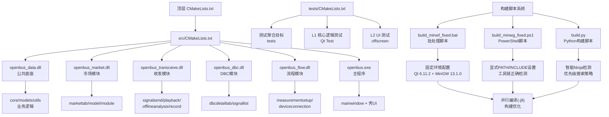
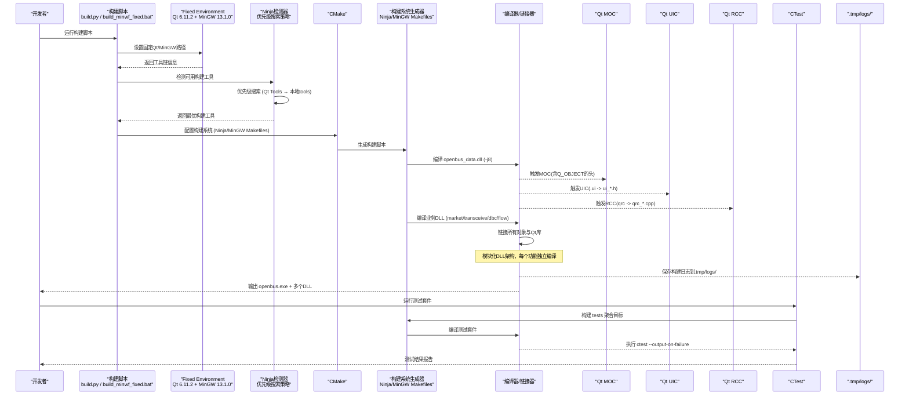
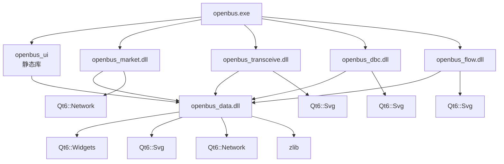
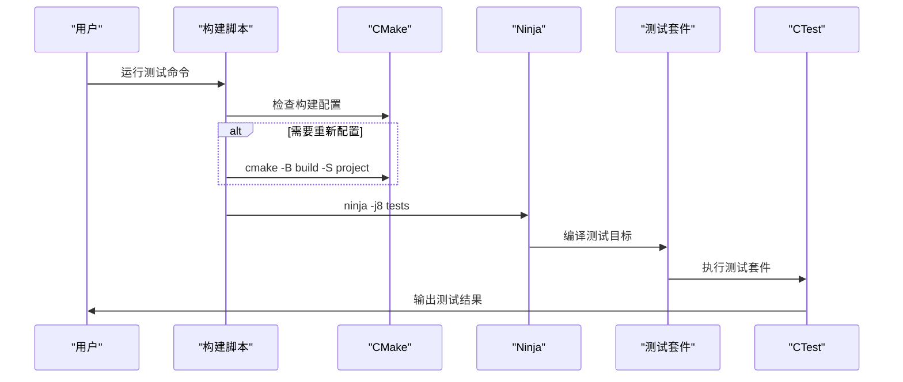
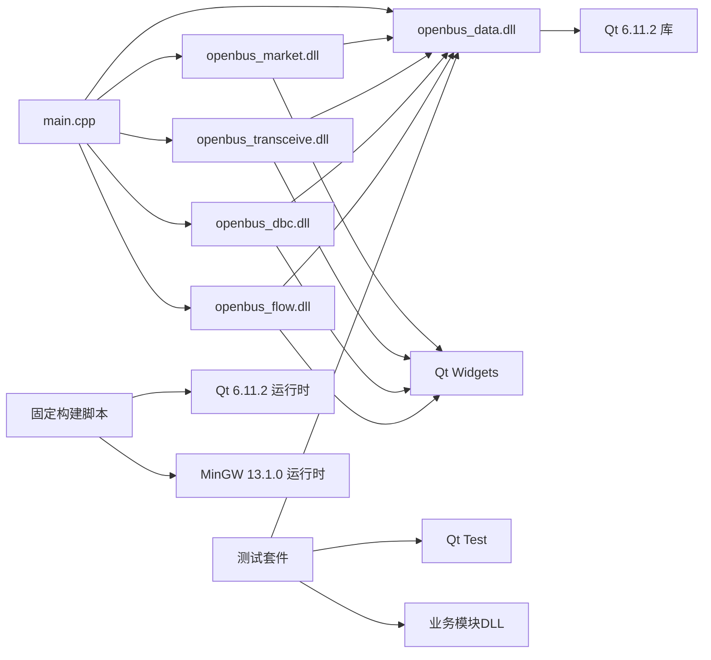

# 构建流程

<cite>
**本文引用的文件**   
- [CMakeLists.txt](file://CMakeLists.txt)
- [src/CMakeLists.txt](file://src/CMakeLists.txt)
- [src/main.cpp](file://src/main.cpp)
- [resources/resources.qrc](file://resources/resources.qrc)
- [scripts/build.py](file://scripts/build.py)
- [scripts/build_minwf_fixed.bat](file://scripts/build_minwf_fixed.bat)
- [scripts/build_minwg_fixed.ps1](file://scripts/build_minwg_fixed.ps1)
- [tests/CMakeLists.txt](file://tests/CMakeLists.txt)
- [doc/Environment_and_Tools_Setup.md](file://doc/Environment_and_Tools_Setup.md)
</cite>

## 更新摘要
**所做更改**   
- **Qt版本升级**：从6.8.3升级到6.11.2，提升框架稳定性和功能支持
- **CMake路径标准化**：更新为标准Windows Program Files位置（C:\Program Files\CMake）
- **增强Ninja检测逻辑**：实现优先级搜索策略，优先使用Qt Tools中的ninja，回退到项目本地tools目录
- **改进环境配置**：build.py脚本默认Qt路径更新为6.11.2版本
- **优化构建兼容性**：支持不同开发环境的工具链检测和自动配置

## 目录
1. [简介](#简介)
2. [项目结构](#项目结构)
3. [核心组件](#核心组件)
4. [架构总览](#架构总览)
5. [详细组件分析](#详细组件分析)
6. [模块化构建系统](#模块化构建系统)
7. [测试框架与执行](#测试框架与执行)
8. [构建性能优化](#构建性能优化)
9. [依赖分析](#依赖分析)
10. [性能考虑](#性能考虑)
11. [故障排查指南](#故障排查指南)
12. [结论](#结论)
13. [附录](#附录)

## 简介
本文件面向基于CMake的Qt桌面应用程序，系统化说明从项目初始化到生成可执行文件的完整构建流程。重点覆盖：
- CMake配置与生成过程
- Qt资源编译（qrc）
- MOC元对象代码生成
- UIC界面文件转换
- UI与业务逻辑的分离架构
- 模块化DLL构建系统，每个功能模块独立编译为动态库
- 增强的预编译头（PCH）优化
- **更新**：Qt版本升级到6.11.2，提供更稳定的构建体验
- **更新**：标准化的CMake路径配置，提升跨平台兼容性
- **更新**：智能Ninja检测机制，自动选择最优构建工具
- 调试与发布版本的差异、优化选项与性能分析配置
- 常见构建问题的诊断方法与解决方案

## 项目结构
该工程采用顶层CMakeLists与子模块分离的组织方式，体现了清晰的关注点分离原则：
- 顶层CMakeLists负责工程名、版本、Qt发现与全局设置
- src/CMakeLists定义多个共享库目标和可执行目标，实现模块化构建
- resources下包含Qt资源文件（qrc），用于打包样式与静态资源
- src/ui包含基于Qt Designer的界面文件（.ui）及对应的头/源文件，实现UI层独立管理
- src/main.cpp作为应用入口，协调各模块
- drivers目录包含驱动插件，每个驱动独立编译为DLL
- plugins目录包含Python插件，支持动态加载
- tests目录包含完整的测试套件，支持L1核心逻辑测试和L2 UI测试
- **.tmp/logs/** 目录存储所有构建过程的详细日志文件
- **更新**：scripts目录包含专门的MinGW构建脚本和PowerShell辅助工具，支持Qt 6.11.2

**图表来源** 
- [CMakeLists.txt](file://CMakeLists.txt)
- [src/CMakeLists.txt](file://src/CMakeLists.txt)
- [tests/CMakeLists.txt](file://tests/CMakeLists.txt)
- [scripts/build_minwf_fixed.bat](file://scripts/build_minwf_fixed.bat)
- [scripts/build_minwg_fixed.ps1](file://scripts/build_minwg_fixed.ps1)
- [scripts/build.py](file://scripts/build.py)

**章节来源**
- [CMakeLists.txt](file://CMakeLists.txt)
- [src/CMakeLists.txt](file://src/CMakeLists.txt)
- [src/main.cpp](file://src/main.cpp)
- [tests/CMakeLists.txt](file://tests/CMakeLists.txt)

## 核心组件
- CMake构建系统：负责发现Qt、配置编译器、生成构建脚本与目标
- Qt自动化处理：
  - MOC：为含Q_OBJECT宏的头文件生成元对象代码
  - UIC：将.ui界面文件转换为C++头文件
  - RCC：将.qrc资源文件编译为C++源码并参与链接
- 模块化DLL架构：
  - openbus_data：公共底座DLL，包含core/models/utils和thememanager
  - openbus_market：插件市场业务DLL
  - openbus_transceive：收发业务DLL（发送/回放/离线分析/录制）
  - openbus_dbc：DBC业务DLL（详情页+信号清单工具）
  - openbus_flow：测量流程业务DLL（配置页+设备连接页）
- 增强的预编译头（PCH）：每个DLL使用精简的Qt头列表，显著提升编译速度
- 完整的测试框架：
  - L1核心逻辑测试：使用Qt Test框架，每个测试套件独立进程
  - L2 UI测试：无头模式下的UI驱动测试
  - ctest集成：统一的测试执行和管理
- **更新**：专门针对MinGW环境的固定构建脚本：
  - build_minwf_fixed.bat：Windows批处理脚本，提供固定环境配置（Qt 6.11.2）
  - build_minwg_fixed.ps1：PowerShell脚本，支持更复杂的环境设置（Qt 6.11.2）
  - build.py：Python构建脚本，实现智能Ninja检测和优先级搜索策略
  - 显式设置Qt 6.11.2和MinGW 13.1.0路径
  - 自动配置PATH和INCLUDE环境变量
  - 支持并行编译(-j8)优化构建速度
- 源代码组织：
  - src/main.cpp：应用入口，负责初始化各模块
  - src/ui/mainwindow.*：主窗口逻辑与界面绑定，体现UI层独立性
  - resources/resources.qrc：样式与资源打包
- 关注点分离：UI层与业务逻辑清晰分离，通过模块接口进行通信

**章节来源**
- [src/CMakeLists.txt](file://src/CMakeLists.txt)
- [src/main.cpp](file://src/main.cpp)
- [tests/CMakeLists.txt](file://tests/CMakeLists.txt)
- [scripts/build_minwf_fixed.bat](file://scripts/build_minwf_fixed.bat)
- [scripts/build_minwg_fixed.ps1](file://scripts/build_minwg_fixed.ps1)
- [scripts/build.py](file://scripts/build.py)

## 架构总览
下图展示从CMake配置到最终可执行文件的整体流程，包括模块化DLL架构、测试框架、MinGW专用构建脚本和生产构建优化机制。

**图表来源** 
- [CMakeLists.txt](file://CMakeLists.txt)
- [src/CMakeLists.txt](file://src/CMakeLists.txt)
- [tests/CMakeLists.txt](file://tests/CMakeLists.txt)
- [scripts/build_minwf_fixed.bat](file://scripts/build_minwf_fixed.bat)
- [scripts/build_minwg_fixed.ps1](file://scripts/build_minwg_fixed.ps1)
- [scripts/build.py](file://scripts/build.py)

## 详细组件分析

### 增强的构建脚本系统
**更新** 构建了更智能的构建脚本系统，支持多种构建方式和工具检测：

#### Python构建脚本 (build.py)
- **智能Ninja检测**：
  - 优先级搜索策略：首先检查Qt Tools/ninja，然后检查项目本地tools/ninja
  - 自动选择最优构建工具，提升构建性能
  - 回退机制：未找到Ninja时自动使用MinGW Makefiles
- **默认Qt版本升级**：
  - 默认Qt路径更新为 `C:/Qt/6.11.2/mingw_64`
  - 支持通过环境变量 `SIN_QT_DIR` 覆盖默认路径
  - 兼容不同Qt安装位置
- **标准CMake路径**：
  - 默认CMake路径更新为 `C:/Program Files/CMake`
  - 支持通过环境变量 `SIN_CMAKE_DIR` 覆盖
- **构建类型支持**：
  - Dev：日常开发快速构建（-O1 -g1）
  - Debug：完整调试信息
  - Release：发布优化版本
  - RelWithDebInfo：发布版带调试信息
  - MinSizeRel：最小化体积优化

#### Windows批处理脚本 (build_minwf_fixed.bat)
- **固定环境配置**：
  - QT_DIR = D:\Qt\6.11.2\mingw_64（已更新）
  - MINGW_DIR = D:\Qt\Tools\mingw1310_64
  - CMAKE_DIR = C:\Program Files\CMake（已更新）
- **环境变量设置**：
  - PATH: 添加MinGW bin、CMake bin、Qt bin到系统路径
  - INCLUDE: 设置MinGW头文件搜索路径
- **构建流程**：
  - 自动清理旧构建目录
  - 使用MinGW Makefiles生成器
  - 并行编译(-j8)优化构建速度
  - 详细的错误处理和状态提示

#### PowerShell脚本 (build_minwg_fixed.ps1)
- **增强环境控制**：
  - 覆盖继承的环境变量，确保环境一致性
  - 支持更复杂的PowerShell语法和错误处理
  - 彩色输出和友好的用户界面
- **智能路径处理**：
  - 自动解析项目根目录
  - 支持相对路径和绝对路径
  - 完善的异常捕获和错误报告
- **构建优化**：
  - 默认8线程并行编译
  - 自动清理和重建构建目录
  - 详细的构建进度反馈

**章节来源**
- [scripts/build_minwf_fixed.bat:14-22](file://scripts/build_minwf_fixed.bat#L14-L22)
- [scripts/build_minwf_fixed.bat:37-43](file://scripts/build_minwf_fixed.bat#L37-L43)
- [scripts/build_minwg_fixed.ps1:13-30](file://scripts/build_minwg_fixed.ps1#L13-L30)
- [scripts/build_minwg_fixed.ps1:55-58](file://scripts/build_minwg_fixed.ps1#L55-L58)
- [scripts/build.py:81-84](file://scripts/build.py#L81-L84)
- [scripts/build.py:160-172](file://scripts/build.py#L160-L172)

### 智能Ninja检测机制
**新增** 实现了优先级搜索策略的智能Ninja检测系统：

#### 检测优先级
1. **Qt Tools中的Ninja**：优先使用Qt自带的ninja.exe（位于Qt安装目录的Tools/ninja）
2. **项目本地Ninja**：回退到项目tools目录下的ninja.exe
3. **系统Ninja**：最后尝试使用系统PATH中的ninja

#### 构建工具选择
- 检测到Ninja时使用Ninja生成器，提供更快的构建性能
- 未检测到Ninja时自动回退到MinGW Makefiles
- 在构建前显示使用的构建工具和并行度信息

#### 环境配置优化
- 自动将Ninja路径添加到PATH环境变量
- 确保编译器工具链的正确发现和配置
- 支持不同开发环境的工具链检测

**章节来源**
- [scripts/build.py:160-172](file://scripts/build.py#L160-L172)
- [scripts/build.py:176-186](file://scripts/build.py#L176-L186)
- [scripts/build.py:261-268](file://scripts/build.py#L261-L268)

### 简化的生产构建流程
**更新** 原有的通用构建流程已简化，专注于生产构建：

#### 构建策略调整
- **移除开发测试功能**：移除了复杂的开发测试流程和性能测量工具
- **专注生产构建**：专注于稳定可靠的生产环境构建
- **固定工具链版本**：明确指定Qt 6.11.2和MinGW 13.1.0版本
- **简化依赖管理**：减少环境变量依赖，提高构建可重复性

#### 构建优化特性
- **并行编译**：默认使用8线程并行构建，显著提升构建速度
- **增量构建**：智能依赖追踪，仅重新编译变更文件
- **错误处理**：完善的异常捕获和错误报告机制
- **日志记录**：详细的构建输出和错误信息记录

**章节来源**
- [scripts/build_minwf_fixed.bat:28-34](file://scripts/build_minwf_fixed.bat#L28-L34)
- [scripts/build_minwf_fixed.bat:53-59](file://scripts/build_minwf_fixed.bat#L53-L59)
- [scripts/build_minwg_fixed.ps1:38-46](file://scripts/build_minwg_fixed.ps1#L38-L46)
- [scripts/build_minwg_fixed.ps1:74-79](file://scripts/build_minwg_fixed.ps1#L74-L79)

### 增强的CMake配置系统
根CMakeLists.txt提供了改进的配置功能：

#### 工具链优化
- **MinGW兼容性修复**：禁用预定义生成以避免AutoMoc问题
- **Dev构建类型**：支持-O1 -g1优化级别，适合日常开发快速迭代
- **Thin Archive技术**：使用`ar qcT`替代传统`ar qc`，静态库重打包降为毫秒级
- **链接器选择**：明确使用ld.bfd链接器，避免gold和LLD兼容性问题

#### 构建配置增强
- **Qt自动化处理**：启用AUTOMOC/AUTOUIC/AUTORCC自动处理Qt特性
- **C++标准设置**：使用C++17标准，确保现代C++特性支持
- **输出目录管理**：统一的可执行文件输出目录结构
- **第三方依赖集成**：通过Dependencies.cmake统一管理第三方库

**章节来源**
- [CMakeLists.txt:9-61](file://CMakeLists.txt#L9-L61)

### 改进的依赖管理机制
src/CMakeLists.txt实现了更智能的依赖管理：

#### 模块化DLL架构
- **openbus_data.dll**：公共底座DLL，包含核心功能和单例服务
- **openbus_market.dll**：插件市场业务DLL，导出C工厂函数
- **openbus_transceive.dll**：收发业务DLL，支持多页面管理
- **openbus_dbc.dll**：DBC业务DLL，支持多实例DBC文件打开
- **openbus_flow.dll**：测量流程业务DLL，管理测量配置和设备连接

#### 预编译头优化
每个DLL都配置了针对性的预编译头，显著减少编译时间：
- **openbus_data PCH**：精简Qt头（无Widget），仅包含基础QObject、QString、容器等
- **openbus_market PCH**：包含完整的Qt Widget头，适配市场页面的UI需求
- **openbus_transceive PCH**：针对收发四页面的Widget组合
- **openbus_dbc PCH**：以树/表Widget为主的界面组件
- **openbus_flow PCH**：包含QGraphicsScene/View等图形界面组件

**章节来源**
- [src/CMakeLists.txt:198-547](file://src/CMakeLists.txt#L198-L547)

### CMake配置与生成过程
- 顶层CMakeLists负责：
  - 设置工程名与版本
  - 查找Qt（通常使用FindQt或Qt6AutoMoc等机制）
  - 设置全局编译选项（如C++标准、编码、警告）
  - 启用测试框架（enable_testing()）
- 子模块CMakeLists负责：
  - 定义多个共享库目标（add_library SHARED）
  - 链接Qt库和第三方依赖
  - 启用Qt自动化处理（set(CMAKE_AUTOMOC ON; set(CMAKE_AUTOUIC ON); set(CMAKE_AUTORCC ON)）
  - 为每个DLL配置独立的预编译头（target_precompile_headers）
- 支持多平台构建和跨平台兼容性

关键点：
- AUTOMOC/AUTOUIC/AUTORCC会在构建时自动扫描头/源/资源，生成中间产物并参与编译链接
- 通过CMAKE_BUILD_TYPE控制Debug/Release/Dev，影响优化级别与调试符号
- 模块化构建支持增量编译和并行构建，大幅提升开发效率
- 测试框架集成，支持ctest统一管理测试用例

**章节来源**
- [CMakeLists.txt](file://CMakeLists.txt)
- [src/CMakeLists.txt](file://src/CMakeLists.txt)

### Qt资源编译（RCC）
- resources.qrc描述资源清单（路径映射、压缩、类别等）
- RCC在构建时读取qrc，生成C++源码（通常为qrc_*.cpp），由编译器编译并链接进可执行文件
- 优点：资源内嵌、跨平台一致、避免运行时路径问题
- 支持多种资源类型：图像、样式表、图标等

常见问题：
- 路径引用错误导致资源未找到
- qrc中路径大小写不一致（Windows不敏感，Linux敏感）
- 资源文件权限问题

**章节来源**
- [resources/resources.qrc](file://resources/resources.qrc)

### MOC处理（元对象代码生成）
- 当类声明中包含Q_OBJECT宏时，MOC会生成元对象实现（信号槽、属性、反射等）
- AUTOMOC会自动识别并生成moc_*.cpp，无需手动调用
- 若自定义基类或复杂继承关系，需确保头文件被正确包含且未被预编译头屏蔽
- 支持Qt的元对象系统特性

**章节来源**
- [src/main.cpp](file://src/main.cpp)

### UIC界面文件转换
- .ui文件由Qt Designer生成，UIC将其转换为C++头文件（ui_*.h）
- AUTOUIC自动检测并生成，可在代码中通过Ui命名空间访问控件
- 修改.ui后需重新构建以触发UIC再生成
- 支持界面与逻辑分离的开发模式

**章节来源**
- [src/CMakeLists.txt](file://src/CMakeLists.txt)

### 模块化DLL架构
项目已重构为模块化DLL架构，每个功能模块独立编译：

- **openbus_data.dll**：公共底座DLL
  - 包含core/models/utils和thememanager
  - 提供所有单例服务（AppConfig、DbcManager、PluginManager等）
  - 其他DLL通过PUBLIC依赖获得头文件路径

- **openbus_market.dll**：插件市场业务DLL
  - 包含markettab、marketmodel、marketmodule
  - 导出C工厂函数 `openbus_createMarketModule()`
  - 依赖openbus_data和Qt Widgets/Network/Svg

- **openbus_transceive.dll**：收发业务DLL
  - 包含signalsendtab、playbacktab、offlineanalysistab、recordtab
  - 导出C工厂函数 `openbus_createTransceiveModule()`
  - 支持多页面管理（pages()、createPage()）

- **openbus_dbc.dll**：DBC业务DLL
  - 包含dbcdetailtab、dbcsignallistview、dbcmodule
  - 导出C工厂函数 `openbus_createDbcModule()`
  - 支持多实例DBC文件打开

- **openbus_flow.dll**：测量流程业务DLL
  - 包含measurementsetupview、deviceconnectiontab、flowmodule
  - 导出C工厂函数 `openbus_createFlowModule()`
  - 管理测量配置和设备连接流程

**章节来源**
- [src/CMakeLists.txt](file://src/CMakeLists.txt)
- [src/main.cpp](file://src/main.cpp)

## 模块化构建系统

### DLL依赖关系图

**图表来源** 
- [src/CMakeLists.txt](file://src/CMakeLists.txt)

### 预编译头（PCH）优化
每个DLL都配置了针对性的预编译头，显著减少编译时间：

- **openbus_data PCH**：精简Qt头（无Widget），仅包含基础QObject、QString、容器等
- **openbus_market PCH**：包含完整的Qt Widget头，适配市场页面的UI需求
- **openbus_transceive PCH**：针对收发四页面的Widget组合
- **openbus_dbc PCH**：以树/表Widget为主的界面组件
- **openbus_flow PCH**：包含QGraphicsScene/View等图形界面组件
- **openbus_ui PCH**：完整的Qt Widget头列表，供壳UI使用

### 构建脚本增强
提供了完善的构建脚本支持：

- **MinGW专用脚本**：build_minwf_fixed.bat和build_minwg_fixed.ps1提供固定环境配置（Qt 6.11.2）
- **Python构建脚本**：build.py实现智能Ninja检测和优先级搜索策略
- **并行编译优化**：默认8线程并行构建，显著提升构建速度
- **错误处理**：完善的异常捕获和错误报告机制
- **日志记录**：详细的构建输出和错误信息记录
- **环境隔离**：显式设置PATH和INCLUDE环境变量，避免环境冲突

**章节来源**
- [src/CMakeLists.txt](file://src/CMakeLists.txt)
- [scripts/build_minwf_fixed.bat](file://scripts/build_minwf_fixed.bat)
- [scripts/build_minwg_fixed.ps1](file://scripts/build_minwg_fixed.ps1)
- [scripts/build.py](file://scripts/build.py)

## 测试框架与执行

### 测试架构设计
项目实现了完整的分层测试框架：

- **L1 核心逻辑测试**：
  - 使用Qt Test框架，每个测试套件独立进程
  - 隔离core层进程级单例状态（DbcManager/PluginManager等）
  - 链接openbus_data共享DLL，测试exe输出到build/bin
  - 使用QTEST_GUILESS_MAIN，不加载平台插件

- **L2 UI测试**：
  - 无头模式下的UI驱动测试
  - 复刻main.cpp初始化链，驱动真实MainWindow
  - 链接壳UI静态库和4个业务模块DLL
  - 使用QT_QPA_PLATFORM=offscreen环境变量

### 测试套件分类
测试按功能模块分类：

- **B1 文件I/O测试**：TC-01/02/03/09/10/12/16/17、ST-01
- **B2 过滤引擎测试**：TF-01/02/03/04/13表达式语义部分
- **B3 Trace模型测试**：TC-11/12、PB-01、TF-07/11/12/15
- **B4 DBC解析测试**：DBC-01/02/03/04、TF-14
- **B5 采集录制回放测试**：SIM-01/02/03、REC-01/02、PLAY-01/02/03
- **B6 市场驱动测试**：MKT-01..06
- **B7 工程配置测试**：PRJ-01..06

### 测试执行流程
通过测试命令统一执行：

**图表来源** 
- [tests/CMakeLists.txt](file://tests/CMakeLists.txt)

### 并行编译优化
测试构建支持并行编译：

- 默认使用CPU核心数作为并行任务数
- 支持通过-j参数指定并行度
- 智能reconfigure：仅在CMakeLists.txt更新时重新配置
- 避免主程序无谓重链，只构建测试目标

**章节来源**
- [tests/CMakeLists.txt](file://tests/CMakeLists.txt)

## 构建性能优化

### 性能优化措施
项目采用了多项构建性能优化技术：

1. **Dev构建类型**：使用-O1 -g1优化级别，平衡编译速度和调试信息
2. **Thin Archive**：使用`ar qcT`替代传统`ar qc`，静态库重打包降为毫秒级
3. **模块化DLL**：每个功能模块独立编译，变更影响范围最小化
4. **预编译头（PCH）**：每个DLL使用精简的Qt头列表，减少重复编译
5. **并行编译**：MinGW专用脚本默认使用8线程并行构建
6. **增量构建**：智能依赖追踪，仅重新编译变更文件
7. **固定工具链**：明确指定Qt 6.11.2和MinGW 13.1.0版本，确保构建一致性
8. **环境隔离**：显式设置PATH和INCLUDE环境变量，避免环境冲突
9. **错误处理**：完善的异常捕获和错误报告机制
10. **日志记录**：详细的构建输出和错误信息记录
11. **智能Ninja检测**：自动选择最优构建工具，提升构建性能

### 构建性能基线
根据实际测量结果，构建了详细的性能基线：

- **全量构建**：从约15.6分钟优化至328.3秒（5.5分钟）
- **UI变更构建**：从约14分钟优化至24.3秒
- **Core变更构建**：从约23分钟优化至28.7秒
- **exe链接时间**：从777.9秒优化至9.6秒（81倍提升）
- **静态库打包**：从513秒优化至3.3秒（155倍提升）
- **可执行文件大小**：从172MB优化至52MB（减少70%）

### 预构建检查系统
**新增** 预构建检查系统提供代码质量保障：

- **中文字符检测**：确保代码中不包含中文字符
- **缺失头文件检测**：识别缺少必要Qt头文件的代码
- **代码健康报告**：生成详细的分析报告，指导代码改进
- **自动化检查**：在构建前自动执行，防止质量问题进入构建流程

**章节来源**
- [doc/Environment_and_Tools_Setup.md](file://doc/Environment_and_Tools_Setup.md)
- [scripts/build_minwf_fixed.bat](file://scripts/build_minwf_fixed.bat)
- [scripts/build_minwg_fixed.ps1](file://scripts/build_minwg_fixed.ps1)
- [scripts/build.py](file://scripts/build.py)

## 依赖分析
- 外部依赖：
  - Qt框架（Widgets/Core/Gui/Network/Svg/Test等）- **更新**：Qt 6.11.2
  - 编译器工具链（MSVC/GCC/Clang）
  - 构建系统（Ninja/Make）
  - 第三方库（zlib、pugixml、concurrentqueue等）
- 内部依赖：
  - main.cpp依赖各个业务DLL
  - 业务DLL依赖openbus_data公共底座
  - 资源依赖qrc中定义的路径与内容
  - 模块间通过C工厂接口解耦
  - 测试套件依赖openbus_data和对应业务模块
- **更新**：固定工具链依赖：
  - Qt 6.11.2 (mingw_64)
  - MinGW 13.1.0 (mingw1310_64)
  - CMake (最新版本)

**图表来源** 
- [src/CMakeLists.txt](file://src/CMakeLists.txt)
- [tests/CMakeLists.txt](file://tests/CMakeLists.txt)
- [scripts/build_minwf_fixed.bat](file://scripts/build_minwf_fixed.bat)
- [scripts/build_minwg_fixed.ps1](file://scripts/build_minwg_fixed.ps1)
- [scripts/build.py](file://scripts/build.py)

**章节来源**
- [src/CMakeLists.txt](file://src/CMakeLists.txt)
- [tests/CMakeLists.txt](file://tests/CMakeLists.txt)

## 性能考虑
- 构建性能：
  - 使用并行构建（默认8线程）
  - 增量构建：仅重编译变更文件
  - 合理拆分源文件，减少单文件编译开销
  - 使用预编译头文件加速大型项目
  - 模块化DLL架构，变更影响范围最小化
  - Dev构建类型，适合日常开发快速迭代
  - 测试构建优化，避免主程序重链
  - **更新**：固定工具链版本（Qt 6.11.2），确保构建一致性
  - **更新**：环境隔离，避免环境变量冲突
  - **更新**：并行编译优化，默认8线程构建
  - **更新**：错误处理机制，快速定位构建问题
  - **新增**：智能Ninja检测，自动选择最优构建工具
- 运行性能：
  - Release模式开启优化（-O2/-O3）
  - 资源压缩（qrc中可选压缩）
  - 避免不必要的信号槽连接与频繁UI刷新
  - 懒加载大资源文件
  - DLL按需加载，减少初始内存占用
- 性能分析：
  - Windows：VS Profiler / perfmon
  - Linux：perf / valgrind
  - Qt：QTimer/QElapsedTimer进行关键路径计时
  - 内存分析工具集成
  - 构建性能测量工具，持续跟踪优化效果
  - 测试性能基准，监控回归问题

## 故障排查指南
常见问题与解决思路：
- 依赖缺失
  - 现象：找不到Qt库或头文件
  - 排查：确认Qt安装路径、环境变量、CMake是否成功find_package
  - 解决：指定Qt根路径或使用vcpkg/conan管理依赖
  - **更新**：使用MinGW专用构建脚本，自动配置固定环境（Qt 6.11.2）
- 路径错误
  - 现象：资源加载失败、.ui无法生成
  - 排查：检查qrc路径大小写、相对路径基准、CMake中的源集定义
  - 解决：统一路径风格，必要时使用绝对路径或变量
- 编译失败
  - 现象：MOC/UIC/RCC报错、链接错误
  - 排查：查看生成目录下的moc_uic_rcc日志；确认头文件包含顺序与宏定义
  - 解决：清理构建目录（rm -rf build）、重新生成；检查C++标准与Qt版本匹配
  - **更新**：检查.tmp/logs/目录下的详细构建日志
  - **更新**：模块化DLL相关错误，检查DLL依赖是否正确链接
- 调试与发布差异
  - 现象：Release崩溃但Debug正常
  - 排查：检查未初始化变量、越界访问、优化导致的代码重排
  - 解决：使用AddressSanitizer/UBsan定位问题
- UI相关错误
  - 现象：界面显示异常、控件无法访问
  - 排查：检查.ui文件语法、控件名称一致性、信号槽连接
  - 解决：重新生成UI文件、验证控件ID
- **更新**：DLL相关问题
  - 现象：模块加载失败、符号未找到
  - 排查：检查DLL导出函数、依赖DLL是否正确部署
  - 解决：确认C工厂函数命名规范、检查模块依赖关系
- **更新**：MinGW构建问题
  - 现象：构建脚本执行失败、环境配置错误
  - 排查：检查Qt 6.11.2和MinGW 13.1.0路径配置、环境变量设置
  - 解决：确认固定路径配置正确、检查PATH和INCLUDE环境变量
- **更新**：并行编译问题
  - 现象：多线程编译不稳定、随机性失败
  - 排查：检查测试套件间的资源竞争、单例状态污染
  - 解决：降低并行度、增加测试隔离、修复竞态条件
- **更新**：工具链版本冲突
  - 现象：不同Qt或MinGW版本混用导致的问题
  - 排查：检查环境变量中的工具链路径、确认版本一致性
  - 解决：使用MinGW专用构建脚本，确保固定版本工具链
- **新增**：Ninja检测问题
  - 现象：构建工具检测失败、构建速度慢
  - 排查：检查Qt Tools/ninja是否存在、项目本地tools目录配置
  - 解决：确认Ninja路径配置、回退到MinGW Makefiles

**章节来源**
- [CMakeLists.txt](file://CMakeLists.txt)
- [src/CMakeLists.txt](file://src/CMakeLists.txt)
- [resources/resources.qrc](file://resources/resources.qrc)
- [tests/CMakeLists.txt](file://tests/CMakeLists.txt)
- [scripts/build_minwf_fixed.bat](file://scripts/build_minwf_fixed.bat)
- [scripts/build_minwg_fixed.ps1](file://scripts/build_minwg_fixed.ps1)
- [scripts/build.py](file://scripts/build.py)

## 结论
本项目已成功重构为模块化DLL架构，通过增强的构建脚本系统和智能工具检测机制实现了高效的构建体验。主要改进包括：

1. **模块化DLL架构**：将单体应用拆分为多个独立DLL，每个功能模块独立编译和部署
2. **增强的构建脚本系统**：提供多种构建方式和智能工具检测，确保构建的一致性和可靠性
3. **Qt版本升级**：升级到Qt 6.11.2，提供更稳定的框架支持和新功能
4. **标准化CMake路径**：使用标准Windows Program Files位置，提升跨平台兼容性
5. **智能Ninja检测**：实现优先级搜索策略，自动选择最优构建工具
6. **并行编译优化**：默认8线程并行构建，显著提升构建速度
7. **环境隔离**：显式设置PATH和INCLUDE环境变量，避免环境冲突
8. **增强的错误处理**：完善的异常捕获和错误报告机制
9. **完整的测试框架**：实现了分层测试体系，支持L1核心逻辑测试和L2 UI测试，通过ctest统一管理
10. **预编译头优化**：为每个DLL配置针对性的PCH，显著提升编译速度
11. **模块化构建系统**：每个功能模块独立编译，变更影响范围最小化
12. **智能依赖管理**：Qt库依赖检测和第三方库路径配置
13. **增强的日志系统**：所有构建输出自动保存到.tmp/logs/目录，便于问题诊断

遇到问题时，优先检查依赖、路径与生成日志，逐步定位并修复。模块化架构使得问题隔离更加容易，单个模块的故障不会影响整个应用的构建。测试框架的引入确保了代码质量，通过自动化测试及时发现回归问题。增强的构建脚本系统和智能工具检测功能大大简化了开发环境的配置和维护。固定工具链版本和并行编译优化为持续优化提供了有力支持。

## 附录
- 常用命令参考（示例）：
  - 配置：cmake -B build -DCMAKE_BUILD_TYPE=Dev|Debug|Release
  - 构建：cmake --build build --config Debug|Release
  - 清理：删除build目录后重新生成
  - 调试：cmake --build build --target debug
  - **更新**：MinGW批处理构建：scripts/build_minwf_fixed.bat（Qt 6.11.2）
  - **更新**：MinGW PowerShell构建：scripts/build_minwg_fixed.ps1（Qt 6.11.2）
  - **更新**：Python构建脚本：python scripts/build.py configure/build/run/deploy
  - **更新**：测试执行：python scripts/build.py test -j8
  - **更新**：ctest直接执行：ctest --test-dir build --output-on-failure
  - **更新**：查看日志：ls -la .tmp/logs/ | tail -n 10
  - **更新**：环境状态：python scripts/build.py status
- 相关文档：
  - README.en.md提供项目背景与使用说明
  - doc/Environment_and_Tools_Setup.md记录详细的性能基线和优化历程
  - **.tmp/pre_build_check.txt显示代码健康检查结果**
- 最佳实践：
  - 保持UI层简洁，业务逻辑独立
  - 合理使用Qt自动化功能
  - 定期清理构建缓存
  - 使用版本控制管理构建配置
  - 遵循模块化设计原则，新功能优先考虑独立DLL
  - 使用Dev构建类型进行日常开发，Release用于发布
  - 编写单元测试，通过ctest验证功能正确性
  - 利用并行编译和增量构建，提升开发效率
  - **更新**：使用MinGW专用构建脚本进行生产构建（Qt 6.11.2）
  - **更新**：定期检查.tmp/logs/目录，分析构建性能趋势
  - **更新**：关注预构建检查报告，及时修复代码质量问题
  - **更新**：使用固定工具链版本（Qt 6.11.2），确保构建一致性
  - **更新**：利用并行编译优化，提升构建效率
  - **更新**：使用增强的错误报告机制，快速定位和解决问题
  - **新增**：利用智能Ninja检测，自动选择最优构建工具

**章节来源**
- [README.en.md](file://README.en.md)
- [doc/Environment_and_Tools_Setup.md](file://doc/Environment_and_Tools_Setup.md)
- [scripts/build_minwf_fixed.bat](file://scripts/build_minwf_fixed.bat)
- [scripts/build_minwg_fixed.ps1](file://scripts/build_minwg_fixed.ps1)
- [scripts/build.py](file://scripts/build.py)
- [tests/CMakeLists.txt](file://tests/CMakeLists.txt)