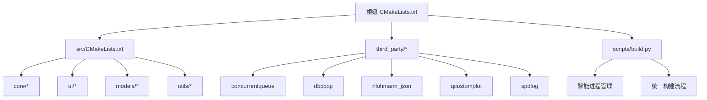
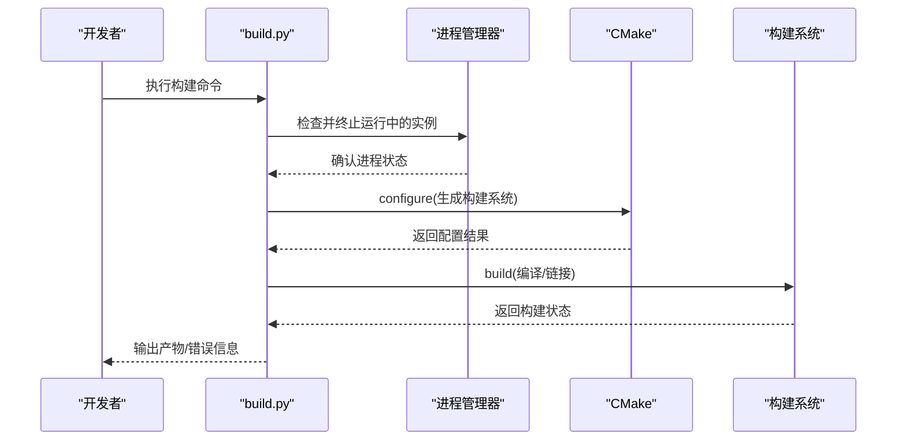
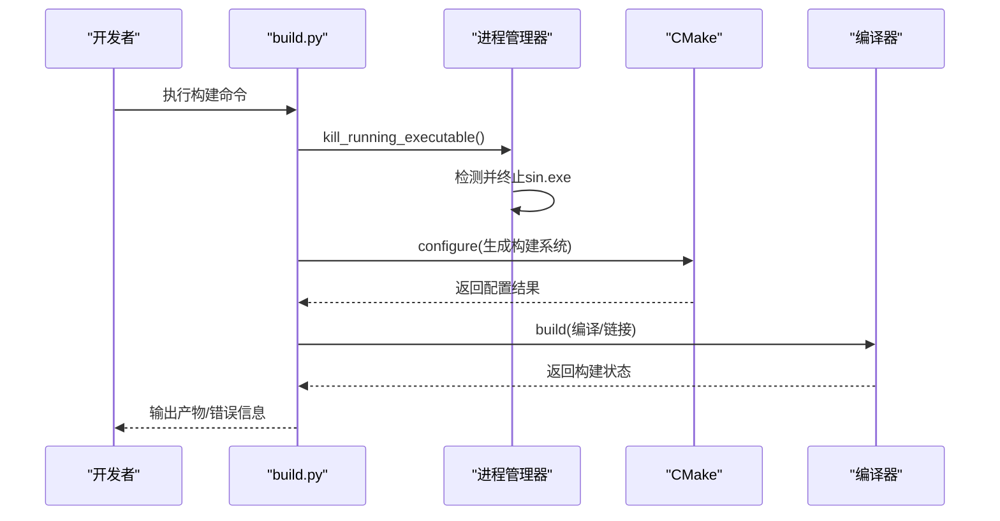
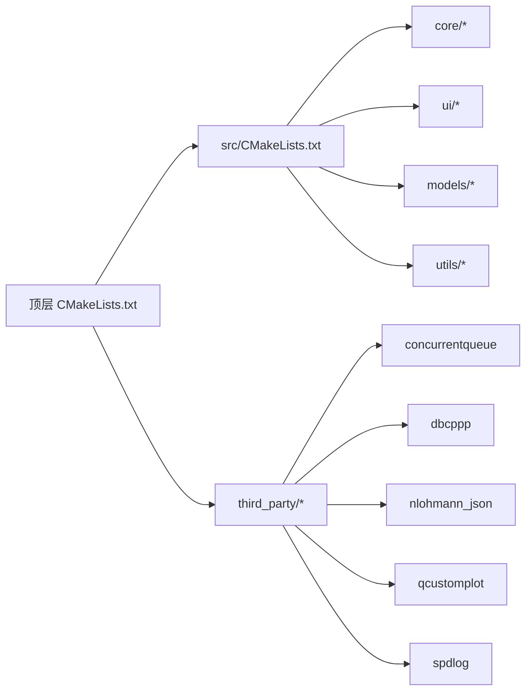
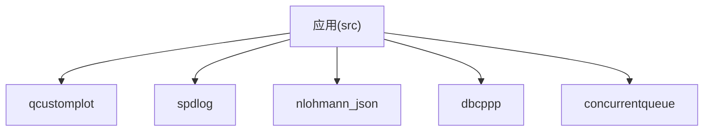

# 自动化依赖管理

<cite>
**本文引用的文件**   
- [CMakeLists.txt](file://CMakeLists.txt)
- [src/CMakeLists.txt](file://src/CMakeLists.txt)
- [scripts/build.py](file://scripts/build.py)
- [README.md](file://README.md)
</cite>

## 更新摘要
**变更内容**   
- 移除了独立的依赖下载脚本（download_concurrentqueue.py、download_exprtk.py等）
- 在build.py中集成智能进程管理，自动终止运行中的实例以防止构建时的文件锁定问题
- 简化了依赖管理架构，统一通过CMake和构建脚本管理第三方库

## 目录
1. [简介](#简介)
2. [项目结构](#项目结构)
3. [核心组件](#核心组件)
4. [架构总览](#架构总览)
5. [详细组件分析](#详细组件分析)
6. [依赖关系分析](#依赖关系分析)
7. [性能与构建优化](#性能与构建优化)
8. [故障排查指南](#故障排查指南)
9. [结论](#结论)
10. [附录](#附录)

## 简介
本文件围绕"自动化依赖管理"主题，系统化梳理该CAN总线分析工具的第三方库获取、集成与构建流程。经过架构优化后，项目采用统一的构建脚本管理所有依赖，移除了分散的独立下载脚本，通过智能进程管理解决构建时的文件锁定问题。内容涵盖：
- 依赖来源与版本管理策略
- 统一的构建脚本机制
- CMake集成与子模块组织
- 智能进程管理与错误处理
- 常见问题定位与修复建议

目标是帮助开发者快速理解并维护项目的依赖生命周期，确保在不同环境下的可重复构建与稳定交付。

## 项目结构
本项目采用分层目录组织：
- src：核心业务逻辑与UI实现
- third_party：第三方依赖源码（按库名分目录）
- scripts：统一的构建脚本
- UI/resources：界面资源与样式
- 根级CMakeLists.txt：顶层构建入口

图表来源
- [CMakeLists.txt](file://CMakeLists.txt)
- [src/CMakeLists.txt](file://src/CMakeLists.txt)
- [scripts/build.py](file://scripts/build.py)

章节来源
- [CMakeLists.txt](file://CMakeLists.txt)
- [src/CMakeLists.txt](file://src/CMakeLists.txt)

## 核心组件
- **统一构建脚本**：build.py负责整个构建流程，包括环境检测、配置生成、编译执行和部署
- **智能进程管理**：自动检测和终止正在运行的程序实例，避免文件锁定导致的构建失败
- **CMake配置**：定义顶层与子模块的构建目标、链接关系与安装规则
- **第三方库集成**：通过CMake直接管理third_party目录中的依赖库

**更新** 移除了独立的下载脚本，所有依赖管理功能已集成到build.py中

章节来源
- [scripts/build.py](file://scripts/build.py)
- [CMakeLists.txt](file://CMakeLists.txt)
- [src/CMakeLists.txt](file://src/CMakeLists.txt)

## 架构总览
下图展示了优化后的"开发者 → 统一构建脚本 → CMake → 构建产物"的整体流程，其中包含了智能进程管理环节。

图表来源
- [scripts/build.py](file://scripts/build.py)
- [CMakeLists.txt](file://CMakeLists.txt)
- [src/CMakeLists.txt](file://src/CMakeLists.txt)

## 详细组件分析

### 统一构建脚本 build.py
- **功能要点**
  - 检测环境与工具链（CMake、编译器、Qt）
  - 智能进程管理：自动终止正在运行的sin.exe实例
  - 生成构建目录与配置（Debug/Release）
  - 并行编译与错误收集
  - 可选打包与部署
- **关键流程**

**更新** 新增了智能进程管理功能，解决了构建时的文件锁定问题

图表来源
- [scripts/build.py:248-273](file://scripts/build.py#L248-L273)
- [CMakeLists.txt](file://CMakeLists.txt)
- [src/CMakeLists.txt](file://src/CMakeLists.txt)

章节来源
- [scripts/build.py](file://scripts/build.py)

### CMake 集成与子模块
- **顶层 CMakeLists.txt**
  - 设置全局属性（C++标准、编译器选项）
  - 添加子目录（src、third_party）
  - 定义可执行目标与安装规则
  - 引入第三方依赖配置文件
- **src/CMakeLists.txt**
  - 聚合 core/ui/models/utils 源文件
  - 链接第三方库（头文件包含路径、库文件）
  - 平台相关条件编译与特性开关

图表来源
- [CMakeLists.txt](file://CMakeLists.txt)
- [src/CMakeLists.txt](file://src/CMakeLists.txt)

章节来源
- [CMakeLists.txt](file://CMakeLists.txt)
- [src/CMakeLists.txt](file://src/CMakeLists.txt)

### 智能进程管理
- **功能说明**
  - 在构建前自动检测并终止正在运行的sin.exe进程
  - 使用Windows API强制终止进程，确保文件锁释放
  - 等待进程完全退出后再继续构建过程
  - 跨平台兼容，仅在Windows环境下启用
- **实现原理**
  - 调用taskkill命令强制终止目标进程
  - 循环检查文件访问权限，确认锁已释放
  - 异常处理确保构建过程的稳定性

**新增** 这是本次架构优化的核心改进，解决了常见的构建失败问题

章节来源
- [scripts/build.py:248-273](file://scripts/build.py#L248-L273)

### 第三方库说明
- **concurrentqueue**：高性能无锁队列，用于线程间消息传递
- **dbcppp**：DBC 文件解析库，支撑 CAN 信号与报文建模
- **nlohmann_json**：JSON 序列化/反序列化
- **qcustomplot**：Qt 绘图组件，用于波形与图形展示
- **spdlog**：高性能日志库

章节来源
- [README.md:377-447](file://README.md#L377-L447)

## 依赖关系分析
- **耦合度**
  - 应用层（src）仅通过 CMake 暴露的头文件与库接口与第三方库交互，保持低耦合
  - 构建脚本统一管理，职责清晰
- **直接依赖**
  - src 依赖 concurrentqueue、dbcppp、nlohmann_json、qcustomplot、spdlog
- **间接依赖**
  - 构建脚本依赖 CMake、编译器、网络访问能力
- **循环依赖**
  - 未发现循环依赖；第三方库之间相互独立

图表来源
- [src/CMakeLists.txt](file://src/CMakeLists.txt)
- [CMakeLists.txt](file://CMakeLists.txt)

章节来源
- [src/CMakeLists.txt](file://src/CMakeLists.txt)
- [CMakeLists.txt](file://CMakeLists.txt)

## 性能与构建优化
- **增量构建**
  - 合理划分源文件与头文件，减少不必要的重编译
- **并行编译**
  - 启用多核编译以缩短构建时间
- **智能进程管理**
  - 自动处理文件锁定问题，减少手动干预
- **缓存与镜像**
  - 使用本地镜像加速下载，避免网络抖动影响构建稳定性
- **预编译头与静态库**
  - 对大型第三方库启用预编译头或静态链接以减少链接时开销

## 故障排查指南
- **构建失败**
  - 检查CMake版本与编译器兼容性
  - 确认第三方库是否完整且路径正确
  - 根据错误信息调整编译选项或平台宏
- **进程相关问题**
  - 如果构建脚本无法终止进程，手动结束任务管理器中的sin.exe
  - 检查是否有其他程序占用了相关文件
- **运行时异常**
  - 启用spdlog日志级别提升定位问题
  - 检查动态库加载路径与权限

**更新** 由于移除了独立的下载脚本，不再需要处理下载相关的故障

章节来源
- [scripts/build.py](file://scripts/build.py)

## 结论
本项目通过"统一构建脚本 + CMake + 智能进程管理"的组合实现了简化的自动化依赖管理闭环。相比之前的多脚本架构，新方案具有以下优势：
- **简化维护**：单一脚本管理所有构建流程，降低维护复杂度
- **可靠性提升**：智能进程管理有效解决文件锁定问题
- **用户体验改善**：自动处理常见构建问题，减少人工干预
- **可重复构建**：固定版本与校验保证一致性
- **易扩展**：新增第三方库只需补充CMake配置

建议在团队内统一使用提供的构建脚本，配合镜像与缓存策略，进一步提升构建效率与稳定性。

## 附录
- **常用命令**
  - 配置工程：`python scripts/build.py configure`
  - 构建工程：`python scripts/build.py build`
  - 运行程序：`python scripts/build.py run`
  - 清理构建：`python scripts/build.py clean`
  - 完整流程：`python scripts/build.py all`
- **最佳实践**
  - 锁定依赖版本，定期更新并回归测试
  - 在CI中固化构建流程，确保跨环境一致
  - 利用智能进程管理避免手动终止进程