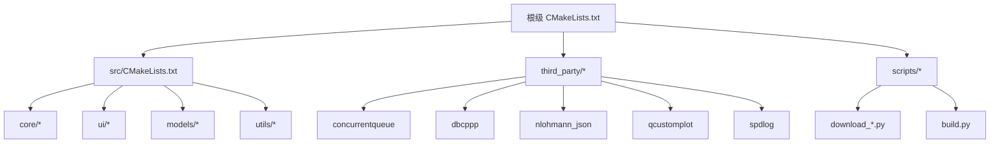
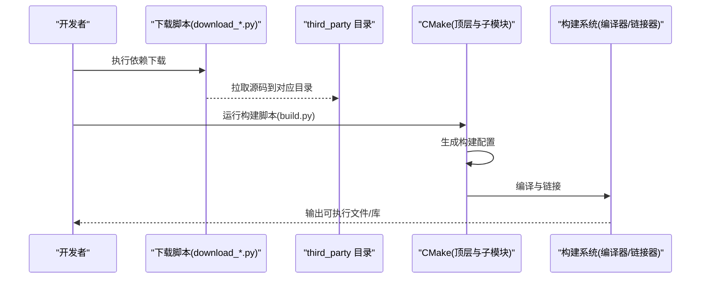
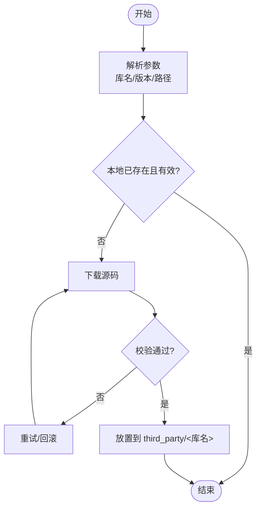
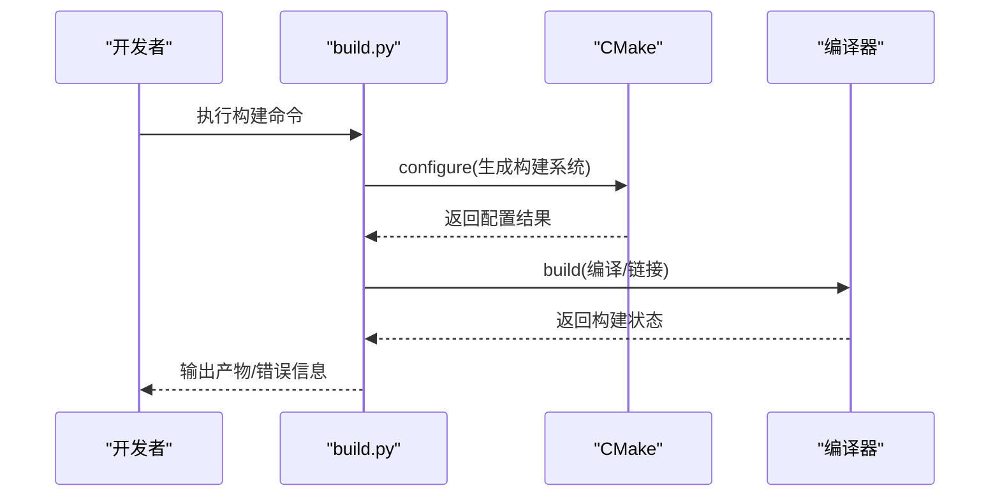
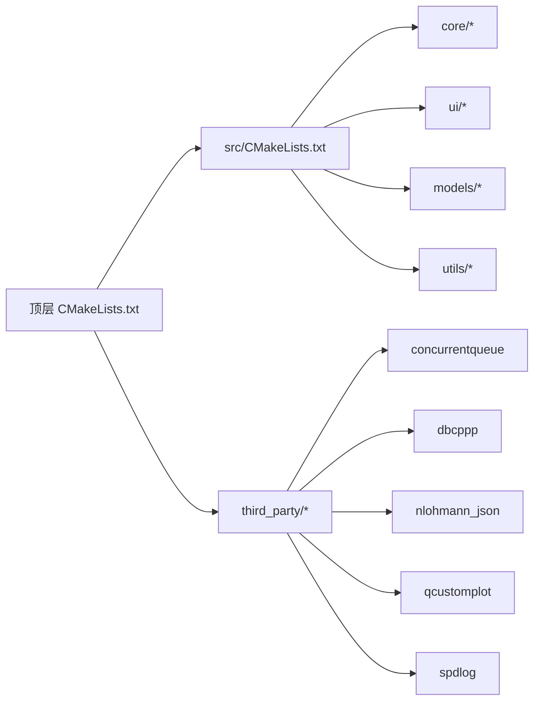
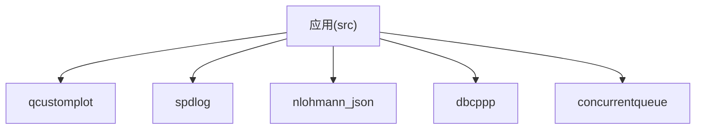

# 自动化依赖管理

<cite>
**本文引用的文件**   
- [CMakeLists.txt](file://CMakeLists.txt)
- [src/CMakeLists.txt](file://src/CMakeLists.txt)
- [scripts/build.py](file://scripts/build.py)
- [scripts/download_concurrentqueue.py](file://scripts/download_concurrentqueue.py)
- [scripts/download_exprtk.py](file://scripts/download_exprtk.py)
- [scripts/download_json.py](file://scripts/download_json.py)
- [scripts/download_qcustomplot.py](file://scripts/download_qcustomplot.py)
- [scripts/download_spdlog.py](file://scripts/download_spdlog.py)
- [third_party/concurrentqueue/README.md](file://third_party/concurrentqueue/README.md)
- [third_party/dbcppp/README.md](file://third_party/dbcppp/README.md)
- [third_party/nlohmann_json/README.md](file://third_party/nlohmann_json/README.md)
- [third_party/qcustomplot/README.md](file://third_party/qcustomplot/README.md)
- [third_party/spdlog/README.md](file://third_party/spdlog/README.md)
</cite>

## 目录
1. [简介](#简介)
2. [项目结构](#项目结构)
3. [核心组件](#核心组件)
4. [架构总览](#架构总览)
5. [详细组件分析](#详细组件分析)
6. [依赖关系分析](#依赖关系分析)
7. [性能与构建优化](#性能与构建优化)
8. [故障排查指南](#故障排查指南)
9. [结论](#结论)
10. [附录](#附录)

## 简介
本文件围绕“自动化依赖管理”主题，系统化梳理该CAN总线分析工具的第三方库获取、集成与构建流程。内容涵盖：
- 依赖来源与版本管理策略
- 下载脚本的自动化机制
- CMake集成与子模块组织
- 构建脚本编排与错误处理
- 常见问题定位与修复建议

目标是帮助开发者快速理解并维护项目的依赖生命周期，确保在不同环境下的可重复构建与稳定交付。

## 项目结构
本项目采用分层目录组织：
- src：核心业务逻辑与UI实现
- third_party：第三方依赖源码（按库名分目录）
- scripts：构建与依赖下载脚本
- UI/resources：界面资源与样式
- 根级CMakeLists.txt：顶层构建入口

图表来源
- [CMakeLists.txt](file://CMakeLists.txt)
- [src/CMakeLists.txt](file://src/CMakeLists.txt)
- [scripts/build.py](file://scripts/build.py)
- [scripts/download_concurrentqueue.py](file://scripts/download_concurrentqueue.py)
- [scripts/download_exprtk.py](file://scripts/download_exprtk.py)
- [scripts/download_json.py](file://scripts/download_json.py)
- [scripts/download_qcustomplot.py](file://scripts/download_qcustomplot.py)
- [scripts/download_spdlog.py](file://scripts/download_spdlog.py)

章节来源
- [CMakeLists.txt](file://CMakeLists.txt)
- [src/CMakeLists.txt](file://src/CMakeLists.txt)

## 核心组件
- 依赖下载脚本：负责从远程仓库拉取第三方库源码至 third_party 目录，支持校验与重试。
- 构建脚本：统一调用 CMake 生成构建系统，并执行编译、打包等步骤。
- CMake 配置：定义顶层与子模块的构建目标、链接关系与安装规则。

章节来源
- [scripts/download_concurrentqueue.py](file://scripts/download_concurrentqueue.py)
- [scripts/download_exprtk.py](file://scripts/download_exprtk.py)
- [scripts/download_json.py](file://scripts/download_json.py)
- [scripts/download_qcustomplot.py](file://scripts/download_qcustomplot.py)
- [scripts/download_spdlog.py](file://scripts/download_spdlog.py)
- [scripts/build.py](file://scripts/build.py)
- [CMakeLists.txt](file://CMakeLists.txt)
- [src/CMakeLists.txt](file://src/CMakeLists.txt)

## 架构总览
下图展示了“开发机 → 下载脚本 → 第三方库 → CMake → 构建产物”的整体流程。

图表来源
- [scripts/download_concurrentqueue.py](file://scripts/download_concurrentqueue.py)
- [scripts/download_exprtk.py](file://scripts/download_exprtk.py)
- [scripts/download_json.py](file://scripts/download_json.py)
- [scripts/download_qcustomplot.py](file://scripts/download_qcustomplot.py)
- [scripts/download_spdlog.py](file://scripts/download_spdlog.py)
- [scripts/build.py](file://scripts/build.py)
- [CMakeLists.txt](file://CMakeLists.txt)
- [src/CMakeLists.txt](file://src/CMakeLists.txt)

## 详细组件分析

### 依赖下载脚本
- 功能要点
  - 解析参数（目标库、版本/分支、下载路径）
  - 使用 Git 或 HTTP 下载源码
  - 校验完整性（哈希/签名）
  - 失败重试与日志记录
- 典型流程

图表来源
- [scripts/download_concurrentqueue.py](file://scripts/download_concurrentqueue.py)
- [scripts/download_exprtk.py](file://scripts/download_exprtk.py)
- [scripts/download_json.py](file://scripts/download_json.py)
- [scripts/download_qcustomplot.py](file://scripts/download_qcustomplot.py)
- [scripts/download_spdlog.py](file://scripts/download_spdlog.py)

章节来源
- [scripts/download_concurrentqueue.py](file://scripts/download_concurrentqueue.py)
- [scripts/download_exprtk.py](file://scripts/download_exprtk.py)
- [scripts/download_json.py](file://scripts/download_json.py)
- [scripts/download_qcustomplot.py](file://scripts/download_qcustomplot.py)
- [scripts/download_spdlog.py](file://scripts/download_spdlog.py)

### 构建脚本 build.py
- 功能要点
  - 检测环境与工具链（CMake、编译器）
  - 生成构建目录与配置（Debug/Release）
  - 并行编译与错误收集
  - 可选打包与归档
- 关键流程

图表来源
- [scripts/build.py](file://scripts/build.py)
- [CMakeLists.txt](file://CMakeLists.txt)
- [src/CMakeLists.txt](file://src/CMakeLists.txt)

章节来源
- [scripts/build.py](file://scripts/build.py)

### CMake 集成与子模块
- 顶层 CMakeLists.txt
  - 设置全局属性（C++标准、编译器选项）
  - 添加子目录（src、third_party）
  - 定义可执行目标与安装规则
- src/CMakeLists.txt
  - 聚合 core/ui/models/utils 源文件
  - 链接第三方库（头文件包含路径、库文件）
  - 平台相关条件编译与特性开关

图表来源
- [CMakeLists.txt](file://CMakeLists.txt)
- [src/CMakeLists.txt](file://src/CMakeLists.txt)

章节来源
- [CMakeLists.txt](file://CMakeLists.txt)
- [src/CMakeLists.txt](file://src/CMakeLists.txt)

### 第三方库说明
- concurrentqueue：高性能无锁队列，用于线程间消息传递
- dbcppp：DBC 文件解析库，支撑 CAN 信号与报文建模
- nlohmann_json：JSON 序列化/反序列化
- qcustomplot：Qt 绘图组件，用于波形与图形展示
- spdlog：高性能日志库

章节来源
- [third_party/concurrentqueue/README.md](file://third_party/concurrentqueue/README.md)
- [third_party/dbcppp/README.md](file://third_party/dbcppp/README.md)
- [third_party/nlohmann_json/README.md](file://third_party/nlohmann_json/README.md)
- [third_party/qcustomplot/README.md](file://third_party/qcustomplot/README.md)
- [third_party/spdlog/README.md](file://third_party/spdlog/README.md)

## 依赖关系分析
- 耦合度
  - 应用层（src）仅通过 CMake 暴露的头文件与库接口与第三方库交互，保持低耦合
  - 下载脚本与构建脚本解耦，职责清晰
- 直接依赖
  - src 依赖 concurrentqueue、dbcppp、nlohmann_json、qcustomplot、spdlog
- 间接依赖
  - 构建脚本依赖 CMake、编译器、网络访问能力
- 循环依赖
  - 未发现循环依赖；第三方库之间相互独立

图表来源
- [src/CMakeLists.txt](file://src/CMakeLists.txt)
- [CMakeLists.txt](file://CMakeLists.txt)

章节来源
- [src/CMakeLists.txt](file://src/CMakeLists.txt)
- [CMakeLists.txt](file://CMakeLists.txt)

## 性能与构建优化
- 增量构建
  - 合理划分源文件与头文件，减少不必要的重编译
- 并行编译
  - 启用多核编译以缩短构建时间
- 缓存与镜像
  - 使用本地镜像加速下载，避免网络抖动影响构建稳定性
- 预编译头与静态库
  - 对大型第三方库启用预编译头或静态链接以减少链接时开销

[本节为通用指导，不直接分析具体文件]

## 故障排查指南
- 下载失败
  - 检查网络连通性与代理设置
  - 确认目标仓库地址与版本标签有效性
  - 查看脚本日志定位具体失败阶段
- 构建失败
  - 核对 CMake 版本与编译器兼容性
  - 检查第三方库是否完整下载且路径正确
  - 根据错误信息调整编译选项或平台宏
- 运行时异常
  - 启用 spdlog 日志级别提升定位问题
  - 检查动态库加载路径与权限

章节来源
- [scripts/download_concurrentqueue.py](file://scripts/download_concurrentqueue.py)
- [scripts/download_exprtk.py](file://scripts/download_exprtk.py)
- [scripts/download_json.py](file://scripts/download_json.py)
- [scripts/download_qcustomplot.py](file://scripts/download_qcustomplot.py)
- [scripts/download_spdlog.py](file://scripts/download_spdlog.py)
- [scripts/build.py](file://scripts/build.py)

## 结论
本项目通过“下载脚本 + CMake + 构建脚本”的组合实现了完整的自动化依赖管理闭环。其优势在于：
- 可重复构建：固定版本与校验保证一致性
- 易扩展：新增第三方库只需补充下载脚本与 CMake 配置
- 可维护：职责分离清晰，便于问题定位与优化

建议在团队内统一使用提供的脚本与配置，配合镜像与缓存策略，进一步提升构建效率与稳定性。

## 附录
- 常用命令
  - 下载依赖：执行各 download_*.py 脚本
  - 构建工程：执行 build.py
- 最佳实践
  - 锁定依赖版本，定期更新并回归测试
  - 在 CI 中固化构建流程，确保跨环境一致

[本节为通用指导，不直接分析具体文件]