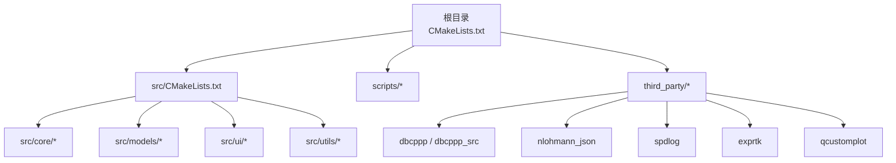
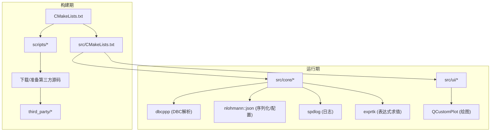
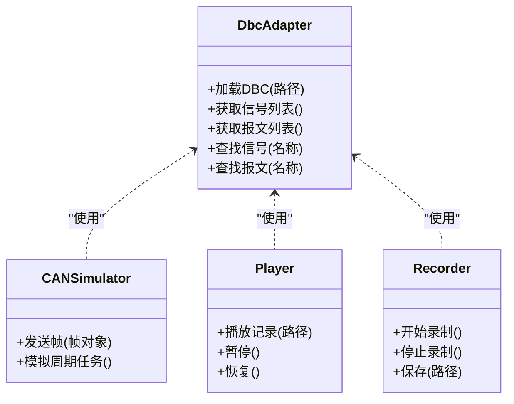
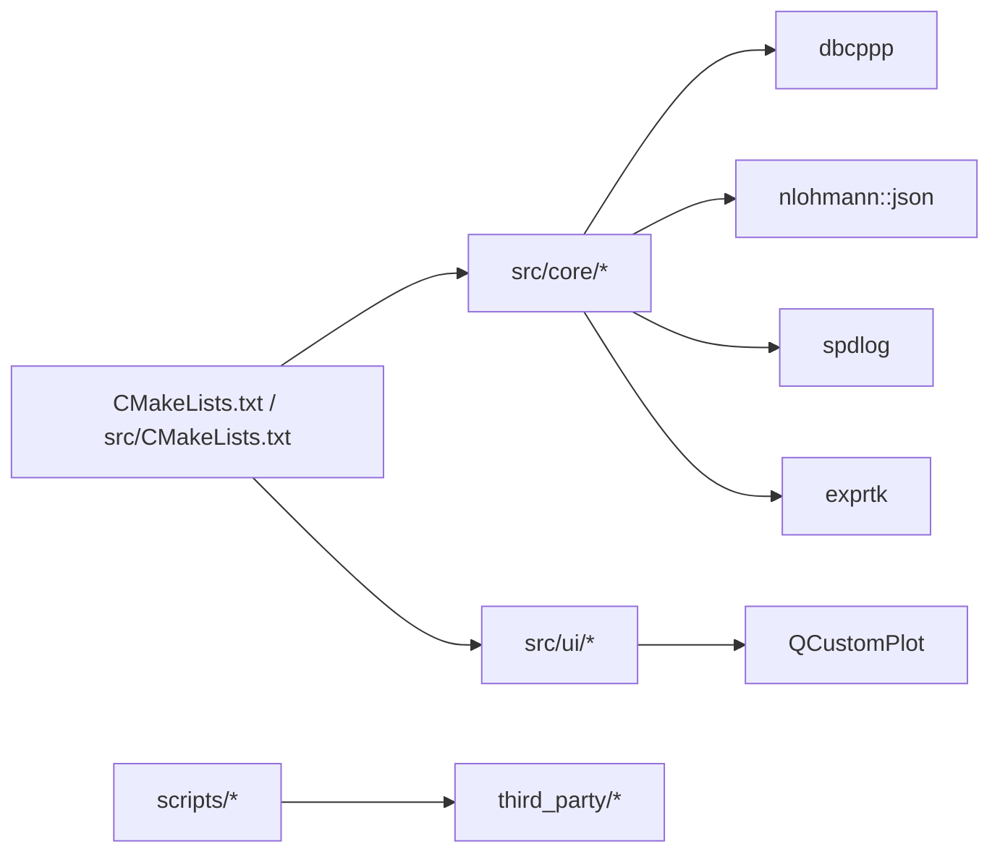

# 第三方组件集成

<cite>
**本文引用的文件**   
- [CMakeLists.txt](file://CMakeLists.txt)
- [src/CMakeLists.txt](file://src/CMakeLists.txt)
- [src/main.cpp](file://src/main.cpp)
- [scripts/build.py](file://scripts/build.py)
- [scripts/download_exprtk.py](file://scripts/download_exprtk.py)
- [scripts/download_json.py](file://scripts/download_json.py)
- [scripts/download_qcustomplot.py](file://scripts/download_qcustomplot.py)
- [scripts/download_spdlog.py](file://scripts/download_spdlog.py)
- [third_party/dbcppp/](file://third_party/dbcppp/)
- [third_party/dbcppp_src/](file://third_party/dbcppp_src/)
- [third_party/exprtk/](file://third_party/exprtk/)
- [third_party/nlohmann_json/](file://third_party/nlohmann_json/)
- [third_party/spdlog/](file://third_party/spdlog/)
- [src/core/dbc/dbc_adapter.h](file://src/core/dbc/dbc_adapter.h)
- [src/core/dbc/dbc_adapter.cpp](file://src/core/dbc/dbc_adapter.cpp)
- [src/core/cansimulator.h](file://src/core/cansimulator.h)
- [src/core/player.h](file://src/core/player.h)
- [src/core/recorder.h](file://src/core/recorder.h)
- [src/ui/mainwindow.h](file://src/ui/mainwindow.h)
- [src/ui/graphicview.h](file://src/ui/graphicview.h)
</cite>

## 目录
1. [简介](#简介)
2. [项目结构](#项目结构)
3. [核心组件](#核心组件)
4. [架构总览](#架构总览)
5. [详细组件分析](#详细组件分析)
6. [依赖关系分析](#依赖关系分析)
7. [性能考量](#性能考量)
8. [故障排查指南](#故障排查指南)
9. [结论](#结论)
10. [附录](#附录)

## 简介
本文件聚焦于该CAN总线分析工具的“第三方组件集成”主题，系统性梳理项目中引入的第三方库（如dbcppp、nlohmann::json、spdlog、exprtk、QCustomPlot等）在构建系统、脚本与源码中的集成方式，说明数据流与控制流的关键路径，并给出可操作的排错建议与优化方向。文档兼顾非技术读者与技术读者的需求，提供分层说明、图示与最佳实践。

## 项目结构
从仓库根目录可见，第三方组件主要集中于 third_party 子目录；构建配置位于根级 CMakeLists.txt 与 src/CMakeLists.txt；下载与构建辅助脚本位于 scripts 目录；核心业务逻辑位于 src 目录，UI 相关代码位于 UI 与 src/ui。整体采用“按功能域组织”的结构：core（CAN仿真/回放/记录/DBC解析）、models（模型与代理）、ui（Qt界面）、utils（工具函数）。

图表来源
- [CMakeLists.txt](file://CMakeLists.txt)
- [src/CMakeLists.txt](file://src/CMakeLists.txt)
- [scripts/build.py](file://scripts/build.py)

章节来源
- [CMakeLists.txt](file://CMakeLists.txt)
- [src/CMakeLists.txt](file://src/CMakeLists.txt)
- [scripts/build.py](file://scripts/build.py)

## 核心组件
围绕第三方组件集成，本项目涉及以下关键方面：
- 构建系统集成：通过 CMake 将第三方库作为子模块或外部目标引入，统一编译与链接。
- 脚本化依赖管理：使用 Python 脚本下载/准备第三方源码或资源，确保可重复构建。
- 运行时依赖：在核心模块中调用第三方库接口，完成 DBC 解析、日志输出、表达式求值、图形绘制等功能。
- 头文件与命名空间隔离：通过 include 路径与命名空间避免冲突，便于升级与维护。

章节来源
- [src/CMakeLists.txt](file://src/CMakeLists.txt)
- [scripts/download_exprtk.py](file://scripts/download_exprtk.py)
- [scripts/download_json.py](file://scripts/download_json.py)
- [scripts/download_qcustomplot.py](file://scripts/download_qcustomplot.py)
- [scripts/download_spdlog.py](file://scripts/download_spdlog.py)

## 架构总览
下图展示第三方组件在项目中的集成位置与交互关系：构建阶段由 CMake 与脚本驱动，运行阶段由 core 与 ui 模块调用第三方能力。

图表来源
- [CMakeLists.txt](file://CMakeLists.txt)
- [src/CMakeLists.txt](file://src/CMakeLists.txt)
- [scripts/download_exprtk.py](file://scripts/download_exprtk.py)
- [scripts/download_json.py](file://scripts/download_json.py)
- [scripts/download_qcustomplot.py](file://scripts/download_qcustomplot.py)
- [scripts/download_spdlog.py](file://scripts/download_spdlog.py)

## 详细组件分析

### DBC 解析集成（dbcppp）
- 集成点：src/core/dbc 下的适配器封装了 dbcppp 的使用，屏蔽底层差异，向上层提供统一的 DBC 数据访问接口。
- 数据流：DBC 文件加载 → dbcppp 解析 → 内部数据结构 → 上层查询/过滤/可视化。
- 关键点：头文件包含路径、命名空间隔离、错误处理与兼容性适配。

图表来源
- [src/core/dbc/dbc_adapter.h](file://src/core/dbc/dbc_adapter.h)
- [src/core/dbc/dbc_adapter.cpp](file://src/core/dbc/dbc_adapter.cpp)
- [src/core/cansimulator.h](file://src/core/cansimulator.h)
- [src/core/player.h](file://src/core/player.h)
- [src/core/recorder.h](file://src/core/recorder.h)

章节来源
- [src/core/dbc/dbc_adapter.h](file://src/core/dbc/dbc_adapter.h)
- [src/core/dbc/dbc_adapter.cpp](file://src/core/dbc/dbc_adapter.cpp)
- [src/core/cansimulator.h](file://src/core/cansimulator.h)
- [src/core/player.h](file://src/core/player.h)
- [src/core/recorder.h](file://src/core/recorder.h)

### 日志子系统（spdlog）
- 集成点：core 与 utils 模块通过 spdlog 输出结构化日志，支持多级别与异步写入。
- 设计要点：初始化一次、线程安全、按需开关日志级别，避免影响主流程性能。
- 常见问题：未正确初始化导致崩溃；多线程下日志丢失；磁盘满导致写入失败。

章节来源
- [src/CMakeLists.txt](file://src/CMakeLists.txt)
- [scripts/download_spdlog.py](file://scripts/download_spdlog.py)

### 表达式引擎（exprtk）
- 集成点：用于动态计算信号阈值、触发条件或显示公式。
- 数据流：用户输入表达式 → 编译为AST → 绑定变量 → 求值 → 返回结果。
- 注意事项：表达式语法校验、变量绑定生命周期、异常捕获与回退策略。

章节来源
- [scripts/download_exprtk.py](file://scripts/download_exprtk.py)
- [src/CMakeLists.txt](file://src/CMakeLists.txt)

### JSON 配置与序列化（nlohmann::json）
- 集成点：配置文件读写、消息格式转换、缓存状态持久化。
- 优势：轻量、易读、API简洁；适合小中型配置与中间态存储。
- 风险：大对象序列化开销；字段版本兼容需显式处理。

章节来源
- [scripts/download_json.py](file://scripts/download_json.py)
- [src/CMakeLists.txt](file://src/CMakeLists.txt)

### 图形绘制（QCustomPlot）
- 集成点：UI 层通过 QCustomPlot 渲染波形、曲线与轨迹视图。
- 性能要点：批量更新、增量刷新、禁用不必要的重绘。
- 扩展性：自定义样式、主题切换、导出图片。

章节来源
- [scripts/download_qcustomplot.py](file://scripts/download_qcustomplot.py)
- [src/ui/graphicview.h](file://src/ui/graphicview.h)
- [src/ui/mainwindow.h](file://src/ui/mainwindow.h)

### 构建与脚本自动化
- CMake 负责统一构建入口，将 third_party 与 src 目标关联，设置 include 路径与链接选项。
- Python 脚本用于下载/解压第三方源码，保证离线环境可复现构建。
- 建议：锁定版本号、校验哈希、失败重试与断点续传。

章节来源
- [CMakeLists.txt](file://CMakeLists.txt)
- [src/CMakeLists.txt](file://src/CMakeLists.txt)
- [scripts/build.py](file://scripts/build.py)
- [scripts/download_exprtk.py](file://scripts/download_exprtk.py)
- [scripts/download_json.py](file://scripts/download_json.py)
- [scripts/download_qcustomplot.py](file://scripts/download_qcustomplot.py)
- [scripts/download_spdlog.py](file://scripts/download_spdlog.py)

## 依赖关系分析
下图展示核心模块对第三方库的直接依赖关系，以及 UI 层对绘图库的依赖。

图表来源
- [CMakeLists.txt](file://CMakeLists.txt)
- [src/CMakeLists.txt](file://src/CMakeLists.txt)
- [src/core/dbc/dbc_adapter.h](file://src/core/dbc/dbc_adapter.h)
- [src/ui/mainwindow.h](file://src/ui/mainwindow.h)
- [src/ui/graphicview.h](file://src/ui/graphicview.h)

章节来源
- [CMakeLists.txt](file://CMakeLists.txt)
- [src/CMakeLists.txt](file://src/CMakeLists.txt)

## 性能考量
- 日志写入：启用异步模式，限制最大文件大小与轮转策略，避免阻塞主循环。
- DBC 解析：延迟加载与缓存热点数据，减少重复解析开销。
- 表达式求值：预编译常用表达式，缓存 AST，避免频繁重建。
- 图形渲染：合并绘制批次、使用双缓冲、按需刷新区域。
- 内存管理：避免临时对象频繁分配，复用缓冲区，降低 GC/析构压力。

[本节为通用指导，不直接分析具体文件]

## 故障排查指南
- 构建失败
  - 现象：找不到第三方头文件或链接失败。
  - 排查：检查 include 路径与 target_link_libraries；确认脚本已执行且 third_party 目录完整。
  - 参考：CMake 配置与脚本下载逻辑。
- 运行时崩溃
  - 现象：日志未初始化、JSON 解析异常、表达式求值越界。
  - 排查：确保初始化顺序；增加异常捕获与回退；打印上下文信息。
- 性能问题
  - 现象：界面卡顿、CPU 占用高。
  - 排查：定位热点函数；减少同步日志；优化渲染与数据更新频率。
- 平台差异
  - 现象：Windows/Linux/Mac 行为不一致。
  - 排查：检查路径分隔符、编码、线程模型与 Qt 插件依赖。

章节来源
- [CMakeLists.txt](file://CMakeLists.txt)
- [src/CMakeLists.txt](file://src/CMakeLists.txt)
- [scripts/build.py](file://scripts/build.py)

## 结论
本项目通过 CMake 与脚本实现了第三方组件的可控集成，核心模块以适配器与封装层屏蔽差异，UI 层专注交互与可视化。建议在后续迭代中强化版本锁定、依赖校验与单元测试覆盖，进一步提升稳定性与可维护性。

[本节为总结性内容，不直接分析具体文件]

## 附录
- 术语表
  - DBC：CAN 数据库描述文件，定义报文与信号。
  - AST：抽象语法树，表达式编译后的中间表示。
  - QCustomPlot：基于 Qt 的二维绘图库。
- 快速上手
  - 首次构建：运行构建脚本以准备第三方源码，再执行 CMake 生成与编译。
  - 验证集成：加载示例 DBC，查看日志输出与波形渲染是否正常。

[本节为补充信息，不直接分析具体文件]