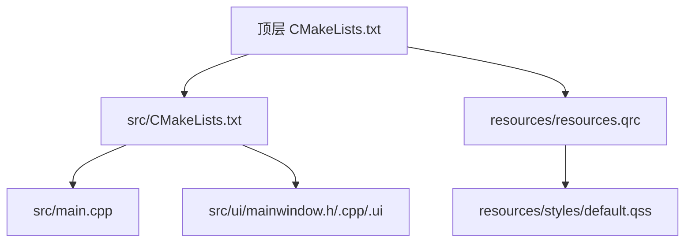
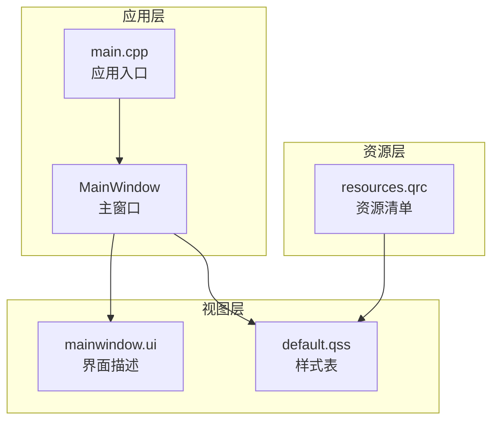
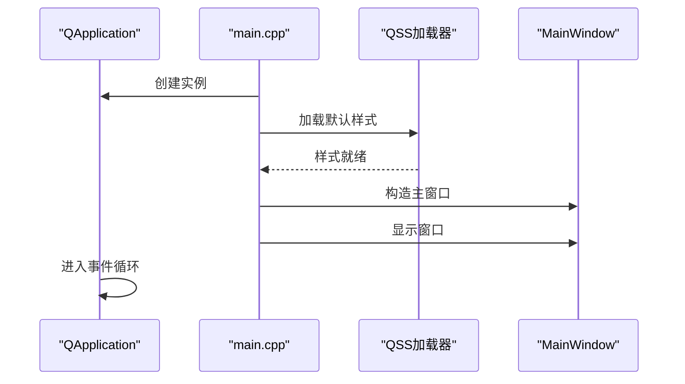
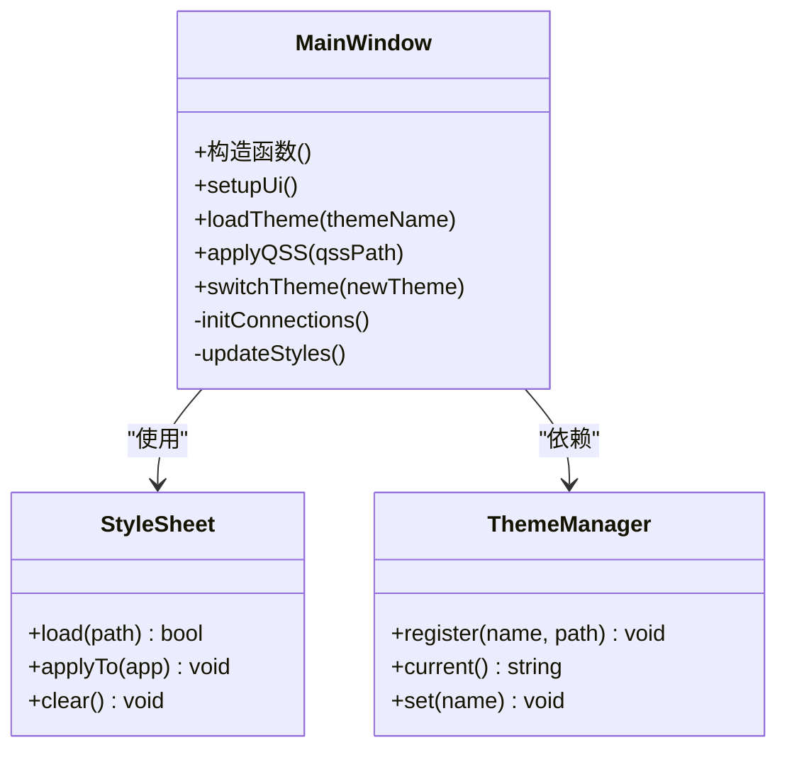
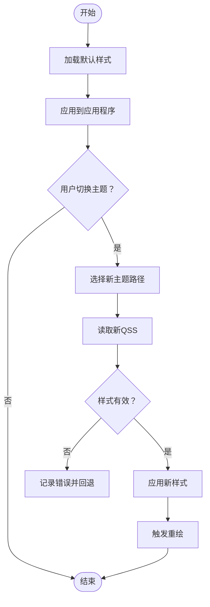

# UI系统设计

<cite>
**本文档引用的文件**   
- [CMakeLists.txt](file://CMakeLists.txt)
- [README.en.md](file://README.en.md)
- [src/main.cpp](file://src/main.cpp)
- [src/CMakeLists.txt](file://src/CMakeLists.txt)
- [src/ui/mainwindow.h](file://src/ui/mainwindow.h)
- [src/ui/mainwindow.cpp](file://src/ui/mainwindow.cpp)
- [src/ui/mainwindow.ui](file://src/ui/mainwindow.ui)
- [resources/styles/default.qss](file://resources/styles/default.qss)
- [resources/resources.qrc](file://resources/resources.qrc)
</cite>

## 目录
1. [简介](#简介)
2. [项目结构](#项目结构)
3. [核心组件](#核心组件)
4. [架构总览](#架构总览)
5. [详细组件分析](#详细组件分析)
6. [依赖关系分析](#依赖关系分析)
7. [性能考虑](#性能考虑)
8. [故障排查指南](#故障排查指南)
9. [结论](#结论)
10. [附录](#附录)

## 简介
本文件面向基于Qt Widgets的UI系统，系统化阐述UI架构模式、组件层次与布局策略；详细说明QSS样式体系、主题管理与动态样式更新；解释资源文件组织、Qt资源系统与多语言支持；并给出响应式设计、可访问性与跨平台兼容性的实践建议。同时提供UI组件开发规范、样式定制指南与性能优化建议，辅以设计模式与最佳实践示例，帮助团队在Qt Widgets项目中构建高质量、可维护且高性能的用户界面。

## 项目结构
本项目采用分层与按功能划分的组织方式：
- src: 源代码目录，包含应用入口、主窗口实现与UI描述文件
- resources: 静态资源目录，包含QSS样式与Qt资源清单
- CMakeLists.txt: 顶层构建配置，定义目标、链接库与资源集成

图表来源
- [CMakeLists.txt](file://CMakeLists.txt)
- [src/CMakeLists.txt](file://src/CMakeLists.txt)
- [src/main.cpp](file://src/main.cpp)
- [src/ui/mainwindow.h](file://src/ui/mainwindow.h)
- [src/ui/mainwindow.cpp](file://src/ui/mainwindow.cpp)
- [src/ui/mainwindow.ui](file://src/ui/mainwindow.ui)
- [resources/resources.qrc](file://resources/resources.qrc)
- [resources/styles/default.qss](file://resources/styles/default.qss)

章节来源
- [CMakeLists.txt](file://CMakeLists.txt)
- [README.en.md](file://README.en.md)

## 核心组件
- 应用入口 main.cpp: 初始化Qt应用实例、设置全局样式、创建并显示主窗口
- 主窗口 MainWindow: 承载UI树、管理布局与交互逻辑、加载QSS与主题切换
- UI描述 mainwindow.ui: 使用Qt Designer定义的界面结构与控件层次
- QSS样式 default.qss: 集中式样式表，统一外观与主题基础
- Qt资源 resources.qrc: 将样式与图标等资源打包进应用，便于分发与加载

章节来源
- [src/main.cpp](file://src/main.cpp)
- [src/ui/mainwindow.h](file://src/ui/mainwindow.h)
- [src/ui/mainwindow.cpp](file://src/ui/mainwindow.cpp)
- [src/ui/mainwindow.ui](file://src/ui/mainwindow.ui)
- [resources/styles/default.qss](file://resources/styles/default.qss)
- [resources/resources.qrc](file://resources/resources.qrc)

## 架构总览
整体采用“入口初始化 + 主窗口容器 + 样式/资源分离”的架构模式：
- 入口负责生命周期与全局样式注入
- 主窗口作为UI根节点，组织子控件与布局
- 样式通过QSS集中管理，支持运行时切换
- 资源通过qrc统一打包，避免路径问题

图表来源
- [src/main.cpp](file://src/main.cpp)
- [src/ui/mainwindow.h](file://src/ui/mainwindow.h)
- [src/ui/mainwindow.cpp](file://src/ui/mainwindow.cpp)
- [src/ui/mainwindow.ui](file://src/ui/mainwindow.ui)
- [resources/styles/default.qss](file://resources/styles/default.qss)
- [resources/resources.qrc](file://resources/resources.qrc)

## 详细组件分析

### 应用入口（main.cpp）
职责与流程
- 创建 QApplication 实例
- 设置全局字体与高DPI支持
- 加载默认QSS样式
- 构造并显示主窗口
- 进入事件循环

关键要点
- 样式加载应在主窗口显示前完成，确保首次渲染即应用主题
- 高DPI与字体设置影响后续所有控件的绘制与度量

图表来源
- [src/main.cpp](file://src/main.cpp)

章节来源
- [src/main.cpp](file://src/main.cpp)

### 主窗口（MainWindow）
职责与交互
- 作为UI根节点，组织控件树与布局
- 处理用户输入与业务事件转发
- 管理主题切换与样式动态更新
- 与资源系统协作加载图标、图片等

类关系与数据流
- 继承自 QWidget/QMainWindow（由 .ui 生成基类）
- 持有样式管理器与主题配置
- 通过信号槽机制与子控件通信

图表来源
- [src/ui/mainwindow.h](file://src/ui/mainwindow.h)
- [src/ui/mainwindow.cpp](file://src/ui/mainwindow.cpp)

章节来源
- [src/ui/mainwindow.h](file://src/ui/mainwindow.h)
- [src/ui/mainwindow.cpp](file://src/ui/mainwindow.cpp)

### UI描述（mainwindow.ui）
作用与约定
- 使用Qt Designer可视化编辑控件层次、属性与布局
- 生成对应的头文件供C++代码引用
- 推荐将复杂布局与交互逻辑从.ui中解耦到C++

最佳实践
- 命名规范：控件名语义化，便于样式选择器定位
- 布局优先：尽量使用布局管理器而非绝对坐标
- 事件委托：将业务逻辑放在C++层，保持.ui简洁

章节来源
- [src/ui/mainwindow.ui](file://src/ui/mainwindow.ui)

### 样式系统（QSS与主题管理）
设计理念
- 集中式样式表：通过单一QSS文件管理全局外观
- 主题机制：以主题为单位切换样式集，支持运行时热更新
- 动态更新：不重建控件的前提下刷新样式

样式加载与切换流程

图表来源
- [resources/styles/default.qss](file://resources/styles/default.qss)
- [resources/resources.qrc](file://resources/resources.qrc)

章节来源
- [resources/styles/default.qss](file://resources/styles/default.qss)
- [resources/resources.qrc](file://resources/resources.qrc)

### 资源系统（resources.qrc）
组织原则
- 将样式、图标、字体等静态资源纳入qrc清单
- 通过:/前缀在代码中引用，避免平台路径差异
- 便于打包与版本化管理

常用用法
- 在样式表中引用资源：url(:/styles/default.qss)
- 在代码中加载资源：QFile(":/...")

章节来源
- [resources/resources.qrc](file://resources/resources.qrc)

### 多语言支持
策略与建议
- 使用Qt Linguist进行翻译管理
- 通过tr()/translate()包裹用户可见文本
- 运行时根据locale切换语言包
- 与主题系统解耦，避免样式与文案耦合

章节来源
- [README.en.md](file://README.en.md)

## 依赖关系分析
模块间依赖与耦合
- main.cpp 依赖样式加载与主窗口
- MainWindow 依赖样式与主题管理
- 样式与资源通过qrc解耦，降低硬编码路径风险

图表来源
- [src/main.cpp](file://src/main.cpp)
- [src/ui/mainwindow.h](file://src/ui/mainwindow.h)
- [src/ui/mainwindow.cpp](file://src/ui/mainwindow.cpp)
- [resources/resources.qrc](file://resources/resources.qrc)

章节来源
- [src/CMakeLists.txt](file://src/CMakeLists.txt)
- [CMakeLists.txt](file://CMakeLists.txt)

## 性能考虑
- 样式加载
  - 仅在必要时重新加载QSS，避免频繁解析
  - 使用增量更新或合并样式减少重复计算
- 布局与绘制
  - 优先使用布局管理器，减少手动几何计算
  - 避免在事件循环中进行耗时操作，使用异步任务
- 资源管理
  - 将大资源按需加载，避免一次性载入
  - 合理使用缓存，减少重复I/O
- 高DPI与缩放
  - 启用高DPI支持，合理设置像素密度
  - 对矢量图标与自适应布局进行验证

[本节为通用指导，无需特定文件引用]

## 故障排查指南
常见问题与定位方法
- 样式未生效
  - 检查QSS路径是否正确，是否通过qrc正确打包
  - 确认样式加载时机在主窗口显示之前
- 主题切换无效
  - 校验新样式语法，捕获解析异常
  - 确保应用了正确的对象名称与选择器
- 资源加载失败
  - 核对qrc中的路径大小写与相对路径
  - 使用:/前缀访问资源，避免平台差异
- 多语言文本未替换
  - 确认已调用tr()包裹文本
  - 检查翻译文件是否被正确加载与安装

章节来源
- [resources/styles/default.qss](file://resources/styles/default.qss)
- [resources/resources.qrc](file://resources/resources.qrc)

## 结论
本UI系统以Qt Widgets为基础，采用清晰的入口-主窗口-样式-资源分层架构，结合QSS与主题管理实现灵活的外观定制与动态更新。通过qrc统一管理资源，提升可移植性与可维护性。遵循本文档的组件规范、样式指南与性能建议，可在保证用户体验的同时，提高开发效率与系统稳定性。

[本节为总结性内容，无需特定文件引用]

## 附录

### UI组件开发规范
- 命名与结构
  - 控件命名语义化，便于样式选择器与自动化测试定位
  - 将复杂交互逻辑下沉至C++，保持.ui简洁
- 布局策略
  - 优先使用布局管理器，避免绝对坐标
  - 针对小屏幕与高DPI进行适配验证
- 样式定制
  - 使用统一的QSS变量与命名空间
  - 避免过度嵌套选择器，提升解析性能
- 可访问性
  - 设置合适的角色、提示与键盘导航
  - 确保颜色对比度符合无障碍标准

### 样式定制指南
- 主题设计
  - 以主题为单位组织QSS，支持运行时切换
  - 使用一致的调色板与尺寸规范
- 动态更新
  - 提供接口在不重建控件的情况下刷新样式
  - 对样式变更进行最小化重绘
- 资源引用
  - 通过qrc统一引用图标与字体
  - 避免在样式中使用绝对路径

### 设计模式与最佳实践
- 观察者模式
  - 通过信号槽实现松耦合的事件通知
- 策略模式
  - 将不同主题或布局策略抽象为可替换的策略对象
- 工厂模式
  - 统一创建具有相同样式的控件实例
- 单例模式
  - 主题管理器与样式管理器可采用单例，确保全局一致性

[本节为概念性内容，无需特定文件引用]