# UI系统设计

<cite>
**本文档引用的文件**   
- [CMakeLists.txt](file://CMakeLists.txt)
- [README.en.md](file://README.en.md)
- [src/main.cpp](file://src/main.cpp)
- [src/CMakeLists.txt](file://src/CMakeLists.txt)
- [src/ui/mainwindow.h](file://src/ui/mainwindow.h)
- [src/ui/mainwindow.cpp](file://src/ui/mainwindow.cpp)
- [resources/styles/default.qss](file://resources/styles/default.qss)
- [resources/resources.qrc](file://resources/resources.qrc)
- [src/ui/filterbar.h](file://src/ui/filterbar.h)
- [src/ui/filterbar.cpp](file://src/ui/filterbar.cpp)
- [src/ui/graphicview.h](file://src/ui/graphicview.h)
- [src/ui/graphicview.cpp](file://src/ui/graphicview.cpp)
- [src/ui/traceview.h](file://src/ui/traceview.h)
- [src/ui/traceview.cpp](file://src/ui/traceview.cpp)
- [src/ui/signalconfigdialog.h](file://src/ui/signalconfigdialog.h)
- [src/ui/signalconfigdialog.cpp](file://src/ui/signalconfigdialog.cpp)
- [src/ui/activitybar.h](file://src/ui/activitybar.h)
- [src/ui/activitybar.cpp](file://src/ui/activitybar.cpp)
- [src/ui/bottompanel.h](file://src/ui/bottompanel.h)
- [src/ui/bottompanel.cpp](file://src/ui/bottompanel.cpp)
- [src/ui/rightpanel.h](file://src/ui/rightpanel.h)
- [src/ui/rightpanel.cpp](file://src/ui/rightpanel.cpp)
- [src/ui/spliteditorarea.h](file://src/ui/spliteditorarea.h)
- [src/ui/spliteditorarea.cpp](file://src/ui/spliteditorarea.cpp)
- [src/ui/panels/sidebarpanels.h](file://src/ui/panels/sidebarpanels.h)
- [src/ui/panels/sidebarpanels.cpp](file://src/ui/panels/sidebarpanels.cpp)
</cite>

## 更新摘要
**所做更改**   
- 新增了活动栏组件的详细架构说明
- 添加了底部面板组件的专业功能描述
- 完善了右侧面板的布局管理机制
- 扩展了分割编辑器区域的多视图支持
- 增强了侧边栏面板系统的动态管理功能
- 更新了UI组件层次结构与依赖关系图
- 新增了响应式布局和可拖拽调整的设计模式

## 目录
1. [简介](#简介)
2. [项目结构](#项目结构)
3. [核心组件](#核心组件)
4. [架构总览](#架构总览)
5. [详细组件分析](#详细组件分析)
6. [新增专业组件](#新增专业组件)
7. [增强面板系统](#增强面板系统)
8. [依赖关系分析](#依赖关系分析)
9. [性能考虑](#性能考虑)
10. [故障排查指南](#故障排查指南)
11. [结论](#结论)
12. [附录](#附录)

## 简介
本文件面向基于Qt Widgets的UI系统，系统化阐述UI架构模式、组件层次与布局策略；详细说明QSS样式体系、主题管理与动态样式更新；解释资源文件组织、Qt资源系统与多语言支持；并给出响应式设计、可访问性与跨平台兼容性的实践建议。同时提供UI组件开发规范、样式定制指南与性能优化建议，辅以设计模式与最佳实践示例，帮助团队在Qt Widgets项目中构建高质量、可维护且高性能的用户界面。

**更新** 本文档现已重点说明Qt Designer XML布局系统与手写C++代码的混合架构模式，强调可视化设计与代码实现的分离与协作，并新增了多个专业UI组件的详细架构说明，包括活动栏、底部面板、右侧面板和分割编辑器区域等核心组件。

## 项目结构
本项目采用分层与按功能划分的组织方式：
- src: 源代码目录，包含应用入口、主窗口实现与UI描述文件
- resources: 静态资源目录，包含QSS样式与Qt资源清单
- CMakeLists.txt: 顶层构建配置，定义目标、链接库与资源集成

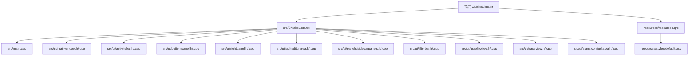

图表来源
- [CMakeLists.txt](file://CMakeLists.txt)
- [src/CMakeLists.txt](file://src/CMakeLists.txt)
- [src/main.cpp](file://src/main.cpp)
- [src/ui/mainwindow.h](file://src/ui/mainwindow.h)
- [src/ui/mainwindow.cpp](file://src/ui/mainwindow.cpp)
- [src/ui/activitybar.h](file://src/ui/activitybar.h)
- [src/ui/activitybar.cpp](file://src/ui/activitybar.cpp)
- [src/ui/bottompanel.h](file://src/ui/bottompanel.h)
- [src/ui/bottompanel.cpp](file://src/ui/bottompanel.cpp)
- [src/ui/rightpanel.h](file://src/ui/rightpanel.h)
- [src/ui/rightpanel.cpp](file://src/ui/rightpanel.cpp)
- [src/ui/spliteditorarea.h](file://src/ui/spliteditorarea.h)
- [src/ui/spliteditorarea.cpp](file://src/ui/spliteditorarea.cpp)
- [src/ui/panels/sidebarpanels.h](file://src/ui/panels/sidebarpanels.h)
- [src/ui/panels/sidebarpanels.cpp](file://src/ui/panels/sidebarpanels.cpp)
- [src/ui/filterbar.h](file://src/ui/filterbar.h)
- [src/ui/filterbar.cpp](file://src/ui/filterbar.cpp)
- [src/ui/graphicview.h](file://src/ui/graphicview.h)
- [src/ui/graphicview.cpp](file://src/ui/graphicview.cpp)
- [src/ui/traceview.h](file://src/ui/traceview.h)
- [src/ui/traceview.cpp](file://src/ui/traceview.cpp)
- [src/ui/signalconfigdialog.h](file://src/ui/signalconfigdialog.h)
- [src/ui/signalconfigdialog.cpp](file://src/ui/signalconfigdialog.cpp)
- [resources/resources.qrc](file://resources/resources.qrc)
- [resources/styles/default.qss](file://resources/styles/default.qss)

章节来源
- [CMakeLists.txt](file://CMakeLists.txt)
- [README.en.md](file://README.en.md)

## 核心组件
- 应用入口 main.cpp: 初始化Qt应用实例、设置全局样式、创建并显示主窗口
- 主窗口 MainWindow: 承载UI树、管理布局与交互逻辑、加载QSS与主题切换
- QSS样式 default.qss: 集中式样式表，统一外观与主题基础
- Qt资源 resources.qrc: 将样式与图标等资源打包进应用，便于分发与加载

**更新** 现在明确区分了Qt Designer生成的UI文件与手写C++代码的职责边界，形成清晰的混合开发模式，并新增了活动栏、底部面板、右侧面板、分割编辑器区域和增强的侧边栏面板系统等核心UI组件。

章节来源
- [src/main.cpp](file://src/main.cpp)
- [src/ui/mainwindow.h](file://src/ui/mainwindow.h)
- [src/ui/mainwindow.cpp](file://src/ui/mainwindow.cpp)
- [resources/styles/default.qss](file://resources/styles/default.qss)
- [resources/resources.qrc](file://resources/resources.qrc)

## 架构总览
整体采用"入口初始化 + 主窗口容器 + 样式/资源分离"的架构模式：
- 入口负责生命周期与全局样式注入
- 主窗口作为UI根节点，组织子控件与布局
- 样式通过QSS集中管理，支持运行时切换
- 资源通过qrc统一打包，避免路径问题

**更新** 架构现已明确包含Qt Designer XML布局系统与C++代码的混合模式，实现了可视化设计与程序逻辑的有效分离，并集成了活动栏、底部面板、右侧面板、分割编辑器区域和增强的侧边栏面板系统等多个专业UI组件。

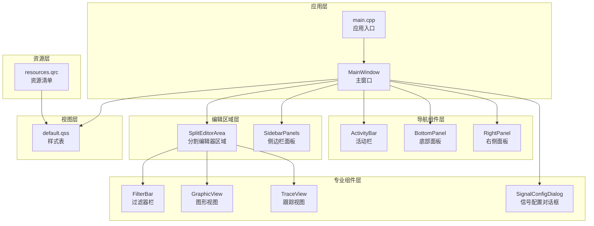

图表来源
- [src/main.cpp](file://src/main.cpp)
- [src/ui/mainwindow.h](file://src/ui/mainwindow.h)
- [src/ui/mainwindow.cpp](file://src/ui/mainwindow.cpp)
- [src/ui/activitybar.h](file://src/ui/activitybar.h)
- [src/ui/activitybar.cpp](file://src/ui/activitybar.cpp)
- [src/ui/bottompanel.h](file://src/ui/bottompanel.h)
- [src/ui/bottompanel.cpp](file://src/ui/bottompanel.cpp)
- [src/ui/rightpanel.h](file://src/ui/rightpanel.h)
- [src/ui/rightpanel.cpp](file://src/ui/rightpanel.cpp)
- [src/ui/spliteditorarea.h](file://src/ui/spliteditorarea.h)
- [src/ui/spliteditorarea.cpp](file://src/ui/spliteditorarea.cpp)
- [src/ui/panels/sidebarpanels.h](file://src/ui/panels/sidebarpanels.h)
- [src/ui/panels/sidebarpanels.cpp](file://src/ui/panels/sidebarpanels.cpp)
- [src/ui/filterbar.h](file://src/ui/filterbar.h)
- [src/ui/filterbar.cpp](file://src/ui/filterbar.cpp)
- [src/ui/graphicview.h](file://src/ui/graphicview.h)
- [src/ui/graphicview.cpp](file://src/ui/graphicview.cpp)
- [src/ui/traceview.h](file://src/ui/traceview.h)
- [src/ui/traceview.cpp](file://src/ui/traceview.cpp)
- [src/ui/signalconfigdialog.h](file://src/ui/signalconfigdialog.h)
- [src/ui/signalconfigdialog.cpp](file://src/ui/signalconfigdialog.cpp)
- [resources/styles/default.qss](file://resources/styles/default.qss)
- [resources/resources.qrc](file://resources/resources.qrc)

## 详细组件分析

### 应用入口（main.cpp）
职责与流程
- 创建 QApplication 实例
- 设置全局字体与高DPI支持
- 加载默认QSS样式
- 构造并显示主窗口
- 进入事件循环

关键要点
- 样式加载应在主窗口显示前完成，确保首次渲染即应用主题
- 高DPI与字体设置影响后续所有控件的绘制与度量

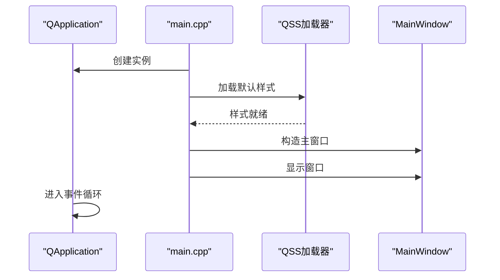

图表来源
- [src/main.cpp](file://src/main.cpp)

章节来源
- [src/main.cpp](file://src/main.cpp)

### 主窗口（MainWindow）
职责与交互
- 作为UI根节点，组织控件树与布局
- 处理用户输入与业务事件转发
- 管理主题切换与样式动态更新
- 与资源系统协作加载图标、图片等

类关系与数据流
- 继承自 QWidget/QMainWindow（由 .ui 生成基类）
- 持有样式管理器与主题配置
- 通过信号槽机制与子控件通信

**更新** MainWindow现在通过混合架构模式工作：Qt Designer生成的UI类负责界面结构，而手写的C++代码负责业务逻辑和交互处理，并集成了活动栏、底部面板、右侧面板、分割编辑器区域和增强的侧边栏面板系统等多个专业UI组件。

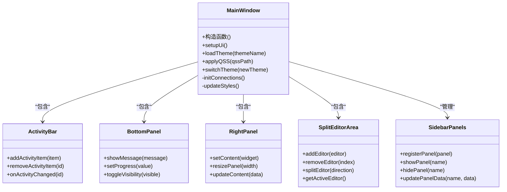

图表来源
- [src/ui/mainwindow.h](file://src/ui/mainwindow.h)
- [src/ui/mainwindow.cpp](file://src/ui/mainwindow.cpp)
- [src/ui/activitybar.h](file://src/ui/activitybar.h)
- [src/ui/bottompanel.h](file://src/ui/bottompanel.h)
- [src/ui/rightpanel.h](file://src/ui/rightpanel.h)
- [src/ui/spliteditorarea.h](file://src/ui/spliteditorarea.h)
- [src/ui/panels/sidebarpanels.h](file://src/ui/panels/sidebarpanels.h)

章节来源
- [src/ui/mainwindow.h](file://src/ui/mainwindow.h)
- [src/ui/mainwindow.cpp](file://src/ui/mainwindow.cpp)

### 样式系统（QSS与主题管理）
设计理念
- 集中式样式表：通过单一QSS文件管理全局外观
- 主题机制：以主题为单位切换样式集，支持运行时热更新
- 动态更新：不重建控件的前提下刷新样式

样式加载与切换流程

图表来源
- [resources/styles/default.qss](file://resources/styles/default.qss)
- [resources/resources.qrc](file://resources/resources.qrc)

章节来源
- [resources/styles/default.qss](file://resources/styles/default.qss)
- [resources/resources.qrc](file://resources/resources.qrc)

### 资源系统（resources.qrc）
组织原则
- 将样式、图标、字体等静态资源纳入qrc清单
- 通过:/前缀在代码中引用，避免平台路径差异
- 便于打包与版本化管理

常用用法
- 在样式表中引用资源：url(:/styles/default.qss)
- 在代码中加载资源：QFile(":/...")

章节来源
- [resources/resources.qrc](file://resources/resources.qrc)

### 多语言支持
策略与建议
- 使用Qt Linguist进行翻译管理
- 通过tr()/translate()包裹用户可见文本
- 运行时根据locale切换语言包
- 与主题系统解耦，避免样式与文案耦合

章节来源
- [README.en.md](file://README.en.md)

## 新增专业组件

### 活动栏（ActivityBar）
功能特性
- 提供主要功能模块的快速导航
- 支持图标按钮与状态指示
- 动态添加与移除活动项
- 响应式布局适配不同屏幕尺寸

架构设计
- 继承自QWidget，提供垂直布局的活动项列表
- 通过信号槽机制与主窗口通信
- 支持自定义活动项类型与行为

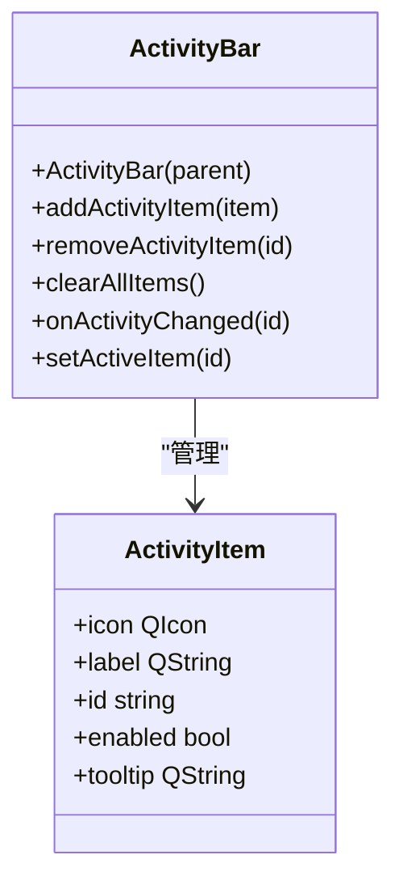

图表来源
- [src/ui/activitybar.h](file://src/ui/activitybar.h)
- [src/ui/activitybar.cpp](file://src/ui/activitybar.cpp)

章节来源
- [src/ui/activitybar.h](file://src/ui/activitybar.h)
- [src/ui/activitybar.cpp](file://src/ui/activitybar.cpp)

### 底部面板（BottomPanel）
功能特性
- 显示状态信息、日志消息和进度指示
- 支持消息分类与颜色编码
- 可折叠/展开的动态布局
- 实时日志输出与搜索功能

技术实现
- 基于QTextEdit或QPlainTextEdit的消息显示
- 支持富文本格式与语法高亮
- 异步消息更新避免界面卡顿

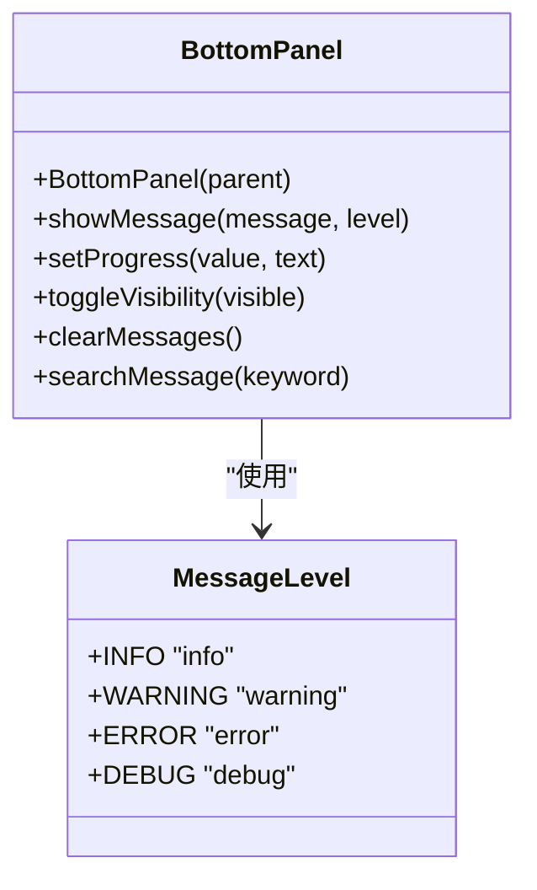

图表来源
- [src/ui/bottompanel.h](file://src/ui/bottompanel.h)
- [src/ui/bottompanel.cpp](file://src/ui/bottompanel.cpp)

章节来源
- [src/ui/bottompanel.h](file://src/ui/bottompanel.h)
- [src/ui/bottompanel.cpp](file://src/ui/bottompanel.cpp)

### 右侧面板（RightPanel）
功能特性
- 提供上下文相关的属性编辑与配置界面
- 支持动态内容替换与实时更新
- 可调整宽度的响应式布局
- 与主编辑区域的同步更新

布局管理
- 基于QSplitter的可调整分割布局
- 支持最小/最大宽度限制
- 面板状态的持久化保存

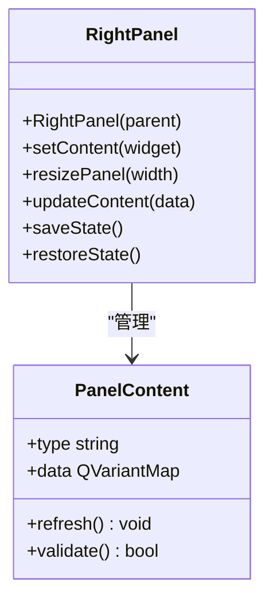

图表来源
- [src/ui/rightpanel.h](file://src/ui/rightpanel.h)
- [src/ui/rightpanel.cpp](file://src/ui/rightpanel.cpp)

章节来源
- [src/ui/rightpanel.h](file://src/ui/rightpanel.h)
- [src/ui/rightpanel.cpp](file://src/ui/rightpanel.cpp)

### 分割编辑器区域（SplitEditorArea）
功能特性
- 支持多文档编辑器的分割显示
- 动态添加与删除编辑器标签页
- 水平与垂直分割布局
- 编辑器间的同步滚动与操作

编辑器管理
- 基于QTabWidget的多标签页管理
- 支持编辑器的拖拽重排序
- 自动保存编辑器状态

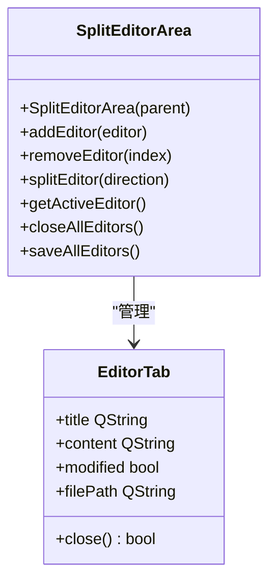

图表来源
- [src/ui/spliteditorarea.h](file://src/ui/spliteditorarea.h)
- [src/ui/spliteditorarea.cpp](file://src/ui/spliteditorarea.cpp)

章节来源
- [src/ui/spliteditorarea.h](file://src/ui/spliteditorarea.h)
- [src/ui/spliteditorarea.cpp](file://src/ui/spliteditorarea.cpp)

### 过滤器栏（FilterBar）
功能特性
- 提供CAN总线数据的实时过滤功能
- 支持多种过滤条件组合
- 动态更新过滤规则
- 与数据模型无缝集成

架构设计
- 继承自QWidget，提供独立的过滤界面
- 通过信号槽机制与主窗口通信
- 支持自定义过滤算法扩展

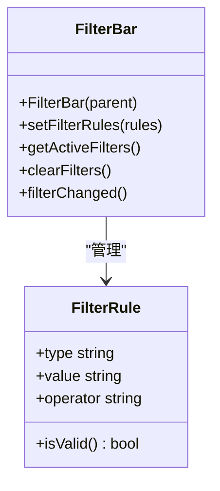

图表来源
- [src/ui/filterbar.h](file://src/ui/filterbar.h)
- [src/ui/filterbar.cpp](file://src/ui/filterbar.cpp)

章节来源
- [src/ui/filterbar.h](file://src/ui/filterbar.h)
- [src/ui/filterbar.cpp](file://src/ui/filterbar.cpp)

### 图形视图（GraphicView）
功能特性
- 提供CAN信号的可视化图形显示
- 支持实时波形绘制与缩放
- 多通道信号对比显示
- 交互式数据点标注

技术实现
- 基于QGraphicsView框架
- 自定义QGraphicsItem实现信号绘制
- 高性能的实时更新机制

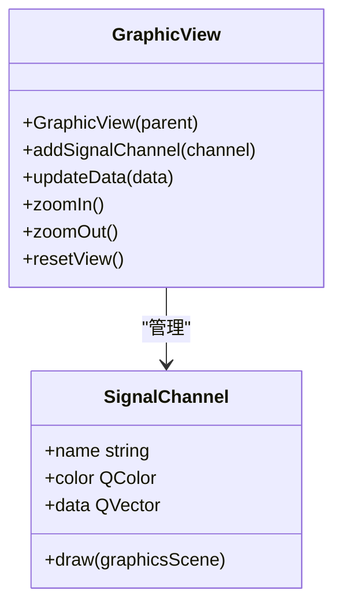

图表来源
- [src/ui/graphicview.h](file://src/ui/graphicview.h)
- [src/ui/graphicview.cpp](file://src/ui/graphicview.cpp)

章节来源
- [src/ui/graphicview.h](file://src/ui/graphicview.h)
- [src/ui/graphicview.cpp](file://src/ui/graphicview.cpp)

### 跟踪视图（TraceView）
功能特性
- 显示CAN总线数据包的详细跟踪信息
- 支持时间轴滚动查看
- 数据包颜色编码与状态标识
- 搜索与筛选功能

数据管理
- 高效的数据存储与检索
- 内存优化的大数据集处理
- 异步数据加载与显示

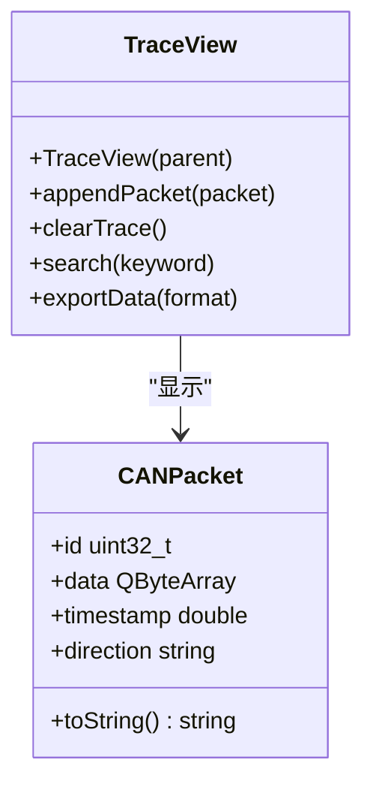

图表来源
- [src/ui/traceview.h](file://src/ui/traceview.h)
- [src/ui/traceview.cpp](file://src/ui/traceview.cpp)

章节来源
- [src/ui/traceview.h](file://src/ui/traceview.h)
- [src/ui/traceview.cpp](file://src/ui/traceview.cpp)

### 信号配置对话框（SignalConfigDialog）
功能特性
- 提供CAN信号参数的配置界面
- 支持信号格式定义与验证
- 批量导入导出配置
- 配置模板管理

交互设计
- 表单驱动的配置文件编辑
- 实时验证与错误提示
- 撤销/重做操作支持

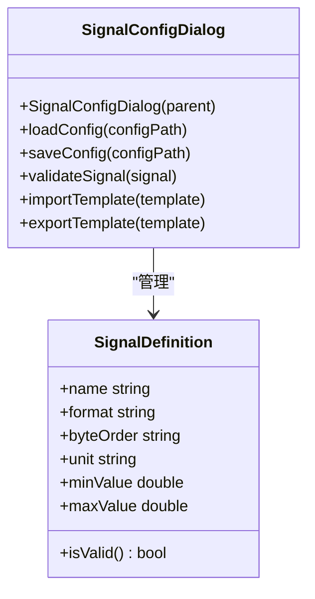

图表来源
- [src/ui/signalconfigdialog.h](file://src/ui/signalconfigdialog.h)
- [src/ui/signalconfigdialog.cpp](file://src/ui/signalconfigdialog.cpp)

章节来源
- [src/ui/signalconfigdialog.h](file://src/ui/signalconfigdialog.h)
- [src/ui/signalconfigdialog.cpp](file://src/ui/signalconfigdialog.cpp)

### Qt Designer与C++混合开发模式
**更新** 混合架构的核心优势与实践：

#### 职责分离
- **Qt Designer (.ui)**: 负责界面结构、控件布局、属性设置
- **C++代码**: 负责业务逻辑、事件处理、数据绑定

#### 代码生成机制
- 编译时uic工具将.ui文件转换为C++头文件
- 生成的类继承自相应Widget基类
- setupUi()方法自动初始化界面元素

#### 开发工作流程

图表来源
- [src/ui/mainwindow.h](file://src/ui/mainwindow.h)
- [src/ui/mainwindow.cpp](file://src/ui/mainwindow.cpp)

章节来源
- [src/ui/mainwindow.h](file://src/ui/mainwindow.h)
- [src/ui/mainwindow.cpp](file://src/ui/mainwindow.cpp)

## 增强面板系统

### 侧边栏面板系统（SidebarPanels）
功能特性
- 动态注册与管理多个侧边栏面板
- 支持面板的显示/隐藏切换
- 面板间的数据共享与通信
- 面板布局的自适应调整

架构设计
- 基于QStackedWidget的面板堆栈管理
- 信号槽机制实现面板间通信
- 支持面板配置的持久化存储

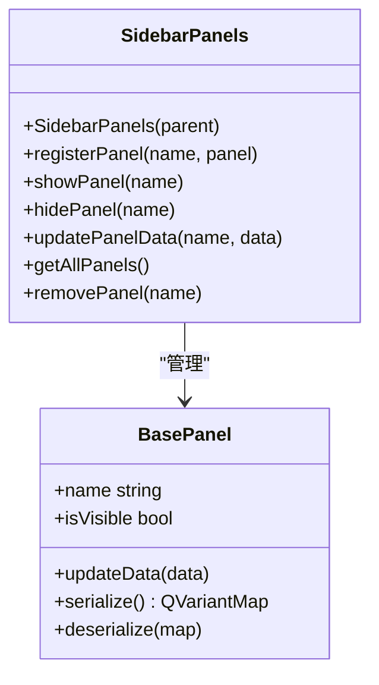

图表来源
- [src/ui/panels/sidebarpanels.h](file://src/ui/panels/sidebarpanels.h)
- [src/ui/panels/sidebarpanels.cpp](file://src/ui/panels/sidebarpanels.cpp)

章节来源
- [src/ui/panels/sidebarpanels.h](file://src/ui/panels/sidebarpanels.h)
- [src/ui/panels/sidebarpanels.cpp](file://src/ui/panels/sidebarpanels.cpp)

### 响应式布局设计
布局策略
- 基于QLayoutManager的自适应布局
- 支持不同屏幕尺寸的动态调整
- 面板宽度的智能分配与恢复
- 拖拽调整面板大小的交互体验

布局管理
- 使用QSplitter实现可调整的分隔布局
- 支持面板的最小/最大尺寸限制
- 布局状态的保存与恢复机制

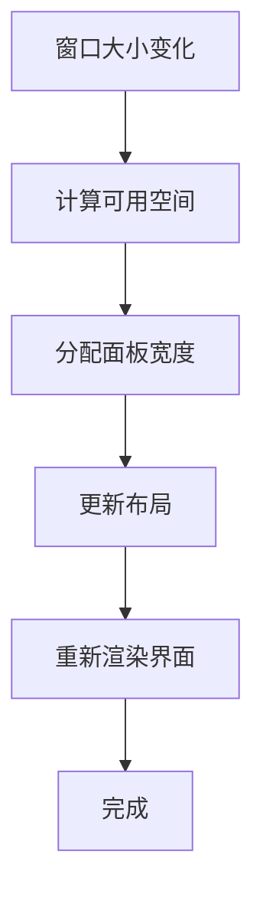

[无图表来源 - 概念性流程图]

## 依赖关系分析
模块间依赖与耦合
- main.cpp 依赖样式加载与主窗口
- MainWindow 依赖样式与主题管理
- 样式与资源通过qrc解耦，降低硬编码路径风险

**更新** 现在明确包含了Qt Designer生成的UI类与手写C++代码之间的依赖关系，以及新增专业组件之间的依赖关系，包括活动栏、底部面板、右侧面板、分割编辑器区域和侧边栏面板系统。

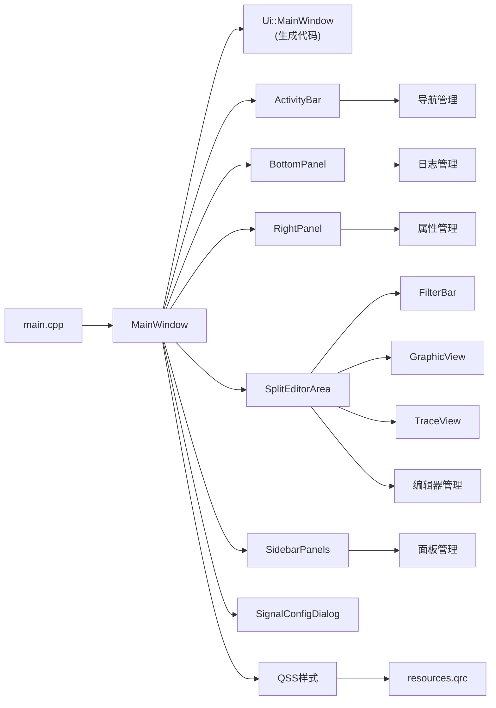

图表来源
- [src/main.cpp](file://src/main.cpp)
- [src/ui/mainwindow.h](file://src/ui/mainwindow.h)
- [src/ui/mainwindow.cpp](file://src/ui/mainwindow.cpp)
- [src/ui/activitybar.h](file://src/ui/activitybar.h)
- [src/ui/bottompanel.h](file://src/ui/bottompanel.h)
- [src/ui/rightpanel.h](file://src/ui/rightpanel.h)
- [src/ui/spliteditorarea.h](file://src/ui/spliteditorarea.h)
- [src/ui/panels/sidebarpanels.h](file://src/ui/panels/sidebarpanels.h)
- [src/ui/filterbar.h](file://src/ui/filterbar.h)
- [src/ui/graphicview.h](file://src/ui/graphicview.h)
- [src/ui/traceview.h](file://src/ui/traceview.h)
- [src/ui/signalconfigdialog.h](file://src/ui/signalconfigdialog.h)
- [resources/resources.qrc](file://resources/resources.qrc)

章节来源
- [src/CMakeLists.txt](file://src/CMakeLists.txt)
- [CMakeLists.txt](file://CMakeLists.txt)

## 性能考虑
- 样式加载
  - 仅在必要时重新加载QSS，避免频繁解析
  - 使用增量更新或合并样式减少重复计算
- 布局与绘制
  - 优先使用布局管理器，减少手动几何计算
  - 避免在事件循环中进行耗时操作，使用异步任务
- 资源管理
  - 将大资源按需加载，避免一次性载入
  - 合理使用缓存，减少重复I/O
- 高DPI与缩放
  - 启用高DPI支持，合理设置像素密度
  - 对矢量图标与自适应布局进行验证
- **Qt Designer优化**
  - 避免在.ui文件中定义复杂的动画或过渡效果
  - 合理使用布局嵌套层级，避免过深的控件树
  - 利用Qt Creator的性能分析工具识别瓶颈
- **专业组件性能优化**
  - 图形视图使用双缓冲技术减少闪烁
  - 跟踪视图实现数据分页加载
  - 过滤器栏使用高效的匹配算法
  - 对话框采用延迟初始化策略
- **新增组件性能考虑**
  - 活动栏使用懒加载避免初始性能开销
  - 底部面板的消息显示采用异步更新
  - 右侧面板的内容切换使用虚拟化技术
  - 分割编辑器区域实现编辑器的按需创建
  - 侧边栏面板系统优化面板切换性能

[本节为通用指导，无需特定文件引用]

## 故障排查指南
常见问题与定位方法
- 样式未生效
  - 检查QSS路径是否正确，是否通过qrc正确打包
  - 确认样式加载时机在主窗口显示之前
- 主题切换无效
  - 校验新样式语法，捕获解析异常
  - 确保应用了正确的对象名称与选择器
- 资源加载失败
  - 核对qrc中的路径大小写与相对路径
  - 使用:/前缀访问资源，避免平台差异
- 多语言文本未替换
  - 确认已调用tr()包裹文本
  - 检查翻译文件是否被正确加载与安装
- **Qt Designer相关问题**
  - 检查.ui文件格式是否正确，XML语法是否有误
  - 确认生成的头文件未被意外修改
  - 验证控件名称与C++代码中的引用一致
- **专业组件问题**
  - 过滤器规则语法错误导致匹配失败
  - 图形视图数据更新卡顿需要优化渲染
  - 跟踪视图内存占用过高需要清理缓冲
  - 信号配置对话框验证失败需要检查参数格式
- **新增组件问题**
  - 活动栏图标加载失败需要检查资源路径
  - 底部面板消息显示异常需要检查文本编码
  - 右侧面板内容切换卡顿需要优化数据绑定
  - 分割编辑器区域布局错乱需要检查约束设置
  - 侧边栏面板系统面板注册失败需要检查命名冲突

章节来源
- [resources/styles/default.qss](file://resources/styles/default.qss)
- [resources/resources.qrc](file://resources/resources.qrc)

## 结论
本UI系统以Qt Widgets为基础，采用清晰的入口-主窗口-样式-资源分层架构，结合QSS与主题管理实现灵活的外观定制与动态更新。通过qrc统一管理资源，提升可移植性与可维护性。**特别重要的是，通过Qt Designer XML布局系统与手写C++代码的混合架构模式，实现了界面设计与业务逻辑的有效分离，既保证了开发效率，又提升了代码的可维护性。**新增的专业组件进一步增强了系统的功能完整性，包括活动栏、底部面板、右侧面板、分割编辑器区域和增强的侧边栏面板系统，为CAN总线数据分析提供了完整的解决方案。遵循本文档的组件规范、样式指南与性能建议，可在保证用户体验的同时，提高开发效率与系统稳定性。

[本节为总结性内容，无需特定文件引用]

## 附录

### UI组件开发规范
- 命名与结构
  - 控件命名语义化，便于样式选择器与自动化测试定位
  - 将复杂交互逻辑下沉至C++，保持.ui简洁
- 布局策略
  - 优先使用布局管理器，避免绝对坐标
  - 针对小屏幕与高DPI进行适配验证
- 样式定制
  - 使用统一的QSS变量与命名空间
  - 避免过度嵌套选择器，提升解析性能
- 可访问性
  - 设置合适的角色、提示与键盘导航
  - 确保颜色对比度符合无障碍标准
- **Qt Designer规范**
  - 合理组织控件层次结构，避免过深嵌套
  - 使用有意义的对象名称，便于样式和脚本访问
  - 充分利用布局管理器的自适应特性
- **专业组件规范**
  - 过滤器组件应支持链式过滤规则
  - 图形视图需实现高性能的实时更新
  - 跟踪视图应具备大数据处理能力
  - 配置对话框需提供完善的验证机制
- **新增组件规范**
  - 活动栏应支持动态添加与移除活动项
  - 底部面板需实现异步消息更新机制
  - 右侧面板应具备可调整的宽度与状态持久化
  - 分割编辑器区域需支持多文档编辑与同步操作
  - 侧边栏面板系统应提供灵活的注册与管理接口

### 样式定制指南
- 主题设计
  - 以主题为单位组织QSS，支持运行时切换
  - 使用一致的调色板与尺寸规范
- 动态更新
  - 提供接口在不重建控件的情况下刷新样式
  - 对样式变更进行最小化重绘
- 资源引用
  - 通过qrc统一引用图标与字体
  - 避免在样式中使用绝对路径

### 设计模式与最佳实践
- 观察者模式
  - 通过信号槽实现松耦合的事件通知
- 策略模式
  - 将不同主题或布局策略抽象为可替换的策略对象
- 工厂模式
  - 统一创建具有相同样式的控件实例
- 单例模式
  - 主题管理器与样式管理器可采用单例，确保全局一致性
- **混合开发模式最佳实践**
  - 保持.ui文件只包含界面定义，不包含业务逻辑
  - 在C++代码中通过setupUi()访问生成的UI元素
  - 使用信号槽机制连接UI事件与业务处理方法
  - 定期同步UI设计师与开发者的工作成果
- **专业组件最佳实践**
  - 过滤器组件应支持动态规则添加与删除
  - 图形视图需实现平滑的缩放与平移操作
  - 跟踪视图应采用内存池管理大数据集
  - 配置对话框需提供撤销/重做功能
- **新增组件最佳实践**
  - 活动栏应支持图标与文本的动态更新
  - 底部面板需实现消息级别的样式区分
  - 右侧面板应提供内容切换的动画效果
  - 分割编辑器区域需支持编辑器的拖拽重排
  - 侧边栏面板系统应实现面板状态的自动保存

### Qt Designer工作流程
**更新** 推荐的Qt Designer使用流程：

1. **界面原型设计**：使用拖拽工具快速搭建界面框架
2. **布局优化**：调整控件位置和布局参数
3. **属性配置**：设置控件的基本属性和样式
4. **代码生成**：编译项目生成C++头文件
5. **逻辑实现**：在手写的C++代码中添加业务逻辑
6. **迭代完善**：返回Designer调整界面，重复上述流程
7. **专业组件集成**：将专业组件嵌入到主界面中
8. **性能调优**：针对大数据量场景进行性能优化
9. **响应式适配**：测试不同屏幕尺寸下的布局表现
10. **主题验证**：验证样式在不同主题下的显示效果

章节来源
- [src/ui/mainwindow.h](file://src/ui/mainwindow.h)
- [src/ui/mainwindow.cpp](file://src/ui/mainwindow.cpp)