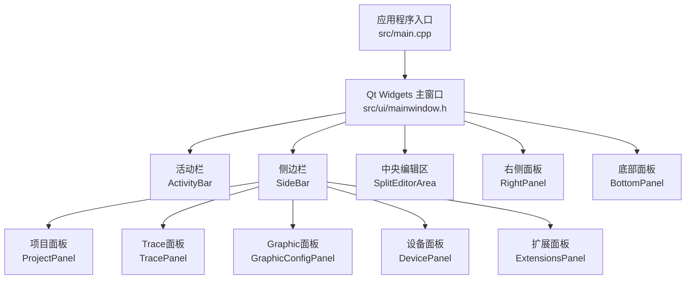
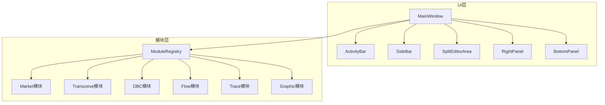
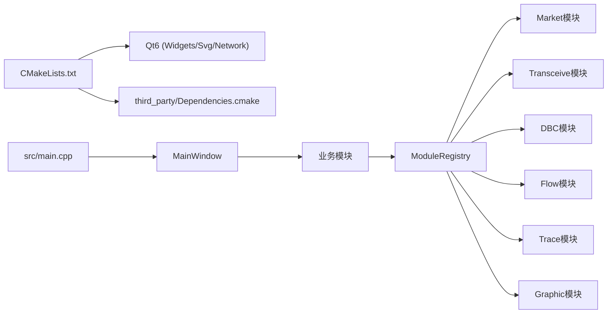

# Qt Widgets界面系统

<cite>
**本文引用的文件**
- [README.md](file://README.md)
- [CMakeLists.txt](file://CMakeLists.txt)
- [src/main.cpp](file://src/main.cpp)
- [src/ui/mainwindow.h](file://src/ui/mainwindow.h)
- [src/ui/mainwindow.cpp](file://src/ui/mainwindow.cpp)
- [src/ui/activitybar.h](file://src/ui/activitybar.h)
- [src/ui/bottompanel.h](file://src/ui/bottompanel.h)
- [src/ui/rightpanel.h](file://src/ui/rightpanel.h)
- [src/ui/spliteditorarea.h](file://src/ui/spliteditorarea.h)
- [src/ui/panels/sidebarpanels.h](file://src/ui/panels/sidebarpanels.h)
</cite>

## 更新摘要
**变更内容**
- 移除了所有QML相关组件和架构描述
- 更新了项目结构说明，反映纯Qt Widgets架构
- 重构了核心组件分析，专注于原生Qt控件实现
- 更新了架构图表以反映当前技术栈
- 移除了QML迁移相关内容

## 目录
1. [简介](#简介)
2. [项目结构](#项目结构)
3. [核心组件](#核心组件)
4. [架构总览](#架构总览)
5. [详细组件分析](#详细组件分析)
6. [依赖关系分析](#依赖关系分析)
7. [性能与可维护性](#性能与可维护性)
8. [故障排查指南](#故障排查指南)
9. [结论](#结论)
10. [附录](#附录)

## 简介
本项目是一个面向 CAN/CAN FD 报文分析的桌面应用，采用纯 Qt Widgets 架构构建。主界面基于 VS Code 风格的现代布局，包含菜单栏、活动栏、侧边栏、中央编辑区、右侧面板和底部面板等组件。应用通过模块化的设计将业务功能拆分为独立的 DLL 模块（市场、收发、DBC、流程、Trace、Graphic），并通过 ModuleRegistry 进行统一管理和调度。

## 项目结构
- 顶层构建配置使用 Qt6 Widgets/Svg/Network 模块，不包含 Qt Quick/QML 依赖
- 主窗口位于 src/ui，采用模块化拆分方案（B6瘦身）
- 业务功能通过插件化架构实现，支持动态加载和卸载
- 侧边栏面板提供工程、Trace、Graphic、设备连接等功能入口

**图表来源**
- [src/main.cpp:21-79](file://src/main.cpp#L21-L79)
- [src/ui/mainwindow.h:43-55](file://src/ui/mainwindow.h#L43-L55)
- [src/ui/activitybar.h:9-62](file://src/ui/activitybar.h#L9-L62)
- [src/ui/panels/sidebarpanels.h:377-413](file://src/ui/panels/sidebarpanels.h#L377-L413)

**章节来源**
- [CMakeLists.txt:69-84](file://CMakeLists.txt#L69-L84)
- [src/main.cpp:21-79](file://src/main.cpp#L21-L79)

## 核心组件
- **主窗口（MainWindow）**：VS Code 风格的主容器，管理菜单栏、工具栏、状态栏和各面板的布局与交互
- **活动栏（ActivityBar）**：左侧窄条导航栏，提供功能切换按钮（项目、分析、设备、Trace、Graphic、DBC、收发、扩展、设置）
- **侧边栏（SideBar）**：基于 QStackedWidget 的面板容器，根据活动栏选择显示对应面板
- **中央编辑区（SplitEditorArea）**：支持标签页拆分、分离和重新组合的高级编辑器区域
- **右侧面板（RightPanel）**：集成 AI 对话、快捷操作按钮和书签管理功能
- **底部面板（BottomPanel）**：终端、输出、问题和插件输出的多标签面板

**章节来源**
- [src/ui/mainwindow.h:56-326](file://src/ui/mainwindow.h#L56-L326)
- [src/ui/activitybar.h:15-62](file://src/ui/activitybar.h#L15-L62)
- [src/ui/panels/sidebarpanels.h:383-413](file://src/ui/panels/sidebarpanels.h#L383-L413)
- [src/ui/spliteditorarea.h:46-101](file://src/ui/spliteditorarea.h#L46-L101)
- [src/ui/rightpanel.h:16-64](file://src/ui/rightpanel.h#L16-L64)
- [src/ui/bottompanel.h:16-51](file://src/ui/bottompanel.h#L16-L51)

## 架构总览
采用纯 Qt Widgets 架构，通过模块化设计实现功能解耦。主窗口作为协调者，通过 ModuleRegistry 管理各业务模块的生命周期和通信。

**图表来源**
- [src/ui/mainwindow.cpp:90-96](file://src/ui/mainwindow.cpp#L90-L96)
- [src/main.cpp:41-54](file://src/main.cpp#L41-L54)

## 详细组件分析

### 主窗口（MainWindow）
主窗口采用模块化拆分方案，将复杂的构造函数和逻辑分解到多个文件中：
- **mainwindow.cpp**：壳核心，负责构造编排和模块调度
- **mainwindow_setup.cpp**：分阶段装配服务、插件、数据管线和侧边栏
- **mainwindow_chrome.cpp**：窗口骨架，包括菜单栏、窗口按钮、布局和状态栏
- **mainwindow_actions.cpp**：用户动作处理，如录制、回放、导入等
- **mainwindow_frameflow.cpp**：数据流处理，包括帧管线、回放进度和信号联动
- **mainwindow_pages.cpp**：页面打开槽函数，管理各功能页面的创建和显示
- **mainwindow_project.cpp**：工程与会话生命周期管理
- **mainwindow_dialogs.cpp**：帮助对话框和插件集成

**章节来源**
- [src/ui/mainwindow.h:43-55](file://src/ui/mainwindow.h#L43-L55)
- [src/ui/mainwindow.cpp:90-127](file://src/ui/mainwindow.cpp#L90-L127)

### 活动栏（ActivityBar）
VS Code 风格的左侧活动栏，提供功能导航：
- 窄竖条设计（48px宽度），放置功能图标按钮
- 支持点击切换 SideBar 显示的面板
- 再次点击同一按钮可隐藏 SideBar
- 内置 Activity 枚举定义各种功能区域

**章节来源**
- [src/ui/activitybar.h:9-62](file://src/ui/activitybar.h#L9-L62)

### 侧边栏面板系统
基于 QStackedWidget 的面板管理系统：
- **SidePanel 基类**：提供统一的标题栏样式和内容布局
- **ProjectPanel**：工程上下文数据管理，支持项目列表、最近文件和预览
- **TracePanel**：Trace 模板平铺和实例列表管理
- **GraphicConfigPanel**：Graphic 配置面板，支持模板选择和信号添加
- **DevicePanel**：设备连接面板，显示设备系列树和扫描功能
- **TransceivePanel**：收发功能入口，包括发送、回放、离线分析和录制
- **ExtensionsPanel**：扩展面板，集成插件市场和命令列表

**章节来源**
- [src/ui/panels/sidebarpanels.h:30-413](file://src/ui/panels/sidebarpanels.h#L30-L413)

### 中央编辑区（SplitEditorArea）
高级标签页管理组件：
- 支持右键标签页创建并排视图（Split Right / Split Down）
- 每个拆分组是独立的 QTabWidget，组间用 QSplitter 分隔
- 支持拖拽标签页到主窗口外分离为独立窗口
- 自动清理空组和标签页重放功能
- 集成 SVG 关闭按钮和 Pin/关闭操作

**章节来源**
- [src/ui/spliteditorarea.h:9-101](file://src/ui/spliteditorarea.h#L9-L101)

### 右侧面板（RightPanel）
多功能右侧面板：
- **AI 对话**：集成聊天消息显示和输入功能
- **快捷按钮**：录制、播放、暂停、停止、清除、自动滚动、连接/断开
- **书签管理**：支持书签列表显示和跳转功能
- 通过信号机制与主窗口和其他组件通信

**章节来源**
- [src/ui/rightpanel.h:13-64](file://src/ui/rightpanel.h#L13-L64)

### 底部面板（BottomPanel）
多标签调试和信息面板：
- **终端标签**：集成命令行输入，支持 help/clear/sim/record/play/filter 等命令
- **输出标签**：显示程序运行输出信息
- **问题标签**：显示错误和警告信息表格
- **插件标签**：显示插件输出信息

**章节来源**
- [src/ui/bottompanel.h:11-51](file://src/ui/bottompanel.h#L11-L51)

## 依赖关系分析
- **构建系统**：使用 Qt6 Widgets/Svg/Network 模块，不依赖 Qt Quick/QML
- **运行时依赖**：Qt6 标准库，第三方依赖通过 Dependencies.cmake 管理
- **模块耦合**：通过 ModuleRegistry 实现松耦合的模块通信
- **插件架构**：支持动态加载的业务模块和驱动插件

**图表来源**
- [CMakeLists.txt:69-84](file://CMakeLists.txt#L69-L84)
- [src/main.cpp:41-54](file://src/main.cpp#L41-L54)

**章节来源**
- [CMakeLists.txt:69-84](file://CMakeLists.txt#L69-L84)
- [src/main.cpp:21-79](file://src/main.cpp#L21-L79)

## 性能与可维护性
- **渲染性能**：使用原生 Qt Widgets 控件，避免 QML 引擎开销
- **启动时间**：直接加载 Qt 资源，无 QML 解析延迟
- **内存管理**：通过 Qt 对象树自动管理内存，配合智能指针和析构函数
- **可维护性**：模块化设计使代码职责清晰，便于测试和维护
- **扩展性**：插件架构支持功能动态扩展，无需重新编译主程序

## 故障排查指南
- **界面无法显示**
  - 检查 Qt6 依赖是否正确安装
  - 确认主题资源文件路径正确
  - 查看日志输出定位初始化失败原因
- **模块加载失败**
  - 检查 ModuleRegistry 中模块注册是否成功
  - 验证业务 DLL 文件是否存在且可加载
  - 确认模块接口实现完整
- **标签页异常**
  - 检查 SplitEditorArea 的标签页生命周期管理
  - 验证标签页关闭时的资源释放
  - 确认信号槽连接正常
- **侧边栏不响应**
  - 检查 ActivityBar 的信号发射
  - 验证 SideBar 的面板切换逻辑
  - 确认面板构造函数执行正常

**章节来源**
- [src/ui/mainwindow.cpp:129-146](file://src/ui/mainwindow.cpp#L129-L146)
- [src/ui/spliteditorarea.h:67-101](file://src/ui/spliteditorarea.h#L67-L101)

## 结论
本项目已成功实现纯 Qt Widgets 架构的桌面应用，提供了完整的 VS Code 风格界面和丰富的功能模块。通过模块化设计和插件架构，实现了良好的可扩展性和可维护性。应用支持多种协议的数据分析、设备连接、实时录制和回放等功能，满足 CAN/CAN FD 报文分析的专业需求。

## 附录
- 模块化实施方案详见 doc/拆分应用实施方案.md
- 插件系统架构参考 doc/插件系统方案.md
- 测试验收方案见 doc/测试验收方案.md

**章节来源**
- [doc/拆分应用实施方案.md](file://doc/拆分应用实施方案.md)
- [doc/插件系统方案.md](file://doc/插件系统方案.md)
- [doc/测试验收方案.md](file://doc/测试验收方案.md)