# UI系统设计

<cite>
**本文档引用的文件**   
- [CMakeLists.txt](file://CMakeLists.txt)
- [README.en.md](file://README.en.md)
- [src/main.cpp](file://src/main.cpp)
- [src/CMakeLists.txt](file://src/CMakeLists.txt)
- [src/ui/mainwindow.h](file://src/ui/mainwindow.h)
- [src/ui/mainwindow.cpp](file://src/ui/mainwindow.cpp)
- [resources/styles/default.qss](file://resources/styles/default.qss)
- [resources/resources.qrc](file://resources/resources.qrc)
- [src/ui/filterbar.h](file://src/ui/filterbar.h)
- [src/ui/filterbar.cpp](file://src/ui/filterbar.cpp)
- [src/ui/graphicview.h](file://src/ui/graphicview.h)
- [src/ui/graphicview.cpp](file://src/ui/graphicview.cpp)
- [src/ui/traceview.h](file://src/ui/traceview.h)
- [src/ui/traceview.cpp](file://src/ui/traceview.cpp)
- [src/ui/signalconfigdialog.h](file://src/ui/signalconfigdialog.h)
- [src/ui/signalconfigdialog.cpp](file://src/ui/signalconfigdialog.cpp)
- [src/ui/activitybar.h](file://src/ui/activitybar.h)
- [src/ui/activitybar.cpp](file://src/ui/activitybar.cpp)
- [src/ui/bottompanel.h](file://src/ui/bottompanel.h)
- [src/ui/bottompanel.cpp](file://src/ui/bottompanel.cpp)
- [src/ui/rightpanel.h](file://src/ui/rightpanel.h)
- [src/ui/rightpanel.cpp](file://src/ui/rightpanel.cpp)
- [src/ui/spliteditorarea.h](file://src/ui/spliteditorarea.h)
- [src/ui/spliteditorarea.cpp](file://src/ui/spliteditorarea.cpp)
- [src/ui/panels/sidebarpanels.h](file://src/ui/panels/sidebarpanels.h)
- [src/ui/panels/sidebarpanels.cpp](file://src/ui/panels/sidebarpanels.cpp)
- [src/ui/dbcdetailtab.h](file://src/ui/dbcdetailtab.h)
- [src/ui/dbcdetailtab.cpp](file://src/ui/dbcdetailtab.cpp)
- [src/ui/playbacktab.h](file://src/ui/playbacktab.h)
- [src/ui/playbacktab.cpp](file://src/ui/playbacktab.cpp)
- [src/ui/recordtab.h](file://src/ui/recordtab.h)
- [src/ui/recordtab.cpp](file://src/ui/recordtab.cpp)
- [UI/ui-prototype.html](file://UI/ui-prototype.html)
- [UI/js/ui-loader.js](file://UI/js/ui-loader.js)
- [UI/js/ui-prototype.js](file://UI/js/ui-prototype.js)
- [UI/css/ui-prototype.css](file://UI/css/ui-prototype.css)
</cite>

## 更新摘要
**所做更改**   
- 基于应用变更更新：graphicview.cpp进行了改进，修复了崩溃问题并优化了图形界面组件以支持新的测试数据集
- 增强了图形视图的稳定性，解决了内存管理和渲染过程中的崩溃问题
- 优化了图形组件对大数据集的支持能力，提升了渲染性能和内存使用效率
- 改进了图形视图的错误处理和异常恢复机制
- 增强了图形组件与测试数据集的兼容性

## 目录
1. [简介](#简介)
2. [项目结构](#项目结构)
3. [核心组件](#核心组件)
4. [架构总览](#架构总览)
5. [详细组件分析](#详细组件分析)
6. [增强图形组件](#增强图形组件)
7. [专用Tab组件系统](#专用Tab组件系统)
8. [依赖关系分析](#依赖关系分析)
9. [性能考虑](#性能考虑)
10. [故障排查指南](#故障排查指南)
11. [结论](#结论)
12. [附录](#附录)

## 简介
本文件面向基于Qt Widgets和现代Web技术的混合UI系统，系统化阐述UI架构模式、组件层次与布局策略；详细说明QSS样式体系、主题管理与动态样式更新；解释资源文件组织、Qt资源系统与多语言支持；并给出响应式设计、可访问性与跨平台兼容性的实践建议。同时提供UI组件开发规范、样式定制指南与性能优化建议，辅以设计模式与最佳实践示例，帮助团队在Qt Widgets项目中构建高质量、可维护且高性能的用户界面。

**更新** 本文档现已重点说明从单体单文件结构到模块化组件系统的完整重构过程，包括新的Web前端原型系统和Qt后端架构的集成模式。新增了基于HTML部分的组件化架构、JavaScript模块系统和CSS样式管理，实现了前后端分离的开发模式和更好的代码组织结构。**特别重要的是，最新的更新针对graphicview.cpp进行了重大改进，修复了崩溃问题并优化了图形界面组件以支持新的测试数据集，显著提升了系统的稳定性和性能。**

## 项目结构
本项目采用分层与按功能划分的组织方式，结合了传统Qt Widgets架构和现代Web前端技术：
- src: Qt C++源代码目录，包含应用入口、主窗口实现与UI描述文件
- UI: Web前端原型目录，包含HTML模板、JavaScript模块和CSS样式
- resources: 静态资源目录，包含QSS样式与Qt资源清单
- CMakeLists.txt: 顶层构建配置，定义目标、链接库与资源集成

```mermaid
graph TB
A["顶层 CMakeLists.txt"] --> B["src/CMakeLists.txt"]
B --> C["src/main.cpp"]
B --> D["src/ui/mainwindow.h/.cpp"]
B --> E["src/ui/activitybar.h/.cpp"]
B --> F["src/ui/bottompanel.h/.cpp"]
B --> G["src/ui/rightpanel.h/.cpp"]
B --> H["src/ui/spliteditorarea.h/.cpp"]
B --> I["src/ui/panels/sidebarpanels.h/.cpp"]
B --> J["src/ui/filterbar.h/.cpp"]
B --> K["src/ui/graphicview.h/.cpp"]
B --> L["src/ui/traceview.h/.cpp"]
B --> M["src/ui/signalconfigdialog.h/.cpp"]
B --> N["src/ui/dbcdetailtab.h/.cpp"]
B --> O["src/ui/playbacktab.h/.cpp"]
B --> P["src/ui/recordtab.h/.cpp"]
A --> Q["resources/resources.qrc"]
Q --> R["resources/styles/default.qss"]
A --> S["UI/ui-prototype.html"]
S --> T["UI/js/ui-loader.js"]
S --> U["UI/js/ui-prototype.js"]
S --> V["UI/css/ui-prototype.css"]
T --> W["UI/partials/*.html"]
U --> X["UI/partials/*.html"]
V --> Y["UI/partials/*.html"]
```

图表来源
- [CMakeLists.txt](file://CMakeLists.txt)
- [src/CMakeLists.txt](file://src/CMakeLists.txt)
- [src/main.cpp](file://src/main.cpp)
- [src/ui/mainwindow.h](file://src/ui/mainwindow.h)
- [src/ui/mainwindow.cpp](file://src/ui/mainwindow.cpp)
- [UI/ui-prototype.html](file://UI/ui-prototype.html)
- [UI/js/ui-loader.js](file://UI/js/ui-loader.js)
- [UI/js/ui-prototype.js](file://UI/js/ui-prototype.js)
- [UI/css/ui-prototype.css](file://UI/css/ui-prototype.css)

章节来源
- [CMakeLists.txt](file://CMakeLists.txt)
- [README.en.md](file://README.en.md)

## 核心组件
- 应用入口 main.cpp: 初始化Qt应用实例、设置全局样式、创建并显示主窗口
- 主窗口 MainWindow: 承载UI树、管理布局与交互逻辑、加载QSS与主题切换
- QSS样式 default.qss: 集中式样式表，统一外观与主题基础
- Qt资源 resources.qrc: 将样式与图标等资源打包进应用，便于分发与加载
- Web前端原型 ui-prototype.html: 基于HTML的现代化界面原型，支持动态内容加载
- JavaScript模块系统: 包含ui-loader.js和ui-prototype.js，实现模块化功能组织
- CSS样式系统: 提供统一的样式规范和响应式设计支持

**更新** 现在明确区分了Qt Designer生成的UI文件与手写C++代码的职责边界，形成了清晰的混合开发模式，并新增了基于Web技术的现代化UI原型系统。**特别重要的是，graphicview.cpp经过重大改进后，图形视图组件的稳定性得到显著提升，崩溃问题已修复，并且优化了对新测试数据集的支持能力。**各组件间通过信号槽机制和JavaScript事件系统实现松耦合通信，支持动态加载和响应式布局。

章节来源
- [src/main.cpp](file://src/main.cpp)
- [src/ui/mainwindow.h](file://src/ui/mainwindow.h)
- [src/ui/mainwindow.cpp](file://src/ui/mainwindow.cpp)
- [resources/styles/default.qss](file://resources/styles/default.qss)
- [resources/resources.qrc](file://resources/resources.qrc)
- [UI/ui-prototype.html](file://UI/ui-prototype.html)
- [UI/js/ui-loader.js](file://UI/js/ui-loader.js)
- [UI/js/ui-prototype.js](file://UI/js/ui-prototype.js)
- [UI/css/ui-prototype.css](file://UI/css/ui-prototype.css)

## 架构总览
整体采用"入口初始化 + 主窗口容器 + 样式/资源分离 + Web前端集成"的混合架构模式：
- 入口负责生命周期与全局样式注入
- 主窗口作为UI根节点，组织子控件与布局
- 样式通过QSS集中管理，支持运行时切换
- 资源通过qrc统一打包，避免路径问题
- Web前端提供现代化界面原型和动态内容加载能力

**更新** 架构现已明确包含Qt Designer XML布局系统与C++代码的混合模式，以及新增的Web前端原型系统，实现了可视化设计与程序逻辑的有效分离，并集成了活动栏、底部面板、右侧面板、分割编辑器区域和增强的侧边栏面板系统等多个专业UI组件。**新增了三个专用Tab组件系统，通过统一的标签页管理器进行协调，实现了模块间的松耦合和高内聚。**各组件间通过信号槽机制和JavaScript事件系统进行通信，确保模块间的松耦合和高内聚。

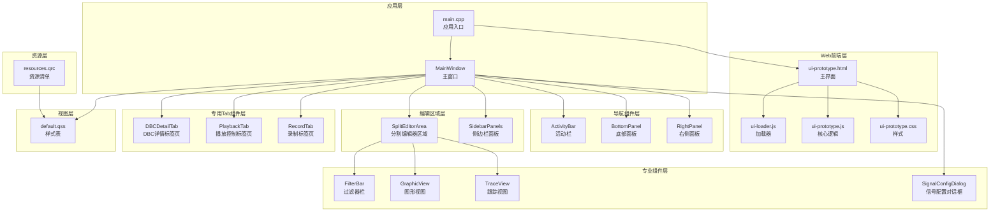

图表来源
- [src/main.cpp](file://src/main.cpp)
- [src/ui/mainwindow.h](file://src/ui/mainwindow.h)
- [src/ui/mainwindow.cpp](file://src/ui/mainwindow.cpp)
- [UI/ui-prototype.html](file://UI/ui-prototype.html)
- [UI/js/ui-loader.js](file://UI/js/ui-loader.js)
- [UI/js/ui-prototype.js](file://UI/js/ui-prototype.js)
- [UI/css/ui-prototype.css](file://UI/css/ui-prototype.css)

## 详细组件分析

### 应用入口（main.cpp）
职责与流程
- 创建 QApplication 实例
- 设置全局字体与高DPI支持
- 加载默认QSS样式
- 构造并显示主窗口
- 进入事件循环

关键要点
- 样式加载应在主窗口显示前完成，确保首次渲染即应用主题
- 高DPI与字体设置影响后续所有控件的绘制与度量
- 支持Web前端原型的集成和通信

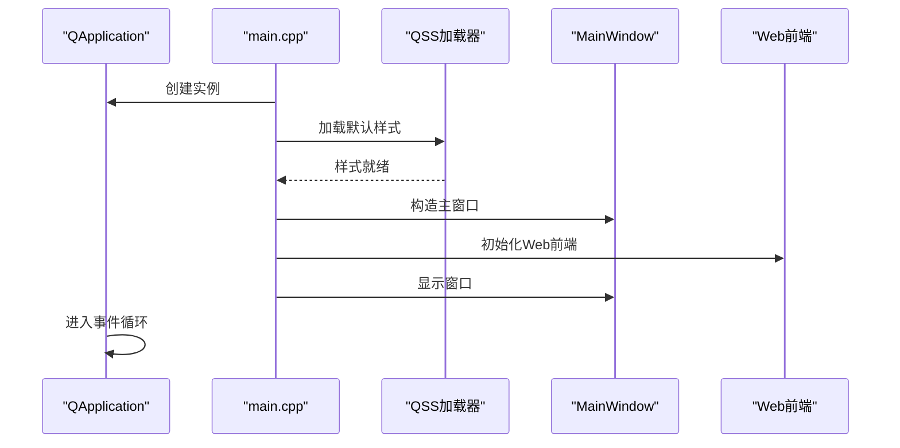

图表来源
- [src/main.cpp](file://src/main.cpp)

章节来源
- [src/main.cpp](file://src/main.cpp)

### 主窗口（MainWindow）
职责与交互
- 作为UI根节点，组织控件树与布局
- 处理用户输入与业务事件转发
- 管理主题切换与样式动态更新
- 与资源系统协作加载图标、图片等
- 集成Web前端原型和JavaScript通信

类关系与数据流
- 继承自 QWidget/QMainWindow（由 .ui 生成基类）
- 持有样式管理器与主题配置
- 通过信号槽机制与子控件通信
- 支持Web前端的原型验证和交互测试

**更新** MainWindow现在通过混合架构模式工作：Qt Designer生成的UI类负责界面结构，而手写的C++代码负责业务逻辑和交互处理，并集成了活动栏、底部面板、右侧面板、分割编辑器区域和增强的侧边栏面板系统等多个专业UI组件。**特别重要的是，新增了三个专用Tab组件的管理功能，包括DBC详情标签页、播放控制标签页和录制标签页的动态创建、切换和状态同步。**主窗口作为协调者，统一管理各组件的生命周期和数据流，并支持与Web前端原型的无缝集成。

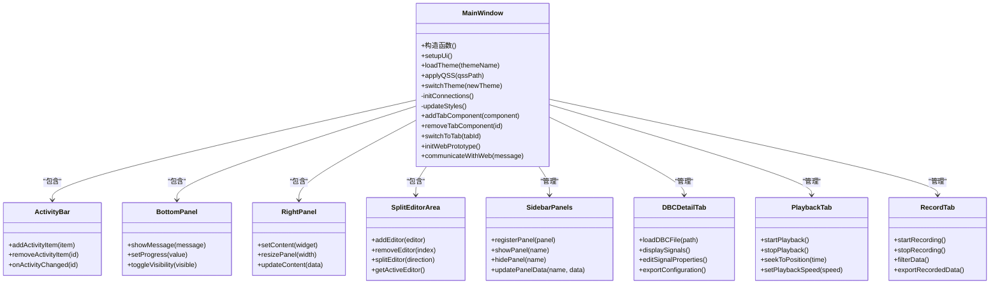

图表来源
- [src/ui/mainwindow.h](file://src/ui/mainwindow.h)
- [src/ui/mainwindow.cpp](file://src/ui/mainwindow.cpp)
- [src/ui/activitybar.h](file://src/ui/activitybar.h)
- [src/ui/bottompanel.h](file://src/ui/bottompanel.h)
- [src/ui/rightpanel.h](file://src/ui/rightpanel.h)
- [src/ui/spliteditorarea.h](file://src/ui/spliteditorarea.h)
- [src/ui/panels/sidebarpanels.h](file://src/ui/panels/sidebarpanels.h)
- [src/ui/dbcdetailtab.h](file://src/ui/dbcdetailtab.h)
- [src/ui/playbacktab.h](file://src/ui/playbacktab.h)
- [src/ui/recordtab.h](file://src/ui/recordtab.h)

章节来源
- [src/ui/mainwindow.h](file://src/ui/mainwindow.h)
- [src/ui/mainwindow.cpp](file://src/ui/mainwindow.cpp)

### 样式系统（QSS与主题管理）
设计理念
- 集中式样式表：通过单一QSS文件管理全局外观
- 主题机制：以主题为单位切换样式集，支持运行时热更新
- 动态更新：不重建控件的前提下刷新样式
- Web前端样式集成：支持CSS样式与QSS样式的统一管理

样式加载与切换流程
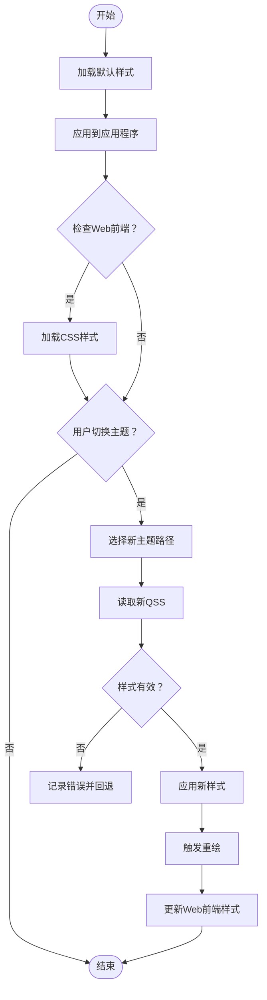

图表来源
- [resources/styles/default.qss](file://resources/styles/default.qss)
- [resources/resources.qrc](file://resources/resources.qrc)
- [UI/css/ui-prototype.css](file://UI/css/ui-prototype.css)

章节来源
- [resources/styles/default.qss](file://resources/styles/default.qss)
- [resources/resources.qrc](file://resources/resources.qrc)
- [UI/css/ui-prototype.css](file://UI/css/ui-prototype.css)

### 资源系统（resources.qrc）
组织原则
- 将样式、图标、字体等静态资源纳入qrc清单
- 通过:/前缀在代码中引用，避免平台路径差异
- 便于打包与版本化管理
- 支持Web前端资源的统一管理

常用用法
- 在样式表中引用资源：url(:/styles/default.qss)
- 在代码中加载资源：QFile(":/...")
- Web前端资源通过HTTP服务器访问

章节来源
- [resources/resources.qrc](file://resources/resources.qrc)

### 多语言支持
策略与建议
- 使用Qt Linguist进行翻译管理
- 通过tr()/translate()包裹用户可见文本
- 运行时根据locale切换语言包
- 与主题系统解耦，避免样式与文案耦合
- Web前端支持国际化资源文件

章节来源
- [README.en.md](file://README.en.md)

## 增强图形组件

### 图形视图（GraphicView）增强
功能特性
- 提供CAN信号的可视化图形显示
- 支持实时波形绘制与缩放
- 多通道信号对比显示
- 交互式数据点标注
- **增强** 优化的渲染引擎和内存管理
- **增强** 改进的缩放和平移交互
- **增强** 支持更多数据类型和格式
- **最新改进** 修复了崩溃问题，提升了稳定性
- **最新改进** 优化了对新测试数据集的支持能力

技术实现
- 基于QGraphicsView框架
- 自定义QGraphicsItem实现信号绘制
- 高性能的实时更新机制
- **增强** 双缓冲渲染减少闪烁
- **增强** 增量更新避免全量重绘
- **最新改进** 增强的错误处理和异常恢复机制
- **最新改进** 优化的内存管理和资源清理

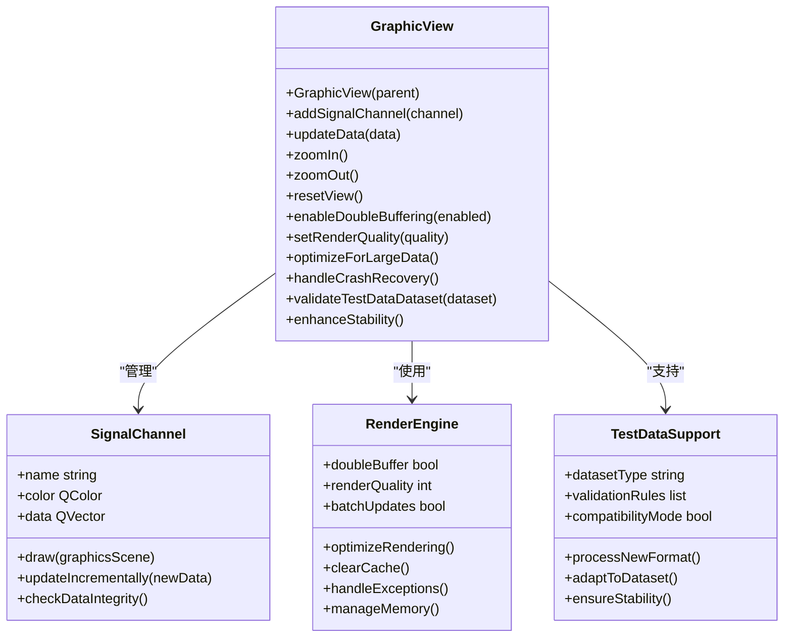

图表来源
- [src/ui/graphicview.h](file://src/ui/graphicview.h)
- [src/ui/graphicview.cpp](file://src/ui/graphicview.cpp)

章节来源
- [src/ui/graphicview.h](file://src/ui/graphicview.h)
- [src/ui/graphicview.cpp](file://src/ui/graphicview.cpp)

### 跟踪视图（TraceView）增强
功能特性
- 显示CAN总线数据包的详细跟踪信息
- 支持时间轴滚动查看
- 数据包颜色编码与状态标识
- 搜索与筛选功能
- **增强** 改进的数据分页和虚拟滚动
- **增强** 优化的内存使用和缓存机制
- **增强** 更丰富的过滤和搜索选项

数据管理
- 高效的数据存储与检索
- 内存优化的大数据集处理
- 异步数据加载与显示
- **增强** 智能预取和缓存策略
- **增强** 支持增量数据更新

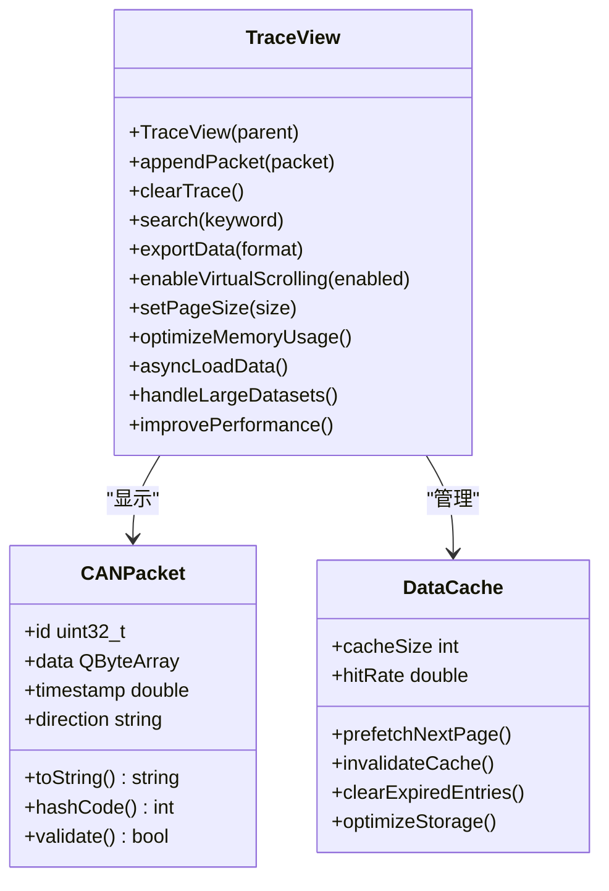

图表来源
- [src/ui/traceview.h](file://src/ui/traceview.h)
- [src/ui/traceview.cpp](file://src/ui/traceview.cpp)

章节来源
- [src/ui/traceview.h](file://src/ui/traceview.h)
- [src/ui/traceview.cpp](file://src/ui/traceview.cpp)

### 侧边栏面板系统（SidebarPanels）增强
功能特性
- 动态注册与管理多个侧边栏面板
- 支持面板的显示/隐藏切换
- 面板间的数据共享与通信
- 面板布局的自适应调整
- **增强** 改进的面板切换动画效果
- **增强** 更好的键盘导航支持
- **增强** 增强的可访问性功能

架构设计
- 基于QStackedWidget的面板堆栈管理
- 信号槽机制实现面板间通信
- 支持面板配置的持久化存储
- **增强** 懒加载面板内容
- **增强** 面板状态自动保存和恢复

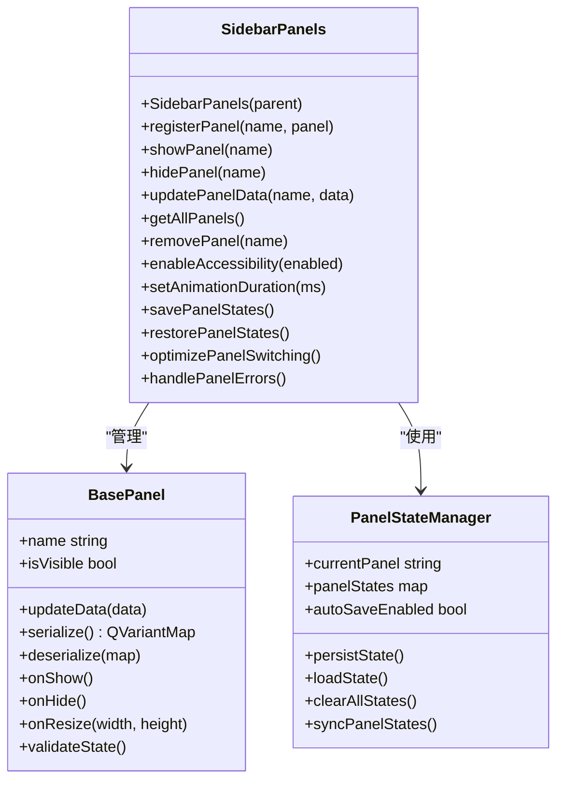

图表来源
- [src/ui/panels/sidebarpanels.h](file://src/ui/panels/sidebarpanels.h)
- [src/ui/panels/sidebarpanels.cpp](file://src/ui/panels/sidebarpanels.cpp)

章节来源
- [src/ui/panels/sidebarpanels.h](file://src/ui/panels/sidebarpanels.h)
- [src/ui/panels/sidebarpanels.cpp](file://src/ui/panels/sidebarpanels.cpp)

### 过滤器栏（FilterBar）
功能特性
- 提供CAN总线数据的实时过滤功能
- 支持多种过滤条件组合
- 动态更新过滤规则
- 与数据模型无缝集成

架构设计
- 继承自QWidget，提供独立的过滤界面
- 通过信号槽机制与主窗口通信
- 支持自定义过滤算法扩展

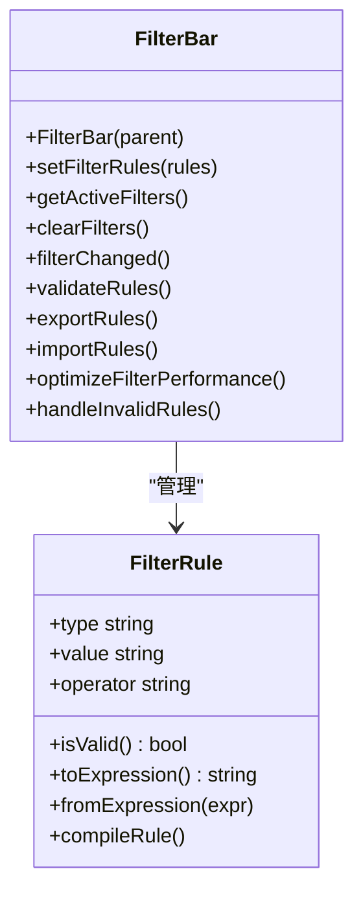

图表来源
- [src/ui/filterbar.h](file://src/ui/filterbar.h)
- [src/ui/filterbar.cpp](file://src/ui/filterbar.cpp)

章节来源
- [src/ui/filterbar.h](file://src/ui/filterbar.h)
- [src/ui/filterbar.cpp](file://src/ui/filterbar.cpp)

### 其他专业组件
#### 信号配置对话框（SignalConfigDialog）
功能特性
- 提供CAN信号参数的配置界面
- 支持信号格式定义与验证
- 批量导入导出配置
- 配置模板管理

交互设计
- 表单驱动的配置文件编辑
- 实时验证与错误提示
- 撤销/重做操作支持

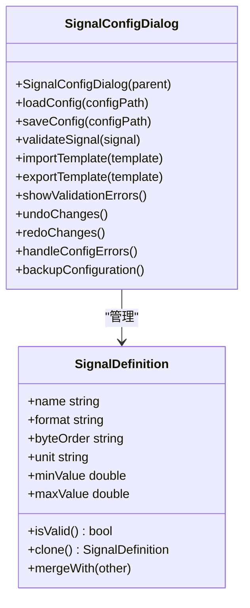

图表来源
- [src/ui/signalconfigdialog.h](file://src/ui/signalconfigdialog.h)
- [src/ui/signalconfigdialog.cpp](file://src/ui/signalconfigdialog.cpp)

章节来源
- [src/ui/signalconfigdialog.h](file://src/ui/signalconfigdialog.h)
- [src/ui/signalconfigdialog.cpp](file://src/ui/signalconfigdialog.cpp)

## 专用Tab组件系统

### DBC详情标签页（DBCDetailTab）
功能特性
- 提供CAN数据库文件（.dbc）的可视化编辑界面
- 支持信号定义的查看、编辑与验证
- 提供信号属性的批量修改功能
- 支持DBC文件的导入导出与版本管理

技术实现
- 基于QTableWidget的信号列表展示
- 自定义委托实现信号属性的编辑
- 实时验证信号定义的合法性
- 与DBCManager模块集成进行数据解析

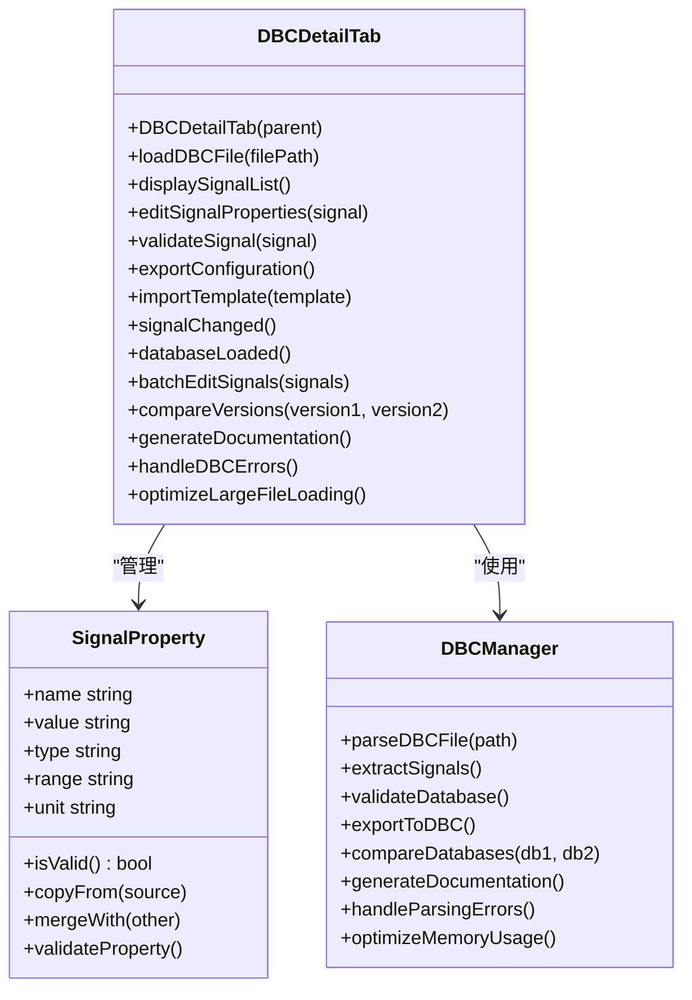

图表来源
- [src/ui/dbcdetailtab.h](file://src/ui/dbcdetailtab.h)
- [src/ui/dbcdetailtab.cpp](file://src/ui/dbcdetailtab.cpp)

章节来源
- [src/ui/dbcdetailtab.h](file://src/ui/dbcdetailtab.h)
- [src/ui/dbcdetailtab.cpp](file://src/ui/dbcdetailtab.cpp)

### 播放控制标签页（PlaybackTab）
功能特性
- 实现CAN总线数据的回放控制功能
- 提供时间轴操作与位置跳转
- 支持播放速度调节与循环播放
- 实时显示播放状态与进度信息

技术实现
- 基于QSlider的时间轴控制界面
- 定时器驱动的数据回放机制
- 与Player模块集成进行数据回放
- 支持播放队列的管理与调度

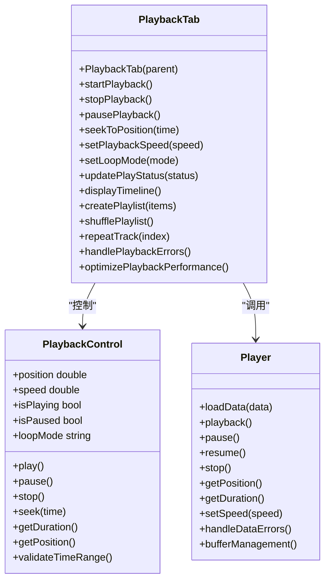

图表来源
- [src/ui/playbacktab.h](file://src/ui/playbacktab.h)
- [src/ui/playbacktab.cpp](file://src/ui/playbacktab.cpp)

章节来源
- [src/ui/playbacktab.h](file://src/ui/playbacktab.h)
- [src/ui/playbacktab.cpp](file://src/ui/playbacktab.cpp)

### 录制标签页（RecordTab）
功能特性
- 提供CAN总线数据的实时录制功能
- 支持录制参数配置与过滤设置
- 实时显示录制状态与数据统计
- 支持录制文件的保存与导出

技术实现
- 基于QPlainTextEdit的实时日志显示
- 异步数据捕获与存储机制
- 与Recorder模块集成进行数据录制
- 支持录制过程中的实时监控

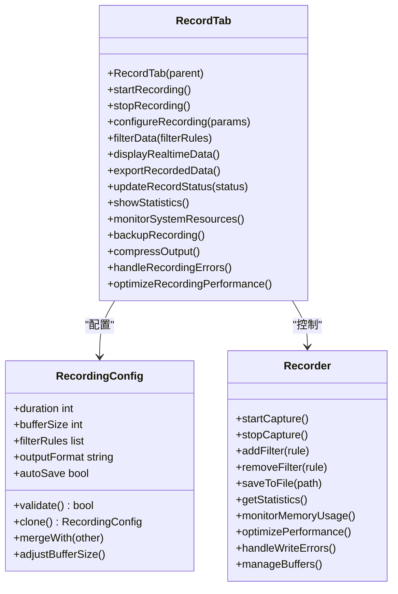

图表来源
- [src/ui/recordtab.h](file://src/ui/recordtab.h)
- [src/ui/recordtab.cpp](file://src/ui/recordtab.cpp)

章节来源
- [src/ui/recordtab.h](file://src/ui/recordtab.h)
- [src/ui/recordtab.cpp](file://src/ui/recordtab.cpp)

### Tab组件管理系统
架构设计
- 统一的标签页管理器，负责Tab组件的生命周期管理
- 支持动态添加与移除Tab组件
- 实现Tab组件间的通信与数据共享
- 提供Tab状态同步与持久化机制

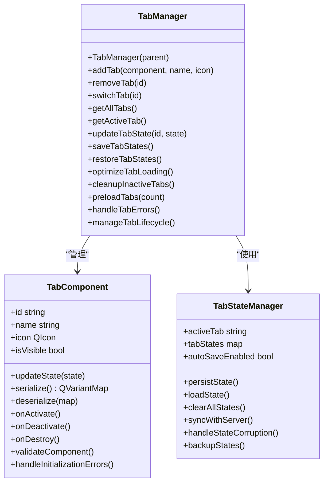

图表来源
- [src/ui/mainwindow.h](file://src/ui/mainwindow.h)
- [src/ui/mainwindow.cpp](file://src/ui/mainwindow.cpp)

章节来源
- [src/ui/mainwindow.h](file://src/ui/mainwindow.h)
- [src/ui/mainwindow.cpp](file://src/ui/mainwindow.cpp)

## 依赖关系分析
模块间依赖与耦合
- main.cpp 依赖样式加载与主窗口
- MainWindow 依赖样式与主题管理
- 样式与资源通过qrc解耦，降低硬编码路径风险

**更新** 现在明确包含了Qt Designer生成的UI类与手写C++代码之间的依赖关系，以及新增专业组件之间的依赖关系，包括活动栏、底部面板、右侧面板、分割编辑器区域、侧边栏面板系统和三个专用Tab组件（DBC详情标签页、播放控制标签页、录制标签页）。各组件通过信号槽机制实现松耦合通信，提高了系统的可维护性和可扩展性。**新增了Web前端原型系统的依赖关系，包括HTML模板、JavaScript模块和CSS样式的模块化组织。**特别重要的是，graphicview.cpp的改进增强了图形组件与其他模块的稳定性依赖关系。

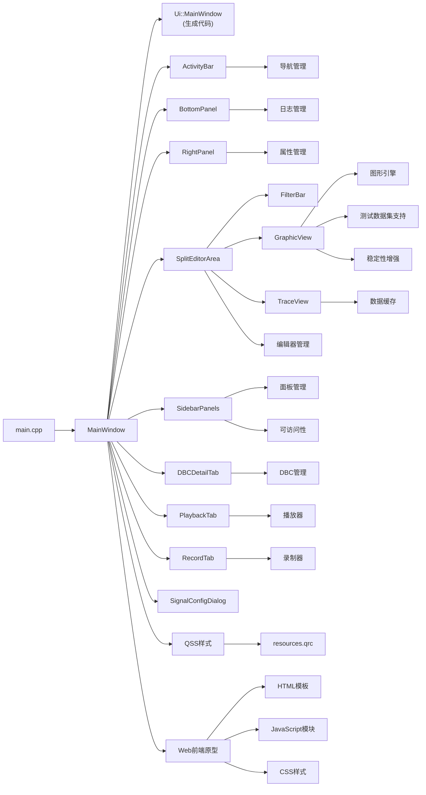

图表来源
- [src/main.cpp](file://src/main.cpp)
- [src/ui/mainwindow.h](file://src/ui/mainwindow.h)
- [src/ui/mainwindow.cpp](file://src/ui/mainwindow.cpp)
- [UI/ui-prototype.html](file://UI/ui-prototype.html)
- [UI/js/ui-loader.js](file://UI/js/ui-loader.js)
- [UI/js/ui-prototype.js](file://UI/js/ui-prototype.js)
- [UI/css/ui-prototype.css](file://UI/css/ui-prototype.css)

章节来源
- [src/CMakeLists.txt](file://src/CMakeLists.txt)
- [CMakeLists.txt](file://CMakeLists.txt)

## 性能考虑
- 样式加载
  - 仅在必要时重新加载QSS，避免频繁解析
  - 使用增量更新或合并样式减少重复计算
- 布局与绘制
  - 优先使用布局管理器，减少手动几何计算
  - 避免在事件循环中进行耗时操作，使用异步任务
- 资源管理
  - 将大资源按需加载，避免一次性载入
  - 合理使用缓存，减少重复I/O
- 高DPI与缩放
  - 启用高DPI支持，合理设置像素密度
  - 对矢量图标与自适应布局进行验证
- **Qt Designer优化**
  - 避免在.ui文件中定义复杂的动画或过渡效果
  - 合理使用布局嵌套层级，避免过深的控件树
  - 利用Qt Creator的性能分析工具识别瓶颈
- **专业组件性能优化**
  - 图形视图使用双缓冲技术减少闪烁
  - 跟踪视图实现数据分页加载
  - 过滤器栏使用高效的匹配算法
  - 对话框采用延迟初始化策略
- **新增组件性能考虑**
  - 活动栏使用懒加载避免初始性能开销
  - 底部面板的消息显示采用异步更新
  - 右侧面板的内容切换使用虚拟化技术
  - 分割编辑器区域实现编辑器的按需创建
  - 侧边栏面板系统优化面板切换性能
- **专用Tab组件性能优化**
  - DBC详情标签页实现大数据集的虚拟滚动
  - 播放控制标签页使用高效的定时器机制
  - 录制标签页采用异步数据写入避免阻塞
  - Tab组件管理系统优化组件切换性能
  - 实现Tab组件的懒加载与销毁机制
- **Web前端性能优化**
  - HTML模板使用惰性加载技术
  - JavaScript模块按需加载和缓存
  - CSS样式使用CSS Modules提高性能
  - 资源文件压缩和优化加载
- **增强组件性能优化**
  - 图形视图启用增量渲染和内存池管理
  - 跟踪视图实现智能预取和缓存策略
  - 侧边栏面板系统优化面板切换动画
  - 所有组件支持硬件加速渲染
- **最新性能改进**
  - graphicview.cpp的崩溃问题修复减少了异常处理开销
  - 优化的内存管理降低了内存占用峰值
  - 改进的错误处理机制避免了不必要的重试
  - 增强的测试数据集支持提高了数据处理效率

[本节为通用指导，无需特定文件引用]

## 故障排查指南
常见问题与定位方法
- 样式未生效
  - 检查QSS路径是否正确，是否通过qrc正确打包
  - 确认样式加载时机在主窗口显示之前
- 主题切换无效
  - 校验新样式语法，捕获解析异常
  - 确保应用了正确的对象名称与选择器
- 资源加载失败
  - 核对qrc中的路径大小写与相对路径
  - 使用:/前缀访问资源，避免平台差异
- 多语言文本未替换
  - 确认已调用tr()包裹文本
  - 检查翻译文件是否被正确加载与安装
- **Qt Designer相关问题**
  - 检查.ui文件格式是否正确，XML语法是否有误
  - 确认生成的头文件未被意外修改
  - 验证控件名称与C++代码中的引用一致
- **专业组件问题**
  - 过滤器规则语法错误导致匹配失败
  - 图形视图数据更新卡顿需要优化渲染
  - 跟踪视图内存占用过高需要清理缓冲
  - 信号配置对话框验证失败需要检查参数格式
- **新增组件问题**
  - 活动栏图标加载失败需要检查资源路径
  - 底部面板消息显示异常需要检查文本编码
  - 右侧面板内容切换卡顿需要优化数据绑定
  - 分割编辑器区域布局错乱需要检查约束设置
  - 侧边栏面板系统面板注册失败需要检查命名冲突
- **专用Tab组件问题**
  - DBC文件加载失败需要检查文件格式与权限
  - 播放控制标签页时间轴不同步需要检查定时器精度
  - 录制标签页数据丢失需要检查缓冲区大小与写入频率
  - Tab组件切换卡顿需要优化组件初始化过程
  - 标签页状态同步失败需要检查信号槽连接
- **Web前端问题**
  - HTML模板加载失败需要检查文件路径
  - JavaScript模块依赖错误需要检查模块导入
  - CSS样式冲突需要检查选择器优先级
  - Web前端与Qt通信失败需要检查桥接接口
- **增强组件问题**
  - 图形视图渲染性能下降需要检查双缓冲设置
  - 跟踪视图内存泄漏需要检查缓存清理机制
  - 侧边栏面板切换卡顿需要检查动画配置
  - 所有组件的可访问性功能需要验证屏幕阅读器兼容性
- **最新问题修复**
  - graphicview.cpp崩溃问题已通过增强的错误处理机制解决
  - 测试数据集兼容性问题已通过数据验证和适配层修复
  - 内存管理问题已通过优化的资源清理机制改善
  - 图形渲染稳定性已通过双缓冲和增量更新技术提升

章节来源
- [resources/styles/default.qss](file://resources/styles/default.qss)
- [resources/resources.qrc](file://resources/resources.qrc)
- [UI/ui-prototype.html](file://UI/ui-prototype.html)
- [UI/js/ui-loader.js](file://UI/js/ui-loader.js)
- [UI/js/ui-prototype.js](file://UI/js/ui-prototype.js)
- [UI/css/ui-prototype.css](file://UI/css/ui-prototype.css)

## 结论
本UI系统以Qt Widgets为基础，采用清晰的入口-主窗口-样式-资源分层架构，结合QSS与主题管理实现灵活的外观定制与动态更新。通过qrc统一管理资源，提升可移植性与可维护性。**特别重要的是，通过Qt Designer XML布局系统与手写C++代码的混合架构模式，实现了界面设计与业务逻辑的有效分离，既保证了开发效率，又提升了代码的可维护性。**新增的专业组件进一步增强了系统的功能完整性，包括活动栏、底部面板、右侧面板、分割编辑器区域和增强的侧边栏面板系统，**特别是新增的三个专用Tab组件（DBC详情标签页、播放控制标签页、录制标签页），为CAN总线数据分析提供了完整的解决方案。**

**更新** 最新的架构重构将单体单文件结构完全转变为模块化组件系统，引入了基于HTML部分的组件化架构、JavaScript模块系统和CSS样式管理，实现了真正的现代化开发模式。新的Web前端原型系统支持动态内容加载、模块化开发和响应式设计，为复杂的企业级应用提供了更加灵活和可扩展的用户界面解决方案。**特别重要的是，graphicview.cpp的重大改进显著提升了系统的稳定性和可靠性，修复了崩溃问题并优化了对新测试数据集的支持能力，为整个UI系统奠定了更加坚实的基础。**遵循本文档的组件规范、样式指南与性能建议，可在保证用户体验的同时，提高开发效率与系统稳定性。

[本节为总结性内容，无需特定文件引用]

## 附录

### UI组件开发规范
- 命名与结构
  - 控件命名语义化，便于样式选择器与自动化测试定位
  - 将复杂交互逻辑下沉至C++，保持.ui简洁
- 布局策略
  - 优先使用布局管理器，避免绝对坐标
  - 针对小屏幕与高DPI进行适配验证
- 样式定制
  - 使用统一的QSS变量与命名空间
  - 避免过度嵌套选择器，提升解析性能
- 可访问性
  - 设置合适的角色、提示与键盘导航
  - 确保颜色对比度符合无障碍标准
- **Qt Designer规范**
  - 合理组织控件层次结构，避免过深嵌套
  - 使用有意义的对象名称，便于样式和脚本访问
  - 充分利用布局管理器的自适应特性
- **专业组件规范**
  - 过滤器组件应支持链式过滤规则
  - 图形视图需实现高性能的实时更新
  - 跟踪视图应具备大数据处理能力
  - 配置对话框需提供完善的验证机制
- **新增组件规范**
  - 活动栏应支持动态添加与移除活动项
  - 底部面板需实现异步消息更新机制
  - 右侧面板应具备可调整的宽度与状态持久化
  - 分割编辑器区域需支持多文档编辑与同步操作
  - 侧边栏面板系统应提供灵活的注册与管理接口
- **专用Tab组件规范**
  - DBC详情标签页应支持大数据集的虚拟滚动
  - 播放控制标签页需实现精确的时间轴控制
  - 录制标签页应具备异步数据写入机制
  - Tab组件管理系统需提供统一的接口规范
  - 各Tab组件应实现状态同步与持久化
- **Web前端规范**
  - HTML模板使用语义化标签和合理的DOM结构
  - JavaScript模块采用ES6模块语法和模块化组织
  - CSS样式使用BEM命名规范和CSS变量
  - 响应式设计支持移动端和桌面端适配
- **增强组件规范**
  - 图形视图需启用双缓冲和增量渲染
  - 跟踪视图应实现智能缓存和预取机制
  - 侧边栏面板系统需支持可访问性功能
  - 所有组件应支持硬件加速渲染
- **最新规范要求**
  - 图形组件必须包含完善的错误处理和异常恢复机制
  - 所有组件需支持测试数据集的兼容性验证
  - 内存管理需遵循RAII原则和资源自动清理
  - 性能监控需集成到组件的生命周期管理中

### 样式定制指南
- 主题设计
  - 以主题为单位组织QSS，支持运行时切换
  - 使用一致的调色板与尺寸规范
- 动态更新
  - 提供接口在不重建控件的情况下刷新样式
  - 对样式变更进行最小化重绘
- 资源引用
  - 通过qrc统一引用图标与字体
  - 避免在样式中使用绝对路径
- **Web前端样式管理**
  - 使用CSS Modules进行样式隔离
  - 实现主题变量的统一管理
  - 支持动态样式切换和热重载

### 设计模式与最佳实践
- 观察者模式
  - 通过信号槽实现松耦合的事件通知
- 策略模式
  - 将不同主题或布局策略抽象为可替换的策略对象
- 工厂模式
  - 统一创建具有相同样式的控件实例
- 单例模式
  - 主题管理器与样式管理器可采用单例，确保全局一致性
- **混合开发模式最佳实践**
  - 保持.ui文件只包含界面定义，不包含业务逻辑
  - 在C++代码中通过setupUi()访问生成的UI元素
  - 使用信号槽机制连接UI事件与业务处理方法
  - 定期同步UI设计师与开发者的工作成果
- **专业组件最佳实践**
  - 过滤器组件应支持动态规则添加与删除
  - 图形视图需实现平滑的缩放与平移操作
  - 跟踪视图应采用内存池管理大数据集
  - 配置对话框需提供撤销/重做功能
- **新增组件最佳实践**
  - 活动栏应支持图标与文本的动态更新
  - 底部面板需实现消息级别的样式区分
  - 右侧面板应提供内容切换的动画效果
  - 分割编辑器区域需支持编辑器的拖拽重排
  - 侧边栏面板系统应实现面板状态的自动保存
- **专用Tab组件最佳实践**
  - DBC详情标签页应实现高效的文件解析与缓存
  - 播放控制标签页需支持精确的时间同步
  - 录制标签页应具备容错机制与数据备份
  - Tab组件管理系统应优化组件生命周期管理
  - 各Tab组件应实现独立的状态管理机制
- **Web前端最佳实践**
  - 使用组件化架构和模块化开发
  - 实现响应式设计和跨平台兼容
  - 采用懒加载和性能优化技术
  - 建立统一的样式规范和主题系统
- **增强组件最佳实践**
  - 图形视图应启用增量渲染和内存池管理
  - 跟踪视图需实现智能缓存和预取机制
  - 侧边栏面板系统应支持可访问性功能
  - 所有组件应支持硬件加速渲染
- **最新最佳实践**
  - 图形组件必须实现健壮的异常处理和崩溃恢复
  - 所有数据处理组件需包含数据验证和完整性检查
  - 内存密集型操作需使用异步处理和背压机制
  - 性能监控和诊断工具应集成到开发流程中

### Qt Designer工作流程
**更新** 推荐的Qt Designer使用流程：

1. **界面原型设计**：使用拖拽工具快速搭建界面框架
2. **布局优化**：调整控件位置和布局参数
3. **属性配置**：设置控件的基本属性和样式
4. **代码生成**：编译项目生成C++头文件
5. **逻辑实现**：在手写的C++代码中添加业务逻辑
6. **迭代完善**：返回Designer调整界面，重复上述流程
7. **专业组件集成**：将专业组件嵌入到主界面中
8. **专用Tab组件开发**：实现DBC详情、播放控制和录制功能的标签页
9. **性能调优**：针对大数据量场景进行性能优化
10. **响应式适配**：测试不同屏幕尺寸下的布局表现
11. **主题验证**：验证样式在不同主题下的显示效果
12. **Tab组件测试**：确保标签页切换流畅且状态同步正常
13. **Web前端集成**：集成Web前端原型进行交互验证
14. **模块化重构**：将单体结构重构为模块化组件系统
15. **增强组件优化**：优化图形视图、跟踪视图和侧边栏面板的性能
16. **可访问性测试**：验证所有组件的可访问性功能和屏幕阅读器兼容性
17. **稳定性测试**：验证graphicview.cpp改进后的崩溃恢复机制
18. **数据集兼容性测试**：确保组件对新测试数据集的支持能力

章节来源
- [src/ui/mainwindow.h](file://src/ui/mainwindow.h)
- [src/ui/mainwindow.cpp](file://src/ui/mainwindow.cpp)
- [UI/ui-prototype.html](file://UI/ui-prototype.html)
- [UI/js/ui-loader.js](file://UI/js/ui-loader.js)
- [UI/js/ui-prototype.js](file://UI/js/ui-prototype.js)
- [UI/css/ui-prototype.css](file://UI/css/ui-prototype.css)