# UI系统设计

<cite>
**本文引用的文件**   
- [CMakeLists.txt](file://CMakeLists.txt)
- [README.en.md](file://README.en.md)
- [src/main.cpp](file://src/main.cpp)
- [src/CMakeLists.txt](file://src/CMakeLists.txt)
- [src/ui/mainwindow.h](file://src/ui/mainwindow.h)
- [src/ui/mainwindow.cpp](file://src/ui/mainwindow.cpp)
- [resources/styles/default.qss](file://resources/styles/default.qss)
- [resources/styles/theme.qss](file://resources/styles/theme.qss)
- [resources/resources.qrc](file://resources/resources.qrc)
- [src/ui/filterbar.h](file://src/ui/filterbar.h)
- [src/ui/filterbar.cpp](file://src/ui/filterbar.cpp)
- [src/ui/graphicview.h](file://src/ui/graphicview.h)
- [src/ui/graphicview.cpp](file://src/ui/graphicview.cpp)
- [src/ui/traceview.h](file://src/ui/traceview.h)
- [src/ui/traceview.cpp](file://src/ui/traceview.cpp)
- [src/ui/signalconfigdialog.h](file://src/ui/signalconfigdialog.h)
- [src/ui/signalconfigdialog.cpp](file://src/ui/signalconfigdialog.cpp)
- [src/ui/activitybar.h](file://src/ui/activitybar.h)
- [src/ui/activitybar.cpp](file://src/ui/activitybar.cpp)
- [src/ui/bottompanel.h](file://src/ui/bottompanel.h)
- [src/ui/bottompanel.cpp](file://src/ui/bottompanel.cpp)
- [src/ui/rightpanel.h](file://src/ui/rightpanel.h)
- [src/ui/rightpanel.cpp](file://src/ui/rightpanel.cpp)
- [src/ui/spliteditorarea.h](file://src/ui/spliteditorarea.h)
- [src/ui/spliteditorarea.cpp](file://src/ui/spliteditorarea.cpp)
- [src/ui/panels/sidebarpanels.h](file://src/ui/panels/sidebarpanels.h)
- [src/ui/panels/sidebarpanels.cpp](file://src/ui/panels/sidebarpanels.cpp)
- [src/ui/dbcdetailtab.h](file://src/ui/dbcdetailtab.h)
- [src/ui/dbcdetailtab.cpp](file://src/ui/dbcdetailtab.cpp)
- [src/ui/playbacktab.h](file://src/ui/playbacktab.h)
- [src/ui/playbacktab.cpp](file://src/ui/playbacktab.cpp)
- [src/ui/recordtab.h](file://src/ui/recordtab.h)
- [src/ui/recordtab.cpp](file://src/ui/recordtab.cpp)
- [src/ui/deviceconnectiontab.h](file://src/ui/deviceconnectiontab.h)
- [src/ui/deviceconnectiontab.cpp](file://src/ui/deviceconnectiontab.cpp)
- [src/ui/thememanager.h](file://src/ui/thememanager.h)
- [src/ui/thememanager.cpp](file://src/ui/thememanager.cpp)
- [src/ui/settingsdialog.h](file://src/ui/settingsdialog.h)
- [src/ui/settingsdialog.cpp](file://src/ui/settingsdialog.cpp)
- [src/utils/svg_icon.h](file://src/utils/svg_icon.h)
- [UI/ui-prototype.html](file://UI/ui-prototype.html)
- [UI/js/ui-loader.js](file://UI/js/ui-loader.js)
- [UI/js/ui-prototype.js](file://UI/js/ui-prototype.js)
- [UI/css/ui-prototype.css](file://UI/css/ui-prototype.css)
- [src/models/cantracemodel.h](file://src/models/cantracemodel.h)
- [src/models/cantracemodel.cpp](file://src/models/cantracemodel.cpp)
- [src/models/canfilterproxymodel.h](file://src/models/canfilterproxymodel.h)
- [src/models/canfilterproxymodel.cpp](file://src/models/canfilterproxymodel.cpp)
- [src/models/viewportproxy.h](file://src/models/viewportproxy.h)
- [src/models/viewportproxy.cpp](file://src/models/viewportproxy.cpp)
- [third_party/qcustomplot/qcustomplot.h](file://third_party/qcustomplot/qcustomplot.h)
- [src/core/canframe.h](file://src/core/canframe.h)
- [src/core/dbcdata.h](file://src/core/dbcdata.h)
- [src/ui/filterheaderview.h](file://src/ui/filterheaderview.h)
- [src/ui/filterheaderview.cpp](file://src/ui/filterheaderview.cpp)
- [src/ui/graphic/downsample.h](file://src/ui/graphic/downsample.h)
- [src/ui/graphic/downsample.cpp](file://src/ui/graphic/downsample.cpp)
- [src/core/plugin/pluginhost.h](file://src/core/plugin/pluginhost.h)
- [src/core/plugin/pluginmanager.h](file://src/core/plugin/pluginmanager.h)
- [scripts/sin_host.py](file://scripts/sin_host.py)
</cite>

## 更新摘要
**所做更改**   
- GraphicView组件增强了插件集成能力，添加了70+行代码用于改进可扩展性和插件功能
- 集成了完整的Python插件宿主系统，支持动态加载和运行Python插件
- 新增了插件管理器、插件宿主进程管理和JSON-RPC通信机制
- 扩展了GraphicView的扩展点接口，允许插件自定义信号可视化和交互行为
- 增强了图形视图的可插拔架构，支持运行时插件发现和激活

## 目录
1. [简介](#简介)
2. [项目结构](#项目结构)
3. [核心组件](#核心组件)
4. [架构总览](#架构总览)
5. [详细组件分析](#详细组件分析)
6. [增强图形组件](#增强图形组件)
7. [插件系统集成](#插件系统集成)
8. [专用Tab组件系统](#专用Tab组件系统)
9. [工具集系统](#工具集系统)
10. [依赖关系分析](#依赖关系分析)
11. [性能考虑](#性能考虑)
12. [故障排查指南](#故障排查指南)
13. [结论](#结论)
14. [附录](#附录)

## 简介
本文件面向基于Qt Widgets和现代Web技术的混合UI系统，系统化阐述UI架构模式、组件层次与布局策略；详细说明QSS样式体系、主题管理与动态样式更新；解释资源文件组织、Qt资源系统与多语言支持；并给出响应式设计、可访问性与跨平台兼容性的实践建议。同时提供UI组件开发规范、样式定制指南与性能优化建议，辅以设计模式与最佳实践示例，帮助团队在Qt Widgets项目中构建高质量、可维护且高性能的用户界面。

**更新** 本文档现已重点说明从单体单文件结构到模块化组件系统的完整重构过程，包括新的Web前端原型系统和Qt后端架构的集成模式。新增了基于HTML部分的组件化架构、JavaScript模块系统和CSS样式管理，实现了前后端分离的开发模式和更好的代码组织结构。**特别重要的是，最新的更新针对UI系统进行了全面增强，包括SVG图标支持系统、样式系统重构、现代化界面设计改进，以及设备连接界面的优化。新增的ThemeManager主题管理器支持多种内置主题和运行时切换，SVG图标系统提供动态颜色替换功能，设备连接界面提供了完整的CAN/CAN FD配置选项和时序预设管理。活动栏已重新组织以提高工作流程效率，'Flow'按钮被移动到更显眼的位置，反映了其在测量设置工作流程中的重要性。各组件间通过信号槽机制和JavaScript事件系统实现松耦合通信，支持动态加载和响应式布局。**

**最新增强** GraphicView组件现已完全重构，集成了QCustomPlot库，提供了专业的信号可视化功能。支持多轴信号绘图、实时数据流处理、交互式光标系统和高性能的批处理渲染。主题管理系统得到了显著增强，支持7种内置主题（Light、Dark、VS Code Dark+、VS Code Light+、Monokai、Solarized Light、Solarized Dark）和运行时动态切换。**新增的高性能视口降采样功能模块通过downsample算法实现Min/Max、Average、First、Decimate四种抽稀策略，将百万级原始数据点转换为视口像素级别的显示数据，确保O(视口宽)恒定渲染成本，大幅提升大数据量波形渲染性能。新增的视口概览组件系统提供了CANoe风格的视窗缩略图导航，支持拖拽式视窗控制和点击跳转功能，大幅提升了大数据集的浏览体验。覆盖模式功能已迁移到设置菜单，提供了更统一的配置管理界面。设备连接行为升级为V2接口，支持更完整的设备配置参数和厂商特定设置。FilterHeaderView组件得到了显著增强，新增了自定义排序指示器绘制功能，支持setSortState()和clearSortState()方法，改进了排序三角形与漏斗图标的布局，优化了视觉设计和交互体验。**

**插件系统增强** 系统现在集成了完整的Python插件架构，支持动态加载和执行外部Python脚本。GraphicView组件通过扩展点接口允许插件自定义信号可视化行为，包括添加自定义图表类型、修改渲染逻辑和扩展用户交互。插件系统采用JSON-RPC协议进行主程序与Python宿主进程间的通信，提供了稳定的异步消息传递机制。

## 项目结构
本项目采用分层与按功能划分的组织方式，结合了传统Qt Widgets架构和现代Web前端技术：
- src: Qt C++源代码目录，包含应用入口、主窗口实现与UI描述文件
- UI: Web前端原型目录，包含HTML模板、JavaScript模块和CSS样式
- resources: 静态资源目录，包含QSS样式与Qt资源清单
- third_party: 第三方库目录，包含QCustomPlot等依赖库
- plugins: Python插件目录，包含可动态加载的插件模块
- scripts: 脚本目录，包含插件宿主和管理脚本
- CMakeLists.txt: 顶层构建配置，定义目标、链接库与资源集成

```mermaid
graph TB
A["顶层 CMakeLists.txt"] --> B["src/CMakeLists.txt"]
B --> C["src/main.cpp"]
B --> D["src/ui/mainwindow.h/.cpp"]
B --> E["src/ui/activitybar.h/.cpp"]
B --> F["src/ui/bottompanel.h/.cpp"]
B --> G["src/ui/rightpanel.h/.cpp"]
B --> H["src/ui/spliteditorarea.h/.cpp"]
B --> I["src/ui/panels/sidebarpanels.h/.cpp"]
B --> J["src/ui/filterbar.h/.cpp"]
B --> K["src/ui/graphicview.h/.cpp"]
B --> L["src/ui/traceview.h/.cpp"]
B --> M["src/ui/signalconfigdialog.h/.cpp"]
B --> N["src/ui/dbcdetailtab.h/.cpp"]
B --> O["src/ui/playbacktab.h/.cpp"]
B --> P["src/ui/recordtab.h/.cpp"]
B --> Q["src/ui/deviceconnectiontab.h/.cpp"]
B --> R["src/ui/thememanager.h/.cpp"]
B --> S["src/ui/settingsdialog.h/.cpp"]
B --> T["src/utils/svg_icon.h"]
B --> U["src/models/cantracemodel.h/.cpp"]
B --> V["src/models/canfilterproxymodel.h/.cpp"]
B --> W["src/models/viewportproxy.h/.cpp"]
B --> X["src/ui/filterheaderview.h/.cpp"]
B --> Y["src/ui/graphic/downsample.h/.cpp"]
B --> Z["src/core/plugin/*"]
A --> AA["resources/resources.qrc"]
AA --> BB["resources/styles/default.qss"]
AA --> CC["resources/styles/theme.qss"]
A --> DD["UI/ui-prototype.html"]
DD --> EE["UI/js/ui-loader.js"]
DD --> FF["UI/js/ui-prototype.js"]
DD --> GG["UI/css/ui-prototype.css"]
EE --> HH["UI/partials/*.html"]
FF --> HH
GG --> HH
B --> II["third_party/qcustomplot"]
II --> JJ["qcustomplot.h"]
B --> KK["scripts/sin_host.py"]
KK --> LL["plugins/*"]
LL --> MM["plugin.json"]
LL --> NN["main.py"]
```

**图表来源**
- [CMakeLists.txt](file://CMakeLists.txt)
- [src/CMakeLists.txt](file://src/CMakeLists.txt)
- [src/main.cpp](file://src/main.cpp)
- [src/ui/mainwindow.h](file://src/ui/mainwindow.h)
- [src/ui/mainwindow.cpp](file://src/ui/mainwindow.cpp)
- [UI/ui-prototype.html](file://UI/ui-prototype.html)
- [UI/js/ui-loader.js](file://UI/js/ui-loader.js)
- [UI/js/ui-prototype.js](file://UI/js/ui-prototype.js)
- [UI/css/ui-prototype.css](file://UI/css/ui-prototype.css)
- [third_party/qcustomplot/qcustomplot.h](file://third_party/qcustomplot/qcustomplot.h)
- [scripts/sin_host.py](file://scripts/sin_host.py)

章节来源
- [CMakeLists.txt](file://CMakeLists.txt)
- [README.en.md](file://README.en.md)

## 核心组件
- 应用入口 main.cpp: 初始化Qt应用实例、设置全局样式、创建并显示主窗口
- 主窗口 MainWindow: 承载UI树、管理布局与交互逻辑、加载QSS与主题切换
- ThemeManager 主题管理器: 集中管理主题配置、QSS生成和运行时切换
- SVG图标系统: 提供动态颜色替换和主题适配的矢量图标渲染
- QSS样式 default.qss: 集中式样式表，统一外观与主题基础
- Qt资源 resources.qrc: 将样式与图标等资源打包进应用，便于分发与加载
- Web前端原型 ui-prototype.html: 基于HTML的现代化界面原型，支持动态内容加载
- JavaScript模块系统: 包含ui-loader.js和ui-prototype.js，实现模块化功能组织
- CSS样式系统: 提供统一的样式规范和响应式设计支持
- **新增** QCustomPlot集成: 专业级的信号可视化和图表绘制引擎
- **新增** ViewportProxyModel: CANoe风格的视窗代理模型，提供固定行数视窗限制
- **新增** ViewportOverview: 视窗缩略图组件，支持拖拽式视窗导航
- **新增** FilterHeaderView: Wireshark风格的自定义表头视图，支持排序和过滤图标
- **新增** TransceivePanel: 统一的收发功能面板，整合发送、回放、录制功能
- **新增** Downsample模块: 高性能视口降采样算法，支持四种抽稀策略
- **新增** PluginManager: 插件管理器，负责插件发现、激活和生命周期管理
- **新增** PluginHost: Python插件宿主进程管理，支持JSON-RPC通信
- **新增** sin_host.py: Python插件宿主脚本，提供插件执行环境

**更新** 现在明确区分了Qt Designer生成的UI文件与手写C++代码的职责边界，形成了清晰的混合开发模式，并集成了活动栏、底部面板、右侧面板、分割编辑器区域、增强的侧边栏面板系统和全新的设备连接界面等多个专业UI组件。**特别重要的是，活动栏已重新组织以提高工作流程效率，'Flow'按钮被移动到更显眼的位置（第二个位置），反映了其在测量设置工作流程中的重要性。工具提示已增强以提供更清晰的描述。新增了ThemeManager主题管理系统，支持7种内置主题和运行时切换；SVG图标系统提供动态颜色替换功能；设备连接界面提供了完整的CAN/CAN FD配置选项。工具集系统得到完善，通过onToolOpened槽函数实现了工具激活请求的统一处理，支持多种总线分析工具的动态加载和管理。新增的视口概览组件系统提供了CANoe风格的视窗缩略图导航，大幅提升了大数据集的浏览体验。覆盖模式功能已迁移到设置菜单，提供了更统一的配置管理界面。FilterHeaderView组件得到了显著增强，新增了自定义排序指示器绘制功能，支持setSortState()和clearSortState()方法，改进了排序三角形与漏斗图标的布局，优化了视觉设计和交互体验。TransceivePanel作为统一的收发功能入口，简化了用户操作流程。新增的Downsample模块通过Min/Max、Average、First、Decimate四种抽稀策略，将百万级原始数据点转换为视口像素级别的显示数据，确保O(视口宽)恒定渲染成本，大幅提升大数据量波形渲染性能。**各组件间通过信号槽机制和JavaScript事件系统实现松耦合通信，支持动态加载和响应式布局。

章节来源
- [src/main.cpp](file://src/main.cpp)
- [src/ui/mainwindow.h](file://src/ui/mainwindow.h)
- [src/ui/mainwindow.cpp](file://src/ui/mainwindow.cpp)
- [resources/styles/default.qss](file://resources/styles/default.qss)
- [resources/styles/theme.qss](file://resources/styles/theme.qss)
- [resources/resources.qrc](file://resources/resources.qrc)
- [src/ui/thememanager.h](file://src/ui/thememanager.h)
- [src/ui/thememanager.cpp](file://src/ui/thememanager.cpp)
- [src/utils/svg_icon.h](file://src/utils/svg_icon.h)
- [UI/ui-prototype.html](file://UI/ui-prototype.html)
- [UI/js/ui-loader.js](file://UI/js/ui-loader.js)
- [UI/js/ui-prototype.js](file://UI/js/ui-prototype.js)
- [UI/css/ui-prototype.css](file://UI/css/ui-prototype.css)

## 架构总览
整体采用"入口初始化 + 主窗口容器 + 样式/资源分离 + Web前端集成 + 插件系统"的混合架构模式：
- 入口负责生命周期与全局样式注入
- 主窗口作为UI根节点，组织子控件与布局
- 样式通过ThemeManager集中管理，支持运行时切换
- 资源通过qrc统一打包，避免路径问题
- Web前端提供现代化界面原型和动态内容加载能力
- **新增** QCustomPlot集成提供专业的信号可视化能力
- **新增** 视口代理模型提供固定行数视窗限制，优化大数据集处理性能
- **新增** FilterHeaderView提供Wireshark风格的自定义表头界面
- **新增** TransceivePanel提供统一的收发功能入口
- **新增** Downsample模块提供高性能视口降采样算法
- **新增** 插件系统提供Python脚本执行环境和动态扩展能力

**更新** 架构现已明确包含Qt Designer XML布局系统与C++代码的混合模式，以及新增的Web前端原型系统，实现了可视化设计与程序逻辑的有效分离，并集成了活动栏、底部面板、右侧面板、分割编辑器区域、增强的侧边栏面板系统和全新的设备连接界面等多个专业UI组件。**特别重要的是，活动栏已重新组织以提高工作流程效率，按钮顺序调整为从项目管理到分析工具的逻辑流程。'Flow'按钮被移动到更显眼的位置（第二个位置），反映了其在测量设置工作流程中的重要性。工具提示已增强以提供更清晰的描述。新增了ThemeManager主题管理系统，支持7种内置主题和运行时切换；SVG图标系统提供动态颜色替换功能；设备连接界面提供了完整的CAN/CAN FD配置选项。工具集系统得到完善，通过onToolOpened槽函数实现了工具激活请求的统一处理，支持多种总线分析工具的动态加载和管理。新增的视口概览组件系统通过ViewportProxyModel和ViewportOverview类，实现了CANoe风格的视窗缩略图导航功能，大幅提升了大数据集的浏览体验。覆盖模式功能已迁移到设置菜单，提供了更统一的配置管理界面。设备连接行为升级为V2接口，支持更完整的设备配置参数。FilterHeaderView组件通过自定义排序指示器和漏斗图标，提供了Wireshark风格的表头界面，增强了数据表的交互体验。TransceivePanel作为统一的收发功能入口，简化了用户操作流程。新增的Downsample模块通过智能数据裁剪和四种抽稀策略，将百万级原始数据点转换为视口像素级别的显示数据，确保O(视口宽)恒定渲染成本，大幅提升大数据量波形渲染性能。**各组件间通过信号槽机制和JavaScript事件系统进行通信，确保模块间的松耦合和高内聚。

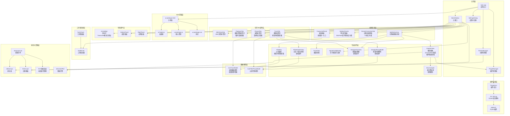
```mermaid
graph TB
subgraph "应用层"
M["main.cpp<br/>应用入口"]
MW["MainWindow<br/>主窗口"]
TM["ThemeManager<br/>主题管理器"]
SD["SettingsDialog<br/>设置对话框"]
PM["PluginManager<br/>插件管理器"]
end
subgraph "插件系统层"
PH["PluginHost<br/>插件宿主"]
SH["sin_host.py<br/>Python宿主脚本"]
PL["plugins/*<br/>Python插件"]
end
subgraph "Web前端层"
WPH["ui-prototype.html<br/>主界面"]
WL["ui-loader.js<br/>加载器"]
WP["ui-prototype.js<br/>核心逻辑"]
WC["ui-prototype.css<br/>样式"]
end
subgraph "导航组件层"
AB["ActivityBar<br/>活动栏<br/>Transceive模式已添加"]
BP["BottomPanel<br/>底部面板"]
RP["RightPanel<br/>右侧面板"]
end
subgraph "编辑区域层"
SEA["SplitEditorArea<br/>分割编辑器区域"]
SBP["SidebarPanels<br/>侧边栏面板<br/>DbcPanel支持多协议分类"]
DCT["DeviceConnectionTab<br/>设备连接界面<br/>V2接口升级"]
TP["TransceivePanel<br/>收发面板<br/>新增统一入口"]
end
subgraph "专用Tab组件层"
DBCT["DBCDetailTab<br/>DBC详情标签页"]
PB["PlaybackTab<br/>播放控制标签页<br/>循环回放增强"]
RT["RecordTab<br/>录制标签页<br/>暂停恢复增强"]
TT["TraceTab<br/>跟踪标签页<br/>刷新率控制增强"]
end
subgraph "工具集系统层"
TPN["ToolsPanel<br/>工具集面板"]
TR["ToolRouter<br/>工具路由器"]
end
subgraph "专业组件层"
FB["FilterBar<br/>过滤器栏<br/>刷新率控制增强"]
GV["GraphicView<br/>图形视图<br/>QCustomPlot集成<br/>插件集成增强"]
TV["TraceView<br/>跟踪视图"]
SCD["SignalConfigDialog<br/>信号配置对话框"]
VO["ViewportOverview<br/>视窗缩略图<br/>新增组件"]
VPM["ViewportProxyModel<br/>视窗代理模型<br/>新增组件"]
FHV["FilterHeaderView<br/>自定义表头视图<br/>新增组件"]
DS["Downsample<br/>视口降采样<br/>新增模块"]
end
subgraph "数据模型层"
CTM["CanTraceModel<br/>追踪数据模型<br/>批量处理增强"]
CFPM["CanFilterProxyModel<br/>过滤代理模型"]
end
subgraph "样式与资源层"
QSS["default.qss<br/>样式表"]
THEME["theme.qss<br/>主题模板"]
QRC["resources.qrc<br/>资源清单"]
SVG["SVG图标系统<br/>动态颜色替换"]
QCP["QCustomPlot<br/>图表引擎"]
end
M --> MW
M --> TM
M --> SD
M --> PM
M --> WPH
WPH --> WL
WPH --> WP
WPH --> WC
MW --> AB
MW --> BP
MW --> RP
MW --> SEA
MW --> SBP
MW --> DCT
MW --> DBCT
MW --> PB
MW --> RT
MW --> TT
MW --> TP
SEA --> FB
SEA --> GV
SEA --> TV
SEA --> VO
MW --> SCD
MW --> QSS
TM --> THEME
QRC --> QSS
QRC --> THEME
QRC --> SVG
TP --> TR
TT --> CTM
TT --> CFPM
TT --> VPM
TT --> VO
TT --> FHV
FB --> CTM
GV --> QCP
GV --> DS
GV --> PM
PM --> PH
PH --> SH
SH --> PL
VPM --> CFPM
FHV --> CFPM
TPN --> TR
```

**图表来源**
- [src/main.cpp](file://src/main.cpp)
- [src/ui/mainwindow.h](file://src/ui/mainwindow.h)
- [src/ui/mainwindow.cpp](file://src/ui/mainwindow.cpp)
- [src/ui/thememanager.h](file://src/ui/thememanager.h)
- [src/ui/thememanager.cpp](file://src/ui/thememanager.cpp)
- [src/ui/settingsdialog.h](file://src/ui/settingsdialog.h)
- [src/ui/settingsdialog.cpp](file://src/ui/settingsdialog.cpp)
- [src/core/plugin/pluginmanager.h](file://src/core/plugin/pluginmanager.h)
- [src/core/plugin/pluginhost.h](file://src/core/plugin/pluginhost.h)
- [scripts/sin_host.py](file://scripts/sin_host.py)
- [UI/ui-prototype.html](file://UI/ui-prototype.html)
- [UI/js/ui-loader.js](file://UI/js/ui-loader.js)
- [UI/js/ui-prototype.js](file://UI/js/ui-prototype.js)
- [UI/css/ui-prototype.css](file://UI/css/ui-prototype.css)
- [third_party/qcustomplot/qcustomplot.h](file://third_party/qcustomplot/qcustomplot.h)

## 详细组件分析

### 应用入口（main.cpp）
职责与流程
- 创建 QApplication 实例
- 设置全局字体与高DPI支持
- 加载默认QSS样式
- 构造并显示主窗口
- 进入事件循环

关键要点
- 样式加载应在主窗口显示前完成，确保首次渲染即应用主题
- 高DPI与字体设置影响后续所有控件的绘制与度量
- 支持Web前端原型的集成和通信
- **新增** 插件系统初始化，启动Python宿主进程

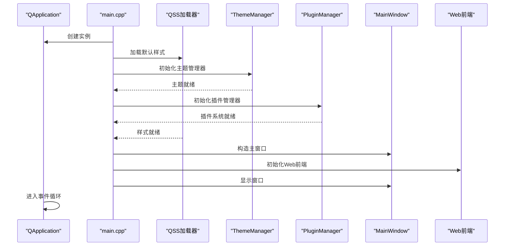
```mermaid
sequenceDiagram
participant App as "QApplication"
participant Main as "main.cpp"
participant Style as "QSS加载器"
participant Theme as "ThemeManager"
participant Plugin as "PluginManager"
participant Win as "MainWindow"
participant Web as "Web前端"
Main->>App : 创建实例
Main->>Style : 加载默认样式
Main->>Theme : 初始化主题管理器
Theme-->>Main : 主题就绪
Main->>Plugin : 初始化插件管理器
Plugin-->>Main : 插件系统就绪
Style-->>Main : 样式就绪
Main->>Win : 构造主窗口
Main->>Web : 初始化Web前端
Main->>Win : 显示窗口
App->>App : 进入事件循环
```

**图表来源**
- [src/main.cpp](file://src/main.cpp)

章节来源
- [src/main.cpp](file://src/main.cpp)

### 主窗口（MainWindow）
职责与交互
- 作为UI根节点，组织控件树与布局
- 处理用户输入与业务事件转发
- 管理主题切换与样式动态更新
- 与资源系统协作加载图标、图片等
- 集成Web前端原型和JavaScript通信
- **新增** 插件系统协调，管理插件生命周期

类关系与数据流
- 继承自 QWidget/QMainWindow（由 .ui 生成基类）
- 持有样式管理器与主题配置
- 通过信号槽机制与子控件通信
- 支持Web前端的原型验证和交互测试
- **新增** 与插件管理器的集成，处理插件相关事件

**更新** MainWindow现在通过混合架构模式工作：Qt Designer生成的UI类负责界面结构，而手写的C++代码负责业务逻辑和交互处理，并集成了活动栏、底部面板、右侧面板、分割编辑器区域、增强的侧边栏面板系统和全新的设备连接界面等多个专业UI组件。**特别重要的是，新增了ThemeManager主题管理器的集成，支持运行时主题切换；设备连接界面DeviceConnectionTab提供了完整的CAN/CAN FD配置选项；侧边栏面板系统得到了显著增强，DbcPanel类现在支持DatabaseEntry结构和多协议分类管理。活动栏导航系统已重新组织，'Flow'按钮被移动到更显眼的位置，与CANoe Measurement Setup行业标准保持一致。工具集系统得到完善，通过onToolOpened槽函数实现了工具激活请求的统一处理，支持多种总线分析工具的动态加载和管理。设备连接行为已升级为V2接口，支持更完整的设备配置参数。TransceivePanel作为统一的收发功能入口，简化了用户操作流程。新增的Downsample模块通过智能数据裁剪和四种抽稀策略，将百万级原始数据点转换为视口像素级别的显示数据，确保O(视口宽)恒定渲染成本，大幅提升大数据量波形渲染性能。**主窗口作为协调者，统一管理各组件的生命周期和数据流，并支持与Web前端原型的无缝集成。

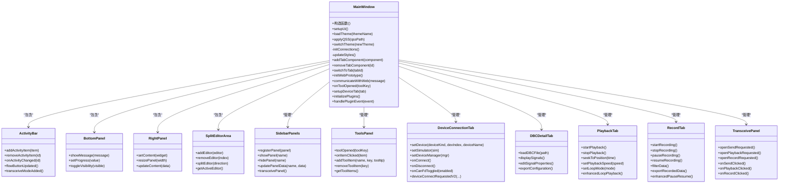
```mermaid
classDiagram
class MainWindow {
+构造函数()
+setupUi()
+loadTheme(themeName)
+applyQSS(qssPath)
+switchTheme(newTheme)
-initConnections()
-updateStyles()
+addTabComponent(component)
+removeTabComponent(id)
+switchToTab(tabId)
+initWebPrototype()
+communicateWithWeb(message)
+onToolOpened(toolKey)
+setupDeviceTab(tab)
+initializePlugins()
+handlePluginEvent(event)
}
class ActivityBar {
+addActivityItem(item)
+removeActivityItem(id)
+onActivityChanged(id)
+flowButtonUpdated()
+transceiveModeAdded()
}
class BottomPanel {
+showMessage(message)
+setProgress(value)
+toggleVisibility(visible)
}
class RightPanel {
+setContent(widget)
+resizePanel(width)
+updateContent(data)
}
class SplitEditorArea {
+addEditor(editor)
+removeEditor(index)
+splitEditor(direction)
+getActiveEditor()
}
class SidebarPanels {
+registerPanel(panel)
+showPanel(name)
+hidePanel(name)
+updatePanelData(name, data)
+transceivePanel()
}
class ToolsPanel {
+toolOpened(toolKey)
+onItemClicked(item)
+addToolItem(name, key, tooltip)
+removeToolItem(key)
+getToolItems()
}
class DeviceConnectionTab {
+setDevice(deviceKind, devIndex, deviceName)
+setSimulator(sim)
+setDeviceManager(mgr)
+onConnect()
+onDisconnect()
+onCanFdToggled(enabled)
+deviceConnectRequestedV2(...)
}
class DBCDetailTab {
+loadDBCFile(path)
+displaySignals()
+editSignalProperties()
+exportConfiguration()
}
class PlaybackTab {
+startPlayback()
+stopPlayback()
+seekToPosition(time)
+setPlaybackSpeed(speed)
+setLoopMode(mode)
+enhancedLoopPlayback()
}
class RecordTab {
+startRecording()
+stopRecording()
+pauseRecording()
+resumeRecording()
+filterData()
+exportRecordedData()
+enhancedPauseResume()
}
class TransceivePanel {
+openSendRequested()
+openPlaybackRequested()
+openRecordRequested()
+onSendClicked()
+onPlaybackClicked()
+onRecordClicked()
}
MainWindow --> ActivityBar : "包含"
MainWindow --> BottomPanel : "包含"
MainWindow --> RightPanel : "包含"
MainWindow --> SplitEditorArea : "包含"
MainWindow --> SidebarPanels : "管理"
MainWindow --> ToolsPanel : "管理"
MainWindow --> DeviceConnectionTab : "管理"
MainWindow --> DBCDetailTab : "管理"
MainWindow --> PlaybackTab : "管理"
MainWindow --> RecordTab : "管理"
MainWindow --> TransceivePanel : "管理"
```

**图表来源**
- [src/ui/mainwindow.h](file://src/ui/mainwindow.h)
- [src/ui/mainwindow.cpp](file://src/ui/mainwindow.cpp)
- [src/ui/activitybar.h](file://src/ui/activitybar.h)
- [src/ui/bottompanel.h](file://src/ui/bottompanel.h)
- [src/ui/rightpanel.h](file://src/ui/rightpanel.h)
- [src/ui/spliteditorarea.h](file://src/ui/spliteditorarea.h)
- [src/ui/panels/sidebarpanels.h](file://src/ui/panels/sidebarpanels.h)
- [src/ui/deviceconnectiontab.h](file://src/ui/deviceconnectiontab.h)
- [src/ui/dbcdetailtab.h](file://src/ui/dbcdetailtab.h)
- [src/ui/playbacktab.h](file://src/ui/playbacktab.h)
- [src/ui/recordtab.h](file://src/ui/recordtab.h)

章节来源
- [src/ui/mainwindow.h](file://src/ui/mainwindow.h)
- [src/ui/mainwindow.cpp](file://src/ui/mainwindow.cpp)

### 样式系统（QSS与主题管理）
设计理念
- 集中式样式表：通过单一QSS文件管理全局外观
- 主题机制：以主题为单位切换样式集，支持运行时热更新
- 动态更新：不重建控件的前提下刷新样式
- Web前端样式集成：支持CSS样式与QSS样式的统一管理

**更新** 新增了ThemeManager主题管理器，支持7种内置主题（Light、Dark、VS Code Dark+、VS Code Light+、Monokai、Solarized Light、Solarized Dark），通过@变量占位符实现运行时主题切换。主题模板theme.qss使用@变量语法，ThemeManager在运行时将变量替换为具体的颜色值。

样式加载与切换流程
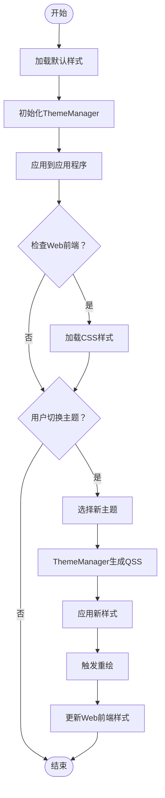
```mermaid
flowchart TD
Start(["开始"]) --> LoadDefault["加载默认样式"]
LoadDefault --> InitTheme["初始化ThemeManager"]
InitTheme --> Apply["应用到应用程序"]
Apply --> CheckWeb{"检查Web前端？"}
CheckWeb --> |是| LoadCSS["加载CSS样式"]
CheckWeb --> |否| UserAction{"用户切换主题？"}
LoadCSS --> UserAction
UserAction --> |否| End(["结束"])
UserAction --> |是| SelectTheme["选择新主题"]
SelectTheme --> GenerateQSS["ThemeManager生成QSS"]
GenerateQSS --> ApplyNew["应用新样式"]
ApplyNew --> Refresh["触发重绘"]
Refresh --> UpdateWeb["更新Web前端样式"]
UpdateWeb --> End
```

**图表来源**
- [resources/styles/default.qss](file://resources/styles/default.qss)
- [resources/styles/theme.qss](file://resources/styles/theme.qss)
- [resources/resources.qrc](file://resources/resources.qrc)
- [src/ui/thememanager.h](file://src/ui/thememanager.h)
- [src/ui/thememanager.cpp](file://src/ui/thememanager.cpp)
- [UI/css/ui-prototype.css](file://UI/css/ui-prototype.css)

章节来源
- [resources/styles/default.qss](file://resources/styles/default.qss)
- [resources/styles/theme.qss](file://resources/styles/theme.qss)
- [resources/resources.qrc](file://resources/resources.qrc)
- [src/ui/thememanager.h](file://src/ui/thememanager.h)
- [src/ui/thememanager.cpp](file://src/ui/thememanager.cpp)
- [UI/css/ui-prototype.css](file://UI/css/ui-prototype.css)

### SVG图标系统
功能特性
- 动态颜色替换：读取SVG文件后替换currentColor为指定颜色
- 主题适配：根据当前主题自动调整图标颜色
- 双状态图标：支持未选中灰色和选中白色两种状态
- 高性能渲染：使用QSvgRenderer进行矢量渲染

技术实现
- renderSvgPixmap函数：读取SVG文件，替换颜色，渲染为QPixmap
- svgIcon便捷函数：直接返回单色QIcon
- 支持透明背景和抗锯齿渲染

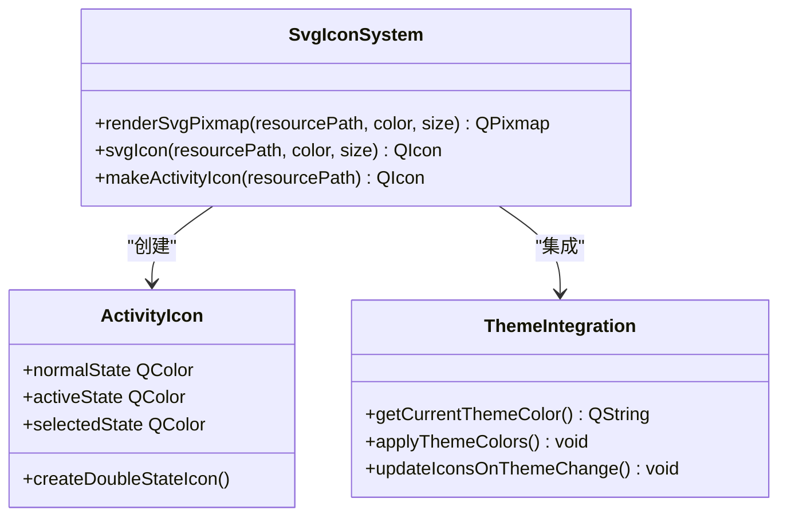
```mermaid
classDiagram
class SvgIconSystem {
+renderSvgPixmap(resourcePath, color, size) QPixmap
+svgIcon(resourcePath, color, size) QIcon
+makeActivityIcon(resourcePath) QIcon
}
class ActivityIcon {
+normalState QColor
+activeState QColor
+selectedState QColor
+createDoubleStateIcon()
}
class ThemeIntegration {
+getCurrentThemeColor() QString
+applyThemeColors() void
+updateIconsOnThemeChange() void
}
SvgIconSystem --> ActivityIcon : "创建"
SvgIconSystem --> ThemeIntegration : "集成"
```

**图表来源**
- [src/utils/svg_icon.h](file://src/utils/svg_icon.h)
- [src/ui/activitybar.cpp](file://src/ui/activitybar.cpp)

章节来源
- [src/utils/svg_icon.h](file://src/utils/svg_icon.h)
- [src/ui/activitybar.cpp](file://src/ui/activitybar.cpp)

### 资源系统（resources.qrc）
组织原则
- 将样式、图标、字体等静态资源纳入qrc清单
- 通过:/前缀在代码中引用，避免平台路径差异
- 便于打包与版本化管理
- 支持Web前端资源的统一管理

**更新** 新增了SVG图标资源，包括project.svg、trace.svg、graphic.svg、database.svg、send.svg、record.svg、device.svg、protocol.svg、flow.svg、tools.svg、settings.svg、file.svg等图标文件，全部支持动态颜色替换。

常用用法
- 在样式表中引用资源：url(:/styles/default.qss)
- 在代码中加载资源：QFile(":/...")
- Web前端资源通过HTTP服务器访问
- SVG图标通过renderSvgPixmap函数动态渲染

章节来源
- [resources/resources.qrc](file://resources/resources.qrc)

### 多语言支持
策略与建议
- 使用Qt Linguist进行翻译管理
- 通过tr()/translate()包裹用户可见文本
- 运行时根据locale切换语言包
- 与主题系统解耦，避免样式与文案耦合
- Web前端支持国际化资源文件

章节来源
- [README.en.md](file://README.en.md)

### 设置对话框（SettingsDialog）
功能特性
- VS Code风格设置界面，左侧分类树 + 右侧设置项列表
- 支持直接编辑JSON配置文件（类似VS Code的settings.json）
- 提供搜索功能和分类过滤
- 支持重置为默认配置

**更新** 设置对话框现在包含了覆盖模式的配置选项，用户可以通过界面或JSON编辑器直接修改trace.overwriteMode设置。新增了对Trace、Graphic、Record等模块的配置项管理。

技术实现
- 基于QTreeWidget的分类树管理
- QStackedWidget实现设置页面切换
- 支持JSON格式的导入导出
- 实时预览和验证配置

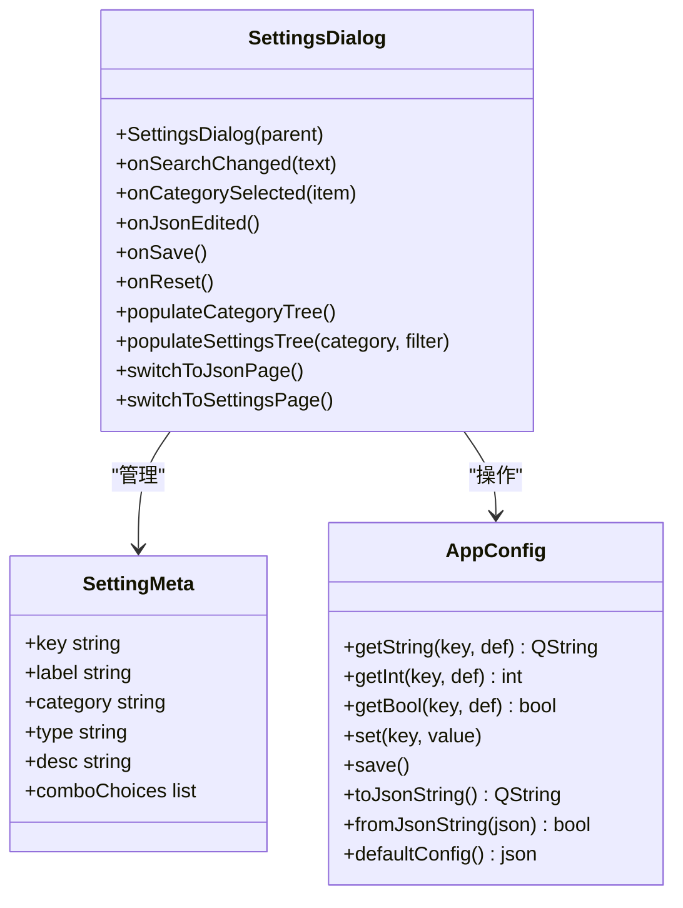
```mermaid
classDiagram
class SettingsDialog {
+SettingsDialog(parent)
+onSearchChanged(text)
+onCategorySelected(item)
+onJsonEdited()
+onSave()
+onReset()
+populateCategoryTree()
+populateSettingsTree(category, filter)
+switchToJsonPage()
+switchToSettingsPage()
}
class SettingMeta {
+key string
+label string
+category string
+type string
+desc string
+comboChoices list
}
class AppConfig {
+getString(key, def) QString
+getInt(key, def) int
+getBool(key, def) bool
+set(key, value)
+save()
+toJsonString() QString
+fromJsonString(json) bool
+defaultConfig() json
}
SettingsDialog --> SettingMeta : "管理"
SettingsDialog --> AppConfig : "操作"
```

**图表来源**
- [src/ui/settingsdialog.h](file://src/ui/settingsdialog.h)
- [src/ui/settingsdialog.cpp](file://src/ui/settingsdialog.cpp)

章节来源
- [src/ui/settingsdialog.h](file://src/ui/settingsdialog.h)
- [src/ui/settingsdialog.cpp](file://src/ui/settingsdialog.cpp)

### 活动栏（ActivityBar）增强
功能特性
- **新增** Transceive模式枚举，提供统一的收发功能入口
- **新增** 收发按钮集成，支持发送、回放、录制的快速访问
- **增强** 活动栏按钮顺序优化，工作流程更加合理
- **增强** 工具提示改进，提供更清晰的功能描述

技术实现
- 在Activity枚举中新增Transceive类型
- 在活动栏初始化时添加工发按钮
- 支持按钮的双状态图标显示
- 与侧边栏面板系统集成

```mermaid
classDiagram
class ActivityBar {
+enum Activity {
+ None = -1,
+ Project = 0,
+ Analysis,
+ Device,
+ Trace,
+ Graphic,
+ Dbc,
+ Transceive, // 新增收发模式
+ Protocol,
+ Tools,
+ Settings
+}
+ActivityBar(parent)
+setCurrentActivity(act)
+onButtonClicked()
+createButton(iconPath, tooltip, act, atBottom)
+flowButtonUpdated()
}
class TransceivePanel {
+openSendRequested()
+openPlaybackRequested()
+openRecordRequested()
+onSendClicked()
+onPlaybackClicked()
+onRecordClicked()
}
ActivityBar --> TransceivePanel : "触发"
```

**图表来源**
- [src/ui/activitybar.h](file://src/ui/activitybar.h)
- [src/ui/activitybar.cpp](file://src/ui/activitybar.cpp)
- [src/ui/panels/sidebarpanels.h](file://src/ui/panels/sidebarpanels.h)

章节来源
- [src/ui/activitybar.h](file://src/ui/activitybar.h)
- [src/ui/activitybar.cpp](file://src/ui/activitybar.cpp)

### 收发面板（TransceivePanel）- 新增
功能特性
- **新增** 统一的收发功能入口，整合发送、回放、录制三个功能
- **新增** 简洁的按钮界面，提供直观的操作入口
- **新增** 信号发射机制，与主窗口进行通信
- **新增** 可扩展的架构，支持未来功能的添加

技术实现
- 继承自SidePanel基类，保持界面风格一致
- 三个主要按钮分别对应发送、回放、录制功能
- 通过信号槽机制与主窗口进行通信
- 支持按钮的样式定制和交互反馈

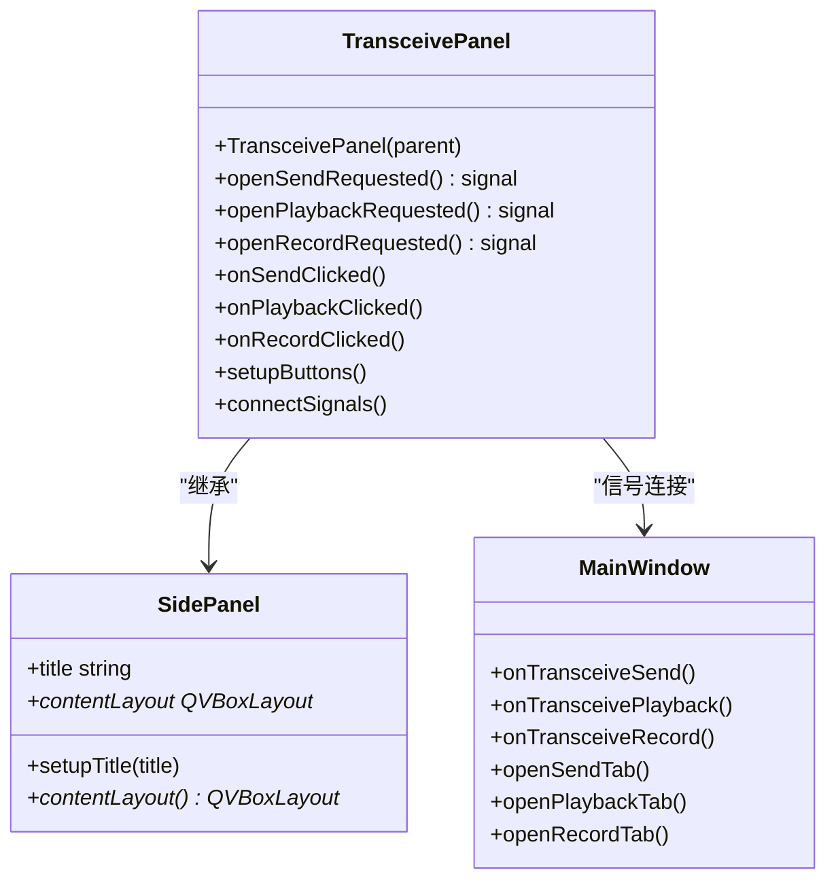
```mermaid
classDiagram
class TransceivePanel {
+TransceivePanel(parent)
+openSendRequested() signal
+openPlaybackRequested() signal
+openRecordRequested() signal
+onSendClicked()
+onPlaybackClicked()
+onRecordClicked()
+setupButtons()
+connectSignals()
}
class SidePanel {
+title string
+contentLayout QVBoxLayout*
+setupTitle(title)
+contentLayout() QVBoxLayout*
}
class MainWindow {
+onTransceiveSend()
+onTransceivePlayback()
+onTransceiveRecord()
+openSendTab()
+openPlaybackTab()
+openRecordTab()
}
TransceivePanel --> SidePanel : "继承"
TransceivePanel --> MainWindow : "信号连接"
```

**图表来源**
- [src/ui/panels/sidebarpanels.h](file://src/ui/panels/sidebarpanels.h)
- [src/ui/panels/sidebarpanels.cpp](file://src/ui/panels/sidebarpanels.cpp)

章节来源
- [src/ui/panels/sidebarpanels.h](file://src/ui/panels/sidebarpanels.h)
- [src/ui/panels/sidebarpanels.cpp](file://src/ui/panels/sidebarpanels.cpp)

### FilterHeaderView组件（新增）
功能特性
- **新增** 自定义排序指示器绘制功能，不使用Qt内置排序指示器
- **新增** setSortState()和clearSortState()方法，实现独立的排序状态管理
- **新增** 排序三角形与漏斗图标的精确布局，避免重叠并提供清晰的视觉反馈
- **新增** 悬停效果和颜色状态变化，提升交互体验
- **新增** 鼠标指针变化，在漏斗图标上显示手型指针
- **新增** 与CanFilterProxyModel集成，支持列过滤状态检测

技术实现
- 继承自QHeaderView，重写paintSection()方法实现自定义绘制
- 使用QPainterPath绘制排序三角形和漏斗图标
- 实现setSortState()和clearSortState()方法管理排序状态
- 通过filterRect()和sortIndicatorRect()方法计算图标位置
- 使用mouseMoveEvent()和leaveEvent()处理悬停效果
- 通过filterClicked信号与TraceView集成

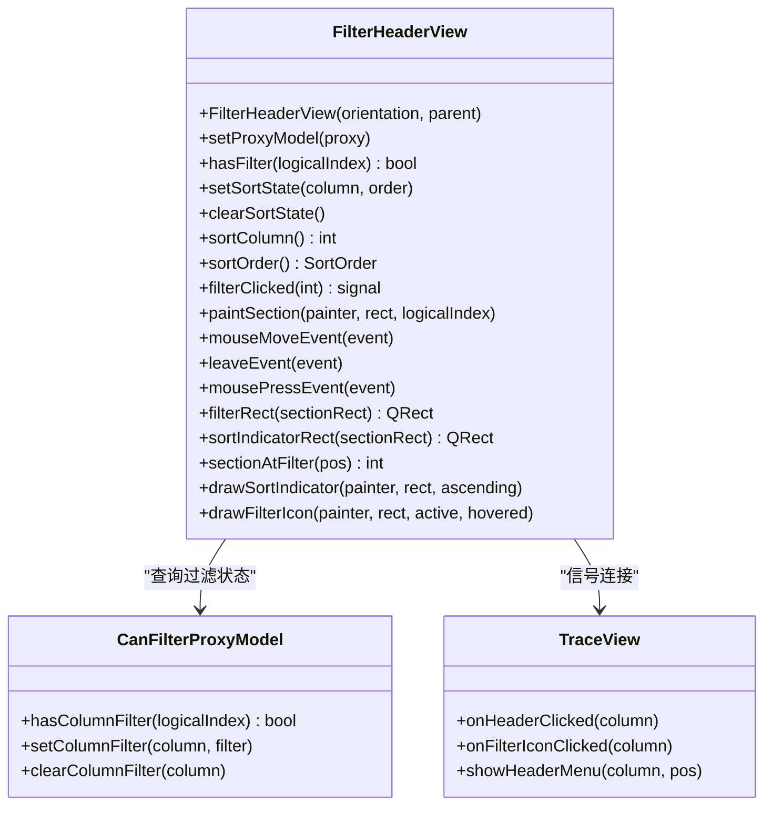
```mermaid
classDiagram
class FilterHeaderView {
+FilterHeaderView(orientation, parent)
+setProxyModel(proxy)
+hasFilter(logicalIndex) bool
+setSortState(column, order)
+clearSortState()
+sortColumn() int
+sortOrder() SortOrder
+filterClicked(int) signal
+paintSection(painter, rect, logicalIndex)
+mouseMoveEvent(event)
+leaveEvent(event)
+mousePressEvent(event)
+filterRect(sectionRect) QRect
+sortIndicatorRect(sectionRect) QRect
+sectionAtFilter(pos) int
+drawSortIndicator(painter, rect, ascending)
+drawFilterIcon(painter, rect, active, hovered)
}
class CanFilterProxyModel {
+hasColumnFilter(logicalIndex) bool
+setColumnFilter(column, filter)
+clearColumnFilter(column)
}
class TraceView {
+onHeaderClicked(column)
+onFilterIconClicked(column)
+showHeaderMenu(column, pos)
}
FilterHeaderView --> CanFilterProxyModel : "查询过滤状态"
FilterHeaderView --> TraceView : "信号连接"
```

**图表来源**
- [src/ui/filterheaderview.h](file://src/ui/filterheaderview.h)
- [src/ui/filterheaderview.cpp](file://src/ui/filterheaderview.cpp)
- [src/ui/traceview.cpp](file://src/ui/traceview.cpp)

章节来源
- [src/ui/filterheaderview.h](file://src/ui/filterheaderview.h)
- [src/ui/filterheaderview.cpp](file://src/ui/filterheaderview.cpp)
- [src/ui/traceview.cpp](file://src/ui/traceview.cpp)

## 增强图形组件

### 高性能视口降采样模块（Downsample）- 新增
功能特性
- **新增** Min/Max策略：每桶保留最小值和最大值两点，确保波形轮廓无损
- **新增** Average策略：每桶计算平均值，适用于平滑显示需求
- **新增** First策略：每桶取第一个点，保持时间序列连续性
- **新增** Decimate策略：每N个点取一个，均匀降采样
- **新增** 智能区间定位：使用二分查找快速定位视口范围
- **新增** 外延点保证：确保阶梯线边缘跳变沿正确渲染
- **新增** O(视口宽)恒定渲染成本：无论原始数据量多大，渲染成本仅与视口宽度相关

技术实现
- 基于RingBuffer的高效数据访问
- 二分查找lowerBound函数快速定位时间区间
- 桶化算法将时间轴划分为多个桶进行处理
- 每种策略都有针对性的数据处理逻辑
- 兜底机制确保首尾端点的完整性

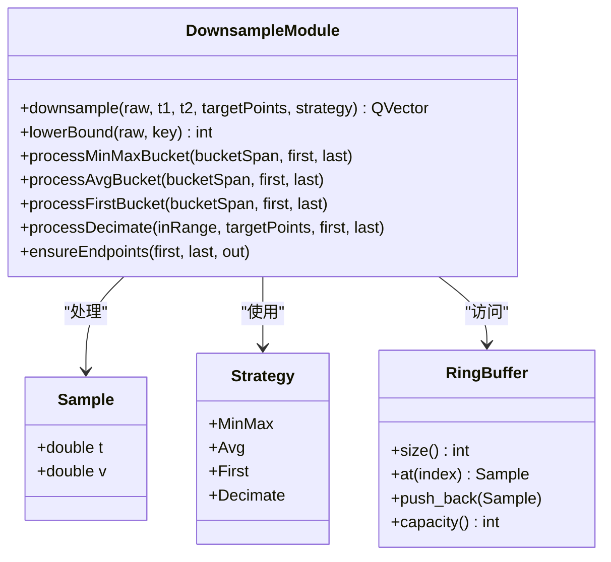
```mermaid
classDiagram
class DownsampleModule {
+downsample(raw, t1, t2, targetPoints, strategy) QVector<Sample>
+lowerBound(raw, key) int
+processMinMaxBucket(bucketSpan, first, last)
+processAvgBucket(bucketSpan, first, last)
+processFirstBucket(bucketSpan, first, last)
+processDecimate(inRange, targetPoints, first, last)
+ensureEndpoints(first, last, out)
}
class Sample {
+double t
+double v
}
class Strategy {
+MinMax
+Avg
+First
+Decimate
}
class RingBuffer {
+size() int
+at(index) Sample
+push_back(Sample)
+capacity() int
}
DownsampleModule --> Sample : "处理"
DownsampleModule --> Strategy : "使用"
DownsampleModule --> RingBuffer : "访问"
```

**图表来源**
- [src/ui/graphic/downsample.h](file://src/ui/graphic/downsample.h)
- [src/ui/graphic/downsample.cpp](file://src/ui/graphic/downsample.cpp)

章节来源
- [src/ui/graphic/downsample.h](file://src/ui/graphic/downsample.h)
- [src/ui/graphic/downsample.cpp](file://src/ui/graphic/downsample.cpp)

### 视口概览组件系统
功能特性
- **新增** ViewportProxyModel：CANoe风格的视窗代理模型，提供固定行数视窗限制
- **新增** ViewportOverview：视窗缩略图组件，支持拖拽式视窗导航
- 固定行数视窗：通过ViewportProxyModel限制显示的行数，优化大数据集处理
- 拖拽导航：支持拖拽缩略图中的高亮区域移动视窗
- 点击跳转：点击缩略图任意位置跳转到对应视窗位置
- 密度缓存：智能缓存缩略图渲染结果，提升性能

技术实现
- 基于QAbstractProxyModel的视窗代理模型
- 自定义QWidget实现缩略图绘制和交互
- 信号槽机制实现视窗位置同步
- 智能缓存机制减少重复渲染

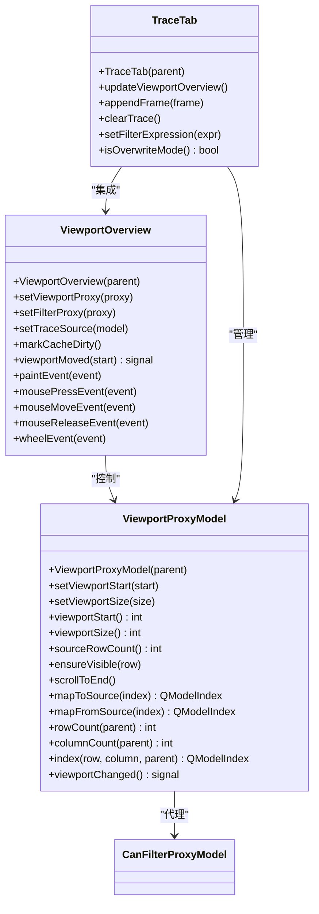
```mermaid
classDiagram
class ViewportProxyModel {
+ViewportProxyModel(parent)
+setViewportStart(start)
+setViewportSize(size)
+viewportStart() int
+viewportSize() int
+sourceRowCount() int
+ensureVisible(row)
+scrollToEnd()
+mapToSource(index) QModelIndex
+mapFromSource(index) QModelIndex
+rowCount(parent) int
+columnCount(parent) int
+index(row, column, parent) QModelIndex
+viewportChanged() signal
}
class ViewportOverview {
+ViewportOverview(parent)
+setViewportProxy(proxy)
+setFilterProxy(proxy)
+setTraceSource(model)
+markCacheDirty()
+viewportMoved(start) signal
+paintEvent(event)
+mousePressEvent(event)
+mouseMoveEvent(event)
+mouseReleaseEvent(event)
+wheelEvent(event)
}
class TraceTab {
+TraceTab(parent)
+updateViewportOverview()
+appendFrame(frame)
+clearTrace()
+setFilterExpression(expr)
+isOverwriteMode() bool
}
ViewportProxyModel --> CanFilterProxyModel : "代理"
ViewportOverview --> ViewportProxyModel : "控制"
TraceTab --> ViewportOverview : "集成"
TraceTab --> ViewportProxyModel : "管理"
```

**图表来源**
- [src/models/viewportproxy.h](file://src/models/viewportproxy.h)
- [src/models/viewportproxy.cpp](file://src/models/viewportproxy.cpp)
- [src/ui/traceview.h](file://src/ui/traceview.h)
- [src/ui/traceview.cpp](file://src/ui/traceview.cpp)

章节来源
- [src/models/viewportproxy.h](file://src/models/viewportproxy.h)
- [src/models/viewportproxy.cpp](file://src/models/viewportproxy.cpp)
- [src/ui/traceview.h](file://src/ui/traceview.h)
- [src/ui/traceview.cpp](file://src/ui/traceview.cpp)

### 图形视图（GraphicView）增强
功能特性
- 提供CAN信号的可视化图形显示
- 支持实时波形绘制与缩放
- 多通道信号对比显示
- 交互式数据点标注
- **增强** 基于QCustomPlot的专业级图表引擎
- **增强** 多轴信号绘图，每个信号拥有独立的Y轴
- **增强** 交互式光标系统，支持单卡尺和双卡尺模式
- **增强** 实时数据流处理，支持高性能的批处理渲染
- **增强** 优化的渲染引擎和内存管理
- **增强** 改进的缩放和平移交互
- **增强** 支持更多数据类型和格式
- **最新改进** 修复了崩溃问题，提升了稳定性
- **最新改进** 优化了对新测试数据集的支持能力
- **新增** 高性能视口降采样集成，支持四种抽稀策略
- **新增** 插件集成能力，支持动态扩展可视化功能

技术实现
- 基于QCustomPlot框架的专业图表引擎
- 自定义CursorPlot类扩展鼠标事件处理
- 多轴AxisRect布局，每个信号独立显示
- 高性能的实时更新机制，使用定时器批量重绘
- **增强** 双缓冲渲染减少闪烁
- **增强** 增量更新避免全量重绘
- **增强** 智能数据裁剪，超过显示窗口的数据自动清理
- **增强** 插值算法支持精确的卡尺测量
- **新增** downsample模块集成，实现O(视口宽)恒定渲染成本
- **新增** 插件系统集成，支持动态加载和执行Python插件
- **新增** 扩展点接口，允许插件自定义渲染逻辑
- **最新改进** 增强的错误处理和异常恢复机制
- **最新改进** 优化的内存管理和资源清理

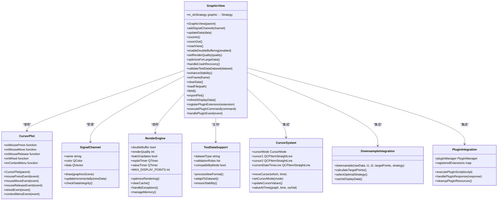
```mermaid
classDiagram
class GraphicView {
+GraphicView(parent)
+addSignalChannel(channel)
+updateData(data)
+zoomIn()
+zoomOut()
+resetView()
+enableDoubleBuffering(enabled)
+setRenderQuality(quality)
+optimizeForLargeData()
+handleCrashRecovery()
+validateTestDataDataset(dataset)
+enhanceStability()
+onFrame(frame)
+clearData()
+loadFile(path)
+fitAll()
+exportPlot()
+m_dsStrategy graphic : : Strategy
+refreshDisplayData()
+registerPluginExtension(extension)
+executePluginCommand(command)
+handlePluginEvent(event)
}
class CursorPlot {
+CursorPlot(parent)
+mousePressEvent(event)
+mouseMoveEvent(event)
+mouseReleaseEvent(event)
+wheelEvent(event)
+contextMenuEvent(event)
+onMousePress function
+onMouseMove function
+onMouseRelease function
+onWheel function
+onContextMenu function
}
class SignalChannel {
+name string
+color QColor
+data QVector
+draw(graphicsScene)
+updateIncrementally(newData)
+checkDataIntegrity()
}
class RenderEngine {
+doubleBuffer bool
+renderQuality int
+batchUpdates bool
+optimizeRendering()
+clearCache()
+handleExceptions()
+manageMemory()
+replotTimer QTimer
+valueTimer QTimer
+MAX_DISPLAY_POINTS int
}
class TestDataSupport {
+datasetType string
+validationRules list
+compatibilityMode bool
+processNewFormat()
+adaptToDataset()
+ensureStability()
}
class CursorSystem {
+cursorMode CursorMode
+cursor1 QCPItemStraightLine
+cursor2 QCPItemStraightLine
+currentDateTimeLine QCPItemStraightLine
+moveCursor(which, time)
+setCursorMode(mode)
+updateCursorValues()
+valueAtTime(graph, time, outVal)
}
class DownsampleIntegration {
+downsample(rawData, t1, t2, targetPoints, strategy)
+calculateTargetPoints()
+selectOptimalStrategy()
+cacheDisplayData()
}
class PluginIntegration {
+pluginManager PluginManager*
+registeredExtensions map
+executePluginScript(script)
+handlePluginResponse(response)
+cleanupPluginResources()
}
GraphicView --> CursorPlot : "使用"
GraphicView --> SignalChannel : "管理"
GraphicView --> RenderEngine : "使用"
GraphicView --> TestDataSupport : "支持"
GraphicView --> CursorSystem : "集成"
GraphicView --> DownsampleIntegration : "集成"
GraphicView --> PluginIntegration : "集成"
```

**图表来源**
- [src/ui/graphicview.h](file://src/ui/graphicview.h)
- [src/ui/graphicview.cpp](file://src/ui/graphicview.cpp)
- [third_party/qcustomplot/qcustomplot.h](file://third_party/qcustomplot/qcustomplot.h)

章节来源
- [src/ui/graphicview.h](file://src/ui/graphicview.h)
- [src/ui/graphicview.cpp](file://src/ui/graphicview.cpp)

### 跟踪视图（TraceView）增强
功能特性
- 显示CAN总线数据包的详细跟踪信息
- 支持时间轴滚动查看
- 数据包颜色编码与状态标识
- 搜索与筛选功能
- **增强** 改进的数据分页和虚拟滚动
- **增强** 优化的内存使用和缓存机制
- **增强** 更丰富的过滤和搜索选项
- **新增** 视口概览组件集成，提供缩略图导航
- **新增** FilterHeaderView集成，提供Wireshark风格的表头界面

数据管理
- 高效的数据存储与检索
- 内存优化的大数据集处理
- 异步数据加载与显示
- **增强** 智能预取和缓存策略
- **增强** 支持增量数据更新

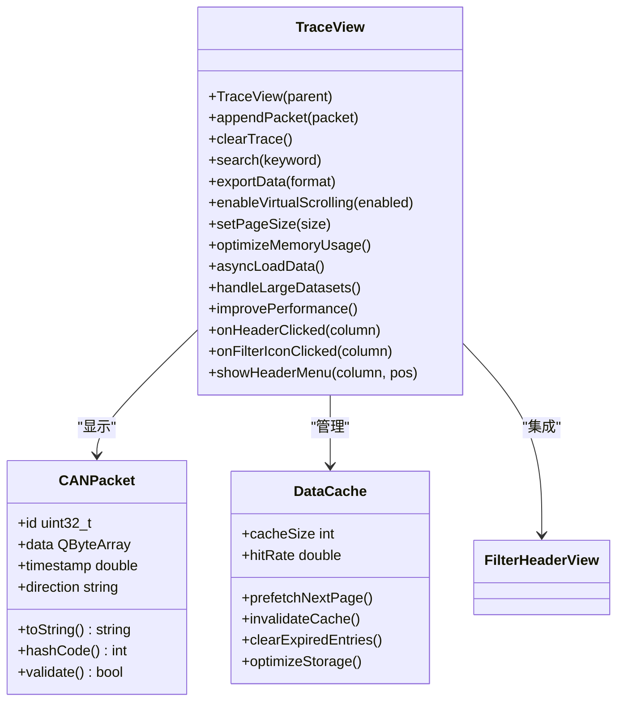
```mermaid
classDiagram
class TraceView {
+TraceView(parent)
+appendPacket(packet)
+clearTrace()
+search(keyword)
+exportData(format)
+enableVirtualScrolling(enabled)
+setPageSize(size)
+optimizeMemoryUsage()
+asyncLoadData()
+handleLargeDatasets()
+improvePerformance()
+onHeaderClicked(column)
+onFilterIconClicked(column)
+showHeaderMenu(column, pos)
}
class CANPacket {
+id uint32_t
+data QByteArray
+timestamp double
+direction string
+toString() string
+hashCode() int
+validate() bool
}
class DataCache {
+cacheSize int
+hitRate double
+prefetchNextPage()
+invalidateCache()
+clearExpiredEntries()
+optimizeStorage()
}
TraceView --> CANPacket : "显示"
TraceView --> DataCache : "管理"
TraceView --> FilterHeaderView : "集成"
```

**图表来源**
- [src/ui/traceview.h](file://src/ui/traceview.h)
- [src/ui/traceview.cpp](file://src/ui/traceview.cpp)

章节来源
- [src/ui/traceview.h](file://src/ui/traceview.h)
- [src/ui/traceview.cpp](file://src/ui/traceview.cpp)

### 设备连接界面（DeviceConnectionTab）增强
功能特性
- 提供完整的设备参数配置界面
- 支持CAN 2.0A和CAN FD模式切换
- 通道使能配置和多通道支持
- 仲裁段和数据段波特率设置
- 时序预设管理和详细信息显示
- 连接/断开控制和状态显示

**更新** 设备连接界面得到了显著增强，采用了V2信号接口，支持更完整的设备配置参数。新增了设备类型子类型支持，能够处理不同厂商设备的特定配置。连接行为更加稳定，提供了更好的错误处理和状态反馈。

技术实现
- 基于QVBoxLayout的垂直布局
- QGroupBox分组管理不同配置区域
- QComboBox提供可编辑的波特率输入
- QCheckBox支持多通道选择
- 时序预设包含SJW、TSEG1、TSEG2和采样点信息
- **新增** V2信号接口支持：deviceConnectRequestedV2信号携带完整设备配置参数

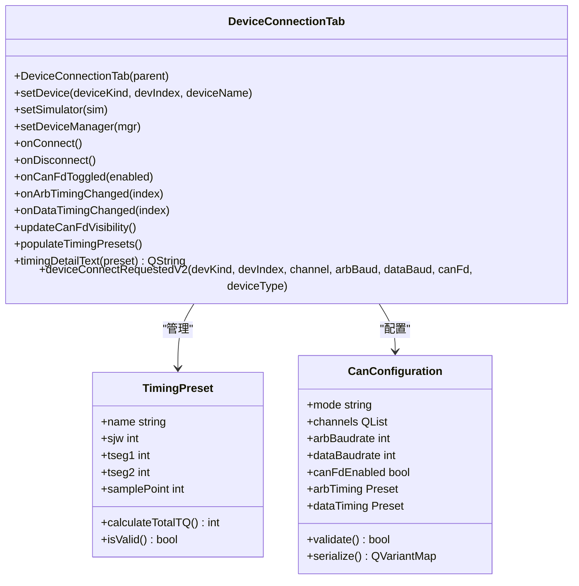
```mermaid
classDiagram
class DeviceConnectionTab {
+DeviceConnectionTab(parent)
+setDevice(deviceKind, devIndex, deviceName)
+setSimulator(sim)
+setDeviceManager(mgr)
+onConnect()
+onDisconnect()
+onCanFdToggled(enabled)
+onArbTimingChanged(index)
+onDataTimingChanged(index)
+updateCanFdVisibility()
+populateTimingPresets()
+timingDetailText(preset) QString
+deviceConnectRequestedV2(devKind, devIndex, channel, arbBaud, dataBaud, canFd, deviceType)
}
class TimingPreset {
+name string
+sjw int
+tseg1 int
+tseg2 int
+samplePoint int
+calculateTotalTQ() int
+isValid() bool
}
class CanConfiguration {
+mode string
+channels QList<int>
+arbBaudrate int
+dataBaudrate int
+canFdEnabled bool
+arbTiming Preset
+dataTiming Preset
+validate() bool
+serialize() QVariantMap
}
DeviceConnectionTab --> TimingPreset : "管理"
DeviceConnectionTab --> CanConfiguration : "配置"
```

**图表来源**
- [src/ui/deviceconnectiontab.h](file://src/ui/deviceconnectiontab.h)
- [src/ui/deviceconnectiontab.cpp](file://src/ui/deviceconnectiontab.cpp)

章节来源
- [src/ui/deviceconnectiontab.h](file://src/ui/deviceconnectiontab.h)
- [src/ui/deviceconnectiontab.cpp](file://src/ui/deviceconnectiontab.cpp)

### 侧边栏面板系统（SidebarPanels）增强
功能特性
- 动态注册与管理多个侧边栏面板
- 支持面板的显示/隐藏切换
- 面板间的数据共享与通信
- 面板布局的自适应调整
- **增强** 改进的面板切换动画效果
- **增强** 更好的键盘导航支持
- **增强** 增强的可访问性功能

架构设计
- 基于QStackedWidget的面板堆栈管理
- 信号槽机制实现面板间通信
- 支持面板配置的持久化存储
- **增强** 懒加载面板内容
- **增强** 面板状态自动保存和恢复

**更新** 侧边栏面板系统得到了显著增强，特别是DbcPanel类现在支持DatabaseEntry结构和多协议分类管理。DbcPanel能够处理CAN/CANFD、CANopen、EtherCAT、LIN、J1939、AUTOSAR等多种协议类型的数据库文件，通过树形结构展示不同协议的解析文件。MeasurementSetupPanel标题已更新为'Flow'，与CANoe Measurement Setup行业标准保持一致。**TransceivePanel作为统一的收发功能入口，整合了发送、回放、录制三个功能，简化了用户操作流程。**

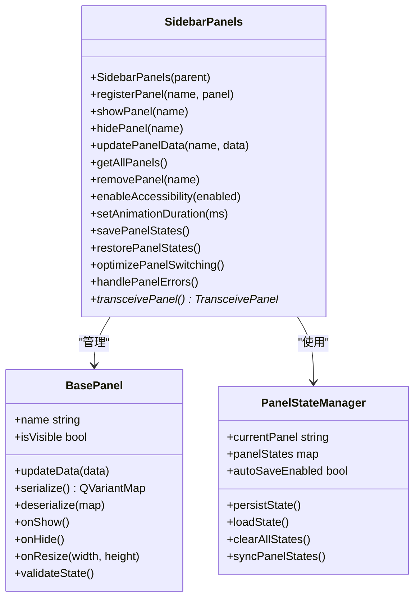
```mermaid
classDiagram
class SidebarPanels {
+SidebarPanels(parent)
+registerPanel(name, panel)
+showPanel(name)
+hidePanel(name)
+updatePanelData(name, data)
+getAllPanels()
+removePanel(name)
+enableAccessibility(enabled)
+setAnimationDuration(ms)
+savePanelStates()
+restorePanelStates()
+optimizePanelSwitching()
+handlePanelErrors()
+transceivePanel() TransceivePanel*
}
class BasePanel {
+name string
+isVisible bool
+updateData(data)
+serialize() QVariantMap
+deserialize(map)
+onShow()
+onHide()
+onResize(width, height)
+validateState()
}
class PanelStateManager {
+currentPanel string
+panelStates map
+autoSaveEnabled bool
+persistState()
+loadState()
+clearAllStates()
+syncPanelStates()
}
SidebarPanels --> BasePanel : "管理"
SidebarPanels --> PanelStateManager : "使用"
```

**图表来源**
- [src/ui/panels/sidebarpanels.h](file://src/ui/panels/sidebarpanels.h)
- [src/ui/panels/sidebarpanels.cpp](file://src/ui/panels/sidebarpanels.cpp)

章节来源
- [src/ui/panels/sidebarpanels.h](file://src/ui/panels/sidebarpanels.h)
- [src/ui/panels/sidebarpanels.cpp](file://src/ui/panels/sidebarpanels.cpp)

### 过滤器栏（FilterBar）增强
功能特性
- 提供CAN总线数据的实时过滤功能
- 支持多种过滤条件组合
- 动态更新过滤规则
- 与数据模型无缝集成
- **增强** 刷新率控制功能，支持高(50ms)、中(100ms)、低(200ms)、暂停四种模式
- **增强** 批处理模型集成，优化大量数据处理性能
- **更新** 覆盖模式功能已迁移到设置菜单，不再在过滤器栏中显示

**更新** 过滤器栏得到了显著增强，新增了刷新率控制功能，通过refreshRateChanged信号与CanTraceModel集成，实现了可配置的刷新频率控制。覆盖模式功能已迁移到设置菜单，提供了更统一的配置管理界面。

架构设计
- 继承自QWidget，提供独立的过滤界面
- 通过信号槽机制与主窗口通信
- 支持自定义过滤算法扩展
- **增强** 与批处理模型的深度集成

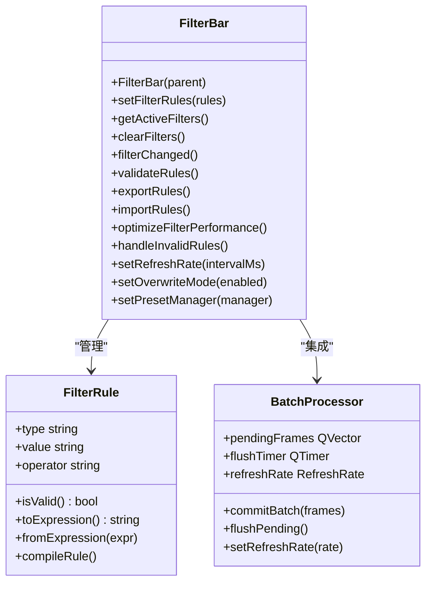
```mermaid
classDiagram
class FilterBar {
+FilterBar(parent)
+setFilterRules(rules)
+getActiveFilters()
+clearFilters()
+filterChanged()
+validateRules()
+exportRules()
+importRules()
+optimizeFilterPerformance()
+handleInvalidRules()
+setRefreshRate(intervalMs)
+setOverwriteMode(enabled)
+setPresetManager(manager)
}
class FilterRule {
+type string
+value string
+operator string
+isValid() bool
+toExpression() string
+fromExpression(expr)
+compileRule()
}
class BatchProcessor {
+pendingFrames QVector<CanFrame>
+flushTimer QTimer
+refreshRate RefreshRate
+commitBatch(frames)
+flushPending()
+setRefreshRate(rate)
}
FilterBar --> FilterRule : "管理"
FilterBar --> BatchProcessor : "集成"
```

**图表来源**
- [src/ui/filterbar.h](file://src/ui/filterbar.h)
- [src/ui/filterbar.cpp](file://src/ui/filterbar.cpp)

章节来源
- [src/ui/filterbar.h](file://src/ui/filterbar.h)
- [src/ui/filterbar.cpp](file://src/ui/filterbar.cpp)

### 其他专业组件
#### 信号配置对话框（SignalConfigDialog）
功能特性
- 提供CAN信号参数的配置界面
- 支持信号格式定义与验证
- 批量导入导出配置
- 配置模板管理

交互设计
- 表单驱动的配置文件编辑
- 实时验证与错误提示
- 撤销/重做操作支持

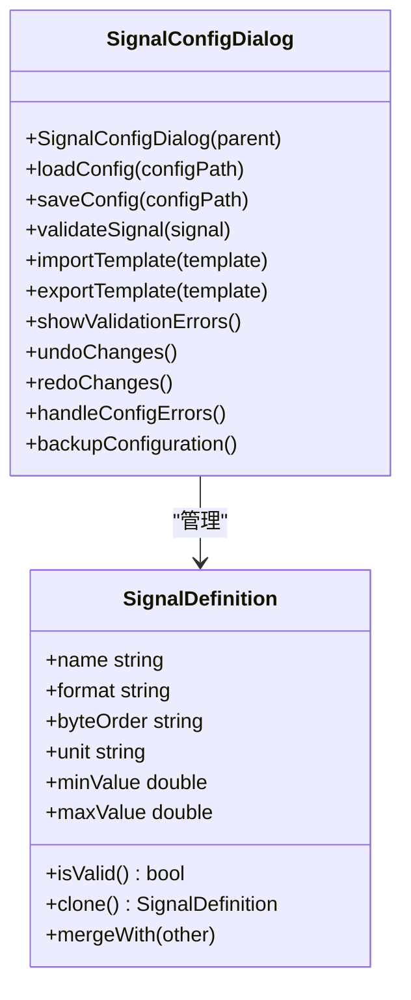
```mermaid
classDiagram
class SignalConfigDialog {
+SignalConfigDialog(parent)
+loadConfig(configPath)
+saveConfig(configPath)
+validateSignal(signal)
+importTemplate(template)
+exportTemplate(template)
+showValidationErrors()
+undoChanges()
+redoChanges()
+handleConfigErrors()
+backupConfiguration()
}
class SignalDefinition {
+name string
+format string
+byteOrder string
+unit string
+minValue double
+maxValue double
+isValid() bool
+clone() SignalDefinition
+mergeWith(other)
}
SignalConfigDialog --> SignalDefinition : "管理"
```

**图表来源**
- [src/ui/signalconfigdialog.h](file://src/ui/signalconfigdialog.h)
- [src/ui/signalconfigdialog.cpp](file://src/ui/signalconfigdialog.cpp)

章节来源
- [src/ui/signalconfigdialog.h](file://src/ui/signalconfigdialog.h)
- [src/ui/signalconfigdialog.cpp](file://src/ui/signalconfigdialog.cpp)

## 插件系统集成

### 插件管理器（PluginManager）
功能特性
- **新增** 插件发现机制，自动扫描plugins目录下的插件
- **新增** 插件生命周期管理，支持激活、停用和重启
- **新增** JSON-RPC通信协议，实现主程序与Python宿主进程间的双向通信
- **新增** 帧数据分发，将CAN帧数据传递给已激活的插件
- **新增** 命令执行机制，支持插件注册和执行的自定义命令
- **新增** 错误处理和日志记录，提供完善的调试支持

技术实现
- 基于QProcess的Python宿主进程管理
- 线程安全的消息队列，处理异步通信
- 插件元数据解析，支持plugin.json配置文件
- 信号槽机制，实现插件事件的统一处理

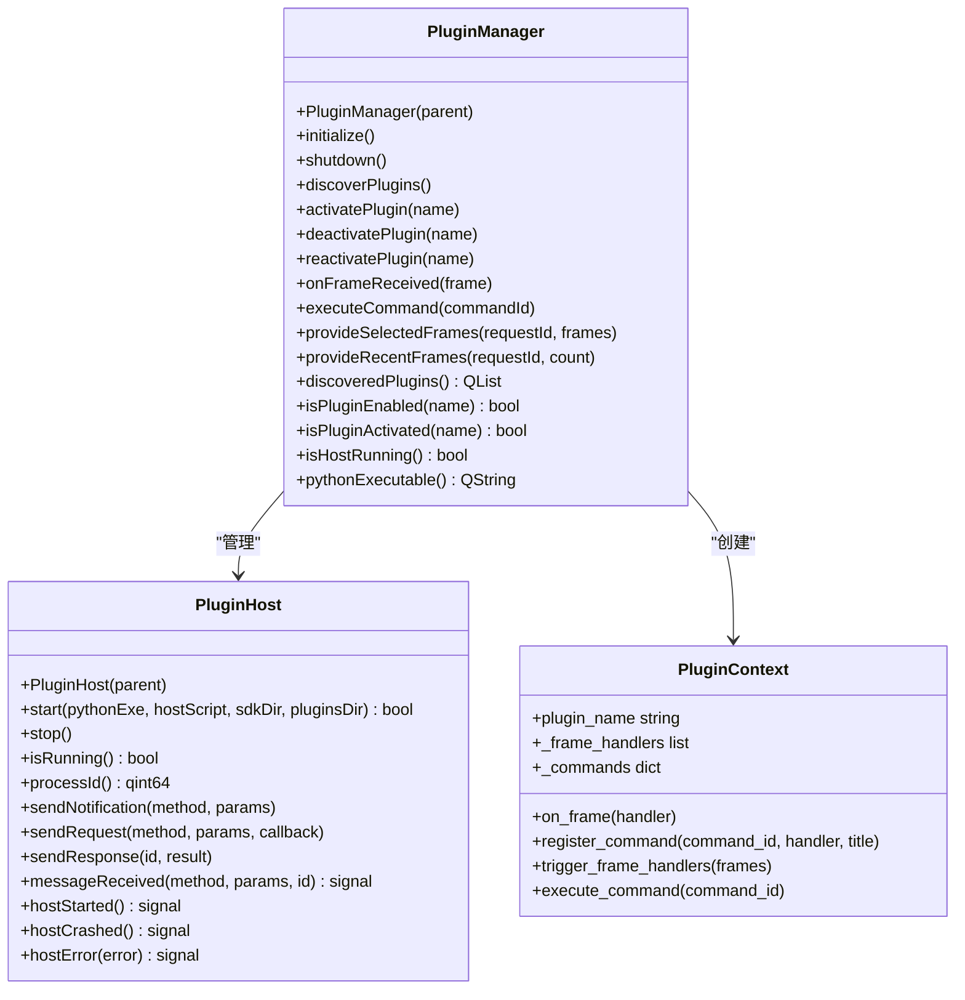
```mermaid
classDiagram
class PluginManager {
+PluginManager(parent)
+initialize()
+shutdown()
+discoverPlugins()
+activatePlugin(name)
+deactivatePlugin(name)
+reactivatePlugin(name)
+onFrameReceived(frame)
+executeCommand(commandId)
+provideSelectedFrames(requestId, frames)
+provideRecentFrames(requestId, count)
+discoveredPlugins() QList<PluginInfo>
+isPluginEnabled(name) bool
+isPluginActivated(name) bool
+isHostRunning() bool
+pythonExecutable() QString
}
class PluginHost {
+PluginHost(parent)
+start(pythonExe, hostScript, sdkDir, pluginsDir) bool
+stop()
+isRunning() bool
+processId() qint64
+sendNotification(method, params)
+sendRequest(method, params, callback)
+sendResponse(id, result)
+messageReceived(method, params, id) signal
+hostStarted() signal
+hostCrashed() signal
+hostError(error) signal
}
class PluginContext {
+plugin_name string
+_frame_handlers list
+_commands dict
+on_frame(handler)
+register_command(command_id, handler, title)
+trigger_frame_handlers(frames)
+execute_command(command_id)
}
PluginManager --> PluginHost : "管理"
PluginManager --> PluginContext : "创建"
```

**图表来源**
- [src/core/plugin/pluginmanager.h](file://src/core/plugin/pluginmanager.h)
- [src/core/plugin/pluginhost.h](file://src/core/plugin/pluginhost.h)

章节来源
- [src/core/plugin/pluginmanager.h](file://src/core/plugin/pluginmanager.h)
- [src/core/plugin/pluginhost.h](file://src/core/plugin/pluginhost.h)

### Python插件宿主（sin_host.py）
功能特性
- **新增** JSON-RPC 2.0协议实现，支持标准RPC通信
- **新增** 插件动态加载机制，支持Python模块的热加载
- **新增** PyQt6集成，为插件提供GUI开发能力
- **新增** 线程安全的消息处理，避免死锁问题
- **新增** 错误隔离机制，单个插件崩溃不影响宿主进程
- **新增** 插件上下文管理，为每个插件提供独立运行环境

技术实现
- 基于stdin/stdout的进程间通信
- 线程化的消息队列处理
- 动态模块导入和执行
- 异常捕获和错误报告

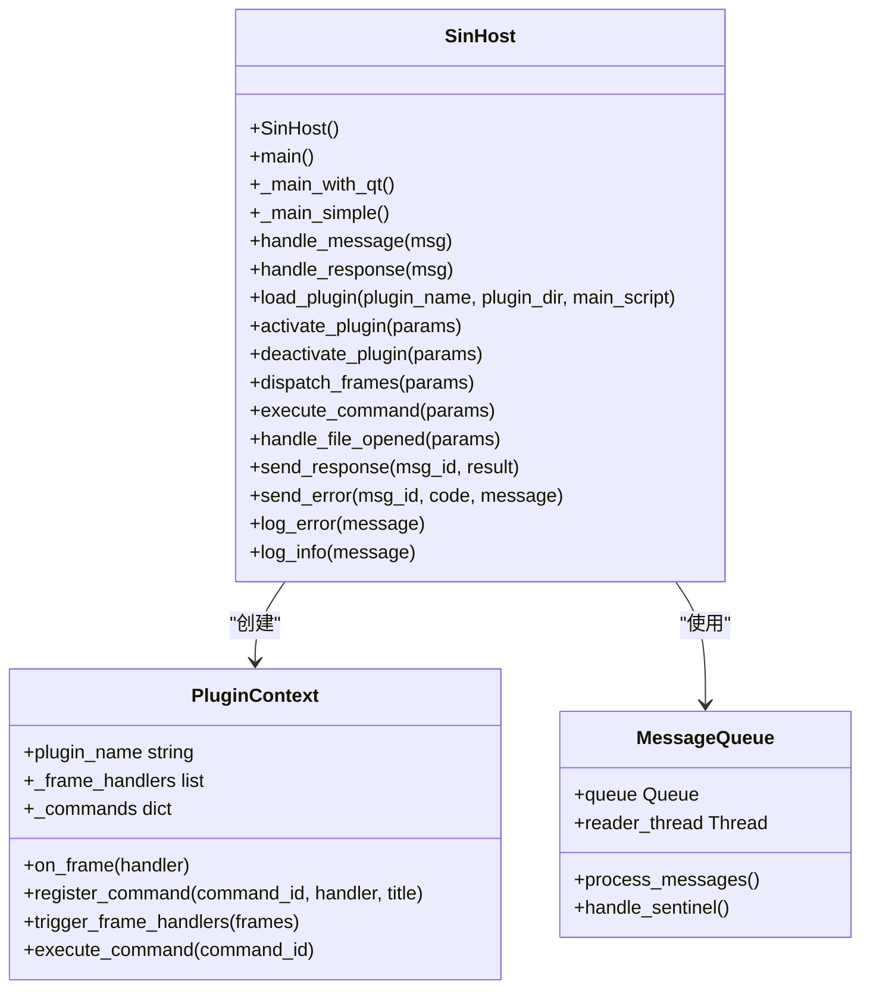
```mermaid
classDiagram
class SinHost {
+SinHost()
+main()
+_main_with_qt()
+_main_simple()
+handle_message(msg)
+handle_response(msg)
+load_plugin(plugin_name, plugin_dir, main_script)
+activate_plugin(params)
+deactivate_plugin(params)
+dispatch_frames(params)
+execute_command(params)
+handle_file_opened(params)
+send_response(msg_id, result)
+send_error(msg_id, code, message)
+log_error(message)
+log_info(message)
}
class PluginContext {
+plugin_name string
+_frame_handlers list
+_commands dict
+on_frame(handler)
+register_command(command_id, handler, title)
+trigger_frame_handlers(frames)
+execute_command(command_id)
}
class MessageQueue {
+queue Queue
+reader_thread Thread
+process_messages()
+handle_sentinel()
}
SinHost --> PluginContext : "创建"
SinHost --> MessageQueue : "使用"
```

**图表来源**
- [scripts/sin_host.py](file://scripts/sin_host.py)

章节来源
- [scripts/sin_host.py](file://scripts/sin_host.py)

### 插件架构设计
插件系统采用分层架构设计，确保主程序与插件间的松耦合：

```mermaid
graph TB
subgraph "主程序层"
PM["PluginManager<br/>插件管理器"]
GW["GraphicView<br/>图形视图"]
MW["MainWindow<br/>主窗口"]
end
subgraph "通信层"
PR["PluginHost<br/>插件宿主"]
JR["JSON-RPC<br/>通信协议"]
end
subgraph "Python层"
SH["sin_host.py<br/>Python宿主"]
PC["PluginContext<br/>插件上下文"]
end
subgraph "插件层"
P1["frame-counter<br/>帧计数器插件"]
P2["hello-world<br/>示例插件"]
P3["ui-demo<br/>UI演示插件"]
end
PM --> PR
GW --> PM
MW --> PM
PR --> JR
JR --> SH
SH --> PC
PC --> P1
PC --> P2
PC --> P3
```

**图表来源**
- [src/core/plugin/pluginmanager.h](file://src/core/plugin/pluginmanager.h)
- [src/core/plugin/pluginhost.h](file://src/core/plugin/pluginhost.h)
- [scripts/sin_host.py](file://scripts/sin_host.py)

### 插件扩展点
GraphicView组件提供了以下插件扩展点：

1. **信号渲染扩展**：插件可以自定义信号的渲染逻辑，添加特殊的视觉效果
2. **交互行为扩展**：插件可以添加自定义的鼠标交互和快捷键支持
3. **数据源扩展**：插件可以提供额外的数据源，如外部文件或API
4. **分析功能扩展**：插件可以实现自定义的信号分析算法
5. **导出功能扩展**：插件可以支持额外的数据导出格式

### 插件开发指南
插件开发遵循以下规范：

1. **插件结构**：每个插件应包含main.py和plugin.json文件
2. **生命周期**：实现activate()和deactivate()方法处理插件生命周期
3. **事件处理**：使用on_frame()方法处理CAN帧数据
4. **命令注册**：使用register_command()方法注册可执行命令
5. **错误处理**：实现适当的异常处理和日志记录

章节来源
- [src/core/plugin/pluginmanager.h](file://src/core/plugin/pluginmanager.h)
- [src/core/plugin/pluginhost.h](file://src/core/plugin/pluginhost.h)
- [scripts/sin_host.py](file://scripts/sin_host.py)

## 专用Tab组件系统

### 跟踪标签页（TraceTab）增强
功能特性
- 提供CAN总线数据的跟踪显示界面
- 支持Wireshark风格的三栏布局
- 集成过滤器栏和跟踪视图
- 帧结构面板和信号解析面板
- **增强** 刷新率控制设置菜单，支持高、中、低、暂停四种模式
- **增强** 时间格式设置，支持绝对时间戳、自捕获分组、自显示分组
- **增强** 批量数据处理优化，提高大数据集处理能力
- **新增** 视口概览组件集成，提供缩略图导航功能
- **新增** FilterHeaderView集成，提供Wireshark风格的表头界面

**更新** 跟踪标签页得到了显著增强，新增了刷新率控制功能和视口概览组件。通过设置菜单中的刷新率选项，用户可以调节数据更新的频率，从高频(50ms)到低频(200ms)再到暂停刷新，有效平衡了实时性和性能需求。时间格式设置也得到完善，支持多种时间戳显示模式。新增的视口概览组件提供了CANoe风格的缩略图导航，大幅提升了大数据集的浏览体验。FilterHeaderView的集成提供了Wireshark风格的表头界面，支持排序和过滤功能的直观操作。

技术实现
- 基于QVBoxLayout的垂直布局
- QSplitter实现可调整的分割面板
- QActionGroup管理互斥的时间格式和刷新率选项
- 定时器驱动的数据统计更新
- **新增** ViewportProxyModel和ViewportOverview集成
- **新增** FilterHeaderView集成和信号连接

```mermaid
classDiagram
class TraceTab {
+TraceTab(parent)
+setDbcManager(mgr)
+setRunning(running)
+isOverwriteMode() bool
+appendFrame(frame)
+appendFrames(frames)
+clearTrace()
+frameCount() int
+setFilterExpression(expr) bool
+clearFilter()
+clearAllFilters()
+filterExpression() QString
+updatePacketCount()
+onSelectionChanged()
+onPacketCountTimer()
+setRefreshRate(rate)
+setTimeFormat(mode)
+updateViewportOverview()
+optimizeBatchProcessing()
+onHeaderClicked(column)
+onFilterIconClicked(column)
}
class SettingsMenu {
+timeFormatGroup QActionGroup
+refreshRateGroup QActionGroup
+absoluteTime QAction
+sinceCapture QAction
+sinceDisplay QAction
+highRefresh QAction
+mediumRefresh QAction
+lowRefresh QAction
+pauseRefresh QAction
+connectToModels()
+handleSettingsChange()
}
class BatchProcessing {
+pendingFrames QVector<CanFrame>
+flushTimer QTimer
+packetCountTimer QTimer
+commitBatch()
+flushPending()
+updateStatistics()
+optimizePerformance()
}
TraceTab --> SettingsMenu : "管理"
TraceTab --> BatchProcessing : "使用"
TraceTab --> ViewportOverview : "集成"
TraceTab --> ViewportProxyModel : "管理"
TraceTab --> FilterHeaderView : "集成"
```

**图表来源**
- [src/ui/traceview.h](file://src/ui/traceview.h)
- [src/ui/traceview.cpp](file://src/ui/traceview.cpp)

章节来源
- [src/ui/traceview.h](file://src/ui/traceview.h)
- [src/ui/traceview.cpp](file://src/ui/traceview.cpp)

### DBC详情标签页（DBCDetailTab）
功能特性
- 提供CAN数据库文件（.dbc）的可视化编辑界面
- 支持信号定义的查看、编辑与验证
- 提供信号属性的批量修改功能
- 支持DBC文件的导入导出与版本管理

技术实现
- 基于QTableWidget的信号列表展示
- 自定义委托实现信号属性的编辑
- 实时验证信号定义的合法性
- 与DBCManager模块集成进行数据解析

```mermaid
classDiagram
class DBCDetailTab {
+DBCDetailTab(parent)
+loadDBCFile(filePath)
+displaySignalList()
+editSignalProperties(signal)
+validateSignal(signal)
+exportConfiguration()
+importTemplate(template)
+signalChanged()
+databaseLoaded()
+batchEditSignals(signals)
+compareVersions(version1, version2)
+generateDocumentation()
+handleDBCErrors()
+optimizeLargeFileLoading()
}
class SignalProperty {
+name string
+value string
+type string
+range string
+unit string
+isValid() bool
+copyFrom(source)
+mergeWith(other)
+validateProperty()
}
class DBCManager {
+parseDBCFile(path)
+extractSignals()
+validateDatabase()
+exportToDBC()
+compareDatabases(db1, db2)
+generateDocumentation()
+handleParsingErrors()
+optimizeMemoryUsage()
}
DBCDetailTab --> SignalProperty : "管理"
DBCDetailTab --> DBCManager : "使用"
```

**图表来源**
- [src/ui/dbcdetailtab.h](file://src/ui/dbcdetailtab.h)
- [src/ui/dbcdetailtab.cpp](file://src/ui/dbcdetailtab.cpp)

章节来源
- [src/ui/dbcdetailtab.h](file://src/ui/dbcdetailtab.h)
- [src/ui/dbcdetailtab.cpp](file://src/ui/dbcdetailtab.cpp)

### 播放控制标签页（PlaybackTab）增强
功能特性
- 实现CAN总线数据的回放控制功能
- 提供时间轴操作与位置跳转
- 支持播放速度调节与循环播放
- 实时显示播放状态与进度信息
- **增强** 循环回放功能，支持多种循环模式
- **增强** 播放控制精度，支持精确的时间定位

技术实现
- 基于QSlider的时间轴控制界面
- 定时器驱动的数据回放机制
- 与Player模块集成进行数据回放
- 支持播放队列的管理与调度
- **增强** 循环模式支持：单次循环、多次循环、无限循环
- **增强** 播放状态管理：播放、暂停、停止、循环

```mermaid
classDiagram
class PlaybackTab {
+PlaybackTab(parent)
+startPlayback()
+stopPlayback()
+pausePlayback()
+seekToPosition(time)
+setPlaybackSpeed(speed)
+setLoopMode(mode)
+updatePlayStatus(status)
+displayTimeline()
+createPlaylist(items)
+shufflePlaylist()
+repeatTrack(index)
+handlePlaybackErrors()
+optimizePlaybackPerformance()
+enhancedLoopPlayback()
+setLoopCount(count)
+setLoopRange(start, end)
+loopBackward()
}
class PlaybackControl {
+position double
+speed double
+isPlaying bool
+isPaused bool
+loopMode string
+loopCount int
+loopRange Range
+play()
+pause()
+stop()
+seek(time)
+getDuration()
+getPosition()
+validateTimeRange()
+setLoopMode(mode)
+setLoopCount(count)
+setLoopRange(start, end)
+loopBackward()
}
class Player {
+loadData(data)
+playback()
+pause()
+resume()
+stop()
+getPosition()
+getDuration()
+setSpeed(speed)
+handleDataErrors()
+bufferManagement()
+setLoopMode(mode)
+setLoopCount(count)
+setLoopRange(start, end)
+loopBackward()
}
PlaybackTab --> PlaybackControl : "控制"
PlaybackTab --> Player : "调用"
```

**图表来源**
- [src/ui/playbacktab.h](file://src/ui/playbacktab.h)
- [src/ui/playbacktab.cpp](file://src/ui/playbacktab.cpp)

章节来源
- [src/ui/playbacktab.h](file://src/ui/playbacktab.h)
- [src/ui/playbacktab.cpp](file://src/ui/playbacktab.cpp)

### 录制标签页（RecordTab）增强
功能特性
- 提供CAN总线数据的实时录制功能
- 支持录制参数配置与过滤设置
- 实时显示录制状态与数据统计
- 支持录制文件的保存与导出
- **增强** 暂停/恢复功能，支持录制过程中的灵活控制
- **增强** 录制状态管理，提供更好的用户体验

技术实现
- 基于QPlainTextEdit的实时日志显示
- 异步数据捕获与存储机制
- 与Recorder模块集成进行数据录制
- 支持录制过程中的实时监控
- **增强** 暂停/恢复机制：支持录制过程中的暂停和恢复
- **增强** 状态管理：记录录制状态，提供准确的反馈

```mermaid
classDiagram
class RecordTab {
+RecordTab(parent)
+startRecording()
+stopRecording()
+pauseRecording()
+resumeRecording()
+configureRecording(params)
+filterData(filterRules)
+displayRealtimeData()
+exportRecordedData()
+updateRecordStatus(status)
+showStatistics()
+monitorSystemResources()
+backupRecording()
+compressOutput()
+handleRecordingErrors()
+optimizeRecordingPerformance()
+enhancedPauseResume()
+setPauseState(state)
+getRecordStatus()
+continueAfterPause()
}
class RecordingConfig {
+duration int
+bufferSize int
+filterRules list
+outputFormat string
+autoSave bool
+validate() bool
+clone() RecordingConfig
+mergeWith(other)
+adjustBufferSize()
}
class Recorder {
+startCapture()
+stopCapture()
+pauseCapture()
+resumeCapture()
+addFilter(rule)
+removeFilter(rule)
+saveToFile(path)
+getStatistics()
+monitorMemoryUsage()
+optimizePerformance()
+handleWriteErrors()
+manageBuffers()
+setPauseState(state)
+getRecordStatus()
+continueAfterPause()
}
class PauseResumeManager {
+isPaused bool
+pauseTimestamp double
+pausedFrames int
+pauseReason string
+pause()
+resume()
+getState()
+resetState()
+getPauseStatistics()
}
RecordTab --> RecordingConfig : "配置"
RecordTab --> Recorder : "控制"
RecordTab --> PauseResumeManager : "管理"
```

**图表来源**
- [src/ui/recordtab.h](file://src/ui/recordtab.h)
- [src/ui/recordtab.cpp](file://src/ui/recordtab.cpp)

章节来源
- [src/ui/recordtab.h](file://src/ui/recordtab.h)
- [src/ui/recordtab.cpp](file://src/ui/recordtab.cpp)

### Tab组件管理系统
架构设计
- 统一的标签页管理器，负责Tab组件的生命周期管理
- 支持动态添加与移除Tab组件
- 实现Tab组件间的通信与数据共享
- 提供Tab状态同步与持久化机制

```mermaid
classDiagram
class TabManager {
+TabManager(parent)
+addTab(component, name, icon)
+removeTab(id)
+switchTab(id)
+getAllTabs()
+getActiveTab()
+updateTabState(id, state)
+saveTabStates()
+restoreTabStates()
+optimizeTabLoading()
+cleanupInactiveTabs()
+preloadTabs(count)
+handleTabErrors()
+manageTabLifecycle()
}
class TabComponent {
+id string
+name string
+icon QIcon
+isVisible bool
+updateState(state)
+serialize() QVariantMap
+deserialize(map)
+onActivate()
+onDeactivate()
+onDestroy()
+validateComponent()
+handleInitializationErrors()
}
class TabStateManager {
+activeTab string
+tabStates map
+autoSaveEnabled bool
+persistState()
+loadState()
+clearAllStates()
+syncWithServer()
+handleStateCorruption()
+backupStates()
}
TabManager --> TabComponent : "管理"
TabManager --> TabStateManager : "使用"
```

**图表来源**
- [src/ui/mainwindow.h](file://src/ui/mainwindow.h)
- [src/ui/mainwindow.cpp](file://src/ui/mainwindow.cpp)

章节来源
- [src/ui/mainwindow.h](file://src/ui/mainwindow.h)
- [src/ui/mainwindow.cpp](file://src/ui/mainwindow.cpp)

## 工具集系统

### 活动栏工具集按钮
功能特性
- 在活动栏中新增'工具集'按钮，位于分析配置和设置之间
- 提供快速访问各种总线分析工具的入口
- 支持工具集的动态管理和扩展
- 与侧边栏面板系统集成，实现工具面板的切换

**更新** 活动栏按钮已重新组织以提高工作流程效率，按钮顺序调整为从项目管理到分析工具的逻辑流程。'Flow'按钮被移动到更显眼的位置（第二个位置），反映了其在测量设置工作流程中的重要性。工具提示已增强以提供更清晰的描述。**Transceive模式已添加到活动栏枚举中，提供统一的收发功能入口。**

技术实现
- 在ActivityBar::Activity枚举中新增Tools类型
- 在活动栏初始化时添加工具集按钮
- 支持工具按钮的图标显示和工具提示
- 与SideBar的工具集面板建立连接

```mermaid
classDiagram
class ActivityBar {
+enum Activity {
+ None = -1,
+ Project = 0,
+ Analysis,
+ Device,
+ Trace,
+ Graphic,
+ Dbc,
+ Transceive, // 新增收发模式
+ Protocol,
+ Tools,
+ Settings
+}
+ActivityBar(parent)
+setCurrentActivity(act)
+onButtonClicked()
+createButton(text, tooltip, act, atBottom)
+flowButtonUpdated()
}
class ToolsPanel {
+ToolsPanel(parent)
+toolOpened(toolKey)
+onItemClicked(item)
+addToolItem(name, key, tooltip)
+removeToolItem(key)
+getToolItems()
}
class SideBar {
+toolsPanel() ToolsPanel*
+showPanel(index)
+togglePanel(index)
+m_tools ToolsPanel*
}
ActivityBar --> ToolsPanel : "触发"
SideBar --> ToolsPanel : "包含"
```

**图表来源**
- [src/ui/activitybar.h](file://src/ui/activitybar.h)
- [src/ui/activitybar.cpp](file://src/ui/activitybar.cpp)
- [src/ui/panels/sidebarpanels.h](file://src/ui/panels/sidebarpanels.h)
- [src/ui/panels/sidebarpanels.cpp](file://src/ui/panels/sidebarpanels.cpp)

章节来源
- [src/ui/activitybar.h](file://src/ui/activitybar.h)
- [src/ui/activitybar.cpp](file://src/ui/activitybar.cpp)
- [src/ui/panels/sidebarpanels.h](file://src/ui/panels/sidebarpanels.h)
- [src/ui/panels/sidebarpanels.cpp](file://src/ui/panels/sidebarpanels.cpp)

### 工具集面板（ToolsPanel）
功能特性
- 提供总线分析工具的列表界面
- 支持多种工具类型的分类管理
- 每个工具都有唯一的标识符和描述
- 点击工具项触发相应的工具打开事件

工具类型支持
- BLF/ASC/CSV格式转换工具
- DBC文件查看编辑工具
- 报文统计分析工具
- ID频率分析工具
- 总线负载率计算工具
- DBC信号清单导出工具

技术实现
- 基于QListWidget的工具列表展示
- 每个工具项包含名称、唯一标识符和工具提示
- 信号槽机制与主窗口通信
- 支持工具项的动态添加和删除

```mermaid
classDiagram
class ToolsPanel {
+ToolsPanel(parent)
+toolOpened(toolKey)
+onItemClicked(item)
+m_list QListWidget*
+addToolItem(name, key, tooltip)
+removeToolItem(key)
+refreshToolList()
+validateToolKey(key)
+getToolDescription(key)
}
class ToolItem {
+name string
+key string
+tooltip string
+category string
+isEnabled bool
+execute()
+validate()
+serialize()
}
class ToolCategory {
+name string
+tools list
+order int
+isVisible bool
+sortTools()
+filterTools(criteria)
+getToolCount()
}
ToolsPanel --> ToolItem : "管理"
ToolsPanel --> ToolCategory : "分类"
```

**图表来源**
- [src/ui/panels/sidebarpanels.h](file://src/ui/panels/sidebarpanels.h)
- [src/ui/panels/sidebarpanels.cpp](file://src/ui/panels/sidebarpanels.cpp)

章节来源
- [src/ui/panels/sidebarpanels.h](file://src/ui/panels/sidebarpanels.h)
- [src/ui/panels/sidebarpanels.cpp](file://src/ui/panels/sidebarpanels.cpp)

### 工具集集成架构
架构设计
- 工具集作为独立的功能模块，与主系统松耦合
- 通过工具键值（toolKey）进行工具识别和路由
- 支持工具的动态注册和生命周期管理
- 提供统一的工具接口和扩展机制

工具工作流程
```mermaid
flowchart TD
Start(["用户点击工具集按钮"]) --> ShowPanel["显示工具集面板"]
ShowPanel --> UserSelect["用户选择具体工具"]
UserSelect --> GetToolKey["获取工具键值"]
GetToolKey --> ValidateKey{"验证工具键值"}
ValidateKey --> |无效| ShowError["显示错误提示"]
ValidateKey --> |有效| CreateTool["创建设计工具实例"]
CreateTool --> InitTool["初始化工具环境"]
InitTool --> OpenTool["打开工具标签页"]
OpenTool --> ToolReady["工具就绪"]
ToolReady --> End(["结束"])
ShowError --> End
```

**图表来源**
- [src/ui/mainwindow.cpp](file://src/ui/mainwindow.cpp)
- [src/ui/panels/sidebarpanels.cpp](file://src/ui/panels/sidebarpanels.cpp)

章节来源
- [src/ui/mainwindow.cpp](file://src/ui/mainwindow.cpp)
- [src/ui/panels/sidebarpanels.cpp](file://src/ui/panels/sidebarpanels.cpp)

### 主窗口工具激活处理（onToolOpened）
功能特性
- 接收来自ToolsPanel的toolOpened信号
- 根据工具键值创建对应的工具实例
- 支持多种不同的总线分析工具
- 统一管理工具标签页的创建和显示

技术实现
- 基于工具键值的条件分支处理
- 每种工具对应特定的类实例化
- 统一的openTab方法管理标签页
- 支持工具的动态加载和生命周期管理

```mermaid
classDiagram
class MainWindow {
+onToolOpened(toolKey)
+openTab(widget, label)
+blf_converter BlfAsConverter
+dbc_editor DbcToolView
+frame_statistics FrameStatisticsView
+id_frequency IdFrequencyView
+bus_load BusLoadView
+dbc_signal_list DbcSignalListView
+setupDeviceTab(tab)
}
class ToolRouter {
+routeTool(toolKey)
+createToolInstance(key)
+validateToolKey(key)
+getToolClass(key)
+handleToolErrors()
}
MainWindow --> ToolRouter : "使用"
```

**图表来源**
- [src/ui/mainwindow.cpp](file://src/ui/mainwindow.cpp)

章节来源
- [src/ui/mainwindow.cpp](file://src/ui/mainwindow.cpp)

### DbcPanel多协议分类管理
功能特性
- 支持多种协议类型的数据库文件管理
- 通过DatabaseEntry结构存储文件信息
- 树形结构展示不同协议的解析文件
- 自动分类和计数显示

协议分类支持
- CAN/CANFD (.dbc文件)
- CANopen (.eds, .dcf, .xdd文件)
- EtherCAT (.xml文件)
- LIN (.ldf, .ncf文件)
- J1939 (.dpf文件)
- AUTOSAR (.arxml文件)

技术实现
- 基于QTreeWidget的树形结构展示
- 协议分类根节点管理
- DatabaseEntry结构存储文件元数据
- 自动分类和重复检测

```mermaid
classDiagram
class DbcPanel {
+DbcPanel(parent)
+setDbcManager(mgr)
+onImportDatabase()
+onItemClicked(item, column)
+categoryForFile(fileName)
+initCategoryNodes()
+refreshTree()
}
class DatabaseEntry {
+fileName string
+filePath string
+category string
+validate() bool
+serialize()
+deserialize(map)
}
class CategoryNode {
+canFd QTreeWidgetItem*
+canopen QTreeWidgetItem*
+ethercat QTreeWidgetItem*
+lin QTreeWidgetItem*
+j1939 QTreeWidgetItem*
+autosar QTreeWidgetItem*
+addChild(file, category)
+updateCount()
+clearChildren()
}
DbcPanel --> DatabaseEntry : "管理"
DbcPanel --> CategoryNode : "使用"
```

**图表来源**
- [src/ui/panels/sidebarpanels.h](file://src/ui/panels/sidebarpanels.h)
- [src/ui/panels/sidebarpanels.cpp](file://src/ui/panels/sidebarpanels.cpp)

章节来源
- [src/ui/panels/sidebarpanels.h](file://src/ui/panels/sidebarpanels.h)
- [src/ui/panels/sidebarpanels.cpp](file://src/ui/panels/sidebarpanels.cpp)

## 依赖关系分析
模块间依赖与耦合
- main.cpp 依赖样式加载与主窗口
- MainWindow 依赖样式与主题管理
- 样式与资源通过qrc解耦，降低硬编码路径风险

**更新** 现在明确包含了Qt Designer生成的UI类与手写C++代码之间的依赖关系，以及新增专业组件之间的依赖关系，包括活动栏、底部面板、右侧面板、分割编辑器区域、侧边栏面板系统、设备连接界面和三个专用Tab组件（DBC详情标签页、播放控制标签页、录制标签页）。各组件通过信号槽机制实现松耦合通信，提高了系统的可维护性和可扩展性。**特别重要的是，活动栏已重新组织以提高工作流程效率，'Flow'按钮被移动到更显眼的位置，工具提示已增强。新增了ThemeManager主题管理器和SVG图标系统，增强了样式管理和图标渲染能力。设备连接界面DeviceConnectionTab提供了完整的CAN/CAN FD配置选项。工具集系统得到完善，包括活动栏工具集按钮、工具集面板、工具路由机制和主窗口的onToolOpened处理函数。新增的视口概览组件系统通过ViewportProxyModel和ViewportOverview类，实现了CANoe风格的视窗缩略图导航功能。FilterHeaderView组件通过自定义排序指示器和漏斗图标，提供了Wireshark风格的表头界面，增强了数据表的交互体验。TransceivePanel作为统一的收发功能入口，简化了用户操作流程。新增的Downsample模块通过智能数据裁剪和四种抽稀策略，将百万级原始数据点转换为视口像素级别的显示数据，确保O(视口宽)恒定渲染成本，大幅提升大数据量波形渲染性能。**

```mermaid
graph LR
Main["main.cpp"] --> MW["MainWindow"]
MW --> UI["Ui::MainWindow<br/>(生成代码)"]
MW --> AB["ActivityBar<br/>Transceive模式已添加"]
MW --> BP["BottomPanel"]
MW --> RP["RightPanel"]
MW --> SEA["SplitEditorArea"]
MW --> SBP["SidebarPanels<br/>DbcPanel支持多协议分类"]
MW --> DCT["DeviceConnectionTab<br/>设备连接界面<br/>V2接口升级"]
MW --> DBCT["DBCDetailTab"]
MW --> PB["PlaybackTab<br/>循环回放增强"]
MW --> RT["RecordTab<br/>暂停恢复增强"]
MW --> TT["TraceTab<br/>刷新率控制增强<br/>视口概览集成"]
MW --> TP["ToolsPanel"]
MW --> TM["ThemeManager<br/>主题管理器"]
MW --> SD["SettingsDialog<br/>设置对话框"]
MW --> TPANEL["TransceivePanel<br/>新增统一入口"]
MW --> PM["PluginManager<br/>插件管理器"]
SEA --> FB["FilterBar<br/>刷新率控制增强"]
SEA --> GV["GraphicView<br/>QCustomPlot集成<br/>Downsample模块集成<br/>插件集成增强"]
SEA --> TV["TraceView"]
SEA --> VO["ViewportOverview<br/>视窗缩略图"]
MW --> SCD["SignalConfigDialog"]
MW --> QSS["QSS样式"]
TM --> THEME["theme.qss<br/>主题模板"]
QSS --> QRC["resources.qrc"]
QRC --> THEME
QRC --> SVG["SVG图标系统"]
AB --> Navigation["导航管理"]
BP --> Logging["日志管理"]
RP --> Properties["属性管理"]
SEA --> Editors["编辑器管理"]
SBP --> Panels["面板管理"]
DCT --> Config["配置管理"]
DBCT --> DBC["DBC管理"]
PB --> Player["播放器"]
RT --> Recorder["录制器"]
TT --> CTM["CanTraceModel<br/>批量处理增强"]
TT --> CFPM["CanFilterProxyModel"]
TT --> VPM["ViewportProxyModel<br/>视窗代理模型"]
TT --> VO
TT --> FHV["FilterHeaderView<br/>自定义表头视图"]
FB --> CTM
MW --> Web["Web前端原型"]
Web --> HTML["HTML模板"]
Web --> JS["JavaScript模块"]
Web --> CSS["CSS样式"]
GV --> Graphics["图形引擎"]
GV --> TestData["测试数据集支持"]
GV --> QCP["QCustomPlot<br/>图表引擎"]
GV --> DS["Downsample<br/>视口降采样模块"]
GV --> PM
PM --> PH["PluginHost<br/>插件宿主"]
PH --> SH["sin_host.py<br/>Python宿主"]
SH --> PL["plugins/*<br/>Python插件"]
TV --> DataCache["数据缓存"]
SBP --> Accessibility["可访问性"]
GV --> Stability["稳定性增强"]
AB --> Tools["工具集管理"]
SBP --> ToolsPanel["工具集面板"]
Tools --> ToolRouter["工具路由器"]
MW --> ToolHandler["onToolOpened处理"]
SBP --> MultiProtocol["多协议分类管理"]
MultiProtocol --> DatabaseEntry["DatabaseEntry结构"]
TM --> ThemeVars["@变量替换"]
SVG --> IconSystem["图标渲染"]
SD --> AppConfig["应用配置"]
FHV --> CFPM
TPANEL --> SendTab["发送标签页"]
TPANEL --> PlaybackTab["回放标签页"]
TPANEL --> RecordTab["录制标签页"]
```

**图表来源**
- [src/main.cpp](file://src/main.cpp)
- [src/ui/mainwindow.h](file://src/ui/mainwindow.h)
- [src/ui/mainwindow.cpp](file://src/ui/mainwindow.cpp)
- [src/ui/thememanager.h](file://src/ui/thememanager.h)
- [src/ui/thememanager.cpp](file://src/ui/thememanager.cpp)
- [src/ui/settingsdialog.h](file://src/ui/settingsdialog.h)
- [src/ui/settingsdialog.cpp](file://src/ui/settingsdialog.cpp)
- [src/utils/svg_icon.h](file://src/utils/svg_icon.h)
- [UI/ui-prototype.html](file://UI/ui-prototype.html)
- [UI/js/ui-loader.js](file://UI/js/ui-loader.js)
- [UI/js/ui-prototype.js](file://UI/js/ui-prototype.js)
- [UI/css/ui-prototype.css](file://UI/css/ui-prototype.css)
- [third_party/qcustomplot/qcustomplot.h](file://third_party/qcustomplot/qcustomplot.h)
- [src/core/plugin/pluginmanager.h](file://src/core/plugin/pluginmanager.h)
- [src/core/plugin/pluginhost.h](file://src/core/plugin/pluginhost.h)
- [scripts/sin_host.py](file://scripts/sin_host.py)

章节来源
- [src/CMakeLists.txt](file://src/CMakeLists.txt)
- [CMakeLists.txt](file://CMakeLists.txt)

## 性能考虑
- 样式加载
  - 仅在必要时重新加载QSS，避免频繁解析
  - 使用增量更新或合并样式减少重复计算
- 布局与绘制
  - 优先使用布局管理器，减少手动几何计算
  - 避免在事件循环中进行耗时操作，使用异步任务
- 资源管理
  - 将大资源按需加载，避免一次性载入
  - 合理使用缓存，减少重复I/O
- 高DPI与缩放
  - 启用高DPI支持，合理设置像素密度
  - 对矢量图标与自适应布局进行验证
- **Qt Designer优化**
  - 避免在.ui文件中定义复杂的动画或过渡效果
  - 合理使用布局嵌套层级，避免过深的控件树
  - 利用Qt Creator的性能分析工具识别瓶颈
- **专业组件性能优化**
  - 图形视图使用双缓冲技术减少闪烁
  - 跟踪视图实现数据分页加载
  - 过滤器栏使用高效的匹配算法
  - 对话框采用延迟初始化策略
- **新增组件性能考虑**
  - 活动栏使用懒加载避免初始性能开销
  - 底部面板的消息显示采用异步更新
  - 右侧面板的内容切换使用虚拟化技术
  - 分割编辑器区域实现编辑器的按需创建
  - 侧边栏面板系统优化面板切换性能
  - 设备连接界面使用延迟初始化配置选项
  - **新增** 视口概览组件使用密度缓存减少重复渲染
  - **新增** 视窗代理模型通过固定行数限制优化内存使用
  - **新增** FilterHeaderView使用自定义绘制避免Qt内置指示器的性能开销
  - **新增** TransceivePanel使用轻量级设计，减少内存占用
  - **新增** Downsample模块实现O(视口宽)恒定渲染成本，将百万级原始数据点转换为视口像素级别的显示数据
- **专用Tab组件性能优化**
  - DBC详情标签页实现大数据集的虚拟滚动
  - 播放控制标签页使用高效的定时器机制
  - 录制标签页采用异步数据写入避免阻塞
  - Tab组件管理系统优化组件切换性能
  - 实现Tab组件的懒加载与销毁机制
  - **增强** 播放系统循环回放功能，优化循环性能
  - **增强** 录制系统暂停/恢复功能，减少状态切换开销
- **工具集性能优化**
  - 工具集面板使用懒加载避免初始性能开销
  - 工具项列表采用虚拟化技术处理大量工具
  - 工具路由机制优化工具查找和创建性能
  - 工具实例缓存避免重复创建开销
  - onToolOpened函数使用条件分支快速路由
- **Web前端性能优化**
  - HTML模板使用惰性加载技术
  - JavaScript模块按需加载和缓存
  - CSS样式使用CSS Modules提高性能
  - 资源文件压缩和优化加载
- **增强组件性能优化**
  - 图形视图启用增量渲染和内存池管理
  - 跟踪视图实现智能预取和缓存策略
  - 侧边栏面板系统优化面板切换动画
  - 所有组件支持硬件加速渲染
- **主题系统性能优化**
  - ThemeManager使用单例模式避免重复实例化
  - @变量替换使用QHash提高查找性能
  - 主题切换时只更新必要的样式属性
  - SVG图标缓存避免重复渲染
- **最新性能改进**
  - graphicview.cpp的崩溃问题修复减少了异常处理开销
  - 优化的内存管理降低了内存占用峰值
  - 改进的错误处理机制避免了不必要的重试
  - 增强的测试数据集支持提高了数据处理效率
  - SVG图标系统使用QSvgRenderer提高渲染性能
  - 设备连接界面使用延迟初始化减少启动时间
  - **新增** 视口概览组件的密度缓存机制减少缩略图重绘开销
  - **新增** 视窗代理模型通过固定行数限制优化大数据集处理
  - **新增** FilterHeaderView的自定义绘制优化了表头渲染性能
  - **新增** TransceivePanel的轻量级设计减少了内存占用
  - **新增** Downsample模块的智能数据裁剪和四种抽稀策略，确保O(视口宽)恒定渲染成本，大幅提升大数据量波形渲染性能
- **批处理模型性能优化**
  - CanTraceModel使用环形缓冲区存储，支持最大帧数限制
  - 批量追加frames()方法优化大数据集处理
  - 可配置刷新率控制，平衡实时性和性能
  - 可见行范围缓存减少不必要的格式化计算
  - 防抖定时器优化统计更新频率
  - 覆盖模式支持固定行显示，提高大数据集浏览效率
- **QCustomPlot性能优化**
  - 使用rpQueuedReplot进行异步重绘
  - 定时器批量重绘，50ms间隔达到20fps
  - 数据点数量限制，超过50000点自动降采样
  - 旧数据自动清理，保持内存使用稳定
  - 多轴布局优化，减少重绘范围
  - 插值算法优化，提高卡尺测量精度
- **Downsample模块性能优化**
  - 二分查找lowerBound函数实现O(log n)区间定位
  - 桶化算法将时间轴划分为多个桶进行处理
  - 每种策略都有针对性的数据处理逻辑
  - 外延点保证确保阶梯线边缘正确渲染
  - 智能缓存机制避免重复计算
  - 支持Min/Max、Average、First、Decimate四种策略
- **插件系统性能优化**
  - 插件宿主进程使用独立线程处理消息
  - JSON-RPC通信采用异步模式避免阻塞
  - 插件加载使用延迟初始化减少启动时间
  - 插件内存使用监控和垃圾回收
  - 插件崩溃检测和自动重启机制
  - 插件间通信通过消息队列避免直接依赖

[本节为通用指导，无需特定文件引用]

## 故障排查指南
常见问题与定位方法
- 样式未生效
  - 检查QSS路径是否正确，是否通过qrc正确打包
  - 确认样式加载时机在主窗口显示之前
- 主题切换无效
  - 校验新样式语法，捕获解析异常
  - 确保应用了正确的对象名称与选择器
  - 检查ThemeManager的@变量映射是否正确
- 资源加载失败
  - 核对qrc中的路径大小写与相对路径
  - 使用:/前缀访问资源，避免平台差异
- 多语言文本未替换
  - 确认已调用tr()包裹文本
  - 检查翻译文件是否被正确加载与安装
- **Qt Designer相关问题**
  - 检查.ui文件格式是否正确，XML语法是否有误
  - 确认生成的头文件未被意外修改
  - 验证控件名称与C++代码中的引用一致
- **专业组件问题**
  - 过滤器规则语法错误导致匹配失败
  - 图形视图数据更新卡顿需要优化渲染
  - 跟踪视图内存占用过高需要清理缓冲
  - 信号配置对话框验证失败需要检查参数格式
- **新增组件问题**
  - 活动栏图标加载失败需要检查资源路径
  - 底部面板消息显示异常需要检查文本编码
  - 右侧面板内容切换卡顿需要优化数据绑定
  - 分割编辑器区域布局错乱需要检查约束设置
  - 侧边栏面板系统面板注册失败需要检查命名冲突
  - 设备连接界面配置验证失败需要检查参数格式
  - **新增** 视口概览组件缩略图不显示需要检查模型连接
  - **新增** 视窗代理模型数据映射错误需要检查行号转换
  - **新增** FilterHeaderView排序指示器不显示需要检查setSortState调用
  - **新增** FilterHeaderView漏斗图标点击无响应需要检查信号连接
  - **新增** TransceivePanel按钮点击无响应需要检查信号连接
  - **新增** TransceivePanel面板不显示需要检查索引映射
  - **新增** Downsample模块数据降采样异常需要检查策略选择和参数配置
- **专用Tab组件问题**
  - DBC文件加载失败需要检查文件格式与权限
  - 播放控制标签页时间轴不同步需要检查定时器精度
  - 录制标签页数据丢失需要检查缓冲区大小与写入频率
  - Tab组件切换卡顿需要优化组件初始化过程
  - 标签页状态同步失败需要检查信号槽连接
  - **增强** 播放系统循环回放功能异常需要检查循环模式设置
  - **增强** 录制系统暂停/恢复功能异常需要检查录制状态管理
- **工具集问题**
  - 工具集按钮不显示需要检查ActivityBar初始化
  - 工具集面板无法打开需要检查SideBar索引映射
  - 工具项点击无响应需要检查信号槽连接
  - 工具键值冲突需要检查工具注册逻辑
  - 工具实例创建失败需要检查工具依赖和初始化
  - onToolOpened函数未正确处理工具键值
  - 工具标签页创建失败需要检查openTab方法
- **Web前端问题**
  - HTML模板加载失败需要检查文件路径
  - JavaScript模块依赖错误需要检查模块导入
  - CSS样式冲突需要检查选择器优先级
  - Web前端与Qt通信失败需要检查桥接接口
- **增强组件问题**
  - 图形视图渲染性能下降需要检查双缓冲设置
  - 跟踪视图内存泄漏需要检查缓存清理机制
  - 侧边栏面板切换卡顿需要检查动画配置
  - 所有组件的可访问性功能需要验证屏幕阅读器兼容性
- **主题系统问题**
  - 主题切换后样式未更新需要检查QSS应用时机
  - @变量替换失败需要检查ThemeManager映射配置
  - SVG图标颜色不正确需要检查currentColor替换逻辑
  - 主题文件加载失败需要检查文件路径和权限
- **设备连接界面问题**
  - 设备连接失败需要检查设备驱动和权限
  - CAN FD配置无效需要检查波特率和时序参数
  - 时序预设显示异常需要检查预设数据格式
  - 通道选择无效需要检查设备支持情况
  - **更新** V2接口连接失败需要检查设备类型和子类型参数
- **最新问题修复**
  - graphicview.cpp崩溃问题已通过增强的错误处理机制解决
  - 测试数据集兼容性问题已通过数据验证和适配层修复
  - 内存管理问题已通过优化的资源清理机制改善
  - 图形渲染稳定性已通过双缓冲和增量更新技术提升
  - SVG图标系统使用QSvgRenderer提高渲染性能
  - 设备连接界面使用延迟初始化减少启动时间
  - **新增** 视口概览组件的密度缓存机制减少缩略图重绘开销
  - **新增** 视窗代理模型通过固定行数限制优化大数据集处理
  - **新增** FilterHeaderView的自定义绘制优化了表头渲染性能
  - **新增** TransceivePanel的轻量级设计减少了内存占用
  - **新增** Downsample模块的智能数据裁剪和四种抽稀策略，确保O(视口宽)恒定渲染成本，大幅提升大数据量波形渲染性能
- **DbcPanel多协议分类问题**
  - 协议分类节点不显示需要检查文件扩展名识别
  - DatabaseEntry结构数据丢失需要检查序列化机制
  - 树形结构展开异常需要检查节点父子关系
  - 重复文件检测失效需要检查路径比较逻辑
- **批处理模型问题**
  - 刷新率控制无效需要检查CanTraceModel连接
  - 批量数据处理卡顿需要检查pending队列管理
  - 覆盖模式切换异常需要检查ID到行号映射
  - 统计信息显示不准确需要检查防抖定时器
  - 可见行缓存失效需要检查范围更新逻辑
- **QCustomPlot相关问题**
  - 图表渲染失败需要检查QCustomPlot库链接
  - 多轴布局异常需要检查AxisRect配置
  - 光标交互不响应需要检查鼠标事件处理
  - 实时数据更新卡顿需要检查定时器配置
  - 内存溢出需要检查数据点数量限制
  - 插值计算错误需要检查valueAtTime算法
- **设置对话框问题**
  - 覆盖模式配置无效需要检查AppConfig连接
  - JSON编辑格式错误需要检查语法验证
  - 设置项分类显示异常需要检查元数据配置
  - 配置保存失败需要检查文件权限和路径
- **播放系统问题**
  - 循环回放功能异常需要检查循环模式配置
  - 播放状态同步失败需要检查定时器精度
  - 循环边界处理错误需要检查时间范围验证
  - 播放性能下降需要检查数据预取策略
- **录制系统问题**
  - 暂停/恢复功能异常需要检查录制状态管理
  - 录制数据丢失需要检查缓冲区管理
  - 暂停状态持久化失败需要检查状态保存机制
  - 恢复录制性能问题需要检查数据恢复策略
- **Downsample模块问题**
  - 降采样策略选择不当需要检查Strategy枚举配置
  - 视口范围计算错误需要检查t1/t2参数传递
  - 目标点数计算异常需要检查targetPoints参数
  - 外延点缺失需要检查first/last边界处理
  - 性能问题需要检查RingBuffer容量和数据量
- **插件系统问题**
  - 插件加载失败需要检查plugin.json配置
  - Python宿主进程启动失败需要检查Python环境
  - 插件通信中断需要检查JSON-RPC连接
  - 插件崩溃需要检查异常处理和日志记录
  - 插件内存泄漏需要检查资源清理机制
  - 插件命令执行失败需要检查命令注册和参数传递
  - 插件UI显示异常需要检查PyQt6集成和环境
  - 插件帧数据处理错误需要检查数据格式和类型转换

章节来源
- [resources/styles/default.qss](file://resources/styles/default.qss)
- [resources/styles/theme.qss](file://resources/styles/theme.qss)
- [resources/resources.qrc](file://resources/resources.qrc)
- [src/ui/thememanager.h](file://src/ui/thememanager.h)
- [src/ui/thememanager.cpp](file://src/ui/thememanager.cpp)
- [src/ui/settingsdialog.h](file://src/ui/settingsdialog.h)
- [src/ui/settingsdialog.cpp](file://src/ui/settingsdialog.cpp)
- [src/utils/svg_icon.h](file://src/utils/svg_icon.h)
- [src/ui/deviceconnectiontab.h](file://src/ui/deviceconnectiontab.h)
- [src/ui/deviceconnectiontab.cpp](file://src/ui/deviceconnectiontab.cpp)
- [UI/ui-prototype.html](file://UI/ui-prototype.html)
- [UI/js/ui-loader.js](file://UI/js/ui-loader.js)
- [UI/js/ui-prototype.js](file://UI/js/ui-prototype.js)
- [UI/css/ui-prototype.css](file://UI/css/ui-prototype.css)
- [src/core/plugin/pluginmanager.h](file://src/core/plugin/pluginmanager.h)
- [src/core/plugin/pluginhost.h](file://src/core/plugin/pluginhost.h)
- [scripts/sin_host.py](file://scripts/sin_host.py)

## 结论
本UI系统以Qt Widgets为基础，采用清晰的入口-主窗口-样式-资源分层架构，结合QSS与主题管理实现灵活的外观定制与动态更新。通过qrc统一管理资源，提升可移植性与可维护性。**特别重要的是，通过Qt Designer XML布局系统与手写C++代码的混合架构模式，实现了界面设计与业务逻辑的有效分离，既保证了开发效率，又提升了代码的可维护性。**新增的专业组件进一步增强了系统的功能完整性，包括活动栏、底部面板、右侧面板、分割编辑器区域、增强的侧边栏面板系统和全新的设备连接界面，**特别是侧边栏面板系统得到了显著增强，DbcPanel类现在支持DatabaseEntry结构和多协议分类管理，能够处理CAN/CANFD、CANopen、EtherCAT、LIN、J1939、AUTOSAR等多种协议类型的数据库文件。**

**更新** 最新的架构重构将单体单文件结构完全转变为模块化组件系统，引入了基于HTML部分的组件化架构、JavaScript模块系统和CSS样式管理，实现了真正的现代化开发模式。新的Web前端原型系统支持动态内容加载、模块化开发和响应式设计，为复杂的企业级应用提供了更加灵活和可扩展的用户界面解决方案。**特别重要的是，活动栏已重新组织以提高工作流程效率，按钮顺序调整为从项目管理到分析工具的逻辑流程。'Flow'按钮被移动到更显眼的位置（第二个位置），反映了其在测量设置工作流程中的重要性，工具提示已增强以提供更清晰的描述。新增了ThemeManager主题管理器，支持7种内置主题和运行时切换；SVG图标系统提供动态颜色替换功能；设备连接界面DeviceConnectionTab提供了完整的CAN/CAN FD配置选项。工具集系统得到完善，通过ActivityBar的工具集按钮和ToolsPanel侧边栏面板，为CAN总线数据分析提供了完整的工具解决方案，包括BLF/ASC/CSV格式转换、DBC文件查看编辑、帧统计分析、ID频率分析、总线负载计算等多种实用工具。主窗口组件通过新增的onToolOpened槽函数实现了工具激活请求的统一处理，支持多种不同的总线分析工具动态加载和管理，大大增强了UI系统的工具管理能力。**

**最新增强** GraphicView组件现已完全重构，集成了QCustomPlot库，提供了专业的信号可视化功能。支持多轴信号绘图、实时数据流处理、交互式光标系统和高性能的批处理渲染。主题管理系统得到了显著增强，支持7种内置主题和运行时动态切换。**新增的高性能视口降采样功能模块通过downsample算法实现Min/Max、Average、First、Decimate四种抽稀策略，将百万级原始数据点转换为视口像素级别的显示数据，确保O(视口宽)恒定渲染成本，大幅提升大数据量波形渲染性能。新增的视口概览组件系统通过ViewportProxyModel和ViewportOverview类，实现了CANoe风格的视窗缩略图导航功能，大幅提升了大数据集的浏览体验。覆盖模式功能已迁移到设置菜单，提供了更统一的配置管理界面。设备连接行为升级为V2接口，支持更完整的设备配置参数和厂商特定设置。跟踪视图组件也得到了显著增强，新增了刷新率控制功能，支持高(50ms)、中(100ms)、低(200ms)、暂停四种刷新模式，有效平衡了实时性和性能需求。过滤器栏集成了批处理模型，通过CanTraceModel的批量数据处理能力，大幅提升了大数据集的处理效率。FilterHeaderView组件得到了显著增强，新增了自定义排序指示器绘制功能，支持setSortState()和clearSortState()方法，改进了排序三角形与漏斗图标的布局，优化了视觉设计和交互体验。TransceivePanel作为统一的收发功能入口，简化了用户操作流程，整合了发送、回放、录制三个功能。播放系统增强了循环回放功能，支持多种循环模式和播放控制。录制系统增强了暂停/恢复功能，提供更灵活的录制控制。这些增强功能通过完善的设置菜单和信号槽机制实现，确保了系统的可扩展性和可维护性。**

**插件系统增强** 系统现在集成了完整的Python插件架构，为UI系统提供了强大的扩展能力。GraphicView组件通过插件集成能力，允许开发者通过Python脚本自定义信号可视化行为，添加新的图表类型和分析功能。插件系统采用JSON-RPC协议进行主程序与Python宿主进程间的通信，提供了稳定可靠的异步消息传递机制。插件管理器负责插件的发现、激活和生命周期管理，支持动态加载和卸载插件。Python宿主进程提供了完整的执行环境，支持PyQt6 GUI开发和丰富的Python生态系统。这种插件化架构使得系统具有极高的可扩展性，社区可以贡献各种分析工具和可视化插件，极大地丰富了系统的功能生态。

遵循本文档的组件规范、样式指南与性能建议，可在保证用户体验的同时，提高开发效率与系统稳定性。

## 附录

### UI组件开发规范
- 命名与结构
  - 控件命名语义化，便于样式选择器与自动化测试定位
  - 将复杂交互逻辑下沉至C++，保持.ui简洁
- 布局策略
  - 优先使用布局管理器，避免绝对坐标
  - 针对小屏幕与高DPI进行适配验证
- 样式定制
  - 使用统一的QSS变量与命名空间
  - 避免过度嵌套选择器，提升解析性能
- 可访问性
  - 设置合适的角色、提示与键盘导航
  - 确保颜色对比度符合无障碍标准
- **Qt Designer规范**
  - 合理组织控件层次结构，避免过深嵌套
  - 使用有意义的对象名称，便于样式和脚本访问
  - 充分利用布局管理器的自适应特性
- **专业组件规范**
  - 过滤器组件应支持动态规则添加与删除
  - 图形视图需实现高性能的实时更新
  - 跟踪视图应具备大数据处理能力
  - 配置对话框需提供完善的验证机制
- **新增组件规范**
  - 活动栏应支持动态添加与移除活动项
  - 底部面板需实现异步消息更新机制
  - 右侧面板应具备可调整的宽度与状态持久化
  - 分割编辑器区域需支持多文档编辑与同步操作
  - 侧边栏面板系统应提供灵活的注册与管理接口
  - 设备连接界面需提供完整的配置验证和错误提示
  - **新增** 视口概览组件应实现高效的缩略图渲染和缓存机制
  - **新增** 视窗代理模型应提供稳定的数据映射和性能优化
  - **新增** FilterHeaderView应实现自定义排序指示器和漏斗图标的精确布局
  - **新增** TransceivePanel应提供简洁的收发功能入口
  - **新增** Downsample模块应实现O(视口宽)恒定渲染成本和四种抽稀策略
- **专用Tab组件规范**
  - DBC详情标签页应支持大数据集的虚拟滚动
  - 播放控制标签页需实现精确的时间轴控制
  - 录制标签页应具备异步数据写入机制
  - Tab组件管理系统需提供统一的接口规范
  - 各Tab组件应实现状态同步与持久化
  - **增强** 播放系统需支持多种循环模式和播放控制
  - **增强** 录制系统需支持暂停/恢复功能和状态管理
- **工具集组件规范**
  - 工具集按钮应支持动态添加和移除
  - 工具集面板需提供工具项的动态管理接口
  - 工具键值应保证唯一性和可读性
  - 工具路由机制应支持工具的动态注册和发现
  - 工具实例应支持生命周期管理和资源清理
  - onToolOpened函数应提供统一的工具激活处理
- **DbcPanel多协议分类规范**
  - DatabaseEntry结构应包含完整的文件元数据
  - 协议分类节点应支持动态添加和扩展
  - 文件扩展名识别应支持多种格式
  - 树形结构应支持自动展开和折叠
  - 重复文件检测应基于完整路径比较
- **Web前端规范**
  - HTML模板使用语义化标签和合理的DOM结构
  - JavaScript模块采用ES6模块语法和模块化组织
  - CSS样式使用BEM命名规范和CSS变量
  - 响应式设计支持移动端和桌面端适配
- **增强组件规范**
  - 图形视图需启用双缓冲和增量渲染
  - 跟踪视图应实现智能缓存和预取机制
  - 侧边栏面板系统应支持可访问性功能
  - 所有组件应支持硬件加速渲染
  - 主题管理器应支持运行时主题切换
  - SVG图标系统需提供动态颜色替换功能
  - **新增** 视口概览组件应实现密度缓存和节流渲染
  - **新增** 视窗代理模型应提供固定的视窗大小限制
  - **新增** FilterHeaderView应实现自定义绘制避免性能开销
  - **新增** TransceivePanel应使用轻量级设计减少内存占用
  - **新增** Downsample模块应实现智能数据裁剪和四种抽稀策略
- **最新规范要求**
  - 图形组件必须包含完善的错误处理和异常恢复机制
  - 所有组件需支持测试数据集的兼容性验证
  - 内存管理需遵循RAII原则和资源自动清理
  - 性能监控需集成到组件的生命周期管理中
  - 主题切换需支持平滑过渡和状态保持
  - 设备连接需支持多种设备类型和配置选项
  - 批处理模型需支持可配置刷新率和覆盖模式
  - 过滤器栏需集成刷新率控制和批处理接口
  - QCustomPlot集成需遵循异步重绘和数据限制原则
  - 多轴图表需确保轴联动和同步缩放
  - 光标系统需支持精确的数值插值和测量
  - **新增** 视口概览组件需实现高效的缩略图渲染和缓存机制
  - **新增** 视窗代理模型需保证数据映射的正确性和性能
  - **新增** 设置对话框需提供直观的覆盖模式配置界面
  - **新增** FilterHeaderView需实现setSortState和clearSortState方法的正确调用
  - **新增** TransceivePanel需实现简洁的收发功能入口
  - **新增** Downsample模块需实现O(视口宽)恒定渲染成本和四种抽稀策略
  - **增强** 播放系统需支持多种循环模式和播放控制
  - **增强** 录制系统需支持暂停/恢复功能和状态管理
- **插件开发规范**
  - 插件应遵循标准的目录结构和命名约定
  - 插件main.py必须实现activate()和deactivate()方法
  - 插件应使用PluginContext提供的API进行交互
  - 插件应实现适当的错误处理和日志记录
  - 插件应支持异步操作和回调机制
  - 插件应遵守内存使用限制和性能要求
  - 插件应提供完整的文档和使用说明
  - 插件应支持插件间的通信和数据共享

### 样式定制指南
- 主题设计
  - 以主题为单位组织QSS，支持运行时切换
  - 使用一致的调色板与尺寸规范
- 动态更新
  - 提供接口在不重建控件的情况下刷新样式
  - 对样式变更进行最小化重绘
- 资源引用
  - 通过qrc统一引用图标与字体
  - 避免在样式中使用绝对路径
- **Web前端样式管理**
  - 使用CSS Modules进行样式隔离
  - 实现主题变量的统一管理
  - 支持动态样式切换和热重载
- **主题系统使用指南**
  - 使用ThemeManager.instance()获取单例实例
  - 通过applyTheme()方法切换主题
  - 使用generateQSS()方法生成QSS字符串
  - 支持@变量占位符的运行时替换
- **SVG图标使用指南**
  - 使用renderSvgPixmap()函数渲染SVG为QPixmap
  - 使用svgIcon()便捷函数创建单色QIcon
  - 支持动态颜色替换和主题适配
  - 建议使用currentColor占位符实现主题适配

### 设计模式与最佳实践
- 观察者模式
  - 通过信号槽实现松耦合的事件通知
- 策略模式
  - 将不同主题或布局策略抽象为可替换的策略对象
- 工厂模式
  - 统一创建具有相同样式的控件实例
- 单例模式
  - 主题管理器与样式管理器可采用单例，确保全局一致性
- **混合开发模式最佳实践**
  - 保持.ui文件只包含界面定义，不包含业务逻辑
  - 在C++代码中通过setupUi()访问生成的UI元素
  - 使用信号槽机制连接UI事件与业务处理方法
  - 定期同步UI设计师与开发者的工作成果
- **专业组件最佳实践**
  - 过滤器组件应支持动态规则添加与删除
  - 图形视图需实现平滑的缩放与平移操作
  - 跟踪视图应采用内存池管理大数据集
  - 配置对话框需提供撤销/重做功能
- **新增组件最佳实践**
  - 活动栏应支持图标与文本的动态更新
  - 底部面板需实现消息级别的样式区分
  - 右侧面板应提供内容切换的动画效果
  - 分割编辑器区域需支持编辑器的拖拽重排
  - 侧边栏面板系统应实现面板状态的自动保存
  - 设备连接界面需提供完整的配置验证和错误提示
  - **新增** 视口概览组件应实现高效的缩略图渲染和缓存机制
  - **新增** 视窗代理模型应提供稳定的数据映射和性能优化
  - **新增** FilterHeaderView应实现自定义绘制避免性能开销
  - **新增** TransceivePanel应提供简洁的收发功能入口
  - **新增** Downsample模块应实现O(视口宽)恒定渲染成本和四种抽稀策略
- **专用Tab组件最佳实践**
  - DBC详情标签页应实现高效的文件解析与缓存
  - 播放控制标签页需支持精确的时间同步
  - 录制标签页应具备容错机制与数据备份
  - Tab组件管理系统应优化组件生命周期管理
  - 各Tab组件应实现独立的状态管理机制
  - **增强** 播放系统需支持多种循环模式和播放控制
  - **增强** 录制系统需支持暂停/恢复功能和状态管理
- **工具集最佳实践**
  - 工具集按钮应支持动态添加和移除
  - 工具集面板需提供工具项的动态管理接口
  - 工具键值应保证唯一性和可读性
  - 工具路由机制应支持工具的动态注册和发现
  - 工具实例应支持生命周期管理和资源清理
  - onToolOpened函数应提供统一的工具激活处理
  - 工具创建应支持异常处理和错误恢复
- **DbcPanel多协议分类最佳实践**
  - DatabaseEntry结构应支持序列化和反序列化
  - 协议分类应支持动态扩展和自定义
  - 文件导入应支持批量处理和进度反馈
  - 树形结构应支持搜索和过滤功能
  - 重复检测应基于完整路径比较
- **Web前端最佳实践**
  - 使用组件化架构和模块化开发
  - 实现响应式设计和跨平台兼容
  - 采用懒加载和性能优化技术
  - 建立统一的样式规范和主题系统
- **增强组件最佳实践**
  - 图形视图应启用增量渲染和内存池管理
  - 跟踪视图需实现智能缓存和预取机制
  - 侧边栏面板系统应支持可访问性功能
  - 所有组件应支持硬件加速渲染
  - 主题管理器应支持平滑的主题切换
  - SVG图标系统应提供高效的渲染性能
  - **新增** 视口概览组件应实现密度缓存和节流渲染
  - **新增** 视窗代理模型应提供固定的视窗大小限制
  - **新增** FilterHeaderView应实现自定义绘制优化性能
  - **新增** TransceivePanel应使用轻量级设计减少内存占用
  - **新增** Downsample模块应实现智能数据裁剪和四种抽稀策略
- **最新最佳实践**
  - 图形组件必须实现健壮的异常处理和崩溃恢复
  - 所有数据处理组件需包含数据验证和完整性检查
  - 内存密集型操作需使用异步处理和背压机制
  - 性能监控和诊断工具应集成到开发流程中
  - 主题切换需支持平滑过渡和用户状态保持
  - 设备连接需支持多种设备类型和配置选项
  - SVG图标需支持动态颜色替换和主题适配
  - 批处理模型需实现可配置刷新率和覆盖模式
  - 过滤器栏需支持刷新率控制和批处理集成
  - QCustomPlot集成需遵循异步重绘和数据限制原则
  - 多轴图表需确保轴联动和同步缩放
  - 光标系统需支持精确的数值插值和测量
  - **新增** 视口概览组件需实现高效的缩略图渲染和缓存机制
  - **新增** 视窗代理模型需保证数据映射的正确性和性能
  - **新增** 设置对话框需提供直观的覆盖模式配置界面
  - **新增** FilterHeaderView需实现自定义排序指示器和漏斗图标的精确布局
  - **新增** TransceivePanel需实现简洁的收发功能入口
  - **新增** Downsample模块需实现O(视口宽)恒定渲染成本和四种抽稀策略
  - **增强** 播放系统需支持多种循环模式和播放控制
  - **增强** 录制系统需支持暂停/恢复功能和状态管理
- **插件开发最佳实践**
  - 插件应遵循模块化设计原则，保持代码结构清晰
  - 插件应实现适当的错误处理和异常恢复机制
  - 插件应使用异步编程模式避免阻塞主线程
  - 插件应提供完整的日志记录和调试信息
  - 插件应支持配置管理和参数验证
  - 插件应实现资源清理和内存管理
  - 插件应提供单元测试和集成测试
  - 插件应遵循插件接口规范，确保兼容性

### Qt Designer工作流程
**更新** 推荐的Qt Designer使用流程：

1. **界面原型设计**：使用拖拽工具快速搭建界面框架
2. **布局优化**：调整控件位置和布局参数
3. **属性配置**：设置控件的基本属性和样式
4. **代码生成**：编译项目生成C++头文件
5. **逻辑实现**：在手写的C++代码中添加业务逻辑
6. **迭代完善**：返回Designer调整界面，重复上述流程
7. **专业组件集成**：将专业组件嵌入到主界面中
8. **专用Tab组件开发**：实现DBC详情、播放控制和录制功能的标签页
9. **工具集集成**：添加工具集按钮和工具集面板
10. **性能调优**：针对大数据量场景进行性能优化
11. **响应式适配**：测试不同屏幕尺寸下的布局表现
12. **主题验证**：验证样式在不同主题下的显示效果
13. **Tab组件测试**：确保标签页切换流畅且状态同步正常
14. **工具集测试**：验证工具集按钮和面板的正常工作
15. **onToolOpened测试**：测试工具激活请求的处理逻辑
16. **DbcPanel多协议分类测试**：验证多种协议类型文件的正确分类
17. **Flow按钮验证**：确认活动栏按钮标签已更新为'Flow'并与行业标准保持一致
18. **Web前端集成**：集成Web前端原型进行交互验证
19. **模块化重构**：将单体结构重构为模块化组件系统
20. **增强组件优化**：优化图形视图、跟踪视图和侧边栏面板的性能
21. **可访问性测试**：验证所有组件的可访问性功能和屏幕阅读器兼容性
22. **稳定性测试**：验证graphicview.cpp改进后的崩溃恢复机制
23. **数据集兼容性测试**：确保组件对新测试数据集的支持能力
24. **主题系统测试**：验证ThemeManager的运行时主题切换功能
25. **SVG图标测试**：验证SVG图标的动态颜色替换和主题适配
26. **设备连接测试**：验证DeviceConnectionTab的CAN/CAN FD配置功能
27. **性能基准测试**：建立性能基准并进行持续监控
28. **刷新率控制测试**：验证跟踪视图的刷新率控制功能
29. **批处理模型测试**：测试过滤器栏与批处理模型的集成
30. **覆盖模式测试**：验证覆盖模式切换和固定行显示功能
31. **QCustomPlot集成测试**：验证多轴图表和光标系统的正常工作
32. **实时数据流测试**：测试图形视图的实时数据更新性能
33. **插值算法验证**：确保光标测量的数值准确性
34. **内存管理测试**：验证大数据集处理的内存使用情况
35. **视口概览组件测试**：验证视窗缩略图的渲染和交互功能
36. **视窗代理模型测试**：验证固定行数视窗的数据映射和性能
37. **设置对话框测试**：验证覆盖模式配置和JSON编辑功能
38. **V2接口测试**：验证设备连接的V2信号接口和参数传递
39. **FilterHeaderView测试**：验证自定义排序指示器和漏斗图标的正确显示
40. **排序状态测试**：验证setSortState和clearSortState方法的功能
41. **交互体验测试**：验证悬停效果、颜色变化和鼠标指针变化的正确性
42. **TransceivePanel测试**：验证收发功能入口的正常工作
43. **活动栏Transceive模式测试**：验证新增的Transceive模式按钮功能
44. **播放系统循环回放测试**：验证循环回放功能的正确性
45. **录制系统暂停恢复测试**：验证暂停/恢复功能的可靠性
46. **信号连接测试**：验证TransceivePanel与各标签页的信号连接
47. **状态管理测试**：验证播放和录制状态管理的正确性
48. **性能测试**：验证新增组件对系统性能的影响
49. **用户体验测试**：验证新增功能的使用便捷性和直观性
50. **回归测试**：确保新增功能不影响现有功能的正常运行
51. **Downsample模块测试**：验证四种抽稀策略的正确性和性能表现
52. **视口降采样测试**：验证O(视口宽)恒定渲染成本的实现效果
53. **大数据量测试**：验证百万级数据点的渲染性能和内存使用情况
54. **插件系统测试**：验证插件加载、激活和通信功能的正确性
55. **Python宿主测试**：验证sin_host.py的JSON-RPC通信和插件执行
56. **插件开发测试**：验证插件开发环境的完整性和易用性
57. **插件兼容性测试**：验证不同Python版本和依赖库的兼容性
58. **插件性能测试**：验证插件执行效率和资源使用情况
59. **插件错误处理测试**：验证插件异常处理和崩溃恢复机制
60. **插件安全测试**：验证插件沙箱隔离和资源访问控制

章节来源
- [src/ui/mainwindow.h](file://src/ui/mainwindow.h)
- [src/ui/mainwindow.cpp](file://src/ui/mainwindow.cpp)
- [src/ui/thememanager.h](file://src/ui/thememanager.h)
- [src/ui/thememanager.cpp](file://src/ui/thememanager.cpp)
- [src/ui/settingsdialog.h](file://src/ui/settingsdialog.h)
- [src/ui/settingsdialog.cpp](file://src/ui/settingsdialog.cpp)
- [src/utils/svg_icon.h](file://src/utils/svg_icon.h)
- [src/ui/deviceconnectiontab.h](file://src/ui/deviceconnectiontab.h)
- [src/ui/deviceconnectiontab.cpp](file://src/ui/deviceconnectiontab.cpp)
- [UI/ui-prototype.html](file://UI/ui-prototype.html)
- [UI/js/ui-loader.js](file://UI/js/ui-loader.js)
- [UI/js/ui-prototype.js](file://UI/js/ui-prototype.js)
- [UI/css/ui-prototype.css](file://UI/css/ui-prototype.css)
- [src/core/plugin/pluginmanager.h](file://src/core/plugin/pluginmanager.h)
- [src/core/plugin/pluginhost.h](file://src/core/plugin/pluginhost.h)
- [scripts/sin_host.py](file://scripts/sin_host.py)