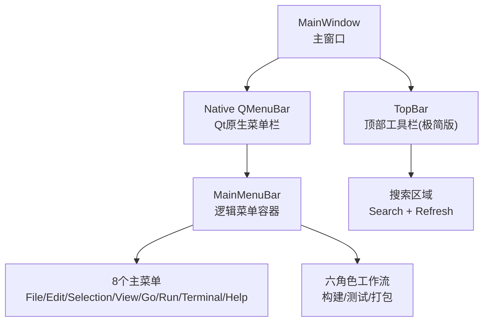
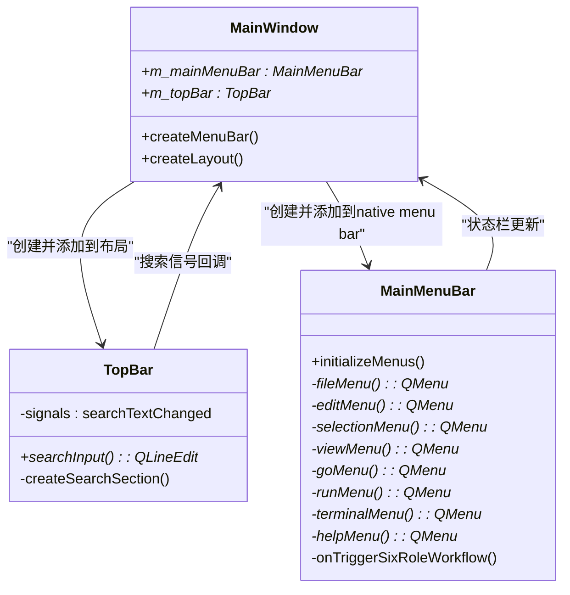
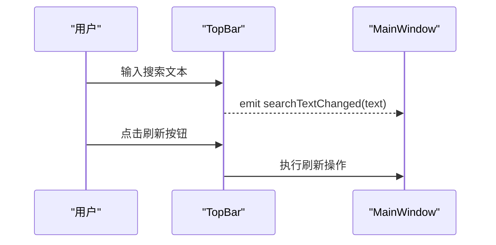
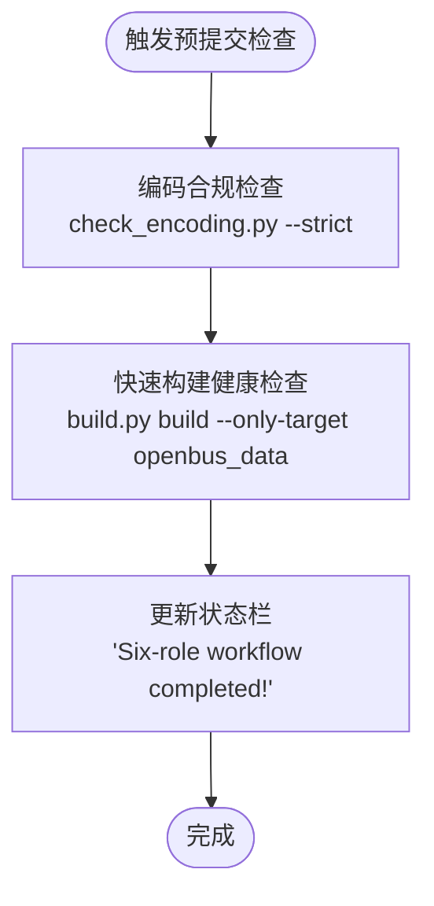
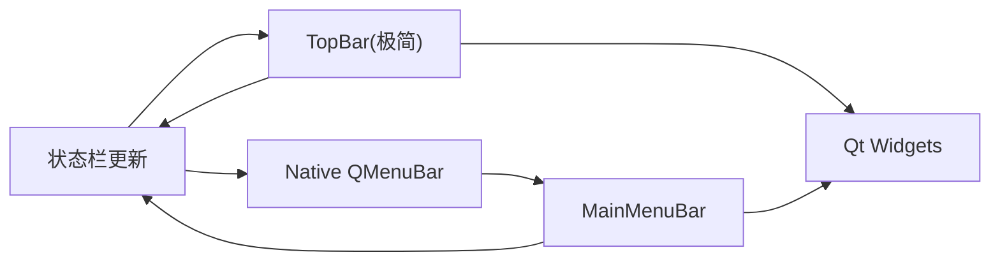

# VSCode风格顶部栏与菜单栏系统

<cite>
**本文引用的文件**
- [mainwindow_chrome.cpp](file://src/ui/mainwindow_chrome.cpp)
- [mainwindow.h](file://src/ui/mainwindow.h)
- [TOPBAR-CLEANUP-STATUS.md](file://doc/TOPBAR-CLEANUP-STATUS.md)
- [TOPBAR-INTEGRATION-ANALYSIS.md](file://doc/TOPBAR-INTEGRATION-ANALYSIS.md)
- [menubar.html](file://UI/partials/menubar.html)
- [ui-prototype.js](file://UI/js/ui-prototype.js)
</cite>

## 更新摘要
**变更内容**
- TopBar组件重大简化：移除了createFoldButtons()函数和所有侧边栏切换功能
- TopBar现在主要作为搜索和实用工具界面，不再具备面板管理能力
- 架构进一步解耦：TopBar专注于搜索功能，面板管理职责完全移除
- 代码量大幅减少，职责更加单一明确

## 目录
1. [简介](#简介)
2. [项目结构](#项目结构)
3. [核心组件](#核心组件)
4. [架构总览](#架构总览)
5. [详细组件分析](#详细组件分析)
6. [依赖关系分析](#依赖关系分析)
7. [性能考虑](#性能考虑)
8. [故障排查指南](#故障排查指南)
9. [结论](#结论)
10. [附录](#附录)

## 简介
本系统实现了VSCode风格的顶部工具栏与菜单栏分离架构，经过最新重构进一步优化了代码结构和职责划分：
- **TopBar组件**：极简设计，专注于搜索功能和实用工具，移除了所有面板管理功能
- **MainMenuBar组件**：完整实现VSCode风格的8个主菜单，独立管理菜单逻辑
- **Qt原生菜单栏集成**：使用QMainWindow的native menu bar，TopBar完全专注于搜索
- **六角色工作流深度集成**：通过Run菜单触发构建、测试、打包等自动化流程

本次重构显著提升了代码可维护性，TopBar从复杂的面板管理器简化为纯粹的搜索工具界面。

## 项目结构
重构后的项目结构采用极简的职责分离：



**图表来源**
- [mainwindow_chrome.cpp:100-124](file://src/ui/mainwindow_chrome.cpp#L100-L124)
- [menubar.html:1-57](file://UI/partials/menubar.html#L1-L57)
- [ui-prototype.js:1-168](file://UI/js/ui-prototype.js#L1-L168)

**章节来源**
- [mainwindow_chrome.cpp:100-124](file://src/ui/mainwindow_chrome.cpp#L100-L124)
- [TOPBAR-CLEANUP-STATUS.md:1-23](file://doc/TOPBAR-CLEANUP-STATUS.md#L1-L23)
- [TOPBAR-INTEGRATION-ANALYSIS.md:1-59](file://doc/TOPBAR-INTEGRATION-ANALYSIS.md#L1-L59)

## 核心组件

### TopBar组件（极简重构后）
最新的TopBar实现了极简设计，专注于搜索功能：

- **搜索区域**：居中的搜索输入框（placeholder: "Search"）+ 刷新按钮，支持实时文本变化事件
- **信号接口**：`searchTextChanged`信号用于与上层通信
- **无面板管理**：完全移除了折叠按钮和面板控制功能

### MainMenuBar组件
独立的菜单栏组件，负责完整的菜单功能：

- **8个主菜单**：File、Edit、Selection、View、Go、Run、Terminal、Help
- **快捷键绑定**：标准快捷键如Ctrl+B（构建）、Ctrl+T（测试）、Alt+P（预提交检查）
- **六角色工作流**：一键触发全量工作流，串联设计审查、编码检查、质量验证等步骤
- **状态栏集成**：操作反馈通过状态栏显示

**章节来源**
- [mainwindow_chrome.cpp:100-124](file://src/ui/mainwindow_chrome.cpp#L100-L124)
- [TOPBAR-INTEGRATION-ANALYSIS.md:5-33](file://doc/TOPBAR-INTEGRATION-ANALYSIS.md#L5-L33)

## 架构总览
最新的架构实现了TopBar与面板管理的完全解耦：



**图表来源**
- [mainwindow_chrome.cpp:100-124](file://src/ui/mainwindow_chrome.cpp#L100-L124)
- [TOPBAR-INTEGRATION-ANALYSIS.md:15-33](file://doc/TOPBAR-INTEGRATION-ANALYSIS.md#L15-L33)

## 详细组件分析

### TopBar组件极简重构分析
最新的TopBar实现了真正的极简设计，专注于搜索功能：

#### 搜索区域实现
- **居中布局**：使用`layout->addStretch(1)`实现搜索框在工具栏中居中显示
- **实时搜索**：`textChanged`信号连接到相应的槽函数处理搜索逻辑
- **样式定制**：浅灰色背景，蓝色边框高亮

#### 移除的功能
- **折叠按钮**：完全移除了左侧活动栏切换按钮
- **面板控制**：移除了右侧面板和底部输出控制面板
- **侧边栏管理**：不再具备任何面板管理能力



**图表来源**
- [mainwindow_chrome.cpp:100-124](file://src/ui/mainwindow_chrome.cpp#L100-L124)

**章节来源**
- [TOPBAR-CLEANUP-STATUS.md:4-21](file://doc/TOPBAR-CLEANUP-STATUS.md#L4-L21)
- [TOPBAR-INTEGRATION-ANALYSIS.md:5-33](file://doc/TOPBAR-INTEGRATION-ANALYSIS.md#L5-L33)

### MainMenuBar组件分析
MainMenuBar保持完整的VSCode风格菜单功能：

#### 六角色工作流集成
Run菜单中的"预提交检查"功能集成了完整的自动化流程：



**图表来源**
- [TOPBAR-INTEGRATION-ANALYSIS.md:11-14](file://doc/TOPBAR-INTEGRATION-ANALYSIS.md#L11-L14)

#### 菜单项组织
- **File菜单**：项目操作（新建/打开/保存/导出报告/退出）
- **Edit菜单**：编辑操作 + 编码检查 + 变更审查
- **Selection菜单**：设计器查看器（设计方案/架构图/模块规范）
- **View菜单**：视图控制 + 评审仪表盘 + 编译器控制台
- **Go菜单**：导航操作（后退/前进/跳转）
- **Run菜单**：构建/测试/打包 + 六角色工作流
- **Terminal菜单**：终端操作（待实现）
- **Help菜单**：文档中心 + 六角色指南 + 关于

**章节来源**
- [TOPBAR-INTEGRATION-ANALYSIS.md:11-14](file://doc/TOPBAR-INTEGRATION-ANALYSIS.md#L11-L14)

### 集成方式分析
最新的集成方式更加简洁清晰：

#### createMenuBar()方法
```cpp
void MainWindow::createMenuBar()
{
    // 创建Qt原生菜单栏
    QMenuBar *nativeMenuBar = menuBar();
    
    // 创建MainMenuBar作为逻辑容器
    m_mainMenuBar = new MainMenuBar(this, this);
    nativeMenuBar->addMenu(m_mainMenuBar->fileMenu());
    // ... 添加其他菜单
    
    // 创建极简TopBar（仅包含搜索功能）
    m_topBar = new TopBar(this, this);
}
```

#### createLayout()方法
TopBar被添加到顶层容器中，位于编辑器区域之上：

```cpp
void MainWindow::createLayout()
{
    auto *topLevelContainer = new QWidget(this);
    auto *topLevelLayout = new QVBoxLayout(topLevelContainer);
    
    // 添加极简TopBar
    if (m_topBar) {
        topLevelLayout->addWidget(m_topBar);
    }
    
    setCentralWidget(topLevelContainer);
    // ... 其他布局逻辑
}
```

**章节来源**
- [mainwindow_chrome.cpp:100-124](file://src/ui/mainwindow_chrome.cpp#L100-L124)
- [TOPBAR-INTEGRATION-ANALYSIS.md:26-33](file://doc/TOPBAR-INTEGRATION-ANALYSIS.md#L26-L33)

## 依赖关系分析
最新的依赖关系更加清晰简单：



**图表来源**
- [mainwindow_chrome.cpp:100-124](file://src/ui/mainwindow_chrome.cpp#L100-L124)
- [TOPBAR-INTEGRATION-ANALYSIS.md:15-33](file://doc/TOPBAR-INTEGRATION-ANALYSIS.md#L15-L33)

**章节来源**
- [mainwindow_chrome.cpp:100-124](file://src/ui/mainwindow_chrome.cpp#L100-L124)
- [TOPBAR-CLEANUP-STATUS.md:17-21](file://doc/TOPBAR-CLEANUP-STATUS.md#L17-L21)

## 性能考虑
最新重构带来的性能优势：

- **代码量大幅减少**：TopBar从复杂的面板管理器简化为纯搜索工具，代码量显著降低
- **职责高度单一**：TopBar只负责搜索，MainMenuBar只负责菜单，职责边界清晰
- **内存占用优化**：移除了不必要的面板管理对象和事件处理器
- **响应速度提升**：简化的TopBar减少了UI渲染和事件处理的开销

## 故障排查指南
最新重构后的常见问题及解决方案：

- **TopBar不显示**：检查`createLayout()`中是否正确添加TopBar到布局
- **菜单无响应**：确认MainMenuBar已正确添加到native menu bar
- **搜索框无响应**：验证`textChanged`信号连接是否正确
- **面板功能失效**：确认面板管理功能已完全移除，不应再调用相关方法

**章节来源**
- [mainwindow_chrome.cpp:100-124](file://src/ui/mainwindow_chrome.cpp#L100-L124)
- [TOPBAR-CLEANUP-STATUS.md:10-21](file://doc/TOPBAR-CLEANUP-STATUS.md#L10-L21)

## 结论
本次TopBar组件的最新重构成功实现了以下目标：

1. **极致简化**：从复杂的面板管理器简化为纯粹的搜索工具
2. **职责清晰**：TopBar专注于搜索，MainMenuBar专注菜单功能
3. **架构优化**：完全移除了面板管理职责，符合单一职责原则
4. **性能提升**：代码量减少，内存占用降低，响应速度提升

重构后的系统具有更好的可维护性和扩展性，为后续功能开发奠定了坚实基础。

## 附录
- 重构状态文档：[TOPBAR-CLEANUP-STATUS.md](file://doc/TOPBAR-CLEANUP-STATUS.md)
- 集成分析文档：[TOPBAR-INTEGRATION-ANALYSIS.md](file://doc/TOPBAR-INTEGRATION-ANALYSIS.md)

**章节来源**
- [TOPBAR-CLEANUP-STATUS.md:1-23](file://doc/TOPBAR-CLEANUP-STATUS.md#L1-L23)
- [TOPBAR-INTEGRATION-ANALYSIS.md:1-59](file://doc/TOPBAR-INTEGRATION-ANALYSIS.md#L1-L59)