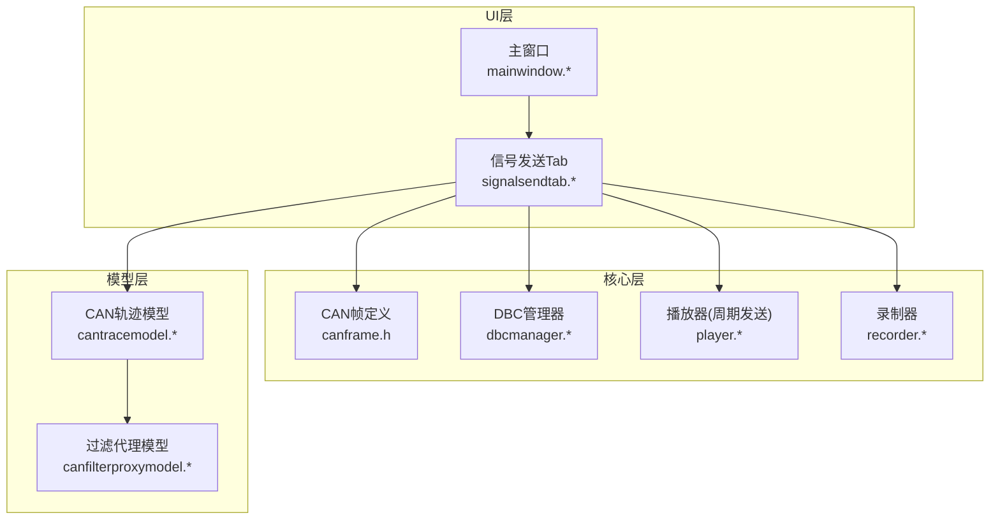
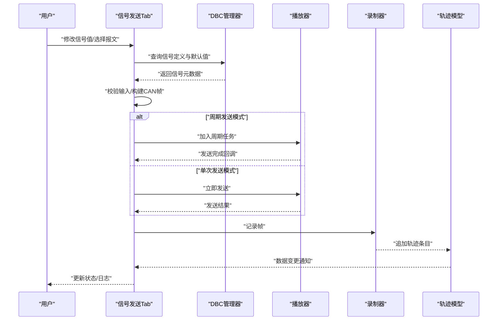
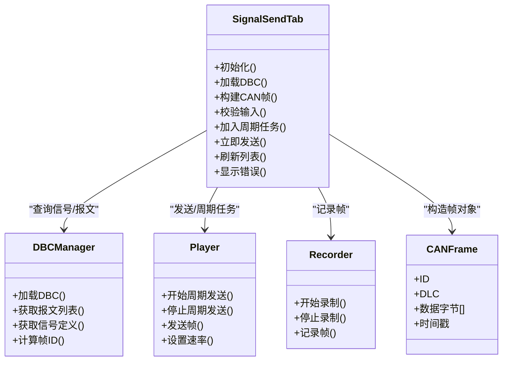
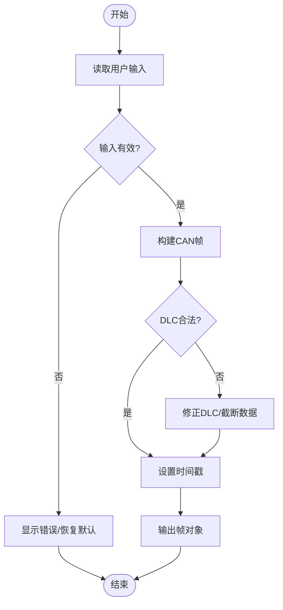
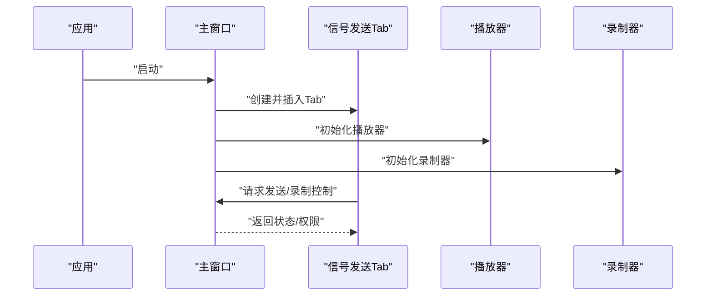
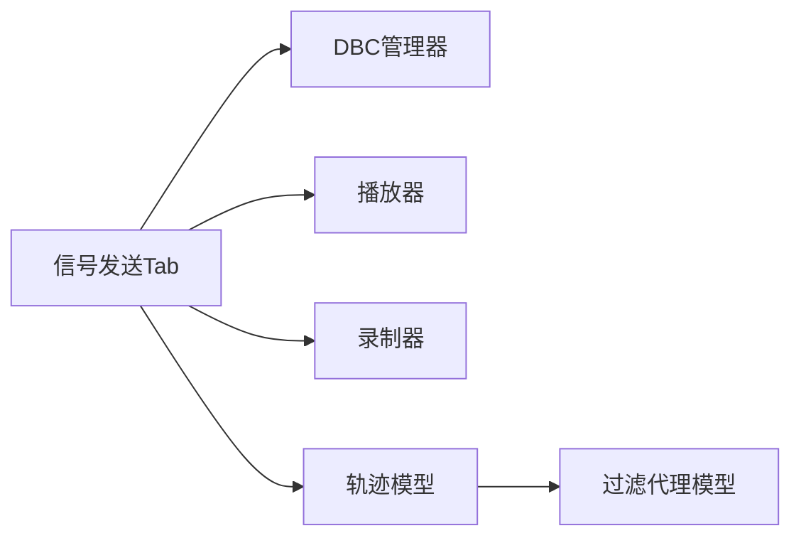

# 信号发送Tab组件

<cite>
**本文引用的文件**   
- [signalsendtab.h](file://src/ui/signalsendtab.h)
- [signalsendtab.cpp](file://src/ui/signalsendtab.cpp)
- [mainwindow.h](file://src/ui/mainwindow.h)
- [mainwindow.cpp](file://src/ui/mainwindow.cpp)
- [canframe.h](file://src/core/canframe.h)
- [dbcmanager.h](file://src/core/dbcmanager.h)
- [player.h](file://src/core/player.h)
- [recorder.h](file://src/core/recorder.h)
- [cantracemodel.h](file://src/models/cantracemodel.h)
- [canfilterproxymodel.h](file://src/models/canfilterproxymodel.h)
</cite>

## 目录
1. [简介](#简介)
2. [项目结构](#项目结构)
3. [核心组件](#核心组件)
4. [架构总览](#架构总览)
5. [详细组件分析](#详细组件分析)
6. [依赖关系分析](#依赖关系分析)
7. [性能考虑](#性能考虑)
8. [故障排查指南](#故障排查指南)
9. [结论](#结论)
10. [附录](#附录)

## 简介
本文件围绕“信号发送Tab组件”进行系统化文档化，面向开发者与使用者，解释该组件的职责、交互流程、数据模型与错误处理策略。该组件用于在CAN总线仿真工具中配置并发送DBC定义的信号帧，支持按周期或手动触发发送，并与播放/录制、过滤与追踪等模块协同工作。

## 项目结构
- UI层：Qt界面组件，包含信号发送Tab的视图与交互逻辑。
- 核心层：CAN帧定义、DBC解析与管理、播放器（周期性发送）、录制器（记录总线活动）。
- 模型层：CAN轨迹模型与过滤代理模型，支撑列表展示与筛选。
- 入口与主窗口：应用启动与UI布局管理，集成各面板与Tab页。

图表来源
- [mainwindow.h](file://src/ui/mainwindow.h)
- [mainwindow.cpp](file://src/ui/mainwindow.cpp)
- [signalsendtab.h](file://src/ui/signalsendtab.h)
- [signalsendtab.cpp](file://src/ui/signalsendtab.cpp)
- [canframe.h](file://src/core/canframe.h)
- [dbcmanager.h](file://src/core/dbcmanager.h)
- [player.h](file://src/core/player.h)
- [recorder.h](file://src/core/recorder.h)
- [cantracemodel.h](file://src/models/cantracemodel.h)
- [canfilterproxymodel.h](file://src/models/canfilterproxymodel.h)

章节来源
- [signalsendtab.h](file://src/ui/signalsendtab.h)
- [signalsendtab.cpp](file://src/ui/signalsendtab.cpp)
- [mainwindow.h](file://src/ui/mainwindow.h)
- [mainwindow.cpp](file://src/ui/mainwindow.cpp)

## 核心组件
- 信号发送Tab：提供信号选择、参数编辑、发送模式（单次/周期）控制、发送队列管理与状态反馈。
- DBC管理器：加载DBC文件，提供信号、报文、通道映射查询能力。
- 播放器：负责周期性生成并发送CAN帧，支持启停与速率控制。
- 录制器：捕获总线活动，记录到文件或内存，供回放与分析。
- 轨迹模型与过滤代理：为UI列表提供数据源与过滤能力。

章节来源
- [signalsendtab.h](file://src/ui/signalsendtab.h)
- [signalsendtab.cpp](file://src/ui/signalsendtab.cpp)
- [dbcmanager.h](file://src/core/dbcmanager.h)
- [player.h](file://src/core/player.h)
- [recorder.h](file://src/core/recorder.h)
- [cantracemodel.h](file://src/models/cantracemodel.h)
- [canfilterproxymodel.h](file://src/models/canfilterproxymodel.h)

## 架构总览
信号发送Tab作为UI控制器，协调用户输入与底层发送/录制/追踪能力。典型调用链包括：
- 用户编辑信号值 → Tab校验与构建CAN帧 → 播放器发送或立即发送 → 录制器记录 → 轨迹模型更新 → UI刷新。

图表来源
- [signalsendtab.cpp](file://src/ui/signalsendtab.cpp)
- [dbcmanager.h](file://src/core/dbcmanager.h)
- [player.h](file://src/core/player.h)
- [recorder.h](file://src/core/recorder.h)
- [cantracemodel.h](file://src/models/cantracemodel.h)

## 详细组件分析

### 信号发送Tab类设计
- 职责：维护信号列表、编辑控件、发送模式开关、发送队列、状态显示；与DBC、播放器、录制器、轨迹模型交互。
- 关键方法：初始化界面、加载DBC、构建帧、校验输入、启停周期发送、单发、刷新列表、错误提示。
- 事件与槽：响应控件变化、定时器触发、模型数据变更、发送结果回调。

图表来源
- [signalsendtab.h](file://src/ui/signalsendtab.h)
- [signalsendtab.cpp](file://src/ui/signalsendtab.cpp)
- [dbcmanager.h](file://src/core/dbcmanager.h)
- [player.h](file://src/core/player.h)
- [recorder.h](file://src/core/recorder.h)
- [canframe.h](file://src/core/canframe.h)

章节来源
- [signalsendtab.h](file://src/ui/signalsendtab.h)
- [signalsendtab.cpp](file://src/ui/signalsendtab.cpp)

### 信号值校验与帧构建流程
- 输入校验：范围检查、单位换算、符号位处理、长度对齐。
- 帧构建：根据DBC填充数据字段、计算校验和（如需要）、设置DLC与时间戳。
- 异常分支：非法输入回退默认值、抛出错误提示、跳过无效帧。

图表来源
- [signalsendtab.cpp](file://src/ui/signalsendtab.cpp)
- [canframe.h](file://src/core/canframe.h)

章节来源
- [signalsendtab.cpp](file://src/ui/signalsendtab.cpp)
- [canframe.h](file://src/core/canframe.h)

### 与主窗口的集成
- 主窗口负责创建并嵌入信号发送Tab，管理Tab切换与生命周期。
- 通过接口暴露播放器与录制器的启停控制，确保发送与录制状态一致。

图表来源
- [mainwindow.h](file://src/ui/mainwindow.h)
- [mainwindow.cpp](file://src/ui/mainwindow.cpp)
- [signalsendtab.h](file://src/ui/signalsendtab.h)
- [player.h](file://src/core/player.h)
- [recorder.h](file://src/core/recorder.h)

章节来源
- [mainwindow.h](file://src/ui/mainwindow.h)
- [mainwindow.cpp](file://src/ui/mainwindow.cpp)
- [signalsendtab.h](file://src/ui/signalsendtab.h)

## 依赖关系分析
- 松耦合：信号发送Tab通过接口与DBC管理器、播放器、录制器交互，避免直接实现细节耦合。
- 数据流：从用户输入到CAN帧，再到录制与轨迹模型，形成单向数据流，便于调试与扩展。
- 潜在循环：需确保Tab不反向依赖模型层的内部实现，仅通过接口访问。

图表来源
- [signalsendtab.h](file://src/ui/signalsendtab.h)
- [dbcmanager.h](file://src/core/dbcmanager.h)
- [player.h](file://src/core/player.h)
- [recorder.h](file://src/core/recorder.h)
- [cantracemodel.h](file://src/models/cantracemodel.h)
- [canfilterproxymodel.h](file://src/models/canfilterproxymodel.h)

章节来源
- [signalsendtab.h](file://src/ui/signalsendtab.h)
- [cantracemodel.h](file://src/models/cantracemodel.h)
- [canfilterproxymodel.h](file://src/models/canfilterproxymodel.h)

## 性能考虑
- 批量构建：对周期发送场景，预构建帧缓存，减少重复计算。
- 异步发送：将发送操作放入独立线程或事件循环，避免阻塞UI。
- 高效过滤：使用代理模型增量更新，降低列表重绘开销。
- 资源管理：合理释放DBC解析结果与临时缓冲区，避免内存泄漏。

[本节为通用指导，无需引用具体文件]

## 故障排查指南
- 输入校验失败：检查数值范围、单位换算、符号位处理逻辑，确认默认值回退路径。
- 帧构建异常：核对DLC、字节序、字段偏移，验证时间戳来源。
- 发送无响应：确认播放器已启动、通道可用、速率设置正确。
- 录制为空：检查录制器状态、写入权限、存储路径。
- 列表不刷新：确认模型数据变更信号已发出，UI绑定未断开。

章节来源
- [signalsendtab.cpp](file://src/ui/signalsendtab.cpp)
- [player.h](file://src/core/player.h)
- [recorder.h](file://src/core/recorder.h)
- [cantracemodel.h](file://src/models/cantracemodel.h)

## 结论
信号发送Tab组件以清晰的职责划分与稳定的数据流，实现了DBC信号的可配置发送与可视化反馈。通过与播放器、录制器与轨迹模型的协作，提供了完整的开发测试体验。建议在后续迭代中加强异步处理与性能优化，提升大规模信号集下的响应速度与稳定性。

[本节为总结性内容，无需引用具体文件]

## 附录
- 术语说明：
  - DBC：CAN数据库描述文件，定义报文与信号。
  - 周期发送：按固定间隔自动发送帧。
  - 轨迹模型：用于展示总线上的帧历史。
- 最佳实践：
  - 始终对用户输入进行严格校验并提供明确错误提示。
  - 使用统一的错误码与日志级别，便于问题定位。
  - 保持UI与业务逻辑解耦，便于单元测试与重构。

[本节为补充信息，无需引用具体文件]