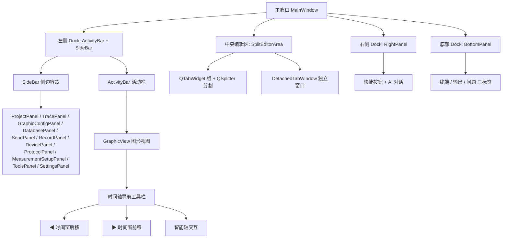
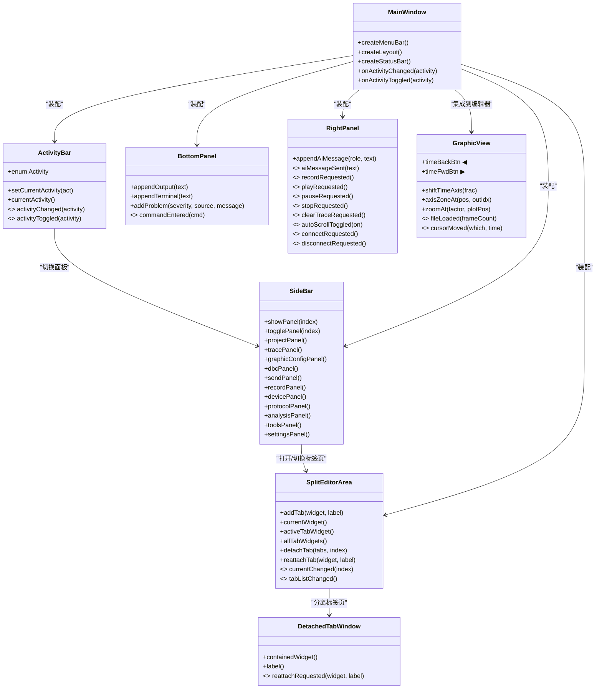
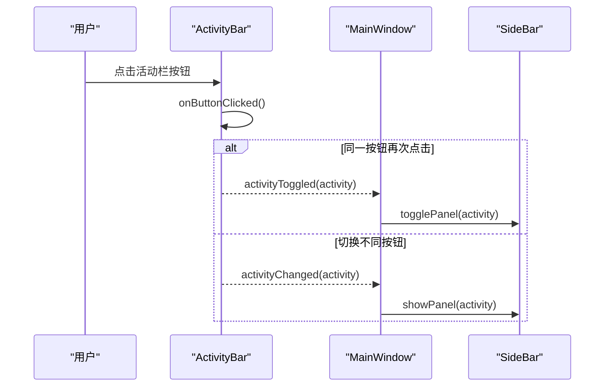
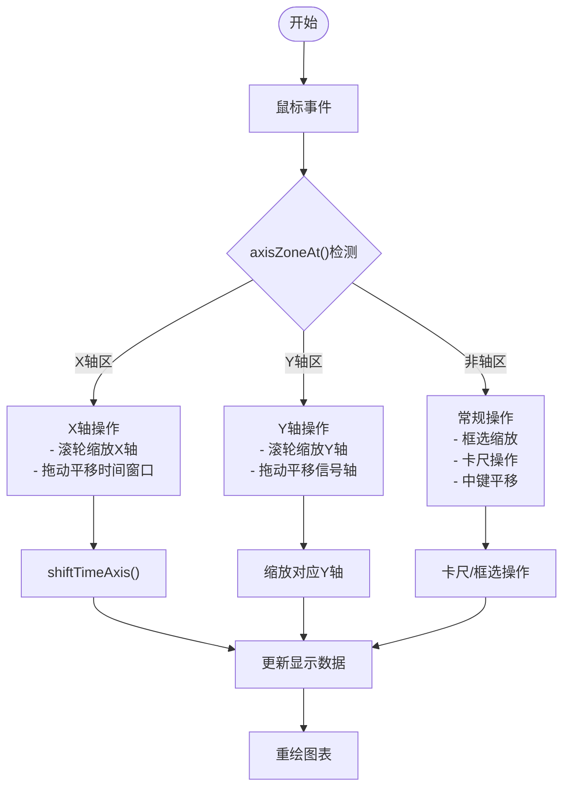
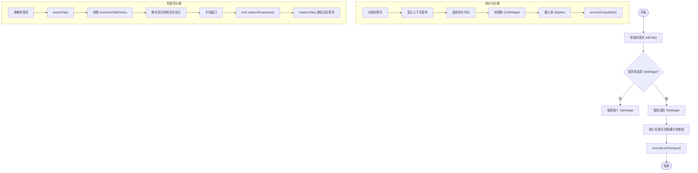
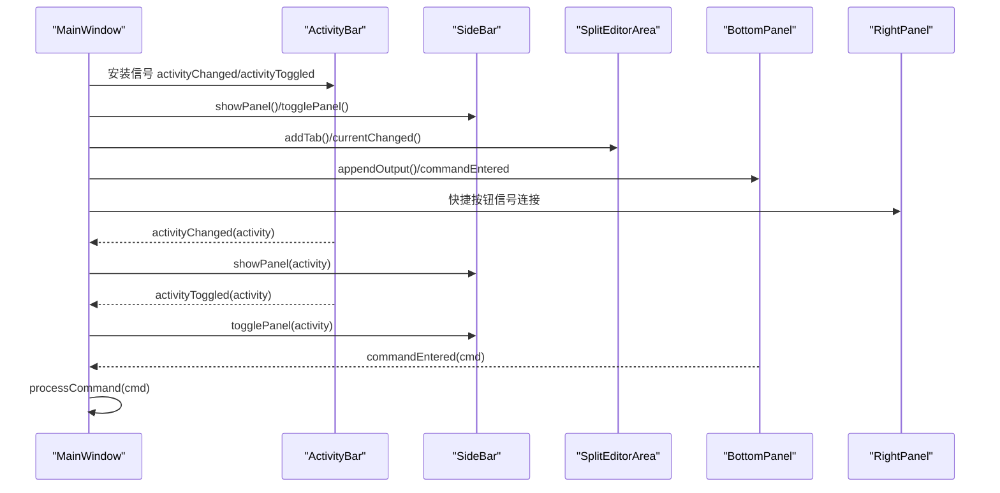
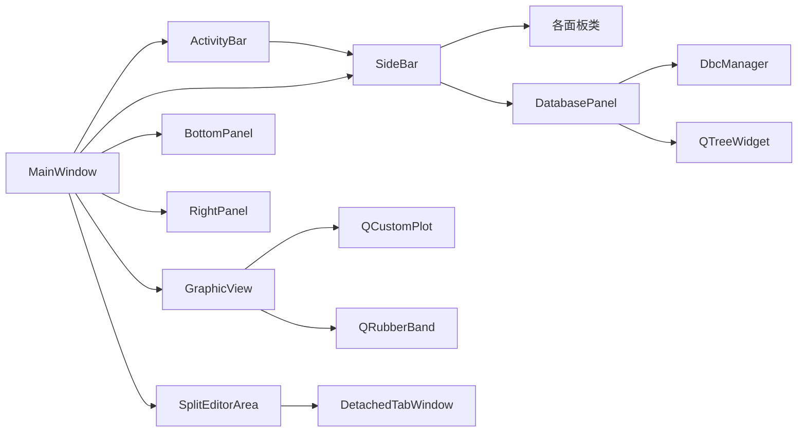

# 工具栏系统

<cite>
**本文引用的文件**   
- [README.md](file://README.md)
- [main.cpp](file://src/main.cpp)
- [mainwindow.h](file://src/ui/mainwindow.h)
- [mainwindow.cpp](file://src/ui/mainwindow.cpp)
- [activitybar.h](file://src/ui/activitybar.h)
- [activitybar.cpp](file://src/ui/activitybar.cpp)
- [sidebarpanels.h](file://src/ui/panels/sidebarpanels.h)
- [sidebarpanels.cpp](file://src/ui/panels/sidebarpanels.cpp)
- [bottompanel.h](file://src/ui/bottompanel.h)
- [rightpanel.h](file://src/ui/rightpanel.h)
- [spliteditorarea.h](file://src/ui/spliteditorarea.h)
- [spliteditorarea.cpp](file://src/ui/spliteditorarea.cpp)
- [graphicview.h](file://src/ui/graphicview.h)
- [graphicview.cpp](file://src/ui/graphicview.cpp)
- [ui-prototype.html](file://UI/ui-prototype.html)
- [menubar.html](file://UI/partials/menubar.html)
- [bottom-dock.html](file://UI/partials/bottom-dock.html)
</cite>

## 更新摘要
**变更内容**   
- 图形视图时间轴导航增强：新增时间窗口移动工具栏按钮（◀ ▶），支持按住连续移动
- 轴交互能力改进：实现直接轴拖动功能，支持X轴区平移时间和Y轴区平移对应信号
- 上下文感知缩放：基于axisZoneAt()方法的智能区域检测，滚轮缩放根据鼠标位置自动判断作用域
- 新增shiftTimeAxis()方法：提供程序化时间轴平移接口，支持比例参数控制
- 轴区域检测系统：完整的axisZoneAt()实现，区分X轴区、Y轴区和非轴区三种状态

## 目录
1. [简介](#简介)
2. [项目结构](#项目结构)
3. [核心组件](#核心组件)
4. [架构总览](#架构总览)
5. [详细组件分析](#详细组件分析)
6. [依赖关系分析](#依赖关系分析)
7. [性能考量](#性能考量)
8. [故障排查指南](#故障排查指南)
9. [结论](#结论)
10. [附录](#附录)

## 简介
本文件聚焦于"工具栏系统"，即基于 Qt6 的 VS Code 风格界面中的左侧活动栏（ActivityBar）、侧边面板（SideBar）、底部面板（BottomPanel）、右侧面板（RightPanel）以及可拆分编辑器区域（SplitEditorArea）的整体设计与实现。该子系统负责：
- 提供统一的功能入口与导航（活动栏图标、侧边面板切换）
- 管理主编辑区的多标签页与拆分布局
- 承载输出、终端、问题等辅助信息展示
- 提供快捷操作按钮与状态反馈

整体设计遵循"入口—容器—内容"的分层思想，通过信号/槽机制将 UI 事件与业务逻辑解耦，确保可扩展性与可维护性。

**更新** 图形视图时间轴导航功能得到显著增强，新增时间窗口移动工具和智能轴交互能力，提供更直观的波形浏览体验。

## 项目结构
工具栏系统相关代码主要分布在以下位置：
- src/ui/activitybar.*：左侧活动栏（功能图标入口）
- src/ui/panels/sidebarpanels.{h,cpp}：侧边栏各面板定义与容器 SideBar
- src/ui/spliteditorarea.{h,cpp}：可拆分编辑器区域与标签页分离窗口
- src/ui/bottompanel.h：底部面板（终端/输出/问题）
- src/ui/rightpanel.h：右侧面板（AI 对话 + 快捷按钮）
- src/ui/graphicview.{h,cpp}：图形视图组件（含增强的时间轴导航）
- src/ui/mainwindow.{h,cpp}：主窗口装配与交互编排
- UI/*：原型 HTML/CSS/JS，用于可视化预览与交互演示

**图表来源**
- [mainwindow.cpp:463-548](file://src/ui/mainwindow.cpp#L463-L548)
- [activitybar.h:15-62](file://src/ui/activitybar.h#L15-L62)
- [sidebarpanels.h:310-346](file://src/ui/panels/sidebarpanels.h#L310-L346)
- [spliteditorarea.h:15-99](file://src/ui/spliteditorarea.h#L15-L99)
- [bottompanel.h:16-50](file://src/ui/bottompanel.h#L16-L50)
- [rightpanel.h:14-54](file://src/ui/rightpanel.h#L14-L54)
- [graphicview.h:161-247](file://src/ui/graphicview.h#L161-L247)

章节来源
- [mainwindow.cpp:463-548](file://src/ui/mainwindow.cpp#L463-L548)
- [README.md:235-278](file://README.md#L235-L278)

## 核心组件
- 活动栏 ActivityBar
  - 固定宽度竖条，放置功能图标按钮；点击切换 SideBar 显示的面板，再次点击同一按钮可隐藏 SideBar。
  - 维护当前活动项枚举，并通过信号通知上层进行联动。
- 侧边栏 SideBar 与各面板
  - 使用 QStackedWidget 作为容器，索引与 ActivityBar::Activity 枚举一致。
  - 包含工程、Trace、Graphic、数据库、发送、录制、设备、协议、分析配置、工具集、设置等面板。
- 可拆分编辑器 SplitEditorArea
  - 支持右键拆分（向右/向下），每个拆分组为独立的 QTabWidget，组间用 QSplitter 分隔。
  - 支持标签页拖拽分离为独立窗口，关闭时重新放回主标签页。
- 底部面板 BottomPanel
  - 三个标签页：终端、输出、问题；提供命令输入与输出追加能力。
- 右侧面板 RightPanel
  - 快捷按钮（录制/回放/连接等）与 AI 对话输入输出。
- 图形视图 GraphicView
  - **增强功能**：时间轴导航工具栏、智能轴交互、上下文感知缩放
  - 支持时间窗口移动、轴区拖动、滚轮缩放等功能
- 主窗口 MainWindow
  - 装配上述组件，建立信号/槽连接，协调活动栏切换、标签页打开/关闭、状态更新等。

**更新** 图形视图组件新增了强大的时间轴导航和轴交互功能，包括时间窗口移动按钮、直接轴拖动和上下文感知缩放。

章节来源
- [activitybar.h:15-62](file://src/ui/activitybar.h#L15-L62)
- [activitybar.cpp:1-104](file://src/ui/activitybar.cpp#L1-L104)
- [sidebarpanels.h:310-346](file://src/ui/panels/sidebarpanels.h#L310-L346)
- [spliteditorarea.h:15-99](file://src/ui/spliteditorarea.h#L15-L99)
- [spliteditorarea.cpp:177-529](file://src/ui/spliteditorarea.cpp#L177-L529)
- [bottompanel.h:16-50](file://src/ui/bottompanel.h#L16-L50)
- [rightpanel.h:14-54](file://src/ui/rightpanel.h#L14-L54)
- [graphicview.h:161-247](file://src/ui/graphicview.h#L161-L247)
- [mainwindow.h:42-219](file://src/ui/mainwindow.h#L42-L219)
- [mainwindow.cpp:72-274](file://src/ui/mainwindow.cpp#L72-L274)

## 架构总览
工具栏系统采用"入口—容器—内容"的分层模式：
- 入口层：ActivityBar 提供功能入口，SideBar 提供面板选择。
- 容器层：SplitEditorArea 管理主编辑区布局；BottomPanel/RightPanel 提供辅助信息与控制。
- 内容层：各具体功能页面（Trace、Graphic、数据库详情、发送、录制等）以标签页形式嵌入。

**图表来源**
- [activitybar.h:15-62](file://src/ui/activitybar.h#L15-L62)
- [sidebarpanels.h:310-346](file://src/ui/panels/sidebarpanels.h#L310-L346)
- [spliteditorarea.h:15-99](file://src/ui/spliteditorarea.h#L15-L99)
- [bottompanel.h:16-50](file://src/ui/bottompanel.h#L16-L50)
- [rightpanel.h:14-54](file://src/ui/rightpanel.h#L14-L54)
- [graphicview.h:161-247](file://src/ui/graphicview.h#L161-L247)
- [mainwindow.h:42-219](file://src/ui/mainwindow.h#L42-L219)

## 详细组件分析

### 活动栏 ActivityBar
- 职责：提供窄竖条式功能入口，维护当前活动项，发出切换/折叠信号。
- 关键行为：
  - 创建多个 QToolButton，绑定 Activity 枚举值。
  - 点击处理：若点击已选中按钮则折叠 SideBar，否则切换并高亮新按钮。
  - 暴露 setCurrentActivity 供外部同步状态。
- 交互流程：
  - 用户点击 → onButtonClicked → 计算目标 Activity → 发射 activityChanged 或 activityToggled → 主窗口响应并切换 SideBar 面板或折叠/展开。

**更新** 活动栏按钮标签已从"DBC"更新为"数据库"，并提供更详细的工具提示。

**图表来源**
- [activitybar.cpp:84-103](file://src/ui/activitybar.cpp#L84-L103)
- [mainwindow.cpp:581-669](file://src/ui/mainwindow.cpp#L581-L669)

章节来源
- [activitybar.h:15-62](file://src/ui/activitybar.h#L15-L62)
- [activitybar.cpp:1-104](file://src/ui/activitybar.cpp#L1-L104)
- [mainwindow.cpp:581-669](file://src/ui/mainwindow.cpp#L581-L669)

### 侧边栏 SideBar 与面板
- 职责：以 QStackedWidget 组织多个面板，索引与 ActivityBar::Activity 一一对应。
- 面板类型：
  - ProjectPanel：工程列表与最近打开记录
  - TracePanel：Trace 标签页列表与新建
  - GraphicConfigPanel：Graphic 页面管理与新增
  - **DatabasePanel**：多协议数据库文件树与导入（原DbcPanel）
  - SendPanel/RecordPanel：发送/录制入口
  - DevicePanel：设备连接控制
  - ProtocolPanel：上层协议入口
  - MeasurementSetupPanel：测量配置入口
  - ToolsPanel：工具集入口
  - SettingsPanel：设置与主题切换
- 关键方法：showPanel(index)、togglePanel(index)，以及各面板对外暴露的信号。

**更新** DatabasePanel（原DbcPanel）现已支持多协议解析和树形层次化组织。

章节来源
- [sidebarpanels.h:310-346](file://src/ui/panels/sidebarpanels.h#L310-L346)

### 图形视图 GraphicView 的时间轴导航增强
- 职责：提供CAN总线信号的图形化显示，现包含增强的时间轴导航功能。
- **新增时间轴导航工具栏**：
  - **◀ 时间窗后移按钮**：向左移动时间窗口，支持按住连续移动
  - **▶ 时间窗前移按钮**：向右移动时间窗口，支持按住连续移动
  - 按钮配置了自动重复功能（延迟300ms，间隔60ms）
- **shiftTimeAxis()方法**：
  - 接受比例参数（frac），按视口宽度的比例移动时间轴
  - 支持连续调用合并为一级缩放历史，避免频繁记录
  - 与滚轮缩放共享防抖机制，提升用户体验
- **智能轴交互系统**：
  - **axisZoneAt()方法**：检测鼠标位置所在的轴区域
    - 返回值1：X轴刻度区（仅影响X轴缩放/平移）
    - 返回值2：Y轴刻度区（仅影响对应Y轴缩放/平移）
    - 返回值0：非轴区（常规绘图区交互）
  - **直接轴拖动**：在轴区按下左键可直接拖动平移
    - X轴区拖动：平移整个时间窗口
    - Y轴区拖动：平移对应信号轴的数值范围
  - **上下文感知缩放**：滚轮缩放根据鼠标位置自动判断作用域
    - 在X轴区：仅缩放X轴（时间窗口）
    - 在Y轴区：仅缩放对应Y轴（信号幅度）
    - 在绘图区：根据缩放轴模式决定X/Y缩放

**图表来源**
- [graphicview.cpp:1796-1834](file://src/ui/graphicview.cpp#L1796-L1834)
- [graphicview.cpp:1953-1965](file://src/ui/graphicview.cpp#L1953-L1965)
- [graphicview.cpp:722-757](file://src/ui/graphicview.cpp#L722-L757)

**更新** 图形视图组件现在提供了完整的时间轴导航解决方案，包括直观的工具栏按钮和智能的轴交互功能。

章节来源
- [graphicview.h:161-247](file://src/ui/graphicview.h#L161-L247)
- [graphicview.cpp:300-499](file://src/ui/graphicview.cpp#L300-L499)
- [graphicview.cpp:540-739](file://src/ui/graphicview.cpp#L540-L739)
- [graphicview.cpp:1000-1199](file://src/ui/graphicview.cpp#L1000-L1199)
- [graphicview.cpp:1796-1834](file://src/ui/graphicview.cpp#L1796-L1834)
- [graphicview.cpp:1953-1965](file://src/ui/graphicview.cpp#L1953-L1965)

### 可拆分编辑器 SplitEditorArea
- 职责：管理主编辑区的多标签页与拆分布局，支持标签页分离到独立窗口。
- 关键能力：
  - addTab：向活跃 TabWidget 添加标签页
  - splitTab：按方向（水平/垂直）拆分出新的 QTabWidget
  - detachTab/reattachTab：标签页分离与回归
  - removeEmptySplits：清理空分割器
- 交互流程：
  - 右键标签栏 → 上下文菜单 → 选择拆分/分离 → 更新布局与信号通知。

**图表来源**
- [spliteditorarea.cpp:212-224](file://src/ui/spliteditorarea.cpp#L212-L224)
- [spliteditorarea.cpp:482-518](file://src/ui/spliteditorarea.cpp#L482-L518)
- [spliteditorarea.cpp:253-303](file://src/ui/spliteditorarea.cpp#L253-L303)

章节来源
- [spliteditorarea.h:15-99](file://src/ui/spliteditorarea.h#L15-L99)
- [spliteditorarea.cpp:177-529](file://src/ui/spliteditorarea.cpp#L177-L529)

### 底部面板 BottomPanel
- 职责：提供终端、输出、问题三个标签页，支持命令输入与日志输出。
- 关键接口：appendOutput、appendTerminal、addProblem、clearProblems，以及 commandEntered 信号。
- 典型用法：主窗口在启动、加载文件、录制/回放等关键节点追加输出，便于调试与状态跟踪。

章节来源
- [bottompanel.h:16-50](file://src/ui/bottompanel.h#L16-L50)

### 右侧面板 RightPanel
- 职责：提供快捷按钮（录制、播放、暂停、停止、清空、自动滚动、连接/断开）与 AI 对话输入输出。
- 关键接口：appendAiMessage，以及一系列快捷操作信号。
- 典型用法：主窗口将这些信号连接到 Recorder/Player/模拟器等核心引擎。

章节来源
- [rightpanel.h:14-54](file://src/ui/rightpanel.h#L14-L54)

### 主窗口 MainWindow 的工具栏装配
- 职责：装配 ActivityBar、SideBar、SplitEditorArea、BottomPanel、RightPanel，建立信号/槽连接，协调活动栏切换、标签页打开/关闭、状态更新。
- 关键流程：
  - createLayout：创建左侧 Dock（ActivityBar + SideBar）、中央 SplitEditorArea、右侧 Dock（RightPanel）、底部 Dock（BottomPanel）。
  - 连接 ActivityBar 的 activityChanged/activityToggled 到 onActivityChanged/onActivityToggled，进而调用 SideBar.showPanel/togglePanel。
  - 连接 BottomPanel.commandEntered 到 onCommandEntered，解析命令并执行。
  - 连接 RightPanel 的快捷按钮信号到录制/回放/连接等操作。

**图表来源**
- [mainwindow.cpp:463-548](file://src/ui/mainwindow.cpp#L463-L548)
- [mainwindow.cpp:581-669](file://src/ui/mainwindow.cpp#L581-L669)

章节来源
- [mainwindow.h:42-219](file://src/ui/mainwindow.h#L42-L219)
- [mainwindow.cpp:72-274](file://src/ui/mainwindow.cpp#L72-L274)
- [mainwindow.cpp:463-548](file://src/ui/mainwindow.cpp#L463-L548)

## 依赖关系分析
- ActivityBar 依赖 QToolButton、QVBoxLayout，通过属性存储 Activity 枚举值。
- SideBar 依赖 QStackedWidget 与各具体面板类，索引与 ActivityBar::Activity 保持一致。
- **GraphicView** 依赖 QCustomPlot、QRubberBand，实现增强的时间轴导航和轴交互功能。
- **DatabasePanel** 依赖 QTreeWidget、DbcManager，实现多协议文件的层次化管理。
- SplitEditorArea 依赖 QSplitter、QTabWidget，管理标签页生命周期与分离窗口。
- BottomPanel/RightPanel 依赖 Qt 标准控件，通过信号向外暴露交互。
- MainWindow 作为装配者，依赖以上所有组件，承担信号路由与状态同步。

**图表来源**
- [activitybar.h:15-62](file://src/ui/activitybar.h#L15-L62)
- [sidebarpanels.h:310-346](file://src/ui/panels/sidebarpanels.h#L310-L346)
- [sidebarpanels.cpp:251-456](file://src/ui/panels/sidebarpanels.cpp#L251-L456)
- [spliteditorarea.h:15-99](file://src/ui/spliteditorarea.h#L15-L99)
- [bottompanel.h:16-50](file://src/ui/bottompanel.h#L16-L50)
- [rightpanel.h:14-54](file://src/ui/rightpanel.h#L14-L54)
- [graphicview.h:161-247](file://src/ui/graphicview.h#L161-L247)
- [mainwindow.h:42-219](file://src/ui/mainwindow.h#L42-L219)

章节来源
- [README.md:235-278](file://README.md#L235-L278)

## 性能考量
- 标签页拆分与分离：避免频繁重建 QTabWidget，仅在必要时创建；清理空分割器以减少层级复杂度。
- 输出与终端：批量追加文本，避免高频刷新导致 UI 卡顿。
- 活动栏切换：仅切换可见面板，不销毁不可见面板，减少重绘开销。
- **图形视图优化**：
  - **轴交互防抖**：shiftTimeAxis()使用定时器合并连续调用，避免频繁重绘
  - **智能缩放**：axisZoneAt()快速判断作用域，减少不必要的轴操作
  - **懒加载策略**：只在需要时展开相应协议节点，提升大数据量场景下的性能表现
  - **批量重绘**：使用rpQueuedReplot模式，减少重绘频率
- 大文件导入与回放：结合后台线程与进度回调，保证 UI 响应性（参考导入流程）。

**更新** 图形视图的时间轴导航功能采用了多种性能优化策略，包括防抖机制、智能区域检测和批量重绘，确保在大量数据场景下仍能保持流畅的用户体验。

[本节为通用指导，无需特定文件引用]

## 故障排查指南
- 活动栏无响应
  - 检查 ActivityBar 按钮是否被正确创建并连接 clicked 信号。
  - 确认 onButtonClicked 中 property("activity") 取值是否正确。
- SideBar 面板未切换
  - 确认 showPanel/togglePanel 的索引与 ActivityBar::Activity 枚举一致。
  - 检查 MainWindow 的 onActivityChanged/onActivityToggled 是否被触发。
- **图形视图时间轴导航问题**
  - 检查时间窗口移动按钮（◀ ▶）是否正确连接到 shiftTimeAxis()方法
  - 确认 axisZoneAt()方法能正确识别X轴区和Y轴区
  - 验证shiftTimeAxis()的比例参数计算是否正确
  - 检查自动重复功能配置（延迟300ms，间隔60ms）是否正常
- **轴交互异常**
  - 确认axisZoneAt()返回的区域值（0/1/2）与实际鼠标位置匹配
  - 检查轴区拖动时的坐标转换是否正确
  - 验证上下文感知缩放的逻辑是否符合预期
- **数据库面板异常**
  - 检查 QTreeWidget 初始化是否正确，协议分类节点是否成功创建。
  - 确认 DbcManager 连接是否正常，文件导入对话框是否正常工作。
  - 验证文件扩展名识别逻辑，确保多协议文件正确分类。
- 标签页无法拆分或分离
  - 检查右键菜单是否启用 CustomContextMenu。
  - 确认 detachTab/reattachTab 的信号连接正常。
- 底部面板无输出
  - 确认 appendOutput/appendTerminal 被调用且未被阻塞。
  - 检查 commandEntered 信号是否连接到 onCommandEntered。
- 右侧面板快捷按钮无效
  - 检查信号连接是否成功，对应槽函数是否实现。

**更新** 新增了图形视图时间轴导航和轴交互相关的故障排查指南，涵盖按钮连接、区域检测、坐标转换等问题。

章节来源
- [activitybar.cpp:84-103](file://src/ui/activitybar.cpp#L84-L103)
- [graphicview.cpp:1796-1834](file://src/ui/graphicview.cpp#L1796-L1834)
- [graphicview.cpp:1953-1965](file://src/ui/graphicview.cpp#L1953-L1965)
- [sidebarpanels.cpp:251-456](file://src/ui/panels/sidebarpanels.cpp#L251-L456)
- [spliteditorarea.cpp:177-224](file://src/ui/spliteditorarea.cpp#L177-L224)
- [bottompanel.h:16-50](file://src/ui/bottompanel.h#L16-L50)
- [rightpanel.h:14-54](file://src/ui/rightpanel.h#L14-L54)

## 结论
工具栏系统以 ActivityBar 为入口、SideBar 为容器、SplitEditorArea 为核心编辑区，辅以 BottomPanel 与 RightPanel 提供辅助信息与快捷操作。通过清晰的信号/槽机制与模块化设计，实现了高内聚、低耦合的可扩展界面体系。

**更新** 图形视图时间轴导航功能的重大升级显著提升了系统的波形浏览能力，现在提供了直观的时间窗口移动工具和智能的轴交互功能。这些增强功能包括时间窗口移动按钮、直接轴拖动、上下文感知缩放和轴区域检测系统，为用户提供了更加专业和高效的CAN总线数据分析体验。后续可在保持现有架构的前提下，持续扩展更多面板与工具，满足多样化的总线分析需求。

[本节为总结性内容，无需特定文件引用]

## 附录
- 原型文件说明
  - ui-prototype.html：全交互原型入口，动态加载菜单栏、左右侧栏、底部 Dock、对话框等部分。
  - menubar.html：菜单栏结构与快捷键提示。
  - bottom-dock.html：底部 Dock 的终端/输出/问题三标签页示例。

章节来源
- [ui-prototype.html:1-42](file://UI/ui-prototype.html#L1-L42)
- [menubar.html:1-57](file://UI/partials/menubar.html#L1-L57)
- [bottom-dock.html:1-65](file://UI/partials/bottom-dock.html#L1-L65)